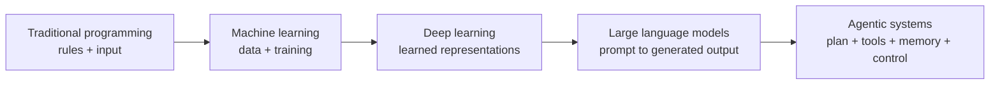
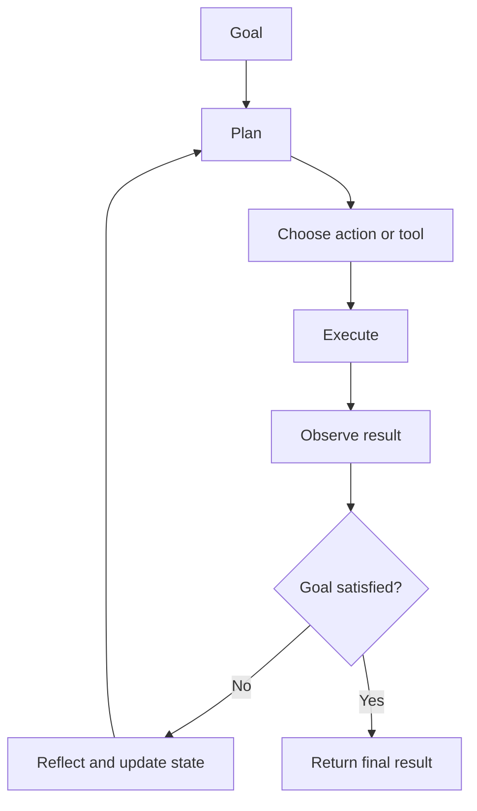
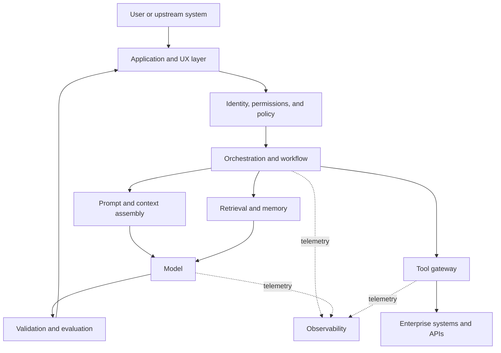
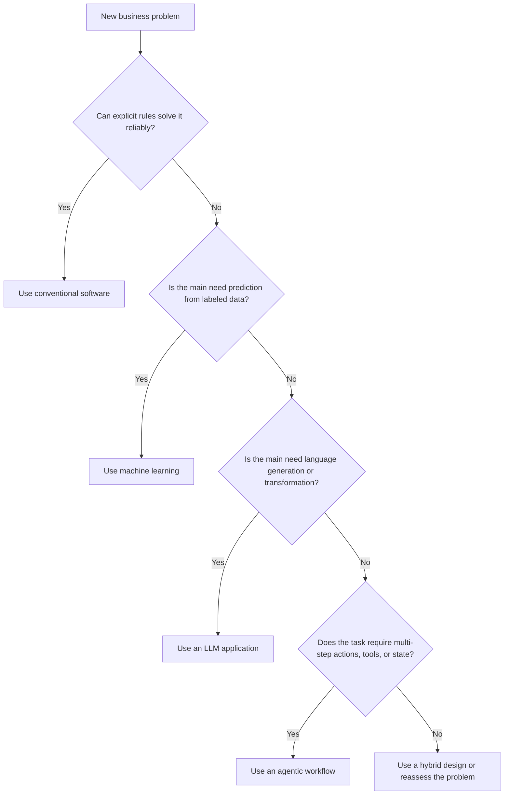

# Chapter 1 - AI Foundations: From Rules to Agents

> **Source basis:** This chapter expands the board's comparison of program rules, machine learning, neural networks, and large language models [Board, p. 51]. It also previews the board's progression from a business problem through RAG, planning, memory, tools, multi-agent coordination, guardrails, and production architecture [Board, p. 34]. The broader handbook objectives are taken from the board's learning checklist [Board, p. 5].

---

## Learning objectives

By the end of this chapter, you should be able to:

1. Explain the difference between conventional programming, machine learning, deep learning, LLM applications, and agentic systems.
2. Describe where rules, learned models, prompts, retrieval, tools, and memory fit in an AI product.
3. Distinguish a model from a complete AI system.
4. Recognize when an agent is appropriate and when a simpler design is safer and more efficient.
5. Map a business problem to an initial technical approach without treating every problem as an LLM problem.
6. Identify the major control layers needed before an AI capability becomes production-ready.

---

## 1. Why this chapter matters

AI terminology is often used as if every term describes the same thing. Teams may call a rules engine "AI," call a chatbot an "agent," or assume that a large language model is a complete product. These shortcuts create design errors because each technology has different strengths, failure modes, operating costs, and control requirements.

The board provides a useful visual comparison:

- **Input -> program rules -> output**
- **Data -> training -> model -> prediction**
- **Images/text/speech -> neural network -> learned features**
- **Prompt -> large language model -> generated output**

[Board, p. 51]

That comparison is the foundation for this chapter. We will extend it one step further:

- **Goal -> planning -> tools -> observations -> revised plan -> result**

That last pattern is what makes a system agentic.

> **Key idea**
>
> A model is a component. An AI application is a system. An agent is a system that can choose and execute actions toward a goal.

---

## 2. A practical definition of artificial intelligence

Artificial intelligence is the broad field of building systems that perform tasks associated with intelligent behavior. Depending on the application, those tasks may include:

- recognizing patterns;
- predicting outcomes;
- interpreting language;
- generating text, images, or code;
- ranking alternatives;
- recommending actions;
- planning sequences of steps;
- interacting with tools and environments;
- adapting behavior using feedback.

This definition is intentionally operational. It does not require a claim that software thinks or understands in the same way a human does. Instead, it focuses on observable capabilities and system design.

### 2.1 AI is an umbrella, not a single technique

The following are all part of AI engineering, but they solve different classes of problems:

| Approach | Central mechanism | Typical output | Example |
|---|---|---|---|
| Rule-based software | Explicit logic written by developers | Deterministic action | Eligibility validation |
| Machine learning | Patterns learned from examples | Prediction or score | Fraud probability |
| Deep learning | Multi-layer neural representation learning | Prediction, embedding, or generation | Image classification |
| LLM application | Language model conditioned by a prompt and context | Generated language or structured output | Document summarization |
| Agentic system | Model-guided action loop with tools and state | Multi-step task result | Investigate a ticket and recommend escalation |

The important engineering question is not "Which approach is most advanced?" It is "Which approach is appropriate for this problem, risk level, latency target, and operating environment?"

---

## 3. The evolution from rules to agents



The arrows in this diagram should not be interpreted as replacement. Newer methods do not eliminate older ones. Production systems commonly combine all five.

For example, an enterprise support agent may use:

- deterministic code to enforce permissions;
- a classifier to route tickets;
- an embedding model to retrieve documentation;
- an LLM to draft a response;
- an agent loop to call tools and check status;
- rules again to require human approval before a high-impact action.

The evolution is therefore an expansion of available design patterns, not a straight-line migration away from software engineering.

---

## 4. Conventional programming: explicit rules

In conventional programming, developers encode the behavior directly.

```text
Input -> Program rules -> Output
```

This is the first branch shown on the board [Board, p. 51].

### 4.1 Example: support-ticket priority

```python
from dataclasses import dataclass


@dataclass
class Ticket:
    outage: bool
    users_affected: int
    customer_blocked: bool


def priority(ticket: Ticket) -> str:
    if ticket.outage and ticket.users_affected >= 100:
        return "P1"
    if ticket.customer_blocked or ticket.users_affected >= 20:
        return "P2"
    return "P3"
```

The behavior is visible and testable. Given the same input, the function returns the same output.

### 4.2 Strengths

- High predictability
- Straightforward testing
- Clear audit trail
- Low inference cost
- Easy to enforce hard constraints
- Suitable for regulated or safety-critical decisions when rules are known

### 4.3 Limitations

- Rule sets become difficult to maintain as exceptions grow
- Natural-language variation is hard to encode manually
- Rules do not improve automatically from historical examples
- Ambiguous inputs require extensive edge-case handling

### 4.4 Use rules when

- the decision logic is stable and well-defined;
- an exact outcome is required;
- the number of cases is manageable;
- explainability must be direct;
- a failure cannot be tolerated;
- the system is enforcing policy rather than interpreting meaning.

> **Best practice**
>
> Keep deterministic controls around probabilistic models. Authentication, authorization, transaction limits, allowlists, and approval gates should not depend only on a model's generated judgment.

---

## 5. Machine learning: behavior learned from examples

Machine learning changes the source of the decision logic. Instead of writing every rule, engineers provide data and a training process that produces a model.

```text
Historical data + labels -> Training -> Model
New input -> Model -> Prediction
```

This corresponds to the board's second branch: data is used for training, training creates a model, and the model makes a prediction [Board, p. 51].

### 5.1 Example: ticket priority learned from history

Suppose a support organization has thousands of previously resolved tickets labeled P1, P2, or P3. A model can learn relationships among:

- outage indicators;
- affected users;
- product area;
- customer tier;
- sentiment;
- whether the customer is blocked;
- past escalation outcomes.

The model does not store a simple if/else rule for every case. It estimates a pattern from the training data.

### 5.2 Training and inference are different phases

**Training** is the process of adjusting model parameters using historical examples.

**Inference** is the use of the trained model on new input.

This distinction matters operationally:

- training is usually slower and more resource-intensive;
- inference happens in the application path;
- training data quality affects future predictions;
- inference monitoring reveals drift and failure patterns.

### 5.3 Strengths

- Learns complex relationships from data
- Scales better than manually maintained rules for many prediction tasks
- Produces useful scores and rankings
- Can adapt through retraining

### 5.4 Limitations

- Requires representative data
- Can reproduce historical bias
- Performance can degrade when the real-world distribution changes
- Predictions may be difficult to explain
- A high validation score does not guarantee production reliability

### 5.5 A tiny runnable comparison

The repository includes:

```text
examples/01-ai-foundations/rule_based_vs_learning.py
```

It compares explicit priority rules with a dependency-free nearest-neighbor classifier. The example is intentionally small. Its purpose is to make the design difference visible:

- one function contains rules written by a developer;
- the other copies a decision pattern from labeled history.

Run it with:

```bash
python examples/01-ai-foundations/rule_based_vs_learning.py
```

---

## 6. Deep learning: learned representations

Deep learning is a subset of machine learning based on neural networks with multiple layers. The board highlights that images, text, and speech can be fed into a neural network, which automatically learns useful features [Board, p. 51].

### 6.1 What "learned features" means

A conventional ML pipeline often relies on manually designed features. For a text classifier, engineers might count keywords, message length, punctuation, or sentiment scores.

A deep-learning system can learn internal representations directly from large amounts of data. Early layers may capture simple patterns; later layers combine them into more abstract representations useful for prediction or generation.

The learned features are not necessarily human-readable. They are numeric representations distributed across model parameters.

### 6.2 Why deep learning changed unstructured-data processing

Deep learning is especially effective when the input is high-dimensional or unstructured:

- images;
- speech;
- long-form text;
- video;
- molecular structures;
- sensor streams.

The engineering advantage is not simply accuracy. It is the ability to learn useful representations without defining every intermediate feature manually.

### 6.3 Embeddings as reusable representations

One important output of deep models is an **embedding**: a vector representation that places semantically related items near one another in a learned space.

Embeddings will later become central to RAG:

```text
Document -> Embedding model -> Vector
Question -> Embedding model -> Vector
Vector similarity -> Relevant document chunks
```

This chapter introduces the concept only. The RAG section of the handbook will cover chunking, indexing, similarity search, and reranking in detail.

---

## 7. Large language models: generation conditioned on context

The fourth branch on the board is:

```text
Prompt -> Large Language Model -> Generated Output
```

[Board, p. 51]

An LLM application provides instructions and context to a model. The model generates a sequence of tokens that is statistically consistent with that input and its training.

### 7.1 What an LLM contributes

An LLM can support many tasks through the same interface:

- summarization;
- extraction;
- rewriting;
- classification;
- question answering;
- code generation;
- explanation;
- structured-output generation;
- conversational interaction.

This flexibility is one reason LLMs are called foundation models. A single broadly trained model can be adapted to many tasks using prompting, retrieval, tools, or fine-tuning.

### 7.2 Prompting is runtime programming, but not deterministic programming

A prompt can specify:

- a role;
- a task;
- context;
- constraints;
- examples;
- an output format.

The board later represents these elements as inputs that shape model behavior and output quality [Board, p. 42].

However, prompts are not equivalent to conventional code:

- wording changes can affect output;
- generated responses can vary;
- instructions may conflict;
- the model can omit or invent details;
- long contexts can dilute important information;
- external knowledge may be missing or stale.

Therefore, prompt design must be paired with evaluation, validation, and application controls.

### 7.3 A model is not a database

An LLM may contain broad patterns learned during training, but it should not be treated as a reliable source for current enterprise facts. When a task depends on company policies, product specifications, customer history, or live operational data, the system needs external context.

This motivates retrieval and tool use:

```text
User question
    -> retrieve relevant information
    -> combine question + context
    -> generate grounded response
```

The board's RAG pipeline develops this idea explicitly [Board, pp. 6-7, 49].

---

## 8. From LLM application to agentic system

An LLM application may generate one response from one prompt. An agentic system can perform a sequence of actions.

A practical agent loop is:



### 8.1 Core ingredients of an agent

An agent usually combines the following components:

| Component | Responsibility |
|---|---|
| Goal or task | Defines the desired outcome |
| Instructions or policy | Defines expected behavior and constraints |
| Model | Interprets information and proposes decisions or actions |
| Planner | Decomposes the goal into steps or chooses the next action |
| Tools | Provide access to external capabilities and data |
| Memory or state | Retains information across steps |
| Evaluator or guard | Checks progress, quality, policy, or safety |
| Termination condition | Determines when to stop, escalate, or fail safely |

The board's larger concept map connects Agentic RAG to a planner, memory, and tool calling, then extends the design into single-agent and multi-agent systems [Board, p. 34].

### 8.2 LLM versus agent

| Capability | LLM call | Agentic workflow |
|---|---:|---:|
| Generate text | Yes | Yes |
| Use supplied context | Yes | Yes |
| Select among tools | Optional | Common |
| Perform multiple actions | Not by itself | Yes |
| Maintain workflow state | Application-dependent | Core requirement |
| Replan after failure | No | Often |
| Enforce stop conditions | Application-dependent | Mandatory |
| Produce an auditable trace | Limited | Should be designed in |

> **Common mistake**
>
> Calling a chatbot an agent simply because it uses an LLM. The decisive question is whether the system can choose and execute actions across a controlled workflow.

### 8.3 Autonomy is a spectrum

Agentic systems do not need unrestricted autonomy. A useful design spectrum is:

1. **Suggest:** the model recommends an action.
2. **Draft:** the model prepares an action for review.
3. **Approve-and-execute:** a human confirms before execution.
4. **Bounded autonomy:** the system executes within explicit limits.
5. **High autonomy:** the system executes and recovers with limited intervention.

Most enterprise use cases should begin near the left side and move right only when evaluation evidence, controls, and operational maturity justify it.

---

## 9. The modern AI system stack

A production AI product is more than a model endpoint. It is a layered system.



### 9.1 Application and UX layer

The application layer manages how people experience the system. The board later assigns it responsibilities such as authentication, session history, response rendering, feedback, and telemetry [Board, p. 28].

### 9.2 Identity, permissions, and policy

A useful response is not automatically an authorized response. The system must know:

- who the user is;
- which data the user may access;
- which actions the user may request;
- which actions require approval;
- which information must be redacted.

### 9.3 Orchestration

The orchestrator classifies the request, dispatches work, coordinates tools or specialist agents, manages shared state, and returns the result. The board summarizes this layer as classify, dispatch, execute, persist, and return [Board, pp. 15-18].

### 9.4 Prompt and context assembly

The system constructs the input seen by the model. This may include:

- system instructions;
- user request;
- retrieved passages;
- tool schemas;
- conversation summaries;
- policy constraints;
- output format requirements.

### 9.5 Retrieval and memory

Retrieval supplies relevant external knowledge. Memory carries information across turns or workflow steps. They overlap, but they are not identical:

- retrieval finds information from a corpus;
- memory preserves information about the current interaction or prior history.

### 9.6 Tool gateway

Tools connect the agent to the outside world. A tool may search, query a database, calculate, create a ticket, update a calendar, or call an enterprise API.

A production tool gateway should validate:

- argument types;
- user permissions;
- resource scope;
- timeout and retry policy;
- idempotency;
- expected output schema;
- sensitive-data handling.

### 9.7 Evaluation and guardrails

The board's responsible-AI pipeline moves from prompting and retrieval through model response, evaluation, explainability, fairness, security, and user trust [Board, pp. 10, 47]. This sequencing communicates an important principle: quality and trust are system properties, not model properties.

### 9.8 Observability

An operator needs evidence about:

- which model and prompt version ran;
- which documents were retrieved;
- which tools were called;
- what state changed;
- how long each step took;
- how much the run cost;
- where a failure occurred;
- whether a human intervened.

Observability is necessary for debugging, evaluation, security review, and continuous improvement.

---

## 10. Symbolic, statistical, generative, and agentic approaches

**Supplementary background**

The progression from rules to agents can also be understood as four complementary approaches.

### 10.1 Symbolic systems

Symbolic systems manipulate explicit representations such as rules, facts, decision trees, or knowledge graphs.

They are strong when relationships are known and must be inspectable.

### 10.2 Statistical systems

Statistical ML systems estimate patterns from data. They are strong when decisions depend on combinations that are difficult to encode manually.

### 10.3 Generative systems

Generative models produce new content conditioned on input. They are strong for language transformation, synthesis, and flexible interaction.

### 10.4 Agentic systems

Agentic systems combine models with software control loops. They are strong when the task requires multiple steps, external actions, state, or recovery.

A robust enterprise architecture may use all four:

```text
Policy rules
    + predictive model
    + generative model
    + agent workflow
    + human oversight
```

---

## 11. Worked example: evolving a support-triage system

The board includes a support-triage prompt that asks an agent to identify product area, severity, business impact, blockage, priority, owner, and escalation need [Board, p. 3]. We can use that example to compare architectures.

### 11.1 Stage 1: rules-only triage

```text
IF outage AND users_affected > 100 -> P1
ELSE IF customer_blocked -> P2
ELSE -> P3
```

**Advantages:** predictable, fast, auditable.

**Weaknesses:** cannot interpret nuanced descriptions such as "the service is intermittently failing for our end-of-quarter processing."

### 11.2 Stage 2: ML classifier

A classifier predicts product area and priority from historical tickets.

**Advantages:** handles more variation and learns from resolved examples.

**Weaknesses:** may struggle with novel products, rare incidents, or changed escalation policy.

### 11.3 Stage 3: LLM-assisted triage

An LLM receives the ticket and a structured prompt:

```text
Role: support triage assistant
Task: classify the ticket and recommend the next action
Context: ticket text and customer metadata
Constraints: use the approved priority policy
Output: priority, reason, owner, escalation required
```

**Advantages:** understands natural-language context and can explain the recommendation.

**Weaknesses:** the model may apply an outdated or invented policy unless the current policy is supplied.

### 11.4 Stage 4: RAG-grounded triage

The system retrieves:

- current severity policy;
- product ownership map;
- customer support tier;
- recent known incidents.

The LLM now produces a recommendation grounded in current sources.

### 11.5 Stage 5: agentic triage

The system can:

1. classify the request;
2. retrieve policy;
3. check incident status;
4. inspect customer impact;
5. select the owning queue;
6. ask for missing information;
7. draft the escalation;
8. request human approval for P1;
9. create the ticket and record the evidence.

This is no longer a single generation task. It is a controlled workflow.

### 11.6 Why the agent still needs deterministic controls

The agent should not unilaterally:

- expose restricted incident details;
- assign unsupported severity;
- modify production systems;
- notify executives;
- close the ticket.

Those actions need explicit permissions and, in some cases, human approval.

---

## 12. Additional examples from the board

### 12.1 Supplier recommendation

The board's supplier example recommends Supplier A because of price, delivery date, and historical quality, then exposes confidence, sources checked, and options for comparison or human review [Board, p. 1].

This is a good example of decision support rather than blind automation.

A production version could use:

- a pricing table;
- a delivery estimate API;
- a quality-score database;
- policy rules for minimum quality;
- a scoring model;
- an LLM to explain the recommendation;
- a human approval step.

### 12.2 Project coordination

The board's project-coordination agent checks sprint tickets and team messages, then returns blockers, owners, sources, impacts, and next actions [Board, p. 4].

The critical design requirement is source transparency. If the agent cannot access a source, it should state that clearly rather than inventing a status.

### 12.3 Agent evaluation

The board proposes scoring agent responses on task completion, tool selection accuracy, factual correctness, policy compliance, user clarity, and latency acceptability [Board, p. 2].

This reinforces a key principle:

> Agent quality is multi-dimensional. A fluent response can still be incorrect, unsafe, slow, or operationally useless.

---

## 13. Choosing the simplest suitable approach



### 13.1 Use conventional software when

- requirements are precise;
- inputs are structured;
- outcomes must be deterministic;
- the logic can be expressed and tested directly.

### 13.2 Use machine learning when

- the task is prediction, classification, ranking, or anomaly detection;
- historical examples are available;
- the target can be measured;
- probabilistic output is acceptable.

### 13.3 Use an LLM application when

- the task centers on language or code;
- flexible interpretation is valuable;
- output can be validated;
- current knowledge can be supplied through context or retrieval.

### 13.4 Use an agentic workflow when

- the task has multiple dependent steps;
- tools must be selected dynamically;
- intermediate observations affect the next action;
- state must persist;
- failures require retry, fallback, or replanning.

### 13.5 Avoid an agent when

- one deterministic API call is sufficient;
- the workflow is fixed and can be coded directly;
- the cost of a wrong action is high and cannot be bounded;
- the required tools are unreliable or unauditable;
- there is no clear stop condition;
- no evaluation set exists;
- the organization cannot monitor or support the workflow.

> **Architecture principle**
>
> Use the least autonomous design that achieves the business objective.

---

## 14. Failure modes introduced by each layer

Every new capability adds new failure modes.

| Layer | Example failure |
|---|---|
| Rules | Missing edge case or conflicting rule |
| ML model | Biased training data or distribution drift |
| Deep model | Opaque feature learning or adversarial sensitivity |
| LLM | Hallucination, instruction conflict, malformed output |
| Retrieval | Irrelevant chunks, missing source, stale index |
| Tool calling | Invalid arguments, unauthorized action, timeout |
| Memory | Incorrect or sensitive information persisted |
| Orchestration | Wrong route, loop, lost state, duplicate action |
| Multi-agent | Circular delegation, inconsistent conclusions |
| UX layer | Overtrust, unclear uncertainty, hidden system limits |

The board later addresses many of these through guardrails, interrupt/reset/abort controls, edge-case testing, monitoring, and evaluation [Board, pp. 23-26].

---

## 15. Human oversight and control

Agentic systems should be designed around explicit control points.

### 15.1 Human-in-the-loop

A human reviews before execution. Appropriate for:

- financial commitments;
- sensitive communications;
- regulated decisions;
- production changes;
- low-confidence recommendations.

### 15.2 Human-on-the-loop

The system operates within bounds while a human monitors and can intervene.

### 15.3 Human-out-of-the-loop

The system executes without routine human review. This is appropriate only when:

- actions are low impact;
- behavior is well-evaluated;
- permissions are narrow;
- rollback is reliable;
- monitoring is strong;
- failures are contained.

The board's control model distinguishes interrupt, reset, and abort [Board, p. 25]:

- **Interrupt:** pause execution for review.
- **Reset:** clear state and start again.
- **Abort:** stop and roll back when harm or invalid behavior is detected.

---

## 16. Mini-lab: design the right architecture

### Scenario

A procurement team wants a system that recommends a supplier for each purchase request.

Available data:

- supplier prices;
- promised delivery dates;
- quality history;
- approved-supplier policy;
- live inventory data;
- contract constraints.

### Step 1: separate deterministic constraints

Examples:

- supplier must be approved;
- quality score must exceed a threshold;
- contract region must match;
- restricted materials require compliance review.

These should be enforced with rules.

### Step 2: identify prediction or ranking needs

A model might estimate:

- probability of on-time delivery;
- expected quality risk;
- likelihood of price variance.

### Step 3: identify language needs

An LLM can:

- interpret a free-text purchase request;
- summarize supplier tradeoffs;
- explain the recommendation.

### Step 4: identify agentic needs

An agent is justified if the system must:

- query multiple systems;
- compare candidates;
- handle missing data;
- request clarification;
- run policy checks;
- prepare an approval package.

### Step 5: define control points

Before any order is placed:

- verify policy compliance;
- show sources used;
- display confidence or uncertainty;
- require human approval above a cost threshold;
- log the final decision and evidence.

### Exercise

Create your own architecture using this template:

```text
Business objective:
Users:
Required data:
Hard rules:
Predictions:
Generative tasks:
Tools:
State or memory:
Human approvals:
Stop conditions:
Evaluation metrics:
```

---

## 17. Knowledge check

### Question 1

A system applies a fixed tax rule to a transaction. Which approach is most appropriate?

A. Agentic workflow  
B. LLM generation  
C. Deterministic software  
D. Multi-agent debate

**Answer:** C. The logic is known and should be exact.

### Question 2

A system predicts whether a delivery will be late using years of labeled shipment history. Which approach is central?

A. Machine learning  
B. Prompt engineering  
C. Rule-only software  
D. Conversational memory

**Answer:** A.

### Question 3

A system summarizes an uploaded policy document. What is the minimum likely design?

A. Full multi-agent hierarchy  
B. LLM application with the document in context  
C. Reinforcement-learning environment  
D. Rules engine only

**Answer:** B.

### Question 4

A system must inspect three data sources, request missing information, compare alternatives, and create an approval draft. What additional design concept is likely needed?

**Answer:** A controlled agentic workflow with tools and persistent state.

### Question 5

Why is an LLM not a complete AI product?

**Answer:** Because production behavior also depends on data access, context assembly, permissions, tools, state, validation, UX, monitoring, and operational controls.

---

## 18. Interview questions

### Foundation level

1. What is the difference between AI, machine learning, and deep learning?
2. How does rule-based software differ from a trained model?
3. What is the difference between training and inference?
4. What does an LLM generate?
5. What is an embedding?

### Practitioner level

1. When would you prefer deterministic code over an LLM?
2. How would you combine rules, ML, and LLMs in one system?
3. What turns an LLM application into an agentic system?
4. Why must tool calls be validated outside the model?
5. How would you measure whether an agent is useful?

### Architecture level

1. Design a support-triage system with current policy grounding and human escalation.
2. Where should authorization be enforced in an agent architecture?
3. How would you prevent duplicate side effects during retries?
4. What evidence should be logged for an agent decision?
5. How would you decide whether a workflow needs one agent, multiple agents, or no agent?

---

## 19. Chapter summary

- Conventional programming expresses behavior through explicit rules.
- Machine learning learns predictive patterns from data.
- Deep learning learns internal representations from unstructured inputs.
- Large language models generate language or structured outputs from prompts and context.
- Agentic systems add controlled multi-step action, tools, state, and termination logic.
- A model is only one component of a production AI system.
- Production architecture must include identity, permissions, orchestration, context, retrieval, tool validation, evaluation, guardrails, UX, and observability.
- New capabilities introduce new failure modes.
- The safest architecture is usually the simplest design that satisfies the business objective.

---

## 20. Source map

| Board page | Material used in this chapter |
|---:|---|
| 1 | Supplier recommendation example, evidence, confidence, and human-review options |
| 2 | Agent evaluation dimensions |
| 3 | Support-triage role, plan, and output |
| 4 | Project-coordination workflow and source transparency |
| 5 | Course-level learning objectives |
| 6-7, 49 | RAG as external grounding |
| 10, 47 | Responsible-AI pipeline |
| 15-18 | Orchestration concepts |
| 23-26 | Guardrails, controls, and edge cases |
| 28 | Application-layer responsibilities |
| 34 | Business problem to agentic RAG and production architecture |
| 42 | Prompt components that influence model behavior |
| 51 | Rules, training, neural networks, and LLM comparison |

---

## 21. Next chapter

**Chapter 2 - Machine Learning Fundamentals** will expand the training branch of the board's comparison. It will cover problem framing, supervised and unsupervised learning, features, labels, train/validation/test splits, evaluation metrics, overfitting, drift, and the relationship between predictive models and generative systems.
