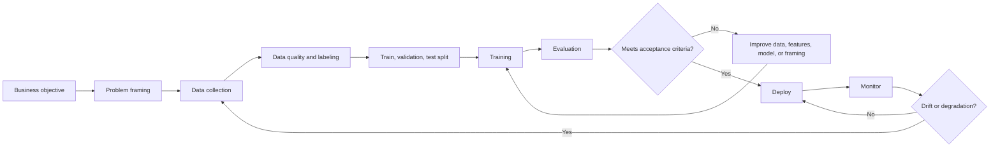
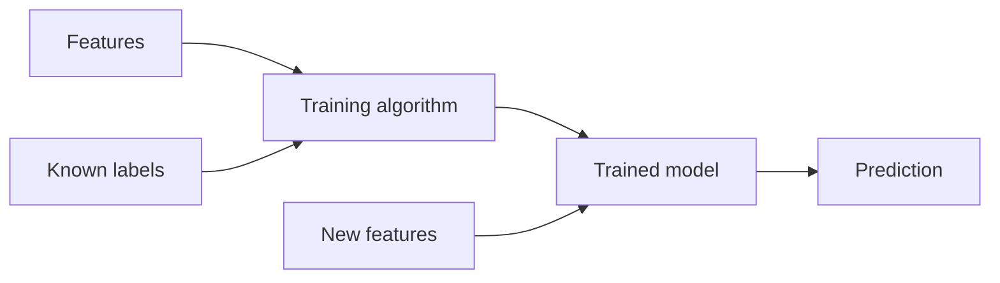
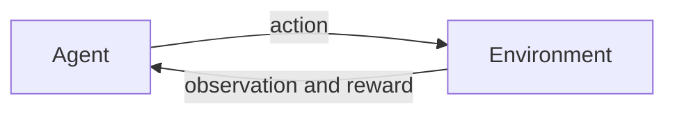
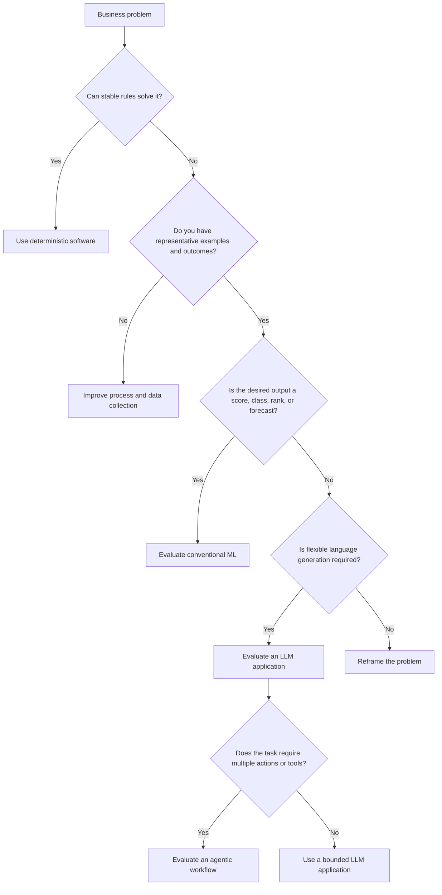
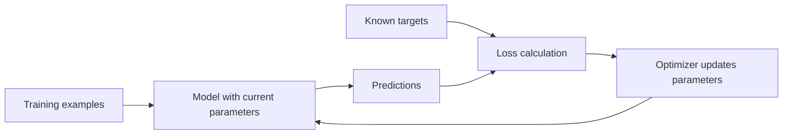
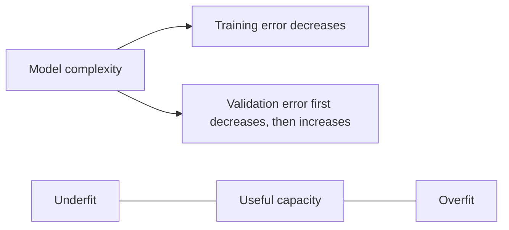
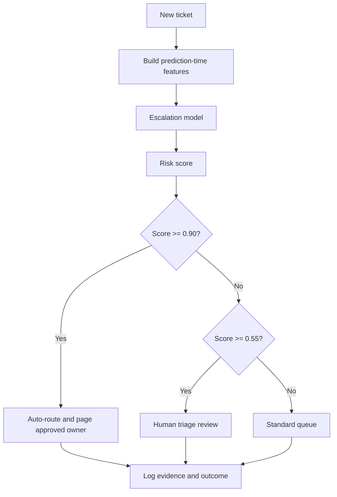
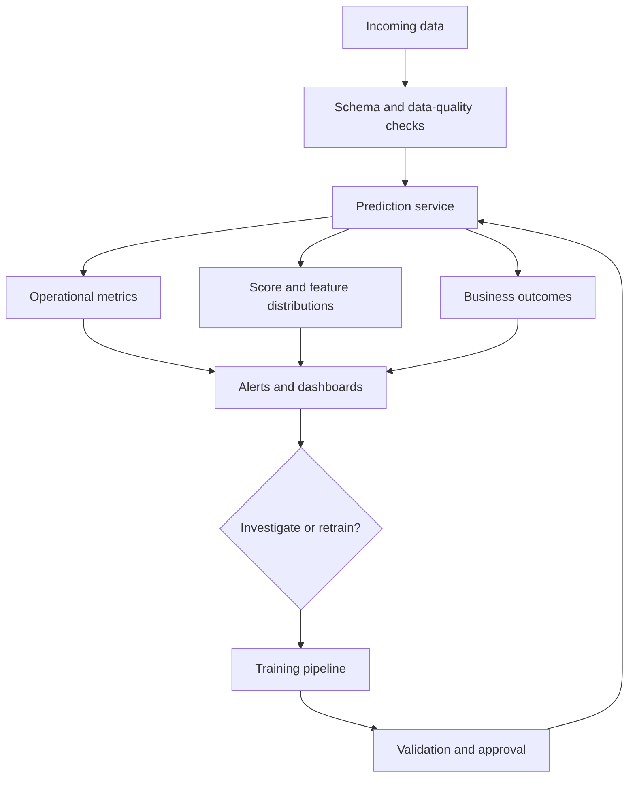

# Chapter 2 - Machine Learning Fundamentals

> **Source basis:** The board presents machine learning as a process in which data is used for training, training produces a model, and the model generates predictions [Board, p. 51]. This chapter expands that compact diagram into a complete engineering workflow. Sections marked **Supplementary** provide general machine-learning background that is not stated explicitly on the board.

---

## Learning objectives

By the end of this chapter, you should be able to:

1. Explain the difference between a machine-learning problem and a conventional software problem.
2. Distinguish supervised, unsupervised, semi-supervised, and reinforcement learning.
3. Frame a business question as classification, regression, ranking, anomaly detection, clustering, or forecasting.
4. Describe the roles of examples, labels, features, model parameters, loss functions, and optimization.
5. Create train, validation, and test splits without introducing data leakage.
6. Select evaluation metrics that reflect the actual cost of errors.
7. Recognize underfitting, overfitting, class imbalance, concept drift, and distribution shift.
8. Explain how traditional ML models can complement LLM and agentic systems.
9. Design a basic production lifecycle that includes monitoring, retraining, and human review.

---

## 1. Why machine learning exists

Conventional software is effective when developers can state the decision logic clearly. A program can validate a date, calculate tax according to a known rule, or reject an unauthorized action because the logic is explicit.

Some problems are different. The desired behavior is easy to demonstrate with examples but hard to describe as a complete set of rules. Consider the following tasks:

- determine whether a transaction is suspicious;
- estimate whether a customer will renew;
- predict the expected delivery time of an order;
- classify an image by product defect type;
- rank search results by relevance;
- identify support tickets likely to require escalation.

A developer could write hundreds of rules, but the rules would be brittle, difficult to maintain, and incomplete. Machine learning offers another approach: learn a pattern from historical examples and use the learned pattern to estimate outcomes for new examples.

The board summarizes this process as:

```text
Data -> Training -> Model -> Prediction
```

[Board, p. 51]

This four-stage picture is correct, but a production workflow contains additional decisions:



> **Key idea**
>
> The purpose of machine learning is not to train a model. The purpose is to improve a measurable decision or workflow under real operating conditions.

---

## 2. The core vocabulary

Before discussing algorithms, establish the main terms.

### 2.1 Example or observation

An **example** is one record used for learning or evaluation. A record may represent:

- a support ticket;
- a customer;
- an image;
- a transaction;
- a sensor time window;
- a document;
- a user-query and result pair.

### 2.2 Feature

A **feature** is an input variable used by the model. For a support-ticket priority model, possible features include:

- number of affected users;
- outage indicator;
- customer tier;
- product area;
- whether the user is blocked;
- ticket sentiment;
- number of similar incidents in the previous hour.

Features can be numeric, categorical, text-derived, image-derived, temporal, or learned automatically.

### 2.3 Label or target

A **label** is the outcome the model is expected to learn. Examples include:

- `P1`, `P2`, or `P3`;
- fraud or not fraud;
- delivery time in hours;
- future demand;
- product category;
- relevance score.

### 2.4 Model

A **model** is a learned function that maps input features to an output.

```text
features -> model -> prediction
```

The model contains parameters estimated during training. A simple linear model may contain only a few coefficients. A neural network may contain millions or billions of parameters.

### 2.5 Training

**Training** adjusts model parameters so that predictions become more consistent with known outcomes in the training data.

### 2.6 Inference

**Inference** is the use of the trained model to make a prediction on new data.

### 2.7 Loss function

A **loss function** converts prediction error into a numeric quantity that training attempts to minimize.

Examples:

- mean squared error for regression;
- log loss for probabilistic classification;
- ranking loss for search;
- contrastive loss for representation learning.

### 2.8 Metric

A **metric** measures model performance for evaluation or monitoring. A training loss and a business metric are not always the same.

A fraud model may optimize log loss but be judged operationally by:

- fraud prevented;
- false-positive review workload;
- customer friction;
- financial loss.

---

## 3. Learning paradigms

### 3.1 Supervised learning

Supervised learning uses examples paired with known outcomes.



Common supervised tasks include classification, regression, ranking, and forecasting.

#### Classification

Classification predicts a category.

Examples:

- urgent versus non-urgent;
- benign versus malignant;
- product A, B, or C;
- request type such as access, billing, or incident.

A classifier may return a hard label or a probability distribution:

```text
P1: 0.73
P2: 0.22
P3: 0.05
```

Probabilities are often more useful because the application can define thresholds, escalate uncertain cases, and measure calibration.

#### Regression

Regression predicts a continuous value.

Examples:

- expected delivery time;
- equipment temperature;
- monthly demand;
- customer lifetime value;
- expected resolution time.

#### Ranking

Ranking orders candidates according to estimated relevance or utility.

Examples:

- search results;
- supplier recommendations;
- candidate documents for retrieval;
- next-best actions;
- product recommendations.

Ranking is especially important in RAG systems because retrieving the correct context is often more important than merely identifying a broad class.

#### Forecasting

Forecasting predicts future values using temporal structure.

Examples:

- weekly product demand;
- call-center volume;
- inventory consumption;
- system load;
- failure probability over time.

Time-based problems need chronological validation. Randomly mixing future records into the training data would create leakage.

### 3.2 Unsupervised learning

Unsupervised learning uses data without a predefined target label. The goal is to discover structure.

Common tasks include:

- clustering;
- dimensionality reduction;
- anomaly detection;
- representation learning;
- topic discovery.

#### Clustering

Clustering groups similar examples. A support organization might cluster ticket descriptions to discover recurring issue families that are not represented in the existing taxonomy.

Clusters are not automatically meaningful. A human must inspect whether the grouping supports a real use case.

#### Dimensionality reduction

Dimensionality reduction compresses many variables into fewer dimensions while preserving useful structure. It supports visualization, denoising, and preprocessing.

#### Anomaly detection

Anomaly detection identifies observations that differ from expected patterns. Examples include unusual transactions, abnormal instrument signals, and unexpected tool-call behavior from an agent.

### 3.3 Semi-supervised learning

Semi-supervised learning combines a small amount of labeled data with a larger amount of unlabeled data. This is useful when labeling requires expensive expert effort.

For example, a team may have:

- 2,000 pathology images labeled by specialists;
- 200,000 unlabeled images.

A representation can be learned from the larger collection and adapted using the smaller labeled set.

### 3.4 Self-supervised learning

**Supplementary**

Self-supervised learning creates a learning signal from the data itself. Language models are commonly trained by predicting missing or next tokens. The text supplies both the input and the target structure, reducing the need for manually labeled examples.

### 3.5 Reinforcement learning

Reinforcement learning involves an agent interacting with an environment and receiving rewards or penalties.



The objective is to learn a policy that maximizes expected cumulative reward.

Reinforcement learning is appropriate when:

- decisions affect future states;
- feedback may be delayed;
- the system must balance exploration and exploitation;
- behavior is evaluated over a sequence, not one isolated prediction.

It is not automatically required for every AI agent. Many enterprise agents use deterministic orchestration plus an LLM without any online reinforcement-learning loop.

---

## 4. Framing the business problem

Many ML failures begin before training. The team starts with a vague request such as "use AI to improve support" and immediately chooses a model. A stronger process begins with the decision to improve.

### 4.1 Start with the operational decision

Ask:

1. Who makes the decision today?
2. What information is available at decision time?
3. What action follows from the prediction?
4. What is the cost of each error type?
5. How quickly must the result arrive?
6. Can a human review uncertain cases?
7. How will success be measured after deployment?

### 4.2 Convert the decision into a target

Example business objective:

> Reduce the time required to identify support tickets that need immediate escalation.

Possible ML framing:

- input: ticket text, account metadata, outage indicators;
- target: escalation within 30 minutes, yes or no;
- output: escalation probability;
- action: auto-route above a high threshold, human review in a middle range, normal queue below a low threshold;
- primary metric: recall for critical cases;
- guard metric: false-positive workload.

### 4.3 Define the unit of prediction

The unit may be:

- one ticket at creation time;
- one customer per day;
- one transaction at authorization time;
- one machine every five minutes;
- one document-query pair.

An unclear unit causes duplicated records, inconsistent labels, and leakage.

### 4.4 Define the prediction horizon

A target must specify when the outcome is measured.

Bad target:

> Predict whether the customer will churn.

Better target:

> At the end of each month, predict whether the active customer will cancel within the next 60 days.

### 4.5 Decide whether ML is necessary

Use the simplest approach that meets the objective.



> **Common mistake**
>
> Selecting an LLM because the input contains text. A smaller classifier may be cheaper, faster, easier to calibrate, and easier to operate when the required output is only a stable category or score.

---

## 5. Data is part of the product

A model reflects the data-generating process. Therefore, the data pipeline is part of the product architecture, not a one-time training activity.

### 5.1 Data sources

Possible sources include:

- transactional databases;
- operational logs;
- CRM and ERP systems;
- sensor streams;
- images and documents;
- human annotations;
- historical decisions;
- user interactions.

### 5.2 Labels are policy encoded as data

A label may appear objective but often reflects an organizational decision.

For ticket priority, historical labels may capture:

- past policy;
- analyst inconsistency;
- customer influence;
- missing information;
- emergency overrides;
- changes in product ownership.

Training a model on these labels can reproduce those patterns. The team must decide whether it wants to imitate historical decisions or improve them.

### 5.3 Feature availability at prediction time

A feature is valid only if it exists when the prediction is made.

Suppose a team predicts whether a ticket will be escalated using `final_resolution_code`. That field is known only after the ticket closes. It makes offline accuracy appear high but cannot be used at creation time.

This is **target leakage**.

### 5.4 Data leakage patterns

Common leakage sources include:

- using future information;
- including fields derived from the label;
- allowing records from the same user or event to appear in both train and test sets;
- fitting preprocessing on the entire dataset before splitting;
- using post-outcome human notes;
- selecting features after repeatedly inspecting test results.

### 5.5 Data quality dimensions

Evaluate:

- completeness;
- validity;
- consistency;
- timeliness;
- representativeness;
- uniqueness;
- label reliability;
- coverage of rare but important cases.

A large dataset with poor coverage of critical cases may be less valuable than a smaller, carefully labeled dataset.

---

## 6. Train, validation, and test sets

A model must be evaluated on examples it did not use for fitting.

### 6.1 The three-way split

| Split | Purpose | Used for parameter fitting? | Used for model selection? |
|---|---|---:|---:|
| Training | Learn parameters | Yes | Indirectly |
| Validation | Tune features, thresholds, and hyperparameters | No | Yes |
| Test | Estimate final generalization | No | No, until final evaluation |

A common starting point is 70/15/15 or 80/10/10, but the correct split depends on data volume and temporal structure.

### 6.2 Time-based splitting

For forecasting or evolving systems, split chronologically:

```text
Oldest data -> training
More recent data -> validation
Newest held-out period -> test
```

This better represents deployment, where the model predicts the future from the past.

### 6.3 Grouped splitting

If multiple records belong to the same customer, patient, device, or incident, place the entire group in one split. Otherwise, nearly duplicated information can cross the boundary and inflate performance.

### 6.4 Cross-validation

**Supplementary**

Cross-validation repeats training across several partitions and averages the results. It is useful when data is limited, but it must respect time and group boundaries.

---

## 7. How training works

At a high level, training repeats four steps:

1. produce predictions from current parameters;
2. compare predictions with known targets;
3. calculate loss;
4. adjust parameters to reduce loss.



### 7.1 Parameters and hyperparameters

**Parameters** are learned from data, such as linear coefficients or neural-network weights.

**Hyperparameters** are set by the training process, such as:

- tree depth;
- learning rate;
- regularization strength;
- number of neighbors;
- batch size;
- number of layers.

### 7.2 Optimization

Optimization searches for parameter values that reduce loss. Gradient-based methods calculate how small parameter changes affect loss and update parameters in the improving direction.

### 7.3 Regularization

Regularization discourages a model from fitting noise or becoming unnecessarily complex. Common methods include:

- limiting tree depth;
- penalizing large weights;
- early stopping;
- dropout in neural networks;
- data augmentation;
- reducing feature count.

---

## 8. Generalization, underfitting, and overfitting

A useful model must perform well on new examples, not merely memorize training data.

### 8.1 Underfitting

A model underfits when it is too simple, uses weak features, or has not been trained sufficiently.

Symptoms:

- poor training performance;
- poor validation performance;
- consistent errors across many cases.

Possible responses:

- improve features;
- use a more expressive model;
- train longer;
- revisit the target definition;
- improve label quality.

### 8.2 Overfitting

A model overfits when it learns noise or accidental details of the training data.

Symptoms:

- excellent training performance;
- significantly worse validation or test performance;
- unstable results across data slices;
- confidence on unfamiliar inputs that is not justified.



### 8.3 Bias and variance

**Bias** is error caused by assumptions that are too restrictive.

**Variance** is sensitivity to specific training examples.

A simple model often has higher bias and lower variance. A highly flexible model can have lower training bias but higher variance. The goal is not maximum complexity; it is reliable generalization.

### 8.4 Learning curves

Plotting performance against training-set size helps diagnose whether additional data is likely to help.

- If training and validation scores are both poor and close together, improve representation or model capacity.
- If training is strong and validation is weak, reduce overfitting or add representative data.
- If validation keeps improving with more data, data collection may be valuable.

---

## 9. Evaluation metrics

Metrics must reflect how the prediction will be used.

### 9.1 Confusion matrix

For binary classification:

| | Predicted positive | Predicted negative |
|---|---:|---:|
| Actual positive | True positive | False negative |
| Actual negative | False positive | True negative |

### 9.2 Accuracy

```text
correct predictions / all predictions
```

Accuracy is intuitive but misleading for imbalanced problems.

If only 1 percent of transactions are fraudulent, a model that predicts "not fraud" for every transaction has 99 percent accuracy and zero operational value.

### 9.3 Precision

```text
true positives / all predicted positives
```

Precision answers:

> When the model flags a case, how often is the flag correct?

Use precision when false positives are costly, such as unnecessary manual reviews.

### 9.4 Recall

```text
true positives / all actual positives
```

Recall answers:

> Of all truly positive cases, how many did the model find?

Use recall when missing a positive case is costly, such as a critical incident or safety risk.

### 9.5 F1 score

F1 is the harmonic mean of precision and recall. It is useful as a compact summary but can hide whether the operational problem is precision or recall.

### 9.6 Specificity

Specificity measures the proportion of actual negatives correctly identified.

### 9.7 ROC-AUC and PR-AUC (https://mljourney.com/roc-auc-vs-pr-auc-key-differences-and-when-to-use-each/)

**ROC-AUC** measures ranking quality across thresholds. It can appear optimistic under severe class imbalance.

**PR-AUC** focuses on precision and recall and is often more informative for rare positive events.

### 9.8 Calibration

A calibrated model's probabilities correspond to observed frequencies. Among cases assigned probability 0.8, approximately 80 percent should be positive over time.

Calibration matters when probabilities drive thresholds, risk estimates, or human prioritization.

### 9.9 Regression metrics

Common metrics include:

- mean absolute error;
- mean squared error;
- root mean squared error;
- median absolute error;
- mean absolute percentage error;
- quantile loss.

Select a metric based on business cost. Squared error penalizes large errors heavily. Absolute error is more robust to outliers.

### 9.10 Slice-based evaluation

An overall score can conceal failures. Evaluate meaningful slices:

- region;
- language;
- product line;
- customer tier;
- device type;
- time period;
- rare severity categories;
- new versus returning users.

> **Best practice**
>
> Every reported aggregate metric should be paired with the slices most likely to reveal unequal or unsafe behavior.

---

## 10. Thresholds and decision policies

A classifier score does not automatically determine an action. The application applies a decision policy.

Example:

```text
score >= 0.90       -> immediate escalation
0.55 <= score < .90 -> human review
score < 0.55        -> standard queue
```

The thresholds should reflect:

- cost of missed critical cases;
- review capacity;
- customer impact;
- model calibration;
- policy requirements;
- uncertainty.

This is a useful bridge from ML to agentic systems. A model may estimate risk, while an orchestrator applies policy and decides whether to route, ask for more information, or request approval.

---

## 11. Class imbalance and rare events

Critical events are often rare. Examples include fraud, equipment failure, severe incidents, and adverse outcomes.

Techniques include:

- class weighting;
- oversampling minority examples;
- undersampling majority examples;
- anomaly-detection approaches;
- threshold adjustment;
- targeted data collection;
- evaluating PR-AUC and recall at an acceptable precision;
- human review for uncertain or high-impact cases.

Synthetic balancing should not replace representative data. Artificial examples can amplify artifacts or create unrealistic patterns.

---

## 12. Baselines before advanced models

A baseline provides a reference point.

Useful baselines include:

- majority class;
- last known value;
- simple rule;
- linear or logistic regression;
- shallow decision tree;
- nearest-neighbor model;
- keyword classifier.

A complex model is justified only if it provides enough additional value to offset added latency, cost, maintenance, interpretability, and operational risk.

The repository includes a small, dependency-free example:

```text
examples/02-machine-learning/ticket_priority_baseline.py
```

It demonstrates:

- grouped train/test separation by customer;
- a nearest-centroid classifier;
- a confusion matrix;
- precision, recall, and F1;
- threshold-based human review.

Run it with:

```bash
python examples/02-machine-learning/ticket_priority_baseline.py
```

The example is pedagogical rather than production-ready. Its purpose is to make the lifecycle visible without hiding it behind a framework.

---

## 13. Worked example: support-ticket escalation

The board uses support triage as a recurring agent example [Board, p. 3]. Here we isolate the predictive component.

### 13.1 Objective

Predict whether a newly created ticket will require escalation within 30 minutes.

### 13.2 Unit of prediction

One ticket at creation time.

### 13.3 Candidate features

- affected-user count;
- customer blocked indicator;
- active outage indicator;
- customer tier;
- product area;
- sentiment score;
- number of similar tickets in the last hour;
- account business criticality.

### 13.4 Label

`1` if the ticket was escalated within 30 minutes, otherwise `0`.

The team should validate that this historical label represents desired policy. If previous escalations were inconsistent, a reviewed policy label may be better.

### 13.5 Split strategy

Use a chronological split and group by incident or customer where appropriate. This prevents the same outage pattern from appearing in both training and test data.

### 13.6 Primary metrics

- recall for critical escalations;
- precision at the auto-escalation threshold;
- median review volume per hour;
- time saved;
- escalation delay;
- performance by product and customer tier.

### 13.7 Production decision policy



### 13.8 Where an LLM helps

An LLM can derive structured features from free text, such as:

- reported business impact;
- likely product area;
- whether the customer is blocked;
- missing information.

However, the final routing policy can remain deterministic and auditable.

### 13.9 Where an agent helps

An agent may:

1. inspect the ticket;
2. retrieve current severity policy;
3. check active incidents;
4. call the ML model;
5. ask for missing information;
6. route or request approval;
7. record the decision trace.

This architecture combines learned prediction, generative interpretation, deterministic policy, tools, and human review.

---

## 14. From offline model to production service

A model file is not a production system.

### 14.1 Training pipeline

A repeatable training pipeline should include:

- versioned data extraction;
- schema validation;
- transformation code;
- split logic;
- training configuration;
- metric computation;
- artifact storage;
- reproducibility metadata;
- approval criteria.

### 14.2 Online or batch inference

**Online inference** returns a prediction during an application request. It is suitable for ticket routing or transaction screening.

**Batch inference** scores many records on a schedule. It is suitable for weekly churn risk or inventory planning.

### 14.3 Feature consistency

Training and serving must calculate features consistently. A difference in category mapping, missing-value handling, or time window can silently degrade the model.

### 14.4 Versioning

Version:

- data snapshot;
- feature definitions;
- code;
- model artifact;
- configuration;
- threshold policy;
- evaluation report.

### 14.5 Rollout strategies

Options include:

- shadow mode: generate predictions without affecting decisions;
- canary release: expose a small percentage of traffic;
- champion-challenger: compare a new model with the current model;
- human-in-the-loop: require review during early deployment;
- reversible rollout: keep a rapid path back to the prior version.

---

## 15. Monitoring and drift

A model can degrade even if the code does not change.

### 15.1 Data drift

The distribution of inputs changes.

Examples:

- a new product generates different ticket language;
- customer behavior changes;
- a sensor is replaced;
- a new region is added.

### 15.2 Concept drift

The relationship between inputs and outcomes changes.

Examples:

- escalation policy changes;
- fraud strategies evolve;
- customer churn drivers shift;
- operational processes are redesigned.

### 15.3 Label delay

Some outcomes arrive long after prediction. Churn may be known months later. Monitoring therefore needs both leading indicators and delayed ground-truth evaluation.

### 15.4 Production monitoring layers



Monitor at least:

- request volume;
- latency and failure rate;
- missing features;
- feature distributions;
- score distributions;
- threshold outcomes;
- delayed accuracy metrics;
- performance by slice;
- human override rate;
- business outcome metrics.

> **Enterprise note**
>
> A model can remain statistically accurate while becoming operationally harmful if the downstream workflow, review capacity, or policy changes. Monitor the complete decision system.

---

## 16. Responsible machine learning

The board later frames responsible AI as a pipeline that includes evaluation, explainability, fairness, security, and trust [Board, pp. 10, 47]. Conventional ML requires the same system-level thinking.

### 16.1 Fairness

Check whether error rates differ meaningfully across relevant groups. The correct fairness analysis depends on the domain, law, policy, and harm model.

### 16.2 Explainability

Different stakeholders need different explanations:

- a developer needs feature and error diagnostics;
- an operator needs the evidence supporting a decision;
- an affected user may need a plain-language reason and appeal path;
- an auditor needs lineage, controls, and reproducibility.

### 16.3 Privacy

Avoid collecting features merely because they are available. Apply data minimization, retention rules, access controls, and secure logging.

### 16.4 Security

Protect:

- training data;
- model artifacts;
- inference endpoints;
- feature stores;
- labels and feedback channels;
- deployment credentials.

Attackers may manipulate input data, poison feedback, extract sensitive information, or abuse a prediction service.

### 16.5 Human oversight

Human review is most valuable when designed around uncertainty and impact, not applied uniformly to every case.

---

## 17. Machine learning inside LLM and agentic systems

Traditional ML remains valuable in modern GenAI architectures.

### 17.1 Routing

A small classifier can route requests to:

- a search workflow;
- a summarization workflow;
- a calculation tool;
- a specialist agent;
- a human queue.

### 17.2 Retrieval

Embedding models, rerankers, and relevance classifiers determine which context an LLM sees.

### 17.3 Risk scoring

A predictive model may estimate:

- transaction risk;
- support severity;
- action confidence;
- expected tool success;
- probability of human escalation.

### 17.4 Guardrails

Classifiers can detect:

- sensitive data;
- prohibited content;
- prompt-injection patterns;
- unusual tool usage;
- unsupported claims.

### 17.5 Evaluation

Learned evaluators can score quality at scale, although they should be calibrated against human judgments and not treated as unquestionable ground truth.

### 17.6 Cost and latency optimization

A lightweight model can decide whether a request truly needs an expensive LLM or agent workflow.

```text
simple request -> small classifier or rules
complex language task -> LLM
multi-step action task -> agentic workflow
```

---

## 18. Common failure modes

### 18.1 Optimizing the wrong target

A model predicts historical behavior that does not match the desired future process.

### 18.2 Leakage

Future or post-outcome information enters training or evaluation.

### 18.3 Unrepresentative test data

The test set resembles the training set but not production traffic.

### 18.4 Metric mismatch

The team celebrates accuracy while critical recall is poor.

### 18.5 Ignoring thresholds

The model score is treated as the decision rather than an input to policy.

### 18.6 No baseline

A complex model is deployed without proving improvement over a simple rule.

### 18.7 No fallback

The workflow has no safe behavior when features are missing or the model service fails.

### 18.8 Feedback-loop bias

Model decisions influence which outcomes are later observed. For example, only flagged cases receive detailed investigation, causing the future dataset to overrepresent those patterns.

### 18.9 Silent drift

The team monitors uptime but not data or outcome quality.

### 18.10 Treating uncertainty as confidence

Many models produce scores that look precise. Precision of formatting is not the same as calibrated certainty.

---

## 19. Practical design checklist

Before training:

- [ ] Define the business decision and owner.
- [ ] Specify the unit of prediction and prediction horizon.
- [ ] Confirm that the target represents desired policy.
- [ ] Inventory only features available at decision time.
- [ ] Establish a simple baseline.
- [ ] Define error costs and human-review capacity.
- [ ] Choose a leakage-safe split strategy.

Before deployment:

- [ ] Evaluate aggregate and slice metrics.
- [ ] Calibrate thresholds against operational capacity.
- [ ] Document data, model, and policy versions.
- [ ] Validate fallback behavior.
- [ ] Run in shadow mode or controlled rollout.
- [ ] Confirm security and privacy controls.
- [ ] Establish an appeal or override process where appropriate.

After deployment:

- [ ] Monitor service health and latency.
- [ ] Monitor feature and score distributions.
- [ ] Collect delayed ground truth.
- [ ] Measure human overrides.
- [ ] Measure business outcomes.
- [ ] Investigate drift and retraining triggers.
- [ ] Revalidate when policy or workflow changes.

---

## 20. Hands-on lab: build an escalation baseline

### Goal

Build a small classifier that estimates whether a support ticket should be escalated.

### Step 1: run the supplied example

```bash
python examples/02-machine-learning/ticket_priority_baseline.py
```

### Step 2: inspect the data

Identify:

- features;
- label;
- grouping variable;
- imbalance level;
- any suspicious leakage fields.

### Step 3: change the decision threshold

Compare:

- precision;
- recall;
- number of cases sent to human review.

### Step 4: add one feature

Examples:

- recent similar ticket count;
- customer tier;
- business-critical process indicator.

Explain whether the feature would truly be available at ticket creation time.

### Step 5: design a production policy

Specify:

- auto-escalation threshold;
- human-review interval;
- normal-routing threshold;
- fallback when the model is unavailable;
- monitoring metrics.

### Expected learning

The purpose of this lab is not to maximize a score. It is to connect problem framing, data splitting, metrics, thresholds, and operational policy.

---

## 21. Knowledge check

1. Why can a model with high accuracy be useless for a rare-event problem?
2. What is the difference between a parameter and a hyperparameter?
3. Give two examples of target leakage.
4. When should a time-based split be preferred over a random split?
5. What operational question does precision answer?
6. What operational question does recall answer?
7. Why should model thresholds be separated from model training?
8. What is the difference between data drift and concept drift?
9. Why can historical labels encode outdated policy?
10. How can a small classifier reduce LLM cost?

---

## 22. Interview questions

### Beginner

1. Explain supervised and unsupervised learning with one example each.
2. What is the purpose of a test set?
3. What is overfitting?
4. Why is accuracy insufficient for imbalanced classification?
5. What is the difference between training and inference?

### Intermediate

1. Design a split strategy for predicting equipment failure from repeated sensor readings per device.
2. How would you select a threshold for a fraud model?
3. Describe three leakage risks in a customer-churn dataset.
4. How would you evaluate a model when labels arrive 90 days later?
5. Explain how calibration differs from ranking quality.

### Senior

1. A model has stable offline metrics but declining business impact. How would you investigate?
2. Design a champion-challenger rollout for a critical support-routing model.
3. How would you monitor fairness and drift without exposing sensitive attributes broadly?
4. When would you choose rules, conventional ML, an LLM, or an agent for text-heavy ticket routing?
5. Describe a feedback loop that could bias future training data and how you would mitigate it.

### System design

Design an enterprise ticket-escalation platform that combines:

- deterministic severity policy;
- an ML risk score;
- LLM-based extraction from ticket text;
- active-incident lookup;
- human approval for critical escalation;
- full audit logging;
- drift monitoring and retraining.

Your design should address latency, failure modes, authorization, thresholding, data lineage, and safe fallback.

---

## 23. Chapter summary

Machine learning replaces some manually written decision logic with patterns learned from examples. The compact board sequence of data, training, model, and prediction is the center of the workflow, but successful systems require much more: careful problem framing, representative data, leakage-safe evaluation, meaningful metrics, operational thresholds, controlled deployment, and continuous monitoring.

The main lessons are:

- Start with the decision, not the algorithm.
- Use the simplest approach that meets the objective.
- Treat labels as encoded organizational policy.
- Separate training, validation, and final testing.
- Evaluate error costs, not only aggregate scores.
- Keep the model score separate from the application decision policy.
- Monitor the full system after deployment.
- Combine conventional ML with rules, LLMs, retrieval, tools, and human review when each component has a clear responsibility.

The next chapter moves from general machine learning to deep learning and representation learning. It explains how neural networks learn layered features, why embeddings are useful, and how those ideas lead toward transformers, LLMs, and retrieval systems.
