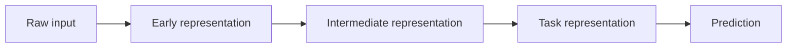
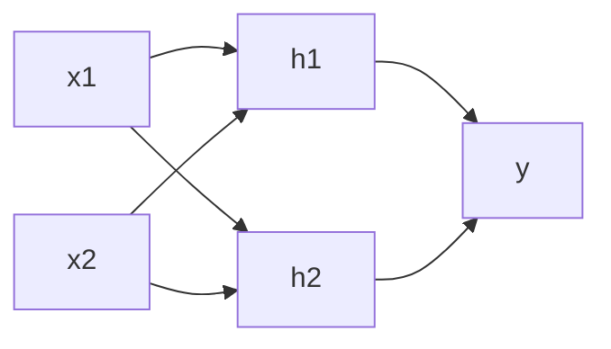
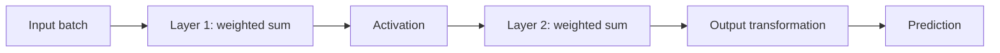
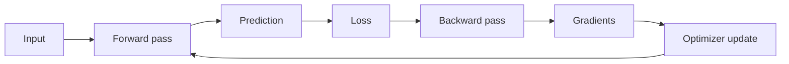
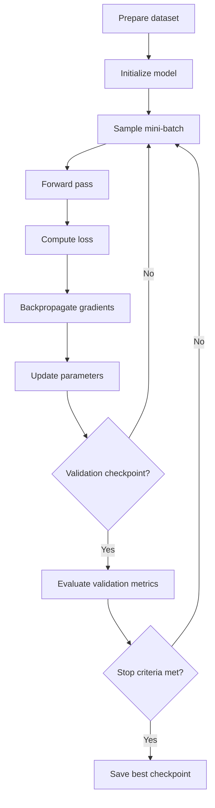
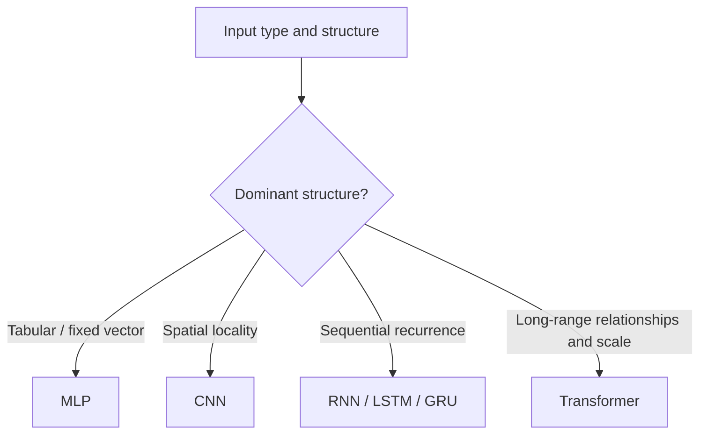
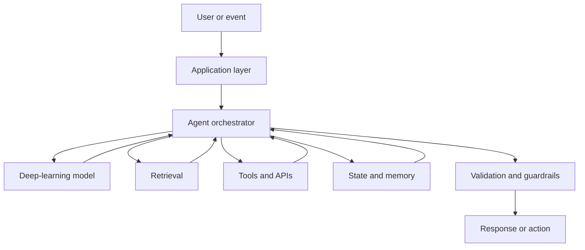
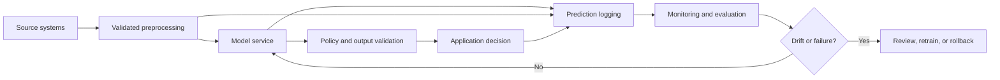

# Chapter 3 - Deep Learning and Representation Learning

> **Source basis:** The board places deep learning between machine learning and large language models in the progression from traditional software to agentic AI [Board, p. 51]. The board does not provide a detailed treatment of neural networks, training, or representation learning. Most of this chapter is therefore marked **Supplementary** and supplies the background needed for the later chapters on transformers, embeddings, RAG, and agents.

---

## Learning objectives

By the end of this chapter, you should be able to:

1. Explain how deep learning differs from conventional machine learning.
2. Describe neurons, layers, weights, biases, activations, and forward propagation.
3. Explain the role of loss functions, gradients, backpropagation, and optimization.
4. Distinguish training, validation, and inference in a neural-network lifecycle.
5. Explain representation learning and why embeddings are useful.
6. Compare multilayer perceptrons, convolutional networks, recurrent networks, and transformers.
7. Recognize overfitting, vanishing gradients, unstable training, and data-quality failures.
8. Explain transfer learning, fine-tuning, and frozen feature extractors.
9. Connect deep-learning concepts to LLMs, RAG, multimodal systems, and agentic AI.
10. Design a basic production workflow with evaluation, monitoring, and human controls.

---

## 1. Why deep learning matters

The board presents a simple progression:

```text
Traditional Programming -> Machine Learning -> Deep Learning -> LLMs -> Agentic AI
```

[Board, p. 51]

This sequence captures an important shift. Traditional machine-learning systems often depend on experts to decide which features matter. Deep-learning systems can learn many of those features automatically from raw or lightly processed data.

Consider a quality-inspection problem for laboratory equipment.

A conventional ML workflow might require engineers to define features such as:

- average image brightness;
- edge density;
- number of circular shapes;
- texture statistics;
- estimated defect area;
- color-distribution measurements.

A deep-learning workflow can instead learn internal visual features directly from labeled images. Early layers may detect edges and simple textures. Middle layers may detect shapes and components. Later layers may represent defect patterns that are useful for classification.

> **Key idea**
>
> Deep learning is not merely a larger algorithm. It is a way of learning useful internal representations from data through multiple layers of computation.

This ability underlies modern systems for:

- image and video understanding;
- speech recognition and synthesis;
- machine translation;
- document understanding;
- text generation;
- scientific modeling;
- multimodal reasoning;
- large language models.

---

## 2. From manual features to learned representations

### 2.1 Conventional feature engineering

In a conventional ML system, a person or upstream program often converts raw data into a compact feature vector.

```text
Raw input -> Hand-designed features -> ML model -> Prediction
```

For example, a support-ticket classifier might receive:

```text
contains_error_code = 1
customer_tier = 3
message_length = 147
sentiment_score = -0.62
blocked_keyword_count = 2
```

This approach can work very well. It is interpretable, efficient, and appropriate when the input structure is understood.

Its limitation is that manually designed features may omit subtle patterns. They can also require substantial domain effort and repeated maintenance.

### 2.2 Representation learning

Representation learning allows the model to discover internal features that help solve the task.



A representation is a transformed description of the input. It may be:

- a vector of learned numeric values;
- a grid of feature maps;
- a sequence of hidden states;
- an embedding in a semantic space.

Useful representations make important relationships easier for later layers to detect.

### 2.3 Why depth helps

A multi-layer system can compose simple patterns into more complex patterns.

For an image:

```text
pixels -> edges -> textures -> parts -> objects -> task decision
```

For text:

```text
tokens -> local patterns -> syntax -> semantic relationships -> task behavior
```

The exact interpretation of a hidden unit is not always clean or human-readable. The practical point is that successive layers can transform the input into a form that supports the objective.

---

## 3. The basic neural network

### 3.1 Artificial neuron

An artificial neuron receives input values, multiplies them by learned weights, adds a bias, and applies an activation function.

For inputs `x1 ... xn`, weights `w1 ... wn`, and bias `b`:

```text
z = w1*x1 + w2*x2 + ... + wn*xn + b
output = activation(z)
```

The weights determine how strongly each input influences the neuron. The bias shifts the decision boundary.

### 3.2 Layers

Neural networks are organized into layers.

- **Input layer:** receives features.
- **Hidden layers:** transform the features.
- **Output layer:** produces predictions or representations.



A fully connected layer connects each input to each output. Other architectures use different connection patterns.

### 3.3 Weights and biases

Training changes weights and biases. They are the model parameters.

Suppose a tiny network has:

- 10 input features;
- 8 hidden units;
- 3 output classes.

The first layer contains `10 x 8 = 80` weights and 8 biases. The second contains `8 x 3 = 24` weights and 3 biases. Even this small network has 115 trainable parameters.

Modern networks can have millions or billions of parameters. The same principles still apply: a forward computation produces outputs, and optimization adjusts parameters to reduce error.

### 3.4 Activation functions

Without nonlinear activation functions, stacking linear layers would still produce only a linear transformation. Nonlinearity allows the network to model complex relationships.

Common activations include:

| Activation | Description | Typical use |
|---|---|---|
| ReLU | `max(0, x)` | Common hidden-layer default |
| Leaky ReLU | Small negative slope below zero | Reduces permanently inactive units |
| Sigmoid | Maps values to 0-1 | Binary probabilities or gates |
| Tanh | Maps values to -1 to 1 | Older recurrent systems and bounded states |
| GELU | Smooth nonlinear activation | Common in transformers |
| Softmax | Converts logits into a distribution | Multi-class output layer |

> **Common mistake**
>
> A softmax score is not automatically a trustworthy confidence estimate. Calibration must be evaluated separately.

---

## 4. Forward propagation

Forward propagation computes the output from the input using current parameter values.



For a classification task, the output layer may produce logits. A softmax transformation then converts the logits into class probabilities.

Example:

```text
raw logits:       [2.1, 0.7, -0.2]
softmax output:   [0.73, 0.18, 0.09]
```

The highest score becomes the predicted class, but the entire distribution can be used for thresholds and human escalation.

### 4.1 Batches

Training usually processes multiple examples together in a batch. Batching improves computational efficiency and provides a more stable estimate of the gradient than updating from one example at a time.

Common terms:

- **batch size:** number of examples used in one parameter update;
- **step or iteration:** one optimization update;
- **epoch:** one pass through the training dataset.

If a dataset contains 10,000 examples and the batch size is 100, one epoch contains approximately 100 optimization steps.

---

## 5. Loss functions

A loss function measures how far a prediction is from the desired outcome.

### 5.1 Classification loss

Cross-entropy loss is common for classification. It penalizes the model when it assigns low probability to the correct class.

If the correct class is `Billing` and the model returns:

```text
Billing: 0.90
Access:  0.06
Shipping: 0.04
```

The loss is relatively low. If the model assigns `Billing: 0.05`, the loss is much larger.

### 5.2 Regression loss

Common regression losses include:

- mean squared error;
- mean absolute error;
- Huber loss.

Mean squared error penalizes large errors strongly. Mean absolute error is more robust to extreme outliers. Huber loss combines properties of both.

### 5.3 Objective design

The training loss is a proxy for the real goal. A low loss does not guarantee business value.

For example, a medical triage model may have excellent average accuracy while still missing rare critical cases. The operational objective may require high recall for severe outcomes, calibrated probabilities, or mandatory human review.

> **Best practice**
>
> Define the business cost of errors before choosing the training objective and evaluation metrics.

---

## 6. Backpropagation and gradients

### 6.1 Gradient intuition

A gradient indicates how a small change in a parameter would change the loss.

- Positive gradient: increasing the parameter increases the loss.
- Negative gradient: increasing the parameter decreases the loss.
- Large magnitude: the parameter has a strong local effect.
- Small magnitude: the local effect is weak.

### 6.2 Backpropagation

Backpropagation applies the chain rule of calculus from the output layer back through earlier layers. It computes gradients for all trainable parameters efficiently.



Conceptually:

1. Run the network forward.
2. Compare predictions with targets.
3. Compute the loss.
4. Propagate error information backward.
5. Update parameters.
6. Repeat.

Backpropagation does not mean the model reasons backward. It is a numerical method for computing derivatives through a composed function.

### 6.3 Gradient descent

A simple parameter update is:

```text
new_parameter = old_parameter - learning_rate * gradient
```

The learning rate controls update size.

- Too high: training may diverge or oscillate.
- Too low: training may be extremely slow or get stuck.

Optimizers such as Adam adapt update behavior using running statistics of gradients. Their use does not eliminate the need to monitor learning rate, stability, and generalization.

---

## 7. The training loop

A reliable deep-learning training process is an engineering loop, not a single command.



### 7.1 Initialization

Weights must be initialized carefully. If they are all identical, units may learn the same behavior. Very large initial values can cause unstable activations. Very small values can produce weak signals.

Modern frameworks provide sensible initialization strategies, but engineers still need to understand when training instability may originate in initialization.

### 7.2 Shuffling and batching

Training data is usually shuffled so that batches do not contain accidental order patterns. For time series, sequential dependencies may require a different strategy.

### 7.3 Validation checkpoints

The model should be evaluated periodically on data not used for gradient updates. Validation metrics guide:

- early stopping;
- checkpoint selection;
- learning-rate scheduling;
- architecture choices;
- regularization decisions.

### 7.4 Early stopping

Early stopping saves a checkpoint when validation performance is best and stops after no improvement for a defined period. This helps reduce overfitting and wasted compute.

### 7.5 Reproducibility

Reproducible experiments require more than a random seed. Record:

- dataset version;
- preprocessing code;
- split logic;
- model architecture;
- initialization seed;
- optimizer and schedule;
- library and hardware versions;
- checkpoint identity;
- evaluation code.

---

## 8. Generalization and overfitting

### 8.1 Training performance versus generalization

A model can memorize training data and still fail on new examples. Generalization is the ability to perform well on data not used for training.

Typical pattern:

```text
Training loss: keeps decreasing
Validation loss: decreases, then starts increasing
```

This suggests overfitting.

### 8.2 Causes of overfitting

- too much model capacity for the dataset;
- too few diverse examples;
- label noise;
- repeated or near-duplicate records across splits;
- training for too long;
- leakage from future or protected information;
- benchmark-specific tuning.

### 8.3 Regularization techniques

| Technique | Purpose |
|---|---|
| Weight decay | Discourages excessively large weights |
| Dropout | Randomly disables units during training |
| Data augmentation | Creates plausible input variations |
| Early stopping | Stops before validation quality degrades |
| Label smoothing | Reduces extreme target certainty |
| Smaller model | Reduces unnecessary capacity |
| More data | Expands observed variation |

Regularization is not a substitute for correct data. If labels are inconsistent or the production distribution is different, regularization alone will not solve the problem.

---

## 9. Representation learning and embeddings

### 9.1 What is an embedding?

An embedding is a learned vector representation of an item such as a word, document, image, user, product, or molecule.

Example:

```text
"failed payment" -> [0.17, -0.42, 0.08, ...]
```

The individual dimensions may not have simple human meanings. The useful property is that related items can occupy nearby regions of the vector space.

### 9.2 Similarity

Embeddings support operations such as:

- nearest-neighbor search;
- clustering;
- semantic retrieval;
- deduplication;
- recommendation;
- anomaly detection.

This is the bridge to RAG. A user question can be embedded, compared with document-chunk embeddings, and used to retrieve relevant context.

### 9.3 Task-specific versus general embeddings

- **Task-specific embedding:** optimized for one problem, such as product matching.
- **General embedding:** trained across broad data and reused for many tasks.
- **Multimodal embedding:** places text, images, audio, or other modalities in a compatible space.

### 9.4 Representation collapse and shortcuts

A representation may appear effective while relying on an unintended shortcut.

Examples:

- image classifier learns the background rather than the object;
- medical model learns hospital identity from scanner metadata;
- text classifier learns a formatting pattern rather than meaning;
- retrieval embedding overweights repeated boilerplate.

Evaluation should test whether the representation captures the intended signal across environments.

---

## 10. Major deep-learning architectures

### 10.1 Multilayer perceptron (MLP)

An MLP is a stack of fully connected layers. It is useful for:

- tabular data after suitable preprocessing;
- small classification and regression tasks;
- learned projections;
- components inside larger networks.

Strengths:

- conceptually simple;
- flexible;
- easy to implement.

Limitations:

- does not explicitly exploit image locality or sequence order;
- parameter count grows quickly with large raw inputs.

### 10.2 Convolutional neural network (CNN)

CNNs apply shared filters across local regions. They are effective for spatial structure.

Common applications:

- image classification;
- object detection;
- segmentation;
- signal processing;
- defect inspection.

Convolution uses local connectivity and weight sharing, reducing parameters compared with a fully connected network over all pixels.

### 10.3 Recurrent neural network (RNN)

RNNs process sequences while carrying a hidden state from one step to the next.

Applications historically included:

- language modeling;
- speech recognition;
- time-series processing;
- sequence labeling.

LSTM and GRU architectures introduced gates to improve long-range information flow. Recurrent processing can be difficult to parallelize, and transformers now dominate many language tasks.

### 10.4 Transformer

Transformers use attention mechanisms to relate tokens or elements across a sequence. They can process many positions in parallel during training and scale effectively with data and compute.

Transformers are the foundation of modern LLMs and are covered in the next chapter.



> **Architecture principle**
>
> Choose an architecture because its inductive bias matches the data and task, not because it is fashionable.

---

## 11. Vanishing, exploding, and unstable gradients

### 11.1 Vanishing gradients

When gradients become extremely small in early layers, those layers learn slowly. This was historically a major challenge in deep networks and recurrent models.

Mitigations include:

- ReLU-like activations;
- careful initialization;
- normalization;
- residual connections;
- gated recurrent units;
- architecture changes.

### 11.2 Exploding gradients

Very large gradients can produce unstable parameter updates and numerical failure.

Mitigations include:

- gradient clipping;
- lower learning rate;
- normalization;
- improved initialization;
- shorter unrolled sequences;
- inspecting corrupted batches.

### 11.3 Dead activations

A ReLU unit can become inactive if its pre-activation remains negative. Leaky ReLU or improved optimization may help, but the root cause could also be poor data scaling or an excessive learning rate.

### 11.4 Numerical precision

Large models often use reduced-precision computation for speed and memory efficiency. Mixed-precision training requires care with loss scaling, overflow, and unsupported operations.

---

## 12. Normalization, residual connections, and attention preview

### 12.1 Normalization

Normalization stabilizes internal value distributions and can improve optimization.

Examples:

- batch normalization;
- layer normalization;
- RMS normalization.

Different architectures favor different forms. Transformers commonly use layer-based normalization because sequence batches and positions behave differently from image batches.

### 12.2 Residual connections

A residual connection adds a layer's input to its transformed output.

```text
output = input + transformation(input)
```

Residual paths help information and gradients move through deep networks. They are central to modern CNNs and transformers.

### 12.3 Attention preview

Attention computes how strongly one element should use information from other elements. In language, a token can attend to earlier or later tokens to build a context-dependent representation.

The next chapter explains queries, keys, values, self-attention, multi-head attention, masking, and positional information.

---

## 13. Transfer learning and fine-tuning

### 13.1 Why reuse a trained model?

Training a deep model from scratch can require large datasets and substantial compute. Transfer learning starts from a model trained on a broader source task and adapts it to a target task.

```text
Broad pretraining -> Reusable representation -> Target adaptation
```

### 13.2 Frozen feature extractor

The pretrained model is kept fixed, and only a small output layer is trained.

Use when:

- target data is limited;
- the pretrained representation matches the domain;
- fast iteration is important;
- compute is constrained.

### 13.3 Partial fine-tuning

Some later layers are updated while earlier layers remain frozen. This balances adaptation and stability.

### 13.4 Full fine-tuning

All parameters are updated. This can provide stronger adaptation but requires more data, compute, evaluation, and safeguards against catastrophic forgetting.

### 13.5 Parameter-efficient fine-tuning

Parameter-efficient methods update a small set of added or selected parameters instead of the full model. This is especially useful for large foundation models.

> **Connection to the board**
>
> The board's weak-output decision tree distinguishes instruction problems, missing knowledge, and stable domain-specific behavior. Prompt changes address instruction problems, RAG supplies missing facts, and fine-tuning can adapt repeated behavior or domain patterns. Deep-learning transfer concepts explain why fine-tuning changes learned parameters rather than merely adding context.

---

## 14. Deep learning in multimodal systems

A multimodal model processes more than one type of data, such as text and images.

Examples:

- analyze a laboratory bench image and identify safety risks;
- read a chart and answer a question;
- transcribe audio and summarize action items;
- match product images to catalog descriptions;
- combine sensor data with maintenance notes.

A common design uses modality-specific encoders and a shared or connected representation space.

```text
Image -> Vision encoder --+
                         +-> Shared model -> Output
Text  -> Text encoder ----+
```

Multimodal capability does not remove the need for domain validation. Visual models can miss small details, misread labels, or infer objects that are not present.

---

## 15. Deep learning and agentic AI

Deep learning provides the predictive and generative models used inside many agents. It does not by itself provide a complete agent architecture.

An agent adds system-level components such as:

- goal and instruction handling;
- planning;
- tool routing;
- external memory;
- persistent state;
- retries and fallbacks;
- guardrails;
- human approval;
- audit logs.



The model may reason over text, interpret images, classify intent, or choose a tool. The orchestrator determines what happens next and whether the result is safe to use.

> **Important distinction**
>
> Model capability is not system reliability. A capable neural model still needs deterministic controls, permissions, monitoring, and recovery logic.

---

## 16. Data requirements and data quality

Deep learning is sensitive to the quality and coverage of training data.

### 16.1 Coverage

The dataset should represent the environments, users, devices, languages, and edge cases expected in production.

### 16.2 Label quality

Inconsistent labels teach inconsistent behavior. Labeling guidelines should define ambiguous cases, escalation rules, and reviewer agreement.

### 16.3 Class imbalance

Rare but important classes can be overwhelmed by common classes. Possible responses include:

- targeted data collection;
- weighted loss;
- resampling;
- threshold adjustment;
- anomaly-detection framing;
- human review for uncertain cases.

### 16.4 Privacy and governance

Training data may contain personal, confidential, regulated, or proprietary information. Controls can include:

- data minimization;
- access restrictions;
- de-identification;
- retention limits;
- provenance records;
- consent and purpose review;
- audit logging.

### 16.5 Data poisoning

Bad or malicious examples can alter learned behavior. Protect the pipeline through source validation, access control, anomaly detection, versioning, and rollback capability.

---

## 17. Evaluation

Deep-learning evaluation must cover more than average accuracy.

### 17.1 Task metrics

Choose metrics aligned with the task:

- classification: precision, recall, F1, ROC-AUC, PR-AUC;
- regression: MAE, RMSE, percentile error;
- retrieval: recall at k, precision at k, MRR, nDCG;
- generation: task-specific correctness, faithfulness, human preference;
- calibration: reliability curves and calibration error.

### 17.2 Slice evaluation

Evaluate meaningful subsets:

- language;
- customer tier;
- device type;
- image source;
- region;
- severity;
- rare categories;
- low-quality input conditions.

Average performance can hide unacceptable failures in a subgroup.

### 17.3 Robustness evaluation

Test:

- noisy inputs;
- missing fields;
- corrupted files;
- unusual formatting;
- adversarial changes;
- distribution shift;
- out-of-domain examples.

### 17.4 Human evaluation

Some outputs require expert judgment. Human evaluation should use clear rubrics, multiple reviewers when possible, disagreement tracking, and representative examples.

---

## 18. Production architecture

A deep-learning feature in production includes much more than the model artifact.



Production concerns include:

- model versioning;
- reproducible preprocessing;
- latency and throughput;
- hardware capacity;
- autoscaling;
- caching;
- fallback behavior;
- input validation;
- observability;
- security;
- cost controls;
- rollback.

### 18.1 Online inference

Online inference serves predictions in real time. It needs low latency, predictable capacity, and safe timeouts.

### 18.2 Batch inference

Batch inference processes many records on a schedule. It is suitable for periodic scoring, analytics, and offline recommendations.

### 18.3 Edge inference

Edge inference runs on a device or local environment. It can reduce latency and data transfer but introduces model-size, hardware, update, and observability constraints.

### 18.4 Fallback strategy

If the model service is unavailable or confidence is insufficient, the application may:

- use a rule-based fallback;
- return a cached result;
- ask for more information;
- route to a human;
- defer the action;
- fail closed for high-risk operations.

---

## 19. Latency, compute, and cost

Deep-learning systems trade off quality, speed, memory, and cost.

### 19.1 Main cost drivers

- parameter count;
- input size;
- output length;
- batch size;
- numerical precision;
- hardware type;
- number of model calls;
- retries and ensembles.

### 19.2 Optimization techniques

- use a smaller model when sufficient;
- quantize weights;
- batch compatible requests;
- cache repeated representations;
- distill a larger model into a smaller model;
- prune unnecessary parameters;
- shorten inputs;
- parallelize independent work;
- route simple tasks to cheaper models.

### 19.3 Quality-cost frontier

The best model is not automatically the largest model. The production choice should meet acceptance criteria at an acceptable latency and cost.

---

## 20. Common failure modes

### Failure 1: Training accuracy is treated as success

**Why it fails:** The model may memorize training examples.

**Response:** Use clean validation and test sets, slice evaluation, and production monitoring.

### Failure 2: The model learns a shortcut

**Why it fails:** A correlated artifact is easier to learn than the intended concept.

**Response:** Inspect examples, remove leakage, test across environments, and use explanation tools carefully.

### Failure 3: Labels are inconsistent

**Why it fails:** The model receives conflicting supervision.

**Response:** Improve guidelines, adjudicate disagreement, and measure label quality.

### Failure 4: An oversized model is used for a small problem

**Why it fails:** Cost and complexity rise without reliable benefit.

**Response:** Establish a simple baseline and justify each increase in capacity.

### Failure 5: No termination or fallback exists around the model

**Why it fails:** A model error becomes an uncontrolled workflow failure.

**Response:** Add thresholds, retries, timeouts, human review, and fail-safe behavior.

### Failure 6: Evaluation data resembles training data too closely

**Why it fails:** The benchmark does not represent deployment.

**Response:** Use temporal, geographic, source-based, or customer-based holdouts when appropriate.

### Failure 7: Model output is treated as fact

**Why it fails:** Neural outputs are probabilistic and may be wrong.

**Response:** Ground outputs, validate critical fields, show evidence, and require approval for consequential actions.

---

## 21. Worked example: laboratory image safety classifier

Assume a team wants to detect visible laboratory-bench safety issues.

### 21.1 Business objective

Assist safety reviewers by prioritizing images that may contain:

- missing PPE;
- blocked access paths;
- unsafe equipment placement;
- unlabeled containers;
- spill hazards.

The system is advisory. It does not replace a qualified safety inspection.

### 21.2 Data design

Each image can have multiple labels. This is a multi-label classification problem.

Example label vector:

```text
missing_gloves = 1
unlabeled_container = 0
spill_hazard = 1
blocked_exit = 0
```

### 21.3 Model design

A pretrained vision encoder can produce image representations. A small task-specific head predicts the safety categories.

```text
Image -> Pretrained encoder -> Image embedding -> Multi-label head -> Scores
```

### 21.4 Evaluation

Measure:

- per-category recall;
- precision at the human-review threshold;
- false negatives for high-severity hazards;
- performance by room, camera, lighting, and site;
- calibration;
- reviewer agreement.

### 21.5 Workflow controls

- show the source image and highlighted evidence;
- label the result as an automated screening suggestion;
- route low-confidence or high-severity cases to a human;
- record reviewer corrections;
- prevent automatic disciplinary or compliance actions.

### 21.6 Monitoring

Monitor for:

- new equipment types;
- camera changes;
- seasonal PPE differences;
- site-specific visual patterns;
- drift in category frequency;
- systematic reviewer disagreement.

> **Enterprise insight**
>
> The value comes from the complete review workflow: prioritization, evidence, human confirmation, auditability, and feedback. The classifier alone is not the product.

---

## 22. Runnable example: learning XOR

The repository includes a dependency-free Python example:

```text
examples/03-deep-learning/xor_neural_network.py
```

XOR cannot be represented by a single linear decision boundary. A small neural network with a nonlinear hidden layer can learn it.

The example demonstrates:

- random initialization;
- forward propagation;
- sigmoid activation;
- binary cross-entropy loss;
- manual backpropagation;
- gradient descent;
- inference after training.

Run it with:

```bash
python examples/03-deep-learning/xor_neural_network.py
```

The code is intentionally small and educational. Production systems should use established numerical and deep-learning libraries.

---

## 23. Hands-on lab

### Objective

Design a deep-learning system for one of the following:

1. support-ticket text classification;
2. product-defect image classification;
3. document similarity search;
4. equipment sensor anomaly detection;
5. multimodal laboratory safety review.

### Deliverables

Create:

1. a one-paragraph business objective;
2. an input and label specification;
3. a data-split strategy;
4. a baseline model;
5. a deep-learning model proposal;
6. primary and guardrail metrics;
7. three important evaluation slices;
8. a fallback and human-review design;
9. a monitoring plan;
10. a short risk register.

### Success criteria

A strong design should:

- connect model performance to an operational decision;
- explain why deep learning is justified;
- include a simpler baseline;
- prevent leakage;
- address rare but high-cost errors;
- define what happens when the model is uncertain or unavailable.

---

## 24. Knowledge check

1. What is the difference between feature engineering and representation learning?
2. Why are nonlinear activations necessary in a multi-layer network?
3. What information does a gradient provide?
4. What is the purpose of backpropagation?
5. Why can training loss decrease while validation quality gets worse?
6. What is an embedding?
7. When would a CNN be more appropriate than an MLP?
8. Why did transformers replace recurrent models for many language tasks?
9. What is the difference between a frozen feature extractor and full fine-tuning?
10. Why is a model checkpoint insufficient as a production system?

---

## 25. Interview questions

### Beginner

1. Explain a neuron, weight, bias, and activation function.
2. What is the difference between an epoch and a batch?
3. What is forward propagation?
4. What is a loss function?
5. What is overfitting?

### Intermediate

1. Explain backpropagation without using framework-specific terminology.
2. Compare ReLU, sigmoid, and softmax.
3. How would you diagnose exploding gradients?
4. Why are residual connections useful?
5. How would you evaluate an embedding model?
6. Compare an MLP, CNN, RNN, and transformer.
7. When would you freeze pretrained layers?

### Senior

1. A vision model performs well in testing but poorly at a new site. How would you investigate?
2. How would you design a human-review threshold for a high-risk classifier?
3. What signals would you monitor after deployment?
4. How would you reduce inference cost without violating quality requirements?
5. How would you determine whether a larger model is justified?
6. Describe an architecture that combines a deep-learning model with deterministic policy controls.

### System design

Design a multimodal agent that receives a laboratory image and a user question, identifies possible safety concerns, retrieves approved policy guidance, produces a cited checklist, and requires human review for high-severity findings.

Your design should cover:

- vision representation;
- text processing;
- retrieval;
- tool permissions;
- orchestration;
- evaluation;
- latency;
- audit logs;
- human override;
- failure handling.

---

## 26. Chapter summary

Deep learning extends machine learning through multi-layer neural networks that learn internal representations from data. A network transforms inputs through weighted layers and nonlinear activations. Training uses a loss function, backpropagation, and an optimizer to adjust parameters.

The central engineering goal is generalization, not memorization. Data coverage, label quality, clean evaluation, regularization, monitoring, and safe workflow design are therefore as important as the architecture.

Representation learning produces embeddings and hidden states that support classification, retrieval, recommendation, generation, and multimodal reasoning. CNNs exploit spatial structure, recurrent models process sequences through state, and transformers use attention to model long-range relationships at scale.

Transfer learning and fine-tuning make large pretrained models reusable. However, a deep-learning model is only one component of a reliable product. Production systems also require preprocessing, state management, validation, permissions, observability, fallbacks, and human control.

The next chapter develops the architecture that enabled modern LLMs: transformers and attention.

---

## 27. Further reading

The following references are supplementary background rather than content copied from the board:

- LeCun, Bengio, and Hinton, *Deep Learning*.
- Goodfellow, Bengio, and Courville, *Deep Learning*.
- He et al., *Deep Residual Learning for Image Recognition*.
- Hochreiter and Schmidhuber, *Long Short-Term Memory*.
- Vaswani et al., *Attention Is All You Need*.
- Sculley et al., *Hidden Technical Debt in Machine Learning Systems*.
