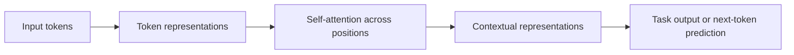
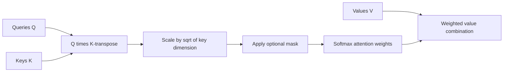
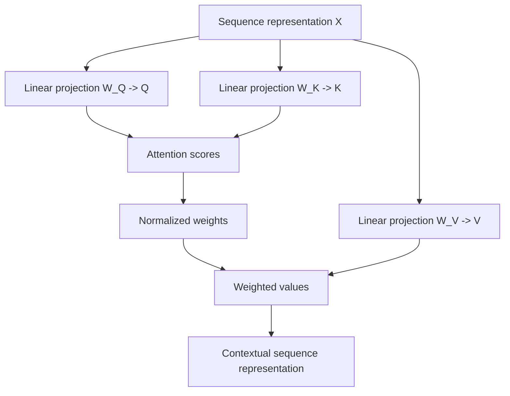
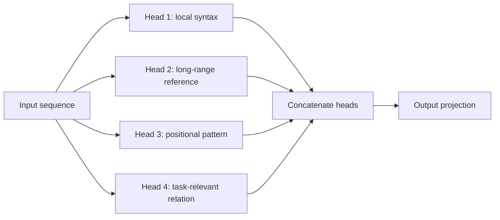
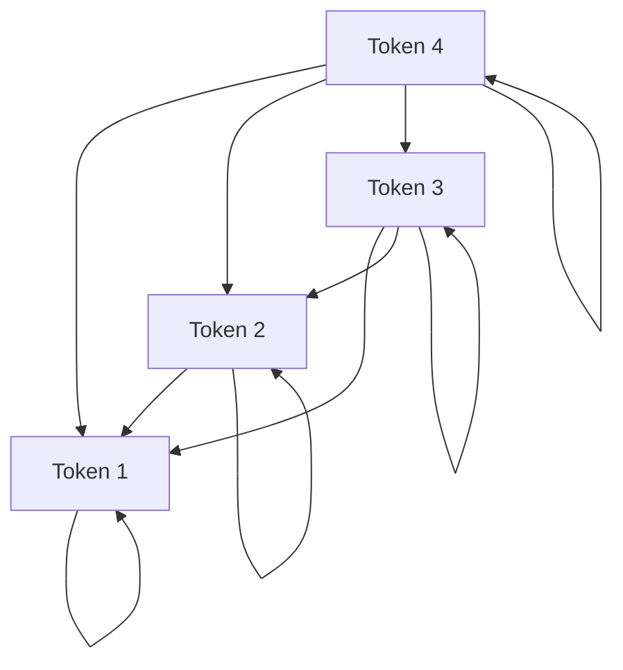
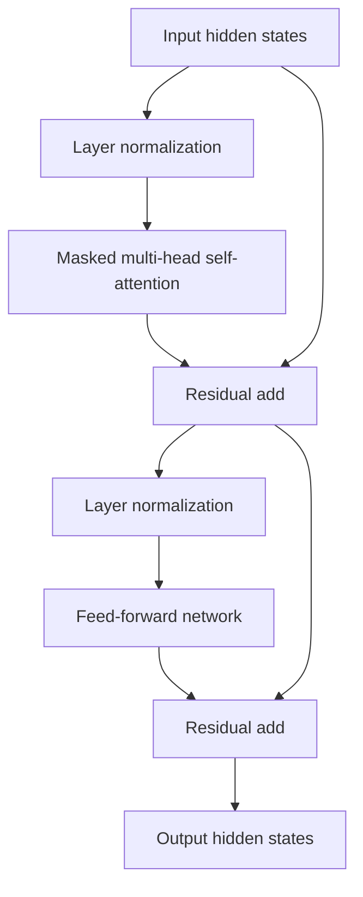
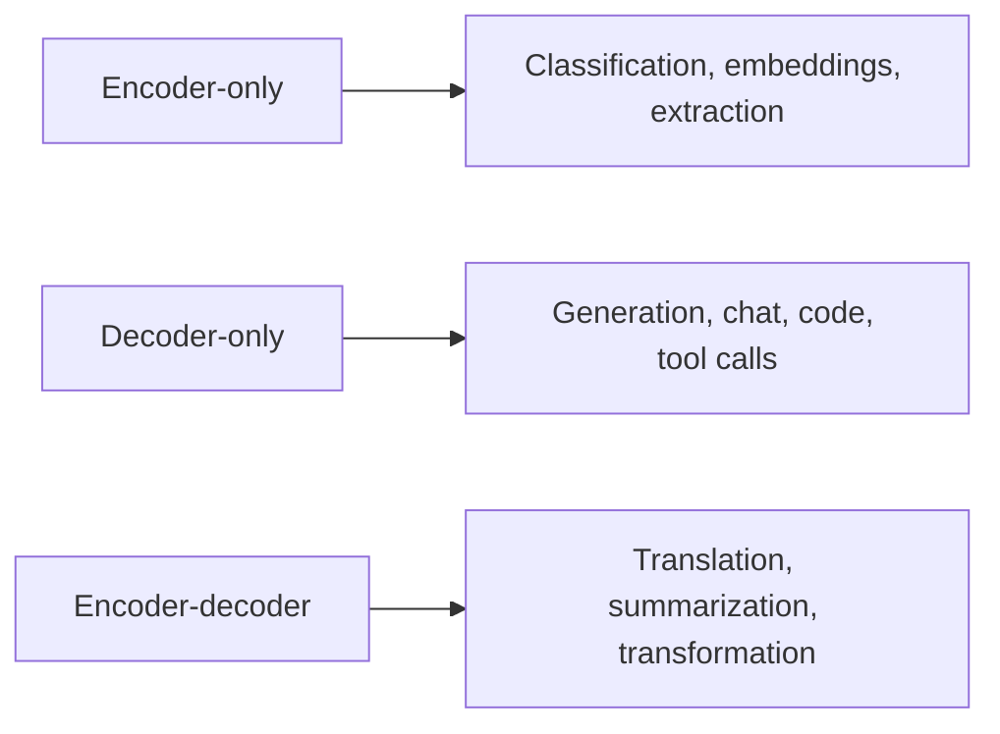
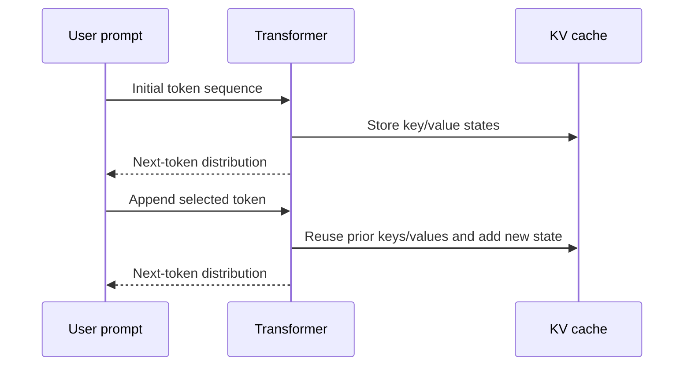
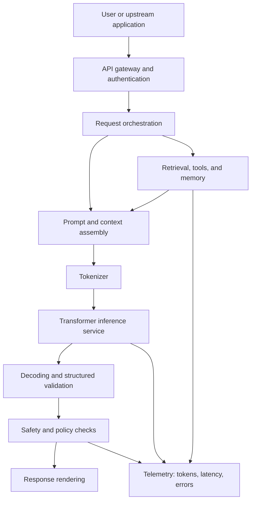

# Chapter 4 - Transformers and Attention

> **Source basis:** The board presents transformers and large language models as later stages in the progression from machine learning and deep learning toward agentic AI [Board, p. 51]. It does not provide a detailed transformer architecture. Most of this chapter is therefore marked **Supplementary** and supplies the technical foundation required for the later chapters on LLMs, embeddings, RAG, tool-using agents, and multimodal systems.

---

## Learning objectives

By the end of this chapter, you should be able to:

1. Explain why attention-based architectures replaced recurrent networks for many language tasks.
2. Describe queries, keys, values, attention scores, masks, and weighted combinations.
3. Explain self-attention and distinguish it from cross-attention.
4. Describe multi-head attention and why multiple heads are useful.
5. Explain positional encodings and why order information must be added explicitly.
6. Identify the major components of a transformer block.
7. Compare encoder-only, decoder-only, and encoder-decoder architectures.
8. Explain causal language modeling, masked language modeling, and sequence-to-sequence training.
9. Describe how autoregressive generation and key-value caching work.
10. Recognize transformer limitations involving context length, latency, memory, and data quality.

---

## 1. Why transformers matter

The previous chapter introduced representation learning: a model transforms raw inputs into internal representations that support a task. Transformers are a particularly powerful representation-learning architecture for sequences.

Before transformers, many language systems used recurrent neural networks (RNNs), long short-term memory networks (LSTMs), or gated recurrent units (GRUs). These models process a sequence step by step.

```text
Token 1 -> hidden state 1 -> Token 2 -> hidden state 2 -> Token 3 -> ...
```

This sequential structure has two important consequences:

- training cannot fully parallelize across sequence positions;
- information from distant tokens must travel through many recurrent steps.

Transformers introduced a different pattern. Every token can directly compare itself with other tokens in the current context through attention.



This architecture made it practical to train much larger models on much larger datasets. It is the foundation of most modern large language models and many multimodal models.

> **Key idea**
>
> A transformer does not process language as isolated words. It repeatedly builds context-aware representations by allowing each token to attend to other relevant tokens.

---

## 2. The sequence-modeling problem

Consider the sentence:

```text
The technician placed the sample in the freezer because it was unstable.
```

The meaning of `it` depends on context. Does `it` refer to the technician, the sample, or the freezer? A useful model must compare the pronoun with earlier tokens and infer the strongest relationship.

A bag-of-words model cannot solve this reliably because it discards order. A fixed-size feature vector may also lose important relationships. A recurrent model can carry context forward, but distant information may weaken as the sequence grows.

Attention offers a more direct mechanism:

```text
Representation of "it"
        |
        +--> compare with "technician"
        +--> compare with "sample"
        +--> compare with "freezer"
        +--> compare with "unstable"
        |
        +--> combine the most relevant information
```

The model learns these relationships from data rather than from manually written grammar rules.

### 2.1 Context changes representation

A token does not have one universal contextual meaning.

Compare:

```text
The cell was placed in culture.
The prisoner returned to the cell.
The spreadsheet cell contains a formula.
```

The same surface token, `cell`, participates in different relationships. A transformer starts with a token embedding and then updates that representation using surrounding context.

### 2.2 Local and long-range relationships

Language contains many types of relationships:

- subject and verb agreement;
- pronoun references;
- modifier and noun relationships;
- cause and effect;
- question and answer structure;
- code variable definition and later use;
- document title and section content;
- instruction and constraint relationships.

Attention is general enough to learn many such patterns.

---

## 3. From tokens to vectors

A transformer operates on numbers, not raw text.

The high-level input pipeline is:

```text
Text -> tokenization -> token IDs -> token embeddings -> transformer layers
```

Suppose a tokenizer converts a short input into four token IDs:

```text
[1542, 981, 77, 2045]
```

An embedding table maps each ID to a vector. If the hidden size is 8, the sequence becomes a matrix with four rows and eight columns.

```text
sequence length = 4
hidden size     = 8
input matrix    = 4 x 8
```

Each row initially represents one token. After passing through transformer layers, each row becomes context-aware.

### 3.1 Static versus contextual embeddings

A token embedding lookup is initially static: the same token ID retrieves the same base vector. Self-attention transforms that base vector according to the current sequence.

```text
base token embedding + positional information
                    |
                    v
             transformer layers
                    |
                    v
       contextual token representation
```

The contextual representation of `bank` in `river bank` will differ from its representation in `investment bank`.

---

## 4. Attention intuition

Attention can be understood as a learned retrieval operation performed inside the model.

For each token, the model asks:

1. What information am I looking for?
2. Which other tokens advertise relevant information?
3. What content should I retrieve from those tokens?

These roles correspond to:

- **Query:** what this position is seeking.
- **Key:** what each position offers for matching.
- **Value:** the information each position contributes if selected.

A useful analogy is a searchable document collection.

| Transformer concept | Retrieval analogy |
|---|---|
| Query | Search request |
| Key | Search index representation |
| Similarity score | Relevance score |
| Value | Retrieved content |
| Weighted sum | Combined evidence |

The analogy is imperfect because attention is learned end to end and occurs repeatedly inside the network. Still, it captures the core mechanism.

---

## 5. Scaled dot-product attention

### 5.1 The core computation

Given matrices of queries `Q`, keys `K`, and values `V`, scaled dot-product attention is commonly written as:

```text
Attention(Q, K, V) = softmax((QK^T) / sqrt(d_k)) V
```

Where:

- `QK^T` computes pairwise similarity scores;
- `d_k` is the key dimension;
- dividing by `sqrt(d_k)` stabilizes score magnitudes;
- softmax converts scores into normalized weights;
- multiplying by `V` produces weighted combinations of values.



### 5.2 Why dot products?

A dot product is large when two vectors point in similar directions and small or negative when they do not. During training, the model learns query and key projections that make useful relationships score highly.

### 5.3 Why scale the scores?

When vector dimensions are large, raw dot products can become large in magnitude. Softmax may then become extremely peaked, which can produce small gradients and unstable optimization. Scaling reduces that problem.

### 5.4 Why softmax?

Softmax converts arbitrary scores into positive weights that sum to one.

Example:

```text
raw scores:       [2.0, 1.0, -0.5]
attention weights:[0.69, 0.25, 0.06]
```

The output is a weighted average of value vectors. The model therefore combines information rather than selecting only one position.

> **Important limitation**
>
> Attention weights are not automatically reliable explanations of model reasoning. They show one internal weighting mechanism, not a complete causal account of the final prediction.

---

## 6. Queries, keys, and values in self-attention

In self-attention, `Q`, `K`, and `V` are all derived from the same sequence representation `X` using learned matrices.

```text
Q = XW_Q
K = XW_K
V = XW_V
```

Where `W_Q`, `W_K`, and `W_V` are trainable parameters.



### 6.1 Why use separate projections?

A token may need one representation for matching and another for contributing content. Separate projections allow the model to learn these roles independently.

For example, a pronoun's query may learn to seek noun phrases, while a noun's key indicates whether it is a plausible referent. Its value may carry semantic and grammatical information that should be transferred.

### 6.2 Self-attention versus cross-attention

**Self-attention** derives queries, keys, and values from the same sequence.

```text
Q from sequence A
K from sequence A
V from sequence A
```

**Cross-attention** derives queries from one sequence and keys and values from another.

```text
Q from decoder state
K from encoder output
V from encoder output
```

Cross-attention is central to classic encoder-decoder models used for translation and other sequence-to-sequence tasks. It also appears in multimodal systems where text attends to image or audio representations.

---

## 7. A worked attention example

Consider three simplified token representations:

```text
Token A: [1, 0]
Token B: [0, 1]
Token C: [1, 1]
```

Assume, only for illustration, that the query, key, and value projections are identity mappings. The query for Token A is `[1, 0]`.

Dot products with keys are:

```text
A with A: 1*1 + 0*0 = 1
A with B: 1*0 + 0*1 = 0
A with C: 1*1 + 0*1 = 1
```

After scaling by `sqrt(2)` and applying softmax, Token A places more weight on A and C than on B. Its new representation becomes a weighted combination of all three values.

This toy example demonstrates the mechanics, but real models differ in several ways:

- projections are learned;
- dimensions are much larger;
- multiple attention heads run in parallel;
- residual connections and normalization are applied;
- many transformer blocks are stacked;
- masks may restrict which positions can interact.

---

## 8. Multi-head attention

One attention operation may need to represent several relationships at once. Multi-head attention performs multiple attention operations using different learned projections.



The labels in the diagram are illustrative. A head is not guaranteed to have one clean human-readable function.

If the hidden size is `d_model` and the model has `h` heads, each head often operates on a smaller subspace. The outputs are concatenated and projected back to the model dimension.

```text
head_i = Attention(XW_Q_i, XW_K_i, XW_V_i)
MultiHead(X) = Concat(head_1, ..., head_h) W_O
```

### 8.1 Why multiple heads help

Different heads can attend to different positions or represent different patterns. This increases the model's capacity to combine several relationships within one layer.

### 8.2 More heads are not always better

The number of heads interacts with hidden size, training data, model depth, and hardware. Adding heads without sufficient per-head dimension or training signal may not improve quality.

---

## 9. Positional information

Self-attention by itself is permutation-equivariant: if token positions are reordered and no positional signal is provided, the attention mechanism has no inherent concept of sequence order.

Yet order changes meaning:

```text
The dog chased the cat.
The cat chased the dog.
```

Transformers therefore add or encode positional information.

### 9.1 Absolute positional encoding

The original transformer used sinusoidal functions to produce a vector for each position. That vector was added to the token embedding.

```text
input representation = token embedding + position encoding
```

### 9.2 Learned positional embeddings

Some models learn a vector for each supported position. This is simple but ties the model to a configured position range unless the method is extended.

### 9.3 Relative and rotary position methods

Modern architectures often represent relative position or rotate query and key components as a function of position. These methods can improve how attention captures distance and order.

> **Key idea**
>
> Positional methods do not add facts to the sequence. They give the model a way to distinguish where tokens occur and how far apart they are.

---

## 10. Masks and visibility rules

A mask controls which positions may attend to which other positions.

### 10.1 Padding mask

Batches often contain sequences of different lengths. Short sequences are padded to a common length. Padding masks prevent the model from treating padding tokens as meaningful content.

### 10.2 Causal mask

A decoder-only language model predicts the next token. During training, the token at position `t` must not see future positions.

```text
Position 1 can see: 1
Position 2 can see: 1, 2
Position 3 can see: 1, 2, 3
Position 4 can see: 1, 2, 3, 4
```

The resulting visibility matrix is triangular.



This mask prevents information leakage from future tokens during training.

### 10.3 Application-specific masks

Other masks can represent:

- document boundaries;
- local attention windows;
- prefix visibility;
- protected or unavailable modalities;
- packed training examples;
- structured graph relationships.

A mask is therefore part of the architecture's information-flow policy.

---

## 11. The transformer block

A transformer model stacks repeated blocks. The exact order varies by architecture, but a common decoder block includes:

1. normalization;
2. masked self-attention;
3. residual connection;
4. normalization;
5. feed-forward network;
6. residual connection.



### 11.1 Residual connections

A residual connection adds the block input to the transformed output.

```text
output = input + transformation(input)
```

This helps information and gradients move through deep networks.

### 11.2 Layer normalization

Layer normalization stabilizes hidden-state statistics. It supports optimization across deep stacks and changing batch conditions.

### 11.3 Feed-forward network

After attention mixes information across positions, a feed-forward network transforms each position independently using the same learned parameters.

A simplified form is:

```text
FFN(x) = activation(xW_1 + b_1)W_2 + b_2
```

The intermediate dimension is often larger than the model hidden size, allowing richer nonlinear transformation.

### 11.4 Attention and feed-forward layers have different roles

A useful simplification is:

- attention moves and combines information across positions;
- the feed-forward network transforms the representation at each position.

Both contribute to the model's capability.

---

## 12. Transformer architecture families

### 12.1 Encoder-only models

Encoder-only transformers use bidirectional self-attention. Every token can attend to tokens on both sides.

```text
Input -> encoder blocks -> contextual representations -> task head
```

Typical uses include:

- text classification;
- token classification;
- semantic embeddings;
- reranking;
- extractive question answering.

A common training objective masks selected tokens and asks the model to reconstruct them.

### 12.2 Decoder-only models

Decoder-only transformers use causal self-attention.

```text
Prompt -> decoder blocks -> next-token distribution -> generated continuation
```

Typical uses include:

- open-ended text generation;
- code generation;
- conversational assistants;
- tool-call generation;
- agent reasoning and planning outputs.

Most general-purpose generative LLMs use this family.

### 12.3 Encoder-decoder models

Encoder-decoder transformers separate input understanding from output generation.

```text
Source input -> encoder -> encoded source
Target prefix -> decoder + cross-attention -> next output token
```

Typical uses include:

- translation;
- summarization;
- structured transformation;
- speech-to-text or multimodal sequence conversion.



### 12.4 Choose architecture by task shape

| Task shape | Common family | Reason |
|---|---|---|
| Understand or classify a complete input | Encoder-only | Bidirectional context is available |
| Continue or generate from a prefix | Decoder-only | Causal objective matches generation |
| Transform one sequence into another | Encoder-decoder | Dedicated source encoding and target decoding |

This is a design heuristic, not an absolute rule.

---

## 13. Training objectives

A transformer architecture does not determine the task by itself. The training objective shapes behavior.

### 13.1 Causal language modeling

The model predicts the next token from previous tokens.

```text
Input:  The sample was stored at
Target: 4
```

Training is parallelized across positions using a causal mask, even though generation later occurs one token at a time.

### 13.2 Masked language modeling

Selected tokens are hidden or corrupted and the model predicts them using surrounding context.

```text
The sample was stored at [MASK] degrees.
```

This objective is well suited to bidirectional encoders.

### 13.3 Sequence-to-sequence objective

The encoder processes a source sequence, and the decoder predicts the target sequence.

```text
Source: laboratory procedure text
Target: structured checklist
```

### 13.4 Contrastive objectives

Embedding models may learn by bringing related items closer and unrelated items farther apart in representation space.

Examples include:

- query and relevant passage;
- sentence and paraphrase;
- image and matching caption;
- product description and correct category.

Contrastive learning connects transformers to semantic retrieval and RAG.

---

## 14. How autoregressive generation works

A decoder-only model generates one token at a time.

```text
Prompt -> predict token 1
Prompt + token 1 -> predict token 2
Prompt + token 1 + token 2 -> predict token 3
...
```



### 14.1 Token selection

The model outputs logits over the vocabulary. A decoding strategy selects the next token.

Common strategies include:

- greedy decoding;
- temperature sampling;
- top-k sampling;
- nucleus or top-p sampling;
- constrained decoding;
- beam search for some structured tasks.

These strategies change output diversity and determinism. They do not change the model's learned knowledge.

### 14.2 Key-value cache

Without caching, each generation step would recompute attention states for the entire prefix. A key-value cache stores prior key and value tensors so that the model only computes new states for the appended token.

This reduces repeated computation but consumes memory proportional to context length, layer count, batch size, and key/value dimensions.

### 14.3 Time to first token versus time per output token

User experience depends on more than total latency.

- **Time to first token:** prompt processing, routing, retrieval, and initial model computation.
- **Inter-token latency:** speed of subsequent generation steps.
- **Total completion time:** full output duration.

Streaming can improve perceived responsiveness even when total computation is unchanged.

---

## 15. Context windows

A context window is the amount of tokenized input and generated output the model can process within one request, subject to model and serving constraints.

A larger context window can support:

- longer conversations;
- larger documents;
- more retrieved passages;
- richer tool traces;
- longer codebases;
- multimodal inputs.

It does not guarantee that every token receives equal attention or that performance remains constant at extreme lengths.

### 15.1 Context is a constrained resource

A production system must allocate context among:

- system instructions;
- user input;
- conversation history;
- retrieved evidence;
- tool observations;
- structured schemas;
- examples;
- reserved generation capacity.

```text
Total context budget
    = instructions
    + history
    + retrieved context
    + tool results
    + current request
    + output allowance
```

### 15.2 More context can reduce quality

Unfiltered context may introduce:

- conflicting facts;
- irrelevant passages;
- repeated instructions;
- stale state;
- malicious content;
- excessive latency and cost.

This is why RAG requires retrieval, ranking, filtering, and prompt construction rather than indiscriminately inserting documents.

---

## 16. Computational characteristics

### 16.1 Attention cost

Standard full attention compares every token with every other token. Its attention-score matrix grows approximately with the square of sequence length.

```text
n tokens -> n x n pairwise score matrix
```

Doubling the sequence length can therefore increase attention computation and memory substantially.

### 16.2 Parameter memory and activation memory

Serving a transformer involves several memory categories:

- model parameters;
- optimizer states during training;
- activations during training or inference;
- key-value cache during generation;
- temporary attention and kernel workspaces.

### 16.3 Optimization approaches

Systems may reduce cost through:

- lower-precision arithmetic;
- quantization;
- efficient attention kernels;
- grouped-query or multi-query attention;
- context compression;
- retrieval instead of full-document insertion;
- model distillation;
- batching;
- speculative decoding;
- smaller models for routing or simple tasks.

> **Engineering principle**
>
> Optimize the largest measured bottleneck. Do not assume that model inference is always the only source of latency.

---

## 17. A production transformer stack

A transformer model is one component in a larger product system.



The model cannot independently guarantee:

- user authorization;
- source freshness;
- correct tool permissions;
- valid business transactions;
- policy compliance;
- durable workflow state;
- rollback;
- complete observability.

Those responsibilities belong to the surrounding system.

---

## 18. Worked enterprise example: support knowledge assistant

Consider an internal support assistant that answers questions about approved procedures.

### 18.1 Model role

The transformer performs language understanding and generation:

- interprets the question;
- integrates retrieved passages;
- follows output instructions;
- generates a grounded explanation.

### 18.2 System responsibilities

The surrounding application must:

- authenticate the employee;
- retrieve only permitted documents;
- filter stale or superseded policies;
- preserve source citations;
- validate that the answer is based on evidence;
- escalate when confidence or coverage is insufficient;
- log retrieval and model events.

### 18.3 End-to-end flow

```text
Employee question
    -> identity and permission check
    -> query embedding and retrieval
    -> passage ranking
    -> prompt assembly
    -> transformer generation
    -> citation and policy validation
    -> response or escalation
```

### 18.4 Why the transformer alone is insufficient

A language model may produce fluent text even when:

- the correct policy was not retrieved;
- retrieved sources conflict;
- a document is out of date;
- the user lacks permission;
- the request requires an approved transaction;
- the model is asked to infer a legal conclusion.

The product must therefore separate language capability from business authority.

---

## 19. Common misconceptions

### Misconception 1: Attention is the same as human attention

Transformer attention is a mathematical weighting mechanism. It should not be equated with consciousness, intention, or human cognitive focus.

### Misconception 2: The model stores documents as readable records

A pretrained model stores distributed statistical patterns in parameters. It is not a document database and cannot reliably reproduce source provenance from parameters alone.

### Misconception 3: A larger context eliminates RAG

Large context can hold more information, but retrieval still helps select relevant, current, authorized, and auditable evidence.

### Misconception 4: More parameters always solve the problem

Quality also depends on data, objective, evaluation, inference configuration, retrieval, tools, policies, and user experience.

### Misconception 5: Attention weights prove why an answer was generated

They expose one internal signal but do not provide a complete explanation of the model's decision path.

### Misconception 6: Transformers reason exactly like programs

Transformers generate outputs through learned numerical transformations. They can imitate structured reasoning patterns, but deterministic guarantees require external tools, constraints, and validation.

---

## 20. Failure modes and risks

### 20.1 Context contamination

Untrusted retrieved text may contain instructions that conflict with the system's goal. The application must treat retrieved content as data, not authority.

### 20.2 Hallucination

The model may produce plausible but unsupported statements. Grounding, citations, constrained output, and evaluation reduce but do not eliminate this risk.

### 20.3 Position and length sensitivity

Models may underuse information buried in long contexts or behave differently when instructions are reordered.

### 20.4 Tokenization surprises

Identifiers, chemical names, code, multilingual text, and unusual formatting may split into many tokens. This affects cost, context usage, and sometimes quality.

### 20.5 Repetition and degeneration

Poor decoding settings or model limitations can produce loops, repeated phrases, or incoherent continuations.

### 20.6 Prompt-data boundary confusion

The model processes instructions and data in one token stream. Without application-level controls, malicious data may attempt to redirect behavior.

### 20.7 Unbounded generation

A model should have token limits, stop conditions, tool-call limits, and workflow termination rules.

---

## 21. Best practices

### Architecture

- Choose encoder, decoder, or encoder-decoder architecture based on task shape.
- Use the smallest model that meets measured quality requirements.
- Separate model capability from permissions and transaction authority.
- Design explicit context and token budgets.

### Prompt and context

- Keep authoritative instructions distinct from retrieved content.
- Retrieve and rank evidence instead of inserting everything.
- Remove duplicate or stale context.
- Reserve space for the model's output.

### Inference

- Measure time to first token, inter-token latency, and total completion time.
- Use deterministic or constrained decoding where structure matters.
- Validate generated JSON, SQL, code, or tool arguments before execution.
- Cap output length and tool-call depth.

### Evaluation

- Test short, long, multilingual, adversarial, and ambiguous inputs.
- Evaluate grounding, relevance, instruction adherence, and safety separately.
- Measure quality at the complete-system level, not only the model level.
- Maintain regression suites for prompt, model, tokenizer, and retrieval changes.

### Operations

- Record model version, prompt version, retrieval trace, token counts, latency, and errors.
- Monitor drift in input patterns and failure categories.
- Provide fallbacks and human escalation for high-impact decisions.

---

## 22. Runnable example: scaled dot-product attention

The repository includes:

```text
examples/04-transformers/scaled_dot_product_attention.py
```

The example implements a small attention calculation using only the Python standard library. It demonstrates:

- matrix multiplication;
- score scaling;
- causal masking;
- row-wise softmax;
- weighted value combination.

Run it with:

```bash
python examples/04-transformers/scaled_dot_product_attention.py
```

The code is educational rather than optimized. Production transformer implementations use specialized tensor libraries and hardware kernels.

---

## 23. Hands-on lab: inspect attention behavior

### Goal

Use the provided Python example to understand how queries, keys, values, and masks change the output.

### Tasks

1. Run the example without a causal mask.
2. Enable the causal mask and compare the attention matrix.
3. Modify one key vector so that it strongly matches the first query.
4. Observe how the first output vector changes.
5. Replace one value vector while keeping its key unchanged.
6. Explain why the attention weight remains similar while the retrieved content changes.
7. Increase the vector dimension and verify that scaling affects the softmax distribution.

### Extension

Create a padding mask for a four-token batch where the final position is padding. Confirm that no query assigns weight to that position.

### Expected learning

The lab should make the distinction clear:

- keys control matching;
- values control contributed content;
- queries define what is sought;
- masks define allowed information flow.

---

## 24. Architecture exercise

Design the model-facing portion of a document summarization service.

Requirements:

- accept documents up to 200 pages;
- produce an executive summary and a detailed summary;
- preserve section references;
- support confidential documents;
- detect unsupported claims;
- complete within an agreed latency budget.

Answer these questions:

1. Would you place the entire document in one context? Why or why not?
2. Which work should be performed by the transformer, and which by the application?
3. How would you chunk and hierarchically summarize the document?
4. How would you preserve source mapping?
5. How would you validate the final summary?
6. What telemetry would you collect?
7. What should happen when the document exceeds supported limits?

---

## 25. Knowledge check

1. What problem does self-attention solve in sequence modeling?
2. What are the different roles of queries, keys, and values?
3. Why are attention scores divided by the square root of the key dimension?
4. How does self-attention differ from cross-attention?
5. Why does a transformer need positional information?
6. What does a causal mask prevent?
7. What is the purpose of a residual connection?
8. How do encoder-only and decoder-only architectures differ?
9. Why is generation sequential even though training can be parallelized across positions?
10. What does a key-value cache store?
11. Why can a large context window still require retrieval?
12. Which parts of an enterprise AI product are not the transformer's responsibility?

---

## 26. Interview questions

### Beginner

1. Explain attention using a non-mathematical analogy.
2. What is self-attention?
3. Why are positional encodings needed?
4. What is the difference between encoder-only and decoder-only transformers?
5. What does a causal mask do?

### Intermediate

1. Walk through scaled dot-product attention step by step.
2. Why are query, key, and value projections learned separately?
3. What is multi-head attention, and what benefit does it provide?
4. Explain the roles of attention, feed-forward layers, normalization, and residual connections.
5. Compare masked language modeling and causal language modeling.
6. Explain the key-value cache and its memory trade-off.
7. Why does standard attention become expensive for long sequences?

### Advanced

1. Design an inference service for long-context document analysis with strict latency targets.
2. How would you distinguish model latency from retrieval, routing, and tool latency?
3. What failure modes arise when untrusted retrieved text is inserted into the model context?
4. How would you evaluate whether a longer context window actually improves a production task?
5. Compare full attention, local attention, and retrieval-based context selection.
6. What controls are required before allowing a decoder-only model to invoke write-capable tools?
7. Explain why attention weights are not a complete explanation method.

---

## 27. Chapter summary

Transformers are sequence models built around attention. They create contextual representations by allowing each token to compare itself with other permitted positions and combine relevant value information.

The core mechanism uses learned query, key, and value projections. Dot-product scores are scaled, optionally masked, normalized, and used to combine values. Multi-head attention repeats this process in multiple learned subspaces. Positional methods introduce order, while residual connections, normalization, and feed-forward networks make deep transformer stacks trainable and expressive.

Encoder-only models are commonly used for understanding and representation tasks. Decoder-only models use causal masking for autoregressive generation. Encoder-decoder models transform one sequence into another through source encoding and cross-attention.

In production, the transformer is only one layer. Authentication, retrieval, permissions, state, validation, monitoring, safety, and human escalation belong to the complete system. This distinction becomes essential in later chapters on LLM applications, RAG, and autonomous agents.

---

## 28. Next chapter

Chapter 5 builds on this architecture to explain large language models, including:

- pretraining and next-token prediction;
- tokenization and vocabulary design;
- scaling and emergent capability;
- instruction tuning and preference optimization;
- prompting and in-context learning;
- hallucination and uncertainty;
- model selection and deployment;
- the transition from an LLM to an agentic system.
