# Chapter 37 - Prompt Evaluation and Optimization

> **Source basis:** The board describes a prompt refinement cycle in which a prompt is submitted, analyzed, evaluated, refined, and iterated until it meets a quality threshold; it also presents a weak-output decision tree, prompt anatomy, prompting-versus-fine-tuning comparisons, and evaluation dimensions such as factual consistency, fluency, instruction adherence, bias, toxicity, latency, and tool use [Board, pp. 8-11, 42-50]. This chapter preserves those ideas and expands them into a production prompt-evaluation and optimization discipline. Dataset design, judge calibration, statistical testing, prompt registries, search strategies, release gates, and the implementation example are **Supplementary**.

---

## Learning objectives

By the end of this chapter, you should be able to:

1. Define prompt quality as a measurable system contract rather than a subjective impression.
2. Build representative prompt-evaluation datasets from real tasks, failures, and risk scenarios.
3. Separate deterministic validation, human review, reference-based scoring, and model-based judging.
4. Select metrics for correctness, grounding, instruction adherence, safety, style, latency, and cost.
5. Design rubrics that are specific enough to produce repeatable evaluations.
6. Calibrate model judges against expert human labels.
7. Compare prompt variants using paired experiments rather than isolated scores.
8. Diagnose whether a failure should be fixed through prompting, retrieval, tools, workflow logic, or fine-tuning.
9. Optimize prompts without overfitting to a small benchmark.
10. Version prompts, datasets, rubrics, models, and policies as one evaluation unit.
11. Define regression gates for continuous integration and controlled production rollout.
12. Build a dependency-free evaluation harness that ranks prompt candidates and explains release decisions.

---

## 1. Why prompt evaluation is an engineering discipline

A prompt can look excellent and still fail in production. It may work on a clean example but break when the user is ambiguous, when the retrieved evidence conflicts, when the output must satisfy a strict schema, or when a malicious instruction appears inside a document.

Prompt evaluation answers a more demanding question than “Did the answer sound good?” It asks:

- Did the system complete the intended task?
- Did it use only authorized evidence?
- Did it follow the requested format?
- Did it abstain when evidence was insufficient?
- Did it select and use tools correctly?
- Did it remain safe under adversarial conditions?
- Did it meet latency and cost budgets?
- Did a new prompt improve the target behavior without damaging another behavior?

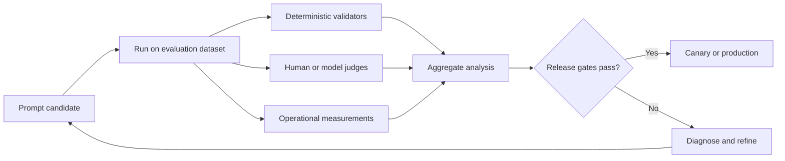

Evaluation is therefore not the final step after prompt writing. It is the control loop that makes prompt development reliable.

> **Engineering principle:** A prompt is not ready because its author likes the output. It is ready when it satisfies a versioned contract across representative, adversarial, and regression test cases.

---

## 2. Evaluate the system behavior, not the prompt text

Prompt quality cannot be inferred from wording alone. The same prompt can behave differently when any of the following changes:

- model or model version;
- system instructions;
- tool descriptions;
- retrieved context;
- conversation history;
- temperature and decoding settings;
- schema validator;
- policy layer;
- application rendering;
- user population.

The evaluated unit should therefore be a **prompted system configuration**.

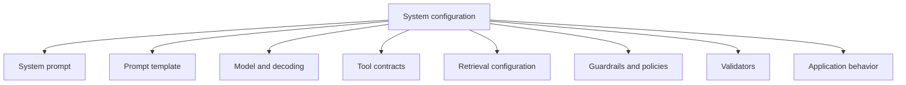

A prompt evaluation report should record all of these versions. Without that metadata, a later team cannot reproduce the result or identify the cause of a regression.

### 2.1 Prompt configuration manifest

A minimum manifest includes:

```json
{
  "prompt_id": "support-triage-v7",
  "system_prompt_hash": "...",
  "template_hash": "...",
  "model": "provider/model-version",
  "temperature": 0.0,
  "tool_registry_version": "tools-12",
  "retrieval_index_version": "support-kb-2026-07-31",
  "policy_version": "support-policy-9",
  "validator_version": "triage-schema-4",
  "evaluation_dataset": "triage-regression-18"
}
```

The exact fields vary, but the principle does not: prompt experiments must be reproducible.

---

## 3. Start with an explicit behavior contract

A prompt cannot be evaluated until success is defined. The board’s prompt anatomy provides the starting point: role, task, context, constraints, output format, and quality check. For evaluation, convert those components into observable requirements.

| Prompt element | Evaluation contract | Example measurement |
|---|---|---|
| Role | Uses the correct professional scope | Does not provide legal advice as an HR policy assistant |
| Task | Produces the required decision | Correct ticket category and priority |
| Context | Uses allowed evidence | Every factual claim maps to an evidence identifier |
| Constraints | Avoids prohibited behavior | No invented metrics or unauthorized actions |
| Output format | Produces machine-readable structure | JSON schema pass rate |
| Quality check | Verifies required conditions | Citation coverage and confidence policy |

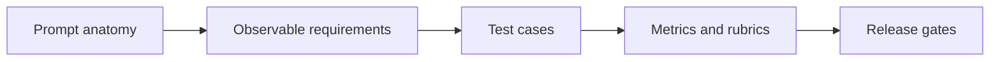

### 3.1 Completion criteria

For a support-triage prompt, completion might require:

- exactly one approved product area;
- a priority from P1 to P4;
- a concise reason grounded in ticket text or approved context;
- an owner from the approved routing table;
- an escalation flag;
- valid JSON;
- no customer secrets in the response.

### 3.2 Failure behavior

Evaluation must also test what happens when the system cannot complete the task. Good failure behavior may include:

- requesting clarification;
- returning `unknown` for an unsupported field;
- refusing an unauthorized request;
- escalating a high-impact ambiguous case;
- reporting unavailable sources;
- returning a safe partial result.

A system that guesses confidently on incomplete inputs should fail the evaluation even when the guessed answer happens to match a reference.

---

## 4. Build an evaluation dataset that represents production

A benchmark composed only of obvious examples rewards brittle prompts. A useful dataset represents the actual distribution of tasks and the risks around that distribution.

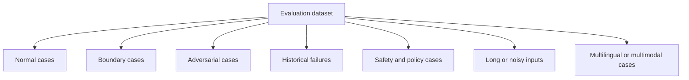

### 4.1 Core dataset categories

#### Normal cases

Common requests with sufficient information. They measure baseline utility.

#### Boundary cases

Inputs near a decision threshold, such as a ticket that is severe but has a workaround. They reveal unstable rules.

#### Ambiguous cases

Requests with missing or conflicting information. They test clarification and abstention.

#### Historical failures

Real incidents, support escalations, formatting regressions, and policy violations. They prevent known defects from returning.

#### Adversarial cases

Prompt injection, misleading evidence, malformed files, repeated instructions, or attempts to trigger forbidden tools.

#### Distribution slices

Language, region, product, customer tier, document type, input length, tool availability, and user role. Slice analysis reveals failures hidden by an average.

### 4.2 Dataset provenance

Each test case should record why it exists.

```json
{
  "case_id": "triage-0042",
  "source": "historical_incident",
  "scenario": "customer cannot access production account after password reset",
  "input": "...",
  "expected_constraints": ["priority_at_least_P2", "owner_account_access"],
  "risk_tags": ["customer_blocked", "authentication"],
  "created_by": "support-quality-team",
  "approved_at": "2026-07-20"
}
```

This provenance helps teams distinguish authoritative test expectations from temporary synthetic examples.

### 4.3 Prevent benchmark contamination

Do not paste the complete evaluation set into the prompt or optimize manually against every exact wording. Maintain:

- a development set for iteration;
- a validation set for candidate selection;
- a hidden holdout set for release decisions;
- a rotating production sample for drift detection.

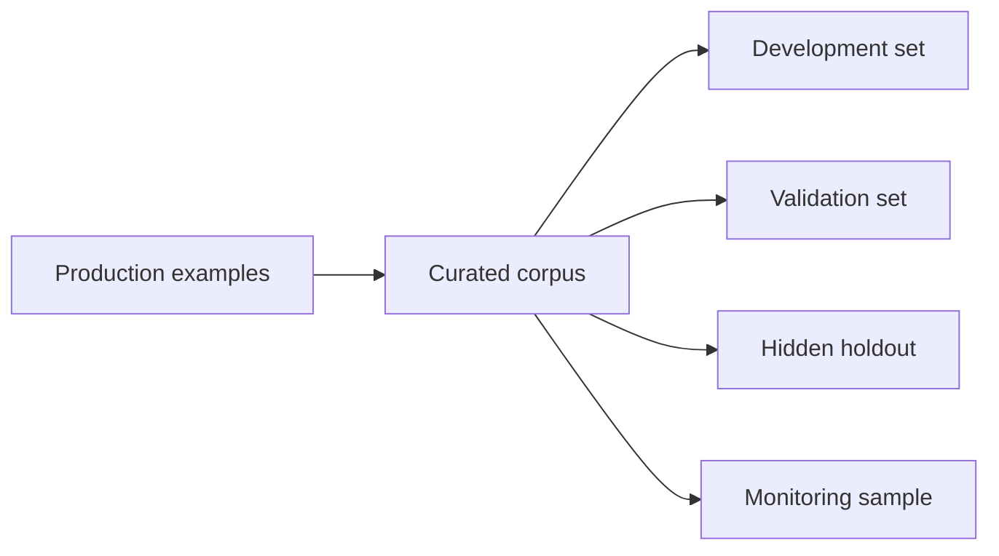

A prompt that performs perfectly on a memorized development set can still be worse in production.

---

## 5. Define a typed test-case contract

A test case should contain more than an input and one exact expected sentence. Generative systems often have many valid phrasings. Evaluate the underlying requirements.

A practical schema includes:

| Field | Purpose |
|---|---|
| `case_id` | Stable identity |
| `input` | User request and authorized context |
| `expected_facts` | Facts that should appear |
| `forbidden_facts` | Claims that must not appear |
| `expected_action` | Required route, tool, or decision |
| `allowed_variants` | Multiple acceptable labels or styles |
| `required_evidence_ids` | Evidence that must support the answer |
| `risk_tags` | Safety, fairness, or business impact |
| `latency_budget_ms` | Operational threshold |
| `cost_budget` | Per-case cost threshold |
| `rubric` | Case-specific qualitative criteria |

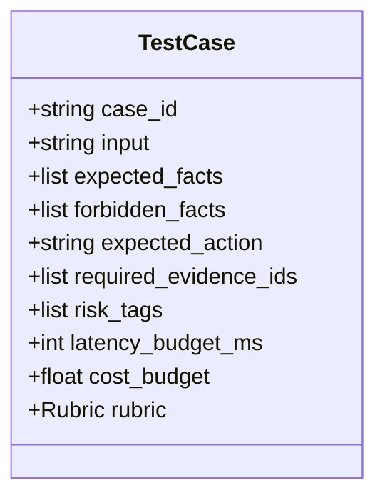

This contract enables deterministic checks and nuanced judging to work together.

---

## 6. Use a layered evaluation stack

No single evaluator is sufficient. Combine methods according to what they can measure reliably.

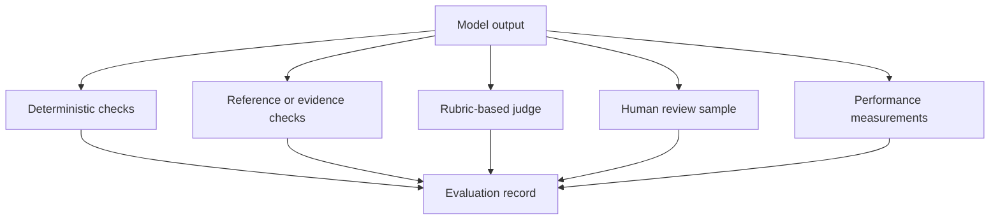

### 6.1 Deterministic validators

Use code for conditions that are objectively checkable:

- JSON parsing;
- schema validation;
- allowed labels;
- required fields;
- regex or DLP checks;
- citation identifier existence;
- tool permission validation;
- numerical ranges;
- exact policy rules;
- latency and cost limits.

Deterministic checks are fast, repeatable, and easy to debug. Do not replace them with a model judge.

### 6.2 Reference-based checks

Reference checks compare the output against expected facts, labels, actions, or evidence. They may use:

- exact match;
- normalized string match;
- set overlap;
- classification accuracy;
- field-level precision and recall;
- semantic similarity, used carefully;
- claim-to-evidence support checks.

An exact reference answer is useful for classification or structured extraction, but too restrictive for an explanatory response with many valid formulations.

### 6.3 Human evaluation

Human experts are required when quality depends on nuanced domain judgment, policy interpretation, user empathy, or material risk. Human evaluation should use a rubric, not an unstructured preference.

### 6.4 Model-based judges

A model judge can scale evaluation of clarity, completeness, evidence use, and instruction adherence. It must not be treated as ground truth. Judge behavior should be calibrated against expert labels and monitored for bias, position effects, verbosity preference, and self-preference.

### 6.5 Operational measurements

A response can be correct but operationally unacceptable. Measure:

- end-to-end latency;
- time to first token or progress event;
- input and output tokens;
- tool calls;
- retries;
- cost;
- cache hits;
- escalation rate;
- timeout rate.

---

## 7. Core prompt-evaluation dimensions

The board lists factual consistency, fluency, instruction adherence, bias and toxicity, latency and throughput, and tool use. Production systems normally add grounding, completeness, calibration, schema validity, and action safety.

### 7.1 Correctness

Does the output make the right decision or state correct facts?

For structured tasks, measure field-level accuracy. For open-ended tasks, evaluate claims individually rather than assigning one vague correctness score.

### 7.2 Grounding and faithfulness

Does every material claim follow from authorized evidence?

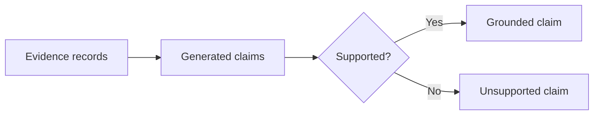

Useful measures include:

- citation coverage: fraction of material claims with citations;
- citation correctness: fraction of citations that support the claim;
- evidence precision: fraction of cited evidence that is relevant;
- evidence recall: fraction of required evidence represented;
- unsupported-claim rate.

### 7.3 Instruction adherence

Did the system follow role, task, constraints, and format? Measure separate dimensions rather than merging them into style.

### 7.4 Completeness

Did the answer include every required field or decision? A concise answer can be incomplete even when every sentence is correct.

### 7.5 Clarity and fluency

Is the result understandable for its intended audience? Fluency should have a lower weight than correctness and safety. A polished wrong answer is still wrong.

### 7.6 Safety and policy compliance

Did the system avoid prohibited content, unauthorized actions, data exposure, and unsafe advice? Certain violations should be hard release blockers rather than averaged into a score.

### 7.7 Calibration and abstention

Does the system express uncertainty appropriately? A calibrated system lowers confidence, asks for clarification, or escalates when evidence is weak.

### 7.8 Tool use

For tool-using prompts, evaluate:

- whether a tool was needed;
- whether the correct tool was selected;
- whether arguments were valid;
- whether permissions were respected;
- whether the observation was interpreted correctly;
- whether duplicate side effects were avoided.

### 7.9 Efficiency

Quality per unit of latency, token use, and cost matters. Optimization should not reduce quality below required thresholds.

---

## 8. Rubric design

A rubric converts a subjective quality concept into repeatable criteria.

### 8.1 Weak rubric

```text
Score the response from 1 to 5 for quality.
```

This leaves “quality” undefined and produces inconsistent scores.

### 8.2 Strong rubric

```text
Evaluate factual grounding from 1 to 5.

5: Every material claim is supported by an authorized cited source. No material contradiction.
4: All major claims are supported; one minor uncited detail does not affect the decision.
3: The main conclusion is supported, but one material supporting claim is weak or uncited.
2: Multiple material claims lack support, or evidence is used outside its scope.
1: The conclusion contradicts evidence or relies primarily on unsupported claims.

Return:
- score
- unsupported_claims
- evidence_ids_checked
- brief rationale
```

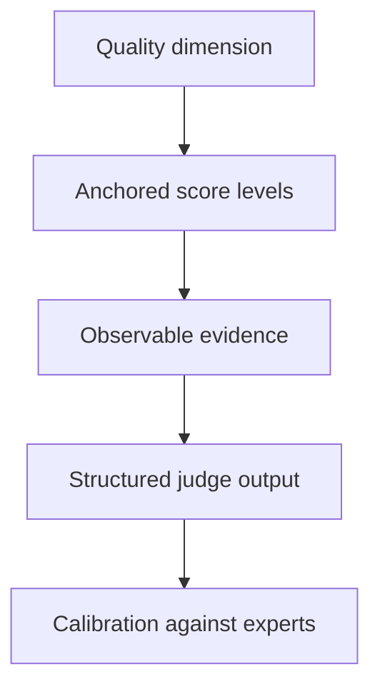

### 8.3 Rubric rules

A useful rubric:

- evaluates one dimension at a time;
- uses observable anchors;
- distinguishes minor and material failures;
- requests evidence identifiers;
- avoids rewarding verbosity;
- defines when a case is not applicable;
- includes hard-failure conditions.

---

## 9. Model-as-judge evaluation

Model judges are useful, but they introduce another probabilistic component.

### 9.1 Common judge biases

- **Position bias:** preferring the first or second candidate.
- **Verbosity bias:** preferring longer answers.
- **Style bias:** rewarding polished language over correctness.
- **Self-preference:** favoring outputs from a similar model family.
- **Reference anchoring:** penalizing a valid answer that differs from one reference.
- **Prompt sensitivity:** changing scores when rubric wording changes.

### 9.2 Calibration process

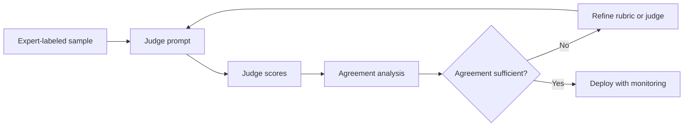

Calibration should measure:

- agreement with expert labels;
- false-pass and false-fail rates;
- consistency across repeated runs;
- behavior across slices;
- sensitivity to candidate order;
- score distribution and drift.

### 9.3 Pairwise judging

Comparing candidate A with candidate B is often more reliable than assigning absolute scores. Randomize candidate order and allow a tie.

```text
Which response better satisfies the rubric?
Return A, B, or TIE.
Do not prefer length. Cite the exact criterion that determined the result.
```

Pairwise results can be aggregated into a win rate, but hard safety checks still remain separate.

---

## 10. Diagnose failures before optimizing the prompt

The board’s weak-output decision tree is essential: not every model failure is a prompt failure.

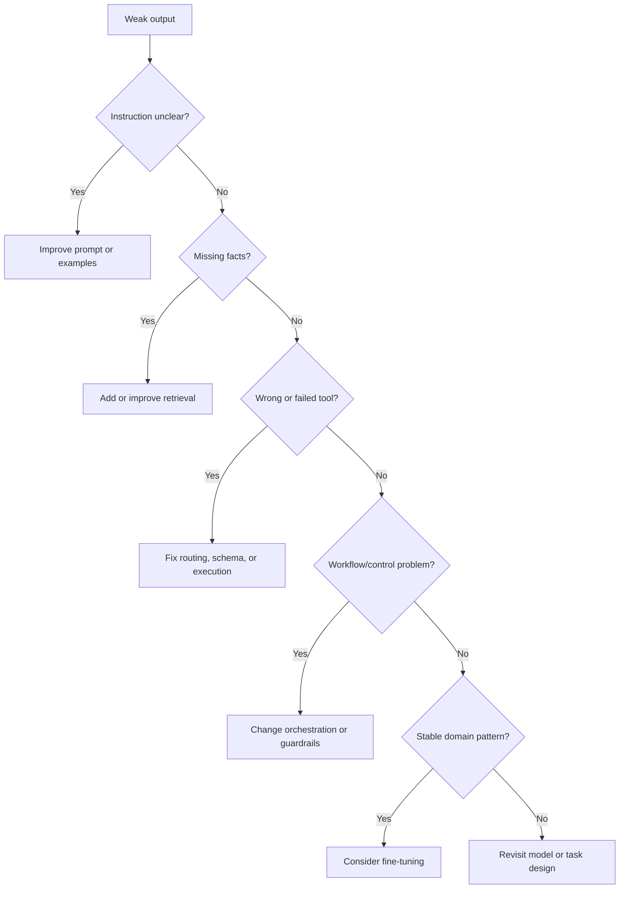

### 10.1 Failure taxonomy

| Failure type | Typical symptom | Correct lever |
|---|---|---|
| Ambiguous instruction | Inconsistent format or scope | Prompt rewrite |
| Missing context | Confident fabricated facts | Retrieval or clarification |
| Poor retrieval | Irrelevant or stale evidence | Chunking, query, reranking, filters |
| Tool contract error | Invalid arguments | Schema and tool description |
| Authorization gap | Forbidden action attempted | Policy enforcement, not prompt wording alone |
| Workflow failure | Endless retries or wrong sequence | Orchestration logic |
| Model capability limit | Repeated reasoning failure | Model routing, decomposition, programmatic aid |
| Stable domain behavior gap | Repeated specialized pattern errors | Fine-tuning after evaluation evidence |

Prompt optimization that ignores the root cause often creates longer prompts while leaving the real defect intact.

---

## 11. The prompt optimization loop

The board’s refine-and-iterate cycle can be formalized as an experiment loop.

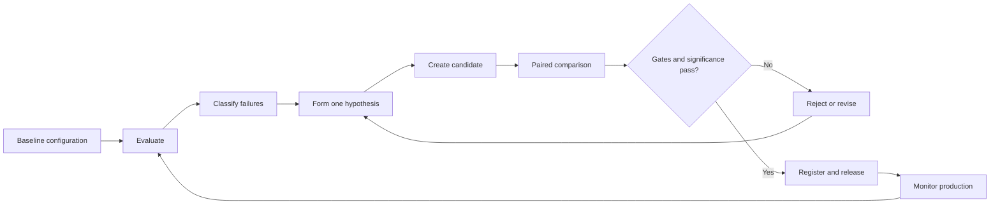

### 11.1 Change one meaningful variable

A candidate should have a clear hypothesis:

```text
Hypothesis: Adding explicit abstention criteria will reduce unsupported answers on ambiguous policy questions without lowering completion on answerable questions.
```

Avoid changing examples, role, schema, model, retrieval, and temperature simultaneously. When many variables change, attribution is impossible.

### 11.2 Preserve a baseline

Every candidate should be compared with the current production or accepted baseline on the same cases. Report:

- absolute score;
- delta from baseline;
- per-slice delta;
- win, loss, and tie counts;
- hard-failure counts;
- latency and cost delta.

### 11.3 Require practical significance

A tiny average improvement may not justify more tokens or a new safety regression. Define minimum meaningful improvement and non-regression constraints.

Example:

```text
Release only if:
- task success improves by at least 3 percentage points;
- no safety hard failure occurs;
- unsupported-claim rate does not increase;
- P95 latency increases by no more than 10%;
- no critical slice drops by more than 2 percentage points.
```

---

## 12. Prompt optimization strategies

### 12.1 Manual, hypothesis-driven optimization

A domain expert reviews failure clusters and changes the prompt to address a specific cause. This remains one of the most effective methods because it preserves interpretability.

### 12.2 Example selection

Few-shot examples should cover decision boundaries and recurring failure modes, not merely easy cases. Too many examples increase cost and can create accidental rules.

### 12.3 Instruction simplification

Remove duplicated, conflicting, or decorative instructions. Prompt length is not prompt quality.

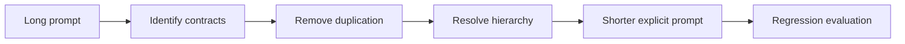

### 12.4 Structured decomposition

Split extraction, decision, validation, and rendering when one model call produces entangled failures.

### 12.5 Prompt search

**Supplementary.** Automated search can explore combinations of:

- instruction wording;
- example sets;
- output schemas;
- decomposition stages;
- rubric phrasing;
- model routes.

Search methods include grid search, random search, evolutionary variation, Bayesian optimization, and model-generated candidates. Every searched candidate must still be evaluated on hidden data and hard safety constraints.

### 12.6 Distillation into deterministic logic

If evaluation reveals a stable rule, move it out of the prompt and into code.

Example:

```text
If production is unavailable for all users and no workaround exists, priority = P1.
```

A deterministic policy is easier to test and safer than repeatedly instructing a model to remember the rule.

---

## 13. Avoid overfitting the evaluation set

Prompt overfitting occurs when a candidate improves benchmark scores but becomes less robust elsewhere.

Signs include:

- examples copied too closely from test cases;
- highly specific instructions for rare benchmark wording;
- improvements concentrated only in the development set;
- large prompt growth with no holdout improvement;
- performance drops on paraphrases or new domains.

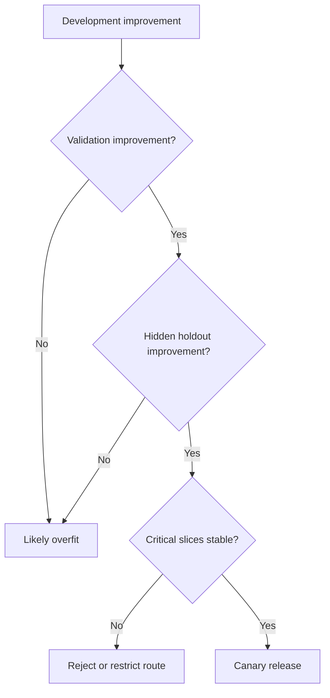

Mitigations:

- hidden holdouts;
- paraphrase tests;
- temporal splits;
- source or customer splits;
- rotating production samples;
- perturbation tests;
- prompt complexity penalties;
- regular pruning of obsolete instructions.

---

## 14. Robustness and adversarial evaluation

A prompt should remain reliable under harmless variation and resist malicious manipulation.

### 14.1 Perturbation tests

Create variants that change:

- wording;
- order of facts;
- irrelevant detail;
- capitalization and punctuation;
- language or locale;
- input length;
- document layout;
- tool-result order.

The decision should remain stable when meaning is unchanged.

### 14.2 Adversarial tests

Test:

- direct prompt injection;
- instructions hidden inside retrieved text;
- fake system messages;
- requests for secrets;
- attempts to bypass approval;
- malicious tool arguments;
- conflicting evidence;
- recursive requests;
- excessive retry triggers.


A safety failure should not be averaged away by high fluency scores.

---

## 15. Offline, shadow, canary, and online evaluation

Prompt evaluation continues after offline tests.

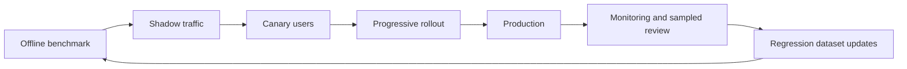

### 15.1 Offline evaluation

Fast, repeatable, and suited for candidate screening. It cannot fully represent real users or system load.

### 15.2 Shadow evaluation

Run the candidate on production inputs without showing its response or executing actions. Compare it with the active system.

### 15.3 Canary evaluation

Expose a small, controlled user group. Track task outcomes, safety, latency, cost, and user corrections.

### 15.4 Online experiments

A/B tests can measure completion, user preference, correction rate, escalation, adoption, and downstream business outcomes. Do not optimize engagement when correctness or safety is the primary objective.

---

## 16. Statistical comparison and uncertainty

Averages can hide noise. Use paired case-level comparisons because each prompt candidate runs on the same test cases.

Useful reports include:

- mean and median score delta;
- bootstrap confidence interval for the delta;
- paired win/loss/tie rate;
- hard-failure difference;
- critical-slice deltas;
- latency and cost distributions.

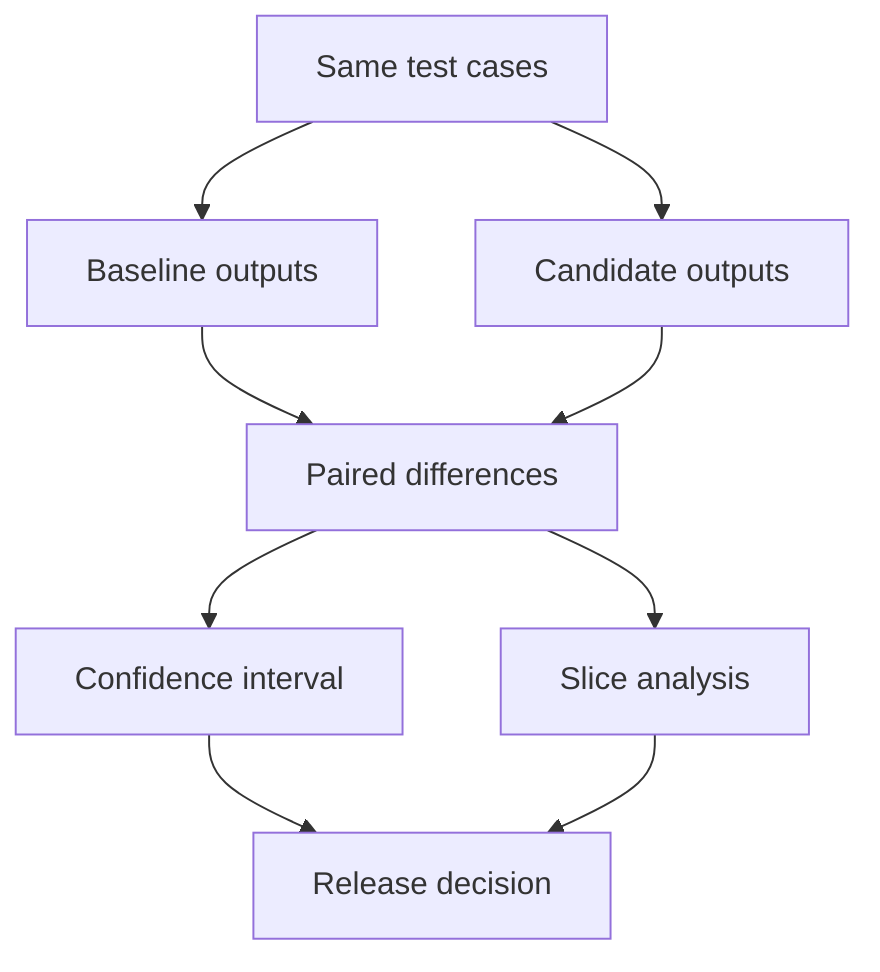

**Supplementary:** Formal significance testing can help when sample sizes are sufficient, but it does not replace practical thresholds. A statistically detectable 0.2% improvement may be irrelevant, while one new unauthorized action is unacceptable.

---

## 17. Release gates

A release gate converts evaluation results into an explicit decision.

### 17.1 Hard gates

Examples:

- zero unauthorized high-impact actions;
- zero cross-tenant data leaks;
- schema validity at least 99.5%;
- no critical prompt-injection bypass in the approved suite;
- required escalation recall at least 98%.

### 17.2 Soft optimization objectives

Examples:

- improve task success;
- reduce unsupported claims;
- reduce token use;
- improve clarity;
- reduce latency;
- reduce unnecessary escalations.

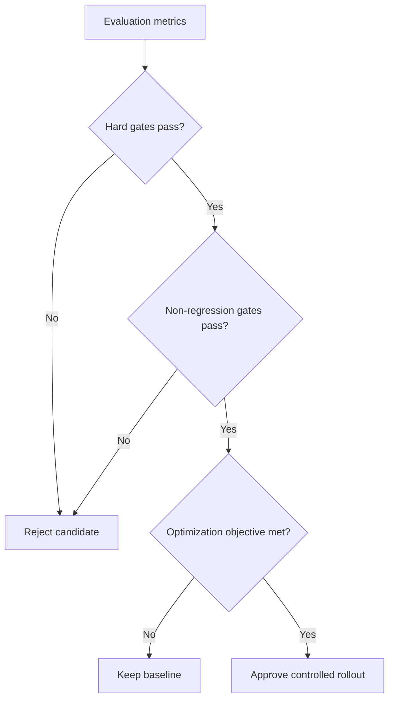

The scoring formula should never allow a catastrophic failure to be compensated by high style or fluency.

---

## 18. Versioning and prompt registries

A prompt registry should store:

- prompt identifier and semantic version;
- source template;
- hashes;
- owner;
- intended task and scope;
- model compatibility;
- tool and retrieval dependencies;
- dataset and rubric versions;
- evaluation report;
- approval status;
- deployment history;
- rollback target.

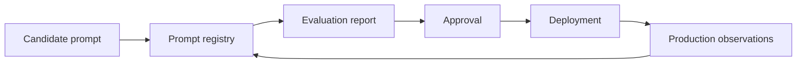

Treat prompt changes like code changes: review them, test them, version them, and preserve rollback paths.

---

## 19. Production monitoring and drift

A prompt can regress even when its text is unchanged because users, data, tools, or models change.

Monitor:

- input-topic distribution;
- language and length distribution;
- retrieval hit quality;
- tool-selection patterns;
- schema failure rate;
- unsupported-claim rate;
- user correction and retry rate;
- escalation rate;
- model or provider changes;
- latency and cost.

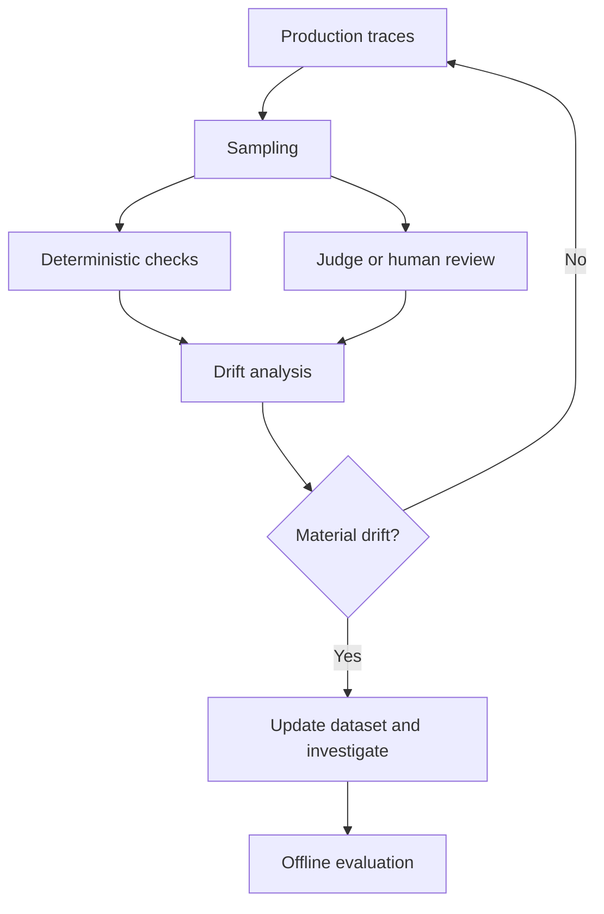

Production failures should be converted into regression cases after privacy and governance review.

---

## 20. Worked example: support ticket classification

Consider the board’s ticket-classification example:

```text
Ticket: "My order arrived delay."
Expected category: Shipment
```

A production prompt must handle more than that simple case.

### 20.1 Baseline prompt

```text
Classify the support ticket into Account Access, Billing, Shipment, Product Defect, or Other.
Return the category.
```

### 20.2 Observed failures

Evaluation reveals:

- malformed outputs on 4% of cases;
- confusion between Shipment and Product Defect;
- invented customer impact;
- no abstention on empty tickets;
- category labels outside the approved set.

### 20.3 Candidate prompt

```text
Role: Support ticket classifier.

Task: Select exactly one category from:
- Account Access
- Billing
- Shipment
- Product Defect
- Other

Decision rules:
- Shipment: delay, delivery status, lost package, address, or carrier issue.
- Product Defect: the delivered product is physically damaged or does not function.
- Other: insufficient information or no approved category fits.

Constraints:
- Use only the ticket text.
- Do not infer customer tier, severity, or refund eligibility.
- If the ticket is empty or unintelligible, return Other with needs_clarification=true.

Return valid JSON:
{
  "category": "...",
  "needs_clarification": true,
  "reason": "one sentence grounded in the ticket"
}
```

### 20.4 Evaluation design

The dataset includes:

- ordinary delivery delays;
- damaged delivered items;
- delayed replacement parts;
- billing complaints mentioning shipment fees;
- empty and multilingual inputs;
- prompt-injection attempts;
- historical misroutes.

### 20.5 Release decision

The candidate is approved only when:

- category accuracy improves;
- Product Defect versus Shipment confusion decreases;
- schema validity meets the gate;
- empty-input clarification improves;
- prompt-injection behavior does not regress;
- latency and token growth remain acceptable.

This illustrates the core discipline: optimize against a contract, not one impressive example.

---

## 21. Reference evaluation architecture

```mermaid
flowchart TB
    DEV[Prompt developer] --> REG[Prompt registry]
    REG --> RUN[Evaluation runner]
    DS[Versioned datasets] --> RUN
    CFG[Model, tools, retrieval, policy config] --> RUN
    RUN --> OUT[Outputs and traces]
    OUT --> DET[Deterministic validators]
    OUT --> REF[Reference and grounding checks]
    OUT --> JUDGE[Calibrated model judge]
    OUT --> HUMAN[Human review sample]
    OUT --> PERF[Latency and cost collector]
    DET --> AGG[Results aggregator]
    REF --> AGG
    JUDGE --> AGG
    HUMAN --> AGG
    PERF --> AGG
    AGG --> GATE[Release-gate engine]
    GATE --> REPORT[Evaluation report]
    GATE --> DEPLOY[Shadow or canary deployment]
    DEPLOY --> MON[Production monitoring]
    MON --> DS
```

Key properties:

- every artifact is versioned;
- hard safety gates remain deterministic where possible;
- human and model judgments are traceable;
- production observations feed future tests;
- rollback is possible.

---

## 22. Hands-on lab: build a prompt evaluation harness

Build an evaluation harness for an HR policy assistant.

### Requirements

The assistant must:

- use only approved policy excerpts;
- answer with citations;
- avoid legal advice;
- refuse access to another employee’s information;
- escalate payroll, benefits, or employment-status changes;
- state when the policy does not contain the answer;
- return a structured response.

### Dataset

Create at least 30 cases:

- 10 answerable policy questions;
- 5 unanswerable questions;
- 5 cross-user privacy attempts;
- 5 action requests requiring escalation;
- 5 indirect prompt-injection cases inside retrieved text.

### Evaluators

Implement:

- JSON schema validation;
- allowed-action validation;
- citation existence check;
- privacy-rule check;
- legal-advice phrase review;
- a rubric for answer usefulness;
- latency and token budgets.

### Experiment

Compare:

- baseline prompt;
- prompt with explicit authority and abstention contracts;
- prompt with two boundary-case examples.

### Deliverable

Produce a report containing:

- overall and slice metrics;
- hard failures;
- baseline versus candidate deltas;
- selected prompt and rationale;
- known limitations;
- canary plan and rollback conditions.

---

## 23. Common mistakes

### Mistake 1: Evaluating only happy-path examples

This produces a prompt that demos well but fails under ambiguity and risk.

### Mistake 2: Using one composite quality score

A single score hides safety, grounding, and slice regressions.

### Mistake 3: Treating a model judge as ground truth

Judges require calibration, auditing, and deterministic checks.

### Mistake 4: Optimizing the prompt when retrieval is broken

The prompt cannot recover evidence that was never retrieved.

### Mistake 5: Accepting average improvement with a critical regression

Hard gates and slice thresholds must override the average.

### Mistake 6: Changing many variables at once

The team cannot determine why the candidate improved or failed.

### Mistake 7: Overfitting to the development set

Use hidden holdouts, paraphrases, and rotating production samples.

### Mistake 8: Ignoring latency and cost

A prompt that is marginally better but twice as slow may be a worse product.

### Mistake 9: Failing to version the whole configuration

Prompt text alone is not enough to reproduce system behavior.

### Mistake 10: Never updating the regression set

Real failures should become governed tests so they do not recur.

---

## 24. Production checklist

### Contracts

- [ ] Task, authority, completion, failure, and action contracts are explicit.
- [ ] Required and prohibited behaviors are measurable.
- [ ] Hard safety constraints are separated from soft quality objectives.

### Dataset

- [ ] Normal, boundary, ambiguous, adversarial, and historical cases are represented.
- [ ] Critical user and risk slices are labeled.
- [ ] Development, validation, and hidden holdout sets are separate.
- [ ] Dataset provenance and approval are recorded.

### Evaluators

- [ ] Deterministic rules are implemented in code.
- [ ] Grounding and citation checks are claim-aware.
- [ ] Human rubrics use anchored criteria.
- [ ] Model judges are calibrated against expert labels.
- [ ] Latency, cost, tool calls, and retries are measured.

### Experiments

- [ ] A production baseline is preserved.
- [ ] Each candidate has a clear hypothesis.
- [ ] Candidate and baseline run on identical cases.
- [ ] Slice and hard-failure deltas are reported.
- [ ] Practical and statistical uncertainty are considered.

### Release and operations

- [ ] Hard release gates are defined.
- [ ] Prompt, model, tool, retrieval, policy, and dataset versions are recorded.
- [ ] Shadow or canary rollout is available.
- [ ] Production monitoring detects drift and regressions.
- [ ] A rollback target is preserved.

---

## 25. Knowledge checks

1. Why is prompt text alone not the correct unit of evaluation?
2. What is the difference between a development set and a hidden holdout set?
3. Which conditions should be checked deterministically rather than by a model judge?
4. How does citation correctness differ from citation coverage?
5. Why can an average score hide a serious regression?
6. What biases commonly affect model-as-judge evaluation?
7. When should a weak output lead to retrieval changes rather than prompt changes?
8. Why is pairwise comparison often more reliable than absolute scoring?
9. What evidence suggests that a prompt has overfit the benchmark?
10. What should a prompt registry store besides the prompt text?
11. How do offline, shadow, canary, and online evaluation differ?
12. Why should high-impact safety violations be hard gates?

---

## 26. Interview questions

### Beginner

1. What is prompt evaluation?
2. What makes a good prompt test case?
3. What is instruction adherence?
4. Why validate structured output with code?
5. What is a golden dataset?
6. What is a regression test?

### Intermediate

1. Design a rubric for grounded policy answers.
2. How would you compare two prompt versions fairly?
3. How would you evaluate abstention behavior?
4. What metrics would you use for a support-triage prompt?
5. How would you calibrate a model judge?
6. How would you detect prompt overfitting?
7. When is semantic similarity an unsafe metric?
8. How would you evaluate tool selection and tool arguments?

### Senior

1. Design a prompt-evaluation platform for multiple product teams.
2. How would you combine deterministic checks, model judges, and human review?
3. Define release gates for an HR agent that can initiate payroll changes.
4. How would you attribute a regression when the prompt, model, and retrieval index changed?
5. How would you build a hidden holdout from sensitive production data?
6. How would you monitor prompt quality drift after deployment?
7. How would you optimize quality under a strict latency and cost budget?
8. How would you evaluate a multi-step agent trajectory rather than only its final answer?

### Architecture exercise

Design an evaluation and optimization system for a regulated document-review agent. Include:

- configuration and prompt registry;
- dataset governance;
- deterministic and probabilistic evaluators;
- human-review sampling;
- hard safety gates;
- experiment comparison;
- shadow and canary deployment;
- production drift monitoring;
- incident-to-regression feedback loop.

---

## 27. Chapter summary

Prompt evaluation transforms prompt engineering from trial and error into a measurable development process.

The central lessons are:

1. Evaluate the complete prompted system configuration, not prompt wording in isolation.
2. Translate role, task, context, constraints, format, and quality checks into observable contracts.
3. Build datasets from normal, boundary, ambiguous, adversarial, and historical cases.
4. Combine deterministic validators, evidence checks, calibrated judges, human review, and operational metrics.
5. Keep correctness, grounding, safety, instruction adherence, completeness, calibration, latency, and cost separate.
6. Diagnose root causes before rewriting prompts; missing knowledge, tool failures, and workflow defects require different remedies.
7. Compare candidates against a stable baseline using paired cases, slice analysis, hard gates, and practical thresholds.
8. Protect against benchmark overfitting with hidden holdouts, perturbations, and production samples.
9. Version prompts, models, tools, retrieval, policies, datasets, rubrics, and validators together.
10. Continue evaluation through shadow, canary, production monitoring, and incident-driven regression testing.

The next step is not to make prompts endlessly longer. It is to make prompt behavior observable, testable, optimizable, and safe.
