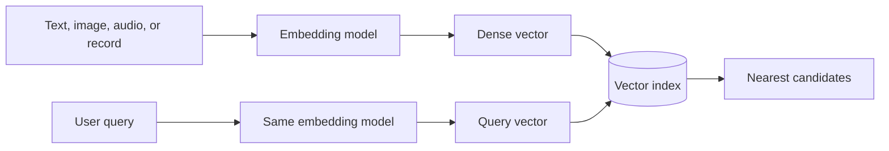
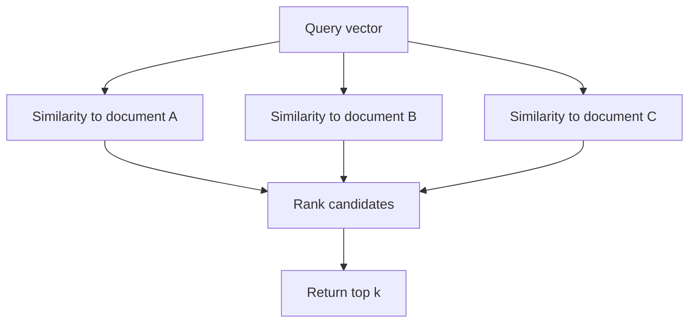
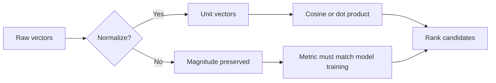
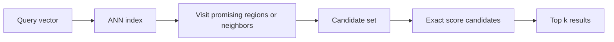
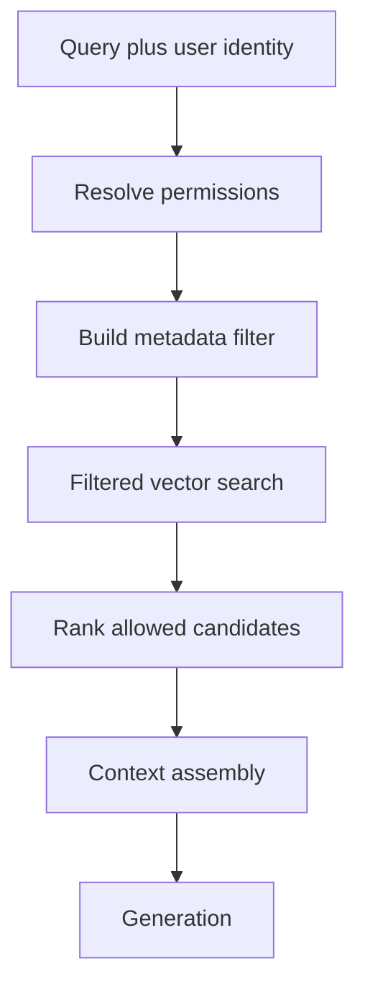
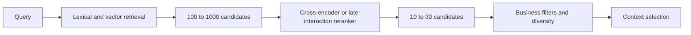
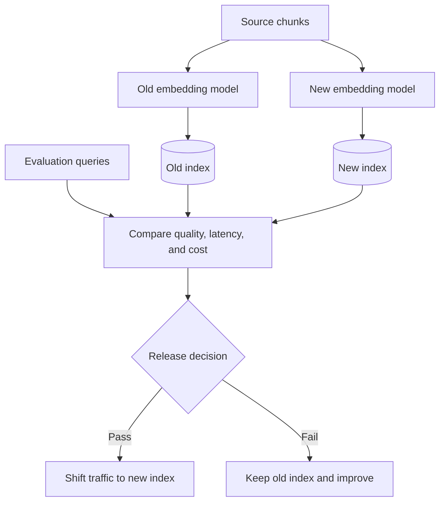
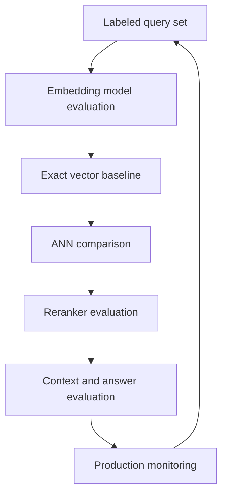
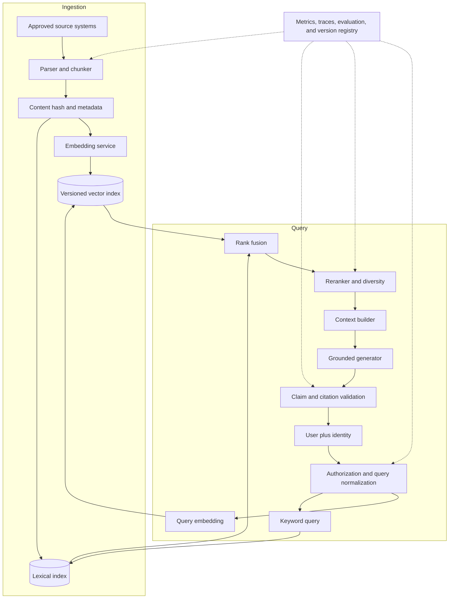

# Chapter 8 - Embeddings and Vector Search

> **Source basis:** The board describes embeddings as the mechanism that converts a user question into a meaning vector, which is then compared with vectors stored in a vector database to retrieve relevant chunks for grounded generation [Board, pp. 6-7, 37, 49]. It also identifies vector retrieval as one stage of a larger RAG pipeline rather than a complete answer-generation system. Details about embedding geometry, approximate nearest-neighbor indexes, model migration, retrieval metrics, and production operations are marked **Supplementary**.

---

## Learning objectives

By the end of this chapter, you should be able to:

1. Explain what an embedding is and why embeddings support semantic retrieval.
2. Distinguish token, sentence, passage, image, and multimodal embeddings.
3. Compare cosine similarity, dot product, and Euclidean distance.
4. Explain why vector normalization changes ranking behavior.
5. Describe exact and approximate nearest-neighbor search.
6. Compare common vector-index families and their trade-offs.
7. Design metadata filtering and authorization-aware retrieval.
8. Select an embedding model using quality, latency, dimensionality, and domain criteria.
9. Evaluate vector retrieval using recall at k, precision at k, MRR, and nDCG.
10. Plan an embedding-model migration without mixing incompatible vector spaces.
11. Diagnose common vector-search failures.
12. Implement a small vector index with filtering, scoring, and diversity selection.

---

## 1. Why embeddings matter

Computers do not directly understand a sentence such as "How do I reset my password?" as a human does. A retrieval system needs a numerical representation that can be compared efficiently with representations of candidate documents.

An embedding is a vector: an ordered list of numbers that represents an input in a learned feature space. Inputs with related meaning should ideally be located near one another in that space, while unrelated inputs should be farther apart.



The board's RAG flow can therefore be read as two linked operations:

1. convert the question into a vector;
2. search for stored vectors that are close to it.

The retrieved content is then supplied to the language model as evidence [Board, pp. 6-7, 37, 49].

### 1.1 Embeddings are representations, not answers

An embedding does not contain a human-readable explanation. It is a representation optimized for comparison or another downstream task. A vector-search result also does not prove that a document answers the question. It indicates that the representation is close according to the selected model and similarity function.

This distinction matters because a result can be:

- topically similar but not answer-bearing;
- semantically related but obsolete;
- relevant but unauthorized;
- close because of repeated generic wording;
- useful only when combined with another result;
- highly similar but contradicted by a more authoritative source.

> **Key idea**
>
> Embedding similarity is a retrieval signal. It is not a truth score, confidence score, authorization decision, or evidence-quality score.

### 1.2 Why keyword search is not enough

Keyword search is strong when the user and the source share exact terms. It is especially useful for:

- product codes;
- policy identifiers;
- names;
- error messages;
- chemical or scientific terms;
- exact quotations;
- dates and version numbers.

However, exact terms often differ even when intent is the same.

| User wording | Source wording |
|---|---|
| reset my password | recover account credentials |
| cancel my order | request order termination |
| delayed shipment | delivery arrived after the promised date |
| employee leave | paid time off policy |

A semantic embedding model aims to place these related expressions near one another even when token overlap is low.

### 1.3 Why vector search is not enough

Vector search can underperform on exact identifiers, rare acronyms, numeric constraints, negation, and subtle policy distinctions. For that reason, production retrieval commonly combines:

- lexical search for exact matching;
- vector search for semantic matching;
- metadata filters for business constraints;
- reranking for deeper relevance scoring;
- validation for authority and answer support.

That combination is called hybrid retrieval when lexical and vector signals are deliberately merged.

---

## 2. What an embedding space represents

An embedding model maps an input into a point in a high-dimensional space.

For a three-dimensional teaching example, imagine three document vectors:

```text
password reset guide      = [0.91, 0.12, 0.08]
billing correction policy = [0.05, 0.95, 0.11]
shipping delay FAQ        = [0.10, 0.18, 0.89]
```

A query about password recovery might map to:

```text
query = [0.88, 0.16, 0.10]
```

The query is geometrically closest to the password-reset guide. Real embedding spaces can contain hundreds or thousands of dimensions, and the dimensions do not usually have simple labels such as "password" or "billing." Their meaning emerges from training.



### 2.1 Learned geometry

The geometry of an embedding space is created by a training objective. Depending on the model, training may encourage:

- semantically related text to be close;
- query and relevant passage pairs to be close;
- image and caption pairs to be close;
- paraphrases to be close;
- unrelated or hard-negative examples to be separated;
- class examples to form useful regions.

The usefulness of the space therefore depends on how well the training objective resembles the production retrieval task.

### 2.2 Dense and sparse representations

A dense vector contains a numeric value in most dimensions. Neural text embeddings are commonly dense.

A sparse representation contains mostly zeros. Traditional bag-of-words and TF-IDF representations are sparse because only terms present in the text receive non-zero values.

| Representation | Typical strength | Typical weakness |
|---|---|---|
| Sparse lexical | Exact terms and identifiers | Weak paraphrase matching |
| Dense semantic | Meaning and paraphrases | Can miss exact rare terms |
| Hybrid | Covers both signal types | More operational complexity |

### 2.3 Token, sentence, passage, and document embeddings

Embedding granularity should match the retrieval unit.

- **Token embeddings** represent individual tokens inside a model.
- **Sentence embeddings** represent a sentence or short utterance.
- **Passage embeddings** represent chunks suitable for retrieval.
- **Document embeddings** represent a larger document as one vector.
- **Field embeddings** represent selected structured fields.
- **Image embeddings** represent visual content.
- **Multimodal embeddings** place several modalities into a related space.

A full document represented by one vector can lose local details. Very small chunks can lose context. Passage-level embeddings are therefore common in RAG, but the best unit depends on the content and user questions.

### 2.4 Symmetric and asymmetric retrieval

In symmetric retrieval, query and candidate have similar form. Example: find duplicate support tickets.

In asymmetric retrieval, query and candidate play different roles. Example: a short question is matched to a longer explanatory passage.

An embedding model trained for one pattern may not perform equally well on the other. Some models require query and document prefixes or separate encoders to make the role distinction explicit.

> **Supplementary: model contract**
>
> Treat the embedding model, input formatting, normalization rule, dimensionality, and similarity function as one versioned contract. Changing one component can change ranking behavior.

---

## 3. Similarity and distance

Once vectors exist, the system needs a function that ranks candidate vectors relative to the query.

### 3.1 Dot product

For vectors `a` and `b`, the dot product is:

```text
a . b = sum(a_i * b_i)
```

A larger dot product indicates stronger alignment, but it is influenced by vector magnitude. If the model uses magnitude as a meaningful signal, dot product may be appropriate. If magnitudes vary for accidental reasons, rankings can become distorted.

### 3.2 Cosine similarity

Cosine similarity compares vector direction rather than raw magnitude:

```text
cosine(a, b) = (a . b) / (||a|| * ||b||)
```

For non-zero vectors, the score ranges from -1 to 1 in the mathematical definition:

- 1 means the same direction;
- 0 means orthogonal directions;
- -1 means opposite directions.

Many learned text-embedding spaces produce scores in a narrower practical range.

### 3.3 Euclidean distance

Euclidean distance measures straight-line distance:

```text
distance(a, b) = sqrt(sum((a_i - b_i)^2))
```

Smaller is better. If all vectors are normalized to unit length, ranking by cosine similarity, dot product, and Euclidean distance is closely related. Without normalization, they can produce different rankings.



### 3.4 Normalization

A normalized vector has length 1:

```text
normalized(v) = v / ||v||
```

Normalization is not merely a database setting. It changes the scoring contract. The team should know whether:

- the embedding API already returns normalized vectors;
- normalization is performed during ingestion;
- normalization is performed at query time;
- the index metric expects normalized vectors;
- historical vectors were indexed under the same rule.

### 3.5 Similarity thresholds

A fixed similarity threshold seems attractive: retrieve only results above 0.8, for example. In practice, threshold values are model- and dataset-dependent. A score of 0.8 from one model is not directly comparable with 0.8 from another.

Thresholds should be calibrated using labeled queries and reviewed by segment. A useful threshold for FAQ retrieval may fail for scientific literature, multilingual text, or short identifier queries.

### 3.6 Score is not probability

A cosine score of 0.82 does not mean there is an 82 percent probability that the document is relevant. Converting similarity into an interpretable confidence signal requires calibration against labeled data.

> **Common mistake**
>
> Displaying raw vector similarity as "answer confidence" creates false precision. Answer confidence also depends on retrieval coverage, source authority, contradiction, generation behavior, and validation.

---

## 4. Building the vector corpus

Vector search begins with a corpus of retrievable records. Each record should contain more than the vector.

A practical record may include:

```json
{
  "chunk_id": "policy-042-section-3-v5",
  "document_id": "policy-042",
  "title": "Global Return Policy",
  "section": "Damaged products",
  "text": "...",
  "embedding": [0.012, -0.044, 0.031],
  "embedding_model": "embedding-model-v3",
  "content_hash": "...",
  "version": 5,
  "status": "approved",
  "effective_date": "2026-05-01",
  "region": ["US", "CA"],
  "allowed_roles": ["support", "manager"]
}
```

### 4.1 Stable identifiers

A stable identifier supports:

- updates;
- deletions;
- citation resolution;
- deduplication;
- version tracking;
- retrieval evaluation;
- incident investigation.

Do not rely only on an index-generated row number. Source-aware identifiers make data lifecycle operations safer.

### 4.2 Content hashes

A content hash can reveal whether a chunk changed. It can help the ingestion pipeline avoid re-embedding unchanged content and identify accidental duplicates.

### 4.3 Version and model metadata

Every vector should be traceable to:

- embedding model name and version;
- input formatting template;
- normalization rule;
- chunking version;
- source version;
- ingestion timestamp.

Without this metadata, a mixed or stale index can be difficult to diagnose.

### 4.4 Deletions and superseded content

Enterprise knowledge changes. A reliable index must handle:

- source deletion;
- revoked permissions;
- superseded policy versions;
- temporary source outages;
- legal retention rules;
- regional differences.

Deletion is not complete until the item is unavailable from every retrieval path, cache, replica, and generated answer store where policy requires removal.

---

## 5. Exact nearest-neighbor search

The simplest vector search compares the query vector with every stored vector and sorts by score.

```text
for each candidate:
    score = similarity(query, candidate)
return highest scores
```

This is called exact or brute-force search. It provides the true ranking for the chosen metric, subject to numeric precision.

### 5.1 Advantages

- simple to implement;
- easy to audit;
- useful as an evaluation baseline;
- no index approximation error;
- practical for small corpora;
- helpful when filters reduce the candidate set sharply.

### 5.2 Limitations

If there are `N` vectors of dimension `D`, a full scan requires work proportional to `N * D` for each query. At large scale or high traffic, this can be expensive.

Exact search is still valuable in production as:

- a gold-standard benchmark for approximate indexes;
- a fallback for small partitions;
- a re-scoring stage after candidate generation;
- a debugging tool.

---

## 6. Approximate nearest-neighbor search

Approximate nearest-neighbor, or ANN, search reduces query cost by avoiding comparison with every vector. It accepts a controlled possibility that a true nearest neighbor will be missed.



The central trade-off is:

```text
search speed and memory <-> retrieval recall
```

A faster configuration may miss relevant neighbors. A higher-recall configuration may use more memory, CPU, or latency.

### 6.1 Graph-based indexes

Graph-based indexes connect vectors to nearby vectors. Search navigates from an entry point through increasingly promising neighbors.

A widely used conceptual pattern is a multi-layer navigable small-world graph:

- upper layers support long jumps;
- lower layers support local refinement;
- construction parameters affect memory and quality;
- query-time exploration controls latency and recall.

Strengths:

- strong recall-latency trade-off;
- good general-purpose performance;
- supports incremental insertion in many implementations.

Trade-offs:

- substantial memory use;
- index build cost;
- deletion and compaction complexity;
- filtering interactions can reduce efficiency.

### 6.2 Inverted-file indexes

An inverted-file approach clusters vectors into regions. At query time, the system searches only the most promising clusters.

Strengths:

- can scale to large corpora;
- reduces the number of comparisons;
- combines with vector compression.

Trade-offs:

- requires training or selecting centroids;
- cluster selection can miss relevant candidates;
- updates may change data distribution;
- more clusters searched means higher recall and latency.

### 6.3 Product quantization and compression

Vector compression represents vectors using compact codes rather than full-precision values.

Strengths:

- lower memory use;
- improved cache efficiency;
- practical for very large datasets.

Trade-offs:

- approximation error;
- more complicated tuning;
- possible quality loss for subtle distinctions;
- re-ranking with full vectors may still be needed.

### 6.4 Tree and partition methods

Tree-based and partition-based indexes divide the space into regions. They can work well under some dimensionality and data-distribution conditions, but very high-dimensional spaces make simple geometric partitioning difficult.

### 6.5 Choosing an index family

Do not choose an ANN structure from popularity alone. Evaluate it against the real corpus and query distribution.

| Criterion | Questions |
|---|---|
| Corpus size | Thousands, millions, or billions of vectors? |
| Query volume | How many searches per second? |
| Recall target | How often must true neighbors be retained? |
| Latency | What are p50 and p95 budgets? |
| Update rate | Batch rebuild or continuous insert? |
| Deletion rate | How quickly must revocation take effect? |
| Filtering | Are filters selective or broad? |
| Memory | Can full vectors and graph links fit in memory? |
| Tenancy | Shared index or isolated partitions? |
| Operations | What rebuild, backup, and recovery processes exist? |

> **Best practice**
>
> Compare ANN results with exact search on a representative labeled query set. ANN recall is measurable; it should not be assumed.

---

## 7. Metadata filtering and permissions

Vector similarity cannot enforce business constraints by itself. Metadata filtering narrows candidates according to structured conditions.

Examples:

- region equals `EU`;
- status equals `approved`;
- effective date is not in the future;
- user role is in `allowed_roles`;
- product family equals `instrumentation`;
- language equals `French`;
- document type equals `SOP`.

### 7.1 Pre-filtering

Pre-filtering applies constraints before vector search.

Advantages:

- unauthorized content never becomes a candidate;
- efficient when the index supports filtered search well;
- reduces downstream work.

Potential limitation:

- highly selective filters can leave too few candidates or make ANN navigation difficult.

### 7.2 Post-filtering

Post-filtering retrieves broad vector candidates and removes records afterward.

Advantages:

- simple in some systems;
- preserves the behavior of the main vector index.

Risks:

- top candidates may all be filtered out;
- a larger initial k may be needed;
- unauthorized data may appear in traces or intermediate memory;
- it is unsuitable when policy forbids the content from entering the request path.



### 7.3 Security rule

Authorization should be enforced before restricted content reaches the model. The model must not be expected to hide content that the retriever should never have returned.

### 7.4 Multi-tenancy

Common designs include:

- separate index per tenant;
- shared index with tenant filters;
- partitioned collections;
- separate encryption and credentials;
- hybrid designs based on sensitivity.

Tenant isolation is an architectural decision, not merely a query parameter. Consider failure impact, operational cost, scale, and audit requirements.

---

## 8. Query and document encoding

The input supplied to an embedding model influences the resulting vector.

### 8.1 Prefixes and instructions

Some embedding models are trained with explicit input roles, for example:

```text
query: How do I return a damaged product?
passage: Damaged products can be returned within ...
```

Removing a required prefix can reduce retrieval quality. Store the exact formatting contract with the model version.

### 8.2 Context enrichment

A chunk such as "It must be completed within 30 days" is ambiguous. The embedding may improve if the input includes the title and section:

```text
Title: Global Return Policy
Section: Damaged products
Content: It must be completed within 30 days.
```

However, adding too much repeated metadata can dominate the content and make unrelated chunks look similar. Test the formatting empirically.

### 8.3 Query rewriting

A conversational query may require transformation:

```text
User: What about damaged ones?
Rewritten: What is the return policy for damaged products?
```

The rewritten query should preserve user intent and relevant conversation state. Rewriting can fail if it invents constraints or resolves ambiguity incorrectly.

### 8.4 Multi-vector representations

A single vector may not capture every aspect of a document. Alternatives include:

- one vector per section;
- one vector per field;
- summary vector plus detail vectors;
- multiple query-aspect vectors;
- token-level late interaction;
- image and text vectors stored together.

Multi-vector designs can improve recall but increase storage, indexing, and deduplication complexity.

---

## 9. Bi-encoders, cross-encoders, and late interaction

### 9.1 Bi-encoder retrieval

A bi-encoder independently encodes the query and each passage. Passage vectors can be precomputed and indexed.

```text
query -> query encoder -> query vector
passage -> passage encoder -> passage vector
similarity(query vector, passage vector)
```

Advantages:

- efficient at large scale;
- passage vectors are reusable;
- works with ANN indexes.

Limitation:

- query and passage interact only through the final vector score.

### 9.2 Cross-encoder reranking

A cross-encoder processes the query and candidate passage together and produces a relevance score.

```text
[query, passage] -> joint model -> relevance score
```

Advantages:

- deeper token-level interaction;
- often stronger relevance discrimination.

Limitations:

- expensive to run over the full corpus;
- used on a smaller candidate set.

### 9.3 Late interaction

Late-interaction models retain multiple token-level representations and compare them after independent encoding. They sit between single-vector bi-encoders and full cross-encoders in the efficiency-quality spectrum.

### 9.4 Typical retrieval cascade



The numbers are illustrative. The correct cascade is determined by evaluation, latency, and cost targets.

---

## 10. Diversity and redundancy

The nearest vectors are not always the best context set. Several top results may be duplicate or overlapping chunks from the same document.

### 10.1 Maximum marginal relevance

Maximum marginal relevance, or MMR, balances query relevance with novelty.

Conceptually:

```text
MMR = relevance to query - penalty for similarity to selected results
```

A diversity method can help retrieve:

- different sections of the same policy;
- evidence from multiple sources;
- complementary facts;
- less redundant context.

It can also hurt when the answer truly requires several nearby passages from one source. Diversity should be evaluated against task needs.

### 10.2 Deduplication

Deduplication can occur using:

- exact content hashes;
- normalized text hashes;
- near-duplicate similarity;
- source and section identity;
- parent-document grouping.

Do not remove legitimate repeated requirements merely because wording is similar. Version and authority metadata must be considered.

---

## 11. Selecting an embedding model

An embedding model should be selected using a representative retrieval benchmark, not only a public leaderboard.

### 11.1 Quality criteria

Evaluate:

- in-domain retrieval recall;
- exact-term behavior;
- paraphrase handling;
- multilingual performance;
- short-query to long-passage matching;
- numeric and scientific terminology;
- negation and exception handling;
- robustness to noisy user text;
- cross-modal needs.

### 11.2 Operational criteria

Also evaluate:

- embedding latency;
- batch throughput;
- cost per million items and queries;
- dimensionality;
- storage footprint;
- provider availability;
- deployment location;
- data residency;
- maximum input length;
- version stability;
- rate limits;
- privacy terms.

### 11.3 Dimensionality

Higher dimensionality can represent more distinctions, but it also increases:

- storage;
- memory bandwidth;
- index size;
- transfer cost;
- similarity computation.

A higher-dimensional model is not automatically better. Compression or dimension reduction should be evaluated for quality impact.

### 11.4 Domain adaptation

General embeddings may struggle with:

- specialized scientific vocabulary;
- internal product names;
- laboratory abbreviations;
- legal distinctions;
- code and logs;
- highly structured catalog data.

Possible responses include:

1. enrich text with metadata;
2. add lexical retrieval;
3. create better chunks;
4. use a domain-appropriate model;
5. fine-tune or train with query-positive-negative examples;
6. add a reranker.

The cheapest reliable improvement should be tried first.

---

## 12. Embedding-model migration

Vectors from different embedding models generally do not share the same coordinate space. A query vector from model B should not be compared with passage vectors created by model A unless the models are explicitly designed to be compatible.

### 12.1 Unsafe migration

```text
old document vectors + new query vector -> invalid or degraded similarity
```

### 12.2 Safe blue-green migration



A migration plan should include:

- versioned indexes;
- complete re-embedding or a proven compatibility method;
- dual-write for new or changed documents;
- offline benchmark comparison;
- shadow or canary traffic;
- rollback;
- cache invalidation;
- removal of the old index only after validation.

### 12.3 Partial re-embedding

Partial re-embedding can create a mixed index that is difficult to reason about. If a full rebuild is too expensive, isolate model versions into separate indexes and merge ranked results at a higher layer only when the evaluation supports it.

---

## 13. Evaluating vector retrieval

A vector index should be evaluated independently from the language model.

### 13.1 Evaluation dataset

Create a dataset containing:

- realistic user queries;
- relevant chunk or document identifiers;
- relevance grades when possible;
- user segment;
- language;
- task type;
- expected filters;
- known hard negatives;
- unanswerable questions.

The dataset should include common and difficult cases, not only clean demonstrations.

### 13.2 Recall at k

Recall at k asks whether the relevant item appears in the top `k` results.

```text
recall@k = retrieved relevant items / all known relevant items
```

For a single known relevant answer, teams often measure hit rate at k: whether at least one relevant item appeared.

### 13.3 Precision at k

Precision at k measures how many of the top results are relevant.

```text
precision@k = relevant items in top k / k
```

High recall with low precision produces noisy context. High precision with low recall can miss necessary evidence.

### 13.4 Mean reciprocal rank

Reciprocal rank rewards placing the first relevant result near the top:

```text
RR = 1 / rank_of_first_relevant_result
```

Mean reciprocal rank, or MRR, averages reciprocal rank across queries.

### 13.5 nDCG

Normalized discounted cumulative gain supports graded relevance. It rewards highly relevant items near the top while allowing several relevance levels.

### 13.6 ANN recall

ANN recall compares approximate results with exact nearest-neighbor results for the same embedding vectors and metric. It measures index approximation, not human relevance.

A system therefore needs at least two evaluation layers:

1. **semantic relevance evaluation:** does the embedding and retrieval pipeline find human-relevant content?
2. **index recall evaluation:** does the ANN index preserve the nearest results produced by exact search?



### 13.7 Segment analysis

Aggregate metrics can hide failures. Break results down by:

- language;
- source type;
- query length;
- exact identifier versus natural language;
- region;
- product line;
- user role;
- old versus new content;
- common versus rare topics;
- answerable versus unanswerable.

---

## 14. Common failure modes

### 14.1 Wrong model for the task

A general semantic model may not understand internal abbreviations or scientific nomenclature.

**Response:** benchmark a domain model, add lexical retrieval, enrich metadata, or train with domain pairs.

### 14.2 Query-document role mismatch

A model expects query and passage prefixes, but the application omits them.

**Response:** version the exact input template and test it.

### 14.3 Mixed embedding spaces

Some documents use one model while queries use another.

**Response:** isolate index versions and re-embed consistently.

### 14.4 Magnitude or metric mismatch

The index uses cosine similarity while vectors or model assumptions require dot product, or only one side is normalized.

**Response:** define and test the full vector contract.

### 14.5 Generic repeated text dominates

Headers, disclaimers, and templates make many chunks look similar.

**Response:** remove boilerplate, weight fields carefully, and deduplicate.

### 14.6 Important exact terms disappear

Semantic retrieval misses a rare error code or catalog number.

**Response:** combine lexical search and structured filters.

### 14.7 Top-k results are redundant

Several overlapping chunks consume the context budget.

**Response:** deduplicate, group by parent, or use diversity selection.

### 14.8 Filter starvation

A strict filter leaves too few candidates.

**Response:** monitor candidate counts, distinguish no-data from no-permission, and define safe fallback behavior.

### 14.9 Stale vectors

Source content changed, but the index did not.

**Response:** track source versions, freshness lag, failed ingestion jobs, and deletion events.

### 14.10 Similar but non-answering passages

The vector search retrieves the same topic but not the required fact.

**Response:** use better chunks, query decomposition, reranking, and answer-bearing labels in evaluation.

### 14.11 Threshold copied across models

A release changes the embedding model but keeps the previous score threshold.

**Response:** recalibrate thresholds for each version and segment.

---

## 15. Production reference architecture



### 15.1 Operational signals

Track:

- embedding request rate and latency;
- batch ingestion throughput;
- failed and delayed source updates;
- index size and memory;
- candidate count after filters;
- exact and ANN latency;
- recall metrics on scheduled evaluations;
- top-result score distribution;
- no-result rate;
- duplicate-result rate;
- filter starvation;
- model and index version;
- cost per indexed item and query.

### 15.2 Caching

Potential cache layers include:

- source parsing cache;
- embedding cache keyed by normalized content hash and model version;
- query embedding cache;
- retrieval-result cache with permission-aware keys;
- final-answer cache for safe, stable content.

A cache key must include all factors that influence authorization and output. An answer generated for one user role must not be served to another role without revalidation.

### 15.3 Reliability

Design for:

- embedding API timeout;
- partial batch failure;
- index unavailability;
- stale replicas;
- corrupted metadata;
- permission-service failure;
- reindexing and rollback;
- source deletion;
- disaster recovery.

A safe fallback may use lexical search, a previous approved index, or a clear temporary-unavailability message. It should not silently bypass access controls.

---

## 16. Worked example: scientific procedure assistant

Consider an assistant that helps laboratory staff find approved procedures.

### 16.1 Requirements

The system must:

- retrieve only approved SOPs;
- respect site and role permissions;
- distinguish active and obsolete versions;
- support exact SOP identifiers;
- handle natural-language questions;
- display section and revision citations;
- refuse to invent procedural steps;
- escalate conflicts to quality personnel.

### 16.2 Retrieval design

1. Parse SOP title, identifier, revision, section, site, status, and effective date.
2. Chunk by procedure section and preserve step numbering.
3. Build both lexical and vector indexes.
4. Embed a context-enriched representation containing title, section, and text.
5. Resolve the user's site and role before retrieval.
6. Search exact identifiers lexically and natural-language intent semantically.
7. Fuse and rerank candidates.
8. Prefer current approved revisions.
9. Reject obsolete-only evidence unless the user explicitly requests historical content and has permission.
10. Return citations with SOP ID, revision, section, and effective date.

### 16.3 Example query

```text
What should I do if the centrifuge temperature alarm appears during sample preparation?
```

Possible retrieval stages:

```text
semantic query -> centrifuge alarm and sample-preparation passages
lexical query -> exact alarm code if present
metadata filter -> approved, current, user's site
reranker -> procedure steps over general equipment descriptions
context builder -> include warning, response steps, and escalation section
```

### 16.4 Failure analysis

If the system returns a general equipment manual instead of the approved SOP, possible causes include:

- the manual has more semantic overlap;
- SOP chunks are too small and lack the equipment name;
- authority metadata is not used in ranking;
- the exact alarm code was not extracted;
- the reranker was trained on general web text;
- the current SOP failed ingestion.

The correction is not automatically "use a larger model." The retrieval trace should identify which stage failed.

---

## 17. Runnable example

The companion example is located at:

```text
examples/08-embeddings-vector-search/mini_vector_index.py
```

It demonstrates:

- deterministic feature-hashing vectors using only the Python standard library;
- L2 normalization;
- cosine similarity;
- exact nearest-neighbor search;
- metadata filtering;
- maximum marginal relevance for diversity;
- result tracing.

The feature-hashing function is a teaching substitute, not a neural semantic embedding model. It lets you inspect the index mechanics without downloading a model.

Run it with:

```bash
python examples/08-embeddings-vector-search/mini_vector_index.py
```

Try changing:

- vector dimensionality;
- token and character features;
- metadata filters;
- top k;
- MMR diversity weight;
- document wording;
- the query.

Observe the difference between raw nearest-neighbor results and diversity-aware selection.

---

## 18. Design checklist

### Embedding contract

- [ ] Is the embedding model version recorded?
- [ ] Are query and document input templates versioned?
- [ ] Is normalization behavior explicit?
- [ ] Does the index metric match the model contract?
- [ ] Are dimensionality and maximum input length known?
- [ ] Are vectors from incompatible models isolated?

### Corpus and metadata

- [ ] Does every record have a stable source identifier?
- [ ] Are content hashes stored?
- [ ] Are version, status, authority, and effective date preserved?
- [ ] Can deleted and revoked content be removed quickly?
- [ ] Are duplicates and boilerplate controlled?

### Search

- [ ] Is exact search available as a benchmark?
- [ ] Is ANN recall measured against exact results?
- [ ] Are lexical and vector signals both evaluated?
- [ ] Are filters applied safely?
- [ ] Is redundancy controlled?
- [ ] Are thresholds calibrated rather than guessed?

### Evaluation

- [ ] Does the dataset contain realistic queries and hard negatives?
- [ ] Are recall, precision, MRR, and nDCG tracked where appropriate?
- [ ] Are metrics segmented by language, domain, and query type?
- [ ] Are index metrics separated from human relevance metrics?
- [ ] Is model migration evaluated before traffic cutover?

### Operations

- [ ] Are latency, throughput, memory, and cost monitored?
- [ ] Is source-to-index freshness measured?
- [ ] Are caches permission-aware?
- [ ] Is rollback tested?
- [ ] Can a trace reproduce the model, index, filters, and scores used for a result?

---

## 19. Hands-on lab: compare retrieval strategies

### Goal

Build a small retrieval benchmark that compares lexical, dense-style, filtered, and diversity-aware search.

### Requirements

1. Create at least fifty chunks across five topics.
2. Include exact identifiers, paraphrases, duplicate templates, and obsolete versions.
3. Assign metadata for region, status, role, and effective date.
4. Implement a lexical baseline.
5. Implement the companion vector index or another embedding model.
6. Create at least thirty labeled queries.
7. Measure recall at 1, 3, 5, and 10.
8. Measure MRR.
9. Compare results before and after metadata filtering.
10. Compare raw top-k with diversity-aware selection.
11. Record latency and index size.
12. Write a release recommendation.

### Questions to answer

- Which queries require lexical matching?
- Which queries benefit most from embeddings?
- Which failures are caused by chunking rather than the model?
- How much recall does the ANN configuration lose relative to exact search?
- Does diversity improve evidence coverage or remove needed neighboring chunks?
- Which user segment has the lowest retrieval quality?
- What threshold, if any, is defensible from the data?

---

## 20. Knowledge checks

1. What is an embedding?
2. Why is an embedding score not a probability of relevance?
3. How do sparse and dense representations differ?
4. When is asymmetric retrieval important?
5. What is the difference between dot product and cosine similarity?
6. Why does normalization matter?
7. What is exact nearest-neighbor search?
8. Why do approximate indexes exist?
9. What is ANN recall?
10. Why should ANN recall be separated from human relevance?
11. How do graph-based and inverted-file indexes differ conceptually?
12. Why can post-filtering be unsafe or ineffective?
13. What is the role of a cross-encoder reranker?
14. Why might MMR improve context quality?
15. Why can two embedding-model versions not normally share one vector space?
16. Which metadata is necessary for an embedding-model migration?
17. What do recall at k and MRR measure?
18. Why should evaluation be segmented?
19. How can boilerplate damage vector retrieval?
20. When should lexical retrieval be preferred or combined with vector search?

---

## 21. Interview questions

### Beginner

1. Explain embeddings in plain language.
2. What is cosine similarity?
3. What is a vector database?
4. What is top-k vector search?
5. Why are vectors normalized?
6. What is the difference between keyword and semantic search?

### Intermediate

1. Compare dot product, cosine similarity, and Euclidean distance.
2. What is approximate nearest-neighbor search, and what does it trade away?
3. How would you choose between a graph index and an inverted-file index?
4. How would you combine metadata filters with vector search?
5. What is the difference between a bi-encoder and a cross-encoder?
6. How would you evaluate an embedding model for an internal policy assistant?
7. Why can increasing vector dimensionality increase operational cost?
8. How would you handle exact product codes in a semantic-search system?
9. What is MMR, and when could it hurt?
10. How do you detect stale vectors?

### Senior

1. Design a multi-tenant vector-search platform with strict authorization.
2. Plan a zero-downtime migration between incompatible embedding models.
3. How would you tune an ANN index while protecting retrieval recall?
4. How would you separate embedding quality, ANN quality, reranker quality, and answer quality in an evaluation program?
5. How would you support immediate deletion across indexes, caches, and replicas?
6. What observability is required to reproduce a retrieval incident?
7. How would you select an embedding model for multilingual scientific procedures?
8. When would you use multiple vectors per document?
9. How would you design a hybrid search and rank-fusion strategy?
10. How would you calibrate a no-result or low-evidence threshold?

### Architecture exercise

Design vector retrieval for an enterprise product-support platform. The system contains 100 million chunks across many products, regions, languages, and customer entitlements. It must:

- support natural-language questions and exact error codes;
- enforce customer entitlement before content reaches the model;
- update changed documents within fifteen minutes;
- delete revoked content within five minutes;
- maintain high recall under a 150-millisecond retrieval budget;
- support an embedding-model migration;
- expose citations and retrieval traces;
- operate across two regions.

Explain:

- embedding model and input contract;
- corpus partitioning;
- index family;
- lexical-vector fusion;
- filter strategy;
- replication and failover;
- model migration;
- evaluation metrics;
- cache safety;
- deletion workflow;
- observability and incident response.

---

## 22. Chapter summary

The board introduces embeddings as the bridge between a natural-language question and vector retrieval in a RAG system [Board, pp. 6-7, 37, 49]. This chapter expanded that bridge into a complete engineering discipline.

The most important lessons are:

- an embedding is a learned representation, not an answer or confidence value;
- embedding quality depends on the training objective and production task;
- cosine similarity, dot product, and Euclidean distance are different scoring contracts;
- normalization must be consistent at ingestion and query time;
- exact search is the quality baseline, while ANN search trades some recall for speed and scale;
- vector indexes must be selected and tuned using representative data;
- metadata, authority, freshness, and permissions are as important as geometric similarity;
- lexical and semantic retrieval are complementary;
- bi-encoders retrieve broadly, while cross-encoders or late-interaction models can rerank more deeply;
- diversity can reduce redundant context but must be evaluated;
- vector records require stable identifiers, source versions, model versions, and deletion handling;
- embedding-model migrations require a separate compatible index and controlled traffic cutover;
- retrieval evaluation should separate human relevance, ANN approximation, reranking, and answer quality;
- production vector search requires observability, rollback, permission-aware caching, and source-to-index freshness monitoring.

The next chapter will focus on chunking, retrieval quality, reranking, and context construction as an integrated optimization problem.
