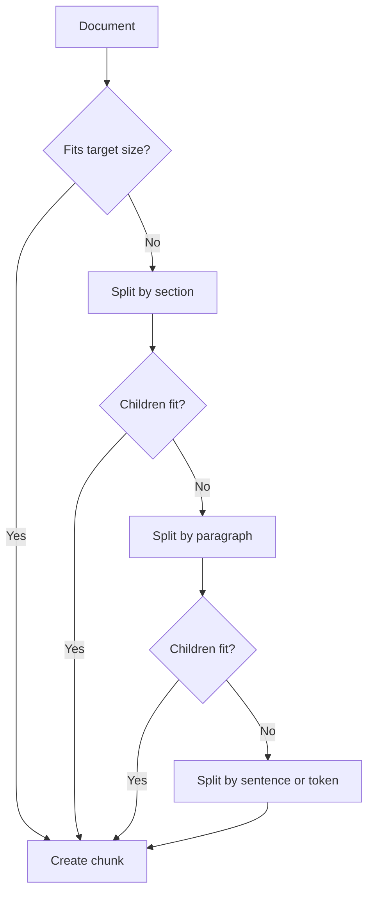
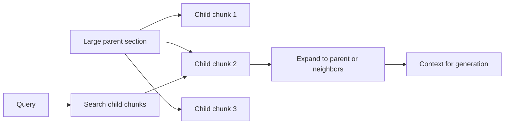
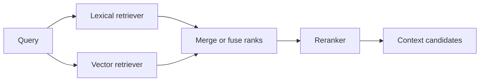
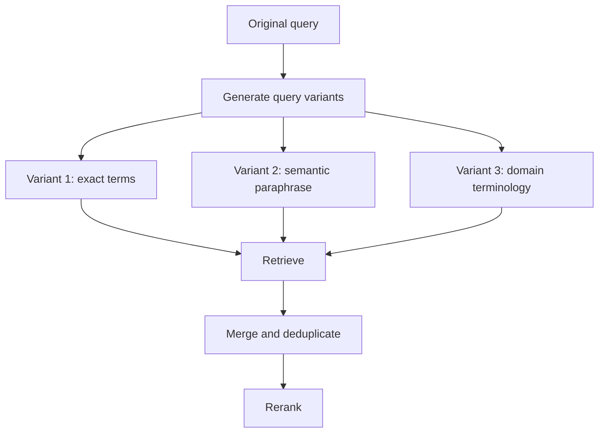
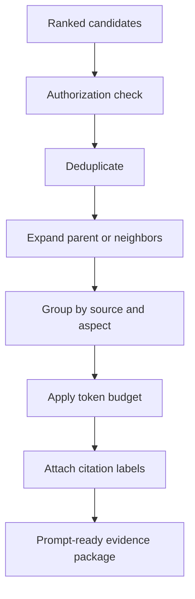
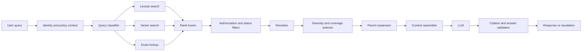

# Chapter 9 - Chunking, Reranking, and Retrieval Quality

> **Source basis:** The board presents RAG as a pipeline in which source content is converted into retrievable chunks, a query is embedded, related evidence is retrieved, and the LLM produces a grounded response [Board, pp. 6-7, 37, 49]. It also emphasizes that weak output should be diagnosed before choosing between prompt improvement, retrieval, or fine-tuning [Board, pp. 8-9, 48]. This chapter expands those ideas into a detailed treatment of chunk design, candidate generation, reranking, context assembly, evaluation, and operational quality. Material beyond the board is marked **Supplementary**.

---

## Learning objectives

By the end of this chapter, you should be able to:

1. Explain why retrieval quality depends on chunk design, not only on the embedding model.
2. Compare fixed-size, sentence, paragraph, recursive, semantic, and structure-aware chunking.
3. Select chunk size and overlap using evidence rather than default values.
4. Preserve document hierarchy, metadata, and parent-child relationships during ingestion.
5. Explain candidate generation, reranking, filtering, deduplication, and context assembly as separate stages.
6. Combine lexical and semantic retrieval using score fusion or reciprocal rank fusion.
7. Apply cross-encoder, rule-based, and LLM-assisted reranking appropriately.
8. Use diversity selection to avoid redundant context.
9. Design retrieval metrics and evaluation datasets that measure answer-bearing evidence.
10. Diagnose common retrieval failures, including missing evidence, noisy context, stale content, and authorization errors.
11. Build a production retrieval cascade with observable intermediate outputs.
12. Implement a dependency-free example that chunks documents, retrieves candidates, reranks them, and assembles a context window.

---

## 1. Retrieval quality is a pipeline property

A common RAG failure is to treat retrieval as a single operation:

```text
query -> vector database -> top results
```

In practice, retrieval quality is produced by several decisions that interact:


A weak result can arise from any stage:

- the answer was split across two chunks;
- the chunk omitted the heading that explains its scope;
- an old version outranked the current policy;
- semantic search missed an exact identifier;
- the correct passage was retrieved but ranked below the context cutoff;
- multiple near-duplicate chunks consumed the token budget;
- authorization filters were applied after retrieval instead of before exposure;
- the LLM was given evidence, but the prompt did not require grounded claims;
- the evaluation measured answer quality but did not isolate retrieval failure.

> **Key idea**
>
> Retrieval quality is not equivalent to vector similarity. It is the ability of the complete retrieval pipeline to return sufficient, authorized, current, and answer-bearing evidence within the available latency and context budget.

### 1.1 Three layers of retrieval quality

It is useful to separate quality into three layers.

| Layer | Core question | Example failure |
|---|---|---|
| Ingestion quality | Did we create useful retrievable units? | A table row was separated from its column headers. |
| Search quality | Did we find and rank the right evidence? | Exact product code was missed by semantic search. |
| Context quality | Did we give the model the right evidence in usable form? | Ten redundant chunks displaced the actual exception clause. |

Improving the wrong layer wastes effort. For example, changing the embedding model will not fix a parser that silently drops footnotes.

### 1.2 Retrieval before generation

The board's weak-output decision tree recommends diagnosing missing facts separately from unclear instructions [Board, pp. 8-9, 48]. That distinction should be preserved operationally.

When an answer is weak, ask:

1. Was the required evidence present in the source corpus?
2. Was the source parsed and indexed correctly?
3. Was the evidence retrieved?
4. Was it ranked high enough to reach the context window?
5. Was it supplied to the model with sufficient metadata and structure?
6. Did the generation prompt require the model to use it?
7. Did the final answer faithfully reflect it?

This sequence prevents teams from compensating for retrieval defects with longer prompts or unnecessary fine-tuning.

---

## 2. Chunking is an information-design problem

Chunking is the process of converting a source into retrievable units. The best chunk is not necessarily a fixed number of tokens. It is the smallest unit that still contains enough context to answer a likely question correctly.

A chunk should ideally be:

- **focused** enough to match a specific query;
- **complete** enough to support a claim;
- **structured** enough to preserve headings, table labels, and source relationships;
- **traceable** enough to cite and audit;
- **authorized** enough to filter before retrieval;
- **stable** enough to update without reprocessing the entire corpus unnecessarily.

### 2.1 The granularity trade-off

Small chunks improve precision because each unit covers a narrow topic. However, they can lose context. Large chunks preserve context but may dilute the retrieval signal and consume more of the model's context window.

| Chunk style | Strength | Risk |
|---|---|---|
| Very small | Precise matching | Missing surrounding qualifiers or definitions |
| Medium | Balanced relevance and completeness | Requires domain tuning |
| Very large | Preserves broad context | Lower precision and higher token cost |

Consider a policy statement:

```text
Employees may carry over up to five unused leave days into the next calendar year.
This rule does not apply to contractors or temporary staff.
```

If these sentences are separated, a query about contractor leave may retrieve only the first sentence and produce the wrong answer. The two sentences form one answer-bearing unit.

### 2.2 Fixed-size chunking

Fixed-size chunking splits text every selected number of characters, words, or tokens.

**Advantages**

- easy to implement;
- predictable chunk size;
- works as a baseline;
- independent of document format.

**Limitations**

- can split sentences, lists, tables, and code blocks;
- ignores headings and semantic boundaries;
- creates arbitrary units;
- requires overlap to reduce boundary loss.

Fixed-size chunking is useful for initial experiments, but it should not be assumed to be production-ready for complex documents.

### 2.3 Sentence and paragraph chunking

Sentence chunking preserves grammatical boundaries. Paragraph chunking preserves author-defined units.

These methods are stronger when source documents are well written and paragraphs align with topics. They are weaker when:

- paragraphs are extremely long;
- a paragraph contains several unrelated procedures;
- bullets depend on a heading several lines earlier;
- tables are flattened into incoherent text;
- OCR produces incorrect sentence boundaries.

### 2.4 Recursive chunking

Recursive chunking applies a hierarchy of separators. A typical strategy attempts:

1. section boundaries;
2. paragraph boundaries;
3. sentence boundaries;
4. word or token boundaries as a final fallback.



Recursive methods preserve more structure than blind fixed-size splitting while still enforcing a maximum size.

### 2.5 Structure-aware chunking

Structure-aware chunking uses document semantics such as:

- title and heading hierarchy;
- numbered procedure steps;
- table boundaries;
- FAQ question-answer pairs;
- code classes and functions;
- legal clauses and subclauses;
- scientific sections such as method, result, and limitation;
- slide titles and speaker notes;
- form labels and values.

For a technical manual, a useful chunk may contain:

```text
Document title
Section heading
Subsection heading
Procedure step
Warning or note
Body text
```

The heading path should often be copied into the chunk text or retained as metadata because it provides meaning that the body alone may not contain.

### 2.6 Semantic chunking

**Supplementary:** Semantic chunking detects changes in topic or embedding similarity and creates boundaries when adjacent units become sufficiently different.

This can be useful for long prose in which paragraph boundaries are inconsistent. However, it introduces additional cost and tuning requirements. It can also create unstable chunk boundaries when the embedding model changes.

Use semantic chunking when:

- source formatting is weak;
- topic shifts matter more than fixed size;
- retrieval quality justifies extra ingestion cost;
- evaluation data exists to tune thresholds.

Do not use it merely because it sounds more advanced. Structure-aware rules often outperform semantic segmentation on strongly formatted enterprise documents.

---

## 3. Chunk size, overlap, and boundary recovery

### 3.1 Choosing chunk size

There is no universal best chunk size. A useful selection process is:

1. identify common user questions;
2. identify the smallest source spans that answer them;
3. measure the distribution of those spans;
4. choose candidate chunk sizes;
5. evaluate retrieval recall and answer support;
6. inspect latency and token cost;
7. tune by content type rather than forcing one global value.

For example:

| Content type | Likely chunk unit |
|---|---|
| FAQ | One question-answer pair |
| Policy | Clause plus exceptions and effective date |
| API documentation | Endpoint, parameters, response, and example |
| Scientific procedure | Step group plus warnings and prerequisites |
| Meeting notes | Topic block with speaker or date metadata |
| Source code | Function or class with signature and comments |
| Table | Row groups with repeated headers and source title |

### 3.2 Overlap

Overlap repeats content between neighboring chunks. It helps when an answer crosses a chunk boundary.

```text
Chunk 1: tokens 1-300
Chunk 2: tokens 251-550
Chunk 3: tokens 501-800
```

The overlap is 50 tokens.

**Benefits**

- reduces boundary loss;
- preserves local continuity;
- improves recall for statements spanning adjacent chunks.

**Costs**

- increases index size;
- creates duplicate retrieval results;
- can waste context tokens;
- makes citation spans less distinct;
- raises embedding and storage cost.

Overlap should therefore be paired with deduplication or diversity selection. More overlap is not always better.

### 3.3 Sliding windows versus semantic units

A sliding window is appropriate when the source is continuous prose and boundaries are unreliable. Semantic units are preferable when the source has meaningful structure.

A hybrid strategy often works well:

- split by structure first;
- apply a maximum token limit inside each structural unit;
- use a small overlap only for units that still require splitting;
- preserve parent identifiers so neighboring context can be reconstructed later.

### 3.4 Parent-child retrieval

Parent-child retrieval indexes smaller child chunks but returns or expands to a larger parent section after a match.



This pattern combines precise matching with broader context.

Example:

- child chunk: one paragraph explaining a return exception;
- parent section: complete return-policy section containing definitions and exclusions.

The search operates on the child. The generator receives the parent or a bounded expansion around the child.

### 3.5 Sentence-window retrieval

Another pattern indexes individual sentences but returns a window of surrounding sentences. This can work well for transcripts and long prose.

The retrieval unit and generation unit do not have to be identical. This is a powerful design principle.

> **Best practice**
>
> Separate the unit used for matching from the unit used for answering. Search with the representation that gives precise ranking, then expand to the evidence span that gives complete meaning.

---

## 4. Metadata and document lineage

Chunk text alone is insufficient for enterprise retrieval. Each chunk should retain metadata required for filtering, ranking, citation, governance, and updates.

Typical fields include:

- document identifier;
- chunk identifier;
- parent identifier;
- title;
- heading path;
- source URI or repository path;
- version;
- effective date;
- expiration date;
- approval status;
- owner;
- language;
- region;
- product or business unit;
- confidentiality level;
- access-control groups;
- content hash;
- ingestion timestamp.

### 4.1 Metadata in the ranking pipeline

Metadata can support several functions:

| Function | Example |
|---|---|
| Hard filter | Only documents the user is authorized to access |
| Freshness rule | Exclude expired policies |
| Ranking boost | Prefer current approved documents |
| Query routing | Search only technical manuals for installation questions |
| Citation | Display title, section, and source link |
| Update logic | Re-embed only changed chunks |
| Audit | Explain which source version supported an answer |

### 4.2 Hard filters versus soft boosts

A hard filter removes candidates completely. Use it for non-negotiable constraints such as authorization, tenant, legal region, and approval state.

A soft boost changes ranking but does not remove a candidate. Use it for preferences such as freshness, document authority, or product relevance.

Never implement security as a soft boost. An unauthorized document should not remain in the candidate set.

### 4.3 Versioning and superseded content

Policy corpora frequently contain several versions. A production system should explicitly model:

- current version;
- future approved version;
- superseded version;
- draft version;
- archived version.

Without status metadata, an old document may outrank the current one because its wording happens to match the query more closely.

---

## 5. Candidate generation

Candidate generation is the high-recall stage that retrieves a manageable set for deeper scoring.

A practical system may use several retrievers:

- lexical search;
- dense-vector search;
- sparse learned retrieval;
- metadata lookup;
- graph traversal;
- database queries;
- exact identifier lookup.

### 5.1 Lexical retrieval

Lexical retrieval is strong for:

- exact phrases;
- error codes;
- policy numbers;
- product names;
- uncommon technical terms;
- version numbers;
- names and dates.

Its main weakness is vocabulary mismatch.

### 5.2 Dense retrieval

Dense retrieval is strong for:

- paraphrases;
- natural-language intent;
- conceptual similarity;
- multilingual semantic matching when supported by the model.

Its main weaknesses include exact identifiers, negation, rare terms, and subtle policy distinctions.

### 5.3 Hybrid retrieval

Hybrid retrieval combines lexical and dense signals.



The goal is not to average arbitrary scores blindly. Lexical and vector scores may have different ranges and distributions. Rank-based fusion is often easier to operate.

### 5.4 Reciprocal rank fusion

**Supplementary:** Reciprocal rank fusion, or RRF, combines ranked lists without requiring comparable raw scores.

A common form is:

```text
RRF score(document) = sum(1 / (k + rank_in_list))
```

where `k` is a constant that reduces the influence of very high ranks.

RRF rewards documents that appear near the top of multiple lists. It is robust and easy to explain.

### 5.5 Query classification and routing

Not every query should use the same retriever.

Examples:

| Query type | Preferred route |
|---|---|
| “What does error E104 mean?” | Exact and lexical search |
| “How can I recover access after changing my device?” | Semantic search |
| “Show the current EU leave policy” | Metadata filter plus lexical/semantic retrieval |
| “Compare policy A and policy B” | Multi-document retrieval and structured comparison |
| “What changed in version 4.2?” | Version-aware lookup and diff retrieval |

A lightweight classifier or deterministic rules can route the query to the best retrieval strategy.

---

## 6. Query transformation

The user query is not always the best search query. Query transformation improves retrievability while preserving intent.

### 6.1 Query normalization

Normalization can include:

- correcting obvious spelling errors;
- expanding standard abbreviations;
- canonicalizing product names;
- extracting identifiers;
- detecting language;
- removing conversational filler;
- preserving negation and constraints.

The transformation must not silently change meaning.

### 6.2 Query rewriting

A rewrite converts a conversational question into a search-oriented form.

User query:

```text
I reset it yesterday and now it still won't let me in.
```

Search rewrite:

```text
account login failure after password reset
```

The original query should remain available to the answer generator. The rewrite is for retrieval, not a replacement for user intent.

### 6.3 Multi-query retrieval

Multi-query retrieval generates several search expressions that represent different aspects of the question.



This can improve recall but increases cost and noise. Use it when the question is ambiguous, multi-faceted, or expressed in non-domain language.

### 6.4 Query decomposition

A complex question may require several evidence sets.

Example:

```text
Can a contractor in Germany carry unused leave into next year, and who must approve it?
```

Possible subqueries:

1. contractor leave eligibility in Germany;
2. leave carryover rules;
3. approval workflow.

The results are combined before generation. Decomposition is especially useful when no single chunk contains the entire answer.

### 6.5 Hypothetical document expansion

**Supplementary:** A hypothetical-answer technique can generate a synthetic passage that resembles the expected answer and embed that passage for retrieval. This may improve recall when questions and source passages use different styles.

It should be treated as a search aid, not as evidence. The generated text must never be cited as a source.

---

## 7. Reranking

Candidate generation prioritizes recall. Reranking prioritizes precision by applying more expensive or more context-aware scoring to a smaller candidate set.


### 7.1 Why reranking helps

A bi-encoder compares independently computed query and document vectors. This is efficient, but it compresses each text into a single representation. A cross-encoder jointly processes the query and candidate, allowing richer token-level interaction.

A reranker can distinguish:

- a passage mentioning the same topic from one that directly answers the question;
- a general policy from a specific exception;
- a document with the right keywords from a document with the right relationship between them;
- an outdated answer from a current authoritative answer when metadata is included.

### 7.2 Cross-encoder reranking

A cross-encoder scores each query-candidate pair. Because candidates cannot be precomputed independently, it is too expensive for the entire corpus but effective for tens or hundreds of candidates.

Use it when:

- retrieval precision materially affects business outcomes;
- latency permits an additional model call or local inference stage;
- candidate count is bounded;
- a labeled or curated evaluation set exists.

### 7.3 Rule-based reranking

Rules can supplement model relevance:

- boost approved sources;
- prefer the latest effective version;
- penalize drafts;
- boost exact identifier matches;
- prefer the user's product or region;
- penalize chunks with low text quality;
- boost chunks whose heading matches query intent.

Rules are valuable because some ranking requirements are business constraints rather than semantic relevance.

### 7.4 LLM-assisted reranking

An LLM can score or select candidates using explicit criteria such as answer support, authority, freshness, and contradiction.

However, it is:

- slower;
- more expensive;
- less deterministic;
- vulnerable to prompt injection inside retrieved text;
- difficult to calibrate at high candidate counts.

Use it selectively, often after a conventional reranker has reduced the candidate set.

### 7.5 Pairwise and listwise ranking

A pointwise reranker scores each candidate independently. A pairwise reranker compares two candidates. A listwise reranker considers the candidate set together.

Listwise methods can improve relative ordering but consume more context and may be sensitive to list order. For production, pointwise scoring plus deterministic post-processing is often easier to monitor.

---

## 8. Deduplication and diversity

Retrieval frequently returns overlapping chunks from the same section. Without diversity control, the model receives repeated evidence instead of broader coverage.

### 8.1 Exact and near-duplicate removal

Deduplication can use:

- identical content hashes;
- normalized text hashes;
- high lexical overlap;
- high embedding similarity;
- shared parent and overlapping character ranges.

A system should distinguish useful neighboring context from redundant repetition.

### 8.2 Maximum marginal relevance

**Supplementary:** Maximum marginal relevance, or MMR, balances relevance to the query with novelty relative to already selected results.

Conceptually:

```text
MMR(candidate) = relevance_to_query - diversity_penalty
```

The diversity penalty increases when the candidate is very similar to selected evidence.

MMR is useful for:

- broad research questions;
- multi-aspect questions;
- corpora with overlapping chunks;
- result sets dominated by one document.

It can hurt when several adjacent chunks are genuinely required to reconstruct a complete answer. Diversity should therefore be combined with parent expansion and question-type awareness.

### 8.3 Coverage-aware selection

For decomposed questions, selection should cover each sub-question.

Example:

```text
Question aspects:
1. eligibility
2. exception
3. approval authority
```

A coverage-aware selector ensures that the final context includes evidence for all three, rather than selecting three highly similar eligibility passages.

---

## 9. Context assembly

The final context is not simply the first `k` results. It is a curated evidence package.

A robust context assembler may:

1. enforce authorization and status filters;
2. remove duplicates;
3. expand parent or neighbor context;
4. sort by authority, relevance, and chronology;
5. group chunks by document or question aspect;
6. label every chunk with source metadata;
7. fit the context into a token budget;
8. preserve complete sentences and table rows;
9. include explicit conflict markers when sources disagree;
10. reserve space for the user query, instructions, and answer.



### 9.1 Ordering evidence

Common ordering strategies include:

- highest relevance first;
- most authoritative first;
- chronological order;
- grouped by source;
- grouped by sub-question;
- definitions before exceptions;
- policy before examples.

The best order depends on the task. A comparison question benefits from grouping by entity. A procedure benefits from step order. A policy answer benefits from rule, exception, and effective date.

### 9.2 Token budgeting

A context window must contain:

- system and safety instructions;
- conversation state;
- user query;
- tool results;
- retrieved evidence;
- answer space.

Sending too much evidence can reduce quality. The model may attend to irrelevant text, miss the most important passage, or produce a blended answer from conflicting sources.

A budget should be explicit and measurable.

Example:

| Component | Budget |
|---|---:|
| System and policy instructions | 1,000 tokens |
| User and conversation state | 1,500 tokens |
| Retrieved evidence | 5,000 tokens |
| Tool outputs | 1,000 tokens |
| Answer allowance | 2,000 tokens |

### 9.3 Context compression

Context compression removes material that is irrelevant to the current query while preserving evidence.

Methods include:

- sentence extraction;
- table row selection;
- metadata pruning;
- rule-based removal of navigation text;
- model-assisted extraction.

Compression must not transform evidence into an unsupported summary without traceability. Extractive compression is generally safer than abstractive compression for high-stakes use cases.

### 9.4 Conflicting evidence

When authoritative sources conflict, the system should not silently merge them. It should preserve:

- source identity;
- version and date;
- approval status;
- the conflicting statements;
- an escalation path when the conflict cannot be resolved automatically.

---

## 10. Measuring retrieval quality

Answer quality alone does not reveal whether retrieval is working. A weak answer may be caused by generation even when retrieval succeeded, and a fluent answer may hide missing evidence.

### 10.1 Build an evaluation set

A retrieval evaluation set should contain:

- realistic user questions;
- expected relevant chunks or documents;
- graded relevance where possible;
- required metadata constraints;
- unanswerable questions;
- adversarial and ambiguous queries;
- version-specific questions;
- exact identifier queries;
- paraphrased queries;
- multi-hop questions.

Labels should identify **answer-bearing evidence**, not merely topically related text.

### 10.2 Recall at k

Recall at `k` asks whether relevant evidence appears within the top `k` results.

```text
recall@k = relevant retrieved in top k / total relevant evidence
```

For many RAG systems, retrieval recall is a first priority: if the evidence is absent, downstream generation cannot recover it reliably.

### 10.3 Precision at k

Precision at `k` measures how much of the retrieved set is relevant.

```text
precision@k = relevant retrieved in top k / k
```

High recall with very low precision can overload the context with noise.

### 10.4 Mean reciprocal rank

Mean reciprocal rank rewards systems that place the first relevant result near the top.

It is useful when one strong passage is usually sufficient.

### 10.5 nDCG

Normalized discounted cumulative gain supports graded relevance and rewards highly relevant evidence near the top.

It is useful when some passages are directly answer-bearing while others are only supporting.

### 10.6 Evidence coverage

For multi-part questions, measure whether the retrieved set covers all required aspects.

Example:

```text
eligibility: covered
exception: covered
approval process: missing
coverage = 2 / 3
```

### 10.7 Citation coverage and correctness

After generation, evaluate:

- what proportion of factual claims have citations;
- whether each citation supports its associated claim;
- whether cited passages were actually retrieved;
- whether the answer omits critical retrieved qualifiers.

### 10.8 Operational metrics

Retrieval must also satisfy production constraints.

| Metric | Why it matters |
|---|---|
| Retrieval latency | Affects perceived response time |
| Reranker latency | Can dominate the retrieval stage |
| Index freshness | Determines whether current information is available |
| Empty-result rate | Reveals coverage or filtering problems |
| Filter rejection rate | Helps detect authorization or metadata issues |
| Duplicate rate | Measures wasted context |
| Average retrieved tokens | Tracks cost and context pressure |
| Cache hit rate | Indicates efficiency opportunities |
| Retrieval cost per query | Supports capacity planning |

---

## 11. Failure analysis

A retrieval failure taxonomy makes debugging systematic.

### 11.1 Source absence

The required information is not in the approved corpus.

**Fix:** add or connect the source, or return an explicit inability to answer.

### 11.2 Parsing failure

The information exists but was lost or corrupted during extraction.

Examples:

- OCR omitted a warning;
- table cells were read in the wrong order;
- slide notes were ignored;
- scanned pages produced empty text;
- code indentation was destroyed.

**Fix:** improve parsers and add ingestion-quality checks.

### 11.3 Chunking failure

The evidence was split incorrectly or stripped of context.

**Fix:** use structure-aware units, parent-child retrieval, or sentence windows.

### 11.4 Retrieval failure

The right chunk exists but does not enter the candidate set.

**Fix:** improve hybrid search, query rewriting, metadata routing, model choice, or candidate count.

### 11.5 Ranking failure

The right chunk is retrieved but ranked below the cutoff.

**Fix:** rerank, add business rules, improve features, or increase candidate depth before reranking.

### 11.6 Context assembly failure

The right evidence is selected but truncated, duplicated, or ordered poorly.

**Fix:** use explicit token budgets, grouping, deduplication, and evidence-aware ordering.

### 11.7 Freshness failure

Old content is returned because the index is stale or version status is missing.

**Fix:** implement change detection, event-driven reindexing, effective-date filters, and freshness dashboards.

### 11.8 Authorization failure

The system retrieves or exposes content the user should not access.

**Fix:** enforce authorization before candidate exposure and propagate identity into every retrieval call.

### 11.9 Contradiction failure

Several sources disagree and the generator blends them.

**Fix:** detect conflicts, preserve source provenance, prefer approved authority, or escalate.

### 11.10 Evaluation failure

The benchmark contains easy or unrepresentative questions, so improvements do not transfer to production.

**Fix:** sample real queries, maintain hard cases, and segment metrics by query type and corpus domain.

---

## 12. A production retrieval cascade

A production retrieval system should expose intermediate stages for observability.



### 12.1 Stage contracts

Each stage should have a clear input and output contract.

| Stage | Required output |
|---|---|
| Query classifier | intent, domain, language, identifiers, filters |
| Candidate retriever | chunk ID, score, rank, retriever name |
| Filter stage | accepted/rejected status and reason |
| Reranker | relevance score and model version |
| Selector | selected evidence and diversity rationale |
| Context assembler | ordered evidence package and token count |
| Validator | citation support, answerability, conflict status |

### 12.2 Observability fields

Useful retrieval logs include:

- request and trace identifier;
- user or tenant scope;
- normalized query;
- query variants;
- retrievers used;
- candidate IDs and ranks;
- applied filters;
- reranker version and scores;
- selected context IDs;
- token count;
- latency by stage;
- cache status;
- final citations;
- user feedback;
- evaluation outcome.

Do not log sensitive source text unless policy permits it. Identifiers and secure references are often sufficient for audit.

### 12.3 Fallbacks

Fallback behavior should be deliberate.

Examples:

- if vector search is unavailable, use lexical search;
- if reranking times out, use fused candidate order;
- if no authorized evidence is found, say so;
- if sources conflict, show the conflict and escalate;
- if evidence confidence is low, ask a clarifying question;
- if the source system is offline, return a partial answer only when policy allows.

> **Production rule**
>
> A fallback should reduce capability, not reduce safety or authorization controls.

---

## 13. Worked example: enterprise support knowledge retrieval

Consider a support assistant for laboratory instruments. The user asks:

```text
After firmware 4.2, the calibration screen closes when I select the external sensor. Is this a known issue and what should I do?
```

### 13.1 Query analysis

The system extracts:

- product context: instrument family;
- version: firmware 4.2;
- symptom: calibration screen closes;
- condition: external sensor selected;
- intent: known issue and remediation.

### 13.2 Candidate generation

The lexical retriever searches exact terms such as `4.2`, `external sensor`, and `calibration`.

The vector retriever searches semantic paraphrases such as `calibration UI crash after firmware upgrade`.

An exact lookup checks known-issue identifiers associated with firmware 4.2.

### 13.3 Filtering

The system removes:

- documents for other instrument families;
- draft service bulletins;
- superseded firmware notes;
- documents outside the user's support entitlement.

### 13.4 Reranking

The reranker places a service bulletin at the top because it directly describes the same symptom and version. A general calibration guide is ranked lower because it is useful background but does not address the defect.

### 13.5 Context assembly

The final evidence package contains:

1. the approved service bulletin;
2. the workaround steps;
3. the firmware patch availability statement;
4. the escalation condition if the workaround fails.

### 13.6 Grounded answer

A suitable response should:

- identify the issue as documented only if the bulletin supports that claim;
- provide the approved workaround;
- state the applicable version and product scope;
- cite the bulletin and section;
- advise escalation when the condition is not covered;
- avoid inventing a patch date.

This example shows why the highest semantic similarity result is not necessarily the best final evidence. Authority, version, and direct answer support matter.

---

## 14. Implementation example

The repository includes a runnable dependency-free example:

```text
examples/09-retrieval-quality/retrieval_cascade.py
```

It demonstrates:

- structure-aware chunk creation;
- token overlap;
- lexical scoring;
- hash-based dense vectors for teaching purposes;
- reciprocal rank fusion;
- metadata filtering;
- rule-based reranking;
- near-duplicate suppression;
- MMR-style diversity selection;
- token-budgeted context assembly.

The hash-based vectors are not intended to replace a trained embedding model. They make the retrieval stages visible without requiring external packages or network access.

### 14.1 Example execution

```bash
python examples/09-retrieval-quality/retrieval_cascade.py
```

The program prints:

1. generated chunks;
2. lexical and dense rankings;
3. fused candidates;
4. filtered and reranked results;
5. selected diverse evidence;
6. the final context package.

### 14.2 What to change during the lab

Try changing:

- chunk size;
- overlap;
- lexical versus dense fusion weights;
- candidate depth;
- freshness and approval boosts;
- diversity penalty;
- context token budget.

Observe which changes improve answer-bearing evidence rather than merely changing similarity scores.

---

## 15. Design checklist

### Ingestion

- [ ] Are headings, tables, lists, and code parsed correctly?
- [ ] Does each chunk preserve source and heading lineage?
- [ ] Are chunk IDs stable and versioned?
- [ ] Are effective dates and approval states captured?
- [ ] Are access-control fields available at retrieval time?
- [ ] Are changed documents detected and reindexed promptly?

### Chunking

- [ ] Is the chunk unit aligned with likely questions?
- [ ] Are exceptions and qualifiers kept with the main rule?
- [ ] Is overlap justified by measured boundary failures?
- [ ] Are parent-child or sentence-window patterns needed?
- [ ] Are tables and procedures kept semantically coherent?

### Candidate generation

- [ ] Are exact identifiers handled explicitly?
- [ ] Is hybrid retrieval used where vocabulary mismatch matters?
- [ ] Are query rewrites logged and reversible?
- [ ] Are filters applied before unauthorized content can be exposed?
- [ ] Is candidate depth sufficient for reranking?

### Reranking and selection

- [ ] Does the reranker optimize answer support rather than topic similarity?
- [ ] Are authority, freshness, and status represented?
- [ ] Are duplicates suppressed?
- [ ] Is diversity balanced against required neighboring context?
- [ ] Are all sub-question aspects covered?

### Context assembly

- [ ] Is there an explicit evidence token budget?
- [ ] Are sources labeled for citation?
- [ ] Are conflicting sources preserved rather than blended?
- [ ] Are complete sentences, rows, and procedure steps retained?
- [ ] Is the most authoritative evidence easy for the model to identify?

### Evaluation and operations

- [ ] Is there a realistic labeled query set?
- [ ] Are recall, precision, MRR, nDCG, and coverage measured where appropriate?
- [ ] Are retrieval and generation failures separated?
- [ ] Are latency and cost measured by stage?
- [ ] Are stale-index, empty-result, and duplicate rates monitored?
- [ ] Can a trace explain why each source entered the final context?

---

## 16. Common mistakes

### Mistake 1: selecting chunk size by convention

A copied default such as 500 tokens may not match the source structure or question distribution.

**Better approach:** derive candidate sizes from answer-bearing spans and evaluate them.

### Mistake 2: using one chunking strategy for every content type

Policies, tables, code, transcripts, and scientific procedures have different structures.

**Better approach:** route documents to content-aware parsers and chunkers.

### Mistake 3: increasing top-k to solve every recall problem

A larger `k` can add noise and cost while leaving the true cause unresolved.

**Better approach:** determine whether the failure is parsing, chunking, query representation, filtering, or ranking.

### Mistake 4: comparing raw lexical and vector scores directly

Their score ranges are usually not calibrated.

**Better approach:** use rank fusion, normalization, or a learned ranker.

### Mistake 5: reranking unauthorized candidates

Sensitive content may enter logs or model prompts before filtering.

**Better approach:** enforce identity and authorization before content exposure.

### Mistake 6: treating retrieved similarity as confidence

Similarity does not prove answer correctness.

**Better approach:** evaluate answerability, authority, citation support, and contradiction.

### Mistake 7: sending all retrieved text to the LLM

More context can reduce answer quality.

**Better approach:** select evidence deliberately and enforce a token budget.

### Mistake 8: evaluating only with synthetic easy questions

The benchmark may not represent real vocabulary, ambiguity, and failure modes.

**Better approach:** combine real production queries, curated hard cases, and adversarial tests.

---

## 17. Hands-on lab

### Goal

Improve the retrieval cascade for an enterprise policy assistant.

### Tasks

1. Run the included example.
2. Add two new policy documents with overlapping wording but different effective dates.
3. Create a question that should retrieve only the current approved version.
4. Add a query containing an exact policy identifier.
5. Compare lexical-only, dense-only, and fused rankings.
6. Introduce a duplicate chunk and verify that selection suppresses it.
7. Reduce the context budget and inspect which evidence is removed.
8. Add a multi-part question and modify selection to cover all aspects.
9. Record recall@5 and precision@5 for at least ten queries.
10. Write a failure analysis for two incorrect results.

### Extension

Replace the teaching hash vectors with a real embedding model and compare:

- retrieval quality;
- latency;
- memory usage;
- score distributions;
- effect of normalization;
- migration requirements.

---

## 18. Knowledge check

1. Why can smaller chunks improve precision but reduce correctness?
2. What is the difference between the retrieval unit and the generation unit?
3. When is parent-child retrieval useful?
4. Why is overlap not a free improvement?
5. What problem does hybrid retrieval solve?
6. Why is reciprocal rank fusion operationally convenient?
7. How does reranking differ from candidate generation?
8. Why should authorization be implemented as a hard filter?
9. What does MMR attempt to balance?
10. Why is answer quality alone insufficient for evaluating retrieval?
11. How would you detect a freshness failure?
12. What information should be logged to explain a retrieval decision?

---

## 19. Interview questions

### Beginner

1. What is chunking in a RAG pipeline?
2. Why do retrieval systems use overlap?
3. What is the difference between lexical and semantic search?
4. What is a reranker?
5. What does top-k mean?

### Intermediate

1. How would you choose chunk size for a policy corpus?
2. Explain parent-child retrieval and sentence-window retrieval.
3. How would you combine BM25 and vector search?
4. Why can a cross-encoder improve ranking?
5. How would you prevent duplicate chunks from consuming the context window?
6. Which retrieval metrics would you use for a multi-part question?
7. How should source version and approval state affect ranking?

### Senior

1. Design a retrieval cascade for a multi-tenant enterprise assistant.
2. How would you migrate chunking strategy without destabilizing production answers?
3. How would you separate parsing, retrieval, ranking, and generation failures in observability?
4. When would you use an LLM reranker, and how would you defend it against prompt injection?
5. How would you evaluate retrieval for a corpus containing tables, images, and scanned PDFs?
6. How would you resolve conflicting authoritative sources?
7. How would you optimize retrieval latency while preserving recall?

### System design

Design a global employee-policy assistant with these requirements:

- region-specific policies;
- role-based access;
- multiple policy versions;
- source citations;
- 99th-percentile response latency target;
- human escalation for conflicts;
- daily source updates;
- auditability for every answer.

Discuss:

- parsing and chunking;
- index design;
- lexical and vector retrieval;
- metadata and authorization;
- reranking;
- context assembly;
- evaluation;
- observability;
- fallback behavior;
- migration and rollback.

---

## 20. Chapter summary

- Retrieval quality is produced by the entire ingestion, search, reranking, and context-assembly pipeline.
- Chunking should preserve answer-bearing meaning, document structure, metadata, and source lineage.
- Chunk size and overlap must be evaluated against real questions and content types.
- The unit used for matching can differ from the unit supplied for generation.
- Hybrid retrieval combines lexical precision with semantic recall.
- Query rewriting, multi-query retrieval, and decomposition can improve difficult searches but add cost and noise.
- Reranking refines a high-recall candidate set into a smaller answer-bearing set.
- Deduplication, diversity, and coverage selection prevent redundant or incomplete context.
- Authorization, freshness, and approval status are first-class retrieval constraints.
- Retrieval evaluation should measure evidence recall, ranking quality, coverage, latency, and citation support separately from generation quality.
- Production systems need observable stages, explicit contracts, safe fallbacks, and repeatable regression tests.

---

## 21. Further study

Continue with:

- advanced and agentic RAG;
- multi-hop retrieval;
- tool-augmented retrieval;
- graph retrieval;
- adaptive retrieval policies;
- retrieval evaluation automation;
- citation and faithfulness validation;
- production index operations.

The next chapter develops these ideas into **advanced and agentic RAG**, where an agent decides when to retrieve, which source to use, whether evidence is sufficient, and when to replan or escalate.
