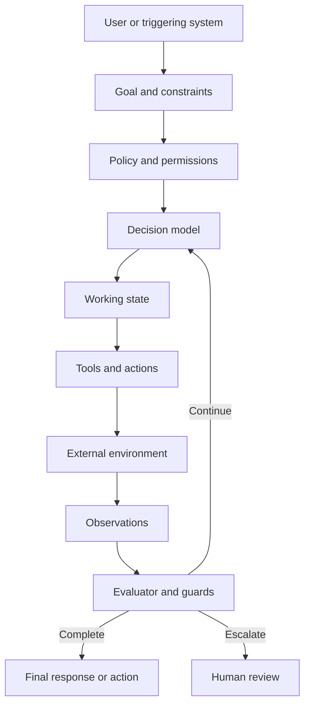
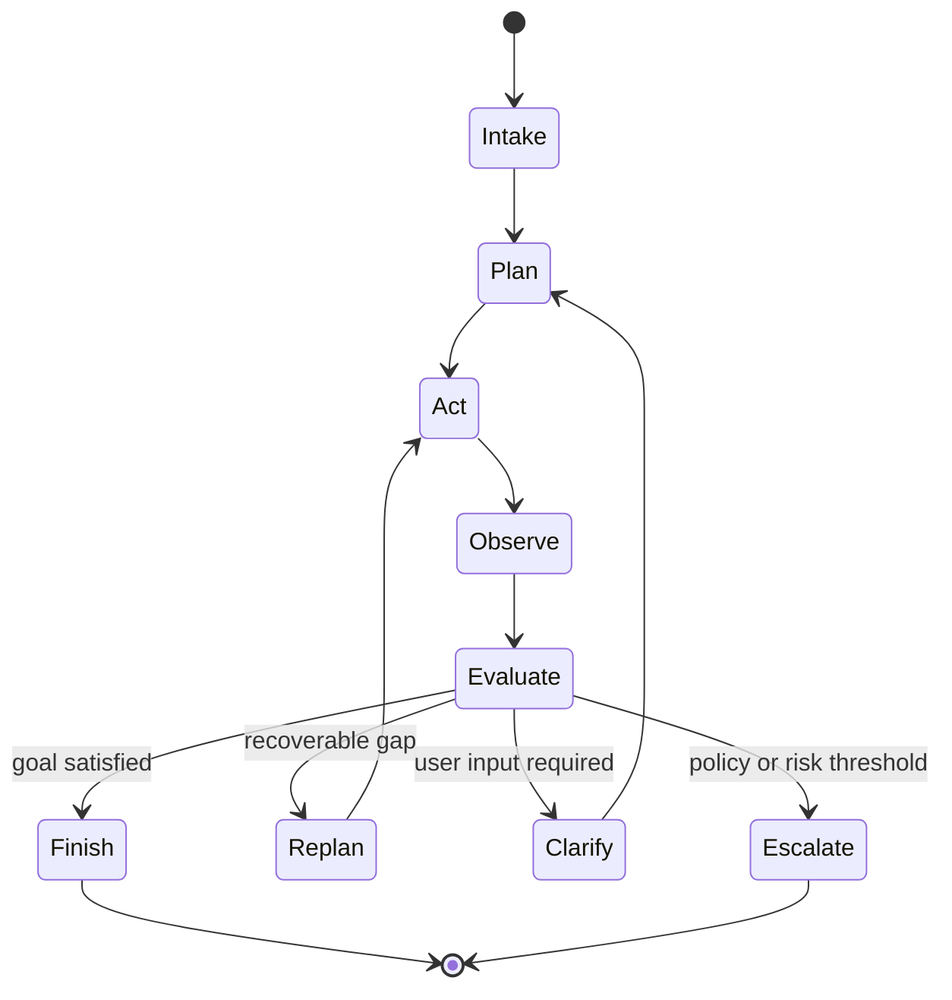
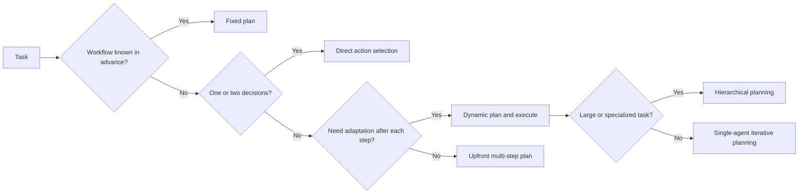
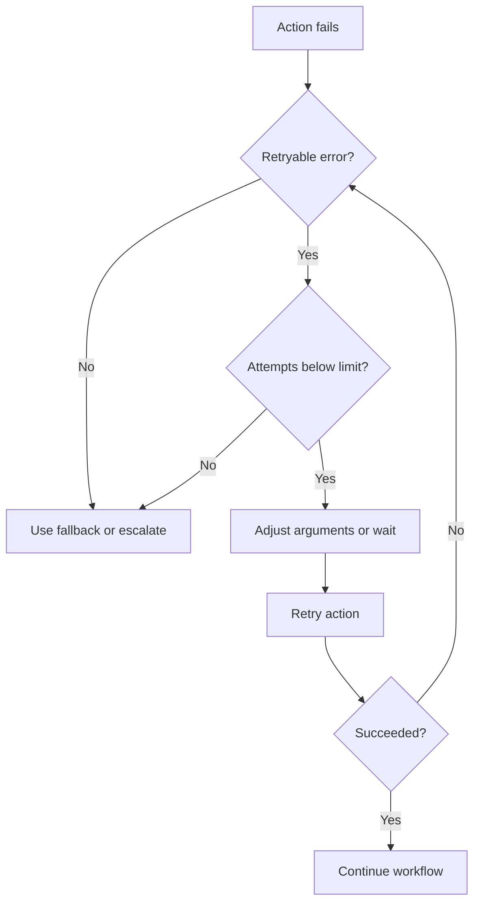
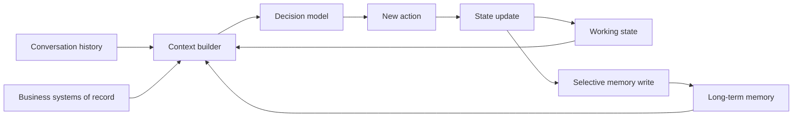
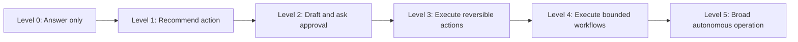
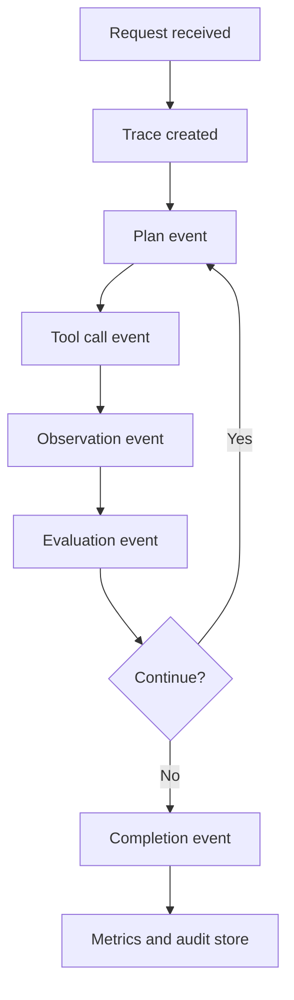
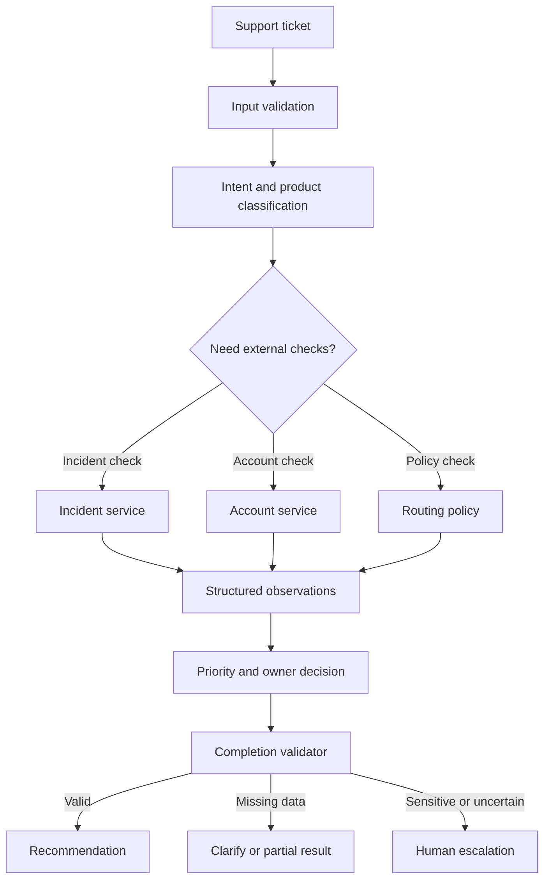
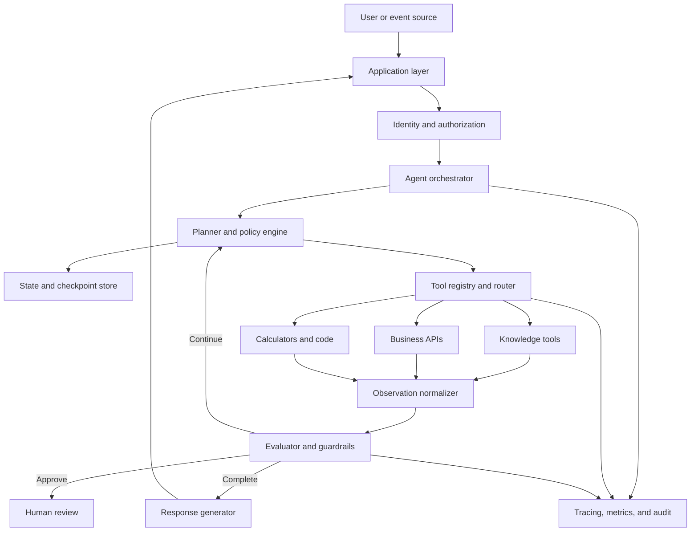

# Chapter 11 - AI Agent Fundamentals and the Execution Loop

> **Source basis:** The board describes an agent as a system that can plan, call tools, remember context, reflect, replan, and continue until a goal is complete. It also presents the lifecycle **goal -> planner -> task list -> execute -> reflect -> repeat -> finish**, along with examples for support triage, project coordination, tool routing, state, failure recovery, human override, and orchestration [Board, pp. 1-4, 15-17, 30-36, 39]. This chapter expands those ideas into a practical architecture for building reliable single-agent systems. Material beyond the board is marked **Supplementary**.

---

## Learning objectives

By the end of this chapter, you should be able to:

1. Explain what distinguishes an AI agent from a chatbot, a fixed workflow, and a conventional software service.
2. Identify the core components of an agent: goal, policy, model, state, tools, environment, and evaluator.
3. Describe the complete execution loop from request intake to termination.
4. Choose between direct execution, fixed planning, dynamic planning, and hierarchical planning.
5. Design typed actions and observations instead of relying on free-form text alone.
6. Separate conversation history, working state, durable memory, and business records.
7. Use reflection and replanning without creating uncontrolled loops.
8. Define budgets, stop conditions, retries, fallbacks, and escalation rules.
9. Decide the appropriate level of autonomy for a use case.
10. Design human-in-the-loop checkpoints for sensitive or irreversible actions.
11. Instrument an agent so that its decisions, tool calls, failures, and costs are observable.
12. Implement a dependency-free teaching example of a bounded support-triage agent.

---

## 1. What is an AI agent?

An AI agent is a software system that receives a goal, decides what to do next, interacts with an environment, observes the result, updates its state, and continues until it reaches a valid stopping condition.

A useful minimal definition is:

> **Agent = model-guided decision-making + state + actions + feedback + termination.**

The model may be a large language model, a smaller classifier, a rules engine, or a combination of several components. The defining property is not the presence of an LLM. The defining property is that the system selects and executes actions in pursuit of an objective.

A simple chatbot typically performs one transformation:

```text
user message -> model response
```

An agent performs a loop:

```text
goal
  -> inspect state
  -> choose action
  -> execute action
  -> observe result
  -> update state
  -> decide whether to continue
```

That loop allows the system to handle tasks that cannot be completed in a single model call.

### 1.1 Examples of agentic tasks

Examples include:

- identify blocked sprint items by checking Jira, Slack, and meeting notes;
- classify a support ticket, inspect account state, and recommend escalation;
- compare suppliers using pricing, delivery, quality, and policy constraints;
- gather evidence from multiple knowledge sources and produce a cited report;
- schedule a meeting after checking calendars and user preferences;
- update a business system after validation and human approval;
- monitor a long-running process and recover from transient failures.

Each example requires more than text generation. The system must make decisions, interact with tools, and maintain state across steps.

---

## 2. Chatbot, workflow, copilot, and agent

Teams often use these terms interchangeably, but they imply different control models.

| System type | Primary behavior | Control flow | State | Tool use | Typical risk |
|---|---|---|---|---|---|
| Chatbot | Generates a response | Single turn or short dialogue | Conversation history | Optional | Low to medium |
| Fixed workflow | Executes predefined steps | Developer-defined | Structured workflow state | Yes | Predictable |
| Copilot | Assists a human operator | Human-directed | Session and task context | Often | Medium |
| Agent | Selects actions toward a goal | Runtime decision-making within policy | Working and durable state | Central capability | Medium to high |
| Autonomous system | Operates with minimal supervision | Broad runtime control | Persistent | Extensive | High |

A fixed workflow may call an LLM but is not necessarily an agent. For example:

```text
upload PDF -> extract text -> summarize -> save result
```

The steps are predetermined. The model does not decide whether to retrieve another document, ask a question, or change strategy.

An agent might instead:

```text
inspect request
  -> determine missing information
  -> choose relevant sources
  -> retrieve evidence
  -> evaluate completeness
  -> ask a follow-up or continue
  -> produce and validate output
```

> **Key idea**
>
> Agentic behavior exists on a spectrum. A production system can be highly useful with only a small amount of runtime autonomy.

---

## 3. The anatomy of an agent

A reliable agent is easier to understand when decomposed into explicit components.



### 3.1 Goal

The goal defines the desired outcome. It should be specific enough to evaluate.

Weak goal:

> Help the user.

Stronger goal:

> Classify the support ticket, determine business impact, identify the correct owning team, and recommend escalation when the customer is blocked.

A good goal includes:

- the expected outcome;
- boundaries and exclusions;
- completion criteria;
- quality expectations;
- relevant policy constraints.

### 3.2 Policy

Policy specifies what the agent is allowed to do.

Examples:

- may read CRM records but may not delete them;
- may draft an email but must obtain approval before sending;
- may summarize HR policy but must not provide legal advice;
- may access records only for the authenticated user;
- may retry a tool call at most twice;
- must escalate if confidence falls below a threshold.

Policy should be enforced in code and infrastructure, not only described in a prompt.

### 3.3 Decision model

The decision model proposes the next action. It may:

- classify intent;
- choose a tool;
- fill tool arguments;
- create or revise a plan;
- decide whether evidence is sufficient;
- generate the final answer.

One model can perform all these roles, but production systems often separate them to improve control and cost efficiency.

### 3.4 State

State records what the agent currently knows about the task.

Typical fields include:

```text
request_id
user_id
current_goal
subgoals
completed_steps
pending_steps
tool_results
errors
retrieved_evidence
confidence
approval_status
remaining_budget
final_disposition
```

Without explicit state, the agent must infer progress from a transcript, which is fragile and difficult to audit.

### 3.5 Tools

Tools let the agent interact with systems outside the model.

Examples:

- search a knowledge base;
- query a database;
- call a business API;
- calculate a result;
- read a file;
- create a ticket;
- send a message;
- request approval.

Tools should have typed inputs, typed outputs, documented side effects, and clear permissions.

### 3.6 Environment

The environment is the world in which the agent acts. It includes:

- applications and APIs;
- databases and knowledge stores;
- files and messages;
- users and reviewers;
- network and service conditions;
- current business state.

The environment can change between steps. A plan created at the beginning may become invalid after a tool call or external update.

### 3.7 Evaluator

The evaluator determines whether the last step was successful and what should happen next.

It may check:

- schema validity;
- factual support;
- policy compliance;
- task completion;
- confidence;
- source freshness;
- authorization;
- progress since the previous step;
- remaining execution budget.

The evaluator can be deterministic, model-based, or hybrid.

---

## 4. The execution loop

The board’s lifecycle can be formalized as a bounded control loop.



A robust loop has seven stages.

### Stage 1: Intake

The agent receives a request or event and performs initial checks:

- authenticate the user;
- validate the input;
- classify the request type;
- detect high-risk or prohibited content;
- resolve obvious missing information;
- initialize state and budgets.

### Stage 2: Plan

The agent chooses a path to the goal.

A plan may be:

```text
1. Identify the affected product.
2. Determine whether the customer is blocked.
3. Query known incidents.
4. Check account status.
5. Assign priority and owner.
6. Decide whether escalation is required.
```

Plans should be treated as provisional. They are hypotheses about how to complete the task, not contracts that must be followed after the environment changes.

### Stage 3: Act

The agent executes one allowed action.

Examples:

- call `search_incidents(product="checkout")`;
- call `get_account_status(customer_id="C123")`;
- ask the user for an order number;
- route the request to a specialist queue;
- produce a draft response.

Executing one action at a time makes failures easier to isolate. Independent read-only actions may be parallelized when latency matters.

### Stage 4: Observe

The result is converted into a structured observation.

Example:

```json
{
  "tool": "search_incidents",
  "status": "success",
  "records_found": 1,
  "incident_id": "INC-8472",
  "summary": "Checkout failures in EU region",
  "timestamp": "2026-08-02T07:30:00Z"
}
```

Observations should distinguish:

- successful result;
- empty result;
- invalid arguments;
- permission denied;
- timeout;
- dependency unavailable;
- business-rule rejection.

### Stage 5: Evaluate

The agent determines whether the observation advances the task.

Questions include:

- Did the action succeed technically?
- Did it produce relevant information?
- Is the evidence sufficient?
- Did the result create a contradiction?
- Has the goal been satisfied?
- Is another action justified?
- Has the agent made measurable progress?

### Stage 6: Replan, clarify, or escalate

If the task is incomplete, the agent chooses among:

- retry the same action;
- modify arguments;
- switch tools;
- change the plan;
- ask a clarifying question;
- return a partial result;
- request human review;
- stop safely.

### Stage 7: Finish

The agent terminates only when a valid completion condition is met.

Examples:

- the requested information has been returned with evidence;
- the business action completed successfully;
- the user approved the draft;
- the system reached a safe partial result;
- the issue was escalated with sufficient context;
- the budget expired and the agent produced a transparent failure response.

---

## 5. Planning strategies

Planning is not one technique. Different tasks need different levels of structure.



### 5.1 Direct action selection

The agent selects the next tool without creating a visible multi-step plan.

Best for:

- simple lookup tasks;
- one-step calculations;
- deterministic routing;
- low-latency interactions.

Example:

```text
Question: What is the status of order 4821?
Action: get_order_status(order_id=4821)
```

### 5.2 Fixed plan

The developer defines the sequence, while the model fills in details.

Best for:

- regulated workflows;
- stable business processes;
- clear approval stages;
- predictable latency requirements.

Example:

```text
validate request -> retrieve account -> calculate eligibility -> request approval -> update system
```

### 5.3 Upfront plan-and-execute

The model creates a plan before acting, then executes it.

Best for:

- moderately complex tasks;
- tasks with clear subgoals;
- work where users benefit from seeing the plan.

Risk:

- the plan may become stale after an unexpected observation.

### 5.4 Dynamic planning

The agent selects the next step after every observation.

Best for:

- uncertain environments;
- variable source availability;
- troubleshooting;
- research;
- tasks requiring retries and fallback.

Risk:

- higher latency and more opportunities for loops.

### 5.5 Hierarchical planning

A high-level planner delegates bounded subgoals to workers or specialized components.

Best for:

- long tasks;
- distinct domains;
- parallelizable work;
- tasks with separate review stages.

Hierarchical planning should not be confused with adding many agents automatically. A single orchestrator can delegate to deterministic services or tools without creating a multi-agent conversation.

---

## 6. Actions should be typed contracts

A tool call is safer when represented as data rather than prose.

Weak representation:

> Check the customer account and do the necessary thing.

Stronger representation:

```json
{
  "action": "get_account_status",
  "arguments": {
    "customer_id": "C123"
  },
  "reason": "Need to determine whether the login failure is caused by a locked account."
}
```

A tool contract should define:

- tool name;
- purpose;
- input schema;
- output schema;
- read or write classification;
- required authorization;
- idempotency behavior;
- timeout;
- retry policy;
- error types;
- approval requirements;
- audit fields.

### 6.1 Read actions and write actions

Read actions retrieve information. Write actions change state.

| Action type | Example | Default control |
|---|---|---|
| Read | Query ticket status | Can often execute automatically |
| Draft | Create email draft | Automatic, but not externally visible |
| Reversible write | Add a label | May execute with logging |
| Sensitive write | Change payroll data | Human approval required |
| Irreversible action | Submit legal filing | Strong confirmation and approval |

A production agent should not receive broad write access merely because it can choose tools.

### 6.2 Idempotency

A retry must not accidentally repeat a side effect.

For example, a payment tool should accept an idempotency key:

```text
request_id = PAY-2026-000184
```

If the network times out after the payment succeeds, retrying with the same key should return the original result rather than charge the customer twice.

---

## 7. Observations are not just tool output

The raw output of a tool may be unsuitable for decision-making. The agent needs an observation that includes context.

A strong observation contains:

```text
action attempted
execution status
normalized result
source and timestamp
confidence or completeness
policy flags
error category
retryability
side-effect status
```

Example:

```json
{
  "action": "get_customer_orders",
  "status": "partial_success",
  "records": 12,
  "source": "order_service",
  "freshness_seconds": 4,
  "warning": "One regional shard unavailable",
  "retryable": true
}
```

The distinction between **empty** and **failed** matters:

- Empty: the tool worked and found no records.
- Failed: the tool could not determine whether records exist.

Treating a failure as an empty result can lead to unsafe conclusions.

---

## 8. Reflection and replanning

The board defines reflection as reviewing whether an output is good enough and replanning as changing the approach when a step fails or new information appears [Board, pp. 35-36].

Reflection is useful when it is tied to observable criteria.

Weak reflection:

> Think carefully about whether this is good.

Stronger reflection:

```text
Check whether:
1. every requested field is present;
2. each factual claim is supported by a tool result;
3. the recommended owner exists in the routing table;
4. escalation rules were applied;
5. the final response contains no restricted customer data.
```

### 8.1 Types of reflection

| Type | Question | Example |
|---|---|---|
| Technical | Did the action execute? | API timeout or schema error |
| Factual | Is the conclusion supported? | Priority reason matches ticket evidence |
| Completeness | Is anything missing? | No owner assigned |
| Policy | Is the action allowed? | Write requires approval |
| Progress | Did this step reduce uncertainty? | Repeated search returned same evidence |
| Efficiency | Is another step worth the cost? | Additional lookup unlikely to change outcome |

### 8.2 Replanning triggers

Replanning may be justified when:

- a tool is unavailable;
- required data is missing;
- the result contradicts earlier evidence;
- the user changes the goal;
- an action is denied by policy;
- a source is stale;
- confidence remains below threshold;
- a more efficient route becomes available.

### 8.3 Bounded recovery

Every recovery path needs a limit.



Useful limits include:

- maximum steps;
- maximum calls per tool;
- maximum repeated action signature;
- maximum wall-clock time;
- token budget;
- cost budget;
- maximum consecutive no-progress steps;
- maximum handoffs;
- maximum approval wait time.

---

## 9. Stop conditions and completion contracts

Agents fail when "done" is not defined.

A completion contract states the conditions under which the task can terminate successfully.

For a support-triage agent, the contract may require:

```text
priority is assigned
reason is supported by ticket evidence
owner is mapped to an approved queue
escalation decision is present
missing source information is disclosed
no restricted data is exposed
```

### 9.1 Successful termination

The agent stops because the goal is satisfied.

### 9.2 Partial termination

The agent returns a useful result but clearly states what could not be completed.

Example:

> I classified the ticket as high priority and assigned it to Account Access. I could not verify whether a platform incident is active because the incident service is unavailable.

### 9.3 Clarification termination

The agent pauses and asks for missing information.

Example:

> Which order number should I check?

### 9.4 Escalation termination

The agent hands off the task with context.

Example:

```text
Escalation reason: payroll write requested
Completed checks: identity verified, policy retrieved
Pending action: HR specialist approval
Relevant evidence: policy section 4.2
```

### 9.5 Failure termination

The system stops because it cannot continue safely or within budget.

A good failure response states:

- what was attempted;
- what failed;
- whether any side effect occurred;
- what the user can do next;
- whether a human review was created.

---

## 10. State, memory, and records

These concepts are related but should not be collapsed into one unstructured store.



### 10.1 Conversation history

The dialogue between the user and the system.

Use for:

- resolving pronouns and references;
- preserving user instructions;
- maintaining interaction continuity.

Do not assume the entire transcript should be sent to the model forever.

### 10.2 Working state

Structured data required to complete the current task.

Examples:

- current plan;
- completed steps;
- selected customer;
- retrieved evidence;
- retry count;
- pending approval.

Working state should be checkpointed for long-running or recoverable workflows.

### 10.3 Long-term memory

Information retained across tasks or sessions.

Examples:

- user preference for concise summaries;
- previously approved supplier criteria;
- stable organization-specific terminology.

Long-term memory needs explicit write policies. Storing every model output creates noise, privacy risk, and incorrect personalization.

### 10.4 Business records

Authoritative facts should remain in systems of record.

Examples:

- payroll data;
- order status;
- employee leave balance;
- ticket ownership;
- medical or laboratory records.

An agent memory is not a substitute for a transactional database.

### 10.5 Audit state

Audit data records what happened.

Examples:

- tool selected;
- arguments hash;
- authorization decision;
- result reference;
- policy version;
- model version;
- retry count;
- final disposition.

Audit logs should avoid copying sensitive payloads unnecessarily.

---

## 11. Levels of autonomy

Autonomy should be designed, not assumed.



| Level | Behavior | Example |
|---|---|---|
| 0 | Generate information | Explain return policy |
| 1 | Recommend | Suggest priority and owner |
| 2 | Prepare action | Draft an email for approval |
| 3 | Execute reversible action | Add ticket label |
| 4 | Complete bounded workflow | Triage, route, and notify within policy |
| 5 | Broad autonomous control | Operate across multiple systems with little supervision |

Most enterprise use cases should begin between Levels 1 and 3.

A higher level is justified only when:

- the task is well understood;
- tools have narrow permissions;
- actions are observable;
- recovery is tested;
- business owners accept the risk;
- human escalation is available;
- evaluation demonstrates reliable performance.

---

## 12. Single-agent and multi-agent boundaries

A single agent can use many tools and execute a complex workflow. Multiple tools do not imply multiple agents.

Use a single agent when:

- the goal is coherent;
- one policy context applies;
- state can be managed centrally;
- specialization does not materially improve quality;
- simplicity and debuggability matter.

Consider multiple agents when:

- distinct roles need different prompts or permissions;
- work can be parallelized;
- independent review is valuable;
- separate domains require specialized models or tools;
- organizational boundaries map naturally to technical boundaries.

> **Design principle**
>
> Add another agent only when it creates a clear control, quality, permission, or scaling benefit.

The next part of the handbook will examine frameworks and multi-agent patterns in detail. For now, the most important idea is that an agent should have one clearly defined responsibility.

---

## 13. Human-in-the-loop control

Human involvement is not a failure of automation. It is a control mechanism.

Human checkpoints are valuable when:

- an action is irreversible;
- legal, financial, safety, or employment impact is significant;
- model confidence is low;
- sources conflict;
- a policy exception is requested;
- the user explicitly asks for review;
- the task crosses an authorization boundary.

### 13.1 Approval patterns

**Pre-action approval**

```text
agent prepares action -> human approves -> tool executes
```

**Post-action review**

```text
agent performs reversible action -> human can inspect or undo
```

**Exception-only review**

```text
normal cases execute -> uncertain cases enter review queue
```

**Sampled review**

```text
small percentage of completed tasks reviewed for quality monitoring
```

### 13.2 Interrupt, reset, and abort

The board identifies three important controls [Board, pp. 24-25]:

| Control | Meaning | Example |
|---|---|---|
| Interrupt | Pause execution | Human checks an email before sending |
| Reset | Return to a known safe state | Clear faulty context and restart planning |
| Abort | Stop the workflow | Block a risky transaction |

These controls should be exposed both programmatically and, where appropriate, in the user interface.

---

## 14. Reliability engineering for agents

An agent is a distributed system with a probabilistic decision component. Reliability therefore requires both conventional software engineering and model evaluation.

### 14.1 Common failure classes

| Failure class | Example | Mitigation |
|---|---|---|
| Interpretation | Wrong user intent | Clarification and intent tests |
| Planning | Missing required step | Plan validator and workflow templates |
| Tool selection | Wrong API chosen | Tool routing tests and allowlists |
| Argument generation | Invalid customer ID | Schema validation |
| Execution | API timeout | Retry with backoff |
| Observation | Failure interpreted as empty result | Typed error states |
| Reflection | Agent accepts incomplete result | Completion contract |
| Looping | Same search repeated | Progress checks and step limits |
| Policy | Unauthorized write | Deterministic permission gate |
| State | Old result reused | Versioning and freshness checks |
| Termination | Stops too early or never stops | Explicit success and failure conditions |

### 14.2 Deterministic guards around probabilistic decisions

A model may propose:

```json
{
  "action": "refund_order",
  "arguments": {"order_id": "4821", "amount": 125.00}
}
```

Code should verify:

- user authorization;
- order ownership;
- refundable status;
- maximum amount;
- duplicate refund status;
- approval threshold;
- idempotency key.

The model decides what to request. The application decides whether the request can execute.

### 14.3 Fallback strategies

Fallbacks can include:

- alternate tool;
- cached read-only result;
- smaller or larger model;
- deterministic workflow;
- partial answer;
- clarification question;
- human escalation.

A fallback should preserve safety. Returning stale data without disclosure is not a safe fallback.

---

## 15. Observability and traceability

A final answer is not enough to debug an agent. Teams need to inspect the trajectory.



A trace should record:

```text
workflow ID
step ID
agent or component name
model and prompt version
action selected
tool name
argument reference
start and end time
status and error category
retry count
token usage
cost estimate
policy decision
approval decision
state version
final disposition
```

### 15.1 Metrics

Useful metrics include:

- task success rate;
- completion rate;
- escalation rate;
- tool selection accuracy;
- tool execution success;
- invalid argument rate;
- average steps per task;
- repeated-action rate;
- time to completion;
- model calls per task;
- token and cost per task;
- human approval rate;
- rollback rate;
- user correction rate;
- policy violation rate.

Metrics should be segmented by task type and risk level. An overall success rate can hide a serious failure in a small but sensitive category.

### 15.2 Trace quality

Verbose logs are not the same as observability. A useful trace should answer:

- Why was this action selected?
- What information was available at that moment?
- Which policy allowed or blocked it?
- Did the step make progress?
- Why did the agent stop?
- What side effects occurred?

---

## 16. Case study: support-triage agent

The board includes a support-triage prompt that asks the agent to identify product area, severity, business impact, whether the customer is blocked, priority, owner, and escalation need [Board, pp. 1-4].

### 16.1 Goal

```text
Classify an incoming support ticket and recommend the next operational action.
```

### 16.2 Inputs

- ticket text;
- customer tier;
- product metadata;
- known incident feed;
- account status;
- support routing policy.

### 16.3 Outputs

```text
priority
reason
recommended owner
escalation required
supporting evidence
missing information
```

### 16.4 Architecture



### 16.5 Example execution

User ticket:

> I reset my password twice and still cannot log in. Our finance team is blocked from closing the month.

Initial interpretation:

```text
product area: account access
business impact: high
customer blocked: yes
potential priority: high
```

Plan:

```text
1. Check whether the account is locked.
2. Check for an active authentication incident.
3. Retrieve routing policy for blocked enterprise customers.
4. Assign priority, owner, and escalation.
```

Observations:

```text
account status: locked after repeated failed attempts
active incidents: none
policy: blocked finance workflow for enterprise customer -> priority 1, identity team, immediate escalation
```

Final result:

```text
Priority: P1
Reason: Enterprise finance workflow is blocked and the account is confirmed locked.
Recommended owner: Identity and Access Support
Escalation required: Yes
Evidence: Account status service; support routing policy v4.3
```

### 16.6 Why this is agentic

The system did not merely classify text. It:

- formed a goal-oriented plan;
- selected tools based on uncertainty;
- integrated multiple observations;
- applied policy;
- validated completion;
- produced an operational recommendation.

### 16.7 Why this should remain bounded

The triage agent should not automatically change account credentials. Its scope is classification, evidence collection, routing, and escalation. A separate approved workflow should perform account recovery.

---

## 17. Production reference architecture

A production single-agent system can be organized into layers.



### 17.1 Application layer

Responsible for:

- authentication;
- user interaction;
- session handling;
- confirmation dialogs;
- progress display;
- interrupt, reset, and abort controls;
- presentation of sources and actions.

### 17.2 Orchestrator

Responsible for:

- initializing state;
- invoking the decision model;
- enforcing budgets;
- scheduling actions;
- checkpointing;
- routing approval requests;
- handling termination.

### 17.3 Policy engine

Responsible for:

- tool allowlists;
- authorization;
- approval thresholds;
- data-access rules;
- rate limits;
- domain restrictions.

### 17.4 Tool registry

Responsible for:

- tool definitions;
- schemas;
- permissions;
- execution adapters;
- timeouts;
- retry classification;
- result normalization.

### 17.5 Evaluator

Responsible for:

- validating observations;
- checking completion;
- detecting no-progress loops;
- checking final output;
- determining whether escalation is required.

---

## 18. A minimal implementation pattern

The accompanying example implements a support-triage agent using only Python’s standard library.

The implementation demonstrates:

- typed state with dataclasses;
- a bounded execution loop;
- a planner that selects tools;
- a registry of read-only tools;
- normalized observations;
- retry handling;
- a completion validator;
- human-escalation output;
- an execution trace.

The core pattern is:

```python
while not state.is_terminal:
    if state.steps >= state.max_steps:
        state.fail("step_budget_exhausted")
        break

    action = planner.next_action(state)
    observation = executor.run(action)
    state.record(action, observation)
    evaluator.update(state)
```

The loop is intentionally small. Reliability comes from the surrounding contracts:

- the planner can choose only registered actions;
- the executor validates arguments;
- the evaluator defines completion;
- state records every step;
- the budget guarantees termination.

> **Engineering note**
>
> Frameworks can reduce boilerplate, but they do not remove the need to define state, policy, completion, and failure behavior.

---

## 19. Common anti-patterns

### 19.1 "Agent" as a vague label

Calling a chatbot an agent does not make it one. Document the actions, state, feedback loop, and termination criteria.

### 19.2 One giant prompt

A long prompt that asks the model to plan, retrieve, calculate, apply policy, and validate everything at once is difficult to test.

Prefer explicit stages and typed interfaces.

### 19.3 Unlimited tools

Giving every tool to every agent increases selection errors and permission risk.

Expose the smallest relevant tool set.

### 19.4 Transcript as the only state

A transcript is useful context but poor workflow state.

Store progress, evidence, errors, approvals, and budgets in structured fields.

### 19.5 Self-reflection without criteria

Repeatedly asking the model to critique itself can increase cost without improving quality.

Use targeted checks and external evidence.

### 19.6 Retry everything

Some errors are not retryable.

Examples:

- invalid authorization;
- prohibited action;
- malformed identifier;
- business-rule rejection.

Retry only transient failures or failures that can be corrected.

### 19.7 No side-effect tracking

If a write succeeds but the response is lost, the agent may repeat it.

Use idempotency keys and durable action records.

### 19.8 Unbounded planning

A planner that can continually add tasks may never finish.

Enforce step, time, cost, and progress limits.

### 19.9 Hidden autonomy

Users should understand when the system is making recommendations versus executing actions.

Expose status, approvals, and action history appropriately.

### 19.10 Multi-agent by default

Multiple agents add coordination overhead. Begin with one bounded agent and add specialization only when justified.

---

## 20. Agent design checklist

### Goal and scope

- [ ] Is the goal specific and testable?
- [ ] Are non-goals documented?
- [ ] Is the agent responsible for one coherent job?
- [ ] Are completion criteria explicit?

### Actions and policy

- [ ] Are all actions registered and typed?
- [ ] Are read and write permissions separated?
- [ ] Are sensitive actions approval-gated?
- [ ] Are side effects idempotent?
- [ ] Are authorization checks enforced outside the model?

### State and memory

- [ ] Is working state structured?
- [ ] Can the workflow checkpoint and resume?
- [ ] Is long-term memory written selectively?
- [ ] Are systems of record treated as authoritative?
- [ ] Are sensitive fields minimized?

### Reliability

- [ ] Are retries classified by error type?
- [ ] Are fallbacks defined?
- [ ] Are loop and budget limits enforced?
- [ ] Is no-progress behavior detected?
- [ ] Are partial and failure responses transparent?

### Human control

- [ ] Can a user interrupt, reset, or abort?
- [ ] Are approval thresholds documented?
- [ ] Does escalation include enough context?
- [ ] Can a reviewer see what the agent did?

### Observability

- [ ] Is every trajectory traceable?
- [ ] Are tool calls and policy decisions recorded?
- [ ] Are model, prompt, and policy versions captured?
- [ ] Are success, latency, cost, and escalation measured?
- [ ] Can failures be replayed in a test environment?

---

## 21. Hands-on lab: design a project-coordination agent

The board includes a project-coordination example that checks tickets, team messages, and documents to summarize sprint blockers [Board, pp. 2-3].

### Goal

Design an agent that returns:

| Blocker | Owner | Source | Impact | Next action |
|---|---|---|---|---|

### Available tools

```text
list_sprint_tickets(sprint_id)
search_team_messages(query, date_range)
get_meeting_notes(project_id)
get_team_directory()
create_escalation(owner, summary)
```

### Requirements

1. Use read-only tools automatically.
2. Require human approval before creating an escalation.
3. State clearly when a source is unavailable.
4. Stop after ten tool calls.
5. Do not repeat an identical search more than once.
6. Escalate to the project manager if blocker ownership cannot be resolved.
7. Cite the source used for each blocker.

### Design tasks

1. Define the state schema.
2. Define the plan and possible branches.
3. Define each tool contract.
4. Define completion criteria.
5. Define retryable and non-retryable errors.
6. Define approval and escalation behavior.
7. Define the trace events and metrics.

### Suggested state schema

```json
{
  "project_id": "",
  "sprint_id": "",
  "tickets_checked": false,
  "messages_checked": false,
  "notes_checked": false,
  "candidate_blockers": [],
  "resolved_owners": {},
  "missing_sources": [],
  "pending_approval": null,
  "tool_calls": 0,
  "repeated_actions": {},
  "status": "running"
}
```

### Extension

Add a policy that prevents the agent from reading private direct messages. Explain where that control should be enforced and how the user should be informed.

---

## 22. Knowledge check

1. What properties distinguish an agent from a single-turn chatbot?
2. Why should policy be enforced outside the prompt?
3. What is the difference between an action result and an observation?
4. When is a fixed workflow preferable to dynamic planning?
5. Why does every agent need an explicit completion contract?
6. What is the difference between working state and long-term memory?
7. Why is an empty result different from a failed tool call?
8. What types of errors should not be retried?
9. How can progress checks prevent loops?
10. Why are idempotency keys important for write tools?
11. What factors should determine an agent’s autonomy level?
12. When does adding another agent improve a system?
13. What should be included in a human escalation package?
14. Which trajectory-level metrics help diagnose inefficient agents?
15. Why is a transcript insufficient as the only state store?

---

## 23. Interview questions

### Beginner

1. What is an AI agent?
2. What are the main components of an agent?
3. What is tool calling?
4. What is the purpose of agent state?
5. What is reflection?
6. What is replanning?
7. What is a stop condition?
8. What is human-in-the-loop?

### Intermediate

1. Compare a fixed workflow with a dynamic agent loop.
2. How would you prevent an agent from repeatedly calling the same tool?
3. How should tool errors be represented?
4. How would you separate conversation memory from business state?
5. When should an agent ask a clarifying question rather than continue?
6. How would you design approval for a sensitive write action?
7. What metrics would you collect for a support-triage agent?
8. How would you test an agent’s completion criteria?

### Advanced

1. Design a checkpointing strategy for a long-running agent workflow.
2. How would you guarantee idempotency across model retries and API timeouts?
3. How would you detect that an agent is making no progress even though each tool call succeeds?
4. How would you evaluate the quality of an agent trajectory rather than only its final answer?
5. How should authorization be propagated through an orchestrator and tool layer?
6. Design a policy architecture that allows read access but approval-gates write access.
7. How would you migrate a single-agent system to a multi-agent architecture without losing traceability?
8. What failure modes emerge when state is eventually consistent?
9. How would you design safe rollback for a multi-step transactional workflow?
10. How would you balance latency against reflection and validation depth?

### System design prompt

Design an enterprise employee assistant that can:

- answer HR policy questions;
- check leave balance;
- inspect calendars;
- prepare a leave request;
- submit the request only after approval;
- preserve an audit trail;
- escalate policy exceptions.

Discuss:

- autonomy level;
- state model;
- tool contracts;
- identity and authorization;
- approval flow;
- retry and idempotency behavior;
- completion contracts;
- observability;
- security boundaries;
- evaluation strategy.

---

## 24. Chapter summary

An AI agent is not merely an LLM with a system prompt. It is a controlled software system that pursues a goal through an execution loop.

The essential pattern is:

```text
understand -> plan -> act -> observe -> evaluate -> continue or stop
```

Reliable agents make each part explicit:

- goals are measurable;
- actions are typed;
- permissions are enforced;
- observations distinguish success, absence, and failure;
- state is structured and checkpointed;
- reflection uses concrete criteria;
- retries and replanning are bounded;
- completion conditions are defined;
- sensitive actions require human control;
- traces explain what happened and why.

The most important architectural principle is simplicity:

> Use the minimum autonomy and the simplest control flow that can reliably complete the task.

The next chapter focuses on **tool calling and action execution**, including schemas, routing, authentication, side effects, idempotency, sandboxing, and tool evaluation.
