# Chapter 12 - Tool Calling and Action Execution

> **Source basis:** The board presents tool calling as a central agent capability: the agent classifies a request, chooses a route, calls an external system, validates the result, and either responds, retries, replans, or escalates. It also emphasizes permissions, tool/API guardrails, authentication, state, retries, interruption, reset, abort, observability, and human approval [Board, pp. 1-4, 15-18, 24-36, 39]. This chapter turns those ideas into an engineering model for safe and reliable action execution. Material beyond the board is marked **Supplementary**.

---

## Learning objectives

By the end of this chapter, you should be able to:

1. Explain why tool calling is the boundary between language generation and operational action.
2. Distinguish tool selection, argument generation, execution, observation, and validation.
3. Design a typed tool contract with explicit inputs, outputs, errors, permissions, and side effects.
4. Build a controlled tool registry rather than exposing arbitrary functions to a model.
5. Apply authentication, authorization, and least-privilege principles to agent tools.
6. Separate read-only, reversible, approval-gated, and irreversible actions.
7. Validate model-generated arguments before any external call.
8. Use idempotency keys and confirmation records to make retries safe.
9. Classify failures into retryable, non-retryable, policy, and business errors.
10. Design bounded retry, fallback, compensation, and escalation behavior.
11. Protect tool execution with sandboxing, timeouts, quotas, and network controls.
12. Instrument calls with traces, audit events, latency, cost, and outcome metrics.
13. Evaluate whether an agent chose the correct tool and used it correctly.
14. Implement a dependency-free example with a registry, policy engine, validation, idempotency, and audit logging.

---

## 1. Why tools change the risk profile

A language model that only produces text can still make mistakes, but its direct effect is usually limited to the response shown to a user. Once the same model can call tools, the system can read private records, modify business data, send messages, create orders, trigger workflows, or initiate financial and operational actions.

Tool access changes the system from a content generator into an actor.

```text
Without tools:
request -> model -> text

With tools:
request -> model decision -> external action -> changed environment
```

This distinction is fundamental. A wrong sentence may confuse a user. A wrong tool call may:

- reveal confidential information;
- create duplicate records;
- send an email to the wrong recipient;
- update a production database;
- approve an invalid transaction;
- trigger a costly workflow;
- violate an organizational policy;
- make a promise that the business cannot honor.

The architecture must therefore treat tool calling as a privileged execution pathway, not as a natural-language convenience feature.

> **Key idea**
>
> The model may propose an action, but trusted software must decide whether that action is valid, permitted, safe, and complete.

---

## 2. The tool-calling lifecycle

The board's routing diagrams can be expressed as a complete execution lifecycle.

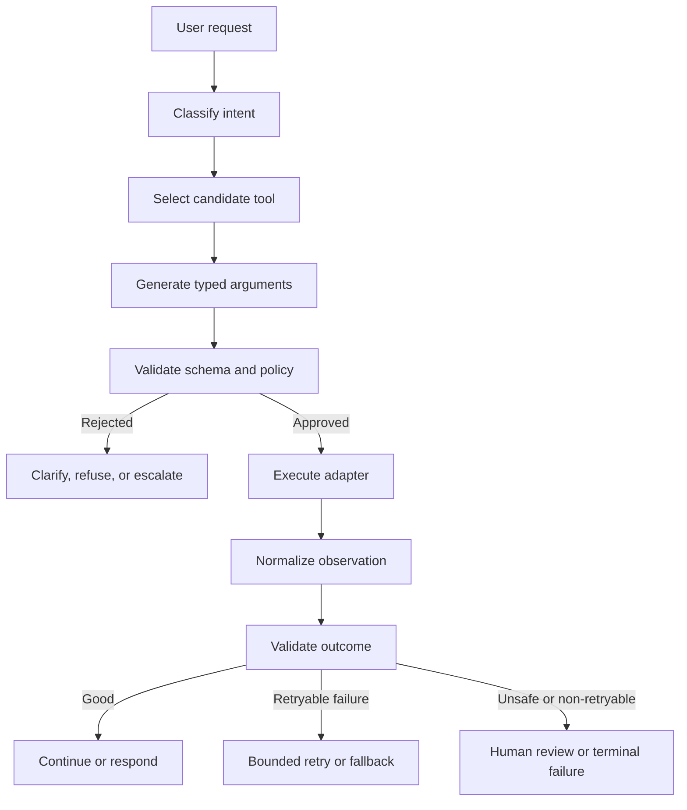

A reliable tool call is not a single event. It is a pipeline with at least eight distinct decisions:

1. **Intent classification** - What is the user actually trying to accomplish?
2. **Tool selection** - Which capability is suitable for that intent?
3. **Argument construction** - What structured parameters are required?
4. **Input validation** - Are those parameters syntactically and semantically valid?
5. **Policy evaluation** - Is this user allowed to perform this action in this context?
6. **Execution** - Can the adapter call the external system safely?
7. **Observation normalization** - How is the raw result represented consistently?
8. **Outcome validation** - Did the action produce the intended result?

When these responsibilities are collapsed into one model call, failures become difficult to diagnose and unsafe to recover from.

---

## 3. Tools, functions, APIs, and actions

These terms are related but not identical.

| Term | Meaning | Example |
|---|---|---|
| Function | A callable unit inside a program | `calculate_tax(amount, region)` |
| API | A remote or local interface exposed by a system | CRM REST endpoint |
| Tool | An agent-facing capability with a contract and controls | `get_customer_profile` |
| Action | A specific invocation selected during a workflow | Read customer 4821 |
| Adapter | Code that translates the tool contract into a system-specific call | CRM client wrapper |
| Observation | The normalized result returned to the agent | Customer status and source metadata |

A raw API should rarely be exposed directly to a model. APIs are designed for developers and may contain dozens of fields, complex authentication behavior, broad permissions, and dangerous operations. An agent tool should present a narrower, task-oriented interface.

For example, avoid exposing a generic CRM client:

```text
crm.request(method, path, body)
```

Prefer explicit capabilities:

```text
get_customer_profile(customer_id)
find_open_orders(customer_id)
create_support_note(customer_id, text, idempotency_key)
```

The narrower design improves:

- tool selection accuracy;
- argument validation;
- permission enforcement;
- auditability;
- testing;
- error handling;
- user explanation.

---

## 4. The tool contract

A tool contract is the authoritative description of an agent capability. It should be machine-readable where possible and understandable by engineers, reviewers, and auditors.

A complete contract includes:

```text
name
purpose
description
input schema
output schema
permissions
side-effect class
approval requirement
timeout
retry policy
idempotency behavior
error taxonomy
data classification
logging policy
owner
version
```

### 4.1 Example contract

```yaml
name: create_support_note
purpose: Add an internal note to a customer support case
inputs:
  case_id:
    type: string
    required: true
    pattern: "CASE-[0-9]+"
  text:
    type: string
    required: true
    max_length: 2000
  idempotency_key:
    type: string
    required: true
outputs:
  note_id: string
  case_id: string
  created_at: string
permissions:
  required_scope: support.case.note.write
side_effect: reversible_write
approval: not_required
retry:
  max_attempts: 2
  retry_on: [timeout, rate_limit, temporary_unavailable]
timeout_seconds: 5
data_classification: confidential
```

The model does not need every operational detail, but the execution layer does.

### 4.2 Description quality

Tool descriptions influence selection. A useful description states:

- what the tool does;
- when it should be used;
- when it should not be used;
- what identifiers it requires;
- whether it changes data;
- what the result means.

Weak description:

> Updates a case.

Stronger description:

> Adds a non-customer-visible internal note to an existing support case. Use only after the case identifier has been verified. This tool does not send a message to the customer and does not change case status.

The stronger description reduces confusion with tools such as `send_customer_message` or `change_case_status`.

---

## 5. Tool registry and capability discovery

A tool registry is a controlled catalog of capabilities available to an agent. It is not merely a Python dictionary of functions. It is a policy-aware directory that can answer:

- which tools exist;
- which tools are relevant to the current task;
- which user or agent may access them;
- which versions are active;
- which tools are healthy;
- which require approval;
- which contain sensitive data;
- which are safe for automatic retry.

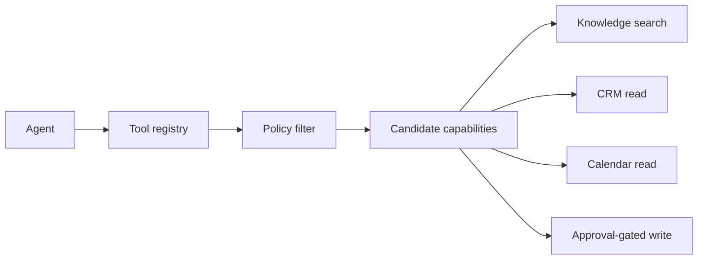

### 5.1 Do not show every tool on every turn

Giving a model hundreds of tools increases ambiguity, prompt size, and selection errors. Candidate tools should be reduced using deterministic context such as:

- workflow stage;
- authenticated user role;
- current subgoal;
- domain;
- data region;
- read versus write mode;
- prior tool results;
- tool health.

For an HR policy question, the agent may need only:

- policy search;
- employee identity lookup;
- human HR escalation.

It should not see payroll mutation, procurement, or production deployment tools.

### 5.2 Namespaces

Namespaces make large registries easier to reason about.

```text
knowledge.search
crm.customer.read
crm.case.note.create
calendar.availability.read
calendar.event.create
hr.leave.balance.read
hr.leave.request.submit
```

Names should be stable, specific, and action-oriented.

---

## 6. Tool selection

Tool selection answers two questions:

1. Is a tool necessary?
2. If so, which tool is appropriate?

The correct decision may be one of the following:

- answer directly from trusted context;
- ask a clarifying question;
- retrieve knowledge;
- call a read tool;
- request approval;
- call a write tool;
- refuse;
- escalate.

### 6.1 Selection policy

A useful selection policy prioritizes the least powerful action that can satisfy the request.

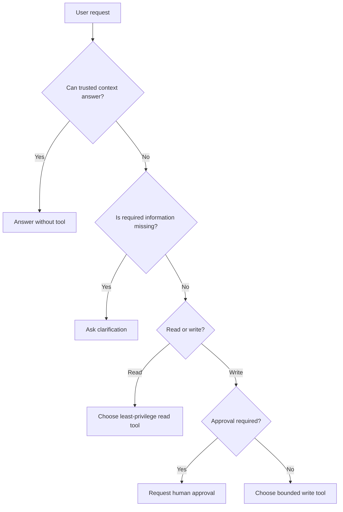

### 6.2 Common selection failures

| Failure | Example | Control |
|---|---|---|
| Unnecessary call | Calls CRM for a generic definition | Direct-answer gate |
| Wrong system | Searches policy KB for live account balance | Domain routing |
| Wrong action | Sends email when user asked for draft | Side-effect classification |
| Broad tool | Uses generic SQL instead of approved query | Narrow contracts |
| Premature write | Creates ticket before confirmation | Approval gate |
| Repeated call | Calls same endpoint with same arguments | Action-signature tracking |

### 6.3 Deterministic routing and model routing

Routing can be:

- fully deterministic;
- fully model-selected;
- hybrid.

Deterministic routing is preferable when rules are stable and risk is high. Model routing is useful when language is varied and intent boundaries are fuzzy. Hybrid routing often works best:

```text
rules remove forbidden tools
model ranks allowed candidates
code validates final selection
```

---

## 7. Argument generation and validation

A model should produce arguments that conform to a typed schema. The executor should never trust free-form model text as executable input.

### 7.1 Three validation layers

1. **Syntactic validation**
   - required fields exist;
   - types match;
   - strings meet length and pattern constraints;
   - enums contain allowed values.

2. **Semantic validation**
   - date range is sensible;
   - end date follows start date;
   - quantity is positive;
   - case belongs to the current customer;
   - recipient address resolves to an approved identity.

3. **Policy validation**
   - user has the required scope;
   - action is allowed in the current workflow state;
   - data region and classification are compatible;
   - approval exists when required;
   - rate and cost budgets remain available.

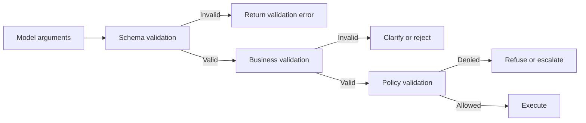

### 7.2 Never repair dangerous arguments silently

A system may safely normalize trivial issues, such as whitespace or date formatting. It should not silently change material intent.

Unsafe repair examples:

- changing a payment amount;
- choosing a recipient;
- inferring which employee record to modify;
- selecting a product to cancel;
- replacing a missing approval with a default.

When uncertainty affects a side effect, ask the user or escalate.

---

## 8. Identity, authentication, and authorization

The board's enterprise diagrams place authentication before orchestration. This is essential. Tool execution must carry verified identity and authorization context from the user-facing layer through the orchestrator to the tool adapter.

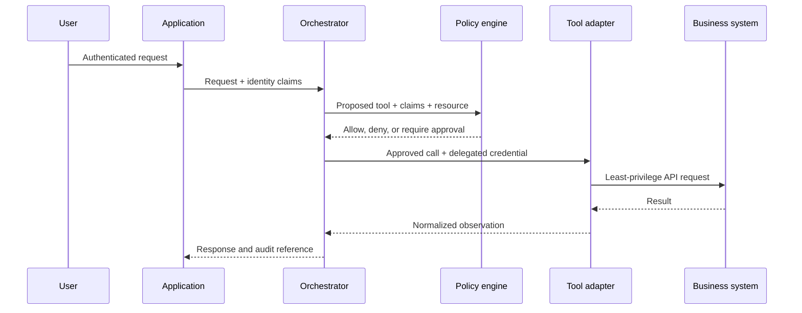

### 8.1 Authentication is not authorization

Authentication answers:

> Who is making the request?

Authorization answers:

> May this identity perform this action on this resource in this context?

An authenticated employee is not automatically allowed to read another employee's payroll record.

### 8.2 Least privilege

Use the narrowest credential and scope that can complete the task.

Prefer:

```text
calendar.availability.read
```

instead of:

```text
calendar.admin
```

Prefer delegated user identity when the action should follow the user's own permissions. Use service identity only when the business process explicitly requires system-level behavior.

### 8.3 Authorization must be enforced at the destination

The orchestrator should filter and pre-check calls, but the downstream system must still enforce its own access rules. A compromised or buggy orchestrator must not become a universal bypass.

---

## 9. Side-effect classification

Not all tools have the same operational risk. Classify each tool before making it available.

| Class | Description | Example | Default control |
|---|---|---|---|
| Pure computation | No external state change | Calculator | Automatic |
| Read-only | Reads external state | Search policy | Automatic with authorization |
| Reversible write | Changes state that can be undone | Add internal note | Automatic or confirm |
| Approval-gated write | Meaningful business change | Submit leave request | Explicit approval |
| Irreversible or high-impact | Difficult to undo or regulated | Transfer funds, terminate access | Strong approval or prohibit |

A side-effect class should influence:

- approval requirements;
- retry behavior;
- logging;
- timeout strategy;
- idempotency requirements;
- user confirmation;
- rollback design;
- model autonomy.

### 9.1 Draft is not send

One of the most important contract distinctions is between preparation and execution.

```text
draft_email != send_email
prepare_order != submit_order
propose_schedule != create_event
calculate_refund != issue_refund
```

Separate tools prevent an agent from crossing an action boundary accidentally.

---

## 10. Human approval and confirmation

Approval is a first-class workflow state, not a conversational phrase.

A valid approval record should identify:

- who approved;
- what exact action was approved;
- the normalized arguments;
- when approval occurred;
- how long it remains valid;
- which workflow instance it applies to;
- whether the action changed after approval.

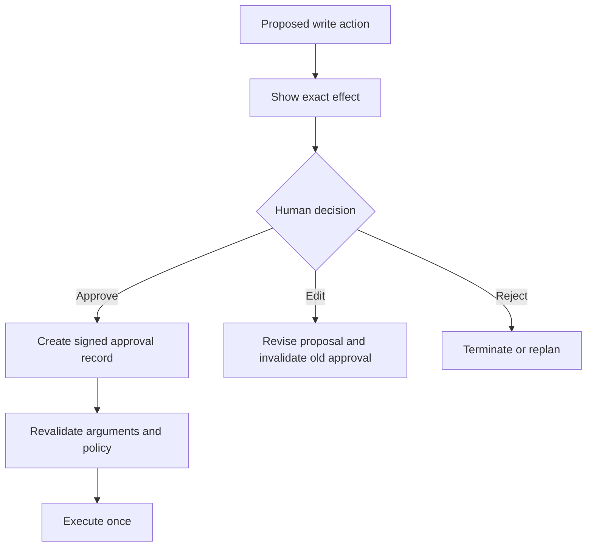

If arguments change after approval, the old approval must not be reused.

### 10.1 Confirmation user experience

A confirmation should communicate the effect, not merely ask "Continue?"

Weak:

> Do you approve?

Better:

> Create a calendar event titled "Sprint Review" for 14 attendees on 12 August from 15:00 to 16:00, send invitations immediately, and include the attached agenda. Approve, edit, or cancel.

---

## 11. Idempotency and duplicate prevention

Retries are unavoidable. Networks time out, clients disconnect, and models repeat actions. A write operation must therefore be designed so that retrying does not create duplicate effects.

An idempotency key identifies one intended business action.

```text
workflow_id + step_id + normalized_action_hash
```

The tool adapter stores the first successful result under that key. A repeated request returns the original result rather than executing again.

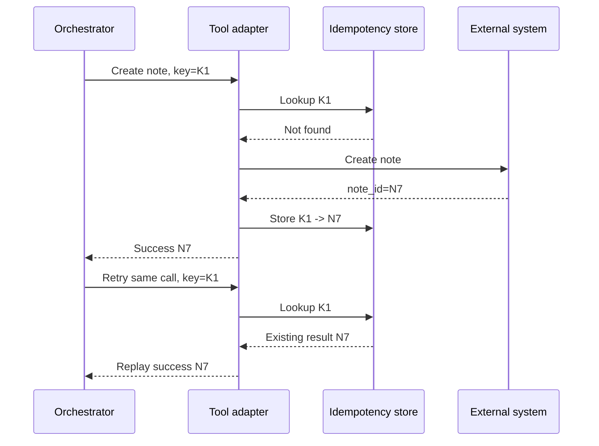

### 11.1 Exactly-once is usually an application illusion

Distributed systems rarely guarantee exactly-once execution end to end. Production systems approximate it through:

- idempotency keys;
- deduplication records;
- transactional outboxes;
- unique constraints;
- compare-and-set updates;
- reconciliation jobs;
- confirmation reads.

The agent should receive a clear observation such as:

```json
{
  "status": "succeeded",
  "operation_id": "N7",
  "idempotency_replay": true,
  "side_effect_confirmed": true
}
```

---

## 12. Error taxonomy

A tool layer should convert system-specific failures into a stable error taxonomy.

| Error class | Example | Retry? | Typical response |
|---|---|---:|---|
| Validation | Missing required ID | No | Ask for correction |
| Authentication | Expired token | Sometimes | Refresh credential |
| Authorization | User lacks scope | No | Deny or escalate |
| Not found | Case does not exist | Usually no | Clarify identifier |
| Conflict | Record changed since read | Conditional | Refresh and re-evaluate |
| Rate limit | Too many requests | Yes | Backoff |
| Timeout | No response before deadline | Conditional | Check idempotency, then retry |
| Temporary unavailable | Service outage | Yes | Fallback or retry |
| Business rule | Refund exceeds policy | No | Explain or escalate |
| Policy | Action is prohibited | No | Refuse |
| Unknown | Unclassified failure | Limited | Stop safely and escalate |

A raw exception string is not a sufficient observation. The controller needs structured fields:

```json
{
  "status": "failed",
  "error_class": "rate_limit",
  "retryable": true,
  "message_safe_for_user": "The service is temporarily busy.",
  "internal_reference": "ERR-8421",
  "side_effect_may_have_occurred": false
}
```

### 12.1 Ambiguous write outcomes

A timeout during a write is especially dangerous. The external system may have committed the action even though the client did not receive the response.

Do not immediately retry blindly. First:

1. query the idempotency store;
2. check the external operation status;
3. search by a unique business key;
4. reconcile the expected state;
5. retry only if absence is confirmed.

---

## 13. Retries, backoff, and fallbacks

Retries should be bounded, classified, and observable.

A retry policy includes:

- maximum attempts;
- retryable error classes;
- delay strategy;
- maximum total elapsed time;
- idempotency requirements;
- fallback behavior;
- escalation threshold.

### 13.1 Exponential backoff

A common delay pattern is:

```text
base_delay * 2^attempt + jitter
```

Jitter reduces synchronized retry storms.

### 13.2 Do not retry these automatically

- invalid arguments;
- explicit policy denial;
- missing approval;
- authorization failure;
- permanent business-rule rejection;
- destructive action with unknown outcome and no idempotency support.

### 13.3 Fallback design

Fallbacks may include:

- secondary API;
- cached read result;
- alternative retrieval source;
- read-only degradation;
- partial answer;
- deferred queue;
- human review.

A fallback must preserve semantics. A cached policy document may be acceptable for a low-risk explanation but not for a time-sensitive regulatory decision.

---

## 14. Compensation and rollback

Some multi-step actions cannot be wrapped in one transaction. If a later step fails, the system may need a compensating action.

Example:

```text
1. reserve inventory
2. create shipment
3. charge payment
```

If payment fails after shipment creation, the workflow may cancel the shipment and release inventory.

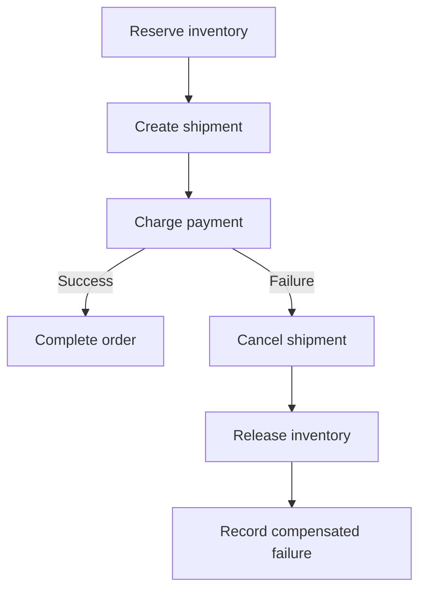

Compensation is not always a perfect rollback. Sending an email cannot be undone. A follow-up correction can be sent, but the original message still existed. High-impact actions should therefore be delayed until all reversible checks have completed.

---

## 15. Tool output and observation normalization

Each adapter should convert raw responses into a stable observation schema.

Recommended fields include:

```text
call_id
tool_name
tool_version
status
data
source_system
started_at
completed_at
latency_ms
error_class
retryable
side_effect_class
side_effect_confirmed
idempotency_replay
freshness
provenance
policy_decision
audit_reference
```

The model should not need to interpret HTTP status codes, vendor-specific error payloads, or internal stack traces.

### 15.1 Distinguish empty, absent, and failed

These are different outcomes:

- **Empty success:** Query worked and returned zero matches.
- **Not found:** A specific requested resource does not exist.
- **Unauthorized:** Resource may exist but cannot be accessed.
- **Failed:** The system could not complete the request.

Collapsing them into `null` causes incorrect replanning and misleading user responses.

---

## 16. Output validation and confirmation reads

Tool success should not be accepted blindly. Validate the result against the action's completion criteria.

For a calendar event creation tool, validation might check:

- event identifier exists;
- start and end times match the approved proposal;
- attendees match;
- invitation status is known;
- calendar owner is correct.

For critical writes, perform a confirmation read after execution.

```text
propose -> approve -> execute -> read back -> compare -> complete
```

If the read-back state differs, mark the operation as uncertain and escalate rather than claiming success.

---

## 17. Sandboxing and execution isolation

Tools that execute code, process untrusted files, browse external content, or access operating systems require stronger isolation.

A sandbox may restrict:

- filesystem paths;
- network destinations;
- process creation;
- CPU time;
- memory;
- wall-clock duration;
- package installation;
- environment variables;
- cloud metadata access;
- secrets;
- output size.

### 17.1 Code execution

Never execute model-generated code directly in the orchestrator process. Use an isolated environment with:

- ephemeral runtime;
- no inherited credentials;
- deny-by-default network access;
- strict resource limits;
- allowlisted libraries;
- captured stdout and stderr;
- automatic cleanup.

### 17.2 File handling

Treat uploaded files as untrusted. Validate type using content, not filename alone. Limit decompression, recursive archives, macros, and parser resource usage.

### 17.3 Browser and web tools

A browser tool can expose the agent to prompt injection embedded in webpages. Retrieved content must be treated as data, not as trusted instructions. The tool layer should isolate page content from system and policy instructions.

---

## 18. Secrets and sensitive data

Models should not receive long-lived credentials. The executor should obtain short-lived, scoped credentials at call time.

Recommended pattern:

```text
model proposes tool + arguments
executor checks policy
credential broker issues scoped token
adapter calls system
credential expires
```

Do not place API keys in:

- prompts;
- model-visible tool output;
- logs;
- error messages;
- trace attributes;
- user-facing responses.

Sensitive fields should be redacted or tokenized before model exposure unless the task genuinely requires them and policy allows it.

---

## 19. Concurrency and parallel tool calls

Independent read operations can often run in parallel.

Example return assessment:

- order lookup;
- return-policy retrieval;
- warranty lookup;
- customer eligibility check.

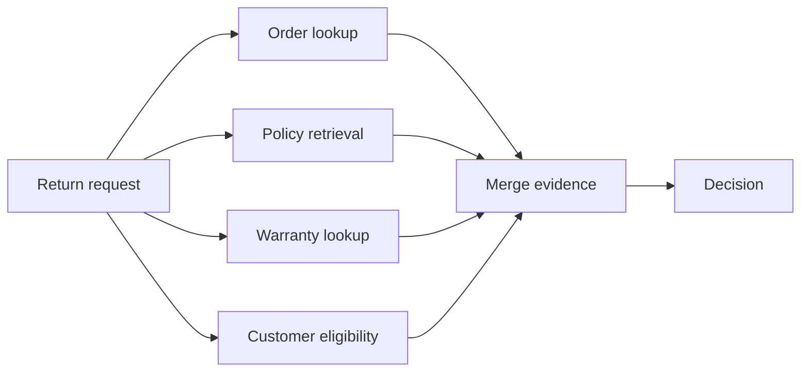

Parallelism reduces latency but introduces coordination concerns:

- partial failure;
- incompatible freshness;
- inconsistent snapshots;
- duplicate calls;
- rate limits;
- cancellation;
- merge rules.

Writes should generally be serialized unless the business process explicitly supports concurrent execution.

---

## 20. Tool call state machine

A state machine makes action execution auditable and recoverable.

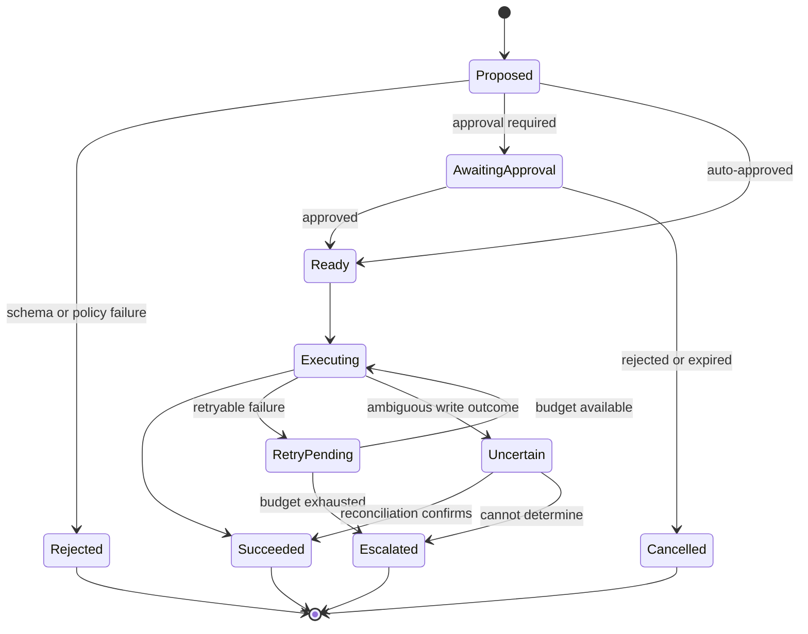

Persist state transitions, not only the final result. This allows the workflow to resume after a crash without repeating an already completed side effect.

---

## 21. Observability and auditability

For every tool call, capture enough information to reconstruct what happened without storing unnecessary sensitive content.

Recommended trace events:

```text
tool_proposed
tool_policy_checked
tool_approval_requested
tool_approved
tool_execution_started
tool_execution_succeeded
tool_execution_failed
tool_retry_scheduled
tool_reconciled
tool_escalated
```

Useful dimensions include:

- workflow ID;
- user and service identity references;
- tool name and version;
- argument hash;
- policy decision;
- approval reference;
- latency;
- attempt number;
- status;
- error class;
- idempotency replay;
- downstream operation ID;
- token and model cost associated with selection;
- final business outcome.

### 21.1 Do not confuse logs with observability

Verbose logs are not automatically useful. Observability requires structured, correlated events that answer questions such as:

- Why was this tool selected?
- Which policy allowed it?
- Did a human approve the exact action?
- Was the call retried?
- Did a side effect occur?
- Which downstream record changed?
- Did the tool result improve task progress?

---

## 22. Tool evaluation

Agent evaluation should test both selection and execution.

### 22.1 Selection metrics

- correct tool rate;
- unnecessary tool-call rate;
- missing tool-call rate;
- prohibited tool proposal rate;
- clarification accuracy;
- tool ranking quality.

### 22.2 Argument metrics

- schema-valid argument rate;
- semantic validity;
- required-field accuracy;
- entity-resolution accuracy;
- unsafe default rate;
- approval consistency.

### 22.3 Execution metrics

- success rate;
- retry rate;
- duplicate side-effect rate;
- idempotency replay rate;
- timeout rate;
- policy-denial rate;
- escalation rate;
- confirmation mismatch rate;
- mean and percentile latency.

### 22.4 End-to-end metrics

A technically successful call may still be wrong for the task. Evaluate:

- task completion;
- factual correctness;
- business-rule compliance;
- user intent satisfaction;
- side-effect correctness;
- reversibility and recovery;
- user trust and clarity.

### 22.5 Test cases

A tool test set should include:

- happy paths;
- missing fields;
- ambiguous entities;
- invalid identifiers;
- permission denial;
- service timeout;
- rate limit;
- partial outage;
- duplicate request;
- stale approval;
- changed record version;
- prompt injection in tool output;
- user interruption;
- retry budget exhaustion.

---

## 23. Worked example: project coordination agent

The board includes a project coordination agent that checks open sprint tickets, identifies blocked or delayed items, reviews recent team messages, and returns blocker, owner, impact, and next action.

### 23.1 Candidate tools

```text
jira.list_sprint_tickets
jira.get_ticket
teams.search_messages
documents.search_meeting_notes
identity.resolve_employee
```

All tools are read-only, but access remains scoped to the project and authenticated user.

### 23.2 Execution plan

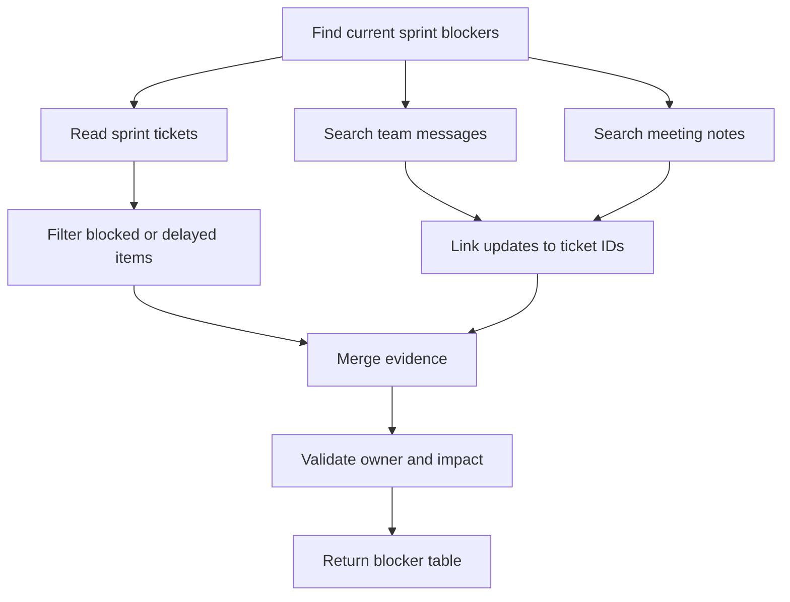

### 23.3 Tool contracts

`jira.list_sprint_tickets` requires:

- project ID;
- sprint ID;
- fields allowlist;
- maximum result count.

`teams.search_messages` requires:

- approved channels;
- bounded time range;
- query terms;
- no private direct-message access.

### 23.4 Failure handling

| Failure | Behavior |
|---|---|
| Jira unavailable | Retry once, then produce partial result with source status |
| Teams unavailable | Continue with tickets and notes; disclose limitation |
| Ticket owner missing | Mark owner unknown; do not invent |
| Conflicting updates | Show conflict and source timestamps |
| No blockers found | Return empty success, not failure |
| User lacks project access | Deny without revealing project existence or details |

### 23.5 Completion contract

The task is complete when:

- each reported blocker has a source;
- owner is verified or marked unknown;
- impact is evidence-based;
- missing sources are disclosed;
- no inaccessible private content was queried;
- the output follows the requested table schema.

---

## 24. Production reference architecture

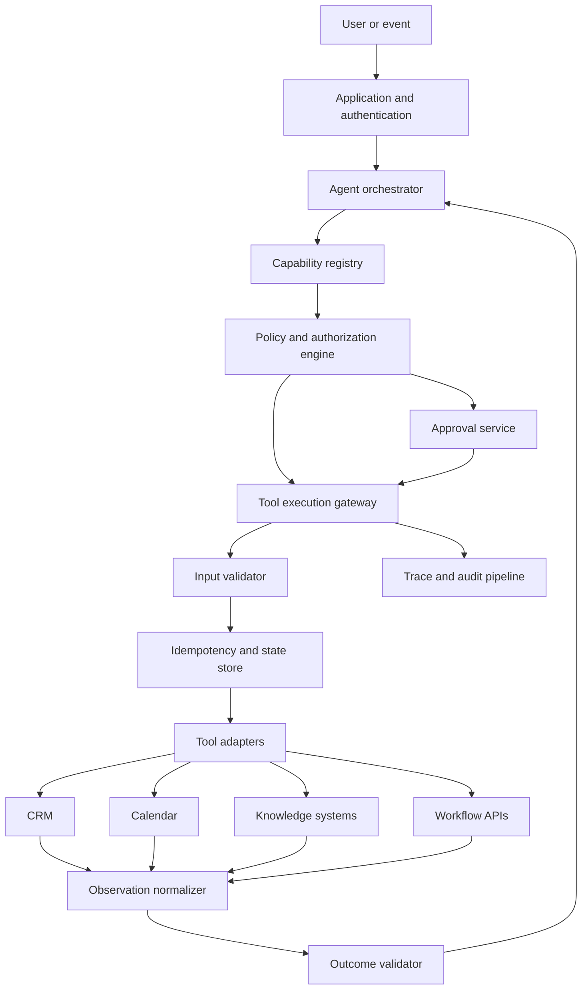

Key boundaries:

- the model cannot directly access credentials;
- the registry exposes only context-appropriate tools;
- the policy engine makes deterministic authorization decisions;
- the approval service binds human consent to exact arguments;
- the gateway enforces timeouts, quotas, and idempotency;
- adapters isolate vendor-specific behavior;
- observations are normalized before returning to the model;
- traces and audit records are separated from model-visible context.

---

## 25. Runnable example

The repository includes:

```text
examples/12-tool-calling/safe_tool_executor.py
```

The example demonstrates:

- a typed tool registry;
- schema validation;
- read and write permissions;
- approval-gated actions;
- idempotency replay;
- retry classification;
- normalized observations;
- structured audit events;
- safe refusal of unavailable tools.

Run it with:

```bash
python examples/12-tool-calling/safe_tool_executor.py
```

The implementation is intentionally dependency-free so the control concepts remain visible.

---

## 26. Best-practice checklist

### Tool design

- [ ] Use narrow, task-oriented tools.
- [ ] Define typed input and output schemas.
- [ ] Document side effects and permissions.
- [ ] Version contracts explicitly.
- [ ] Separate draft, approve, and execute actions.

### Security

- [ ] Authenticate before orchestration.
- [ ] Enforce authorization at both gateway and destination.
- [ ] Use least-privilege, short-lived credentials.
- [ ] Keep secrets out of prompts and logs.
- [ ] Treat tool output as untrusted data.

### Reliability

- [ ] Require idempotency for writes.
- [ ] Classify errors before retrying.
- [ ] Bound attempts and elapsed time.
- [ ] Reconcile ambiguous outcomes.
- [ ] Confirm critical writes with a read-back.

### Human control

- [ ] Require approval for high-impact actions.
- [ ] Bind approval to exact normalized arguments.
- [ ] Invalidate approval after changes or expiry.
- [ ] Support interrupt, reset, cancel, and escalation.

### Observability

- [ ] Correlate calls with workflow and user context.
- [ ] Record policy and approval decisions.
- [ ] Track latency, retries, and side-effect status.
- [ ] Preserve audit references without exposing sensitive payloads.
- [ ] Measure tool selection and task outcome separately.

---

## 27. Common mistakes

### Mistake 1: Trusting the model to enforce permissions

Prompts can guide behavior but are not security boundaries. Enforce access in code and downstream systems.

### Mistake 2: Exposing generic APIs

Broad interfaces increase misuse. Wrap them in narrow, domain-specific contracts.

### Mistake 3: Treating all errors as retryable

Retrying validation or policy failures wastes resources and may create loops.

### Mistake 4: Retrying writes without idempotency

This creates duplicate tickets, messages, orders, or payments.

### Mistake 5: Using conversation text as approval

Approval must be a structured record bound to the exact action.

### Mistake 6: Claiming success from an HTTP response alone

Validate business outcome and confirm critical state changes.

### Mistake 7: Returning raw tool payloads to the model

Normalize, filter, redact, and classify the result first.

### Mistake 8: Giving every agent every tool

Reduce candidate tools by role, workflow stage, and user permission.

### Mistake 9: Logging secrets or sensitive arguments

Log references and hashes where possible, with controlled access to protected details.

### Mistake 10: Ignoring ambiguous outcomes

A timeout after a write is not equivalent to failure. Reconcile before retrying.

---

## 28. Hands-on lab: safe leave-request submission

Design an employee leave assistant with these capabilities:

```text
hr.leave.balance.read
calendar.conflicts.read
hr.leave.request.prepare
hr.leave.request.submit
```

### Requirements

1. The user must be authenticated.
2. The agent may read only the current user's leave balance.
3. The agent may prepare a request automatically.
4. Submission requires explicit human approval.
5. Approval must include dates, leave type, and duration.
6. Submission must use an idempotency key.
7. A timeout must trigger reconciliation before retry.
8. The final response must include a request ID and status.
9. The audit trail must record policy and approval references.
10. The agent must not submit when the leave balance is insufficient.

### Deliverables

- tool contracts;
- side-effect classification;
- state machine;
- error taxonomy;
- approval payload;
- idempotency strategy;
- test cases;
- three key metrics.

### Extension

Add a manager-approval stage and explain how the workflow resumes after several hours or days without replaying the original submission.

---

## 29. Knowledge check

1. Why is a raw API usually a poor agent tool?
2. What fields belong in a tool contract?
3. What is the difference between syntactic, semantic, and policy validation?
4. Why should tool candidates be filtered before model selection?
5. How is authentication different from authorization?
6. Why should destination systems enforce authorization independently?
7. What side-effect classes require approval?
8. Why must draft and send be separate tools?
9. What does an idempotency key prevent?
10. Why is a timed-out write outcome ambiguous?
11. Which error classes should not be retried automatically?
12. What is a compensating action?
13. Why should raw tool output be normalized?
14. What is the difference between an empty result and a failed query?
15. When should a confirmation read be performed?
16. What restrictions belong in a code-execution sandbox?
17. Why should credentials be short-lived and scoped?
18. What risks are introduced by parallel tool calls?
19. What should a tool-call audit event contain?
20. How do tool-selection metrics differ from end-to-end task metrics?

---

## 30. Interview questions

### Beginner

1. What is tool calling in an AI agent?
2. What is a tool schema?
3. Why are typed arguments important?
4. What is least privilege?
5. What is a side effect?
6. What is idempotency?
7. What is a retryable error?
8. Why might a tool require human approval?

### Intermediate

1. Design a tool contract for creating a calendar event.
2. How would you prevent an agent from sending an email when the user requested only a draft?
3. How would you handle an expired authentication token?
4. How would you validate that a user may access a requested record?
5. How should a tool report an empty search result?
6. How would you prevent duplicate ticket creation after a timeout?
7. When should an agent use a fallback rather than retry?
8. How would you evaluate whether a model selected the correct tool?
9. What information should be bound to a human approval record?
10. How would you expose 200 enterprise tools without overwhelming the model?

### Advanced

1. Design an execution gateway for tools across several business systems.
2. How would you propagate user identity and authorization through a multi-agent workflow?
3. How would you reconcile an uncertain payment outcome?
4. Design a transactional outbox or equivalent pattern for a tool-triggered workflow.
5. How would you isolate untrusted code execution while preserving useful outputs?
6. How would you prevent indirect prompt injection from tool results?
7. What consistency problems arise when parallel reads come from systems with different freshness guarantees?
8. How would you version and deprecate tool contracts without breaking active workflows?
9. How would you prove that an approved action is exactly the action that was executed?
10. Design a compensation strategy for a three-step business process with no distributed transaction.

### System design prompt

Design a procurement agent that can:

- compare approved suppliers;
- retrieve pricing and delivery estimates;
- inspect historical quality scores;
- prepare a purchase recommendation;
- create a purchase order only after approval;
- prevent duplicate orders;
- handle supplier API outages;
- preserve an audit trail;
- restrict confidential pricing data by region and role.

Discuss:

- tool registry and contracts;
- identity and authorization;
- read and write separation;
- approval binding;
- idempotency;
- retry and reconciliation;
- compensation;
- observability;
- sandboxing and secrets;
- evaluation and red-team tests.

---

## 31. Chapter summary

Tool calling is where agent reasoning becomes operational behavior. Reliable systems do not allow a model to invoke arbitrary external capabilities directly. They place a controlled execution layer between model proposals and the environment.

The essential pattern is:

```text
select -> validate -> authorize -> approve -> execute -> normalize -> verify -> record
```

Production tool systems make the following explicit:

- tools are narrow, typed, versioned contracts;
- registries expose only relevant and permitted capabilities;
- arguments are validated before execution;
- authorization follows the authenticated identity;
- write actions are classified by risk;
- approvals are structured and bound to exact arguments;
- idempotency protects retries from duplicate side effects;
- errors are normalized and classified;
- retries are bounded and policy-aware;
- ambiguous outcomes are reconciled;
- critical actions are confirmed through read-back;
- sandboxes isolate code and untrusted content;
- traces and audit events explain each decision and effect;
- evaluation measures both tool correctness and business outcome.

The next chapter focuses on **reflection, evaluation, and replanning**: how an agent judges progress, detects weak or unsafe results, changes strategy, and avoids endless self-correction loops.
