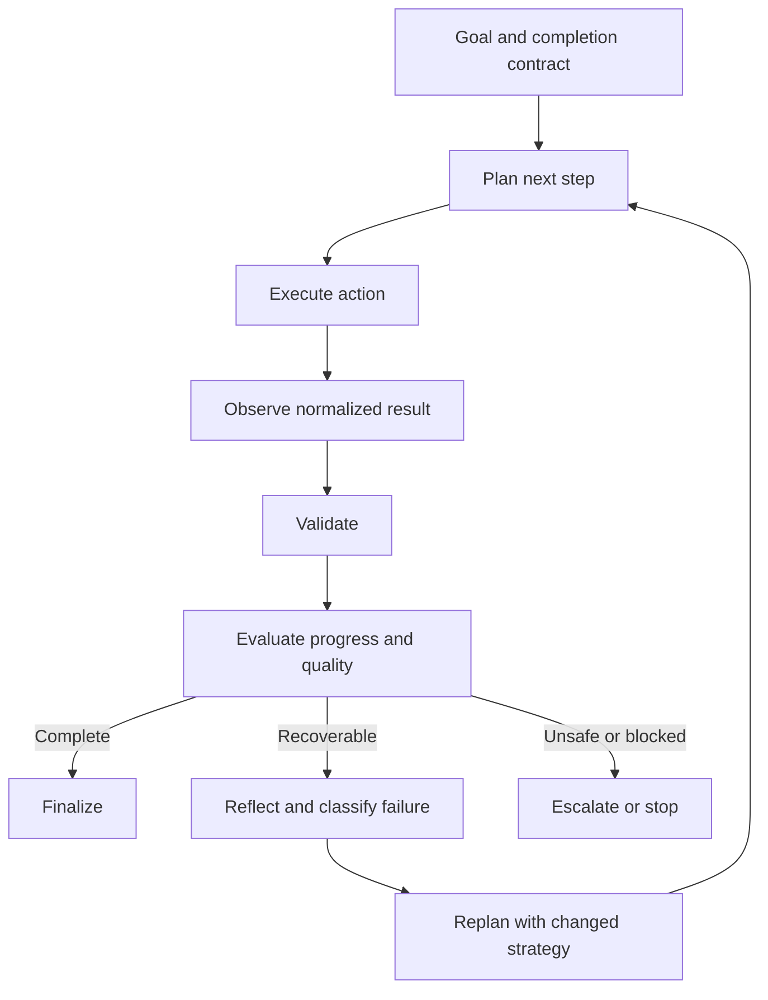
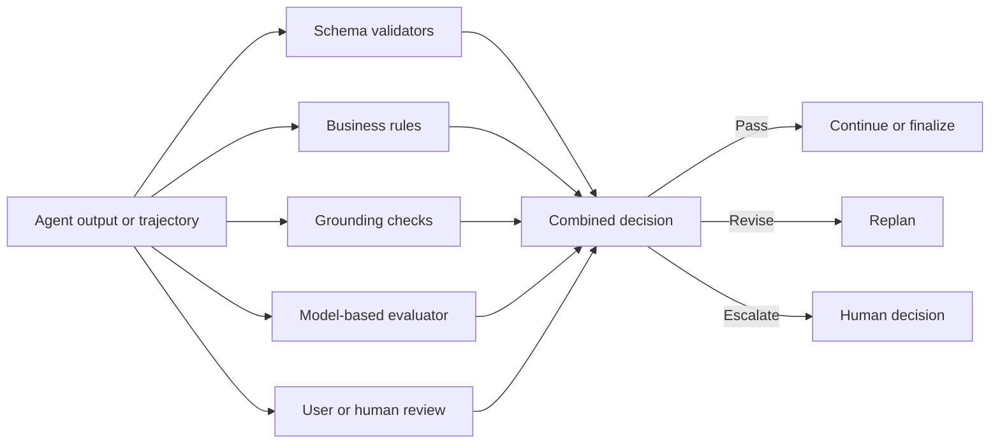
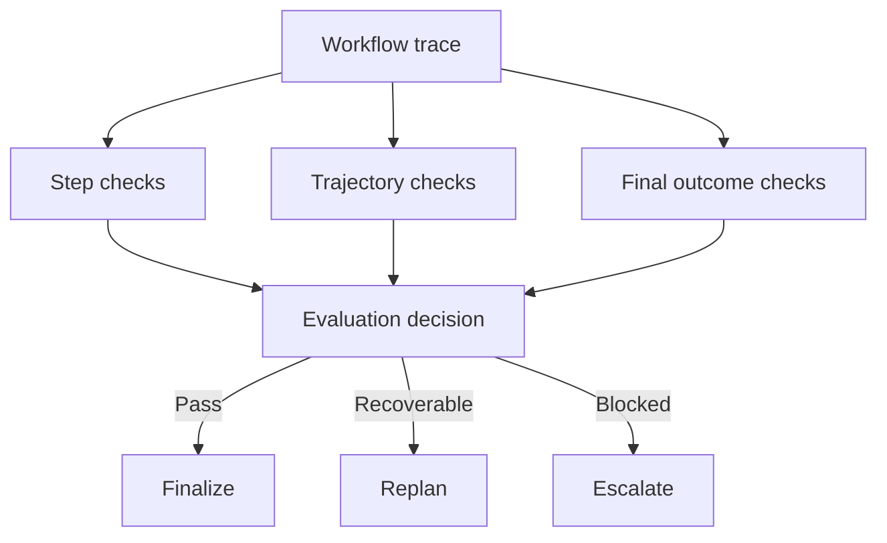
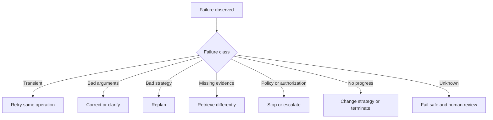
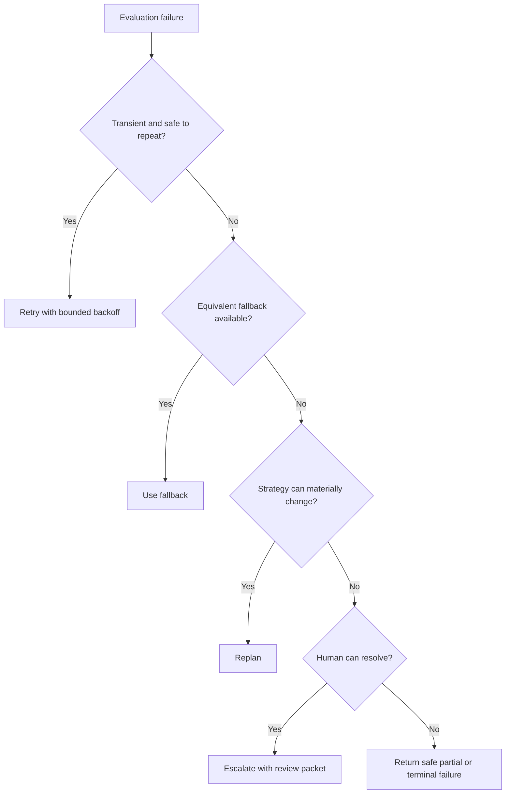
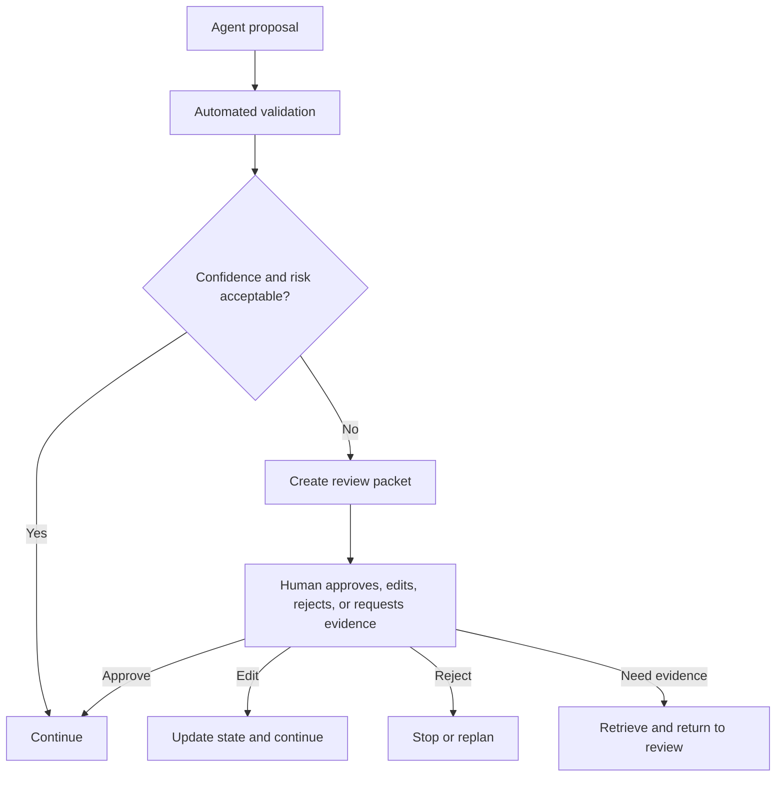
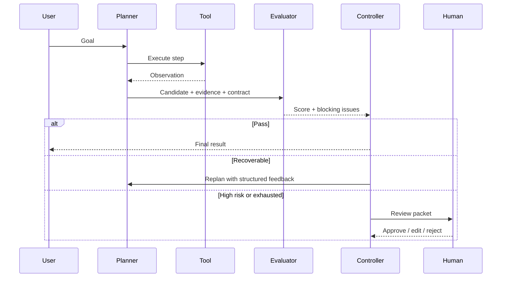
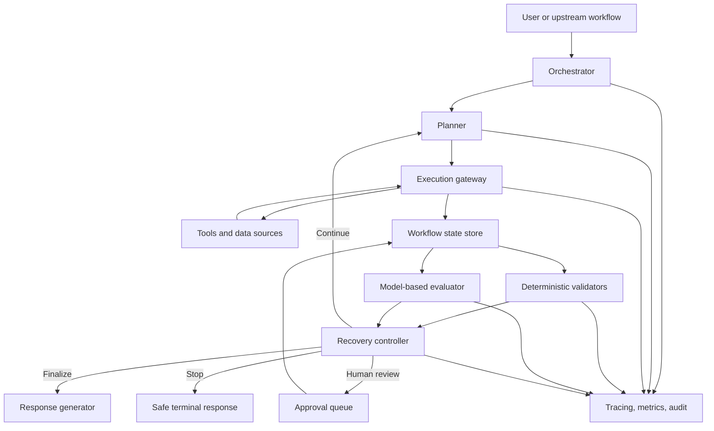

# Chapter 13 - Reflection, Evaluation, and Replanning

> **Source basis:** The board describes reflection as checking whether an agent's output is good enough, replanning as changing the plan after failure or new information, and recovery as a bounded loop of execute, inspect, diagnose, retry, or escalate. It also presents a competitive-research planner–executor–reviewer flow, failure loops, evaluation dimensions, state, human controls, and maximum-attempt termination [Board, pp. 3-5, 17-22, 25-35]. This chapter turns those ideas into a production engineering model. Material beyond the board is marked **Supplementary**.

---

## Learning objectives

By the end of this chapter, you should be able to:

1. Explain the difference between reflection, validation, evaluation, retry, and replanning.
2. Design a closed-loop agent that checks progress after every important action.
3. Define explicit success criteria instead of asking a model whether its own answer “looks good.”
4. Combine deterministic validators, business rules, model-based graders, and human review.
5. Evaluate individual steps, complete trajectories, and final outcomes separately.
6. Build a stable error taxonomy that maps failures to recovery actions.
7. Record reflections as structured state rather than unbounded prose.
8. Distinguish a productive replan from a repeated or cosmetic plan.
9. Prevent infinite reflection, retry, and delegation loops.
10. Apply execution, retry, cost, latency, and no-progress budgets.
11. Use confidence and risk together when deciding whether to continue or escalate.
12. Design reviewer and evaluator components that are independent enough to catch errors.
13. Implement a dependency-free controller with evaluation, bounded replanning, and escalation.
14. Measure both task quality and workflow efficiency in production.

---

## 1. Why an agent must evaluate itself

A conventional application follows logic that engineers wrote in advance. When a step fails, the application usually receives a typed error and follows a predetermined branch. An agent is different. It may choose its own tool, form its own arguments, interpret incomplete observations, revise its plan, and decide when the task is complete.

That flexibility creates a new question after every consequential step:

> Did the action move the workflow toward a valid outcome?

Without an explicit answer, an agent can continue confidently after:

- retrieving irrelevant evidence;
- selecting the wrong tool;
- misunderstanding a tool result;
- satisfying only part of the request;
- violating a policy constraint;
- repeating a failed action;
- producing a polished but unsupported response;
- declaring completion before required fields or approvals exist.

The board's failure-loop analogy captures the essential pattern:

```text
Execute step
    ↓
Did it work?
    ↓
No → Identify failure
    ↓
Reflect on cause
    ↓
Replan
    ↓
Retry or escalate
```

A production implementation must make each arrow concrete. “Did it work?” needs a completion contract. “Identify failure” needs an error taxonomy. “Reflect” needs structured evidence. “Replan” needs a meaningful change. “Retry” needs a budget. “Escalate” needs a clear owner and payload.

> **Key idea**
>
> Reflection is useful only when it changes a decision, improves state, or terminates an unsafe path. Unstructured self-commentary is not a control system.

---

## 2. Five concepts that are often confused

The terms reflection, evaluation, validation, retry, and replanning are frequently used as though they mean the same thing. They describe different responsibilities.

| Concept | Primary question | Typical mechanism | Example |
|---|---|---|---|
| Validation | Is this object structurally or semantically allowed? | Schema, rule, type, range, permission check | Does the report contain every required field? |
| Evaluation | How good is the step, trajectory, or result? | Rubric, metric, test set, evaluator | Are the competitor claims supported by evidence? |
| Reflection | What happened, why, and what should change? | Structured diagnosis over observations | Search failed because the query was too broad |
| Retry | Should the same operation be attempted again? | Error policy, backoff, idempotency | Retry a temporary API timeout |
| Replanning | Should the sequence or strategy change? | Planner using new state and constraints | Search product documentation before news sources |

A retry repeats an action because the failure is believed to be transient. A replan changes the approach because the original strategy is inadequate.

```text
Timeout from a healthy API
    → retry the same call

Search returned no authoritative sources
    → reformulate query or choose another source

User lacks permission
    → do not retry; refuse or escalate

Required business decision is ambiguous
    → ask the user or route to a human reviewer
```

Treating every failure as a retry wastes time and may amplify side effects. Treating every failure as a replan creates unnecessary model calls and unstable behavior.

---

## 3. The closed-loop execution model

A reflective agent operates as a feedback-controlled system.



The loop contains three nested control levels.

### 3.1 Action-level control

Checks one tool call or generation step.

Examples:

- Did the API respond successfully?
- Does the returned object match the schema?
- Is the source current and authorized?
- Did a write produce the expected confirmation?

### 3.2 Plan-level control

Checks whether the current sequence remains appropriate.

Examples:

- Are dependencies being resolved in the correct order?
- Is the selected source sufficient for the subgoal?
- Has new information invalidated a later step?
- Is the agent repeating an action without progress?

### 3.3 Outcome-level control

Checks whether the user's actual goal and policy requirements are satisfied.

Examples:

- Does the final report answer every requested question?
- Are claims grounded in evidence?
- Were required approvals obtained?
- Is uncertainty explained rather than hidden?

A system that validates only final text misses bad intermediate decisions. A system that validates only individual tools may still produce a globally incomplete answer. Reliable agents evaluate all three levels.

---

## 4. Start with a completion contract

Reflection cannot be reliable if success is vague. Before execution, define a completion contract: a set of observable conditions that must hold before the workflow may finish successfully.

For a competitive-research report, the contract might require:

```yaml
required_competitors: 3
required_dimensions:
  - product_capabilities
  - pricing
  - target_users
  - differentiators
minimum_authoritative_sources_per_competitor: 2
citations_required: true
unsupported_claims_allowed: false
freshness_limit_days: 180
review_status_required: approved
```

For a project-blocker report:

```yaml
required_fields:
  - blocker
  - owner
  - source
  - impact
  - next_action
source_systems:
  - ticket_tracker
  - team_messages
partial_results_allowed: true
missing_source_must_be_disclosed: true
```

The completion contract converts “good enough” into testable conditions.

### 4.1 Contract types

A complete contract can contain:

- **Structural criteria** - required fields, formats, and types.
- **Evidence criteria** - source count, provenance, freshness, and coverage.
- **Business criteria** - policy thresholds and domain rules.
- **Safety criteria** - permissions, prohibited actions, and approval state.
- **Quality criteria** - relevance, clarity, accuracy, and completeness.
- **Efficiency criteria** - maximum latency, cost, retries, or tool calls.
- **User-experience criteria** - disclosure of uncertainty, sources, and next actions.

> **Best practice**
>
> Put completion criteria in code or configuration wherever possible. Do not rely on a prompt alone to remember them.

---

## 5. Evaluation layers

Evaluation is strongest when independent mechanisms check different failure classes.



### 5.1 Deterministic validation

Deterministic checks are predictable and should be used whenever a requirement can be expressed as code.

Examples:

- JSON schema validation;
- allowed enum values;
- identifier patterns;
- numeric ranges;
- required citations;
- duplicate detection;
- permission checks;
- approval presence;
- source freshness limits;
- maximum tool-call count.

These checks are inexpensive, repeatable, and easy to test.

### 5.2 Business-rule evaluation

Business logic tests whether a result is valid in the domain.

Examples:

- a supplier cannot be recommended if a compliance certification is expired;
- a high-severity support case must have an owner and escalation path;
- a return cannot be approved outside the allowed policy window without supervisor review;
- a project update cannot mark a blocker resolved if its ticket remains blocked.

Business rules should usually live outside the model so that they can be reviewed, versioned, and audited.

### 5.3 Grounding evaluation

Grounding checks compare claims with evidence.

Useful checks include:

- every factual claim has a supporting source;
- cited text actually supports the claim;
- the source was retrieved from an authorized corpus;
- the source is not superseded;
- conflicting sources are disclosed;
- no unsupported numeric value appears in the answer.

Grounding can be partly deterministic when the output contains structured claim-to-source mappings. Model-based comparison may still be useful for semantic entailment, but it should not be the only control.

### 5.4 Model-based evaluation

A language model can grade properties that are difficult to express with simple rules, such as:

- clarity;
- relevance;
- empathy;
- synthesis quality;
- whether a summary captures the main implications;
- whether a response follows nuanced instructions.

A model-based evaluator should receive:

1. the original request;
2. the completion contract;
3. the candidate output;
4. the supporting evidence;
5. a precise rubric;
6. a constrained output schema.

Example evaluator output:

```json
{
  "task_completion": 4,
  "factual_support": 3,
  "instruction_adherence": 5,
  "policy_compliance": 5,
  "clarity": 4,
  "blocking_issues": [
    "Pricing claim for Competitor B has no authoritative source"
  ],
  "recommended_action": "replan"
}
```

### 5.5 Human evaluation

Human review is appropriate when:

- the action has high impact;
- evidence conflicts materially;
- policy requires approval;
- the evaluator is uncertain;
- the task involves legal, medical, employment, safety, or financial judgment;
- a user explicitly requests review;
- repeated automated attempts fail.

Human review should not receive a raw transcript only. The review packet should summarize the goal, proposed decision, evidence, unresolved risks, previous attempts, and the exact action requiring approval.

---

## 6. Design a useful rubric

A rubric defines what evaluators should measure and how scores map to actions. The board highlights factual consistency, fluency, instruction adherence, bias and toxicity, latency, and tool use. A production rubric can extend these into three groups.

### 6.1 Outcome quality

| Dimension | Question |
|---|---|
| Correctness | Are factual and computational claims correct? |
| Completeness | Are all requested elements present? |
| Relevance | Does the result answer the actual goal? |
| Grounding | Are claims supported by approved evidence? |
| Instruction adherence | Were role, constraints, and format followed? |
| Clarity | Is the result understandable and appropriately concise? |

### 6.2 Safety and control

| Dimension | Question |
|---|---|
| Policy compliance | Did the workflow respect organizational rules? |
| Authorization | Were data and tools accessed within permission scope? |
| Privacy | Was sensitive information minimized and protected? |
| Approval | Were required human decisions obtained? |
| Uncertainty | Were limitations and conflicts disclosed? |
| Bias and harm | Did the output avoid prohibited or unfair behavior? |

### 6.3 Operational quality

| Dimension | Question |
|---|---|
| Tool selection | Did the agent choose the correct capability? |
| Argument accuracy | Were tool inputs valid and complete? |
| Efficiency | Were calls, tokens, time, and cost proportionate? |
| Recovery | Did the agent respond correctly to failure? |
| Progress | Did each step reduce uncertainty or complete a subgoal? |
| Termination | Did the workflow stop at the right time? |

A rubric needs action thresholds, not just scores.

```text
All blocking checks pass and score >= 90%
    → finalize

No blocking safety issue, but score 70-89%
    → revise or replan

Score < 70%, repeated no-progress, or missing evidence
    → change strategy or escalate

Any policy, authorization, or prohibited-action failure
    → stop or route to human review
```

A high average score must never hide a blocking safety failure. Use gates for non-negotiable criteria and scores for gradable quality.

---

## 7. Step, trajectory, and outcome evaluation

Evaluating only the final answer is insufficient for agent systems.

### 7.1 Step evaluation

Step evaluation asks whether a single action was appropriate and successful.

```text
Subgoal: determine current list price
Action: search public web
Issue: an authoritative pricing API was available
Step score: poor tool selection
```

### 7.2 Trajectory evaluation

Trajectory evaluation examines the sequence of decisions.

It can detect:

- unnecessary tool calls;
- repeated searches;
- missing dependencies;
- unsafe action ordering;
- premature writes;
- endless delegation;
- ineffective reflection;
- late escalation;
- loss of state between steps.

Two agents may produce the same final answer, but one may use five justified steps while the other uses thirty expensive, risky calls. Outcome-only scoring would consider them equivalent; trajectory evaluation would not.

### 7.3 Outcome evaluation

Outcome evaluation checks the final deliverable and business result.

Examples:

- Was the report accepted by the reviewer?
- Did the user complete the intended task?
- Was the recommended supplier actually eligible?
- Did the support case reach the correct queue?
- Was the final answer grounded and understandable?



---

## 8. Structured reflection

Reflection should produce a small, typed record. Long free-form “thoughts” are difficult to validate, compare, or audit.

A useful reflection object contains:

```yaml
step_id: search_competitor_b_pricing
expected_result: authoritative current pricing
observed_result: two reseller pages with conflicting prices
failure_class: insufficient_authority
root_cause: wrong_source_strategy
progress_made: true
new_information:
  - competitor uses quote-based pricing
recommended_change:
  action: use_vendor_pricing_page_or_mark_unknown
confidence: 0.86
remaining_risk: exact enterprise price may not be public
```

This record supports downstream decisions without exposing hidden internal reasoning. It captures operationally relevant conclusions:

- expectation;
- observation;
- failure type;
- evidence;
- recommended change;
- confidence;
- risk.

> **Engineering note**
>
> Store concise decision summaries and evidence references. Do not require or persist unrestricted private reasoning traces.

### 8.1 Reflection triggers

Reflection is valuable when:

- a tool returns an error;
- evidence is missing or contradictory;
- a validator fails;
- the evaluator score falls below threshold;
- the same action repeats;
- the workflow exceeds a budget checkpoint;
- a user corrects the agent;
- the environment changes;
- a high-impact action is about to execute.

Reflection after every trivial token or read operation adds latency without improving control. Trigger it at meaningful boundaries.

---

## 9. Failure classification

The recovery policy depends on the failure type. A useful taxonomy separates failures that look similar in natural language but require different responses.

| Failure class | Example | Correct response |
|---|---|---|
| Transient infrastructure | API timeout | Retry with backoff |
| Rate limit | Too many requests | Wait, throttle, or use fallback |
| Invalid input | Missing required identifier | Correct arguments or ask user |
| Authorization | User lacks scope | Stop, refuse, or request approval |
| Not found | Record does not exist | Clarify identifier or use alternate lookup |
| Insufficient evidence | Sources do not support claim | Retrieve differently or disclose unknown |
| Contradictory evidence | Two current policies conflict | Resolve provenance or escalate |
| Planning failure | Required dependency skipped | Reorder or replace steps |
| Tool-selection failure | Calculator used for database lookup | Select correct capability |
| Business-rule failure | Supplier fails compliance threshold | Reject candidate or request exception |
| Policy failure | Requested action is prohibited | Stop and explain allowed path |
| No progress | Same query produces same result | Change strategy or terminate |
| Quality failure | Report is incomplete or unclear | Revise output using evaluator feedback |
| Unknown failure | Unclassified error | Fail safely and escalate with trace |



The taxonomy should be stable across tools. Adapters can map system-specific errors into these normalized categories.

---

## 10. Productive replanning

A replan is productive when it changes a variable that can plausibly improve the outcome.

Examples of meaningful changes:

- select a different tool;
- narrow or broaden a query;
- use an authoritative source instead of an aggregator;
- decompose a compound question;
- request a missing identifier;
- run independent checks in parallel;
- reorder steps after discovering a dependency;
- reduce the scope to a supported partial answer;
- require human approval before continuing;
- stop pursuing an unavailable fact and disclose uncertainty.

Examples of cosmetic changes:

- restating the same plan with different wording;
- calling the same tool with equivalent arguments;
- asking the same evaluator to rescore unchanged output;
- adding another generic “review” step without a new criterion;
- delegating the same task to another agent with no different data or capability.

A replan should therefore include a **change set**.

```json
{
  "previous_strategy": "general web search",
  "failure": "conflicting unauthoritative pricing",
  "changes": [
    "restrict sources to vendor-owned domains",
    "search pricing and procurement documentation separately",
    "represent unavailable enterprise pricing as unknown"
  ],
  "expected_improvement": "higher source authority and no invented price"
}
```

### 10.1 Replan preconditions

Before accepting a replan, verify:

1. The failure has been classified.
2. The new plan addresses that failure.
3. At least one material variable changes.
4. The new path remains within permissions and budgets.
5. The completion contract is still achievable.
6. The expected improvement is explicit.

---

## 11. Retry, fallback, replan, or escalate?

A recovery controller should choose among four distinct actions.



### 11.1 Retry

Use retry for temporary failures when repeating the action is safe.

Requirements:

- retryable error category;
- idempotent read or protected write;
- maximum attempts;
- delay or backoff;
- preserved correlation identifier;
- no duplicated side effect.

### 11.2 Fallback

Use a fallback when another capability provides an acceptable equivalent.

Examples:

- cached policy document when the primary document service is unavailable;
- secondary search provider;
- smaller model for non-critical formatting;
- read-only partial result when a write service is unavailable.

A fallback must not silently weaken safety, authorization, or evidence quality.

### 11.3 Replan

Use replanning when the strategy, ordering, query, source, or decomposition is the problem.

### 11.4 Escalate

Escalate when:

- policy requires a human decision;
- retries and productive replans are exhausted;
- evidence remains materially conflicting;
- a high-impact decision is uncertain;
- the agent cannot verify whether a side effect occurred;
- the request exceeds authorized autonomy;
- the user's intent remains ambiguous after clarification attempts.

---

## 12. Budgets and termination conditions

Every feedback loop needs limits.

Useful budgets include:

- maximum total steps;
- maximum tool calls;
- maximum calls per tool;
- maximum retries per action;
- maximum replans;
- maximum elapsed time;
- maximum tokens;
- maximum monetary cost;
- maximum repeated action signatures;
- maximum evaluator calls;
- maximum human-wait duration.

```yaml
budgets:
  max_steps: 12
  max_tool_calls: 8
  max_retries_per_action: 2
  max_replans: 3
  max_repeated_action_signature: 1
  max_elapsed_seconds: 45
  max_cost_usd: 0.25
```

### 12.1 Valid terminal states

A workflow should support more than success and failure.

```text
answered
partially_answered
clarification_required
approval_required
escalated
refused
cancelled
timed_out
failed_safely
```

This prevents the agent from inventing a complete answer merely because the only permitted terminal label is “success.”

### 12.2 Detecting no progress

No-progress detection can compare:

- action signatures;
- retrieved document identifiers;
- newly resolved subgoals;
- uncertainty score;
- completion-contract coverage;
- evaluator feedback;
- state changes.

A simple progress record might be:

```json
{
  "resolved_requirements": 4,
  "total_requirements": 6,
  "new_evidence_items": 0,
  "uncertainty_before": 0.42,
  "uncertainty_after": 0.42,
  "repeated_action": true
}
```

If multiple iterations produce no new evidence, no resolved requirement, and no lower uncertainty, the controller should change strategy or terminate.

---

## 13. Reflection can fail too

A reflective model is not automatically objective. Common failure modes include:

### 13.1 Self-confirmation

The same model that generated an answer may rationalize it rather than challenge it.

Mitigations:

- use deterministic checks first;
- separate generator and evaluator prompts;
- provide evidence and explicit rubrics;
- use a distinct evaluator model or configuration for high-risk tasks;
- sample human review cases;
- calibrate evaluator scores against labeled examples.

### 13.2 Endless refinement

The agent repeatedly makes minor edits without measurable improvement.

Mitigations:

- compare scores and blocking issues between revisions;
- require a minimum expected improvement;
- limit revision count;
- stop when all blocking criteria pass;
- reject replans that do not change strategy.

### 13.3 Reward hacking

The agent optimizes the evaluator's wording or score rather than the real task.

Examples:

- inserting keywords that a rubric rewards;
- adding unsupported citations merely to satisfy a citation count;
- making output longer because completeness is measured by length;
- avoiding difficult cases to improve average accuracy.

Mitigations:

- use multiple independent metrics;
- include business outcomes;
- audit samples manually;
- test adversarial cases;
- separate hard gates from soft scores.

### 13.4 Evaluator drift

Model-based grading can change when evaluator models, prompts, or sampling parameters change.

Mitigations:

- version evaluator configurations;
- maintain a fixed benchmark set;
- run regression comparisons before release;
- track inter-rater agreement with human labels;
- store evaluator version in every trace.

---

## 14. Confidence, uncertainty, and risk

Confidence alone should not determine autonomy. A highly confident model can still be wrong, and a low-risk task may tolerate more uncertainty than a high-impact action.

A better decision combines:

```text
decision = quality evidence + calibrated uncertainty + action impact + policy
```

Example matrix:

| Evidence quality | Action impact | Recommended behavior |
|---|---|---|
| High | Low | Continue automatically |
| Medium | Low | Continue with disclosure or lightweight check |
| High | High | Require policy checks and possibly approval |
| Medium | High | Human review |
| Low | Any consequential impact | Stop, retrieve more, or escalate |

Confidence should be derived from observable signals where possible:

- source coverage;
- source agreement;
- evaluator score;
- validation pass rate;
- historical performance on similar tasks;
- model calibration data;
- tool-result certainty.

Do not present an arbitrary model self-score as a probability of correctness.

---

## 15. Human review as a stateful workflow

Human-in-the-loop review should be designed as part of the state machine, not as an emergency email.



A review packet should contain:

- workflow and user identifiers;
- requested goal;
- proposed output or action;
- supporting evidence;
- policy checks;
- unresolved conflicts;
- evaluator scores;
- attempt and replan history;
- exact approval choices;
- expiration time.

The resumed workflow must verify that the world has not materially changed while waiting. For example, an approved refund amount should be revalidated against the current order state before execution.

---

## 16. Offline and online evaluation

### 16.1 Offline evaluation

Offline evaluation runs against controlled datasets before release.

It should include:

- representative normal tasks;
- difficult long-tail cases;
- adversarial prompts;
- tool failures;
- missing and conflicting evidence;
- permission boundaries;
- interruption and cancellation;
- repeated-retry scenarios;
- context-window pressure;
- multilingual or malformed inputs when relevant.

Offline metrics can compare versions safely and reproducibly.

### 16.2 Online evaluation

Online evaluation observes production behavior.

Useful signals include:

- task completion rate;
- correction and override rate;
- escalation rate;
- tool accuracy;
- retry success rate;
- no-progress loop rate;
- time to resolution;
- p50 and p95 latency;
- cost per completed task;
- policy-violation rate;
- citation-view rate;
- user satisfaction;
- abandonment.

### 16.3 Shadow and canary evaluation

**Supplementary:** A new planner or evaluator can first run in shadow mode, making decisions without controlling the real workflow. Engineers compare its decisions with the current production path. A canary release then exposes a small, monitored portion of traffic before broader deployment.

---

## 17. Observability for reflective agents

A complete trace should show not just what the agent said, but why the controller continued, retried, replanned, or escalated.

Recommended trace events:

```text
workflow_started
plan_created
action_selected
tool_started
tool_completed
validation_failed
evaluation_completed
reflection_recorded
retry_scheduled
replan_created
human_review_requested
human_decision_received
workflow_completed
workflow_escalated
workflow_failed_safely
```

Each event should include:

- timestamp;
- workflow and step identifiers;
- agent or component name;
- input and output references;
- evaluator and prompt version;
- policy decision;
- status and error category;
- duration and cost;
- retry and replan counters;
- evidence references;
- state transition.



Logs should use references or redacted summaries for sensitive data rather than indiscriminately storing full prompts and tool payloads.

---

## 18. Production reference architecture

A production reflection and replanning system separates generation from control.



Responsibilities:

| Component | Responsibility |
|---|---|
| Planner | Select next subgoal and strategy |
| Execution gateway | Safely call approved tools |
| State store | Persist plan, evidence, attempts, budgets, and decisions |
| Deterministic validators | Enforce schemas, business rules, policy, and hard gates |
| Model evaluator | Grade semantic quality against a rubric |
| Recovery controller | Choose continue, retry, fallback, replan, escalate, or stop |
| Human queue | Resolve high-risk or ambiguous decisions |
| Response generator | Produce a user-facing result from approved state |
| Observability layer | Record trace, cost, latency, quality, and control decisions |

The evaluator should not directly execute tools. The planner should not bypass validators. The response generator should not invent facts absent from approved state.

---

## 19. Worked case study: competitive research agent

The board presents a manager-led competitive-research workflow:

```text
Manager Agent
    ↓
Research Agent → collect competitor features
Analytics Agent → compare pricing and adoption signals
Writer Agent → draft summary
Reviewer Agent → check accuracy and completeness
    ↓
Final Report
```

### 19.1 Goal

Produce a comparison of three competitors across capabilities, pricing, target users, and differentiators, with current sources and explicit unknowns.

### 19.2 Initial plan

1. Identify the three competitors.
2. Retrieve official product and pricing pages.
3. Extract claims into structured records.
4. Compare dimensions.
5. Draft report.
6. Review claim support and completeness.

### 19.3 Failure

The research step finds pricing for two competitors. The third provides only “contact sales.” A weak agent invents an estimate or cites a reseller blog.

A reflective agent records:

```yaml
failure_class: insufficient_evidence
requirement: competitor_c_pricing
observation: no public authoritative numeric price
unsafe_options:
  - infer price from reseller article
  - copy stale forum estimate
productive_change:
  - report pricing model as quote_based
  - cite official contact-sales page
  - mark exact amount unknown
```

### 19.4 Evaluation

The reviewer checks:

- all competitors represented;
- every capability claim cited;
- source age within threshold;
- pricing values supported;
- unknown data marked explicitly;
- no competitor marketing claim presented as independent fact without qualification.

### 19.5 Replan

The planner changes the pricing requirement from “numeric price for every competitor” to “public pricing model and numeric price when authoritative data exists,” if the user's intent permits that interpretation. If exact price is mandatory, the agent escalates or asks whether procurement outreach is allowed.

### 19.6 Final result

The report contains:

- supported comparisons;
- source links or identifiers;
- an explicit “not publicly available” value;
- a note describing how exact enterprise pricing could be obtained;
- reviewer approval status.

The important behavior is not that the agent always finds an answer. It is that it reaches a defensible terminal state without fabricating one.

---

## 20. Runnable example: bounded research controller

The repository includes:

```text
examples/13-reflection-replanning/reflection_replanning_controller.py
```

The example implements:

- a completion contract;
- mock research sources;
- deterministic validation;
- a rubric evaluator;
- structured reflection;
- meaningful replan checks;
- repeated-action detection;
- maximum attempts and replans;
- safe partial completion and escalation;
- an auditable event trace.

Run it with:

```bash
python examples/13-reflection-replanning/reflection_replanning_controller.py
```

The implementation intentionally uses only Python's standard library so the control logic is visible without framework abstractions.

---

## 21. Engineering patterns

### 21.1 Evaluator before writer revision

Do not ask a writer agent to “improve” output without specific evaluator feedback.

```text
Draft
  → evaluate against rubric
  → list blocking issues
  → revise only those issues
  → re-evaluate changed output
```

### 21.2 Hard gates before soft scoring

Check authorization, schema, policy, and required evidence before spending tokens on semantic grading.

### 21.3 Evidence-preserving revisions

When revising prose, preserve claim identifiers and source mappings. Otherwise a stylistic rewrite can detach claims from evidence.

### 21.4 Independent checks for consequential actions

A high-impact action should be evaluated by controls that are not all produced by the same model call.

### 21.5 State diffs

Store the difference between plan versions:

```text
removed step
added step
changed tool
changed query
changed assumption
changed completion criterion
```

This makes replanning auditable and helps detect cosmetic changes.

### 21.6 Partial answers as first-class outcomes

A well-grounded partial answer is often safer and more useful than a fabricated complete answer.

---

## 22. Common mistakes

### Mistake 1: “Ask the model to double-check”

A vague self-review prompt provides no criterion, evidence, or action threshold.

**Better:** Supply a completion contract, rubric, evidence, and constrained decision schema.

### Mistake 2: Retrying non-retryable failures

Authorization and policy failures will not improve with repetition.

**Better:** Map normalized error classes to explicit recovery behavior.

### Mistake 3: Unlimited reflection

The agent spends more time reviewing than completing the task.

**Better:** Trigger reflection at meaningful boundaries and impose budgets.

### Mistake 4: Evaluating only final prose

A polished answer can hide unsafe or wasteful tool behavior.

**Better:** Evaluate steps, trajectory, and outcome.

### Mistake 5: Letting the evaluator execute recovery directly

This couples judgment and action too tightly.

**Better:** Let the evaluator report findings; let a controlled recovery policy choose the next state.

### Mistake 6: Accepting any reworded plan as a replan

This allows loops to continue without progress.

**Better:** Require a material change set and expected improvement.

### Mistake 7: Using a single average score

High clarity can mask a severe policy failure.

**Better:** Use hard gates plus graded dimensions.

### Mistake 8: Hiding unresolved uncertainty

The agent feels pressured to finish and invents a complete answer.

**Better:** Support partial, clarification, approval, and escalation terminal states.

---

## 23. Design checklist

### Completion

- [ ] Is the user's goal translated into explicit completion criteria?
- [ ] Are required fields, evidence, approvals, and safety checks defined?
- [ ] Are partial and escalation outcomes permitted?

### Evaluation

- [ ] Are deterministic checks used before model-based grading?
- [ ] Does the rubric separate quality, safety, and operational behavior?
- [ ] Are blocking criteria treated as gates?
- [ ] Are step, trajectory, and final outcome evaluated?

### Reflection

- [ ] Is reflection stored as a concise structured record?
- [ ] Does it identify expectation, observation, failure class, and change?
- [ ] Are sensitive reasoning traces excluded from logs?

### Recovery

- [ ] Are retry, fallback, replan, escalation, and stop distinct actions?
- [ ] Does each failure category map to an allowed recovery path?
- [ ] Must a replan make a material change?
- [ ] Are idempotency and side effects considered before retry?

### Termination

- [ ] Are step, retry, replan, time, cost, and no-progress budgets enforced?
- [ ] Are repeated actions detected?
- [ ] Does the agent stop safely when progress is impossible?

### Human review

- [ ] Are review triggers explicit?
- [ ] Does the reviewer receive a compact evidence packet?
- [ ] Are approval, edit, rejection, and request-more-evidence supported?
- [ ] Is state revalidated before resuming?

### Observability

- [ ] Are evaluator version, scores, failures, replans, and state transitions logged?
- [ ] Can an engineer reconstruct why the controller chose its next action?
- [ ] Are production quality and efficiency metrics monitored together?

---

## 24. Hands-on lab: project-blocker agent

Design a reflective agent that answers:

> What are the top blockers in the current sprint, who owns them, and what should happen next?

### Required sources

- ticket tracker;
- team messages;
- latest meeting notes.

### Required output

| Blocker | Owner | Source | Impact | Next action |
|---|---|---|---|---|

### Completion contract

- every blocker has an owner or explicitly says owner unknown;
- each blocker has at least one source;
- blocked and delayed tickets are included;
- unavailable systems are disclosed;
- duplicates are merged;
- unresolved contradictions are highlighted.

### Failure scenarios to test

1. Team-message service is offline.
2. Ticket owner is missing.
3. Meeting notes contradict ticket status.
4. The same blocker appears in three systems.
5. Tool call times out after a successful read.
6. Evaluator finds an unsupported impact statement.
7. The agent repeats the same search twice.
8. Maximum elapsed time is reached.

### Expected recovery behavior

- retry only transient safe reads;
- use available sources for a partial report;
- mark missing ownership explicitly;
- prioritize authoritative and fresher evidence;
- remove unsupported impact language;
- stop repeated no-progress searches;
- escalate material contradictions.

---

## 25. Knowledge check

1. Why is a completion contract necessary for reflection?
2. How does validation differ from evaluation?
3. When should a tool failure be retried instead of replanned?
4. What makes a replan productive?
5. Why is final-answer evaluation insufficient for agents?
6. Name three deterministic checks that should occur before model-based grading.
7. How can an agent detect a no-progress loop?
8. Why should policy failures be hard gates rather than part of an average score?
9. What information belongs in a human-review packet?
10. Why can an evaluator produced by the same model family still miss errors?
11. What is reward hacking in agent evaluation?
12. Which valid terminal states should exist besides success and failure?

---

## 26. Interview questions

### Foundation

1. Define reflection and replanning in an agent workflow.
2. Explain the difference between retry and replan with examples.
3. What is a completion contract?
4. What dimensions would you use to evaluate an agent response?

### Intermediate

5. Design an error taxonomy for an enterprise agent.
6. How would you prevent infinite reflection loops?
7. How would you evaluate tool selection separately from final-answer quality?
8. When would you use deterministic rules versus an LLM evaluator?
9. How would you detect that a new plan is only a rewording of the old plan?
10. How would you preserve claim-to-source mappings during revision?

### Advanced

11. Design a recovery controller that chooses between retry, fallback, replan, and escalation.
12. How would you calibrate and monitor an LLM-based evaluator?
13. How can trajectory evaluation reveal risks that outcome evaluation misses?
14. How would you handle conflicting but authoritative sources?
15. Design a human-in-the-loop state machine for a high-impact agent action.
16. How would you measure whether reflection improves quality enough to justify its latency and cost?
17. How would you prevent an agent from gaming its evaluator?
18. How would you version and regression-test evaluator prompts and rubrics?

### System design

19. Design a production planner–executor–reviewer system for competitive research.
20. Design observability for a workflow that can execute, evaluate, replan, and escalate.
21. Design a bounded agent that must return a useful partial answer when one data source is unavailable.
22. Design a test suite for failure recovery, including transient errors, policy blocks, repeated actions, and uncertain outcomes.

---

## 27. Chapter summary

Reflection and replanning convert an agent from an open-loop generator into a controlled workflow. The key is not to make the model “think more,” but to surround flexible decisions with explicit contracts, validators, evaluators, state, budgets, and recovery policies.

A reliable design:

1. defines success before execution;
2. validates structure, permissions, policy, and evidence;
3. evaluates steps, trajectories, and final outcomes;
4. records concise structured reflections;
5. classifies failures before choosing recovery;
6. retries only safe transient failures;
7. requires replans to make material changes;
8. detects repeated actions and no-progress loops;
9. supports partial, clarification, approval, escalation, and safe-failure states;
10. measures both quality and efficiency;
11. uses human review when risk or uncertainty exceeds authorized autonomy;
12. preserves a trace of every decision that changed the workflow.

The next chapter examines **memory and persistent state**: what agents should remember, what they should forget, how state differs from memory, and how continuity can be implemented without creating privacy, relevance, and security failures.
