# Chapter 15 - LangGraph and Stateful Graph Workflows

> **Source basis:** The board presents LangGraph as a graph- and flowchart-oriented framework for stateful workflows, branching, loops, retries, and deterministic transitions. It models workflows through nodes, edges, guards, state, and cycles, and uses examples such as research-review loops, support triage, approvals, and persistent execution [Board, pp. 12-17, 20-22, 30-35]. This chapter preserves that framing and expands it into a production engineering guide. Sections that describe the current LangGraph API or implementation practices are marked **Supplementary** and are based on the official LangGraph documentation available when this chapter was written.

---

## Learning objectives

By the end of this chapter, you should be able to:

1. Explain why graph-based orchestration is useful for long-running and stateful AI workflows.
2. Distinguish a workflow graph from a free-form agent loop.
3. Model a business process using state, nodes, edges, conditional routes, and termination conditions.
4. Design a typed state schema that separates input, internal state, and output.
5. Decide which steps should be deterministic and which should use a model.
6. Use reducers to control how parallel or repeated updates are merged.
7. Build branches, loops, retries, and bounded reflection paths.
8. Explain LangGraph's super-step execution model at a practical level.
9. Add checkpointing, thread-scoped state, and long-term memory correctly.
10. Design human-in-the-loop approval with interrupts and safe resume behavior.
11. Use subgraphs to isolate responsibilities and compose larger systems.
12. Stream progress without exposing sensitive private state.
13. Design nodes for idempotency, testability, observability, and recovery.
14. Recognize common failure modes such as unclear state, unbounded cycles, and side effects inside replayable nodes.
15. Implement a runnable support-triage workflow with conditional routing and approval.

---

## 1. Why graph-based orchestration exists

A simple LLM application can often be represented as one function:

```text
input -> prompt -> model -> output
```

A production agent is rarely that simple. It may need to classify a request, retrieve evidence, call tools, evaluate confidence, ask for approval, retry a failed source, preserve state, and resume after a pause. As these behaviors accumulate, a single while-loop or an unconstrained tool-calling agent becomes difficult to reason about.

The board describes LangGraph as a flowchart with intelligent steps. That analogy is useful because it makes control flow visible:

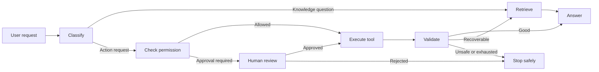

The value is not the drawing itself. The value is that the drawing corresponds to executable control logic with explicit state transitions.

A graph-based runtime is especially useful when the workflow needs one or more of the following:

- persistent state across steps or sessions;
- deterministic sequencing around nondeterministic model calls;
- branching based on policy, confidence, or tool output;
- cycles for review, revision, or corrective retrieval;
- human approval before high-impact actions;
- parallel execution of independent tasks;
- checkpointing and recovery;
- subgraphs for specialized responsibilities;
- observability at each step;
- bounded autonomy with explicit stop conditions.

> **Key idea**
>
> The model proposes or performs reasoning inside the workflow. The graph controls when that reasoning runs, what state it can read, where the result goes, and what may happen next.

---

## 2. Workflow, agent, and graph are not synonyms

Teams often use these terms interchangeably, but the distinctions matter.

| Concept | Primary characteristic | Control source | Best suited to |
|---|---|---|---|
| Deterministic workflow | Predetermined sequence | Application code | Stable business processes |
| Dynamic agent | Chooses actions at runtime | Model plus policy | Open-ended tool use |
| Stateful graph | Explicit nodes and routes with shared state | Code, model decisions, or both | Mixed deterministic and adaptive processes |
| Multi-agent graph | Multiple specialized actors coordinated by graph | Graph plus agent policies | Complex role and handoff structures |

A LangGraph application can implement any of these patterns. The framework does not require every node to call an LLM, and it does not require the workflow to be fully autonomous.

### 2.1 Fixed workflow

A known process can be encoded directly:

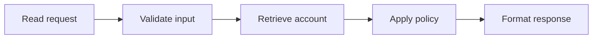

This pattern is predictable, testable, and often preferable for regulated or repetitive tasks.

### 2.2 Dynamic agent loop

An agent may choose among tools based on its current observation:

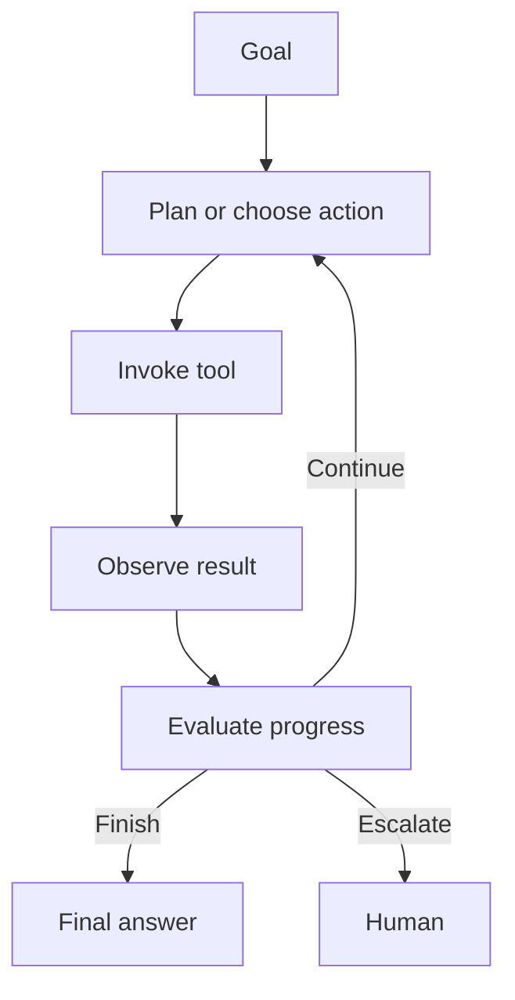

This pattern is flexible but requires budgets and progress checks.

### 2.3 Hybrid graph

Most enterprise systems should combine both approaches. Deterministic nodes enforce identity, permission, validation, and approval. Model-powered nodes handle interpretation, summarization, semantic classification, or drafting.

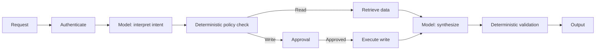

> **Best practice**
>
> Use deterministic code for invariants and obligations. Use models where semantic flexibility creates value.

---

## 3. The LangGraph mental model

**Supplementary — current framework model**

LangGraph is a low-level orchestration framework for stateful agents and workflows. Its Graph API centers on a shared state schema and executable nodes connected by edges. A graph is defined, compiled, and then invoked or streamed.

The core mental model contains five elements:

1. **State** — the structured data carried through execution.
2. **Nodes** — functions that read state and return state updates.
3. **Edges** — routes that determine which node runs next.
4. **Reducers** — rules for merging updates into state.
5. **Runtime services** — checkpointing, streaming, interrupts, stores, and execution metadata.

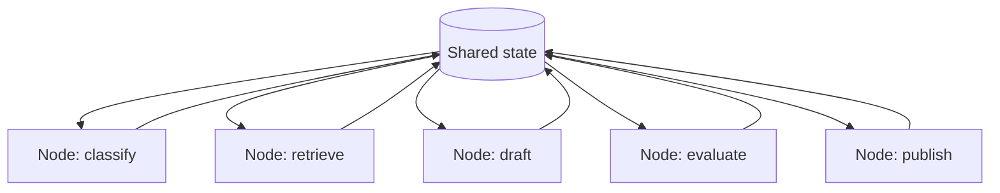

In practical Python terms, a node usually follows this conceptual contract:

```python
State -> Partial[State]
```

The node reads the current state and returns only the fields it wants to update. The runtime applies those updates according to the state's reducer behavior.

### 3.1 Graph construction lifecycle

```text
Define state schema
        ↓
Define node functions
        ↓
Add nodes to StateGraph
        ↓
Add edges and conditional routes
        ↓
Compile graph
        ↓
Invoke, stream, pause, resume, or inspect
```

Compilation is an important boundary. The builder describes the graph; the compiled graph is the executable object.

---

## 4. Designing state before designing nodes

The most important LangGraph design decision is usually the state schema, not the prompt.

An unclear state schema causes:

- duplicated fields;
- hidden dependencies between nodes;
- model output mixed with authoritative facts;
- accidental overwrites;
- difficult retries;
- fragile routing;
- untraceable policy decisions;
- private data leaking into output or streams.

### 4.1 A support-triage state

```python
from typing import Literal, TypedDict

class SupportState(TypedDict, total=False):
    ticket_id: str
    ticket_text: str
    category: Literal["account", "billing", "shipment", "other"]
    severity: Literal["low", "medium", "high", "critical"]
    customer_blocked: bool
    evidence: list[str]
    draft_response: str
    confidence: float
    attempts: int
    requires_approval: bool
    approved: bool
    status: Literal[
        "received",
        "classified",
        "retrieved",
        "drafted",
        "evaluated",
        "waiting_for_approval",
        "completed",
        "rejected",
        "failed",
    ]
```

This schema separates business facts, workflow status, evidence, and control fields.

### 4.2 Input, internal, and output schemas

A graph may need fields that should not appear in its public input or output. For example:

- internal tool traces;
- policy decision details;
- retry metadata;
- raw retrieved documents;
- private identifiers;
- evaluator notes.

A useful design distinguishes:

| Schema | Purpose | Example fields |
|---|---|---|
| Input | What the caller may provide | ticket text, request ID |
| Internal | What nodes need to coordinate | evidence, retries, policy result |
| Output | What the caller may receive | category, recommendation, final response |

Do not assume that a field called "private" is automatically hidden from all streaming modes or traces. Privacy must be enforced deliberately at the application and observability layers.

### 4.3 State should hold facts, not vague prose

Weak state:

```yaml
notes: "The customer seems upset and maybe this is urgent."
```

Stronger state:

```yaml
sentiment: frustrated
customer_blocked: true
business_impact: cannot_complete_checkout
severity: high
severity_reason: customer cannot transact
```

Structured state improves routing, evaluation, and auditing.

### 4.4 State versioning

Long-running workflows may outlive a code deployment. Include a schema or workflow version:

```yaml
workflow_schema_version: 3
policy_version: returns_policy_2026_07
prompt_version: support_draft_v12
```

A resume handler can migrate older state or reject incompatible checkpoints safely.

---

## 5. Nodes as bounded work units

A node should perform one coherent responsibility. The board's single-responsibility framing applies directly: read, verify, approve, notify, and similar operations should not be collapsed into one opaque function when they require different controls.

### 5.1 Good node properties

A production node should be:

- **bounded** — one responsibility with a clear completion condition;
- **typed** — explicit inputs and state updates;
- **idempotent where replay is possible**;
- **observable** — logs and metrics identify what happened;
- **testable** — unit tests can run without the full graph;
- **policy-aware** — permissions are checked at the correct boundary;
- **failure-classifying** — errors are normalized rather than swallowed;
- **small enough to retry safely**.

### 5.2 Deterministic nodes

Use deterministic nodes for:

- schema validation;
- permission checks;
- threshold calculations;
- record normalization;
- policy allowlists;
- status transitions;
- citation verification;
- side-effect execution;
- final output validation.

### 5.3 Model-powered nodes

Use model-powered nodes for:

- semantic intent classification;
- query rewriting;
- summarization;
- evidence synthesis;
- ambiguous entity resolution;
- natural-language drafting;
- critique against a rubric.

Even a model-powered node should return a typed result rather than arbitrary prose whenever the next route depends on it.

### 5.4 Avoid "god nodes"

A god node performs classification, retrieval, tool use, writing, and evaluation in one call. It is difficult to observe and impossible to recover from precisely.

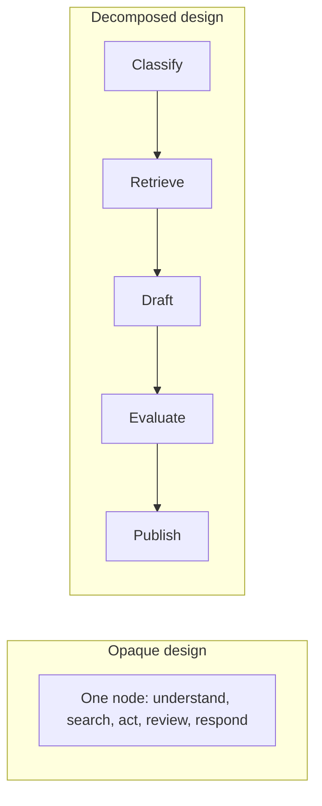

Decomposition does add coordination overhead. The goal is not maximum node count; it is useful control boundaries.

---

## 6. Edges and routing

Edges express allowed transitions. They are part of the system's policy, not just plumbing.

### 6.1 Static edges

A static edge always schedules the same next node:

```text
START -> validate -> classify -> END
```

Use static edges where the sequence is invariant.

### 6.2 Conditional edges

A conditional route chooses the next node from current state:

```python
def route_after_evaluation(state: SupportState) -> str:
    if state.get("confidence", 0.0) >= 0.85:
        return "publish"
    if state.get("attempts", 0) < 2:
        return "retrieve_again"
    return "human_review"
```

Conditional routing should be based on explicit, inspectable state. Avoid asking a model to produce a node name without validating it against an allowlist.

### 6.3 Policy routing before model routing

A model may infer what the user wants, but policy code should decide whether the requested route is permitted.

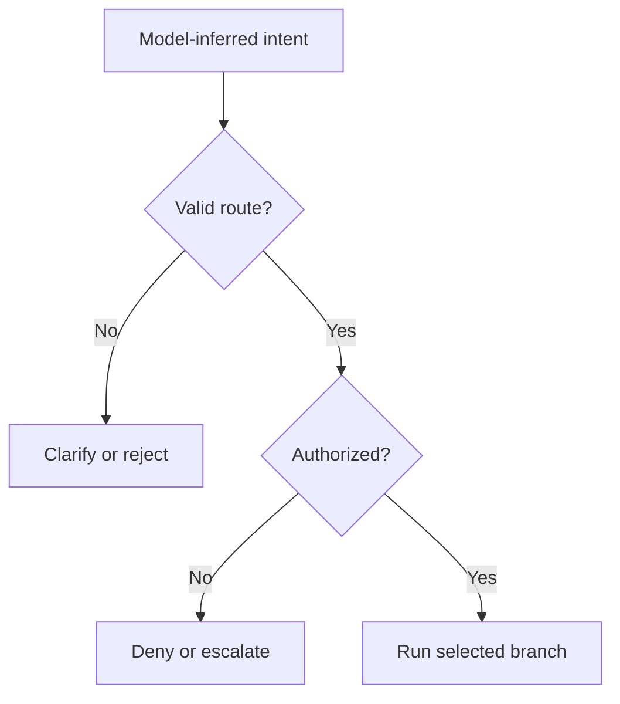

### 6.4 Route semantics are part of the API

Route labels such as `retry`, `review`, `publish`, and `stop` should have stable meanings. Treat them like an internal protocol:

- document them;
- test every route;
- reject unknown values;
- track route frequency;
- version route behavior when necessary.

---

## 7. Reducers and state merging

**Supplementary — current framework concept**

When nodes return updates, the runtime needs to know how those updates modify state. Many fields can simply be overwritten. Others require aggregation.

Consider two parallel nodes that both return evidence:

```python
{"evidence": ["ticket: blocked"]}
{"evidence": ["message: dependency delayed"]}
```

If the field uses overwrite semantics, one result may replace the other. An aggregation reducer can append both lists.

Reducer choices should match field semantics:

| Field | Typical merge behavior |
|---|---|
| `status` | overwrite |
| `attempts` | overwrite with calculated value or controlled increment |
| `messages` | append using message-aware reducer |
| `evidence` | append, deduplicate, or merge by evidence ID |
| `cost` | sum |
| `approvals` | append immutable records |
| `current_plan` | overwrite with versioned replacement |

> **Warning**
>
> Blind append reducers create unbounded state. Define retention, deduplication, and compaction rules.

### 7.1 Parallel write conflicts

If parallel nodes write the same scalar field, the result may be ambiguous or invalid. Resolve this by:

- assigning each node a separate field;
- returning records keyed by source;
- using an explicit reducer;
- adding a merge node after the parallel branch;
- prohibiting conflicting writes through tests.

---

## 8. Super-steps and execution behavior

**Supplementary — current framework concept**

LangGraph's graph execution is inspired by message-passing graph systems. At a practical level, execution proceeds in discrete super-steps. Nodes scheduled together may run in parallel, and their updates are collected before the next step proceeds.

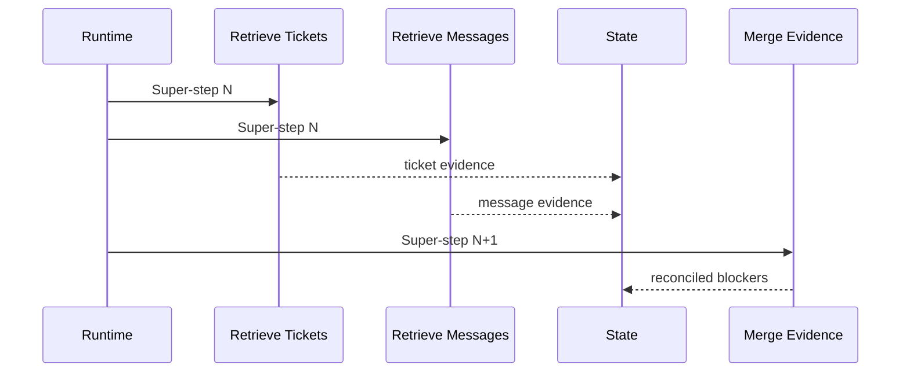

This matters for three reasons:

1. parallel nodes should not depend on one another's updates in the same super-step;
2. checkpoint boundaries align with graph execution steps rather than arbitrary lines inside node code;
3. replay and recovery behavior must be considered when a node fails.

### 8.1 Parallelize only independent work

Good candidates:

- order lookup and policy retrieval;
- Jira search and Slack search;
- price retrieval and quality-score retrieval;
- independent document sources.

Poor candidates:

- operations where the second requires the first node's result;
- multiple writes to the same external record;
- steps sharing a non-thread-safe client;
- tasks with strict ordering or transaction requirements.

---

## 9. Cycles, reflection, and termination

Cycles are a major reason to use a graph runtime. They also create one of the greatest operational risks.

A useful review cycle may look like:

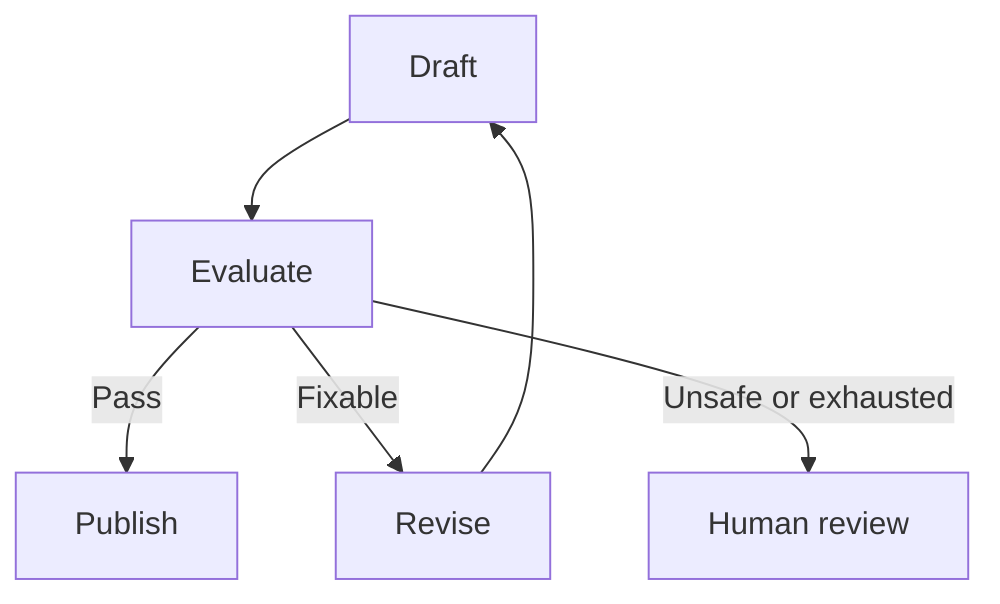

### 9.1 Every cycle needs a budget

Define at least one hard limit:

- maximum iterations;
- maximum model calls;
- maximum tool calls;
- maximum elapsed time;
- maximum cost;
- maximum repeated action signature;
- minimum progress per cycle.

Example state:

```yaml
iteration: 2
max_iterations: 3
last_action_signature: retrieve:policy:return_window
repeated_action_count: 1
new_evidence_count: 2
```

### 9.2 Progress checks

A loop should continue only when it changes something material:

- new evidence was added;
- a requirement was satisfied;
- uncertainty decreased;
- the plan changed;
- a recoverable error was resolved;
- a reviewer identified a specific actionable defect.

Do not allow a model to keep producing differently worded critiques without changing state.

### 9.3 Runtime recursion limits are not business completion rules

A runtime limit can stop runaway execution, but the workflow should still encode domain-specific termination. "The graph did not exceed its recursion limit" is not evidence that the task succeeded.

---

## 10. Persistence, checkpoints, and threads

**Supplementary — current framework capability**

Checkpointing allows the graph to preserve state and resume later. LangGraph distinguishes thread-scoped graph checkpoints from application-defined long-term stores.

| Persistence mechanism | Scope | Typical use |
|---|---|---|
| Checkpointer | One execution thread | resume, short-term memory, human approval, recovery |
| Store | Across threads or sessions | user preferences, durable facts, shared application memory |

### 10.1 Thread identity

A thread ID identifies a continuing execution context. Reusing the same thread ID resumes or continues that thread; a different ID starts a separate context.

Treat the thread ID as a security-sensitive namespace key:

- derive it from authenticated context;
- prevent users from guessing another user's thread;
- include tenant boundaries;
- log access;
- apply retention rules;
- avoid exposing raw internal IDs unnecessarily.

### 10.2 Checkpoint boundaries

Checkpoints are saved at graph execution boundaries. A node interrupted or retried may execute again from the start of the function. Therefore:

- code before an interrupt must be safe to repeat;
- side effects should be idempotent;
- writes should use idempotency keys;
- external outcomes should be reconciled after ambiguous failures;
- checkpoint and business transaction boundaries should be designed together.

### 10.3 Testing versus production persistence

An in-memory checkpointer is useful for local examples and tests. It is not durable across process restarts and should not be treated as production storage. Production systems need a durable backend, backup strategy, access control, data lifecycle policy, and operational monitoring.

### 10.4 Recovery model

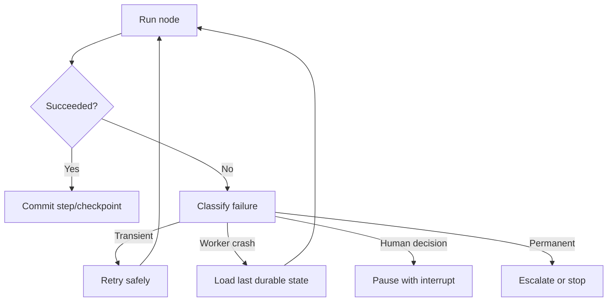

---

## 11. Human-in-the-loop with interrupts

**Supplementary — current framework capability**

An interrupt pauses graph execution, exposes a JSON-serializable payload to the caller, and waits for external input. The graph resumes when the caller invokes the same thread with a resume command.

Appropriate interrupt points include:

- sending an external email;
- updating a customer record;
- executing SQL that changes data;
- approving a refund;
- publishing content;
- accepting a low-confidence result;
- resolving conflicting evidence;
- collecting missing user input.

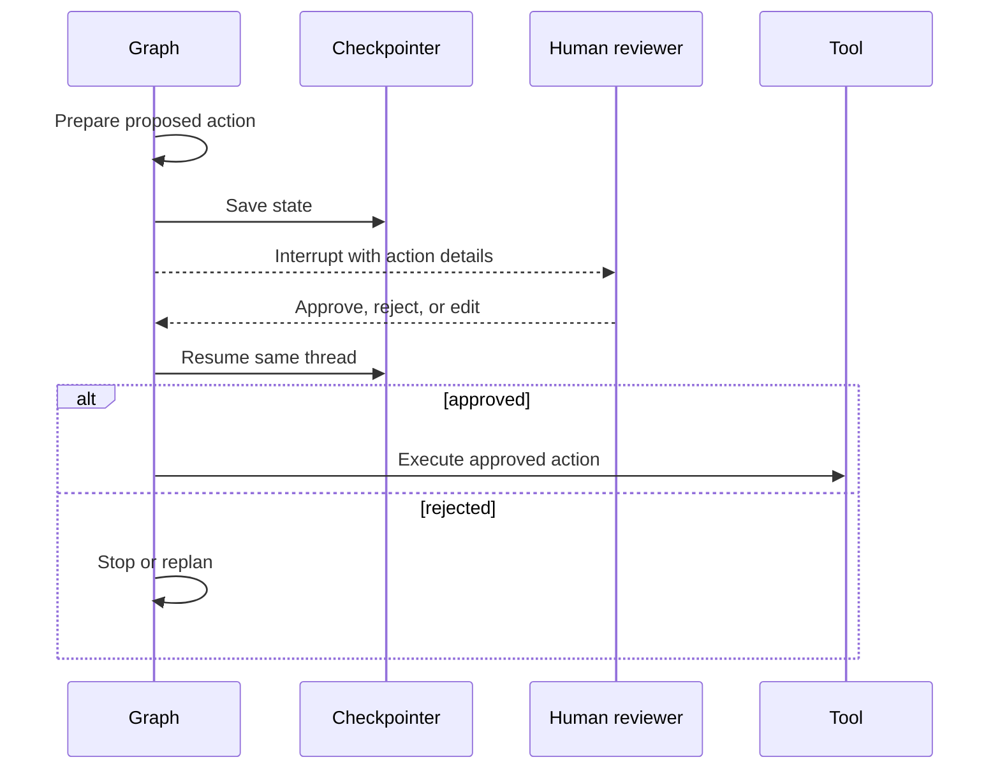

### 11.1 Approval must bind to the exact action

An approval record should include:

- tool name;
- normalized arguments;
- resource identifiers;
- risk level;
- proposed side effect;
- policy version;
- requester;
- approver;
- timestamp;
- expiration;
- cryptographic or stable hash of the action payload.

If arguments change after approval, require a new approval.

### 11.2 Interrupt-safe node design

A node containing an interrupt may start again when resumed. Keep side effects after the approval point, or isolate them in a separate node.

Safer pattern:

```text
prepare action -> interrupt for approval -> execute action node -> confirmation read
```

Riskier pattern:

```text
perform partial write -> interrupt -> continue write
```

---

## 12. Commands, dynamic control, and map-reduce

**Supplementary — current framework concepts**

LangGraph provides control primitives for advanced routing. Two useful patterns are:

- combining state updates with navigation decisions;
- dispatching multiple workers for map-reduce style processing.

### 12.1 Dynamic navigation

A node may need to both update state and decide where execution goes next. Keep this logic explicit and constrain destinations.

Example use cases:

- route a policy result directly to deny, approve, or review;
- update failure state and jump to fallback;
- send a completed subtask back to a parent coordinator.

### 12.2 Map-reduce

A map-reduce graph can fan out independent work and then combine results.

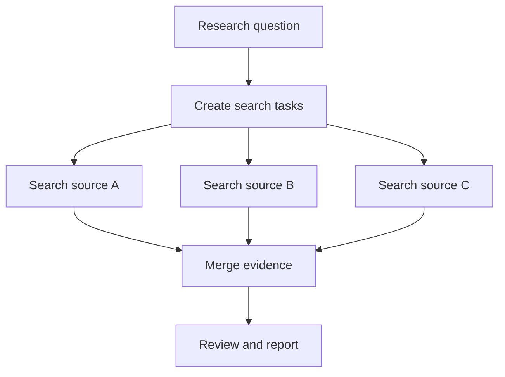

Use map-reduce for document batches, competitor lists, ticket clusters, or independent source checks. Define:

- maximum fan-out;
- per-worker timeout;
- merge semantics;
- partial failure policy;
- duplicate suppression;
- final evidence coverage criteria.

---

## 13. Subgraphs and modular architecture

Subgraphs package a coherent workflow inside a larger graph. They provide a useful boundary for:

- specialized agents;
- reusable business processes;
- separate state namespaces;
- different persistence strategies;
- independent testing;
- team ownership;
- security and permission boundaries.

Example:

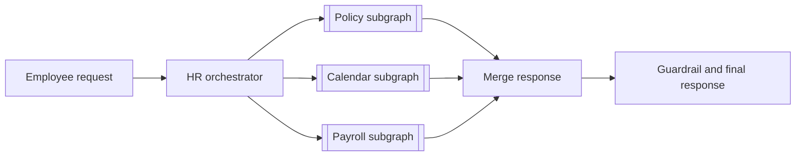

### 13.1 Subgraph boundaries should reflect responsibility

Good boundaries:

- policy question resolution;
- calendar availability;
- payroll read-only lookup;
- document retrieval;
- report review;
- approval workflow.

Weak boundaries:

- arbitrary groups of three nodes;
- subgraphs with shared mutable globals;
- subgraphs that bypass parent policy checks;
- subgraphs exposing all internal state to callers.

### 13.2 Multi-agent does not require multiple frameworks

A graph can coordinate multiple model personas, tools, or specialized nodes. The architecture becomes multi-agent when actors have meaningful responsibility, context, or tool boundaries—not merely because several model calls occur.

---

## 14. Streaming and user experience

**Supplementary — current framework capability**

Long workflows need progress feedback. Streaming can expose:

- node-level updates;
- state changes;
- generated tokens;
- custom progress events;
- tool execution status;
- interrupt requests.

A useful UI might show:

```text
✓ Request classified
✓ Account retrieved
✓ Policy checked
… Waiting for manager approval
```

Avoid streaming:

- secrets;
- raw chain-of-thought;
- private internal state;
- full retrieved documents without authorization;
- unvalidated model output presented as final;
- sensitive tool arguments.

> **UX principle**
>
> Stream operational progress and evidence status, not unrestricted internal reasoning.

### 14.1 Progressive disclosure

Expose different detail levels:

1. user summary;
2. source and action history;
3. administrator trace;
4. secure debugging details.

This aligns transparency with role and authorization.

---

## 15. Reliability and idempotency

A graph can replay nodes after interruption or failure. Side-effect safety must be designed explicitly.

### 15.1 Idempotency key

For a write action, derive a stable key from:

```text
workflow ID + action type + normalized arguments + action version
```

The external tool adapter should check whether the action already succeeded before repeating it.

### 15.2 Separate preparation from execution

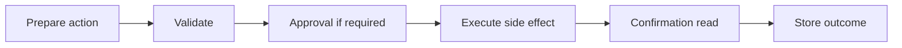

This design allows preparation and validation to replay without repeating the side effect.

### 15.3 Error taxonomy

Normalize errors into stable classes:

| Failure class | Typical graph response |
|---|---|
| Invalid input | clarify or stop |
| Authentication | request re-login |
| Authorization | deny or escalate |
| Transient infrastructure | bounded retry |
| Rate limit | backoff or alternate route |
| Missing evidence | retrieve or ask user |
| Policy conflict | human review |
| Ambiguous write outcome | confirmation read |
| No progress | stop or escalate |
| Unknown | safe failure and audit |

Do not let every exception route to the same generic retry loop.

---

## 16. Observability and evaluation

A graph provides natural observability boundaries because each node and route is explicit.

Record at minimum:

- workflow and thread ID;
- graph and schema version;
- node name;
- route chosen;
- start and end time;
- input and output references;
- model and prompt version;
- tool calls;
- retry count;
- checkpoint position;
- interrupt and approval records;
- token, latency, and cost data;
- final status;
- failure class.

### 16.1 Graph-level metrics

| Metric | What it reveals |
|---|---|
| Completion rate | Overall reliability |
| Node failure rate | Weak components |
| Route distribution | Real workload patterns |
| Average loop count | Rework and planning quality |
| Human-review rate | Autonomy and risk balance |
| Resume success rate | Persistence reliability |
| Time per node | Latency bottlenecks |
| Tool calls per task | Efficiency |
| Cost per completed task | Economic viability |
| No-progress termination rate | Loop-control quality |

### 16.2 Evaluate trajectories, not only final text

A correct final answer can still come from an unsafe or wasteful path. Evaluate:

- whether the graph chose the correct route;
- whether tools were appropriate;
- whether authorization preceded access;
- whether evidence was sufficient;
- whether retries changed a material variable;
- whether approval was required and respected;
- whether the workflow stopped correctly;
- whether the final result remained grounded.

---

## 17. Production reference architecture

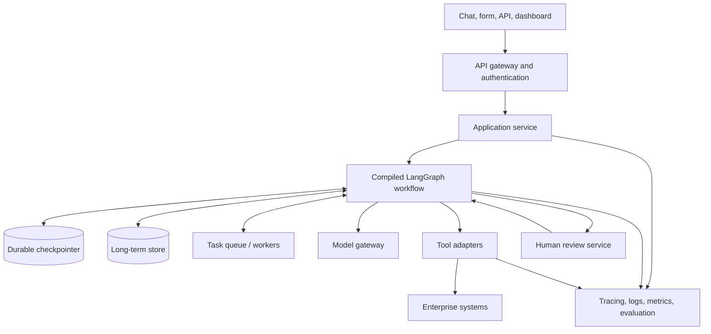

### 17.1 Runtime concerns

A production deployment must address:

- durable state storage;
- worker concurrency;
- timeout and retry policy;
- checkpoint retention;
- schema migration;
- tenant isolation;
- secrets management;
- model and tool rate limits;
- queue backpressure;
- deployment rollback;
- trace redaction;
- disaster recovery;
- cost controls;
- human-review availability.

### 17.2 Graph versioning

Changing edges or state semantics can invalidate existing checkpoints. Store graph version in state and define a policy:

- finish old threads on old version;
- migrate supported checkpoints;
- cancel incompatible runs safely;
- route new runs to the new version;
- retain audit access to historical versions.

---

## 18. Worked example: support triage with bounded review

The board includes a support-triage prompt that classifies tickets, detects severity, checks whether the customer is blocked, decides priority, and recommends escalation. A graph turns that prompt into an inspectable workflow.

### 18.1 Requirements

The workflow must:

1. accept a ticket;
2. classify the product area;
3. retrieve relevant knowledge;
4. draft a recommendation;
5. evaluate evidence and confidence;
6. retry retrieval at most once;
7. require human approval for critical escalation;
8. publish a structured result;
9. stop safely if approval is rejected.

### 18.2 Graph

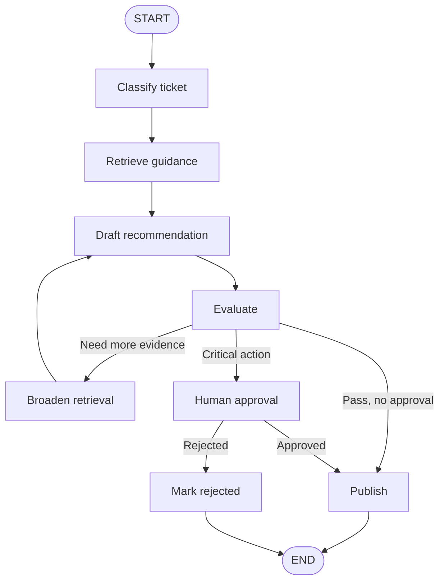

### 18.3 State transitions

| Node | Reads | Writes |
|---|---|---|
| Classify | ticket text | category, severity, blocked, status |
| Retrieve | category, severity | evidence, attempts, status |
| Draft | ticket, evidence | draft response, approval requirement |
| Evaluate | evidence, draft, attempts | confidence, status |
| Human approval | proposed action | approved, status |
| Publish | all validated fields | final response, completed status |

### 18.4 Why the graph is preferable to one prompt

- retrieval retry is bounded;
- critical escalation is separately approved;
- evidence is visible;
- every route can be tested;
- a paused review can resume later;
- the execution trace shows why the result was produced;
- model behavior does not control authorization.

---

## 19. Runnable LangGraph example

The companion file is located at:

```text
examples/15-langgraph/langgraph_support_workflow.py
```

Install the framework:

```bash
python -m pip install langgraph
```

Run the example:

```bash
python examples/15-langgraph/langgraph_support_workflow.py
```

The example intentionally uses deterministic Python functions instead of an external LLM so learners can focus on graph construction, conditional routing, checkpointing, and interrupts. It demonstrates:

- a typed state;
- static and conditional edges;
- a bounded retrieval loop;
- an in-memory test checkpointer;
- a thread ID;
- human approval using an interrupt;
- resume with a command;
- safe completion and rejection paths.

> **Important**
>
> The in-memory checkpointer is for demonstration and testing. Use a durable, access-controlled checkpointer for production.

---

## 20. Testing strategy

Test nodes, routes, and complete trajectories separately.

### 20.1 Node unit tests

For every node, test:

- expected input;
- missing optional fields;
- invalid data;
- boundary thresholds;
- normalized error output;
- idempotent replay;
- no unauthorized side effect.

### 20.2 Route tests

Create a table of state conditions and expected destinations:

| Condition | Expected route |
|---|---|
| Confidence 0.93, noncritical | publish |
| Confidence 0.55, attempts 0 | broaden retrieval |
| Confidence 0.55, attempts exhausted | human review |
| Critical severity | human review |
| Approval false | reject |

### 20.3 Trajectory tests

Test representative paths:

```text
happy path
low evidence -> retry -> success
critical -> interrupt -> approve -> publish
critical -> interrupt -> reject -> stop
tool failure -> bounded retry -> fallback
no progress -> escalation
```

### 20.4 Persistence tests

Verify that:

- state survives process or worker restart with the selected backend;
- resuming uses the correct thread;
- duplicate resume requests do not duplicate side effects;
- old checkpoints are handled after deployment;
- unauthorized callers cannot inspect another thread.

---

## 21. Common mistakes

### 21.1 Starting with prompts instead of state

The graph becomes a set of opaque model calls with hidden dependencies.

**Correction:** define state, transitions, and completion criteria first.

### 21.2 Putting the entire workflow in one node

There is no useful recovery or observability boundary.

**Correction:** split at policy, tool, approval, and evaluation boundaries.

### 21.3 Unbounded cycles

The workflow repeatedly critiques or delegates without progress.

**Correction:** add iteration, cost, time, and no-progress budgets.

### 21.4 Side effects before interrupts

A resumed node repeats a write.

**Correction:** isolate side effects after approval and use idempotency keys.

### 21.5 Treating checkpointing as a database transaction

A graph checkpoint does not automatically make external systems atomic.

**Correction:** design confirmation reads, compensation, and reconciliation.

### 21.6 Allowing model-generated arbitrary routes

The model invents a destination or bypasses policy.

**Correction:** validate routes against a finite allowlist and apply authorization separately.

### 21.7 Parallel nodes writing the same field

Updates conflict or overwrite unexpectedly.

**Correction:** use reducers, separate channels, or a merge node.

### 21.8 Persisting everything

State becomes expensive, sensitive, and difficult to migrate.

**Correction:** store references, compact history, apply TTLs, and separate audit storage.

### 21.9 Using in-memory persistence in production

A process restart loses workflow state.

**Correction:** use a durable backend and test recovery.

### 21.10 Calling verbose logs observability

Logs exist, but the team cannot answer why a route was selected or where latency occurs.

**Correction:** add structured traces, node metrics, route metrics, failure classes, and evidence references.

---

## 22. Architecture decision guide

Use LangGraph when most of these are true:

- workflow state matters across multiple steps;
- branches and loops are explicit business requirements;
- human approval must pause and resume execution;
- tool calls require deterministic control;
- long-running work needs recovery;
- multiple specialists or subgraphs must coordinate;
- traceability matters;
- the team wants a low-level orchestration runtime rather than only a prebuilt agent.

A simpler function, queue consumer, or conventional workflow engine may be better when:

- the process is fully deterministic and does not use model reasoning;
- a single model call is sufficient;
- no persistent state or pause/resume behavior is needed;
- the organization already has a workflow platform that satisfies all control requirements;
- the graph would add abstraction without meaningful recovery or routing value.

> **Principle from the board**
>
> Use the simplest architecture that can reliably solve the task.

---

## 23. Hands-on lab: project blocker workflow

Build a graph for the board's project-coordination scenario.

### 23.1 Goal

Answer:

> What are the top blockers in the sprint, who owns them, what is the impact, and what should happen next?

### 23.2 Required nodes

1. `identify_sprint`
2. `fetch_tickets`
3. `fetch_team_messages`
4. `fetch_meeting_notes`
5. `merge_evidence`
6. `identify_blockers`
7. `review_completeness`
8. `request_human_input`
9. `format_report`

### 23.3 Required state

```yaml
request_id:
sprint_id:
tickets: []
messages: []
meeting_notes: []
blockers: []
missing_sources: []
confidence:
review_status:
iteration:
max_iterations: 2
final_report:
```

### 23.4 Required routes

- run independent retrieval nodes in parallel;
- continue with partial evidence if a source is unavailable;
- list unavailable sources explicitly;
- retry only transient failures;
- interrupt if blocker ownership is ambiguous and business impact is high;
- stop after two review cycles;
- return a table containing blocker, owner, source, impact, and next action.

### 23.5 Acceptance criteria

- no source is invented;
- missing systems are named;
- each blocker has evidence references;
- the graph terminates under every test case;
- a resumed approval does not rerun external writes;
- unauthorized project data is not loaded into state.

---

## 24. Knowledge check

1. Why is a typed state schema more reliable than a growing conversation transcript?
2. What is the difference between a static edge and a conditional edge?
3. Which fields usually need reducers rather than overwrite behavior?
4. Why can parallel nodes not assume that they see one another's same-step updates?
5. What risks arise when a cycle has no business termination condition?
6. How do checkpointers differ from long-term stores?
7. Why must code before an interrupt be safe to repeat?
8. Why should approval bind to exact tool arguments?
9. When should a node be deterministic rather than model-powered?
10. What should be evaluated in addition to the final answer?
11. Why are subgraphs useful as security and ownership boundaries?
12. What is the difference between runtime recursion protection and task completion?

---

## 25. Interview questions

### Beginner

1. What problem does LangGraph solve?
2. What are state, nodes, and edges?
3. Why must a graph be compiled before execution?
4. What is a conditional edge?
5. What is a thread ID used for?

### Intermediate

6. How would you model a retry loop without creating infinite execution?
7. How would you merge outputs from parallel retrieval nodes?
8. What is the difference between checkpointed short-term state and long-term memory?
9. How would you implement human approval for a write tool?
10. How would you prevent a resumed node from duplicating a side effect?
11. When would you use a subgraph?
12. How would you test conditional routing?

### Senior

13. Design a multi-tenant persistence strategy for long-running graphs.
14. How would you migrate checkpointed state after a schema change?
15. How would you separate policy enforcement from model-driven routing?
16. Design observability for a graph with parallel nodes and review loops.
17. How would you reconcile a timed-out external write whose result is unknown?
18. How would you design backpressure and concurrency limits for graph workers?
19. What data would you redact from traces and streamed state?
20. When would a conventional workflow engine be preferable to LangGraph?

### System design

21. Design an HR assistant with policy, calendar, and payroll subgraphs, read/write permission separation, approval for sensitive actions, durable pause/resume, and an auditable final response.
22. Design a competitive-research graph with parallel search, evidence deduplication, analyst synthesis, reviewer critique, a maximum of two revision loops, and human escalation for conflicting claims.
23. Design a return-eligibility agent that checks order data, policy, warranty, shipping, and compliance in parallel where possible, then binds any refund action to a human approval.

---

## 26. Chapter summary

- LangGraph represents stateful workflows as nodes connected by explicit routes.
- It supports fixed workflows, dynamic agent loops, and hybrid architectures.
- State design is the foundation of a reliable graph.
- Nodes should be bounded, typed, observable, and safe to replay.
- Edges encode permitted transitions; conditional routes should be finite and validated.
- Reducers define how state updates are merged, especially for parallel or repeated execution.
- Cycles enable review and correction but require strict budgets and progress checks.
- Checkpointers preserve thread-scoped graph state; stores hold application-defined long-term data.
- Interrupts enable durable human-in-the-loop review and must be paired with idempotent node design.
- Subgraphs create reusable responsibility, security, and ownership boundaries.
- Streaming should expose useful progress without leaking internal or sensitive state.
- Final-answer quality is not enough; route choice, tool use, policy compliance, cost, and trajectory also require evaluation.
- The simplest reliable architecture remains the right default.

---

## 27. Further reading

**Official LangGraph resources:**

- [LangGraph overview](https://docs.langchain.com/oss/python/langgraph/overview)
- [Graph API](https://docs.langchain.com/oss/python/langgraph/graph-api)
- [Using the Graph API](https://docs.langchain.com/oss/python/langgraph/use-graph-api)
- [Persistence](https://docs.langchain.com/oss/python/langgraph/persistence)
- [Memory](https://docs.langchain.com/oss/python/langgraph/add-memory)
- [Interrupts](https://docs.langchain.com/oss/python/langgraph/interrupts)
- [LangGraph GitHub repository](https://github.com/langchain-ai/langgraph)

APIs and package behavior evolve. Validate code against the installed version and its official documentation before production deployment.

---

## 28. Source map

| Handbook topic | Board material |
|---|---|
| Framework positioning | Framework overview and comparison [Board, pp. 12-14] |
| Nodes, edges, guards, state, cycles | LangGraph workflow diagrams and foundations [Board, framework section] |
| Stateful workflow and orchestration | Orchestration flow and state references [Board, pp. 15-17, 30-35] |
| Loops and failure recovery | Failure-loop and reflection diagrams [Board, pp. 21-22, 35] |
| Human controls | Interrupt, reset, and abort [Board, pp. 24-26] |
| Support and project examples | Support triage and project coordination prompts [Board, pp. 1-4] |
| Persistent state benefits | Continuity, collaboration, recovery, auditability [Board, pp. 30-32] |
| Current LangGraph APIs and runtime behavior | Supplementary material from official LangGraph documentation |
