# Chapter 16 - CrewAI and Role-Based Multi-Agent Systems

> **Source basis:** The board presents CrewAI as a role-based collaboration framework in which specialized agents act like members of a project team. Its examples include researcher-writer-reviewer crews, manager-worker coordination, competitive research, and specialist teams [Board, pp. 12-14, 20-21]. This chapter preserves that framing and expands it into a production engineering guide. Sections that describe current CrewAI APIs, Flows, persistence, or implementation practices are marked **Supplementary** and are based on the official CrewAI documentation available when this chapter was written.

---

## Learning objectives

By the end of this chapter, you should be able to:

1. Explain the role-based mental model behind CrewAI.
2. Distinguish agents, tasks, crews, processes, and flows.
3. Decide when a multi-agent crew is justified and when a single agent is better.
4. Define non-overlapping agent roles, measurable goals, and useful backstories.
5. Design tasks with explicit descriptions, expected outputs, context, tools, and output contracts.
6. Compare sequential and hierarchical crew processes.
7. Understand delegation, manager agents, and validation responsibilities.
8. Use structured outputs and guardrails to make handoffs reliable.
9. Separate crew collaboration from deterministic application orchestration.
10. Explain why CrewAI recommends a flow-first production architecture.
11. Design state, routing, persistence, and human approval around crews.
12. Control tool permissions, memory scope, retries, cost, and concurrency.
13. Evaluate both individual agent contributions and the end-to-end crew outcome.
14. Recognize common multi-agent failure modes such as role overlap, unnecessary debate, and delegation loops.
15. Implement a competitive-research crew with typed output and validation.

---

## 1. Why role-based multi-agent systems exist

A single agent can often research, analyze, draft, and review. That does not mean it should always do all four. Complex tasks may benefit from explicit specialization because each stage has a different objective, tool set, evidence requirement, or quality bar.

The board uses the analogy of a project team:

```text
Manager
  -> Researcher
  -> Analyst
  -> Writer
  -> Reviewer
  -> Final report
```

CrewAI turns that organizational metaphor into a software abstraction. An agent is configured as a specialist. A task describes a bounded assignment. A crew coordinates specialists according to a process.

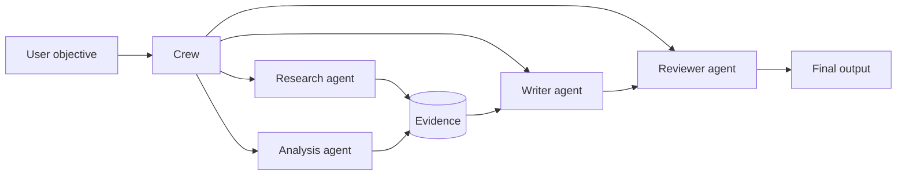

Specialization can improve a system when:

- different stages require different tools;
- permissions must be separated;
- the work naturally follows professional roles;
- intermediate outputs need explicit review;
- one model prompt would become too broad or contradictory;
- traceability by responsibility matters;
- parallel work can reduce latency;
- distinct models should be used for distinct stages.

Specialization can also make a system worse. Every extra agent adds prompts, calls, state, coordination, latency, cost, and new failure paths. Multi-agent design is therefore an architecture decision, not a sophistication badge.

> **Core principle**
>
> Add an agent only when its responsibility, tools, permissions, or evaluation criteria are meaningfully different from those of the existing agents.

---

## 2. The CrewAI mental model

The framework's core concepts can be understood through a team analogy.

| CrewAI concept | Team analogy | Engineering responsibility |
|---|---|---|
| Agent | Specialist team member | Performs reasoning or actions within a role |
| Task | Assignment or work item | Defines the work, context, and completion contract |
| Crew | Project team | Groups agents and tasks into one collaborative unit |
| Process | Operating model | Determines execution order and delegation strategy |
| Tool | Authorized capability | Connects an agent to APIs, data, search, or computation |
| Memory or knowledge | Shared or retained context | Supplies past or domain information |
| Flow | Application workflow | Controls state, routing, branches, and crew invocation |

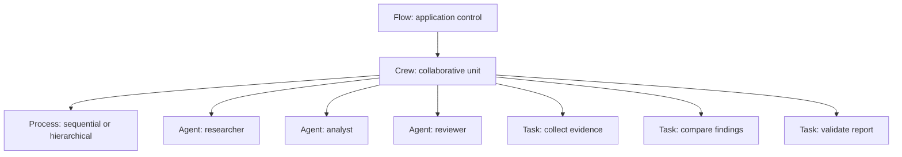

The distinctions matter:

- An **agent** is not a workflow.
- A **task** is not merely a prompt; it also defines completion expectations and may define output structure, context, tools, or human review.
- A **crew** is not the entire application; in production it is often one bounded unit inside a larger flow.
- A **process** controls how a crew assigns or sequences tasks.
- A **flow** provides deterministic event-driven orchestration around agents and crews.

---

## 3. Agents: roles are contracts, not costumes

The board emphasizes roles, goals, tools, permissions, and memory. A role should narrow an agent's responsibility, not simply decorate the system prompt.

A useful agent definition answers six questions:

1. What single responsibility does this agent own?
2. What outcome is it trying to produce?
3. What information may it use?
4. Which tools may it call?
5. Which actions are forbidden or approval-gated?
6. How will its work be evaluated?

### 3.1 Role

The role names the specialist function.

Weak:

```text
AI Expert
```

Better:

```text
Competitive Pricing Analyst
```

The second role implies a domain, a kind of evidence, and a narrower output.

### 3.2 Goal

A goal should describe measurable task success.

Weak:

```text
Do excellent analysis.
```

Better:

```text
Compare competitor pricing using cited evidence, identify material differences, and explicitly mark missing or stale data.
```

### 3.3 Backstory

In CrewAI, backstory is part of agent configuration. It can provide useful domain framing, but it should not be treated as a substitute for tools, data, permissions, or explicit task instructions.

Good backstory:

```text
You specialize in B2B SaaS pricing research. You distinguish list price,
contract price, promotional price, and inferred price. You never present
an inferred value as a verified fact.
```

Bad backstory:

```text
You are the world's greatest analyst and always know the answer.
```

The bad version encourages overconfidence without adding operational guidance.

### 3.4 Tools

Tools should match the role. A research agent may need search and document retrieval. A writer may need no external tools. A reviewer may need citation lookup but not write access.

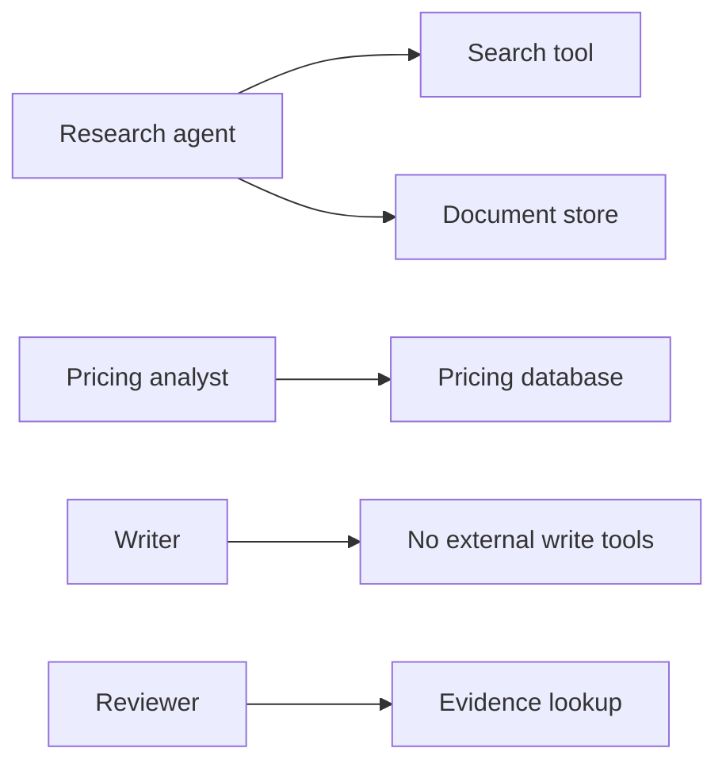

> **Least privilege**
>
> Do not give every agent every tool. Tool access should follow responsibility and risk.

### 3.5 Delegation

Delegation lets an agent assign work to another agent when the process permits it. It is useful only when responsibility boundaries are clear. Uncontrolled delegation can create loops, duplicate effort, and unclear ownership.

A delegation policy should specify:

- who may delegate;
- which roles may receive delegated work;
- what information is passed;
- how many handoffs are allowed;
- who owns the final decision;
- what happens when agents disagree.

---

## 4. Designing agents with single responsibility

The board repeatedly uses specialist roles such as researcher, analyst, writer, reviewer, policy agent, calendar agent, and payroll agent. These work because the responsibilities are legible.

A practical test is:

> What is the one job this agent should perform exceptionally well?

If the answer contains several unrelated verbs, the role may be too broad.

### 4.1 Overloaded agent

```text
Research competitors, analyze pricing, write the executive report,
validate every claim, and email leadership.
```

This combines evidence collection, judgment, communication, compliance, and an external side effect.

### 4.2 Decomposed team

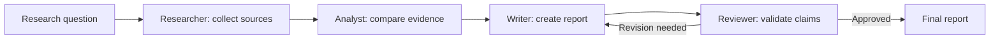

The decomposition provides:

- clearer prompts;
- narrower tools;
- better intermediate evaluation;
- easier replacement of one stage;
- explicit ownership;
- more informative traces.

It also creates more calls and a review loop, so the quality benefit must justify the complexity.

---

## 5. Tasks: the real unit of work

**Supplementary — current framework model**

A CrewAI `Task` represents a specific assignment completed by an agent. Current task configuration can include a description, expected output, responsible agent, tools, context from other tasks, asynchronous execution, human input, output files, structured output models, callbacks, and guardrails.

A robust task contains at least:

- a clear action;
- the relevant scope;
- evidence expectations;
- explicit constraints;
- a completion contract;
- a machine-usable output format when another step consumes it.

### 5.1 Weak task

```text
Research our competitors.
```

### 5.2 Strong task

```text
For each competitor in {competitors}, collect the current public list price,
plan names, billing period, included usage, source URL, and source date.
Do not infer unavailable prices. Mark unavailable fields as unknown.
Return one structured record per competitor.
```

Expected output:

```text
A validated list of competitor pricing records with citations, collection dates,
and an explicit confidence label for each field.
```

### 5.3 Description and expected output serve different purposes

The task description explains what to do. The expected output explains what completion looks like.

| Field | Main question |
|---|---|
| Description | What work must be performed? |
| Expected output | What artifact proves the work is complete? |

A vague expected output such as "a good report" weakens both generation and evaluation.

### 5.4 Task context

Task context connects outputs deliberately. A writer should receive the research and analysis tasks, not an uncontrolled transcript of every agent action.

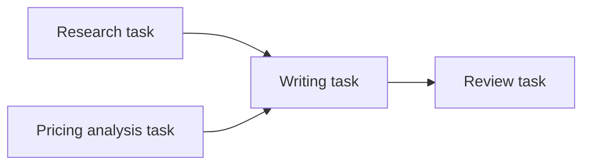

This explicit dependency is preferable to assuming that all agents automatically share every detail.

### 5.5 Structured outputs

When downstream code depends on the result, natural-language output should be replaced or supplemented with a schema.

```python
from pydantic import BaseModel, Field

class CompetitorFinding(BaseModel):
    competitor: str
    feature_summary: list[str]
    pricing_summary: str
    sources: list[str]
    confidence: str = Field(pattern="^(low|medium|high)$")
```

A structured contract improves:

- validation;
- parsing;
- retries;
- downstream routing;
- testability;
- user-interface rendering.

### 5.6 Guardrails

Current CrewAI tasks can use function-based or model-based guardrails. A deterministic guardrail is best for objective requirements such as schema validity, required fields, word count, source presence, or prohibited values. Model-based guardrails may be useful for subjective criteria, but they should not replace deterministic policy checks.

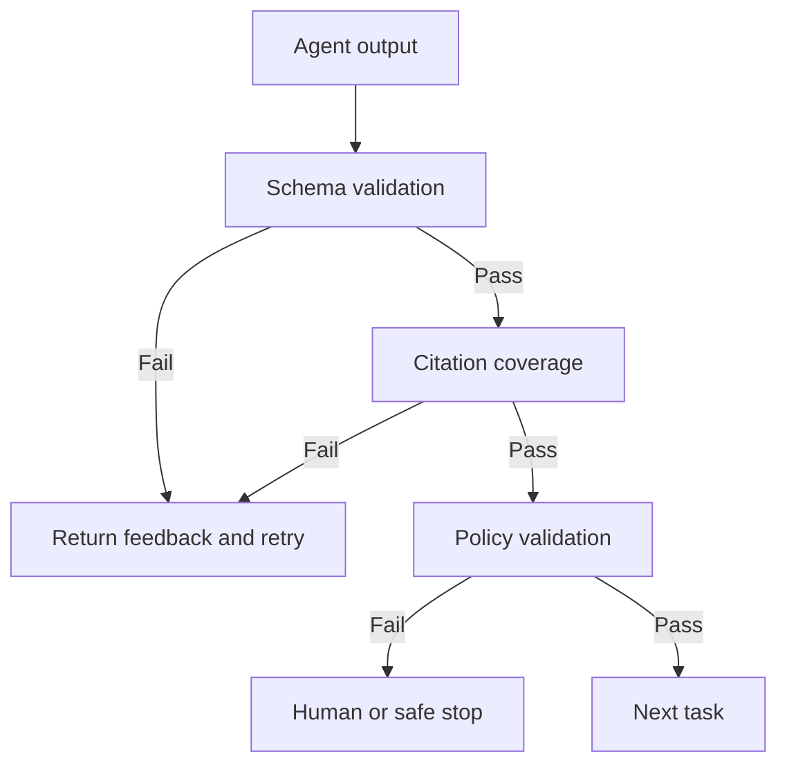

Guardrail retries must be bounded. A guardrail that repeatedly sends vague feedback can create expensive loops without improving quality.

---

## 6. Crews: collaborative units with a bounded goal

**Supplementary — current framework model**

A `Crew` groups agents and tasks and selects an execution process. Crew-level configuration may also include memory, caching, rate limits, callbacks, planning, knowledge sources, logging, streaming, and a manager model or manager agent for hierarchical execution.

A well-designed crew should have one coherent business goal.

Good crew scope:

```text
Produce a cited competitive pricing report for one product category.
```

Overly broad crew scope:

```text
Research the market, design the product, approve legal language,
launch the campaign, update CRM, and email all customers.
```

The broad scope crosses multiple risk, data, and ownership boundaries. It should usually be separated into crews or deterministic services coordinated by a flow.

### 6.1 Crew input and output boundaries

Treat a crew as a callable subsystem:

```text
Typed input
  -> crew execution
  -> typed result
```

The application should know:

- required inputs;
- permitted data scope;
- possible outputs;
- expected latency and cost;
- retry behavior;
- side effects;
- failure states.

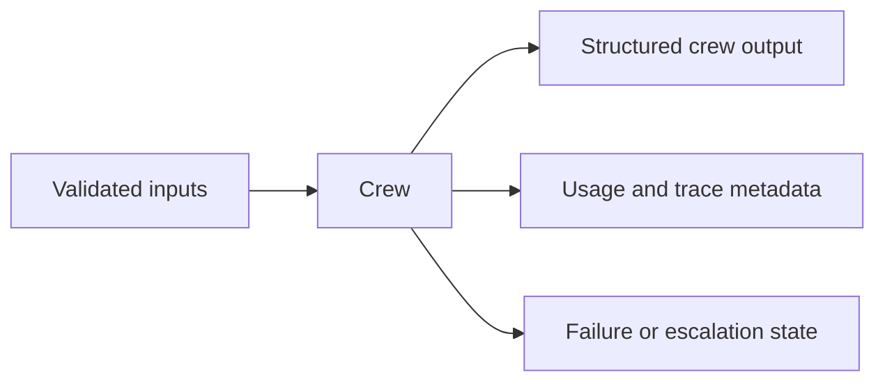

This boundary makes the crew easier to test and embed in a production flow.

---

## 7. Sequential process

In a sequential process, tasks execute in the defined order. The output of one task can become context for the next, either implicitly through ordering or explicitly through task context.

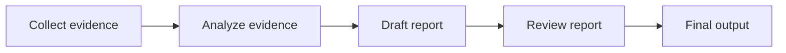

Sequential execution is appropriate when:

- the workflow order is known;
- each stage depends on earlier outputs;
- responsibility is explicitly assigned;
- deterministic handoffs are valuable;
- the team wants predictable traces;
- dynamic delegation is unnecessary.

Advantages:

- easier to reason about;
- easier to test;
- lower coordination uncertainty;
- clear intermediate artifacts;
- simpler cost estimation.

Limitations:

- can be slower than parallel execution;
- may force a fixed order when work is independent;
- weak early output can contaminate every later stage;
- a long chain may accumulate context and formatting errors.

> **Default recommendation**
>
> Start with a sequential crew. Move to hierarchical delegation only when the manager behavior solves a real allocation problem.

---

## 8. Hierarchical process

In a hierarchical process, a manager coordinates the work. Current CrewAI documentation requires a manager language model or a custom manager agent. The manager plans, delegates, validates, and determines whether task completion is sufficient.

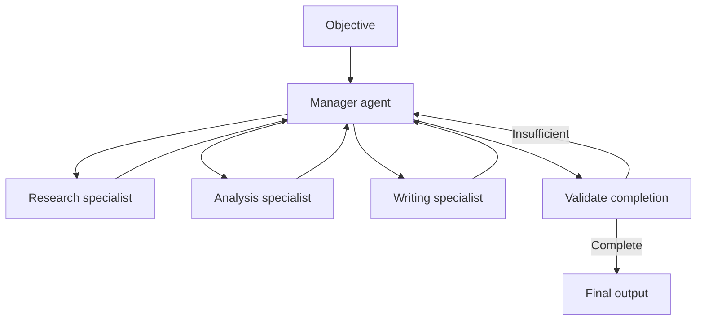

Hierarchical execution is useful when:

- tasks should be assigned dynamically based on role capability;
- the exact sequence cannot be fully predetermined;
- one component must review and integrate specialist outputs;
- the work resembles manager-worker delegation;
- a custom manager policy can improve routing.

Risks include:

- delegation loops;
- duplicated assignments;
- manager bottlenecks;
- manager overreach into specialist work;
- less predictable token usage;
- reduced reproducibility;
- unclear final accountability.

### 8.1 Manager responsibilities

A reliable manager should:

1. interpret the objective;
2. decompose it into bounded work;
3. assign work only to capable agents;
4. pass the minimum necessary context;
5. track completed and outstanding requirements;
6. validate outputs against an explicit rubric;
7. stop delegation when budgets are exhausted;
8. own final synthesis or assign it explicitly;
9. escalate unresolved conflicts.

### 8.2 Manager anti-pattern

A manager that repeatedly says "improve this" without identifying a missing requirement creates cosmetic iteration rather than productive work.

A better review message is:

```text
The pricing comparison is incomplete because Competitor B lacks a source date
and the annual price was inferred from a monthly plan. Re-check the official
pricing page. If the annual price is not published, mark it unknown.
```

---

## 9. Sequential versus hierarchical

| Dimension | Sequential | Hierarchical |
|---|---|---|
| Task order | Predefined | Manager-directed |
| Assignment | Usually explicit | Manager delegates |
| Predictability | Higher | Lower |
| Coordination cost | Lower | Higher |
| Best fit | Stable pipelines | Dynamic team allocation |
| Failure diagnosis | Easier | More complex |
| Cost estimation | More stable | More variable |
| Manager model required | No | Yes, or custom manager agent |

A hierarchical process is not automatically more intelligent. It is more dynamic. Dynamic coordination should be adopted only when the task benefits from dynamic allocation enough to offset the additional uncertainty.

---

## 10. Crews versus Flows

**Supplementary — current framework model**

CrewAI distinguishes collaborative crews from event-driven flows.

- A **crew** is a team of agents solving a bounded collaborative task.
- A **flow** is an application-level workflow that controls execution, state, routing, persistence, and integration.

The current official production guidance recommends a flow-first architecture: use a flow as the application entry point and invoke focused crews as units of work.

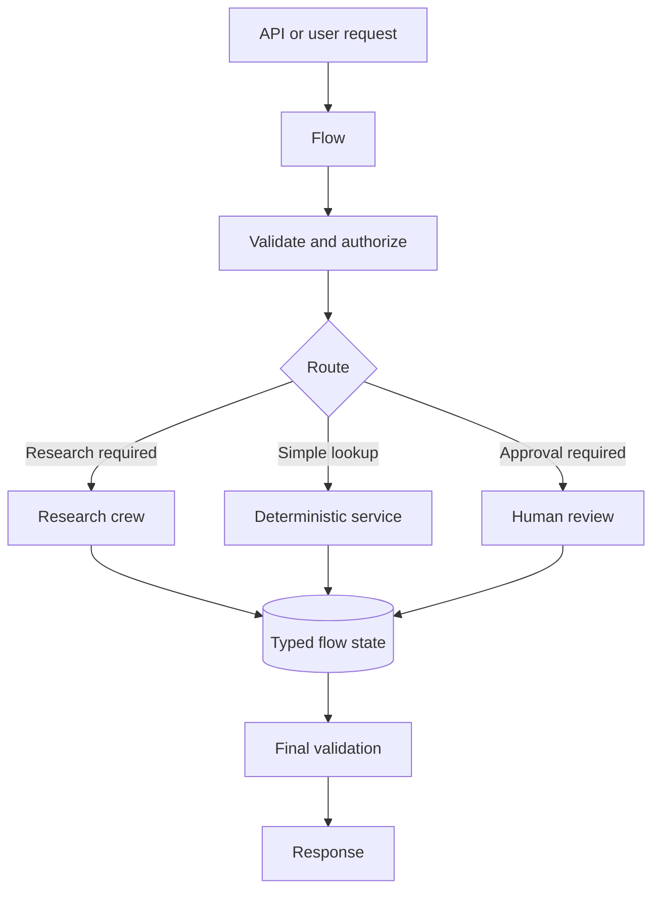

This separation matters because application concerns should not be hidden inside agent prompts.

Flows are a better place for:

- authentication and authorization;
- explicit state;
- conditional routing;
- persistence;
- retries and fallbacks;
- human approval;
- API integration;
- timeouts;
- side-effect control;
- observability;
- final response assembly.

Crews are a better place for:

- research teams;
- writer-reviewer collaboration;
- specialist analysis;
- manager-worker delegation;
- bounded synthesis problems.

> **Architecture rule**
>
> Put collaboration inside crews. Put business control around crews in flows or conventional application code.

---

## 11. Event-driven CrewAI Flows

Current CrewAI Flows use decorators such as `@start`, `@listen`, and `@router` to define event-driven execution. Typed state can be defined with Pydantic models.

Conceptually:

```python
class ResearchState(BaseModel):
    topic: str = ""
    raw_findings: str = ""
    approved: bool = False
    final_report: str = ""
```

```mermaid
flowchart LR
    S[@start: validate request] --> C[Run research crew]
    C --> R[@router: confidence route]
    R -->|high confidence| P[Publish]
    R -->|low confidence| H[Human review]
    H -->|approved| P
    H -->|revision| C
```

This model provides a natural way to combine normal Python, direct model calls, tools, and crews without forcing all application logic into the multi-agent process.

### 11.1 Flow state

State should be minimal, typed, and business-relevant. Do not store every raw prompt, hidden reasoning trace, or full document body unless a clear requirement justifies it.

Useful fields include:

- request identifier;
- normalized inputs;
- authorization scope;
- crew outputs;
- evidence references;
- quality status;
- approval status;
- retry counters;
- final output;
- audit metadata.

### 11.2 Routing

Routes should return finite, named outcomes such as:

```text
approved
needs_revision
requires_human
failed
```

Avoid generating arbitrary route names from free-form model output.

### 11.3 Persistence

Current CrewAI Flows support persistence through a `@persist` decorator, including state hydration across runs. Persistence does not eliminate the need for state versioning, tenant isolation, retention rules, migration planning, and idempotent external actions.

---

## 12. Memory and knowledge in a crew

A crew may use memory or knowledge sources, but these terms should not be confused with authoritative business state.

### 12.1 Working context

Temporary information used during one crew execution:

- task outputs;
- retrieved evidence;
- intermediate summaries;
- current review feedback.

### 12.2 Long-term memory

Reusable retained information from earlier executions:

- stable preferences;
- lessons from validated outcomes;
- previous task patterns;
- entity summaries.

### 12.3 Knowledge sources

Domain material supplied to agents:

- policies;
- manuals;
- product documentation;
- approved reference documents.

### 12.4 Source-of-truth data

Volatile or regulated facts should remain in authoritative systems:

- current payroll values;
- customer account status;
- inventory;
- contractual terms;
- open ticket state.

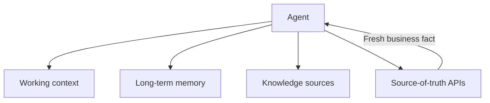

Memory should not silently override current source-of-truth data.

---

## 13. Tool and permission design

Role-based systems are valuable partly because permissions can follow responsibilities.

Consider an HR system:

| Agent | Allowed | Not allowed |
|---|---|---|
| Policy agent | Read approved policy documents | Read employee payroll data |
| Calendar agent | Read availability, propose meetings | Modify payroll or benefits |
| Payroll agent | Read payroll after authorization | Share another employee's data |
| Writer agent | Draft user-facing response | Execute changes |

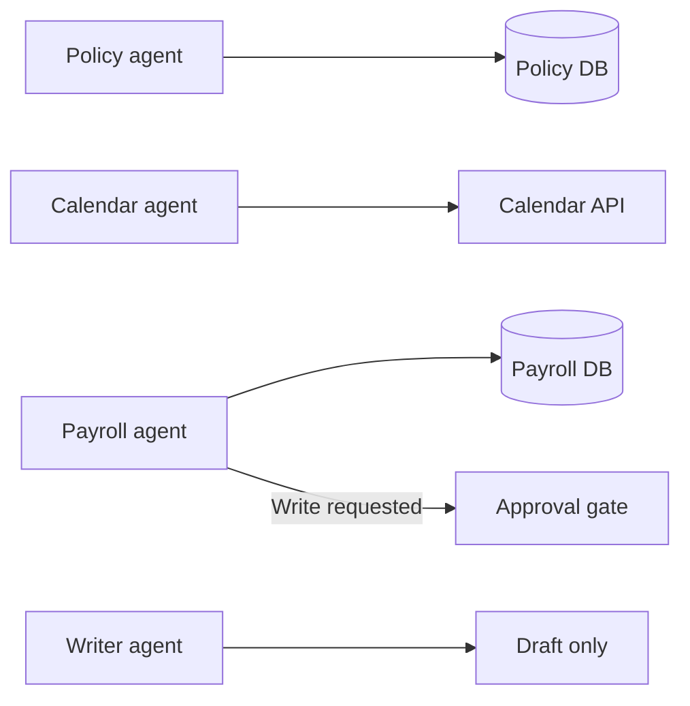

Permissions should be enforced in code and tool infrastructure, not only stated in the role prompt.

Important controls include:

- read versus write separation;
- tenant and user scope;
- per-agent tool allowlists;
- short-lived credentials;
- approval for irreversible actions;
- output redaction;
- rate limits;
- audit logs;
- sandboxing for untrusted content or code.

---

## 14. Handoffs and information contracts

Multi-agent quality depends on the quality of handoffs. A handoff should carry a structured artifact, not an unbounded transcript.

### 14.1 Research handoff

```yaml
findings:
  - claim: "Competitor A includes 100 GB storage"
    source: "official pricing page"
    source_date: "2026-08-03"
    confidence: high
unknowns:
  - "Enterprise support SLA not publicly listed"
conflicts: []
```

### 14.2 Review handoff

```yaml
status: needs_revision
failed_checks:
  - "Two claims lack source dates"
  - "One inferred annual price is presented as verified"
required_changes:
  - "Mark annual price unknown"
  - "Add source dates"
```

These structures reduce ambiguity and make retries targeted.

### 14.3 Context minimization

Pass only the information required by the next task. Excess context increases cost and can dilute instructions. It may also expose data beyond the receiving agent's permission scope.

---

## 15. Parallelism and asynchronous tasks

Independent tasks may run concurrently.

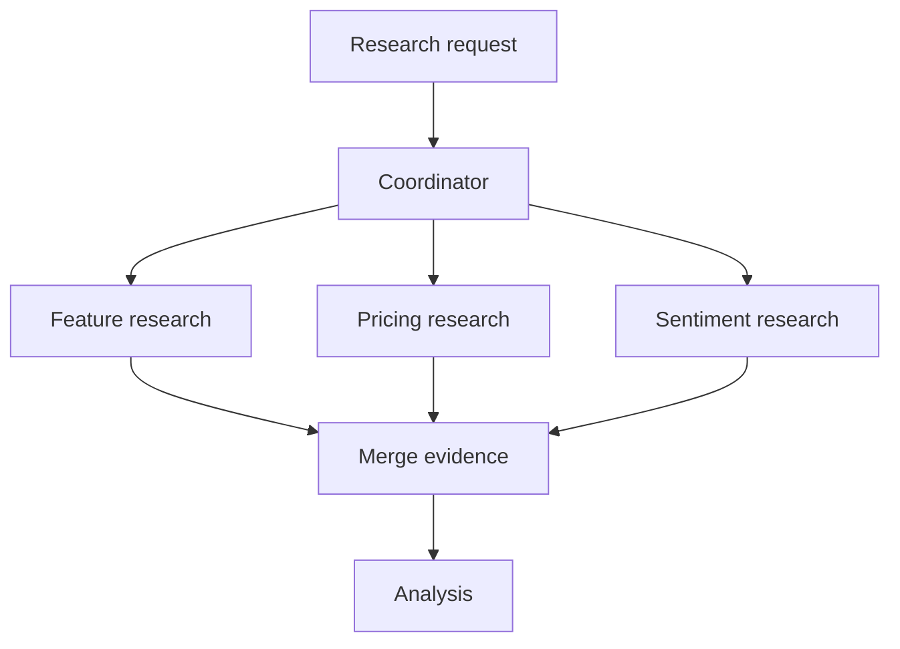

Parallel execution can reduce latency, but it introduces:

- concurrency limits;
- rate-limit pressure;
- nondeterministic completion order;
- duplicate retrieval;
- merge conflicts;
- partial failure handling;
- increased peak cost.

A merge step should define:

- required versus optional branches;
- deduplication rules;
- conflict resolution;
- timeout behavior;
- partial-output policy;
- source precedence.

Do not parallelize tasks that have true data dependencies merely to make the design look distributed.

---

## 16. Planning and reasoning

Current CrewAI crew configuration can enable planning, and agents can also be configured for reasoning behavior. These options add additional model work. They should be used when a meaningful plan improves execution, not as defaults.

Planning is useful when:

- the task is large or ambiguous;
- subtasks must be sequenced;
- tools need selection;
- delegation is dynamic;
- constraints must be carried across stages.

Planning is less useful when:

- the task is already explicit and sequential;
- the workflow is deterministic;
- added planning merely restates the task;
- latency and cost dominate;
- a fixed checklist is more reliable.

A plan should be evaluated by whether it changes execution quality, not by how detailed it sounds.

---

## 17. Reliability controls

A production crew needs controls beyond role prompts.

### 17.1 Bounded iteration

Set finite limits for:

- agent iterations;
- guardrail retries;
- manager delegations;
- review cycles;
- tool retries;
- total model calls;
- wall-clock duration;
- cost.

### 17.2 Progress checks

A retry or revision must make a material change, such as:

- adding missing evidence;
- changing a source;
- correcting a schema;
- resolving a conflict;
- narrowing a query;
- escalating a blocked requirement.

Rewriting the same answer with different wording is not progress.

### 17.3 Failure categories

| Failure | Preferred response |
|---|---|
| Transient API error | Bounded retry with backoff |
| Missing source | Try approved fallback or mark unavailable |
| Invalid structured output | Return precise schema feedback |
| Authorization failure | Stop; do not retry with broader scope |
| Conflicting evidence | Reconcile or escalate |
| No progress | Stop revision loop |
| Unsafe action | Block and alert or request approval |

### 17.4 Idempotency

Crews should generally produce analysis artifacts rather than directly perform irreversible writes. When a task can trigger side effects, use idempotency keys, confirmation reads, and application-level approval.

---

## 18. Human-in-the-loop design

Human review is appropriate when:

- impact is high;
- evidence conflicts;
- confidence is low;
- policy requires approval;
- the system is about to communicate externally;
- a write cannot be safely reversed;
- agent disagreement remains unresolved.

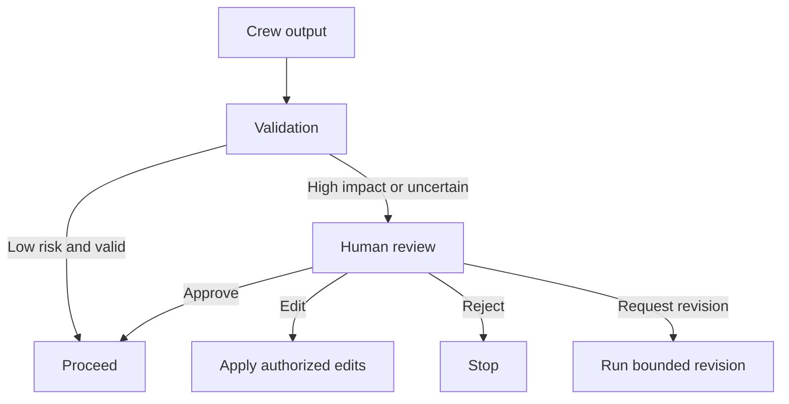

The reviewer interface should show:

- proposed output or action;
- supporting evidence;
- confidence or failed checks;
- exact tool arguments for writes;
- expected consequences;
- approve, edit, reject, and request-revision controls.

Approval should be bound to the exact artifact or action being approved. A changed payload requires new approval.

---

## 19. Observability and evaluation

Multi-agent systems require both component-level and system-level evaluation.

### 19.1 Agent-level metrics

- task completion;
- tool selection accuracy;
- evidence quality;
- schema validity;
- guardrail pass rate;
- iterations;
- latency;
- token usage;
- cost;
- handoff quality.

### 19.2 Crew-level metrics

- final correctness;
- factual consistency;
- citation coverage;
- policy compliance;
- end-to-end success;
- escalation rate;
- total latency;
- total cost;
- delegation count;
- revision count;
- user satisfaction.

### 19.3 Trajectory evaluation

The final answer may be correct even though the path was unsafe or inefficient. Evaluate:

- whether the correct agents were used;
- whether unnecessary agents ran;
- whether permissions were respected;
- whether delegation was bounded;
- whether tool calls were justified;
- whether failures were handled correctly;
- whether the final reviewer had sufficient evidence.

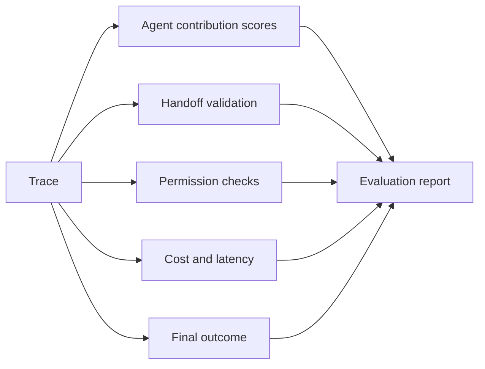

### 19.4 Logging

Useful fields include:

```text
workflow_id
crew_name
agent_role
task_name
input_reference
output_reference
status
duration_ms
model_calls
tokens
cost
retry_count
guardrail_result
tool_calls
error_type
approval_status
```

Sensitive prompts, documents, secrets, personal data, and private reasoning should be redacted or excluded according to policy.

---

## 20. Common failure modes

### 20.1 Too many agents

Symptoms:

- simple tasks take many calls;
- outputs are repetitive;
- ownership is unclear;
- latency and cost increase without measurable quality gains.

Fix: merge roles or return to a single agent with deterministic stages.

### 20.2 Role overlap

Two agents both believe they own analysis or final decisions.

Fix: define responsibility, inputs, outputs, and final authority explicitly.

### 20.3 Persona without capability

The prompt calls an agent a "senior database expert," but it has no database tool or schema information.

Fix: align role, tools, knowledge, and task.

### 20.4 Broad tool access

Every agent can access every API.

Fix: tool allowlists and least privilege.

### 20.5 Delegation loops

Agents or managers repeatedly hand work back and forth.

Fix: maximum handoffs, completed-task registry, progress checks, and a final decision owner.

### 20.6 Reviewer as a rubber stamp

The reviewer lacks a rubric and approves fluent output.

Fix: explicit deterministic and semantic checks with evidence access.

### 20.7 Unstructured handoffs

Downstream agents receive prose that is difficult to parse or verify.

Fix: Pydantic or JSON output contracts.

### 20.8 Shared memory leakage

Sensitive information written by one agent becomes available to unrelated agents.

Fix: scoped memory namespaces and explicit sharing policy.

### 20.9 Crews used as workflow engines

Authentication, retries, approvals, writes, and business routing are hidden in prompts.

Fix: wrap focused crews in a flow or application service.

### 20.10 Cosmetic debate

Agents repeatedly critique wording rather than resolve evidence or requirements.

Fix: review only against failed checks and cap revision cycles.

---

## 21. Worked example: competitive research crew

The board's competitive-research pattern uses a planner or manager, search agent, analyst, writer, and reviewer.

### 21.1 Business request

```text
Compare three competitors across product capabilities, pricing,
integration support, and adoption signals. Produce an executive-ready report
with sources and clearly identify unknowns.
```

### 21.2 Roles

| Role | Responsibility | Tools |
|---|---|---|
| Researcher | Collect verified public evidence | Search, document retrieval |
| Pricing analyst | Normalize plans and compare price structures | Pricing dataset, calculator |
| Product analyst | Compare capabilities and limitations | Evidence store |
| Writer | Produce concise report | No external write tools |
| Reviewer | Validate evidence and completeness | Evidence lookup, rubric |

### 21.3 Sequential design

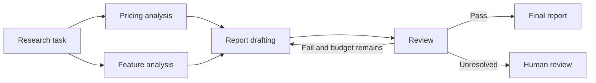

### 21.4 Hierarchical alternative

A manager can decide which specialist should handle each missing requirement. This is useful when the input set changes dynamically, but it makes execution less predictable.

### 21.5 Completion contract

The crew is complete only when:

- each competitor has at least one current source;
- every price has a billing basis or is marked unknown;
- inferred claims are labeled;
- conflicts are listed;
- the final report includes evidence references;
- the reviewer returns `approved`;
- revision budget has not been exceeded.

### 21.6 Safe production wrapper

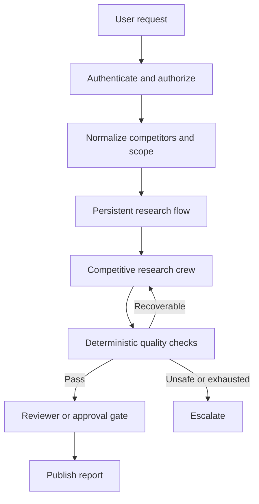

This wrapper prevents the crew from becoming responsible for identity, persistence, policy, and publication side effects.

---

## 22. Production reference architecture

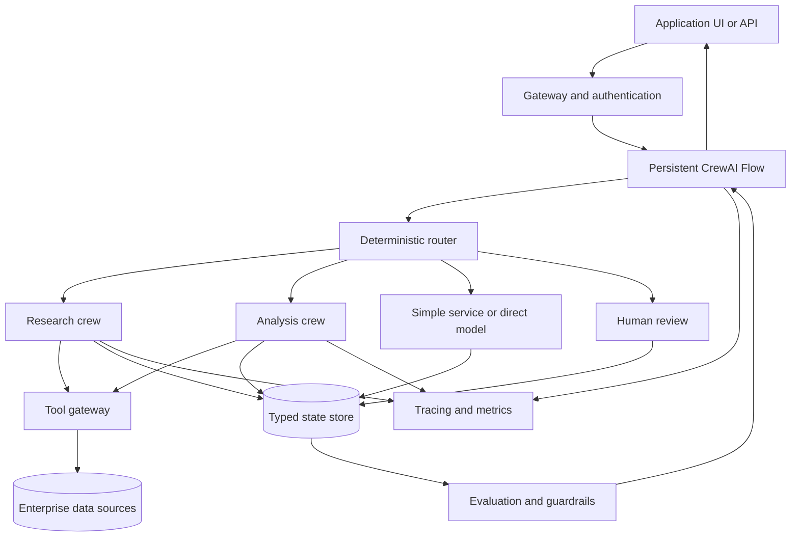

Key properties:

- the flow owns application state and routing;
- crews are focused units of collaborative work;
- tools are mediated through a permission-aware gateway;
- external business facts remain in source systems;
- deterministic validation surrounds model-based review;
- human approval is available for high-impact outcomes;
- traces connect flow, crew, task, agent, and tool events;
- budgets limit latency, cost, and iteration.

---

## 23. When CrewAI is a good fit

CrewAI is a strong fit when:

- the problem maps naturally to specialist roles;
- a team metaphor improves design communication;
- tasks have clear handoffs and outputs;
- writer-reviewer or researcher-analyst collaboration is valuable;
- dynamic manager delegation is justified;
- crews can remain bounded inside a controlled application flow.

A simpler architecture may be better when:

- one model call is sufficient;
- a single agent with tools can complete the task reliably;
- the process is fully deterministic;
- roles would merely duplicate the same model behavior;
- latency or cost must be minimal;
- the team needs a low-level graph runtime rather than role-centric abstractions;
- the organization already has a suitable workflow engine.

### 23.1 Comparison with LangGraph

| Dimension | CrewAI | LangGraph |
|---|---|---|
| Primary mental model | Team roles and tasks | State graph and transitions |
| Natural strength | Role-based collaboration | Explicit stateful control flow |
| Coordination | Crews and processes | Nodes and edges |
| Production wrapper | Flows | Compiled graph runtime |
| Best for | Researcher-writer-reviewer teams | Branching, loops, pause/resume, custom orchestration |
| Main risk | Too many agents or vague roles | Over-engineered graph or unclear state |

These frameworks can overlap. The choice should follow workflow shape, control needs, and team preferences rather than popularity.

---

## 24. Runnable example

The repository includes:

```text
examples/16-crewai/competitive_research_crew.py
```

The example demonstrates:

- four specialized agents;
- explicit task context;
- a sequential process;
- a Pydantic final output;
- a deterministic task guardrail;
- role-specific tools;
- a bounded, review-oriented design;
- environment-based model configuration.

Run it after installing the requirements and configuring an LLM provider supported by CrewAI.

---

## 25. Hands-on lab: supplier recommendation crew

Build a crew for the supplier scenario from the board.

### 25.1 Goal

Recommend a supplier using price, delivery timeline, historical quality, risk, and policy constraints.

### 25.2 Agents

1. `SupplierDataResearcher`
2. `CostAnalyst`
3. `DeliveryRiskAnalyst`
4. `QualityReviewer`
5. `RecommendationWriter`

### 25.3 Tasks

- retrieve supplier records;
- normalize quotes and currencies;
- assess delivery feasibility;
- compare historical quality;
- check mandatory policy thresholds;
- draft recommendation;
- validate evidence and confidence.

### 25.4 Required output

```yaml
recommended_supplier:
reasoning_summary:
price_comparison:
delivery_assessment:
quality_assessment:
risks:
sources:
confidence:
human_review_required:
```

### 25.5 Constraints

- no invented supplier facts;
- unknown fields remain unknown;
- price alone cannot override a failed quality threshold;
- a high-value purchase requires human approval;
- tool permissions are read-only;
- no supplier is contacted automatically;
- maximum one revision cycle;
- all comparisons cite source timestamps.

### 25.6 Acceptance criteria

- every agent has one responsibility;
- tasks have explicit expected outputs;
- the writer consumes structured analyst outputs;
- the reviewer has a deterministic rubric;
- missing data causes escalation rather than fabrication;
- the production wrapper separates approval from analysis;
- the final report explains why alternatives were not selected.

---

## 26. Knowledge check

1. What is the difference between an agent, a task, and a crew?
2. Why should roles be treated as contracts rather than personas?
3. What makes a task expected output useful?
4. When is a sequential process preferable?
5. What additional responsibility does a hierarchical manager introduce?
6. Why does dynamic delegation increase risk and cost variance?
7. Why should production systems use a flow around crews?
8. What belongs in flow state rather than crew memory?
9. How do structured outputs improve handoffs?
10. When should a deterministic guardrail be preferred to an LLM guardrail?
11. Why must reviewer retries be bounded?
12. What is the risk of giving every agent every tool?
13. How would you detect a delegation loop?
14. What metrics reveal that multiple agents are not adding value?
15. When is a single agent the better architecture?

---

## 27. Interview questions

### Beginner

1. What is CrewAI designed to model?
2. What are the main CrewAI building blocks?
3. What is the purpose of an agent's role, goal, and backstory?
4. What is the difference between a task description and expected output?
5. What is a sequential process?

### Intermediate

6. How would you design a researcher-writer-reviewer crew?
7. How do task contexts control handoffs?
8. When would you use a hierarchical process?
9. How would you prevent delegation loops?
10. How would you restrict tools by agent role?
11. How would you produce validated structured output?
12. Where should human approval occur?
13. How would you parallelize independent research tasks safely?
14. What should be stored in flow state?

### Senior

15. Design a flow-first CrewAI application for a regulated HR assistant.
16. How would you evaluate whether a multi-agent crew outperforms a single agent?
17. How would you design tenant-isolated memory and knowledge access?
18. How would you manage state-schema and prompt migrations for long-running flows?
19. How would you reconcile a manager's dynamic delegation with predictable cost budgets?
20. How would you implement end-to-end tracing across flow, crew, task, agent, and tool events?
21. How would you prevent model-based reviewers from becoming permissive rubber stamps?
22. How would you design idempotency around a crew that proposes an external action?

### System design

23. Design a competitive-research platform with parallel evidence collection, structured handoffs, conflict resolution, a reviewer, bounded revision, persistent state, and human approval before publication.
24. Design a supplier-selection system in which agents can read ERP and quality data but cannot place an order. Include policy thresholds, evidence freshness, and executive approval.
25. Design a product-management crew that summarizes feedback, identifies themes, estimates impact, drafts opportunities, and routes high-risk claims to a human product leader.

---

## 28. Chapter summary

- CrewAI uses a role-based mental model for agent collaboration.
- Agents are specialists; tasks are bounded assignments; crews group them under a process.
- Roles need clear responsibility, goals, tools, permissions, and evaluation criteria.
- Tasks should define both work and completion, preferably with structured output contracts.
- Sequential processes are predictable and should be the default for known handoffs.
- Hierarchical processes add manager-driven delegation and validation but also add uncertainty and coordination cost.
- Crews should remain focused on one collaborative goal.
- Production applications should place crews inside event-driven flows or conventional application control.
- Flow state, routing, persistence, approval, and integration should not be hidden inside agent prompts.
- Tool permissions must follow least privilege and role boundaries.
- Memory, knowledge, and source-of-truth data serve different purposes.
- Guardrails, retries, delegation, review cycles, model calls, latency, and cost all need explicit budgets.
- Handoffs should carry structured artifacts rather than unbounded transcripts.
- Evaluate agent contributions, handoff quality, trajectory safety, cost, and final business outcome.
- The simplest reliable architecture remains the correct default; multi-agent systems must earn their complexity.

---

## 29. Further reading

**Official CrewAI resources:**

- [CrewAI documentation](https://docs.crewai.com/)
- [Agents](https://docs.crewai.com/en/concepts/agents)
- [Tasks](https://docs.crewai.com/en/concepts/tasks)
- [Crews](https://docs.crewai.com/en/concepts/crews)
- [Processes](https://docs.crewai.com/en/concepts/processes)
- [Flows](https://docs.crewai.com/en/concepts/flows)
- [Production architecture](https://docs.crewai.com/en/concepts/production-architecture)
- [Flow state management](https://docs.crewai.com/en/guides/flows/mastering-flow-state)

Framework APIs evolve. Validate examples against the installed CrewAI version and current official documentation before production deployment.

---

## 30. Source map

| Handbook topic | Board material |
|---|---|
| CrewAI as role-based collaboration | Framework overview and patterns [Board, pp. 12-14] |
| Researcher-writer-reviewer pattern | Framework and competitive-research diagrams [Board, pp. 13, 20-21] |
| Manager-worker and specialist teams | Multi-agent patterns [Board, pp. 20-21] |
| Delegation, review, and failure loops | Multi-agent failure and reflection material [Board, pp. 21-22] |
| Tools, memory, state, and permissions | Agent capabilities and state material [Board, pp. 30-39] |
| Guardrails and human control | Control and safety material [Board, pp. 24-26] |
| Current CrewAI APIs, processes, Flows, persistence, and production guidance | Supplementary material from official CrewAI documentation |
