# Chapter 17 - AutoGen and Conversational Multi-Agent Systems

> **Source basis:** The board presents AutoGen as a framework in which multiple agents collaborate through conversation, similar to a panel of specialists discussing a problem. It contrasts this conversational pattern with LangGraph's graph-oriented control, CrewAI's role-based teams, and LangChain's dynamic tool selection [Board, pp. 12-14]. This chapter preserves that framing and expands it into a production engineering guide. Sections describing current AutoGen APIs, AgentChat, Core, teams, state persistence, GraphFlow, memory, telemetry, and implementation details are marked **Supplementary** and are based on the official Microsoft AutoGen documentation available when this chapter was written.

---

## Learning objectives

By the end of this chapter, you should be able to:

1. Explain the conversational mental model behind AutoGen.
2. Distinguish AutoGen AgentChat, AutoGen Core, and AutoGen Studio.
3. Decide when a multi-agent conversation is justified and when a single agent or deterministic workflow is better.
4. Define specialist agents with clear names, descriptions, tools, responsibilities, and decision rights.
5. Compare round-robin, model-selected, handoff-based, and graph-based team coordination.
6. Design explicit message contracts rather than relying on unrestricted prose.
7. Use termination conditions, turn budgets, progress checks, and final-decision ownership to prevent endless conversations.
8. Understand how tools, code execution, memory, and model context interact with conversational agents.
9. Persist agent and team state across application requests.
10. Design human-in-the-loop feedback without leaving a workflow blocked indefinitely.
11. Understand the role of the AutoGen Core runtime in message delivery, lifecycle management, observability, and distribution.
12. Recognize security risks associated with tools, shared context, code execution, and cross-agent data exposure.
13. Evaluate both the final answer and the collaboration trajectory.
14. Implement a selector-driven competitive-research team using current AgentChat APIs.
15. Identify common migration issues from older AutoGen examples and APIs.

---

## 1. Why conversational multi-agent systems exist

Some tasks do not fit a simple pipeline. A research problem may require several specialists to propose interpretations, question assumptions, request missing evidence, revise a draft, and converge on a final answer. In such cases, conversation can be used as a coordination mechanism.

The board uses an expert-panel analogy:

```text
Agent 1 <-> Agent 2 <-> Agent 3
             |
             v
        Shared conclusion
```

AutoGen turns this idea into a programmable agent system. Agents exchange messages, maintain context, use tools, and participate in a team that determines who acts next and when the task is complete.

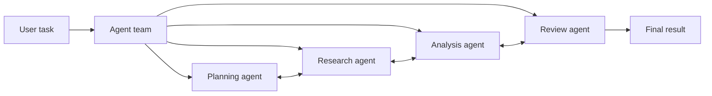

Conversation is useful when:

- the correct next step depends on intermediate findings;
- specialists need to challenge or refine one another;
- the problem is open-ended rather than fully procedural;
- responsibility can move between agents as context changes;
- tool use must be dynamically delegated;
- a reviewer should inspect and redirect the work;
- multiple hypotheses need comparison;
- human feedback may enter between rounds.

Conversation is not automatically better than a workflow. It introduces uncertainty in speaker selection, message volume, cost, latency, and termination. A fixed workflow is usually preferable when the process is already known.

> **Architecture rule**
>
> Use conversation when interaction itself adds value. Do not use a group chat merely to split one deterministic sequence into several model calls.

---

## 2. AutoGen's layered architecture

**Supplementary**

Modern AutoGen is best understood as a set of layers rather than a single monolithic API.

| Layer | Purpose | Typical user |
|---|---|---|
| AgentChat | High-level agents and predefined team patterns | Application developers and prototypers |
| Core | Event-driven agent runtime and messaging infrastructure | Advanced and distributed-system developers |
| Extensions | Model clients, code executors, tools, and integrations | Developers connecting external capabilities |
| Studio | Low-code interface for prototyping teams | Designers, researchers, and early-stage builders |

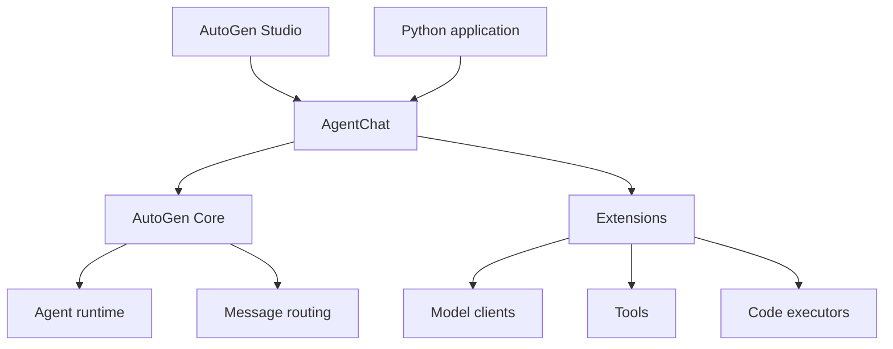

### 2.1 AgentChat

AgentChat is the recommended high-level starting point. It provides preset agents such as `AssistantAgent`, preset team patterns, termination conditions, UI helpers, state save/load operations, and memory integration.

Use AgentChat when:

- you want to build a conversational agent or team quickly;
- predefined team patterns match your use case;
- you need a practical application API rather than a custom runtime;
- you want to prototype before moving to lower-level control.

### 2.2 AutoGen Core

Core provides the lower-level event-driven model. Agents communicate through messages, and a runtime manages identity, delivery, and lifecycle. Core is appropriate when:

- agents must communicate asynchronously;
- message routing must be customized;
- the system may span processes or languages;
- you need custom agent types and protocols;
- runtime-level telemetry, lifecycle, or security boundaries matter;
- predefined AgentChat teams are too restrictive.

### 2.3 AutoGen Studio

Studio provides a visual environment for building and testing agents and teams. It is valuable for experimentation and demonstrations, but it should not be mistaken for a complete production application. Production deployments still need authentication, authorization, tenant isolation, secrets management, testing, observability, and operational controls.

> **Production note**
>
> A visual prototype proves interaction design. It does not prove operational safety, scalability, or compliance.

---

## 3. The AutoGen agent model

An agent is a participant that receives messages and produces responses or actions. In AgentChat, an agent normally has:

- a unique name;
- a useful description;
- a model client;
- a system message or behavioral instructions;
- optional tools;
- optional memory;
- internal model context;
- run and streaming interfaces.

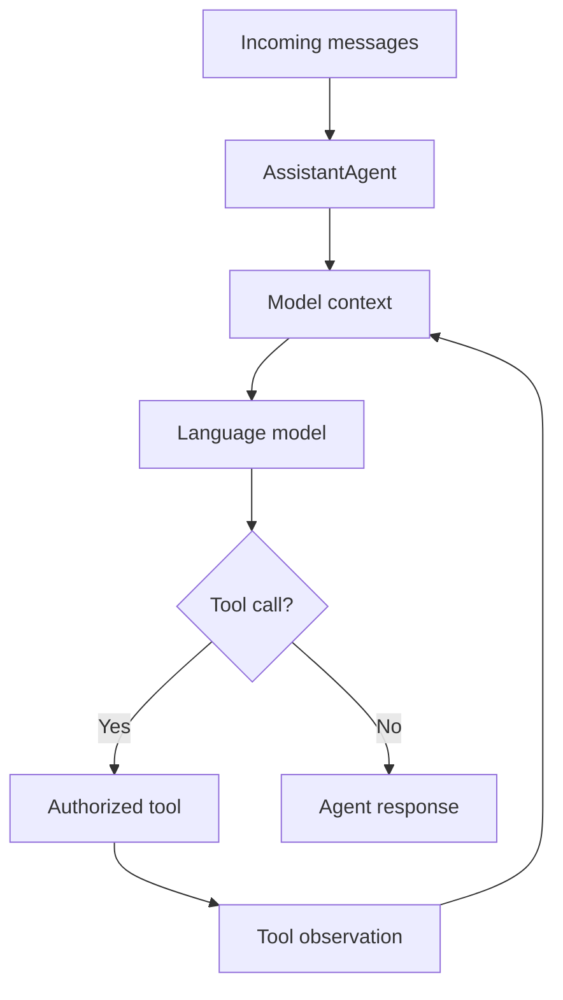

### 3.1 Name

The name is an identifier. In dynamic team selection, it may also influence routing because the team uses participant identity and descriptions when selecting the next speaker.

Good names are specific:

```text
pricing_researcher
risk_reviewer
report_writer
```

Weak names are ambiguous:

```text
agent1
assistant
expert
```

### 3.2 Description

The description helps the team understand when the agent should be selected.

Weak:

```text
An intelligent agent.
```

Better:

```text
Collects verifiable competitor pricing and packaging evidence. Use this
agent when the task requires source discovery or fact retrieval. It does
not make the final recommendation.
```

### 3.3 System message

The system message defines how the agent performs its role. It should include:

- responsibility;
- evidence requirements;
- output expectations;
- prohibited behavior;
- escalation conditions;
- completion markers when relevant.

### 3.4 Tools

Tools turn conversation into action. A tool may search, retrieve documents, query a database, calculate a value, create a ticket, or execute code. Tool access should be role-specific.

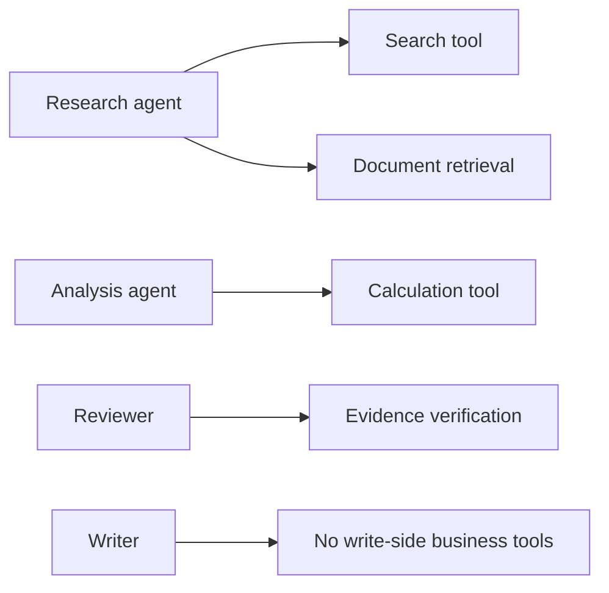

> **Least privilege**
>
> Do not give every participant every capability. Conversation does not remove the need for authorization boundaries.

---

## 4. Agents, teams, and conversations

An AutoGen team is a group of agents collaborating toward a shared task. The team determines how participants take turns, how messages are shared, and when the run ends.

A useful mental model is:

```text
Agent = specialist
Message = work artifact or coordination signal
Team = collaboration policy
Termination condition = completion boundary
Runtime = execution environment
```

The conversation history is both an advantage and a risk. It allows later agents to build on earlier work, but it can also accumulate irrelevant content, expose sensitive data, or reinforce an early mistake.

### 4.1 Shared context

In many group-chat patterns, participants receive the evolving conversation. Shared context supports collaboration but creates coupling.

Benefits:

- all agents can see prior evidence;
- agents can critique earlier claims;
- handoffs require less repeated context;
- the final writer can synthesize the discussion.

Risks:

- prompt-injection content may propagate;
- sensitive tool output may become visible to all participants;
- context grows with every turn;
- an incorrect claim may be repeated until it appears authoritative;
- role boundaries may blur.

### 4.2 Message quality

Unstructured messages are easy to create but hard to validate. Production teams should treat messages as contracts whenever possible.

Weak message:

```text
I looked into it. Supplier A seems best.
```

Better message:

```json
{
  "message_type": "supplier_comparison",
  "candidate": "Supplier A",
  "evidence": [
    {"source": "pricing_table_v3", "claim": "lowest quoted price"},
    {"source": "delivery_api", "claim": "meets required date"}
  ],
  "risks": ["quality score is six months old"],
  "confidence": "medium",
  "requires_review": true
}
```

Structured messages improve:

- routing;
- validation;
- observability;
- auditability;
- retries;
- final synthesis;
- human review.

---

## 5. Team coordination patterns

**Supplementary**

AgentChat supports several team styles. The correct pattern depends on who should speak next and how much control the application requires.

### 5.1 Round-robin group chat

`RoundRobinGroupChat` gives each participant a turn in a fixed order.

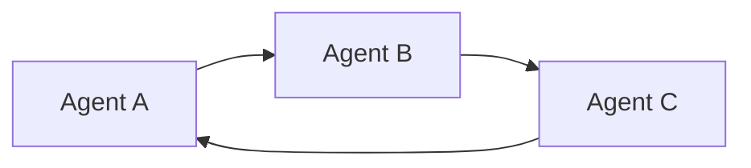

Use it when:

- every role must contribute in a known sequence;
- you are implementing a writer-critic loop;
- deterministic speaker order is valuable;
- the team is small.

Avoid it when:

- many turns are unnecessary;
- only one specialist is relevant to a given state;
- the correct next speaker depends heavily on context;
- fixed turns create repetitive messages.

### 5.2 Selector group chat

`SelectorGroupChat` uses a model or custom selection function to choose the next speaker from the participant set.

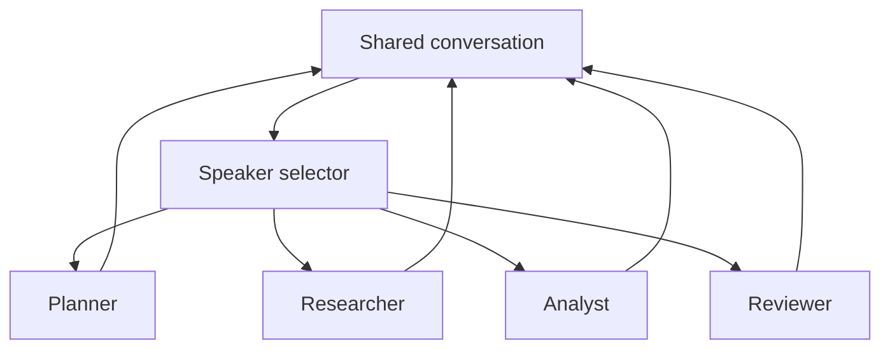

Use it when:

- specialist selection depends on the latest findings;
- tasks are open-ended;
- some agents may need several turns while others need none;
- participant descriptions can meaningfully guide routing.

The selector should be constrained. Useful controls include:

- meaningful participant descriptions;
- candidate filtering;
- a custom selector function;
- repeated-speaker rules;
- maximum turns;
- explicit termination conditions.

### 5.3 Swarm and handoff-based coordination

A handoff-based team transfers responsibility through explicit handoff messages. Instead of a central selector deciding every turn, an agent signals which specialist should continue.

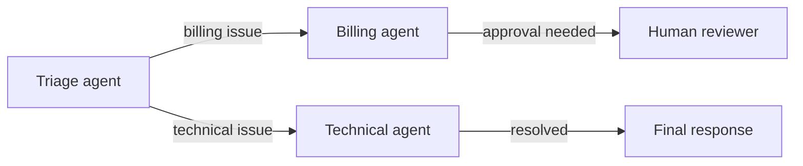

Use handoffs when:

- ownership should move explicitly;
- local agents know which specialist is needed next;
- a customer-service or operational routing model fits the domain;
- decision rights are distributed.

Handoffs require safeguards:

- permitted destination list;
- handoff reason;
- context payload;
- hop budget;
- ownership of the final answer;
- loop detection.

### 5.4 Magentic-One style teams

Magentic-One is intended for broad, open-ended tasks involving web and file-based work. Generalist teams can be useful for exploration, but production applications should still constrain tools, data access, execution budgets, and completion criteria.

### 5.5 GraphFlow

GraphFlow provides a directed graph for structured multi-agent execution. It supports sequential, parallel, conditional, and looping behavior.

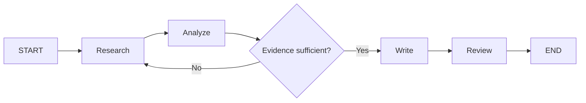

GraphFlow is appropriate when conversation alone is too unconstrained and the allowed execution paths should be explicit. At the time of writing, the official documentation marks GraphFlow as experimental, so API stability should be considered before adopting it for long-lived production systems.

---

## 6. Speaker selection is a control-plane decision

Who speaks next determines what the system does next. Speaker selection should therefore be treated as control logic, not merely as conversational style.

A speaker-selection policy should consider:

- the current task state;
- unresolved subgoals;
- evidence already collected;
- agent capabilities;
- tool permissions;
- previous speaker;
- remaining budget;
- risk and approval requirements.

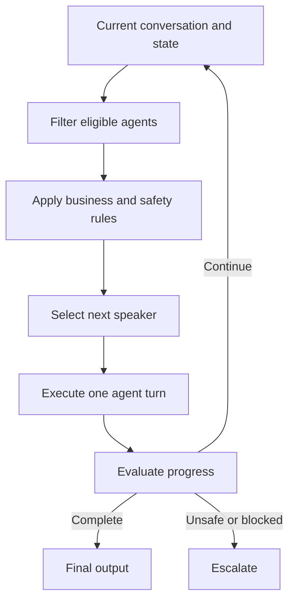

### 6.1 Model-based selection

Advantages:

- flexible;
- context-aware;
- simple to prototype;
- supports open-ended tasks.

Risks:

- selection may be inconsistent;
- the wrong specialist may be chosen;
- explanations may not match actual routing logic;
- cost and latency increase;
- a malicious message may influence routing.

### 6.2 Rule-based selection

A custom selector can encode explicit routing rules.

Example:

```text
If no evidence exists -> researcher
If evidence conflicts -> verifier
If analysis is missing -> analyst
If draft exists but is unreviewed -> reviewer
If approved -> terminate
```

Rule-based routing is easier to test. A hybrid approach is often strongest: deterministic rules enforce hard constraints, while a model chooses among the remaining safe candidates.

---

## 7. Termination conditions and bounded collaboration

A multi-agent system must know when to stop. Without an explicit termination policy, agents may repeat, debate indefinitely, or continue after an acceptable result already exists.

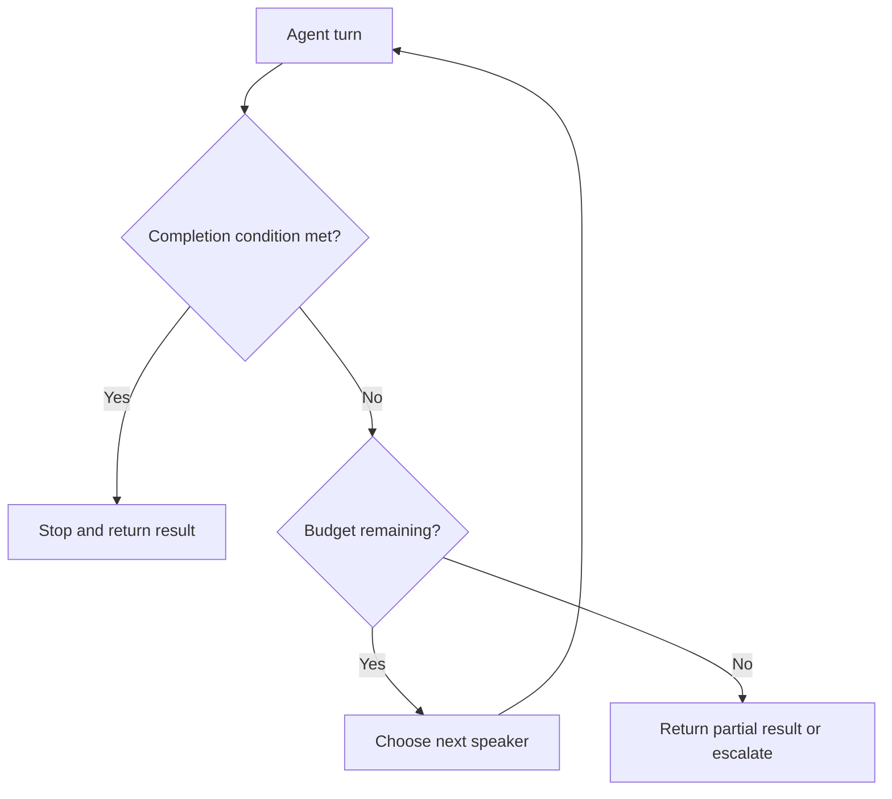

### 7.1 Termination signals

Termination can be based on:

- a text marker such as `APPROVE`;
- maximum messages or turns;
- token or time budget;
- handoff to a user;
- external cancellation;
- structured completion status;
- evaluator score;
- lack of progress;
- task-specific state.

### 7.2 Combine semantic and hard limits

A semantic condition alone may never occur. A hard limit alone may stop before completion. Production systems should combine both.

```text
Stop when:
- reviewer emits APPROVE, OR
- maximum messages is reached, OR
- external abort is requested, OR
- cost budget is exhausted.
```

### 7.3 Final decision owner

One component must own completion. This may be:

- a reviewer agent;
- a manager agent;
- an application evaluator;
- a deterministic validator;
- an authorized human.

Without a final decision owner, agents may all provide opinions but none can close the task.

### 7.4 Progress checks

A progress check asks whether the latest turn changed the state meaningfully.

Possible signals:

- new evidence added;
- unresolved questions reduced;
- a draft improved against a rubric;
- a tool failure was resolved;
- confidence increased because of valid evidence;
- a previously unknown field was populated.

Stop or escalate when several turns produce no material change.

---

## 8. Conversation patterns

### 8.1 Reflection pattern

A generator creates an output and a critic evaluates it.

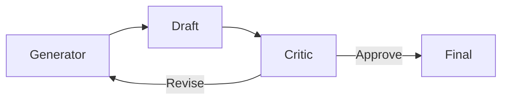

Useful for:

- reports;
- policy-sensitive responses;
- code review;
- content quality;
- structured document generation.

Risk: the agents may produce cosmetic revisions without improving correctness. The critic needs a rubric and evidence access.

### 8.2 Debate pattern

Agents propose competing conclusions and challenge one another.

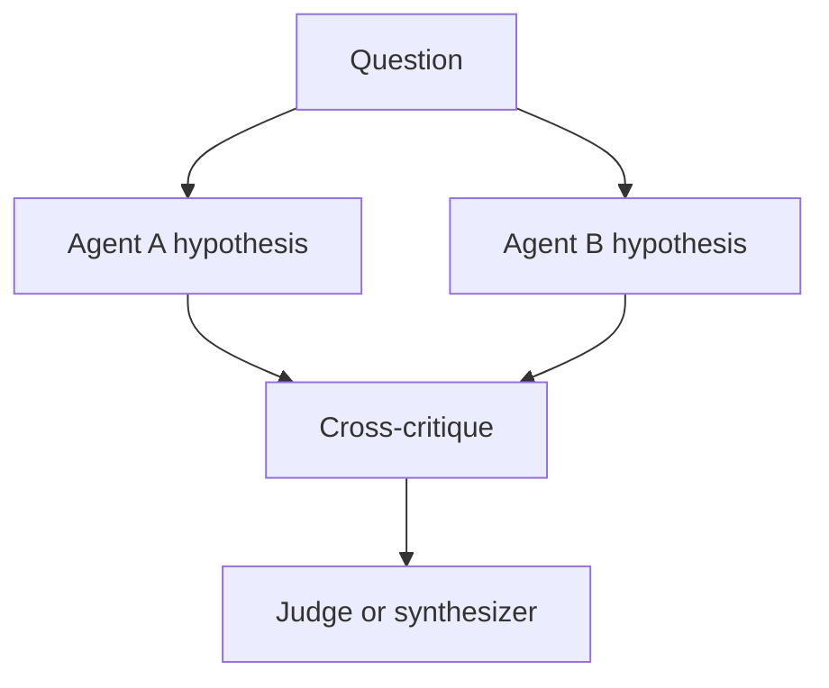

Useful when:

- multiple interpretations are plausible;
- assumptions need stress testing;
- risk analysis benefits from opposing views.

Avoid debate for simple factual retrieval. It adds cost and can create false balance between a supported answer and an unsupported one.

### 8.3 Planner-specialist pattern

A planner decomposes the goal and directs specialist work.

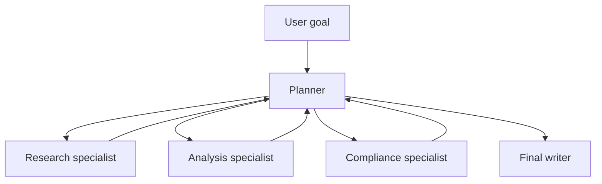

The planner should not become a universal agent that performs every task itself. Its responsibility is decomposition, routing, progress tracking, and convergence.

### 8.4 Handoff pattern

Responsibility transfers from one agent to another.

```text
Triage -> Specialist -> Reviewer -> Human approval -> Action
```

Each handoff should state:

- destination;
- reason;
- current state;
- evidence;
- unresolved questions;
- requested action;
- return condition.

### 8.5 Concurrent specialists

Several agents independently analyze the same or different subproblems, after which a synthesizer merges the outputs.

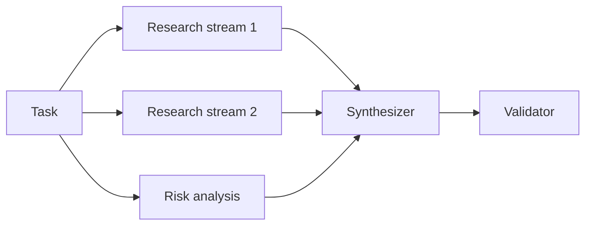

Parallelism reduces elapsed time only when work is independent and infrastructure supports concurrent execution. It may increase total token and tool cost.

---

## 9. Tools and action execution

AutoGen agents can call functions and tool objects. The general tool loop is:

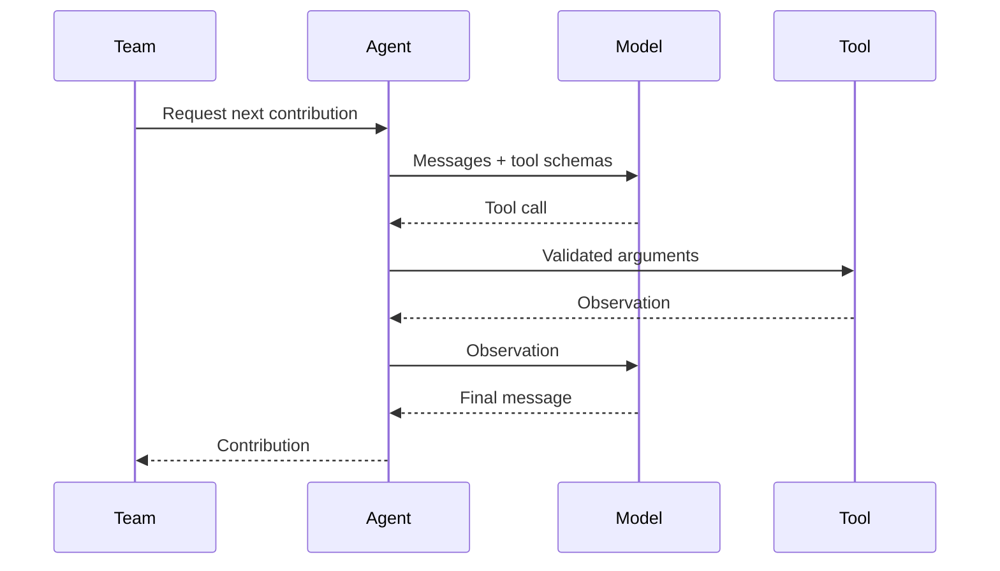

### 9.1 Tool design principles

A production tool should have:

- a precise name;
- a narrow responsibility;
- typed arguments;
- a clear description;
- authorization checks outside the model;
- timeout and retry behavior;
- normalized output;
- audit metadata;
- idempotency for side effects;
- safe failure semantics.

### 9.2 Tool ownership

Assign tools according to role.

| Agent | Suitable tools | Unsuitable tools |
|---|---|---|
| Researcher | Search, document retrieval | Payroll update, customer deletion |
| Analyst | Calculator, query tools | External publishing |
| Reviewer | Evidence lookup, policy validation | Broad write access |
| Action agent | Approved business APIs | Unrestricted database shell |

### 9.3 Tool output is untrusted input

Search results, documents, web pages, and API responses may contain malicious or irrelevant instructions. Tool output should be treated as data, not as authority over system behavior.

Useful controls:

- separate instructions from retrieved content;
- filter or label untrusted text;
- validate structured fields;
- apply domain allowlists;
- redact secrets;
- constrain downstream tool access;
- record provenance.

---

## 10. Code execution

AutoGen provides code-execution capabilities through extension components and code-executor agents. Code execution is powerful because it lets an agent calculate, transform data, inspect files, or test generated code. It is also a high-risk capability.

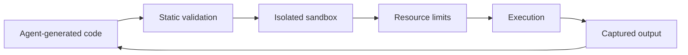

Never execute model-generated code directly on a host with production credentials or unrestricted network access.

Minimum controls include:

- container or sandbox isolation;
- filesystem restrictions;
- network restrictions;
- CPU, memory, and time limits;
- package allowlists;
- secret isolation;
- output-size limits;
- audit logging;
- manual approval for risky operations.

> **Security principle**
>
> The code executor is an untrusted workload boundary, not a convenience function.

---

## 11. Memory, context, and RAG

**Supplementary**

Conversation history is not the same as durable memory. AgentChat distinguishes current model context from external memory implementations that can add relevant information before a model step.

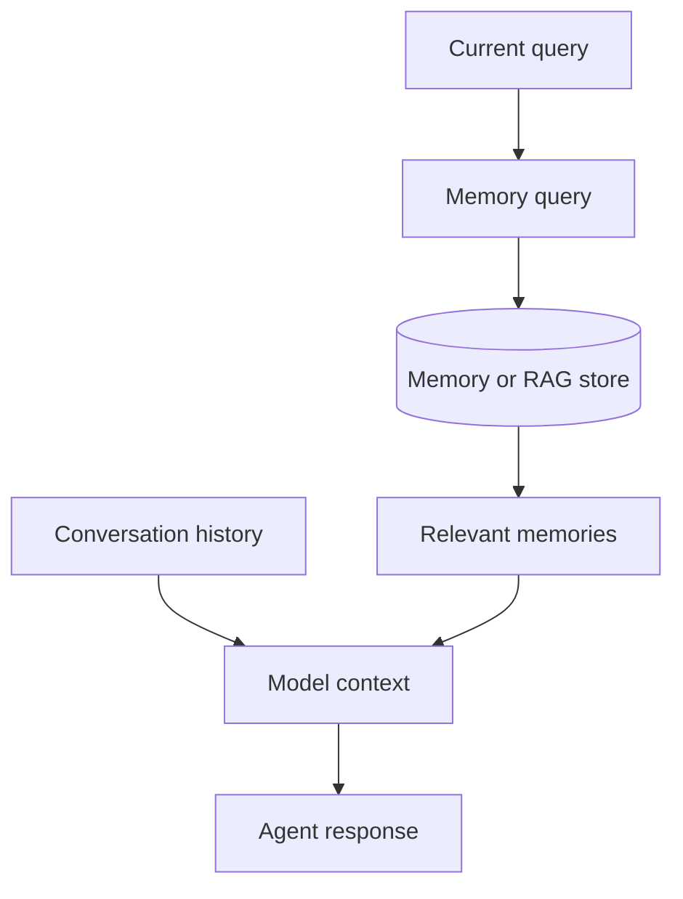

Memory may store:

- user preferences;
- reusable task facts;
- prior decisions;
- summaries;
- domain knowledge;
- retrieved evidence.

Memory requires governance:

- tenant and user scope;
- provenance;
- freshness;
- correction and deletion;
- authorization filtering;
- retention policy;
- poisoning protection.

### 11.1 Shared memory vs shared transcript

A shared transcript exposes everything said. Shared memory should be selective. The system should retrieve only information relevant and authorized for the current agent and task.

### 11.2 Conversation compaction

Long-running teams should not carry unlimited raw history. Use:

- summaries;
- structured state;
- evidence stores;
- message filtering;
- bounded context windows;
- task-scoped sessions.

---

## 12. State persistence and resumability

**Supplementary**

AgentChat agents and teams can save and load state. This is important for web applications, long-running tasks, human review, and failure recovery.

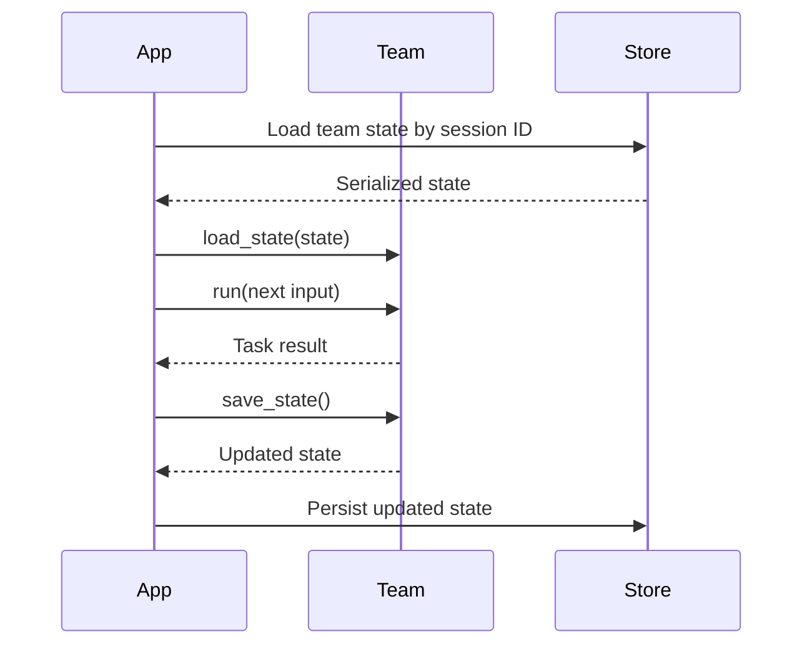

Persisted state may include:

- conversation context;
- next participant position;
- termination-condition state;
- agent model context;
- team coordination state.

Application-owned state should separately store:

- user and tenant identity;
- business workflow status;
- approval records;
- tool side-effect records;
- budgets;
- audit events;
- version metadata.

> **Separation principle**
>
> Framework state helps resume agent execution. It should not replace the authoritative business state of the application.

### 12.1 Concurrency

Do not load the same team state into several workers and update it without concurrency control. Use:

- version numbers;
- optimistic locking;
- session ownership;
- distributed locks where necessary;
- idempotent tool operations.

---

## 13. Human-in-the-loop interaction

**Supplementary**

AutoGen supports human feedback during or between runs. The design choice affects reliability.

### 13.1 Feedback during a run

A `UserProxyAgent` can request input while a team is executing.

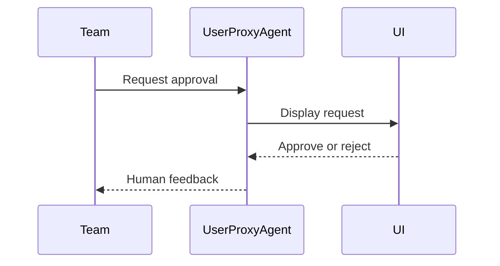

This is useful for immediate, short interactions. However, a blocking user proxy holds the run open while waiting. It is a poor fit for approvals that may take minutes, hours, or days.

### 13.2 Feedback between runs

A more durable pattern is:

1. stop at a defined boundary;
2. save team and application state;
3. create an approval task;
4. return control to the application;
5. resume the team in a later request after feedback arrives.

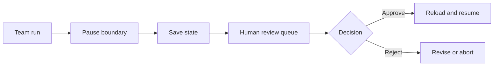

This pattern is resilient to application restarts and long review times.

### 13.3 Approval integrity

An approval must be bound to the exact proposed action. Store:

- action name;
- arguments;
- evidence;
- policy result;
- requesting agent;
- approver identity;
- timestamp;
- expiration;
- state version.

If the action changes, approval must be requested again.

---

## 14. AutoGen Core and the agent runtime

**Supplementary**

AutoGen Core provides an event-driven runtime in which agents communicate through messages. The runtime manages agent identities, message delivery, and lifecycle.

```mermaid
flowchart TB
    APP[Application] --> RT[Agent runtime]
    RT --> A1[Agent instance A]
    RT --> A2[Agent instance B]
    RT --> A3[Agent instance C]
    A1 -->|direct message| RT
    A2 -->|publish event| RT
    RT -->|deliver| A3
```

### 14.1 Direct messages

A sender targets a specific agent identity and may expect a response. This resembles request-response communication.

### 14.2 Published messages

Agents publish to topics, and subscribed agents receive the message. This supports event-driven and concurrent patterns.

### 14.3 Routed agents

A routed agent dispatches incoming message types to appropriate handlers. Typed messages make protocols explicit.

```python
from dataclasses import dataclass

@dataclass
class EvidenceRequest:
    query: str
    request_id: str

@dataclass
class EvidenceResult:
    request_id: str
    sources: list[str]
    status: str
```

Typed protocols improve compatibility, testing, and observability.

### 14.4 Standalone and distributed runtimes

A standalone runtime runs within an application process. A distributed runtime separates host and worker processes and routes messages across process boundaries.

Use distribution when required by:

- scale;
- isolation;
- language boundaries;
- organizational boundaries;
- workload placement;
- fault containment.

Distribution adds operational complexity. Do not adopt it before a single-process design proves inadequate.

---

## 15. Observability and debugging

Conversation must be observable as a trajectory, not only as a final answer.

```mermaid
flowchart LR
    MSG[Messages] --> TRACE[Trace]
    TOOL[Tool calls] --> TRACE
    SELECT[Speaker decisions] --> TRACE
    COST[Tokens and latency] --> TRACE
    TERM[Termination reason] --> TRACE
    TRACE --> DASH[Observability backend]
```

Record at least:

- run and session identifiers;
- participant name;
- message type;
- selected next speaker;
- selection reason or rule;
- tool calls and outcomes;
- model usage;
- latency;
- retries;
- handoffs;
- termination reason;
- final evaluator result;
- human approvals;
- errors and fallbacks.

AutoGen Core supports trace and structured logging and can integrate with OpenTelemetry. Human-readable trace logs help developers inspect behavior, while structured events are better for monitoring systems.

### 15.1 Useful metrics

| Dimension | Example metrics |
|---|---|
| Quality | Task success, correctness, evidence coverage |
| Collaboration | Useful turns, redundant turns, handoff accuracy |
| Routing | Correct speaker selection, invalid selection rate |
| Efficiency | Messages, model calls, tokens, tool calls, latency |
| Reliability | Retry rate, timeout rate, incomplete-run rate |
| Safety | Policy violations, unauthorized tool attempts |
| Human control | Approval rate, edit rate, escalation rate |

### 15.2 Conversation visualization

A trace should answer:

- Why was this agent selected?
- What evidence did it receive?
- Which tool did it call?
- Did the next agent use the output?
- Which condition stopped the team?
- Was the final answer grounded?

---

## 16. Evaluation of conversational teams

A good final answer can hide an unsafe or inefficient path. Evaluate at several levels.

### 16.1 Agent-level evaluation

For each participant:

- did it stay within role?
- did it use permitted tools?
- did it produce the required artifact?
- were claims supported?
- did it introduce unsupported facts?

### 16.2 Message-level evaluation

For each message:

- was it relevant?
- did it add new information?
- did it follow the expected schema?
- did it preserve provenance?
- did it contain sensitive data?

### 16.3 Trajectory evaluation

For the collaboration path:

- was the correct specialist selected?
- were unnecessary turns avoided?
- did handoffs preserve context?
- did the team make measurable progress?
- were retries bounded?
- did the team stop for the right reason?

### 16.4 Outcome evaluation

For the final answer:

- correctness;
- completeness;
- faithfulness;
- policy compliance;
- clarity;
- actionability;
- latency;
- cost.

```mermaid
flowchart TB
    RUN[Team run] --> A[Agent evaluation]
    RUN --> M[Message evaluation]
    RUN --> T[Trajectory evaluation]
    RUN --> O[Outcome evaluation]
    A --> SCORE[Composite quality result]
    M --> SCORE
    T --> SCORE
    O --> SCORE
```

---

## 17. Security model

Multi-agent conversation expands the attack surface because data moves across participants and tools.

### 17.1 Threats

- prompt injection from retrieved content;
- excessive tool permissions;
- secret leakage into shared context;
- cross-tenant conversation reuse;
- unsafe code execution;
- malicious handoffs;
- agent impersonation through ambiguous names;
- denial of service through endless turns;
- data exfiltration through external tools;
- model-generated arguments that bypass business rules.

### 17.2 Security architecture

```mermaid
flowchart TB
    U[User input] --> IN[Input policy]
    IN --> TEAM[Agent team]
    TEAM --> BROKER[Tool authorization broker]
    BROKER --> READ[Read tools]
    BROKER --> WRITE[Approval-gated write tools]
    TEAM --> MEM[Scoped memory]
    TEAM --> EXEC[Sandboxed execution]
    TEAM --> OUT[Output policy]
    OUT --> R[Response]
    TEAM --> AUDIT[(Audit log)]
```

Controls should include:

- identity propagated from the application;
- tenant-scoped state and memory;
- deterministic authorization outside prompts;
- read/write separation;
- high-impact approval gates;
- tool argument validation;
- sandboxing;
- message redaction;
- turn and cost budgets;
- explicit participant allowlists;
- final output filtering;
- immutable audit records.

---

## 18. Common failure modes

### 18.1 Agents talk without making progress

Symptoms:

- paraphrasing previous messages;
- repeatedly asking for more analysis;
- no new evidence;
- no owner for completion.

Fixes:

- define progress fields;
- add a maximum-message condition;
- require structured artifacts;
- use a reviewer with decision authority;
- detect repeated content.

### 18.2 Wrong speaker selected

Causes:

- vague names and descriptions;
- too many overlapping roles;
- selector prompt lacks routing criteria;
- all participants are always eligible.

Fixes:

- sharpen descriptions;
- filter candidates;
- add custom routing rules;
- reduce agent count.

### 18.3 Delegation loops

```mermaid
flowchart LR
    A[Agent A] -->|delegates| B[Agent B]
    B -->|delegates| A
```

Fixes:

- maximum handoff count;
- no immediate return to previous owner;
- progress checks;
- explicit final owner;
- graph or rule constraints.

### 18.4 Shared-context contamination

One agent exposes irrelevant or sensitive information that every later participant sees.

Fixes:

- scoped messages;
- filtered context;
- separate teams for permission domains;
- structured evidence store;
- redaction.

### 18.5 Reviewer approves style, not truth

Fixes:

- provide evidence to the reviewer;
- use deterministic validators;
- separate factual, policy, and style review;
- require citation coverage.

### 18.6 Team used where one agent was enough

Symptoms:

- high latency;
- repetitive roles;
- no distinct permissions or tools;
- difficult debugging.

Fix: collapse the team into one agent with a clear prompt and tools.

---

## 19. Framework comparison

The board compares frameworks by coordination style. The following table extends that comparison.

| Framework | Primary mental model | Strongest fit | Main risk |
|---|---|---|---|
| LangGraph | Stateful graph | Controlled branching, loops, durable workflows | More explicit engineering |
| CrewAI | Role-based team | Familiar specialist roles and bounded crews | Roles may become theatrical rather than functional |
| AutoGen | Conversational agents and message runtime | Dynamic collaboration, expert discussion, custom protocols | Unbounded conversation and difficult termination |
| LangChain agents | Model selects tools | Single-agent tool use and flexible integrations | Dynamic behavior may be difficult to constrain |

### 19.1 AutoGen vs LangGraph

Choose AutoGen when agent conversation, handoffs, or event-driven messaging are central. Choose LangGraph when explicit state transitions and deterministic routes are central.

### 19.2 AutoGen vs CrewAI

Choose AutoGen when interaction patterns and speaker selection are the focus. Choose CrewAI when the task maps cleanly to a team of roles and assignments.

### 19.3 AutoGen AgentChat vs Core

Choose AgentChat for faster application development. Choose Core when you need custom messaging, runtime control, distributed execution, or lower-level protocols.

---

## 20. Worked example: competitive research team

The board uses competitive research as a planner-executor-reviewer example. An AutoGen version can use four participants:

1. **Planner** - identifies research questions and missing evidence.
2. **Researcher** - uses approved search or document tools.
3. **Analyst** - compares evidence and identifies implications.
4. **Reviewer** - validates coverage and emits the completion signal.

```mermaid
flowchart TB
    Q[Competitive research request] --> P[Planner]
    P --> R[Researcher]
    R --> A[Analyst]
    A --> V[Reviewer]
    V -->|Missing evidence| P
    V -->|APPROVE| O[Final report]
```

### 20.1 Responsibility contracts

#### Planner

```text
Owns decomposition and progress tracking.
Does not fabricate research findings.
Requests a specialist only when a defined evidence gap exists.
```

#### Researcher

```text
Collects evidence through approved tools.
Returns source identifiers and clearly marks unavailable facts.
Does not write the final recommendation.
```

#### Analyst

```text
Compares collected facts.
Separates evidence, inference, and uncertainty.
Does not claim facts that are absent from the evidence set.
```

#### Reviewer

```text
Checks factual support, requested coverage, contradictions, and format.
Emits APPROVE only when the completion contract is satisfied.
Otherwise states the exact missing requirement.
```

### 20.2 Completion contract

The report is complete only when it contains:

- competitor names;
- feature comparison;
- pricing evidence or an explicit unavailable marker;
- adoption or market signals if requested;
- material uncertainties;
- source references;
- concise recommendation;
- reviewer approval.

### 20.3 Selection controls

- the planner should not speak again unless the reviewer identifies a gap;
- the researcher should be selected only for missing evidence;
- the analyst should be selected only after evidence exists;
- the reviewer should be selected after a draft exists;
- no participant may exceed a defined turn budget;
- the run stops on `APPROVE` or maximum messages.

---

## 21. Implementation walkthrough

**Supplementary**

The accompanying example uses current AgentChat concepts:

- `AssistantAgent` for participants;
- a Python function as a research tool;
- `SelectorGroupChat` for model-based next-speaker selection;
- `TextMentionTermination` for semantic completion;
- `MaxMessageTermination` as a hard safety bound;
- `Console` for streamed output;
- an OpenAI-compatible model client from `autogen-ext`.

The essential architecture is:

```python
team = SelectorGroupChat(
    participants=[planner, researcher, analyst, reviewer],
    model_client=model_client,
    termination_condition=(
        TextMentionTermination("APPROVE")
        | MaxMessageTermination(12)
    ),
)
```

The example is intentionally read-only. It uses a mock research function rather than live browsing so that the collaboration pattern can be studied without external side effects.

### 21.1 Installation

```bash
python -m venv .venv
source .venv/bin/activate
pip install -r requirements.txt
export OPENAI_API_KEY="your-key"
python competitive_research_team.py
```

On Windows PowerShell:

```powershell
.venv\Scripts\Activate.ps1
$env:OPENAI_API_KEY="your-key"
python competitive_research_team.py
```

### 21.2 Configuration

The example supports:

```text
AUTOGEN_MODEL=<model name>
OPENAI_API_KEY=<provider credential>
```

Keep credentials outside source control.

---

## 22. Migration note: older AutoGen examples

**Supplementary**

Many articles and repositories still show AutoGen 0.2-era APIs such as older `ConversableAgent`, `AssistantAgent`, `UserProxyAgent`, `GroupChat`, and `GroupChatManager` construction patterns. Modern AutoGen introduced a new AgentChat and Core architecture with breaking changes.

When reading examples:

1. check the documentation version;
2. prefer the stable official documentation;
3. verify package names;
4. do not mix 0.2 and modern AgentChat imports;
5. confirm team, model-client, and termination APIs;
6. pin tested dependency versions for production;
7. add migration tests before upgrading.

A modern installation normally uses packages such as:

```text
autogen-agentchat
autogen-ext[openai]
```

rather than relying on old tutorial code without version context.

---

## 23. Production reference architecture

```mermaid
flowchart TB
    UI[Web or application UI] --> API[Authenticated API]
    API --> SESSION[Session and state service]
    API --> POLICY[Policy and authorization]
    API --> TEAM[AutoGen AgentChat team]
    TEAM --> MODEL[Model gateway]
    TEAM --> TOOL[Tool broker]
    TOOL --> SEARCH[Search and RAG]
    TOOL --> DATA[Business APIs]
    TOOL --> EXEC[Sandboxed code execution]
    TEAM --> MEMORY[Scoped memory service]
    TEAM --> HUMAN[Human review queue]
    TEAM --> OBS[Tracing and evaluation]
    SESSION --> STORE[(Persistent state)]
    OBS --> DASH[Monitoring dashboard]
    POLICY --> TOOL
    POLICY --> MEMORY
```

Production responsibilities should remain outside the agents where possible:

- identity and tenant isolation;
- authorization;
- tool credentials;
- business transaction integrity;
- state persistence;
- cost limits;
- audit logging;
- deployment and scaling;
- policy enforcement;
- incident response.

The agent team should focus on reasoning, coordination, and producing bounded decisions or proposals.

---

## 24. Design checklist

### Task and architecture

- [ ] Does conversation add value over a fixed workflow?
- [ ] Could a single agent solve the task reliably?
- [ ] Is every participant justified by a distinct responsibility?
- [ ] Is there one final decision owner?

### Participants

- [ ] Are names and descriptions specific enough for routing?
- [ ] Do roles have non-overlapping responsibilities?
- [ ] Are tools and permissions role-specific?
- [ ] Are agents prevented from making unauthorized business decisions?

### Messages

- [ ] Are important handoffs structured?
- [ ] Is evidence provenance preserved?
- [ ] Is sensitive data filtered from shared context?
- [ ] Are message types versioned when used as protocols?

### Coordination

- [ ] Is the speaker-selection policy testable?
- [ ] Are candidate agents filtered?
- [ ] Are repeated speakers and handoffs controlled?
- [ ] Are parallel branches actually independent?

### Termination

- [ ] Is there a semantic completion condition?
- [ ] Is there a hard turn or message limit?
- [ ] Is no-progress detection implemented?
- [ ] Is there an escalation or partial-result path?

### Tools and execution

- [ ] Are arguments schema-validated?
- [ ] Is authorization enforced outside the model?
- [ ] Are write operations approval-gated and idempotent?
- [ ] Is code execution sandboxed?

### State and operations

- [ ] Can team state be saved and restored?
- [ ] Is application business state stored separately?
- [ ] Are concurrent updates controlled?
- [ ] Are traces, tool calls, selections, and costs observable?

### Safety

- [ ] Are prompt injection and untrusted tool outputs handled?
- [ ] Is memory scoped and governed?
- [ ] Are tenant boundaries enforced?
- [ ] Can an operator interrupt, reset, or abort the run?

---

## 25. Hands-on lab: support-resolution panel

Design a three-agent AutoGen team for support resolution.

### Goal

Given a support ticket, produce:

- category;
- severity;
- likely cause;
- recommended owner;
- next action;
- escalation decision;
- evidence used.

### Agents

1. **Triage agent** - classifies category and severity.
2. **Knowledge agent** - retrieves approved support information.
3. **Reviewer agent** - validates grounding and escalation.

### Required constraints

- the knowledge agent has read-only retrieval access;
- the reviewer owns completion;
- the run stops on `APPROVE` or eight messages;
- no agent may invent customer account data;
- unsupported answers must be escalated;
- tool outputs are treated as untrusted data;
- the final answer must be valid JSON.

### Extension tasks

1. Replace round-robin order with selector-based routing.
2. Add a custom selector that requires retrieval before review.
3. Persist the team state after each user interaction.
4. Add a human approval boundary before any refund action.
5. Record per-agent latency and token usage.
6. Add a no-progress detector.
7. Create trajectory tests for five failure scenarios.

---

## 26. Knowledge checks

1. Why is conversation not always the best coordination model?
2. What is the difference between AgentChat and AutoGen Core?
3. How does a round-robin team differ from a selector-driven team?
4. Why do participant descriptions matter in selector-based routing?
5. What risks arise from a shared conversation context?
6. Why should semantic termination be combined with a hard limit?
7. What should a handoff message contain?
8. Why is a final decision owner necessary?
9. How should tool permissions be distributed across agents?
10. Why is framework state not the same as authoritative business state?
11. When is a blocking `UserProxyAgent` unsuitable?
12. What is the purpose of the agent runtime in AutoGen Core?
13. Why should code execution be treated as an untrusted workload?
14. What is trajectory evaluation?
15. When would GraphFlow be preferable to free-form group chat?

---

## 27. Interview questions

### Beginner

1. What problem does AutoGen solve?
2. What is an AutoGen agent?
3. What is a team?
4. What is the purpose of a termination condition?
5. What is the difference between a tool and an agent?

### Intermediate

6. Compare `RoundRobinGroupChat` and `SelectorGroupChat`.
7. How would you prevent an AutoGen team from looping forever?
8. How would you design agent descriptions for reliable speaker selection?
9. How would you persist and resume a team in a web application?
10. How should human approval be implemented for a long-running workflow?
11. How would you prevent sensitive tool output from reaching every agent?
12. What metrics would you collect for a multi-agent conversation?

### Advanced

13. Design a hybrid selector that combines deterministic rules with model-based routing.
14. How would you implement cross-process agents using AutoGen Core?
15. How would you version typed message protocols across independently deployed agents?
16. How would you detect no-progress loops in a conversational team?
17. How would you evaluate whether adding a second reviewer improves system quality enough to justify cost?
18. How would you enforce tenant isolation across team state, memory, tools, and telemetry?
19. How would you migrate a production system from older AutoGen APIs to the modern architecture?
20. Compare AutoGen, LangGraph, and CrewAI for a regulated enterprise workflow.

### System design

21. Design an AutoGen-based incident-response assistant that coordinates diagnostics, log analysis, remediation planning, and human approval.
22. Design a competitive-intelligence team that works across public search, internal documents, and structured market data while preserving source provenance.
23. Design a multi-agent laboratory support system in which a safety reviewer can block unsafe recommendations.
24. Design a distributed AutoGen Core system with agents deployed across two organizational trust boundaries.

---

## 28. Chapter summary

AutoGen is strongest when collaboration is naturally expressed through messages, dynamic speaker selection, handoffs, or event-driven agent protocols. AgentChat provides practical high-level agents and team patterns, while AutoGen Core exposes the lower-level runtime for custom and distributed systems.

The framework does not remove the need for architecture. Reliable systems still require:

- clear specialist responsibilities;
- bounded tools and permissions;
- structured message contracts;
- explicit speaker-selection logic;
- termination and progress controls;
- durable state;
- human approval boundaries;
- sandboxed execution;
- observability;
- trajectory and outcome evaluation.

The key lesson is not that several agents should talk. It is that collaboration must be designed as a controlled protocol with an owner, a budget, evidence, and a safe stopping point.

---

## Further reading

**Official AutoGen documentation**

- AutoGen overview: <https://microsoft.github.io/autogen/stable/index.html>
- AgentChat overview: <https://microsoft.github.io/autogen/stable/user-guide/agentchat-user-guide/index.html>
- AgentChat agents: <https://microsoft.github.io/autogen/stable/user-guide/agentchat-user-guide/tutorial/agents.html>
- AgentChat teams: <https://microsoft.github.io/autogen/stable/user-guide/agentchat-user-guide/tutorial/teams.html>
- Selector Group Chat: <https://microsoft.github.io/autogen/stable/user-guide/agentchat-user-guide/selector-group-chat.html>
- Termination conditions: <https://microsoft.github.io/autogen/stable/user-guide/agentchat-user-guide/tutorial/termination.html>
- Human in the loop: <https://microsoft.github.io/autogen/stable/user-guide/agentchat-user-guide/tutorial/human-in-the-loop.html>
- Managing state: <https://microsoft.github.io/autogen/stable/user-guide/agentchat-user-guide/tutorial/state.html>
- Memory and RAG: <https://microsoft.github.io/autogen/stable/user-guide/agentchat-user-guide/memory.html>
- GraphFlow: <https://microsoft.github.io/autogen/stable/user-guide/agentchat-user-guide/graph-flow.html>
- AutoGen Core: <https://microsoft.github.io/autogen/stable/user-guide/core-user-guide/index.html>
- Runtime architecture: <https://microsoft.github.io/autogen/stable/user-guide/core-user-guide/core-concepts/architecture.html>
- Logging and telemetry: <https://microsoft.github.io/autogen/stable/user-guide/core-user-guide/framework/logging.html>
- Migration from 0.2 to modern AgentChat: <https://microsoft.github.io/autogen/dev/user-guide/agentchat-user-guide/migration-guide.html>
