# Chapter 18 - LangChain Agents and Dynamic Tool Routing

> **Source basis:** The board describes LangChain agents as an LLM equipped with a toolbox: the model interprets a request, selects an appropriate capability at runtime, invokes it, observes the result, and continues until it can answer. It contrasts this dynamic tool-selection pattern with LangGraph's explicit graph control, CrewAI's role-based teams, and AutoGen's conversational collaboration [Board, pp. 12-14]. The board also connects tool routing to planning, memory, state, retries, validation, guardrails, and human escalation [Board, pp. 15-39]. This chapter preserves that framing and expands it into a production engineering guide. Sections describing current LangChain APIs, `create_agent`, middleware, runtime context, structured output, persistence, and human-in-the-loop behavior are marked **Supplementary** and are based on the official LangChain documentation available when this chapter was written.

---

## Learning objectives

By the end of this chapter, you should be able to:

1. Explain the difference between a model call, a chain, an agent, and an agent harness.
2. Describe LangChain's dynamic tool-routing mental model.
3. Understand how `create_agent` combines a model, tools, prompt, state, and middleware.
4. Design narrow, typed, permission-aware tool contracts.
5. Explain the model-tool observation loop and its termination conditions.
6. Choose between static routing, dynamic routing, and hybrid routing.
7. Inject authenticated runtime context into tools without global variables.
8. Separate short-term thread state, long-term memory, runtime context, and business-system records.
9. Return schema-validated structured output from an agent.
10. Use middleware to add retries, guardrails, context management, and human approval.
11. Identify when LangChain should be used directly and when LangGraph or a multi-agent framework is a better fit.
12. Design safe tool execution around authorization, idempotency, approvals, and auditability.
13. Evaluate tool choice, tool arguments, trajectory quality, final-answer quality, latency, and cost.
14. Build a read-only support agent that routes dynamically across order, policy, and refund tools.
15. Recognize common anti-patterns such as oversized toolboxes, vague tool descriptions, unbounded loops, and hidden side effects.

---

## 1. Why dynamic tool routing exists

A language model can interpret text, but enterprise work rarely ends with text generation. A useful assistant may need to retrieve a policy, inspect an order, calculate a value, query a database, search documents, create a ticket, or request approval. The central problem is therefore not only **what should the model say?** It is also **what capability should the system use next?**

The board summarizes this pattern as a smart assistant with a toolbox:

```text
User request
    |
    v
Language model
    |
    +--> Search
    +--> Calculator
    +--> Database
    +--> API
    +--> File store
    |
    v
Final response
```

A conventional application chooses the next function with code written in advance. An agent lets a model choose from an approved set of functions at runtime.

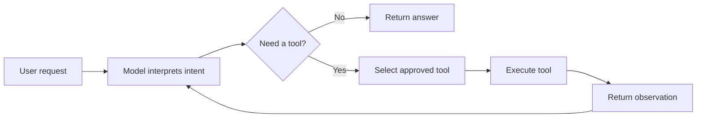

Dynamic routing is valuable when:

- users express the same intention in many different ways;
- the correct tool depends on facts discovered during execution;
- the number of supported tasks is larger than a small routing table;
- multiple tools may be needed in an unpredictable order;
- the agent must ask a clarifying question when required information is missing;
- the system needs to stop once sufficient evidence has been collected;
- new capabilities should be added without rewriting every conversation path.

Dynamic routing is not automatically appropriate. If the workflow is known, legally prescribed, or operationally sensitive, deterministic code or an explicit LangGraph workflow may be safer.

> **Architecture rule**
>
> Give the model freedom only where uncertainty is useful. Keep identity, authorization, irreversible actions, and mandatory business rules deterministic.

---

## 2. Model, chain, agent, and harness

These terms are often mixed together, but they represent different levels of system behavior.

| Concept | Meaning | Typical control model |
|---|---|---|
| Model call | One request to a language model | Application chooses inputs and accepts one output |
| Chain | Predetermined sequence of transformations or calls | Developer controls order |
| Agent | Model chooses actions and tools iteratively | Model controls some next-step decisions |
| Harness | Everything around the model loop | Developer controls tools, prompts, policies, state, middleware, and budgets |

A model is not an agent merely because it can produce reasoning-like text. An agent requires an execution environment and action loop.

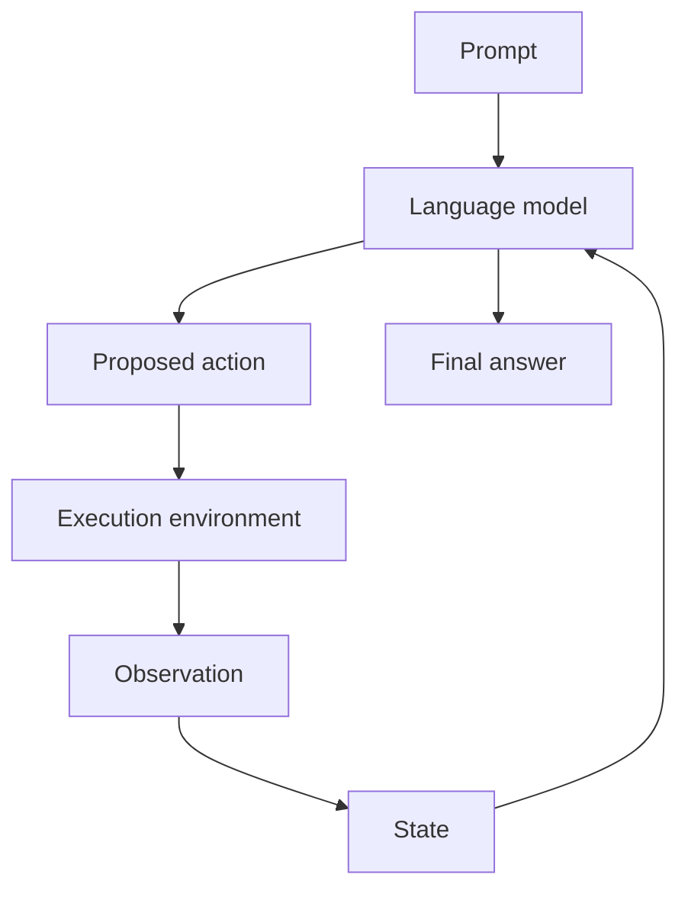

**Supplementary:** Current LangChain documentation defines an agent as a model calling tools in a loop until a task is complete. It describes the surrounding prompt, tools, and middleware as the harness. The main high-level constructor is `create_agent`.

The harness is where production quality lives. Two applications using the same model can behave very differently because their harnesses expose different tools, context, permissions, retries, validation, and stop conditions.

---

## 3. Where LangChain fits in the framework landscape

The board presents four distinct mental models:

| Framework | Mental model | Primary strength |
|---|---|---|
| LangGraph | Workflow as nodes and edges | Explicit control, state, loops, and recovery |
| CrewAI | Team with roles and tasks | Role-based collaboration |
| AutoGen | Specialists communicating | Conversational coordination |
| LangChain agents | Model with a toolbox | Dynamic tool use and configurable agent harnesses |

**Supplementary:** In the current LangChain ecosystem:

- **LangChain agents** provide a high-level, configurable harness.
- **LangGraph** provides the lower-level durable runtime and explicit orchestration primitives beneath LangChain agents.
- **Deep Agents** provide a more batteries-included harness for long-running research or coding work.
- **LangSmith** provides tracing, evaluation, debugging, and operational tooling.

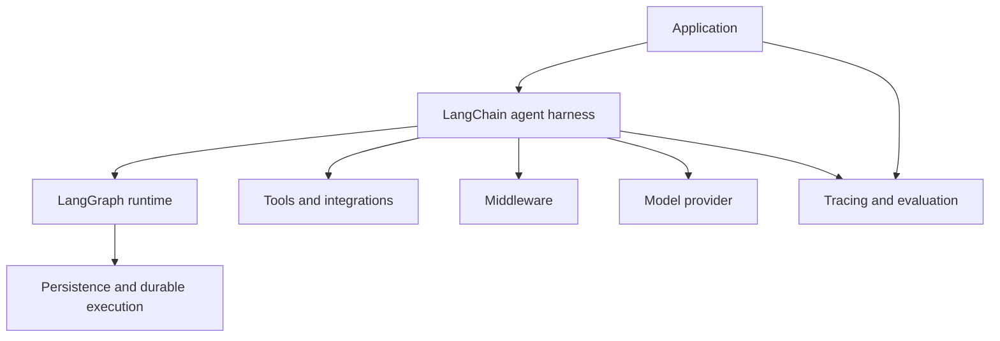

### 3.1 Use LangChain directly when

- one agent with a curated toolbox can solve the task;
- the model should choose tools dynamically;
- the loop is conceptually simple;
- middleware covers required production concerns;
- you want provider flexibility and standard tool abstractions;
- a fully explicit graph would add unnecessary complexity.

### 3.2 Use LangGraph directly when

- routing rules must be explicit and inspectable;
- multiple deterministic and agentic stages must be combined;
- the workflow requires custom cycles, parallel branches, or recovery paths;
- state transitions are central to the application;
- a regulator or operator must understand every allowed path.

### 3.3 Use a multi-agent framework when

- independent specialist roles add measurable value;
- separate tools or permission boundaries map naturally to teams;
- critique, negotiation, or delegation is part of the problem;
- one agent's prompt and toolbox are becoming too broad.

> **Simplicity principle**
>
> Start with one model and no tools. Add retrieval, then tools, then persistence, then explicit orchestration, and only then additional agents when evaluation shows the need.

---

## 4. The `create_agent` mental model

**Supplementary**

At a high level, `create_agent` composes the following elements:

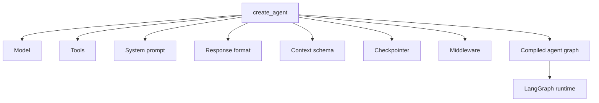

A minimal example is conceptually simple:

```python
from langchain.agents import create_agent
from langchain.tools import tool

@tool
def get_weather(city: str) -> str:
    """Return the current weather for a city."""
    return "Sunny"

agent = create_agent(
    model="provider:model-name",
    tools=[get_weather],
    system_prompt="Use tools when factual external data is required.",
)
```

The important design work is not the constructor call. It is deciding:

- what tools exist;
- which tools this agent can see;
- how each tool is described;
- what context tools receive;
- which actions require approval;
- what counts as completion;
- how output is validated;
- what state persists;
- how failures are handled;
- how trajectories are traced and evaluated.

---

## 5. The model-tool execution loop

The typical agent loop follows a ReAct-like structure: interpret, act, observe, and continue.

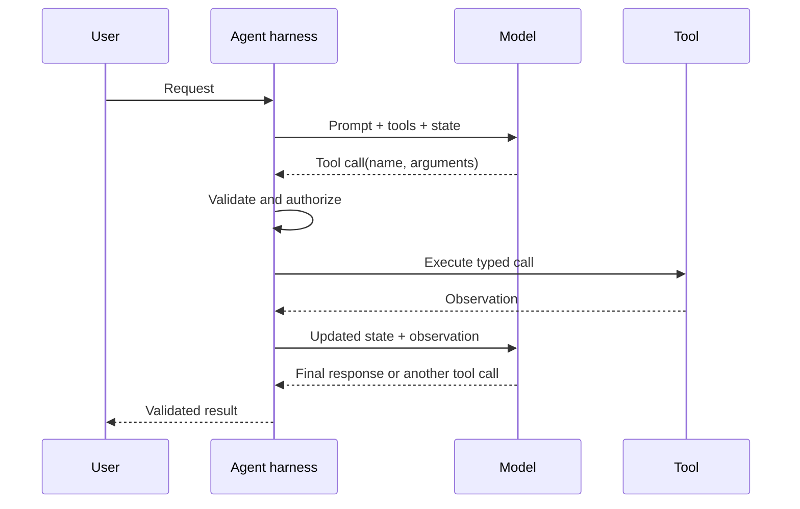

Each loop iteration should be understood as a controlled state transition:

```text
Current state
    -> model decision
    -> proposed tool call
    -> policy validation
    -> execution
    -> normalized observation
    -> updated state
```

### 5.1 Termination

An agent should terminate when one of the following is true:

- the model returns a final response;
- the structured response has been produced and validated;
- the task completion contract is satisfied;
- an iteration, time, token, or cost budget is exhausted;
- a guardrail blocks the request;
- a human rejects a required action;
- the system detects no progress;
- the workflow escalates to a person or another system.

A production agent needs both semantic and mechanical stop conditions.

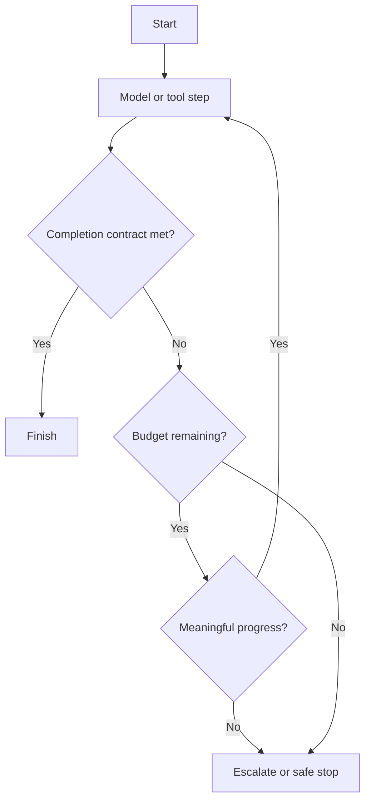

---

## 6. Tools are contracts, not convenient functions

A tool is an external capability exposed to the model. It should be designed as an API contract, not as an arbitrary Python function.

A strong tool contract defines:

- a precise name;
- a clear description;
- typed inputs;
- input constraints;
- authorization behavior;
- side-effect classification;
- timeout and retry policy;
- normalized output;
- error codes;
- audit fields;
- idempotency rules for writes.

### 6.1 Tool description quality

The model uses tool names, descriptions, and schemas to decide what to call.

Weak:

```python
def lookup(value: str) -> str:
    """Look something up."""
```

Better:

```python
def lookup_order(order_id: str) -> str:
    """Retrieve status, item, price, and delivery facts for one authorized order.

    Use this only when the user provides an order identifier or asks about a
    specific order. It does not create, cancel, or modify orders.
    """
```

### 6.2 Narrow tools outperform universal tools

A universal database tool may appear flexible, but it is hard to secure and easy to misuse.

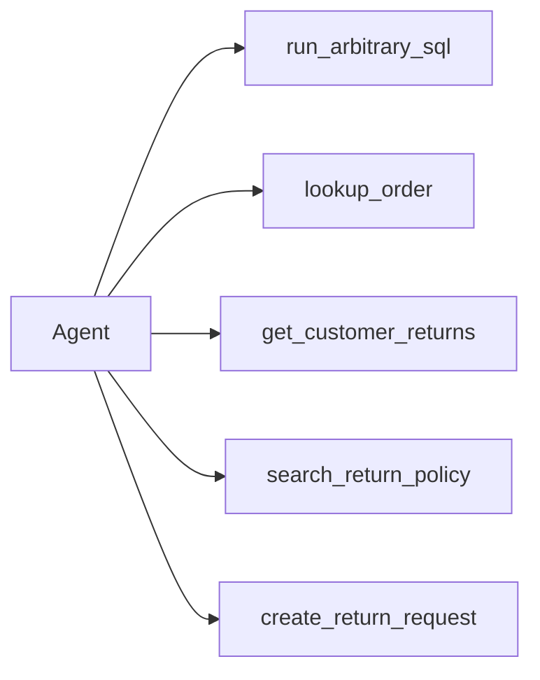

Narrow tools provide:

- smaller argument spaces;
- clearer model selection;
- easier unit testing;
- simpler authorization;
- safer audit trails;
- lower injection risk;
- more meaningful evaluation.

### 6.3 Read and write separation

Read and write operations should usually be different tools.

| Tool | Side effect | Approval recommendation |
|---|---:|---|
| `lookup_order` | No | Usually automatic |
| `search_policy` | No | Usually automatic |
| `estimate_refund` | No | Usually automatic |
| `create_return_request` | Yes | Policy-dependent |
| `issue_refund` | High impact | Human approval or deterministic workflow |

> **Safety rule**
>
> Never hide a write inside a tool whose name or description sounds read-only.

---

## 7. Static, dynamic, and hybrid routing

Tool routing can be implemented at three broad levels.

### 7.1 Static routing

Application code chooses the path.

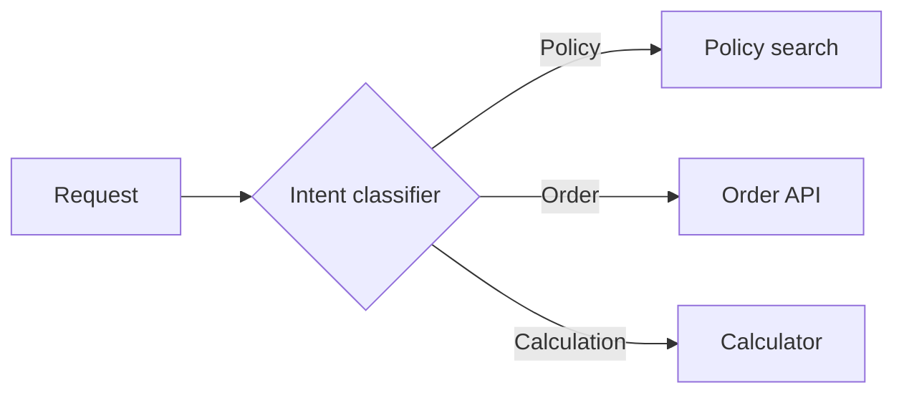

Advantages:

- predictable;
- easy to test;
- low token cost;
- suitable for mandatory workflows.

Limitations:

- brittle for ambiguous language;
- grows complex as intents multiply;
- difficult to adapt when the next step depends on intermediate evidence.

### 7.2 Dynamic routing

The model sees tools and chooses one or more at runtime.

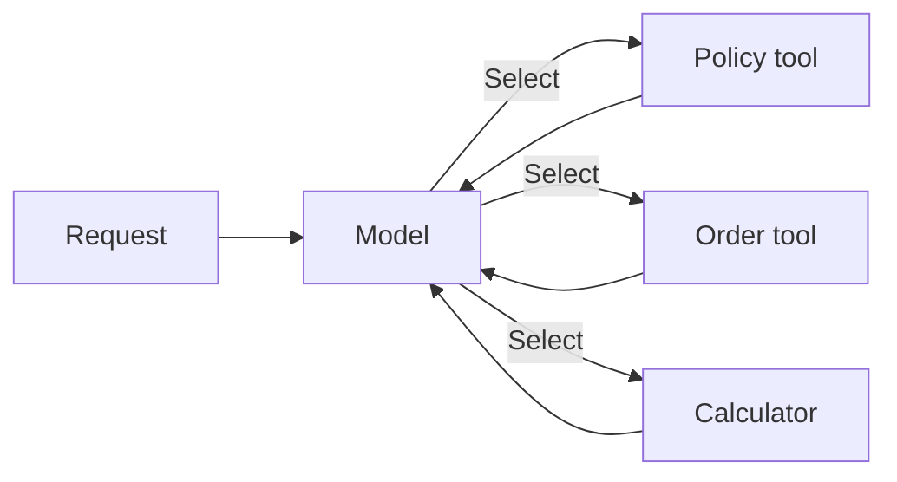

Advantages:

- natural-language flexibility;
- adaptive multi-step execution;
- easier capability extension.

Limitations:

- variable latency and cost;
- wrong-tool risk;
- harder trajectory testing;
- requires stronger guardrails.

### 7.3 Hybrid routing

Deterministic logic narrows the model's options, then the model chooses within the permitted subset.

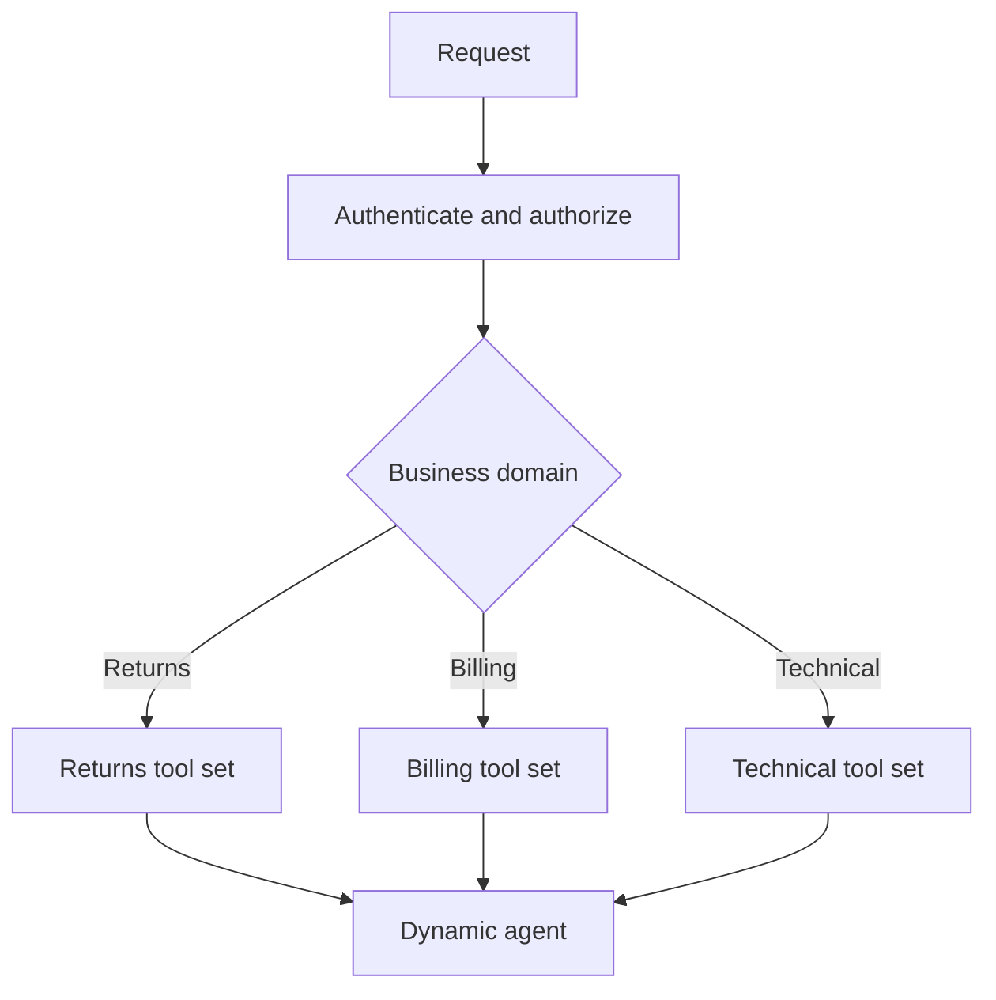

Hybrid routing is often the strongest enterprise pattern because it keeps hard boundaries deterministic while preserving flexibility within a domain.

---

## 8. Runtime context and dependency injection

**Supplementary**

Tools often need authenticated user identity, tenant identity, database connections, locale, feature flags, or environment configuration. These values should not be placed in the natural-language prompt and should not be stored in global variables.

LangChain agents run on the LangGraph runtime. Current APIs support a typed `context_schema` and expose runtime context inside tools through `ToolRuntime`.

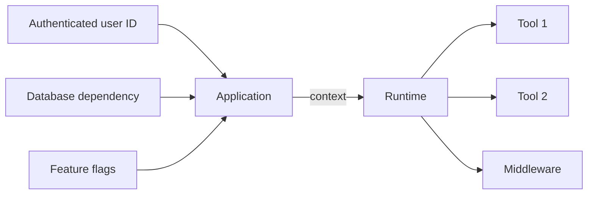

Conceptual example:

```python
from dataclasses import dataclass
from langchain.tools import ToolRuntime, tool

@dataclass
class Context:
    user_id: str
    tenant_id: str

@tool
def lookup_customer(runtime: ToolRuntime[Context]) -> str:
    """Retrieve the authenticated customer's profile."""
    user_id = runtime.context.user_id
    tenant_id = runtime.context.tenant_id
    ...
```

Runtime context should hold trusted per-invocation dependencies. It is different from user-visible conversation state.

| Data type | Example | Correct location |
|---|---|---|
| User message | “Can I return this?” | Agent message state |
| Authenticated user ID | `user-42` | Runtime context |
| Thread ID | Conversation identifier | Invocation config |
| Long-term preference | Preferred response language | Persistent store |
| Order record | Status and price | System of record, accessed through tool |
| Intermediate tool result | Policy excerpt | Agent state |

> **Security rule**
>
> The model may reason about identity-related facts, but it must not be the authority that establishes identity.

---

## 9. State, persistence, and memory

A dynamic agent may need continuity across turns. That requires careful separation of state categories.

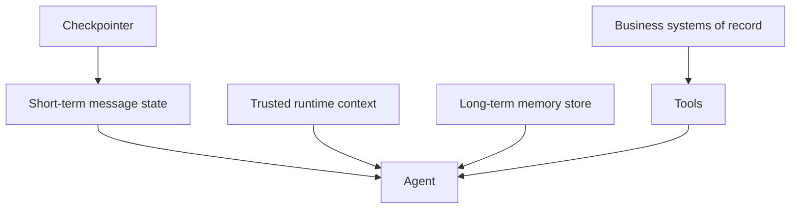

### 9.1 Short-term state

Short-term state includes messages, tool calls, observations, and control metadata for one thread. A checkpointer persists this state so later turns can reuse it.

### 9.2 Runtime context

Context contains per-run trusted dependencies such as user ID, tenant, locale, or service clients.

### 9.3 Long-term memory

A long-term store may hold durable user preferences, prior decisions, or reusable knowledge. Memory writes should be governed rather than automatic.

### 9.4 Business data

Orders, payroll records, clinical data, and tickets belong in systems of record. The agent should access them through authorized tools instead of copying them into unconstrained memory.

### 9.5 Thread identity

When conversation history is persisted, the application should provide a thread identifier. Reusing the same thread continues the context; using a different thread creates isolation.

> **Privacy rule**
>
> Never derive thread identity from free-form user text. Bind it to authenticated application state.

---

## 10. Structured output as an application contract

**Supplementary**

Natural-language responses are useful for people but unreliable for downstream software. An application may require fields such as outcome, confidence, evidence, and next action.

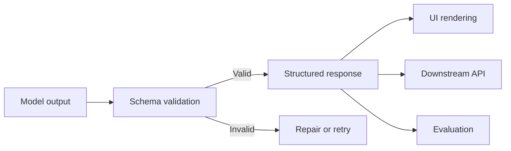

Current LangChain agents support a `response_format` parameter. A schema can be represented by a Pydantic model, dataclass, typed dictionary, or JSON Schema. Validated data is returned in the final state as `structured_response`.

Example schema:

```python
from typing import Literal
from pydantic import BaseModel, Field

class SupportDecision(BaseModel):
    outcome: Literal[
        "eligible",
        "not_eligible",
        "needs_review",
        "need_more_info",
    ]
    explanation: str
    evidence: list[str]
    next_action: str
    confidence: float = Field(ge=0.0, le=1.0)
```

Structured output improves:

- application integration;
- validation;
- UI consistency;
- analytics;
- regression testing;
- policy checks;
- reviewer efficiency.

It does not guarantee factual correctness. A response can be perfectly valid JSON and still be wrong. Schema validation must be combined with grounding and business-rule validation.

---

## 11. Middleware: the extension layer

**Supplementary**

Middleware is the primary customization mechanism around the agent loop. It can intercept or modify execution before or after the agent, model, or tools.

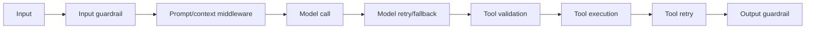

Typical middleware concerns include:

| Concern | Example |
|---|---|
| Context management | Summarize old messages when token limits are approached |
| Dynamic prompts | Add tenant-specific or role-specific instructions |
| Dynamic model selection | Use a smaller model for simple tasks and a stronger model for complex tasks |
| Tool policy | Hide or expose tools based on runtime context |
| Retries | Retry transient model or tool failures |
| Fallbacks | Switch model or capability after failure |
| Call limits | Cap model calls and tool calls |
| Guardrails | Detect PII, injection, unsafe content, or policy violations |
| Human oversight | Pause before high-impact tools |
| Observability | Record timings, choices, and outcomes |

Middleware should be composable and single-purpose. Avoid one large middleware component that mixes security, prompting, telemetry, and business logic.

---

## 12. Guardrails and human-in-the-loop actions

The board emphasizes that autonomous systems need boundaries, human override, and escalation. LangChain's middleware model provides insertion points for these controls.

### 12.1 Deterministic and model-based guardrails

Deterministic guardrails use rules, regex, allowlists, schemas, and explicit checks. Model-based guardrails use a model or classifier to assess semantic risk.

| Approach | Strength | Weakness |
|---|---|---|
| Deterministic | Fast, explainable, repeatable | May miss nuanced violations |
| Model-based | Handles subtle language and context | Adds latency, cost, and uncertainty |
| Combined | Broad and layered protection | More operational complexity |

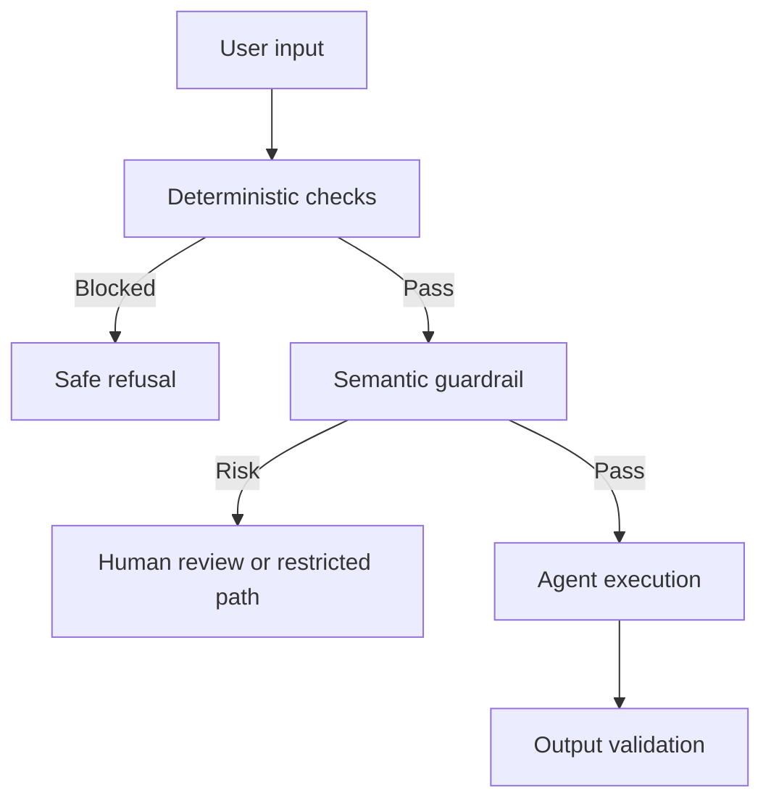

### 12.2 Human approval for tools

**Supplementary:** Current LangChain human-in-the-loop middleware can pause an agent before configured tool calls. State is persisted through a checkpointer so the execution can resume later. A reviewer may approve, edit, reject, or respond, depending on the configured policy.

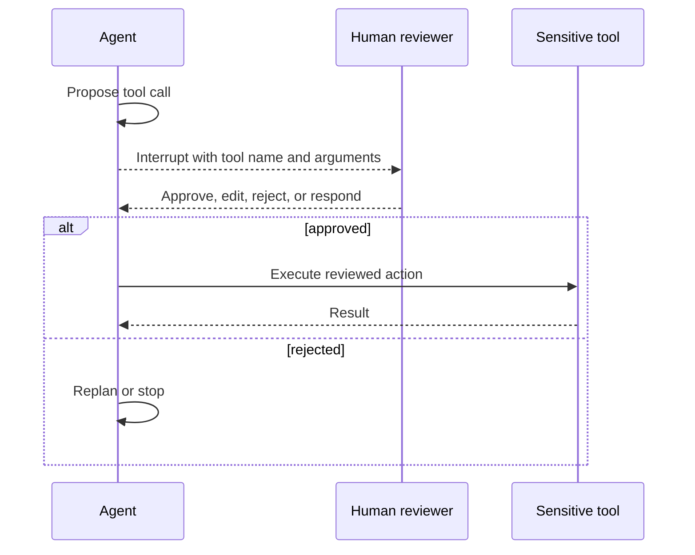

A critical design detail is that approval should bind to the exact tool and arguments reviewed. The agent must not treat approval of one action as permission for a materially different action.

### 12.3 Interrupt, reset, and abort

The board distinguishes three human controls:

- **Interrupt:** pause execution for review or additional input.
- **Reset:** clear unsafe or incorrect state and restart from a safe point.
- **Abort:** stop execution completely and block the action.

These controls belong in the application layer and runtime, not only in the prompt.

---

## 13. Fault tolerance and bounded retries

Tool-enabled agents face failures from models, APIs, networks, schemas, credentials, rate limits, and business rules.

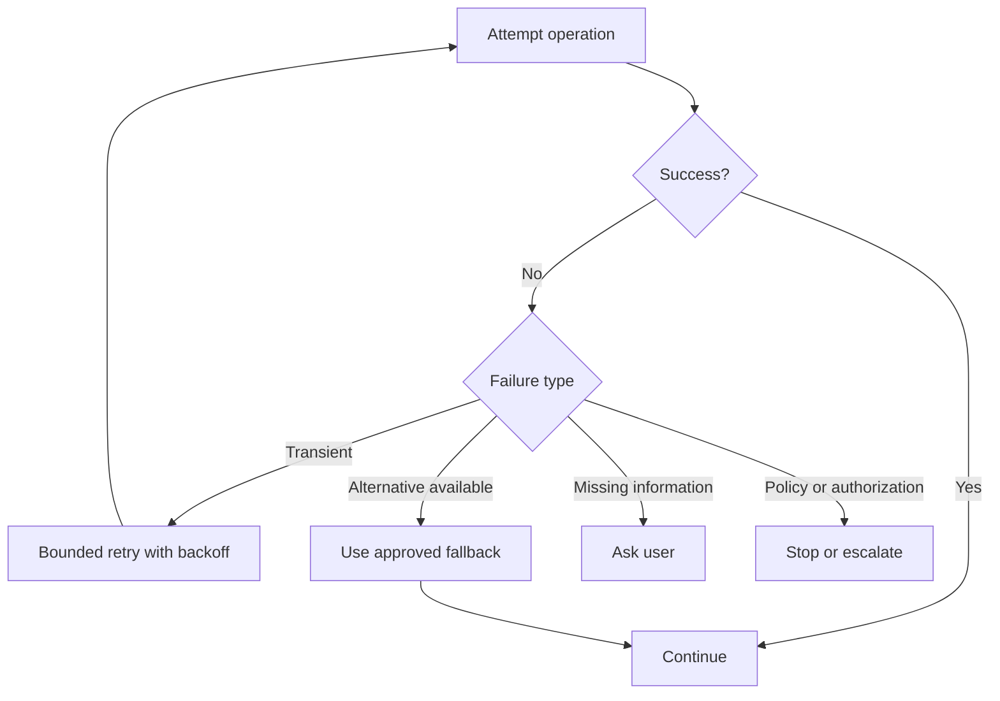

**Supplementary:** Current LangChain middleware includes model- and tool-retry components. Even when framework retries are available, the application should classify failures.

| Failure | Recommended response |
|---|---|
| Timeout | Retry with backoff within budget |
| Rate limit | Delay, switch approved provider, or return partial status |
| Invalid tool arguments | Repair once or ask for missing data |
| Authorization failure | Do not retry; deny or escalate |
| Business-rule rejection | Explain rule; do not treat as technical error |
| Ambiguous write result | Reconcile against system of record before retrying |
| Persistent dependency outage | Use fallback, cached data, or human escalation |

### 13.1 Retry budgets

Retries should be limited by:

- maximum attempts;
- elapsed time;
- token usage;
- monetary cost;
- side-effect risk;
- progress made.

A retry that repeats the same action with unchanged arguments and unchanged conditions is not recovery. It is a loop.

---

## 14. Retrieval as a tool

LangChain agents often use retrieval through tools. The agent decides whether retrieval is required and may combine it with APIs or calculations.

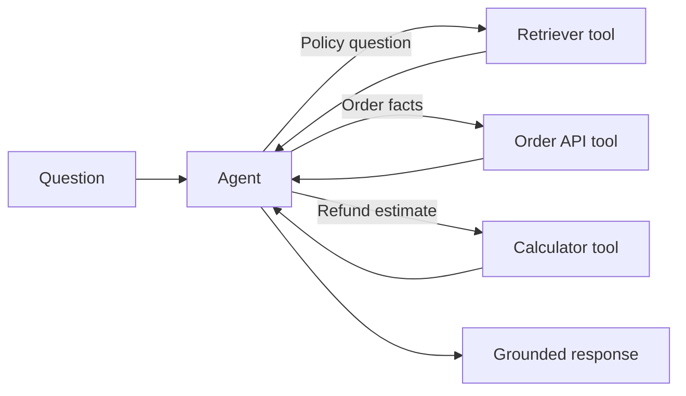

Retrieval tools should return:

- content;
- source identifier;
- document version;
- effective date;
- authorization scope;
- confidence or score where useful.

The model should not be allowed to treat stale, unauthorized, or superseded text as authoritative merely because it was retrieved.

### 14.1 Retrieval decision policy

An agent should retrieve when:

- the answer depends on private or current information;
- the model's pretraining cannot be trusted as the authority;
- citations are required;
- the question concerns organizational policy;
- a tool can provide a direct system-of-record answer.

It should not retrieve when:

- the task is purely transformational and all needed text is provided;
- retrieval would expose data outside the user's authorization scope;
- the query can be answered deterministically from validated input.

---

## 15. Tool-set design and selection quality

The number and similarity of tools strongly affect routing quality.

### 15.1 The oversized-toolbox problem

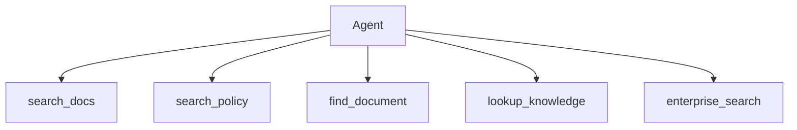

Overlapping tools confuse the model. Consolidate tools or make their boundaries explicit.

### 15.2 Tool grouping

Tools may be grouped by:

- business domain;
- permission level;
- read vs write behavior;
- latency class;
- data sensitivity;
- user role;
- workflow stage.

A router or middleware layer can expose only the relevant group.

### 15.3 Tool-choice evaluation

Create an evaluation dataset containing:

```text
request
expected tool or allowed tool set
forbidden tools
required arguments
expected sequence constraints
completion criteria
```

Metrics may include:

- tool-selection accuracy;
- argument accuracy;
- unnecessary tool-call rate;
- forbidden tool-call rate;
- tool-call success rate;
- average calls per completed task;
- path efficiency;
- escalation correctness.

---

## 16. Streaming and application-layer experience

Agent execution may take longer than a single model response. The application should show useful progress without exposing private chain-of-thought.

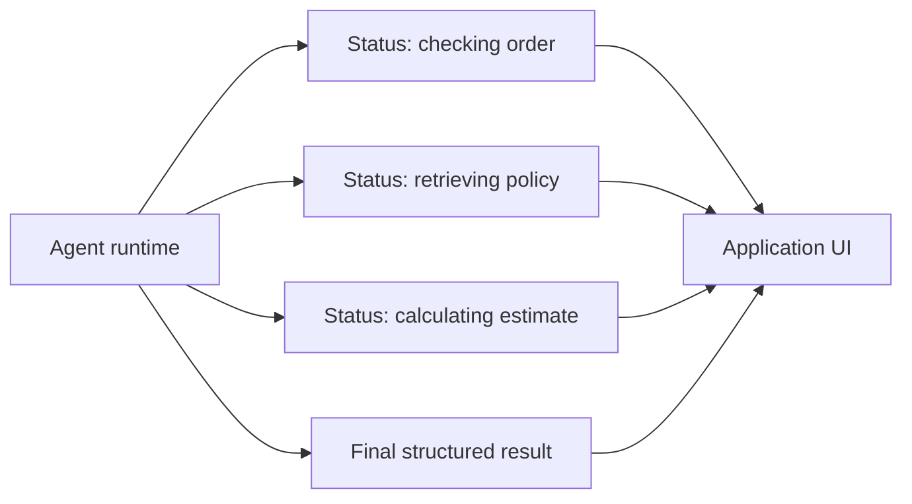

Useful progress events include:

- task accepted;
- tool started;
- source retrieved;
- waiting for approval;
- retry in progress;
- partial result available;
- completed;
- escalated.

Do not stream:

- credentials;
- raw sensitive tool outputs;
- hidden policy rules;
- model chain-of-thought;
- data belonging to another tenant;
- unredacted PII.

The UX should preserve user control with cancel, retry, edit, and escalate actions where appropriate.

---

## 17. Observability and evaluation

A production agent should be evaluated at three levels.

### 17.1 Step-level evaluation

- Was the tool allowed?
- Were arguments valid?
- Was the call authorized?
- Did execution succeed?
- Was the observation normalized correctly?

### 17.2 Trajectory evaluation

- Were the chosen tools relevant?
- Was the sequence efficient?
- Did the agent repeat actions?
- Did it retrieve enough evidence?
- Did it stop at the right time?
- Did it escalate appropriately?

### 17.3 Final-outcome evaluation

- Was the answer correct?
- Was it grounded?
- Did it follow instructions?
- Was the structured output valid?
- Was the business outcome completed?
- Was the user experience acceptable?

```mermaid
flowchart LR
    TRACE[Execution trace] --> STEP[Step metrics]
    TRACE --> PATH[Trajectory metrics]
    TRACE --> OUT[Outcome metrics]
    STEP --> DASH[Evaluation dashboard]
    PATH --> DASH
    OUT --> DASH
```

Important operational metrics include:

| Category | Metrics |
|---|---|
| Quality | Task completion, correctness, grounding, instruction adherence |
| Tooling | Tool accuracy, argument accuracy, failure rate, unnecessary calls |
| Safety | Block rate, approval rate, rejected-action rate, policy violations |
| Reliability | Retry success, fallback success, escalation rate |
| Performance | End-to-end latency, model latency, tool latency, throughput |
| Cost | Tokens, model calls, tool charges, cost per successful task |
| UX | Abandonment, user correction, CSAT, repeat use |

> **Observability rule**
>
> Verbose logs are not observability. Useful observability connects a trace to a decision, outcome, failure class, latency, and cost.

---

## 18. Production reference architecture

The following architecture combines the board's application, orchestration, tool, state, guardrail, and monitoring layers with a LangChain agent harness.

```mermaid
flowchart TB
    U[User] --> APP[Application layer]
    APP --> AUTH[Authentication and authorization]
    AUTH --> ROUTER[Domain router]
    ROUTER --> AGENT[LangChain agent harness]

    AGENT --> PROMPT[Prompt and context policy]
    AGENT --> MW[Middleware]
    AGENT --> STATE[Thread state and checkpointer]
    AGENT --> STORE[Long-term store]
    AGENT --> MODEL[Approved model gateway]

    AGENT --> READ[Read-only tools]
    AGENT --> WRITE[Write tools]
    READ --> KB[Knowledge base]
    READ --> CRM[CRM / order system]
    READ --> DATA[Analytics / database]
    WRITE --> HITL[Approval middleware]
    HITL --> SYS[Transactional systems]

    AGENT --> TRACE[Tracing and evaluation]
    TRACE --> MON[Monitoring and alerts]
    AGENT --> RESP[Validated structured response]
    RESP --> APP
```

Key properties:

1. Authentication occurs before the model sees the request.
2. A deterministic router limits the available domain and tool set.
3. Trusted identity is injected through runtime context.
4. Read and write tools are separated.
5. High-impact tools pass through approval policy.
6. Thread state is persisted independently from systems of record.
7. Final output is schema-validated.
8. Traces capture model decisions, tool calls, duration, retries, and outcomes.
9. Evaluation and monitoring operate continuously.
10. The application presents evidence, confidence, and user controls.

---

## 19. Worked example: return-policy support agent

Consider the user question:

> Can I return order ORD-1001? Tell me the estimated refund and what I should do next.

The agent has three read-only tools:

- `lookup_order`
- `search_return_policy`
- `estimate_refund`

It does not have a tool that creates the return. This is a deliberate autonomy boundary.

```mermaid
sequenceDiagram
    participant U as User
    participant A as Agent
    participant O as Order tool
    participant P as Policy tool
    participant R as Refund tool

    U->>A: Can I return ORD-1001?
    A->>O: lookup_order(ORD-1001)
    O-->>A: Delivered, unused, 8 days, $84.50
    A->>P: search_return_policy(return eligibility)
    P-->>A: 30-day unused-item policy
    A->>R: estimate_refund(ORD-1001)
    R-->>A: $84.50 excluding shipping
    A-->>U: Structured eligibility decision and next action
```

### 19.1 Completion contract

The agent should not finish until it has:

- verified the order exists;
- verified the order belongs to the authenticated user;
- retrieved the correct regional policy;
- compared order facts with policy conditions;
- estimated the refund if applicable;
- stated that no return has yet been created;
- produced a validated `SupportDecision`.

### 19.2 Safety boundary

The model cannot override ownership checks because those checks occur inside the order tool using trusted runtime context.

```mermaid
flowchart LR
    CLAIM[User claims order ownership] --> M[Model]
    CTX[Authenticated user ID] --> TOOL[Order tool]
    M --> TOOL
    TOOL --> CHECK{Record owner matches context?}
    CHECK -->|Yes| DATA[Return order facts]
    CHECK -->|No| DENY[Access denied]
```

### 19.3 Why the agent is read-only

A recommendation and a transaction are different risk classes. The first version can answer eligibility questions safely. A later version may add `create_return_request`, but that tool should require confirmation, idempotency, an exact reviewed payload, and audit logging.

---

## 20. Runnable implementation

The repository includes:

```text
examples/18-langchain/
├── dynamic_support_agent.py
└── requirements.txt
```

The example demonstrates:

- `create_agent`;
- three dynamically selected tools;
- typed `RequestContext`;
- `ToolRuntime` access to authenticated identity and region;
- thread persistence with `InMemorySaver`;
- model and tool retry middleware;
- Pydantic structured output;
- a read-only autonomy boundary.

Run it with:

```bash
cd examples/18-langchain
python -m venv .venv
source .venv/bin/activate
pip install -r requirements.txt
export OPENAI_API_KEY="..."
export LC_MODEL="openai:gpt-5.5"
python dynamic_support_agent.py
```

Use a supported model identifier for your configured provider. The code intentionally uses in-memory data so that the agent pattern is visible without requiring a real order-management integration.

> **Production warning**
>
> `InMemorySaver` is suitable for examples and local testing. Production systems should use durable, tenant-aware persistence and explicit retention controls.

---

## 21. Adding a write tool safely

Suppose the next version adds `create_return_request`.

The unsafe design is:

```text
Model decides -> create return immediately
```

A stronger design is:

```mermaid
flowchart TD
    A[Agent proposes return request] --> V[Validate order, policy, and arguments]
    V --> PREVIEW[Render exact action preview]
    PREVIEW --> H{Authorized human approves?}
    H -->|No| REJECT[Reject and return feedback]
    H -->|Edit| EDIT[Bind edited arguments]
    H -->|Yes| KEY[Create idempotency key]
    EDIT --> KEY
    KEY --> EXEC[Execute write tool]
    EXEC --> CONFIRM[Read-after-write confirmation]
    CONFIRM --> AUDIT[Audit outcome]
```

The write tool should require:

- a verified order ID;
- authenticated user ownership;
- eligible policy status;
- explicit reason;
- exact refund amount or an approved calculation reference;
- idempotency key;
- reviewer identity when approval is required.

The tool should return a structured result with request ID, status, timestamp, and reconciliation fields.

---

## 22. Common failure modes

### 22.1 Vague tool descriptions

**Symptom:** The model chooses the wrong tool or avoids tools entirely.

**Fix:** Clarify purpose, trigger conditions, exclusions, inputs, and side effects.

### 22.2 Too many overlapping tools

**Symptom:** Routing becomes inconsistent.

**Fix:** Consolidate capabilities or expose smaller domain-specific tool sets.

### 22.3 Trusting prompt-only permissions

**Symptom:** A prompt says “do not access other users' data,” but tools accept arbitrary user IDs.

**Fix:** Enforce authorization inside tools using authenticated runtime context.

### 22.4 Hidden writes

**Symptom:** A seemingly harmless tool modifies a business system.

**Fix:** Separate read and write tools and classify side effects explicitly.

### 22.5 Unbounded loops

**Symptom:** The model repeatedly calls the same tool.

**Fix:** Add call budgets, no-progress detection, state comparisons, and escalation.

### 22.6 Treating tool output as trusted instructions

**Symptom:** Retrieved content manipulates the model into calling unsafe tools.

**Fix:** Treat tool output as data, isolate instructions, scan for injection, and constrain capabilities.

### 22.7 Persisting too much state

**Symptom:** Sensitive or stale information contaminates future turns.

**Fix:** Define schemas, retention, summarization, deletion, and memory-write policies.

### 22.8 Invalid structured output

**Symptom:** Downstream application logic breaks.

**Fix:** Use validated schemas and handle repair or failure explicitly.

### 22.9 Retrying policy failures

**Symptom:** The agent repeatedly attempts an unauthorized operation.

**Fix:** Classify authorization and business-rule failures as non-retryable.

### 22.10 Using an agent for a fixed form workflow

**Symptom:** Cost, latency, and variability increase without benefit.

**Fix:** Use deterministic code or a graph workflow for known steps.

---

## 23. Framework decision guide

| Requirement | Best starting point |
|---|---|
| One model, no external actions | Direct model call |
| Fixed sequence of model and code steps | Chain or normal application code |
| One agent choosing among a modest tool set | LangChain `create_agent` |
| Explicit branching, loops, checkpoints, or recovery | LangGraph |
| Long-running research/coding harness with filesystem and subagents | Deep Agents |
| Role-based content or research team | CrewAI |
| Open-ended conversational specialist team | AutoGen |
| Highly regulated transaction workflow | Deterministic workflow plus narrowly bounded agent components |

The frameworks are not mutually exclusive. A LangGraph application can contain a LangChain agent node. A LangChain agent can expose a tool that invokes a deterministic workflow. A multi-agent system can use LangChain-based specialists.

```mermaid
flowchart TD
    NEED[System need] --> FIXED{Workflow fixed?}
    FIXED -->|Yes| GRAPH{Complex state or recovery?}
    GRAPH -->|No| CODE[Code or chain]
    GRAPH -->|Yes| LG[LangGraph]
    FIXED -->|No| TEAM{Multiple justified specialists?}
    TEAM -->|No| LC[LangChain agent]
    TEAM -->|Role/task team| CREW[CrewAI]
    TEAM -->|Conversation or debate| AUTO[AutoGen]
```

---

## 24. Hands-on lab: project coordination agent

Build an agent that answers:

> What are the top blockers in the current sprint, who owns them, and what should happen next?

### 24.1 Required tools

1. `get_open_sprint_tickets`
2. `get_ticket_details`
3. `search_team_messages`
4. `get_meeting_notes`

### 24.2 Required output

```json
{
  "blockers": [
    {
      "blocker": "string",
      "owner": "string",
      "source": ["string"],
      "impact": "string",
      "next_action": "string",
      "confidence": 0.0
    }
  ],
  "missing_sources": ["string"],
  "overall_status": "on_track | at_risk | blocked"
}
```

### 24.3 Constraints

- The agent must state when Jira, Slack, Teams, or meeting notes are unavailable.
- It must not invent ownership.
- It must cite ticket IDs and message references.
- It must not update tickets.
- It must stop after two failed attempts to access the same source.
- It must distinguish confirmed blockers from possible risks.

### 24.4 Extension

Add a write tool named `post_sprint_update`. Require human approval and show the exact message and destination before execution.

---

## 25. Production design checklist

### Scope

- [ ] Is an agent actually required?
- [ ] Is the task boundary narrow and measurable?
- [ ] Is the completion contract explicit?
- [ ] Are autonomy levels documented?

### Tools

- [ ] Does every tool have a precise description and typed schema?
- [ ] Are read and write operations separate?
- [ ] Is authorization enforced inside each tool?
- [ ] Are outputs normalized?
- [ ] Are writes idempotent?
- [ ] Are overlapping tools eliminated?

### State and context

- [ ] Is authenticated context injected outside the prompt?
- [ ] Are thread state, memory, and system-of-record data separated?
- [ ] Is tenant isolation enforced?
- [ ] Are retention and deletion policies defined?

### Safety

- [ ] Are input, output, tool, and policy guardrails implemented?
- [ ] Are sensitive tools approval-gated?
- [ ] Can a user interrupt, reset, or abort?
- [ ] Are prompt injection and tool-output injection tested?

### Reliability

- [ ] Are failure classes explicit?
- [ ] Are retries bounded?
- [ ] Are no-progress loops detected?
- [ ] Are fallback and escalation paths defined?
- [ ] Are ambiguous write outcomes reconciled?

### Evaluation

- [ ] Is there a tool-routing test set?
- [ ] Are tool arguments evaluated?
- [ ] Are trajectories traced?
- [ ] Are final outputs grounded and schema-validated?
- [ ] Are latency, token use, and cost monitored?

---

## 26. Knowledge checks

1. What is the difference between an agent and an agent harness?
2. Why can a narrow tool be safer than a universal database tool?
3. When is static routing preferable to model-based routing?
4. What is the purpose of runtime context?
5. Why should authenticated user identity not be inferred from prompt text?
6. How does a checkpointer differ from a long-term memory store?
7. What does structured output solve, and what does it not solve?
8. Why should write operations be separated from read operations?
9. What conditions should terminate an agent loop?
10. What information should be captured for tool-choice evaluation?
11. Why is retrying an authorization failure usually incorrect?
12. When should you move from LangChain `create_agent` to LangGraph?

---

## 27. Interview questions

### Beginner

1. What problem does LangChain solve?
2. What is a tool-calling agent?
3. What information does a tool schema provide to a model?
4. What is dynamic tool routing?
5. What is structured output?

### Intermediate

1. How would you prevent an agent from accessing another user's order?
2. How would you evaluate whether an agent selected the correct tool?
3. How would you add conversation persistence?
4. How would you prevent an agent from looping indefinitely?
5. How would you design tools for a return-policy assistant?
6. What is middleware, and where would you use it?
7. How would you add approval before sending email?

### Senior

1. Design a multi-tenant LangChain agent platform with per-tenant tools and policies.
2. Explain how you would separate runtime context, thread state, long-term memory, and business records.
3. Design an idempotent tool-execution layer for financial actions.
4. How would you test tool routing under prompt injection and adversarial inputs?
5. How would you migrate a prototype agent into an explicit LangGraph workflow?
6. How would you choose between LangChain, LangGraph, CrewAI, and AutoGen for an enterprise research system?
7. How would you create an evaluation framework that scores both trajectory efficiency and final business outcome?

---

## 28. Chapter summary

LangChain agents implement the board's “assistant with a toolbox” pattern. A model receives a curated set of tools and chooses among them in a loop until it can satisfy a completion contract or must stop.

The most important lessons are:

1. The harness matters more than the constructor call.
2. Tools must be narrow, typed, authorized, observable contracts.
3. Deterministic boundaries should surround model-driven choices.
4. Runtime context should carry trusted identity and dependencies.
5. Thread state, long-term memory, and systems of record are different things.
6. Structured output creates an application contract but does not guarantee truth.
7. Middleware adds context engineering, retries, guardrails, and approval controls.
8. Human review is essential for high-impact tools.
9. Retries, loops, cost, and latency require explicit budgets.
10. Tool selection and the full trajectory must be evaluated, not only the final answer.
11. Use LangChain for a configurable dynamic agent harness; move to LangGraph when control flow itself becomes the main engineering problem.
12. The safest production pattern is usually hybrid: deterministic authentication and routing, dynamically selected read tools, tightly governed writes, and continuous evaluation.

---

## References and further reading

### Primary board source

- Uploaded Agentic AI board export, especially framework comparison, framework patterns, tool routing, orchestration, memory, state, guardrails, evaluation, and human-control sections [Board, pp. 12-39].

### Supplementary official documentation

- LangChain overview: <https://docs.langchain.com/oss/python/langchain/overview>
- LangChain agents: <https://docs.langchain.com/oss/python/langchain/agents>
- LangChain structured output: <https://docs.langchain.com/oss/python/langchain/structured-output>
- LangChain runtime context: <https://docs.langchain.com/oss/python/langchain/runtime>
- LangChain guardrails: <https://docs.langchain.com/oss/python/langchain/guardrails>
- LangChain human-in-the-loop: <https://docs.langchain.com/oss/python/langchain/human-in-the-loop>
- LangChain Python reference: <https://reference.langchain.com/python/langchain/agents>
