# Chapter 19 - Orchestration, Routing, and Shared State

> **Source basis:** The board defines orchestration as the layer that classifies a request, selects an agent or tool, executes the next step, stores state, validates the result, and either returns, retries, replans, or escalates. It illustrates an employee HR system in which an authenticated request reaches an orchestrator that coordinates policy, calendar, and payroll specialists [Board, pp. 15-17]. It also links orchestration to persistent state, tool routing, failure recovery, observability, human controls, and the broader application architecture [Board, pp. 25, 28-32, 35-39]. This chapter preserves that framing and expands it into a production engineering guide. Material on capability registries, idempotency, sagas, route confidence, event-driven execution, and orchestration evaluation is **Supplementary**.

---

## Learning objectives

By the end of this chapter, you should be able to:

1. Explain why orchestration is distinct from model reasoning, tool execution, and the user interface.
2. Describe the responsibilities of an orchestration layer.
3. Compare deterministic, model-based, and hybrid routing.
4. Design a capability registry that represents agents, tools, permissions, costs, and constraints.
5. Create typed route decisions rather than relying on unstructured model text.
6. Separate request context, workflow state, business-system state, memory, and audit history.
7. Coordinate sequential, parallel, conditional, and human-gated workflows.
8. Apply retries, fallbacks, compensation, idempotency, and escalation safely.
9. Propagate identity and authorization through the orchestration path.
10. Prevent cross-tenant data leakage and confused-deputy failures.
11. Design shared state for multiple agents without turning it into an uncontrolled transcript.
12. Measure route accuracy, completion, latency, cost, and recovery quality.
13. Identify common orchestration anti-patterns.
14. Design an enterprise HR assistant with policy, calendar, and payroll capabilities.
15. Implement a small dependency-free orchestration router in Python.

---

## 1. Why orchestration exists

An agent can reason about a task, but enterprise execution requires more than reasoning. A user request may involve several systems, permissions, dependencies, and failure paths. Consider this request:

> "Can I carry over my remaining leave, and can you find a free thirty-minute slot with my manager next week?"

A useful system must do at least the following:

1. authenticate the employee;
2. determine that the request contains two subgoals;
3. retrieve the applicable leave policy;
4. identify the employee's region, role, and leave plan;
5. query the employee and manager calendars;
6. run independent checks in parallel where safe;
7. combine the results into one coherent response;
8. avoid exposing calendar details the user is not allowed to see;
9. record which systems and sources were used;
10. ask for clarification or escalate if critical information is missing.

The language model should not directly own all of these responsibilities. The **orchestration layer** coordinates them.

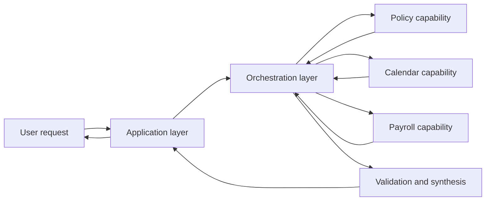

The board summarizes the orchestration lifecycle as:

```text
User request
    ↓
Classify task
    ↓
Choose agent / tool / workflow
    ↓
Execute step
    ↓
Store state
    ↓
Return result or replan
```

That simple loop hides several engineering decisions:

- Who is allowed to invoke each capability?
- Which route is deterministic and which route may be model-selected?
- What data is trusted?
- What happens if one branch succeeds and another fails?
- How does the workflow resume after a pause?
- How are duplicate side effects prevented?
- How is the full trajectory audited?

Orchestration is the control plane that answers those questions.

> **Key idea**
>
> A model proposes what might happen next. The orchestrator decides what is allowed to happen next, records what did happen, and determines how execution continues.

---

## 2. The layers of an agentic application

The board shows a layered architecture in which the user interacts with an application layer above orchestration, frameworks, tools, and guardrails. Keeping these responsibilities separate makes the system easier to secure, test, and evolve.

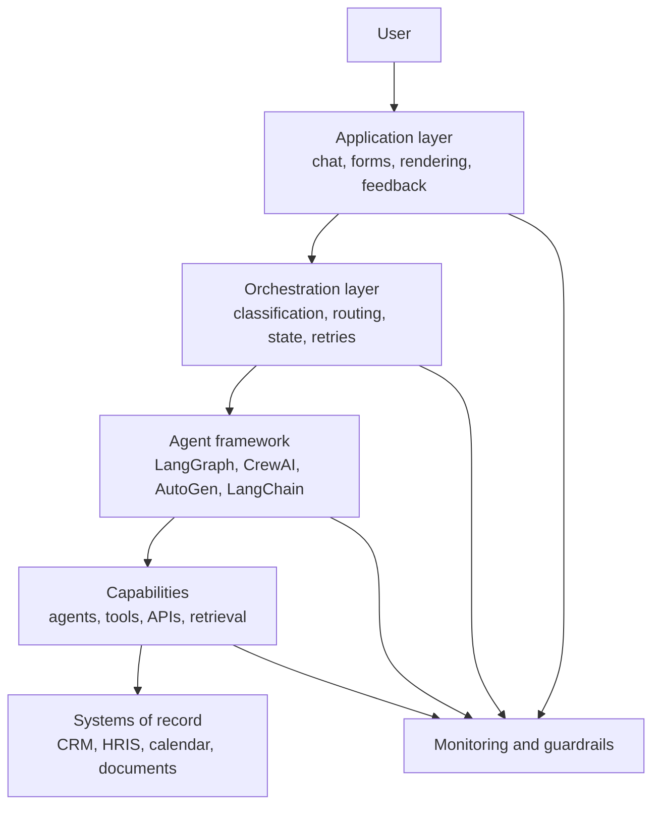

### 2.1 Application layer

The application layer handles:

- authentication entry points;
- sessions and conversation surfaces;
- chat, forms, dashboards, and approval screens;
- rendering citations, confidence, progress, and errors;
- user edits, retries, interrupts, resets, and aborts;
- feedback collection and telemetry.

It should not contain deep workflow logic scattered across UI handlers.

### 2.2 Orchestration layer

The orchestration layer handles:

- intent and task classification;
- decomposition and route selection;
- capability discovery;
- state transitions;
- scheduling and dependency management;
- retries, fallbacks, and escalation;
- human-approval gates;
- merge and synthesis;
- audit events and execution budgets.

### 2.3 Agent framework

The framework supplies execution primitives such as:

- graph nodes and edges;
- role-based crews;
- conversational teams;
- dynamic tool loops;
- checkpointers, stores, and interrupts.

A framework implements orchestration mechanics, but it does not decide the business architecture by itself.

### 2.4 Capability layer

A capability is something the system can do, such as:

- search approved policy documents;
- read a calendar;
- calculate leave balance;
- update a ticket;
- draft a response;
- request human approval.

Capabilities may be implemented as tools, agents, deterministic services, workflows, or human tasks.

### 2.5 Systems of record

The systems of record remain authoritative. Examples include:

- HRIS;
- payroll database;
- CRM;
- ticketing system;
- document repository;
- calendar service;
- laboratory information system.

The orchestration state is not a substitute for the source system.

### 2.6 Monitoring and guardrails

Monitoring and guardrails span every layer. They include:

- input validation;
- policy enforcement;
- authorization checks;
- output filtering;
- tool-call limits;
- anomaly detection;
- trace capture;
- human escalation.

---

## 3. Core responsibilities of an orchestrator

The board lists several responsibilities: manage reasoning and actions, schedule tasks, maintain state, handle errors, and provide observability. In production, these responsibilities can be formalized.

| Responsibility | Question answered | Example |
|---|---|---|
| Classification | What kind of request is this? | Policy question, calendar action, payroll transaction |
| Planning | What steps are required? | Fetch leave plan, retrieve policy, query calendar |
| Routing | Which capability should perform each step? | Policy retriever vs calendar API |
| Scheduling | In what order can steps run? | Retrieve policy and calendar slots in parallel |
| State management | What is known and what remains? | Employee region known; manager identity unresolved |
| Policy enforcement | Is this action allowed? | Payroll update requires HR approval |
| Error handling | What happens when a step fails? | Retry calendar call, then return partial answer |
| Synthesis | How are outputs combined? | Merge policy answer and available slots |
| Observability | What happened and why? | Route decision, tool args, duration, result status |
| Escalation | When must a human take over? | Ambiguous policy or high-impact write |

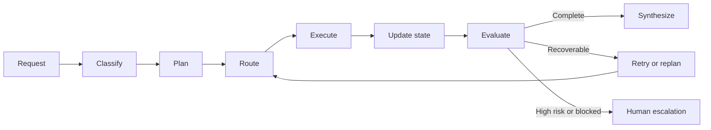

A common mistake is to implement all these responsibilities in one giant prompt. That produces a system that is difficult to test, unsafe to extend, and nearly impossible to audit. Strong designs expose each responsibility as a separate contract or stage.

---

## 4. Routing models

Routing decides which capability should receive a task. There are three broad approaches.

### 4.1 Deterministic routing

Deterministic routing uses explicit rules, such as:

```text
if action == "update_payroll":
    route = "payroll_workflow"
elif intent == "policy_question":
    route = "policy_retriever"
```

Use deterministic routing when:

- the intent set is small and stable;
- compliance requires an inspectable rule;
- the action has financial, legal, or safety impact;
- latency must be extremely predictable;
- high precision matters more than conversational flexibility.

Advantages:

- easy to explain;
- inexpensive;
- fast;
- testable with ordinary unit tests;
- resistant to prompt manipulation.

Limitations:

- brittle with natural-language variation;
- difficult to maintain when intents proliferate;
- cannot reason well about compound requests.

### 4.2 Model-based routing

A model-based router classifies or selects a capability using natural-language descriptions and current context.

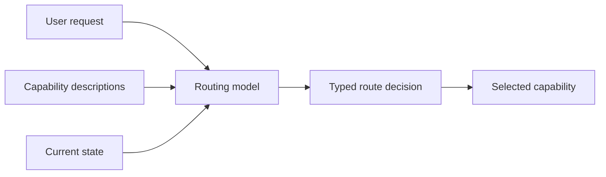

Use model-based routing when:

- users phrase requests in many ways;
- the request may be compound or ambiguous;
- capability descriptions change more often than application code;
- semantic understanding is required.

Risks:

- non-determinism;
- route hallucination;
- choosing a capability outside the user's permissions;
- susceptibility to prompt injection;
- extra latency and cost.

The router must not be allowed to invent capability names. It should choose only from a supplied registry and return a typed decision.

### 4.3 Hybrid routing

Hybrid routing combines deterministic boundaries with model flexibility.

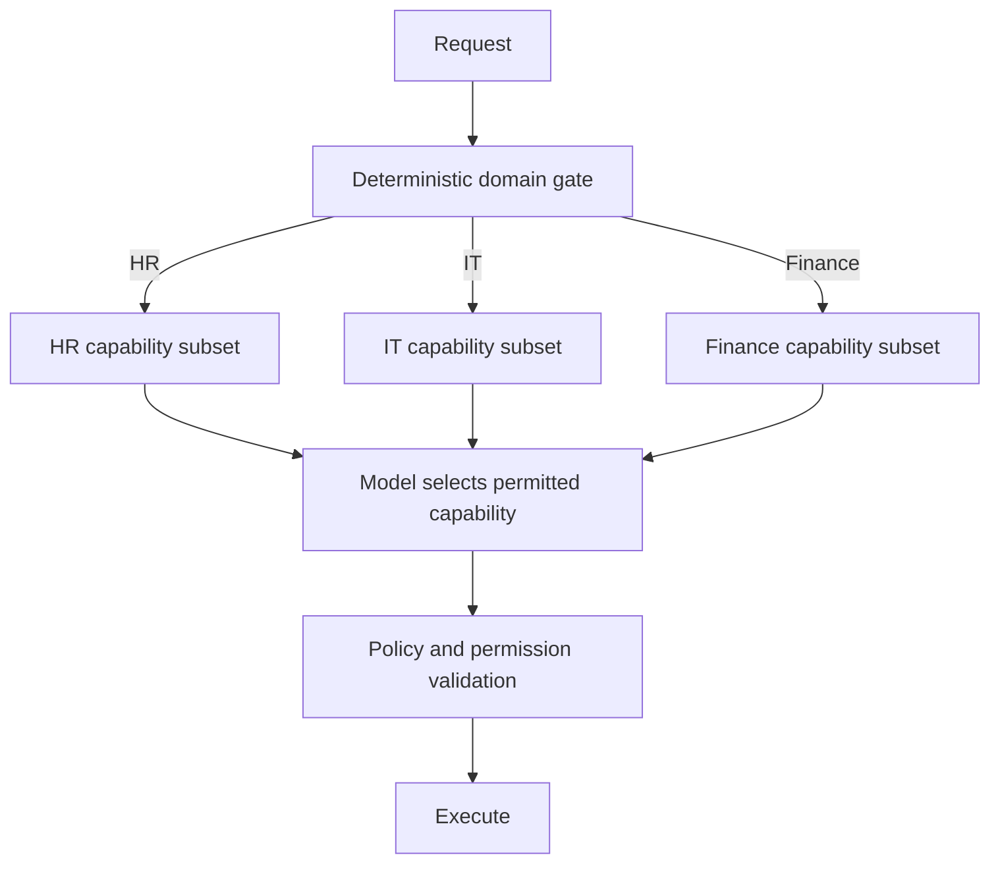

A hybrid router may:

1. use deterministic code to identify the tenant and business domain;
2. filter capabilities by identity and permission;
3. ask a model to select from the remaining safe subset;
4. validate the model's route decision;
5. execute only after all policy checks pass.

This is usually the strongest enterprise default.

> **Best practice**
>
> Do not show a routing model tools the current user cannot invoke. Capability filtering should happen before model selection, not after.

---

## 5. Typed route decisions

An orchestration system should not parse free-form statements such as:

> "It looks like the calendar tool is probably appropriate."

Instead, use a schema.

```json
{
  "intent": "schedule_meeting",
  "route": "calendar.read_availability",
  "confidence": 0.94,
  "required_inputs": ["manager_id", "date_range", "duration_minutes"],
  "missing_inputs": [],
  "risk_level": "low",
  "reason_code": "READ_ONLY_CALENDAR_QUERY"
}
```

A route decision should normally include:

| Field | Purpose |
|---|---|
| `intent` | Normalized business intent |
| `route` | Exact registry identifier |
| `confidence` | Router confidence or calibrated score |
| `required_inputs` | Inputs required by the capability |
| `missing_inputs` | Information that must be collected |
| `risk_level` | Low, medium, high, or critical |
| `reason_code` | Machine-readable explanation |
| `alternatives` | Optional ranked fallback routes |
| `approval_required` | Whether human approval is mandatory |

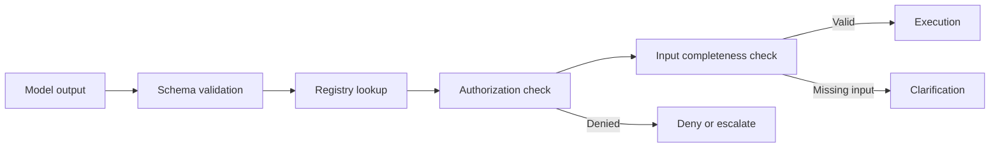

Typed decisions make it possible to:

- test route accuracy;
- reject invented routes;
- measure confidence;
- distinguish clarification from execution;
- enforce approvals;
- compare candidate routers.

---

## 6. Capability registries

A capability registry is a machine-readable catalog of what the system can do.

A minimal registry entry might contain:

```yaml
id: calendar.read_availability
description: Find free time slots for permitted participants.
input_schema:
  participants: list[string]
  start_date: date
  end_date: date
  duration_minutes: integer
side_effect: none
risk: low
permissions:
  - calendar.read_free_busy
latency_slo_ms: 1500
cost_class: low
supports_parallel: true
owner: workplace-platform
```

A mature registry may include:

- capability identifier and version;
- human and model-facing descriptions;
- input and output schemas;
- required permissions;
- supported tenants and regions;
- read/write classification;
- reversibility;
- approval requirements;
- data sensitivity;
- latency and cost expectations;
- retry policy;
- idempotency requirements;
- fallback capability;
- owning team;
- deprecation status.

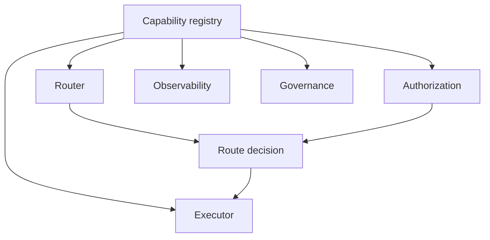

### 6.1 Capability granularity

Capabilities should be narrow enough to reason about safely.

Weak design:

```text
hr_tool(action, payload)
```

Stronger design:

```text
hr_policy.search
leave_balance.read
calendar.read_availability
payroll.change_bank_account
```

The stronger design lets the orchestrator apply different:

- permissions;
- approvals;
- input validation;
- retry rules;
- monitoring;
- data-retention policies.

### 6.2 Capability descriptions

Descriptions should explain:

- what the capability does;
- what it does not do;
- when it should be selected;
- required inputs;
- side effects;
- important failure modes.

Poor descriptions cause route confusion. Two tools named `search_data` and `lookup_info` provide no meaningful distinction to a model.

---

## 7. Shared state: what the workflow knows

The board emphasizes that state enables continuity, collaboration, adaptive planning, and recovery. Shared state should be explicit, typed, and minimal.

A useful separation is:

| State category | Purpose | Example |
|---|---|---|
| Request context | Trusted invocation data | User ID, tenant, locale, permissions |
| Workflow state | Progress of the current execution | Current step, completed branches, errors |
| Conversation state | Relevant interaction history | Clarifications, user confirmations |
| Memory | Reusable information across executions | Preferred time zone, approved preference |
| Business state | Authoritative external record | Leave balance in HRIS |
| Audit state | Immutable execution evidence | Route decisions, tool calls, approvals |

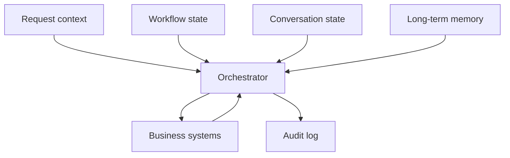

### 7.1 Request context

Request context should be injected by trusted application code, not inferred from the prompt. It may include:

- authenticated user ID;
- tenant ID;
- roles and scopes;
- geographic region;
- language and time zone;
- trace ID;
- feature flags;
- policy version.

A user message such as "I am an administrator" must never replace authenticated context.

### 7.2 Workflow state

A workflow-state object might contain:

```json
{
  "workflow_id": "wf_123",
  "status": "running",
  "goal": "answer_leave_policy_and_find_slot",
  "current_step": "merge_results",
  "completed_steps": ["classify", "policy_lookup", "calendar_lookup"],
  "pending_steps": [],
  "route_history": ["policy.search", "calendar.read_availability"],
  "errors": [],
  "attempt_count": 1,
  "deadline": "2026-08-03T09:30:00Z"
}
```

### 7.3 Business state

Do not copy authoritative business values into memory and treat them as permanently true. A stored note that says "employee has 12 days remaining" may be stale. Read current values from the system of record when the task depends on freshness.

### 7.4 Audit state

Audit records should be append-only. They should capture:

- who initiated the workflow;
- which route was chosen;
- why it was chosen;
- which capability was invoked;
- sanitized input and output references;
- duration and status;
- approval identity;
- retry and fallback decisions;
- final outcome.

---

## 8. State transitions and workflow status

An explicit state machine prevents accidental transitions.

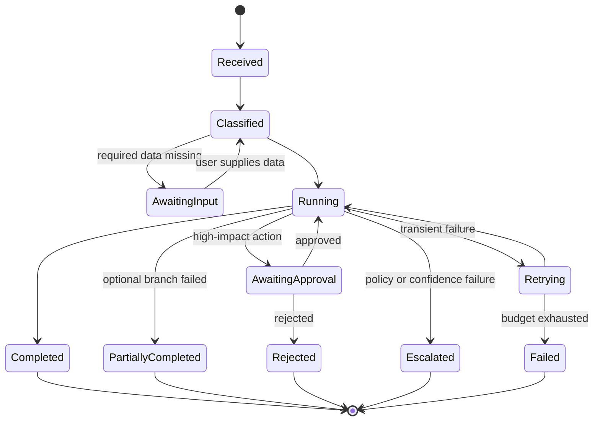

Each transition should define:

- allowed previous states;
- triggering event;
- required data;
- side effects;
- audit event;
- timeout behavior.

For example, `AwaitingApproval -> Running` should require an approval record bound to the exact proposed action and arguments. A general statement such as "approved" should not authorize a later, modified action.

---

## 9. Workflow execution patterns

### 9.1 Sequential execution

Use sequential execution when a step depends on the previous result.

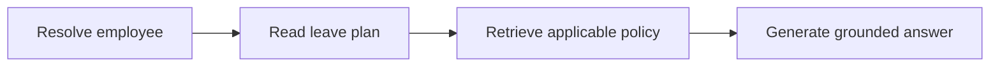

### 9.2 Parallel fan-out and fan-in

Use parallel execution when branches are independent.

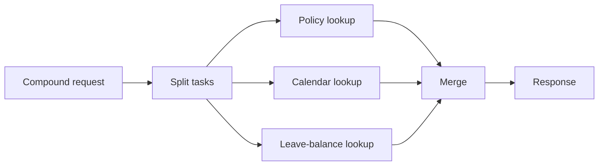

Parallelism reduces latency, but only when:

- branches do not depend on each other;
- concurrent calls are allowed;
- rate limits are respected;
- merge logic can handle partial failure.

### 9.3 Conditional routing

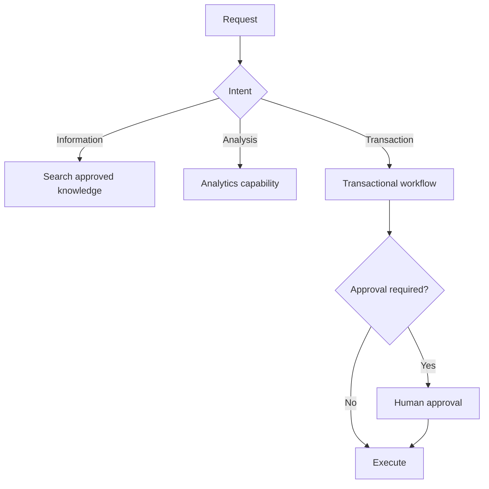

### 9.4 Event-driven orchestration

Long-running workflows should not keep a synchronous request open indefinitely. They can publish and consume events:

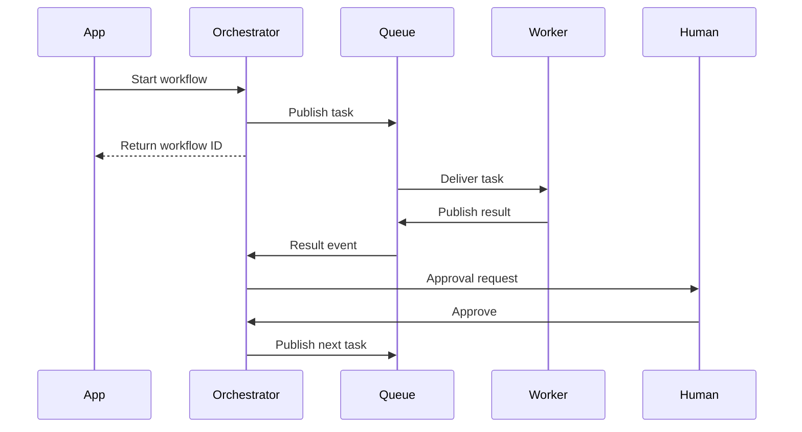

Event-driven designs improve durability and scalability but require:

- event versioning;
- deduplication;
- ordering strategy;
- replay behavior;
- dead-letter handling;
- correlation IDs.

### 9.5 Human-gated execution

Human review is a first-class route, not a failure of automation.

Use a human gate when:

- the action changes payroll, employment status, or legal commitments;
- confidence is below threshold;
- evidence conflicts;
- required policy is missing;
- the user requests review;
- the system detects unusual behavior.

---

## 10. Failure handling

The board's failure loop is:

```text
Execute step
    ↓
Did it work?
    ↓
No → Identify failure
    ↓
Reflect on cause
    ↓
Replan
    ↓
Retry or escalate
```

A production orchestrator should classify failures before choosing a recovery strategy.

| Failure class | Example | Preferred response |
|---|---|---|
| Transient infrastructure | Timeout, temporary 503 | Retry with backoff |
| Rate limit | API quota exceeded | Wait, queue, or use fallback |
| Invalid input | Missing date range | Ask for clarification |
| Authorization | Missing payroll scope | Deny or escalate |
| Policy conflict | Two current policies disagree | Human review |
| Capability unavailable | Calendar service offline | Partial result or fallback |
| No progress | Same route repeats | Stop and escalate |
| Permanent business error | Record does not exist | Explain and stop |

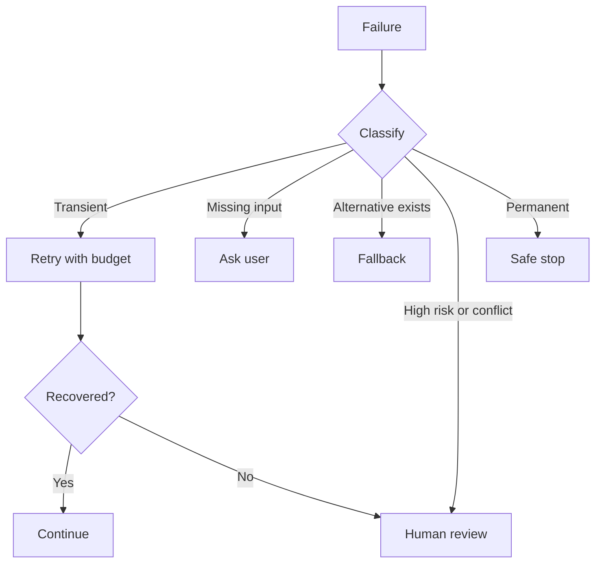

### 10.1 Retry budgets

Every retry policy should define:

- maximum attempts;
- backoff strategy;
- retryable error types;
- total time budget;
- cost budget;
- whether arguments may change;
- escalation behavior.

Blind retries can duplicate writes, increase costs, and worsen outages.

### 10.2 Fallbacks

Fallbacks may include:

- backup API;
- cached read-only result;
- smaller or alternate model;
- simplified workflow;
- partial answer;
- human review.

A fallback must not silently reduce safety. For example, replacing an authoritative payroll system with an old cache may be unacceptable.

### 10.3 Compensation and sagas

**Supplementary:** A multi-step transaction may partially succeed. A saga records compensating actions.

Example:

1. reserve a meeting room;
2. create a calendar event;
3. notify participants.

If calendar creation fails after the room reservation, the orchestrator should release the room.

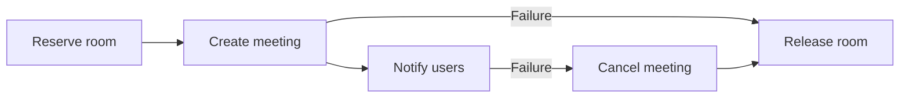

Compensation is not always a true rollback. The system should record what was done and what was undone.

### 10.4 Idempotency

Idempotency prevents duplicate side effects when a request is retried or replayed.

An idempotency key can be derived from:

- tenant;
- user;
- workflow;
- action type;
- stable request identifier.

Before performing a write, the executor checks whether that action has already completed.

---

## 11. Authentication, authorization, and identity propagation

The board's HR architecture begins with Azure AD authentication and a JWT access token before the orchestrator. The principle is broader than any identity provider: authenticate once, propagate identity safely, and authorize every capability.

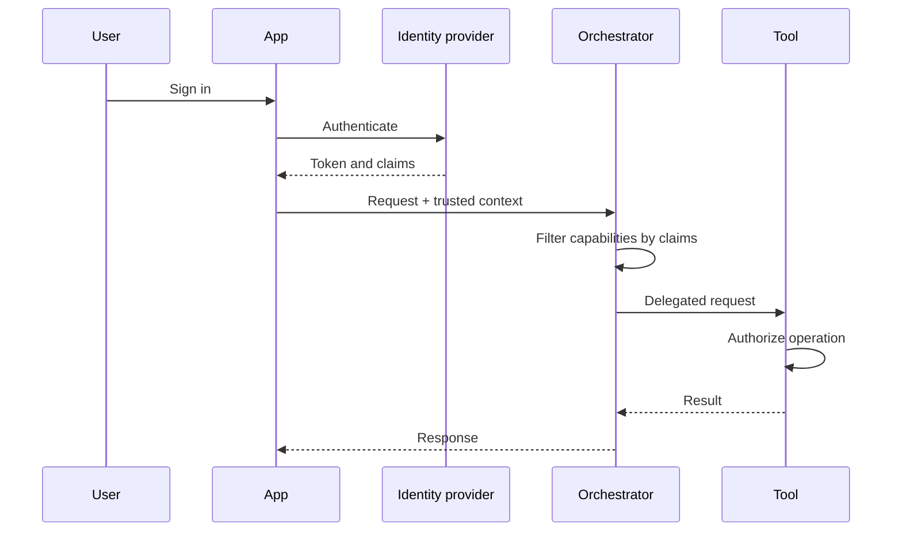

### 11.1 Authentication is not authorization

Authentication answers:

> Who is the requester?

Authorization answers:

> May this requester perform this operation on this resource?

Both checks are required.

### 11.2 Least privilege

A policy-search capability may need read access to approved documents. It should not receive payroll-write access merely because both belong to an HR assistant.

### 11.3 Confused deputy risk

A confused deputy occurs when the orchestrator uses its own broad privilege to perform an action the user is not allowed to request.

Prevent this by:

- propagating delegated identity;
- checking resource-level permissions;
- filtering capabilities before routing;
- avoiding shared high-privilege credentials;
- recording the initiating user and acting service.

### 11.4 Tenant isolation

Tenant ID should be part of:

- capability filtering;
- database queries;
- vector-store filters;
- cache keys;
- state keys;
- audit records.

Never rely on the model to remember tenant boundaries.

---

## 12. Multi-agent orchestration and shared state

Multi-agent systems introduce additional coordination questions:

- Who owns the goal?
- Which agent may delegate?
- Which outputs are shared?
- Who decides completion?
- How are contradictory results resolved?
- What prevents circular delegation?

A common pattern is a manager or coordinator agent supervising specialists.

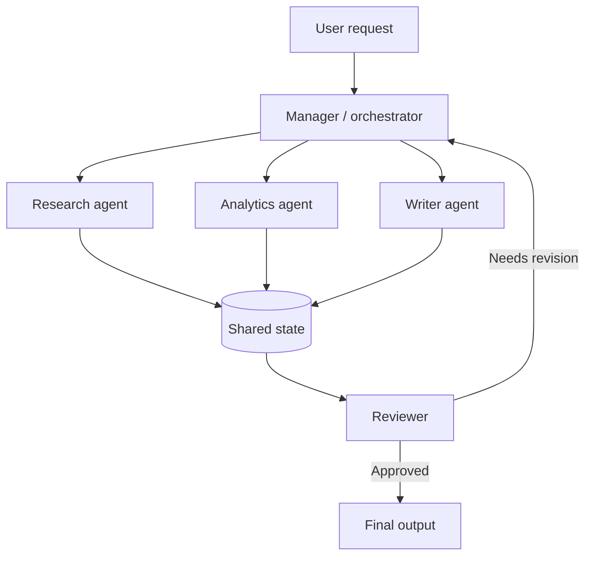

### 12.1 Shared state should contain artifacts, not everything

Useful shared artifacts include:

- task plan;
- source references;
- normalized facts;
- decisions;
- open questions;
- review findings;
- completion status.

Avoid sharing:

- unrestricted chain-of-thought;
- raw sensitive documents when a summary is sufficient;
- credentials;
- irrelevant full conversation transcripts;
- stale intermediate guesses.

### 12.2 Ownership

Every state field should have an owner or update rule. For example:

| Field | Writer | Readers |
|---|---|---|
| `task_plan` | Planner | All specialists |
| `evidence` | Research agents | Analyst, reviewer |
| `analysis` | Analyst | Writer, reviewer |
| `review_status` | Reviewer | Manager |
| `final_response` | Writer or synthesizer | Application |

This reduces conflicting writes.

### 12.3 Preventing loops

Add:

- maximum delegation depth;
- maximum handoffs;
- progress checks;
- repeated-route detection;
- one final decision owner;
- explicit termination criteria.

---

## 13. Enterprise HR reference architecture

The board provides an employee HR architecture with identity, an orchestrator, and specialist agents.

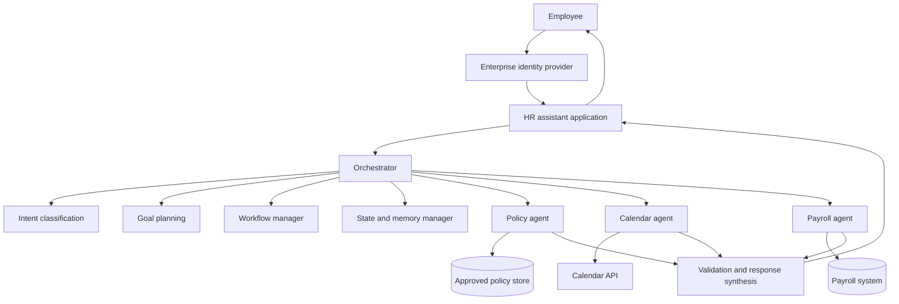

### 13.1 Example route matrix

| Request | Primary route | Secondary route | Approval |
|---|---|---|---|
| "What is the parental leave policy?" | Policy search | None | No |
| "Find time with my manager" | Calendar free/busy | Identity resolver | No |
| "Why is my payslip different?" | Payroll read | Policy search | Possibly |
| "Change my bank account" | Payroll transaction workflow | Identity verification | Yes |
| "Can I take leave next Friday?" | Leave-balance read | Policy search, calendar | No |

### 13.2 Compound request example

Request:

> "Check whether I can carry over leave and find time with my manager next week."

Plan:

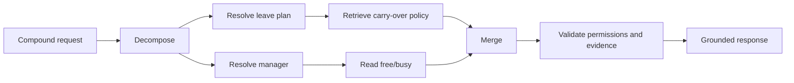

The policy and calendar branches can run in parallel after their respective identity inputs are resolved.

### 13.3 Partial failure

If the calendar service is unavailable but policy retrieval succeeds, the system should not discard the successful result. A good response might say:

> You may carry over up to five days under the policy applicable to your plan. I could not check calendar availability because the calendar service is currently unavailable. You can retry that step without repeating the policy lookup.

This is better than a generic "Something went wrong."

---

## 14. Performance and latency budgets

The board illustrates a latency budget in which model inference is often the largest component, followed by retrieval, tool calls, and orchestration overhead. Actual distributions vary, so measure rather than assume.

### 14.1 Latency decomposition

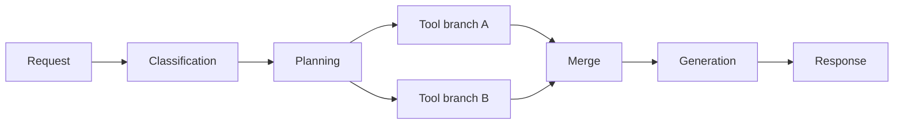

Track:

- classification duration;
- planning duration;
- queue time;
- each tool call;
- retrieval duration;
- model duration;
- merge and validation duration;
- total user-perceived latency.

### 14.2 Optimization priorities

Optimize the largest measured contributor first. Common techniques include:

- deterministic routing for simple intents;
- caching stable reads;
- parallelizing independent branches;
- using smaller models for classification;
- streaming progress and final text;
- eliminating redundant model calls;
- reusing retrieved evidence within the workflow;
- applying deadlines to slow tools;
- returning partial results when appropriate.

### 14.3 Critical path

Parallel execution improves total latency only when the branches are outside the same critical path. If one branch depends on another, concurrency does not help.

---

## 15. Observability and evaluation

An orchestrator should produce a trace that explains the trajectory without exposing secrets or unnecessary sensitive data.

A trace may contain:

```text
workflow_started
request_classified
route_selected
capability_invoked
capability_completed
state_updated
approval_requested
retry_scheduled
fallback_selected
workflow_completed
```

### 15.1 Core metrics

| Metric | Meaning |
|---|---|
| Route accuracy | Correct capability selected |
| Invalid-route rate | Invented or forbidden route attempts |
| Clarification precision | Clarification requested only when needed |
| Task completion | User goal achieved |
| First-pass completion | Completed without retry or escalation |
| Recovery success | Workflow recovered after failure |
| Escalation quality | Human review used appropriately |
| Duplicate-action rate | Side effects repeated unexpectedly |
| Partial-success rate | Useful result returned despite branch failure |
| End-to-end latency | Total response or completion time |
| Cost per workflow | Models, tools, infrastructure, and review cost |

### 15.2 Evaluate the route and the outcome separately

A workflow may select the correct route but still fail because the tool returns stale data. Conversely, a wrong route may accidentally produce a plausible answer. Evaluate:

1. classification;
2. route selection;
3. authorization;
4. tool arguments;
5. branch scheduling;
6. recovery decision;
7. final response.

### 15.3 Test suites

Build test cases for:

- single-intent requests;
- compound requests;
- ambiguous input;
- missing required data;
- conflicting instructions;
- permission denial;
- service outage;
- rate limits;
- duplicate events;
- user interruption;
- partial failure;
- prompt injection;
- cross-tenant access attempts;
- repeated retries;
- human approval and rejection.

---

## 16. Common orchestration anti-patterns

### 16.1 One giant orchestrator prompt

**Problem:** Classification, planning, policy, execution, and synthesis are all mixed into one model call.

**Consequence:** Poor testability, hidden failures, and weak policy enforcement.

**Better:** Separate route decisions, execution, and validation.

### 16.2 Letting the model invent routes

**Problem:** The model returns arbitrary tool or agent names.

**Consequence:** Invalid calls and security risk.

**Better:** Select only from a filtered capability registry and validate the schema.

### 16.3 Shared global state

**Problem:** Multiple users or workflows read and write the same mutable object.

**Consequence:** Data leakage, race conditions, and corrupted context.

**Better:** Scope state by tenant, user, thread, and workflow.

### 16.4 Treating retries as recovery

**Problem:** Every error triggers the same call again.

**Consequence:** Duplicate side effects, cost spikes, and outage amplification.

**Better:** Classify failure, use bounded retries, reconcile uncertain writes, and escalate when appropriate.

### 16.5 Routing after authorization

**Problem:** The model sees all capabilities and authorization is checked only at execution.

**Consequence:** Capability leakage and confused-deputy risk.

**Better:** Filter capabilities by identity before routing and authorize again at execution.

### 16.6 Using conversation text as authoritative state

**Problem:** The system assumes details mentioned earlier are still correct.

**Consequence:** Stale or manipulated decisions.

**Better:** Re-read critical business values from systems of record.

### 16.7 No completion owner

**Problem:** Multiple agents can continue delegating indefinitely.

**Consequence:** Loops, rising cost, and no final answer.

**Better:** Assign one coordinator or reviewer as the decision owner and enforce budgets.

### 16.8 Silent partial failure

**Problem:** One branch fails, but the response presents the merged result as complete.

**Consequence:** Misleading output and loss of trust.

**Better:** Record evidence coverage and disclose unavailable sources.

---

## 17. A practical implementation blueprint

A production orchestration service can be decomposed into the following components:

```mermaid
flowchart TB
    API[Orchestration API] --> CTX[Context resolver]
    CTX --> REG[Capability registry]
    CTX --> CLS[Classifier / router]
    CLS --> POL[Policy engine]
    POL --> PLAN[Planner / scheduler]
    PLAN --> EX[Capability executor]
    EX --> ST[State store]
    EX --> EV[Evaluator]
    EV --> PLAN
    PLAN --> HUM[Human task service]
    ST --> AUD[Audit store]
    EX --> AUD
    API --> OBS[Tracing and metrics]
    CLS --> OBS
    EX --> OBS
    EV --> OBS
```

### 17.1 Recommended contracts

**Route decision**

```text
request + trusted context + allowed capabilities
    -> typed route decision
```

**Capability invocation**

```text
capability ID + validated arguments + delegated identity + idempotency key
    -> typed result
```

**State transition**

```text
workflow ID + expected version + event
    -> new state version
```

**Human task**

```text
exact proposed action + evidence + risk + expiration
    -> approve / reject / edit
```

### 17.2 Keep business logic outside prompts

Mandatory business rules should be implemented as:

- policy-engine rules;
- typed validators;
- workflow guards;
- database constraints;
- permission checks;
- approval requirements.

Prompts can explain and interpret; they should not be the only enforcement mechanism.

---

## 18. Worked example: project coordination orchestrator

The board uses a project-coordination agent that checks open sprint tickets, scans recent team messages, identifies blockers, and returns a table with owner, source, impact, and next action.

A robust orchestration plan could be:

```mermaid
flowchart TB
    Q[Find sprint blockers] --> AUTH[Resolve project and user access]
    AUTH --> T[Fetch open sprint tickets]
    AUTH --> S[Search recent team messages]
    AUTH --> D[Retrieve meeting notes]
    T --> N[Normalize blocker candidates]
    S --> N
    D --> N
    N --> DD[Deduplicate and correlate]
    DD --> A[Assess owner and impact]
    A --> V[Validate evidence]
    V --> R[Render blocker table]
```

### 18.1 Route and state design

State might include:

```json
{
  "project_id": "proj_42",
  "sprint_id": "sprint_18",
  "sources_requested": ["tickets", "messages", "meeting_notes"],
  "sources_completed": ["tickets", "messages"],
  "sources_unavailable": ["meeting_notes"],
  "blocker_candidates": [],
  "validated_blockers": [],
  "status": "partially_completed"
}
```

The final response should explicitly state that meeting notes were unavailable.

### 18.2 Parallelism

Ticket retrieval, message search, and document retrieval are independent after access resolution, so they can run concurrently.

### 18.3 Recovery

If the message API times out:

1. retry once with backoff;
2. if still unavailable, continue with tickets and meeting notes;
3. mark evidence coverage as partial;
4. let the user retry only the missing source later.

---

## 19. Hands-on lab: build an HR request orchestrator

### Goal

Build an orchestrator that supports these capabilities:

- `policy.search`
- `calendar.read_availability`
- `leave_balance.read`
- `payroll.change_bank_account`

### Requirements

1. Represent capabilities in a registry.
2. Filter capabilities based on user permissions.
3. Classify each request into one or more routes.
4. Ask for clarification when required inputs are missing.
5. Run independent read-only routes in parallel.
6. Require explicit human approval for the payroll write.
7. maintain workflow state and an append-only event log;
8. prevent duplicate writes with an idempotency key;
9. return partial results when an optional branch fails;
10. expose route, duration, and status metrics.

### Suggested evaluation cases

| Case | Expected behavior |
|---|---|
| "What is the leave carry-over rule?" | Route to policy search |
| "How much leave do I have?" | Route to leave-balance read |
| "Find time with my manager" | Ask for date range if missing |
| "Change my bank account" | Route to approval-gated workflow |
| User lacks payroll scope | Deny without showing write capability |
| Calendar API offline | Return partial result and retry option |
| Same write event replayed | Do not execute twice |
| Prompt requests another employee's payslip | Deny and audit |

---

## 20. Production checklist

### Routing

- [ ] Routes come from a versioned registry.
- [ ] Model output is schema-validated.
- [ ] Capabilities are filtered before model selection.
- [ ] Compound requests can decompose into multiple tasks.
- [ ] Low-confidence or ambiguous routes ask for clarification.

### State

- [ ] Request context is trusted and separate from prompt text.
- [ ] Workflow state has a schema and version.
- [ ] State is scoped by tenant, user, and workflow.
- [ ] Business values are refreshed from systems of record.
- [ ] Audit events are append-only.

### Execution

- [ ] Tool inputs and outputs are typed.
- [ ] Side effects require idempotency.
- [ ] High-impact actions require approval.
- [ ] Retries are bounded and error-specific.
- [ ] Partial success is represented explicitly.
- [ ] Compensation exists for multi-step writes where needed.

### Security

- [ ] Authentication and authorization are separate.
- [ ] Delegated identity is propagated.
- [ ] Tenant isolation is enforced in every data path.
- [ ] Secrets are not placed in prompts or shared state.
- [ ] Prompt injection cannot expand permissions.

### Reliability and observability

- [ ] Workflow IDs and correlation IDs are recorded.
- [ ] Every route and state transition is traced.
- [ ] Progress and termination budgets exist.
- [ ] Route accuracy and recovery success are evaluated.
- [ ] Operators can interrupt, reset, abort, and resume workflows.

---

## 21. Knowledge check

1. Why is orchestration more than tool selection?
2. What is the difference between request context and workflow state?
3. Why should capability filtering occur before model-based routing?
4. When is deterministic routing preferable to a model router?
5. What fields belong in a typed route decision?
6. Why should business-system values not be treated as permanent memory?
7. How does idempotency protect a retried write?
8. What is the difference between a fallback and a compensating action?
9. When should an orchestrator return a partial result?
10. How do progress checks prevent multi-agent loops?
11. Why is authentication insufficient without authorization?
12. What metrics distinguish route quality from final-answer quality?

---

## 22. Interview questions

### Beginner

1. What does an orchestration layer do in an agentic system?
2. What is intent classification?
3. What is shared state?
4. Why do agents need retries and fallbacks?
5. What is the difference between an agent and a tool?

### Intermediate

6. Compare deterministic, model-based, and hybrid routing.
7. How would you design a capability registry?
8. How would you handle a compound request involving two independent systems?
9. What information should be stored in workflow state?
10. How would you prevent duplicate tool actions after a timeout?
11. How should an orchestrator handle partial failure?
12. How do you propagate identity safely across tools?

### Advanced

13. Design an orchestration architecture for an enterprise HR assistant.
14. How would you evaluate route accuracy when multiple routes are acceptable?
15. How would you implement safe pause and resume for a human-approval workflow?
16. How would you prevent cross-tenant leakage in state, caches, and retrieval?
17. When would you use event-driven orchestration rather than a synchronous graph?
18. How would you model compensation for a partially completed workflow?
19. How would you detect that a multi-agent workflow is making no progress?
20. How would you separate policy enforcement from model reasoning?

---

## 23. Chapter summary

Orchestration is the control layer that turns isolated model, agent, and tool capabilities into a reliable application. It classifies requests, decomposes goals, selects safe routes, schedules work, maintains state, handles failure, coordinates approvals, and records the full execution trajectory.

The strongest production pattern is usually hybrid routing: deterministic code establishes identity, tenant, business domain, and permitted capabilities; a model then chooses flexibly within that approved subset. Route decisions should be typed, validated, and linked to a capability registry.

State must be separated into trusted request context, workflow progress, conversation context, reusable memory, authoritative business state, and immutable audit history. Shared state should contain controlled artifacts rather than unrestricted transcripts.

Reliable orchestration also requires bounded retries, fallbacks, idempotency, compensation, partial-success handling, human escalation, and explicit termination conditions. Security boundaries must be enforced before and during execution, never delegated solely to the language model.

A well-designed orchestrator makes an agentic system visible, controllable, recoverable, and governable. It is the difference between a collection of intelligent components and a production system.
