# Chapter 20 - Manager-Worker and Planner-Executor-Reviewer Patterns

> **Source basis:** The board introduces four common multi-agent topologies: manager-worker, planner-executor-reviewer, specialized agent teams, and debate or critique. It illustrates a competitive-research workflow in which a manager coordinates research, analytics, writing, and review specialists before producing a final report, and it warns about circular delegation and failure loops [Board, pp. 20-22]. This chapter preserves that framing and expands it into a production engineering guide. Material on typed work orders, ownership boundaries, merge policies, progress proofs, budget allocation, deterministic review gates, and reliability evaluation is **Supplementary**.

---

## Learning objectives

By the end of this chapter, you should be able to:

1. Explain why multi-agent patterns are organizational designs rather than simply multiple model calls.
2. Distinguish manager-worker from planner-executor-reviewer workflows.
3. Decide when a single agent is preferable to a multi-agent system.
4. Design narrow specialist roles with explicit ownership boundaries.
5. Represent delegated work as typed work orders with acceptance criteria.
6. Coordinate serial, parallel, and dependency-aware execution.
7. Merge worker outputs without losing provenance or introducing contradictions.
8. Build reviewers that check evidence, policy, completeness, and output contracts.
9. Apply bounded revision loops and detect no-progress cycles.
10. Prevent circular delegation, duplicated work, and authority confusion.
11. Separate orchestration state from agent conversation history.
12. Apply permissions and least privilege to each specialist.
13. Evaluate route accuracy, worker quality, review value, latency, and cost.
14. Design a competitive-research system using manager-worker coordination.
15. Implement a dependency-free multi-agent workflow controller in Python.

---

## 1. Multi-agent systems are organizational systems

A multi-agent application is not created merely by calling a language model several times. A useful multi-agent system has:

- a shared objective;
- distinct responsibilities;
- a coordination policy;
- explicit communication contracts;
- state and provenance;
- termination conditions;
- a final decision owner.

Without these elements, the result is usually an expensive conversation rather than a reliable system.

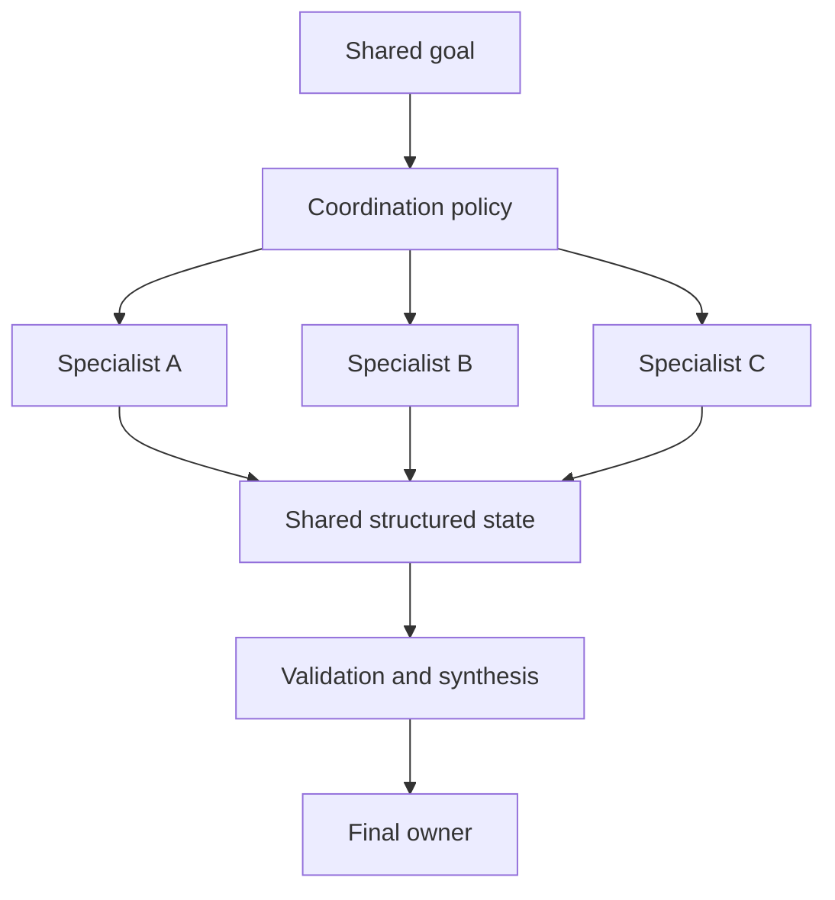

The board uses familiar workplace analogies:

| Multi-agent concept | Workplace analogy |
|---|---|
| Manager agent | Team lead or orchestrator |
| Worker agents | Engineering, design, research, legal, analytics |
| Work order | Assigned task or ticket |
| Shared state | Project board or case record |
| Reviewer | QA, compliance, or senior approver |
| Escalation | Human decision path |
| Final synthesis | Approved report or completed business outcome |

This analogy is useful because agent teams inherit the same coordination problems as human teams:

- unclear ownership;
- duplicated effort;
- missing handoffs;
- specialists working from different assumptions;
- unresolved conflicts;
- endless review cycles;
- no one accountable for the final answer.

> **Key idea**
>
> Multi-agent design is primarily a problem of responsibility, coordination, and control. Model intelligence matters, but organizational clarity determines whether that intelligence becomes useful work.

---

## 2. Start with the simplest architecture

Before introducing multiple agents, ask whether the task can be solved reliably with:

1. one deterministic workflow;
2. one agent with several tools;
3. one agent plus a reviewer;
4. multiple specialists.

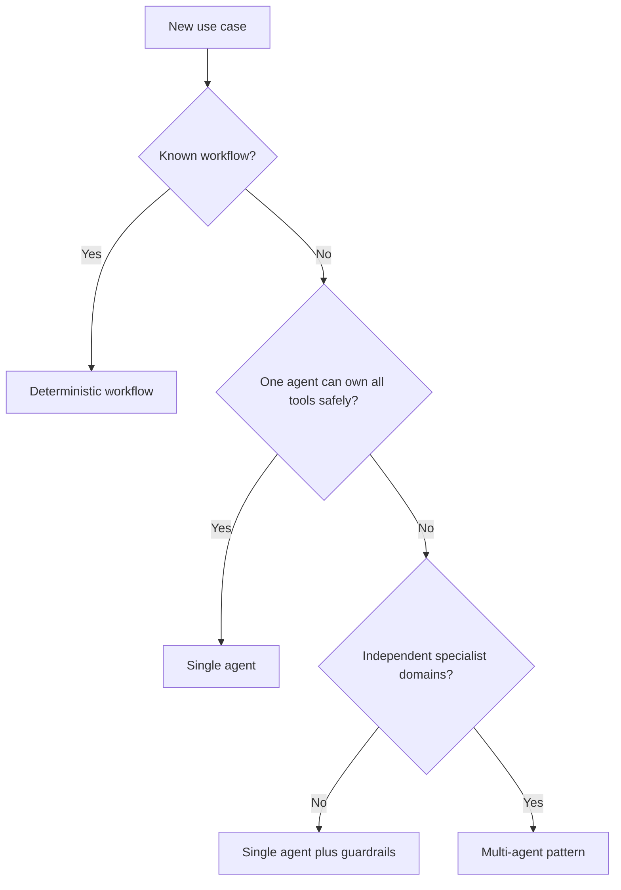

A single agent is usually preferable when:

- the task is short;
- the same context is needed throughout;
- one permission boundary is sufficient;
- the tool set is small;
- latency is important;
- the output can be evaluated directly;
- specialization does not materially improve quality.

A multi-agent architecture becomes more defensible when:

- the work contains separable subproblems;
- specialists require different data or tools;
- permissions must be isolated;
- independent branches can run in parallel;
- review is a distinct control responsibility;
- the workflow mirrors real business ownership;
- intermediate artifacts need independent validation.

### 2.1 The cost of additional agents

Every additional agent introduces potential cost:

- another model call;
- another prompt and context window;
- another failure surface;
- another state transition;
- another permission boundary;
- another merge decision;
- another source of latency;
- another opportunity for disagreement.

The correct question is not, "How many agents can we add?" It is:

> What independent responsibility justifies each agent?

---

## 3. The manager-worker pattern

In a manager-worker topology, one coordinating agent owns the objective and delegates bounded tasks to one or more workers.

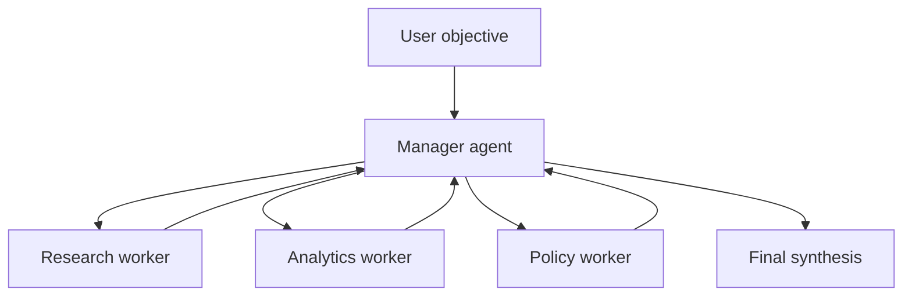

The manager is responsible for:

- interpreting the objective;
- decomposing the work;
- assigning each work item;
- tracking dependencies;
- monitoring progress;
- resolving or escalating conflicts;
- deciding whether additional work is required;
- synthesizing the final outcome.

Workers are responsible for:

- completing a narrow assignment;
- using only approved tools and data;
- returning structured evidence;
- reporting uncertainty and failure explicitly;
- avoiding work outside their assigned scope.

### 3.1 A manager is not merely another chat participant

A weak manager prompt says:

> Ask the research agent and analytics agent to help.

A production manager needs explicit control responsibilities:

```text
Objective
  -> decompose into typed work orders
  -> assign based on capability and permission
  -> execute eligible work in parallel
  -> validate each result
  -> request bounded correction when necessary
  -> merge evidence
  -> produce or escalate the final decision
```

### 3.2 Work orders

Delegation should use a typed work order rather than free-form instructions.

```json
{
  "work_id": "pricing-analysis-01",
  "objective": "Compare current subscription prices for three competitors",
  "owner": "analytics_agent",
  "inputs": ["competitor_list", "approved_pricing_sources"],
  "deliverable": "pricing_comparison_table",
  "acceptance_criteria": [
    "all three competitors included",
    "currency and billing period normalized",
    "source recorded for every price",
    "unknown values marked explicitly"
  ],
  "dependencies": ["source-discovery-01"],
  "deadline_seconds": 30,
  "max_attempts": 2,
  "allowed_tools": ["pricing_catalog", "calculator"],
  "risk_level": "read_only"
}
```

A work order makes important information machine-testable.

| Field | Purpose |
|---|---|
| `work_id` | Unique identity for tracing and idempotency |
| `objective` | Narrow outcome the worker owns |
| `owner` | Selected worker or capability |
| `inputs` | Required state and evidence |
| `deliverable` | Expected artifact type |
| `acceptance_criteria` | Conditions that define success |
| `dependencies` | Work that must complete first |
| `max_attempts` | Bounded retry or revision count |
| `allowed_tools` | Least-privilege capability set |
| `risk_level` | Required control or approval level |

### 3.3 Capability-based assignment

A manager should select workers from an explicit registry.

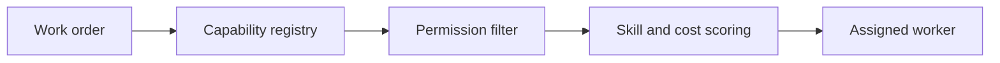

A registry may describe:

- supported task types;
- required inputs;
- output schemas;
- tool permissions;
- data domains;
- cost and latency class;
- regional or tenant restrictions;
- historical success rate;
- current availability.

This prevents the manager from inventing agents or assigning work to specialists that lack the required authority.

### 3.4 Serial and parallel delegation

Independent work can run concurrently.

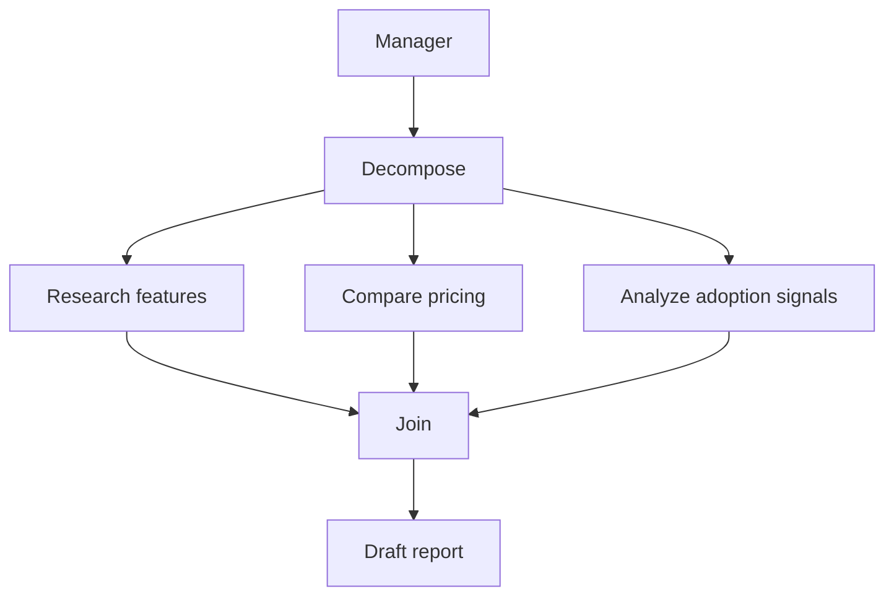

Parallelism reduces latency, but only when:

- branches are independent;
- shared systems can handle concurrency;
- results have clear merge rules;
- duplicate side effects are impossible;
- failures can be represented independently.

### 3.5 Merge policy

The manager must not concatenate worker responses blindly. A merge policy should define:

- which fields are authoritative;
- how duplicate facts are deduplicated;
- how conflicting claims are represented;
- whether freshness overrides older evidence;
- whether all mandatory sections are present;
- how provenance is preserved;
- when conflict requires human review.

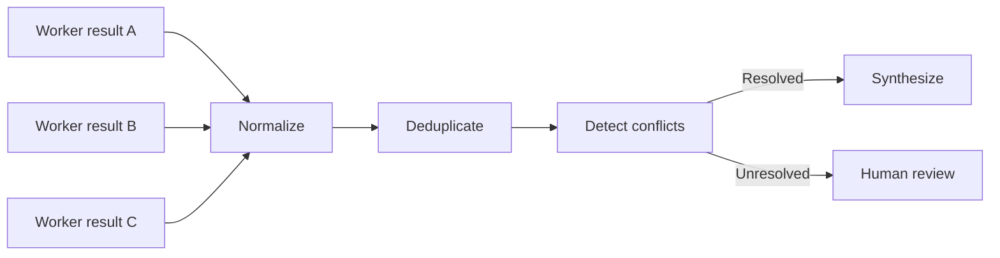

---

## 4. The planner-executor-reviewer pattern

The planner-executor-reviewer topology separates three control responsibilities:

1. **Planner:** determines what should be done.
2. **Executor:** performs the work.
3. **Reviewer:** checks whether the result is acceptable.

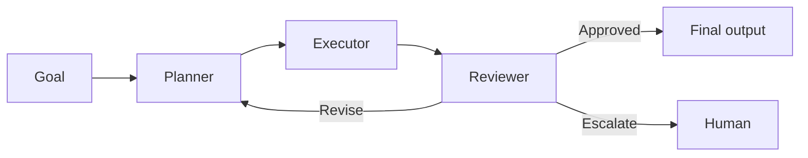

The board compares this to a product roadmap moving through development and QA review. The pattern is powerful because planning and quality control are not left to the same component that performed the work.

### 4.1 Planner responsibilities

The planner should:

- interpret the goal;
- identify assumptions and missing inputs;
- decompose the task;
- specify dependencies;
- choose tools or executors;
- define acceptance criteria;
- allocate budgets;
- identify risk and approval gates.

The planner should not perform the full task while pretending to plan. Its output should be a structured plan.

```json
{
  "goal": "Prepare a sprint blocker report",
  "steps": [
    {
      "id": "tickets",
      "action": "fetch_open_sprint_tickets",
      "depends_on": []
    },
    {
      "id": "messages",
      "action": "search_blocker_messages",
      "depends_on": []
    },
    {
      "id": "merge",
      "action": "merge_blocker_evidence",
      "depends_on": ["tickets", "messages"]
    },
    {
      "id": "report",
      "action": "draft_blocker_report",
      "depends_on": ["merge"]
    }
  ],
  "acceptance_criteria": [
    "each blocker has an owner",
    "each blocker has a source",
    "impact and next action are present",
    "unavailable sources are disclosed"
  ]
}
```

### 4.2 Executor responsibilities

The executor should:

- follow the approved plan;
- invoke permitted tools;
- capture observations and errors;
- update workflow state;
- avoid changing the goal or policy;
- return structured artifacts;
- stop when a control boundary is reached.

The executor may be one general agent, several tool-specific workers, or deterministic services.

### 4.3 Reviewer responsibilities

The reviewer should evaluate the result against explicit criteria rather than writing a vague critique.

Possible review dimensions include:

| Dimension | Review question |
|---|---|
| Completeness | Are all required sections present? |
| Correctness | Are calculations and claims correct? |
| Evidence | Is each important claim supported? |
| Faithfulness | Does the output stay within the retrieved evidence? |
| Policy | Were permissions and business rules followed? |
| Format | Does the result match the output schema? |
| Risk | Does the result require human approval? |
| Clarity | Can the intended user understand and act on it? |

The reviewer should return a typed decision.

```json
{
  "decision": "revise",
  "score": 0.78,
  "failed_criteria": [
    "two blockers do not have owners",
    "one claim lacks a source"
  ],
  "required_changes": [
    "resolve owners from ticket assignments",
    "remove or source the unsupported claim"
  ],
  "may_retry": true
}
```

### 4.4 Revision is not an unlimited loop

The workflow needs a bounded control policy.

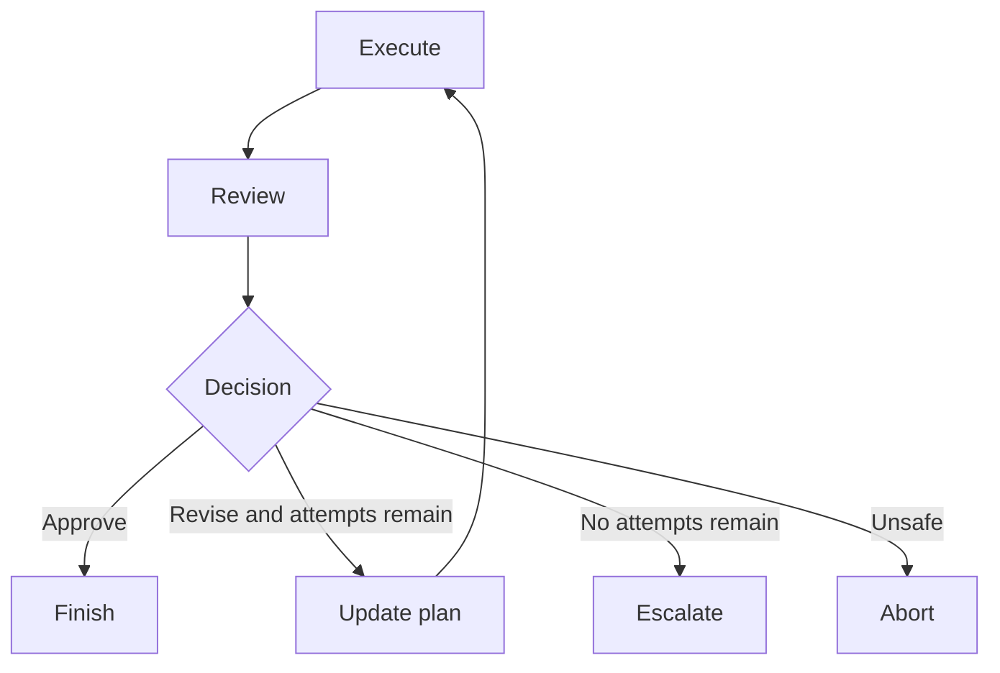

Useful limits include:

- maximum revisions;
- maximum tool calls;
- maximum elapsed time;
- maximum token or monetary cost;
- maximum repeated action count;
- minimum required progress per iteration.

---

## 5. Comparing the two patterns

Manager-worker and planner-executor-reviewer can overlap, but they emphasize different control structures.

| Dimension | Manager-worker | Planner-executor-reviewer |
|---|---|---|
| Primary purpose | Delegate work across specialists | Separate planning, execution, and quality control |
| Main coordinator | Manager | Planner plus reviewer |
| Best for | Broad tasks with parallel specialist contributions | Tasks requiring explicit plans and review gates |
| Typical shape | Fan-out and fan-in | Serial loop with bounded revision |
| Quality control | Manager or separate reviewer | Dedicated reviewer |
| Main risk | Coordination overhead and duplicate work | Cosmetic replanning and endless review |
| Example | Competitive intelligence report | Policy-sensitive document generation |

They can be combined.

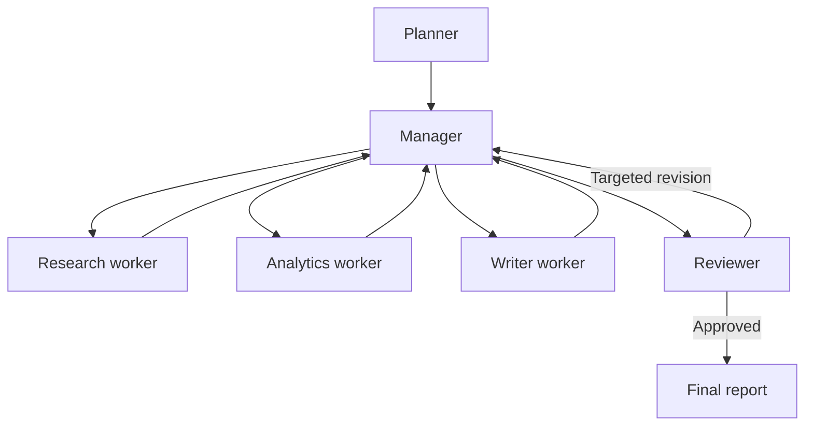

In this combined architecture:

- the planner defines the work breakdown;
- the manager allocates and coordinates work;
- workers produce evidence and artifacts;
- the reviewer applies an independent acceptance gate;
- the final owner publishes or escalates.

---

## 6. Specialized agent teams

A specialized team groups agents by domain expertise. The board gives examples such as research, analytics, UX, and legal.

A useful specialization requires more than a role name. Each specialist should have:

- an owned task class;
- an approved data domain;
- a bounded tool set;
- an output contract;
- measurable success criteria;
- an escalation path.

### 6.1 Weak specialization

```text
Agent: Senior Strategic Research Guru
Goal: Do excellent strategic work
Tools: Everything
```

This creates a persona, not an engineering boundary.

### 6.2 Strong specialization

```text
Agent: Pricing Evidence Analyst
Owns: Extracting and normalizing public subscription prices
Inputs: Approved competitor list and source URLs
Tools: Web fetcher, price parser, currency normalizer
Cannot: Publish recommendations or access internal financial data
Output: PricingEvidence[]
Success: Coverage, normalization accuracy, source completeness
```

### 6.3 Single responsibility

A useful test is:

> What is the one job this agent performs exceptionally well?

If the answer contains several unrelated verbs, the role may be too broad.

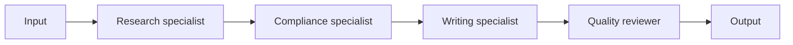

Single responsibility improves:

- prompt clarity;
- tool permission design;
- testability;
- reuse;
- failure diagnosis;
- ownership.

It can also become excessive. Splitting every small action into a separate agent creates handoff overhead without meaningful specialization.

---

## 7. Communication contracts

Agents should exchange structured messages or artifacts rather than unrestricted prose whenever possible.

### 7.1 Work result schema

```json
{
  "work_id": "feature-research-01",
  "status": "completed",
  "summary": "Competitor B added audit export and role templates",
  "claims": [
    {
      "statement": "Audit export is available on the enterprise plan",
      "source_id": "source-17",
      "confidence": 0.94
    }
  ],
  "unknowns": ["launch date not confirmed"],
  "errors": [],
  "metrics": {
    "duration_ms": 842,
    "tool_calls": 3
  }
}
```

### 7.2 Why structure matters

Structured communication enables the orchestrator to:

- validate required fields;
- detect missing evidence;
- merge results deterministically;
- retain provenance;
- calculate metrics;
- resume from checkpoints;
- compare attempts;
- prevent prompt text from silently changing workflow state.

### 7.3 Conversation vs state

Conversation is useful for reasoning and collaboration. It should not be the sole source of truth.

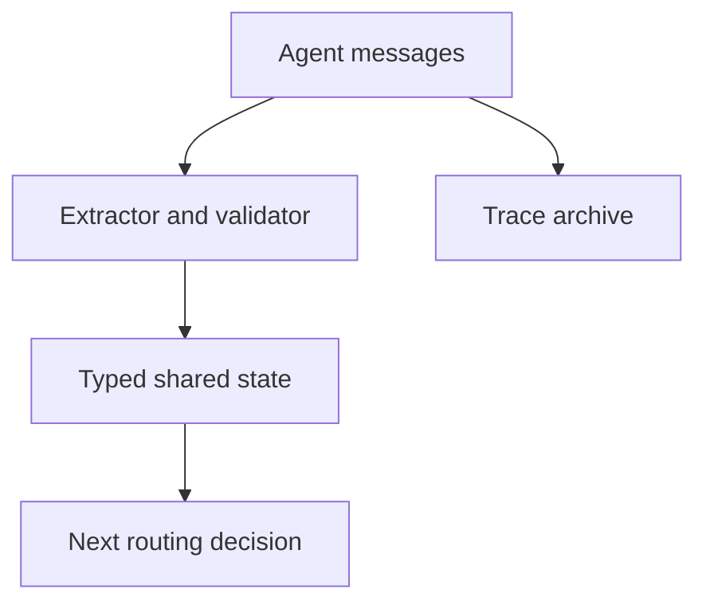

Keep authoritative fields such as status, owner, approval, evidence IDs, and retry count in typed state.

---

## 8. Shared state and ownership

Multi-agent systems often fail because every agent can read and write everything.

A safer state design assigns ownership.

| State field | Owner | Other agents |
|---|---|---|
| Objective | Orchestrator | Read only |
| Work orders | Manager or planner | Read assigned items |
| Evidence | Producing worker | Append with provenance |
| Review decision | Reviewer | Read only |
| Approval status | Human-control service | Read only |
| Final answer | Final owner | Read only after publication |
| Audit events | Audit service | Append only |

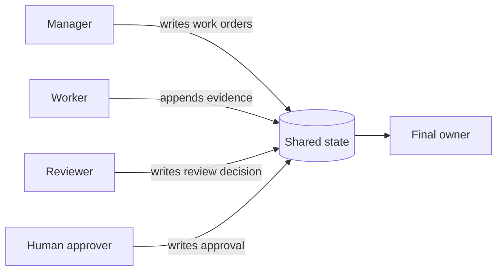

### 8.1 Isolation vs shared memory

Use isolated memory when:

- tasks are independent;
- the data is sensitive;
- specialists have different authorization scopes;
- cross-contamination could bias results.

Use shared state when:

- specialists must build on common evidence;
- the workflow needs coordinated progress;
- the same case or transaction is being processed;
- a final reviewer needs the full evidence package.

A common design is **private reasoning, shared artifacts**:

- each agent has its own model context;
- validated outputs are written to shared state;
- agents receive only the shared artifacts they need.

---

## 9. Permissions and least privilege

Specialization should be reflected in permissions.

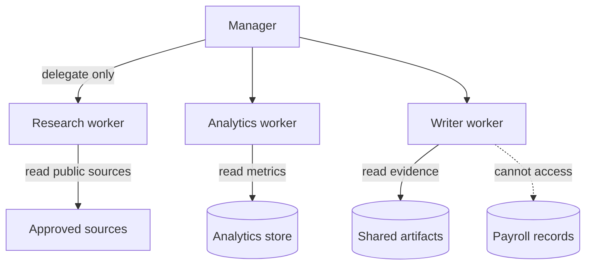

Examples:

- a research agent can read public sources but cannot update CRM records;
- a writer can read approved evidence but cannot fetch arbitrary URLs;
- a payroll specialist can query restricted data but cannot disclose it to unrelated agents;
- a reviewer can inspect tool traces but cannot execute the original transaction;
- a manager can delegate capabilities but cannot grant permissions the user lacks.

> **Security principle**
>
> Delegation may narrow authority, but it must never expand the originating user's authority.

---

## 10. Failure modes

### 10.1 Circular delegation

The board illustrates a failure loop in which two agents delegate back to each other indefinitely.

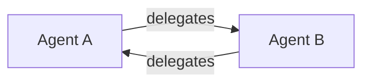

Controls include:

- maximum delegation depth;
- visited-agent tracking;
- prohibition on reassigning unchanged work;
- ownership rules;
- progress checks;
- a final decision owner.

### 10.2 Duplicate work

Two workers may perform the same task because work IDs are missing or descriptions overlap.

Prevent this with:

- stable work IDs;
- assignment locks;
- idempotency keys;
- a dependency graph;
- deduplication before dispatch.

### 10.3 Authority confusion

A worker may assume it can approve or publish its own output.

Prevent this by separating:

- producer;
- reviewer;
- approver;
- publisher.

### 10.4 Lost provenance

A final synthesis may contain claims without knowing which worker or source produced them.

Preserve:

- claim IDs;
- source IDs;
- worker IDs;
- timestamps;
- transformation lineage.

### 10.5 Reviewer rubber-stamping

A reviewer that receives the same prompt, model, and context as the executor may repeat the same mistake.

Increase independence through:

- deterministic checks;
- different evidence views;
- explicit rubrics;
- different model configurations where justified;
- adversarial or counterexample prompts;
- human review for high-impact decisions.

### 10.6 Endless revision

The reviewer may repeatedly request superficial changes.

Require each revision to include:

- failed criterion;
- requested correction;
- expected evidence;
- measurable progress;
- remaining attempt budget.

### 10.7 Context contamination

A specialist may receive unnecessary or untrusted content that changes its behavior.

Use:

- minimum necessary context;
- source labels;
- trusted instruction boundaries;
- content sanitization;
- typed artifacts.

### 10.8 Coordination collapse

Too many agents can create a system where most work is communication.

Measure:

- useful work per agent call;
- number of handoffs;
- duplicated evidence;
- coordination latency;
- merge conflicts;
- agent utilization.

---

## 11. Progress detection and termination

A multi-agent workflow must know whether it is moving closer to completion.

Possible progress signals include:

- a required artifact was produced;
- evidence coverage increased;
- unresolved questions decreased;
- a failed criterion became satisfied;
- a dependency completed;
- confidence improved with new evidence;
- the output changed materially.

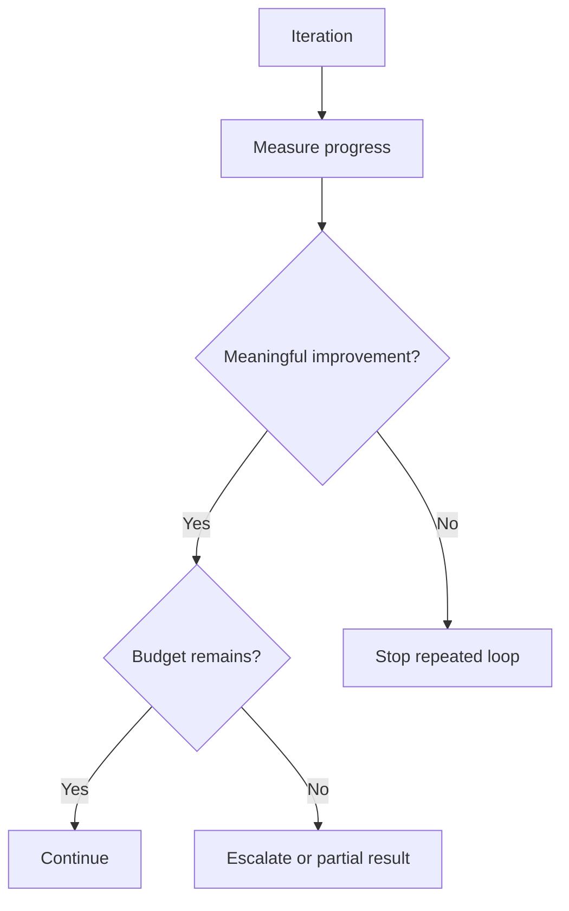

A no-progress detector can compare:

- normalized work orders;
- selected tools;
- source sets;
- review findings;
- artifact hashes;
- completion scores.

If the system repeats the same action with the same inputs and obtains the same result, another model call is unlikely to help.

---

## 12. Competitive-research case study

The board presents a competitive-research flow with research, analytics, writing, and review specialists. The following architecture turns that idea into a controlled workflow.

### 12.1 Objective

Produce a sourced competitor report covering:

- major product capabilities;
- current pricing;
- target segments;
- recent product signals;
- strengths, gaps, and uncertainties.

### 12.2 Architecture

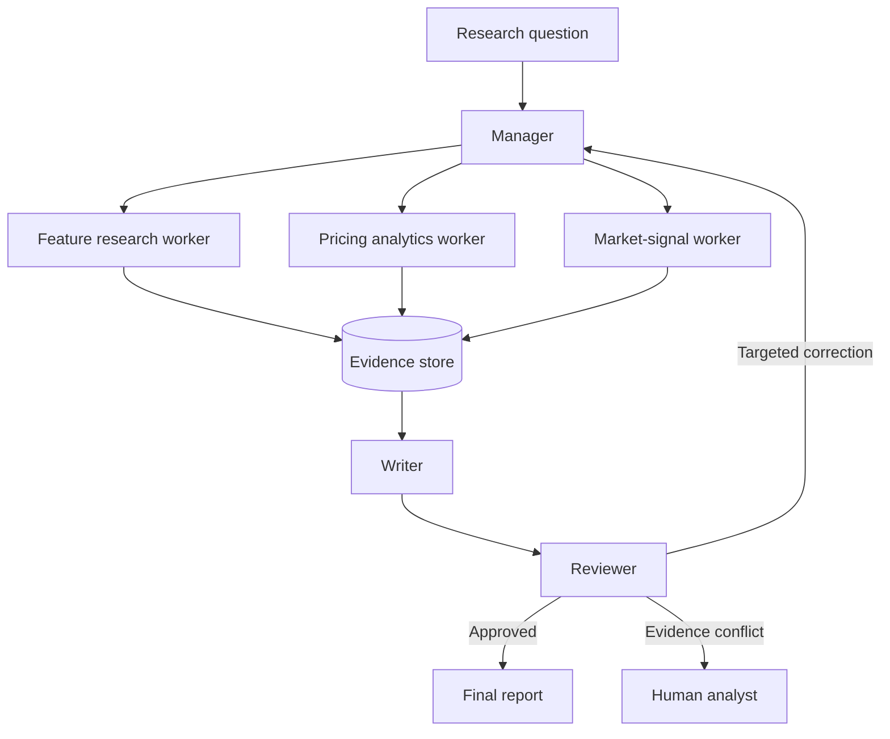

### 12.3 Work breakdown

| Work item | Owner | Deliverable |
|---|---|---|
| Discover approved sources | Research worker | Source manifest |
| Extract product capabilities | Feature worker | Feature evidence table |
| Normalize prices | Analytics worker | Comparable pricing table |
| Identify market signals | Signal worker | Dated signal list |
| Draft narrative | Writer | Report draft |
| Check accuracy and coverage | Reviewer | Review decision |

### 12.4 Acceptance criteria

The report is complete only when:

- every competitor has coverage;
- every important factual claim has a source;
- pricing units are normalized;
- publication dates and freshness are visible;
- unknown values are not guessed;
- strengths and gaps are framed as analysis, not unsupported fact;
- unresolved conflicts are disclosed;
- the final format matches the requested audience.

### 12.5 Failure handling

| Failure | Response |
|---|---|
| Source unavailable | Try approved fallback; disclose gap |
| Conflicting prices | Preserve both with dates; request analyst review |
| Missing competitor | Redispatch targeted research once |
| Unsupported draft claim | Remove or request evidence |
| Reviewer rejects twice | Escalate with evidence package |
| Budget exhausted | Return partial report with limitations |

---

## 13. Evaluation

Evaluation should cover the team, not only the final prose.

### 13.1 Final-outcome metrics

- task completion;
- factual correctness;
- evidence coverage;
- instruction adherence;
- policy compliance;
- usefulness;
- human acceptance rate.

### 13.2 Coordination metrics

- routing accuracy;
- assignment precision;
- work duplication rate;
- handoff count;
- merge conflict rate;
- no-progress loop rate;
- escalation rate;
- successful recovery rate.

### 13.3 Efficiency metrics

- total latency;
- critical-path latency;
- time per agent;
- model calls per task;
- tool calls per task;
- tokens per accepted artifact;
- cost per completed outcome;
- parallelism efficiency.

### 13.4 Reviewer metrics

- defect detection recall;
- false rejection rate;
- accepted-output defect rate;
- revision usefulness;
- human disagreement rate;
- incremental quality gained per review iteration.

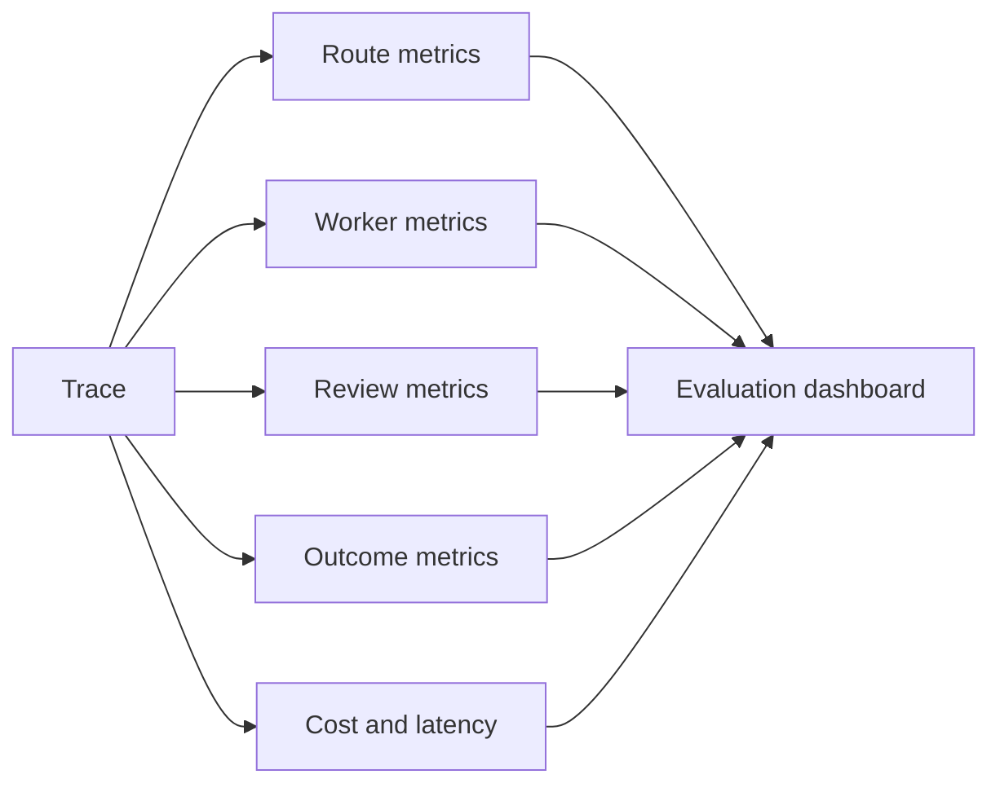

### 13.5 Ablation testing

To justify multiple agents, compare the architecture against simpler baselines:

1. one prompt;
2. one agent with tools;
3. one agent plus deterministic validation;
4. manager-worker;
5. planner-executor-reviewer;
6. combined multi-agent workflow.

If the multi-agent system does not materially improve quality, control, or throughput, its complexity may not be justified.

---

## 14. Observability

A useful trace should show:

- workflow ID;
- objective;
- plan version;
- work order ID;
- assigned agent;
- input and output references;
- tool calls;
- source and evidence IDs;
- start and end time;
- token and cost estimate;
- retries and revision count;
- review decision;
- escalation reason;
- final status.

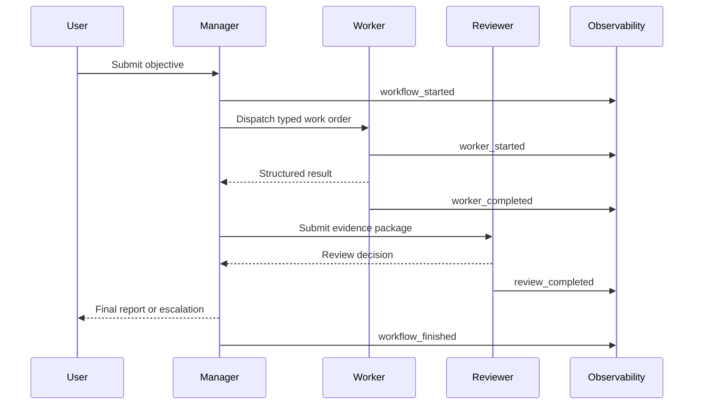

Do not treat verbose model transcripts as sufficient observability. Production traces should expose state transitions and control decisions without requiring an operator to reconstruct the workflow from unstructured reasoning text.

---

## 15. Production reference architecture

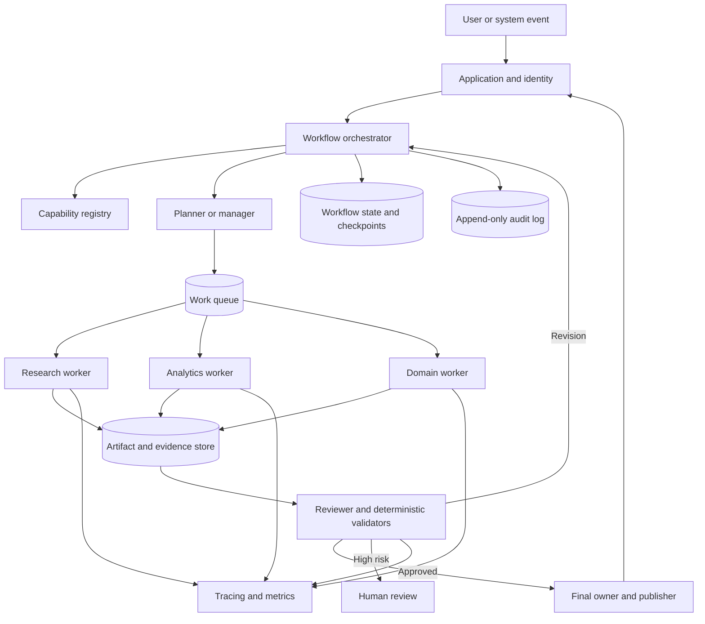

Production controls should include:

- authenticated request context;
- tenant and permission propagation;
- capability allowlists;
- typed inputs and outputs;
- isolated worker contexts;
- evidence provenance;
- idempotency for side effects;
- bounded loops;
- review independence;
- human approval for high-impact actions;
- checkpoint and resume;
- trace and audit retention;
- cost and latency budgets.

---

## 16. Implementation walkthrough

The companion Python example implements a small manager-worker plus reviewer system without external dependencies.

It demonstrates:

- typed work orders;
- a worker registry;
- dependency-aware scheduling;
- parallel execution for independent tasks;
- structured worker results;
- a deterministic reviewer;
- targeted revision;
- no-progress detection;
- bounded attempts;
- evidence-preserving synthesis;
- event tracing.

The example intentionally uses deterministic workers. This isolates the orchestration pattern from any specific model provider. A production implementation can replace a worker function with an LLM-backed specialist while preserving the same contracts.

---

## 17. Design checklist

### Architecture

- [ ] A multi-agent design is justified against a single-agent baseline.
- [ ] Every agent owns one clear responsibility.
- [ ] A final decision owner is identified.
- [ ] The coordination topology matches the task structure.
- [ ] Parallel branches are genuinely independent.

### Contracts

- [ ] Delegation uses typed work orders.
- [ ] Every deliverable has acceptance criteria.
- [ ] Worker outputs are structured and validated.
- [ ] Provenance is preserved at claim or artifact level.
- [ ] Merge and conflict policies are explicit.

### State

- [ ] Workflow state is separate from conversation history.
- [ ] State-field ownership is defined.
- [ ] Shared and isolated memory are used deliberately.
- [ ] Checkpoints support pause and resume.
- [ ] Audit events are append-only.

### Safety

- [ ] Workers have least-privilege tool access.
- [ ] Delegation cannot expand user authority.
- [ ] High-impact actions require approval.
- [ ] Side effects use idempotency keys.
- [ ] Untrusted content cannot become system instructions.

### Reliability

- [ ] Revision and delegation counts are bounded.
- [ ] No-progress loops are detected.
- [ ] Retries are limited to recoverable failures.
- [ ] Partial results and limitations are representable.
- [ ] Human escalation has a complete evidence package.

### Evaluation

- [ ] Final quality is measured.
- [ ] Route and assignment quality are measured.
- [ ] Reviewer usefulness is measured.
- [ ] Coordination overhead is measured.
- [ ] Multi-agent performance is compared with simpler baselines.

---

## 18. Common anti-patterns

### One agent per verb

Splitting every action into a separate agent produces excessive handoffs. Use agents for meaningful responsibility boundaries, not syntactic decomposition.

### Personas without capabilities

A detailed backstory cannot replace tools, permissions, data access, and output contracts.

### Shared transcript as database

Important workflow state should not exist only inside a conversation log.

### Manager as hidden super-agent

If the manager performs all research, analysis, and writing itself, workers become decorative and the architecture loses its control benefits.

### Reviewer as editor only

A reviewer should check evidence, correctness, policy, and completion—not merely improve style.

### Unlimited delegation

Delegation must be bounded by depth, ownership, and progress.

### Every agent can use every tool

This destroys specialization and increases the impact of errors or prompt injection.

### Concatenate and publish

Worker outputs require normalization, deduplication, conflict detection, and synthesis.

### More discussion means more accuracy

Repeated conversational turns can amplify shared errors. Additional turns should be justified by new evidence or a measurable correction.

---

## 19. Hands-on lab - Supplier recommendation team

Design a system that recommends a supplier using:

- quoted price;
- delivery date;
- quality history;
- capacity;
- compliance status;
- risk signals.

### Suggested roles

- **Manager:** decomposes the request and owns final synthesis.
- **Commercial worker:** normalizes price and payment terms.
- **Delivery worker:** checks capacity and delivery feasibility.
- **Quality worker:** analyzes historical defects and quality ratings.
- **Compliance worker:** validates approved-vendor and regulatory status.
- **Reviewer:** verifies coverage, evidence, and policy.

### Required output

| Supplier | Price | Delivery | Quality | Compliance | Risk | Recommendation |
|---|---:|---|---|---|---|---|

The final answer should also include:

- evidence sources;
- unknown or stale fields;
- confidence;
- reason for the recommendation;
- reason any supplier was rejected;
- whether human procurement review is required.

### Constraints

- Commercial and quality checks may run in parallel.
- A supplier cannot be recommended if compliance is unverified.
- The reviewer may request only one targeted revision.
- The manager must return a partial result if one non-critical source is unavailable.
- No agent may change supplier records.

---

## 20. Knowledge checks

1. What makes a multi-agent system different from several independent model calls?
2. When is manager-worker more suitable than planner-executor-reviewer?
3. Why should delegation use typed work orders?
4. What information belongs in a work order?
5. Why should worker outputs preserve provenance?
6. What is the purpose of a dedicated reviewer?
7. How can a review loop become unproductive?
8. What is private reasoning with shared artifacts?
9. Why must delegation never expand authority?
10. How can circular delegation be detected?
11. What metrics reveal coordination overhead?
12. Why should multi-agent systems be tested against simpler baselines?

---

## 21. Interview questions

### Beginner

1. Describe the manager-worker pattern.
2. Describe the planner-executor-reviewer pattern.
3. Give an example of a specialist-agent team.
4. What is a work order?
5. Why does a multi-agent workflow need a termination condition?

### Intermediate

1. How would you run three independent workers in parallel and merge their outputs?
2. How would you design a reviewer that does not merely repeat the executor's answer?
3. How would you prevent two workers from duplicating the same work?
4. When should memory be isolated between agents?
5. How would you preserve claim-level provenance through synthesis?
6. How would you handle one failed branch in a fan-out workflow?

### Advanced

1. Design a multi-agent competitive-intelligence system with authorization, evidence lineage, and bounded revisions.
2. Explain how you would detect no-progress loops across several agents.
3. How would you evaluate whether a reviewer adds enough quality to justify its latency and cost?
4. Design a state schema with field-level ownership for planner, worker, reviewer, and human approver.
5. How would you prevent a compromised research source from changing agent behavior?
6. Compare a conversational team with a graph-based multi-agent workflow for a regulated process.
7. How would you perform an ablation study to justify a five-agent design?

---

## 22. Summary

Manager-worker and planner-executor-reviewer are two foundational ways to coordinate specialist agents.

The manager-worker pattern is strongest when a broad objective can be decomposed into parallel or domain-specific assignments. The planner-executor-reviewer pattern is strongest when the workflow benefits from explicit planning and an independent acceptance gate. They can be combined when a planner defines the work, a manager coordinates specialists, and a reviewer validates the result.

Reliable multi-agent systems require more than roles and prompts. They require typed work orders, capability registries, least-privilege permissions, structured outputs, state ownership, provenance, merge policies, bounded revision, progress detection, human escalation, and end-to-end evaluation.

Use the simplest architecture that can solve the task reliably. Add agents only when responsibility boundaries, permission isolation, parallelism, or independent review produce measurable value.

---

## Further reading in this handbook

- [Chapter 11 - AI Agent Fundamentals and the Execution Loop](../04-agents/01-agent-fundamentals-and-execution-loop.md)
- [Chapter 12 - Tool Calling and Action Execution](../04-agents/02-tool-calling-and-action-execution.md)
- [Chapter 13 - Reflection, Evaluation, and Replanning](../04-agents/03-reflection-evaluation-and-replanning.md)
- [Chapter 14 - Memory and Persistent State](../04-agents/04-memory-and-persistent-state.md)
- [Chapter 16 - CrewAI and Role-Based Multi-Agent Systems](../05-frameworks/02-crewai-role-based-multi-agent-systems.md)
- [Chapter 17 - AutoGen and Conversational Multi-Agent Systems](../05-frameworks/03-autogen-conversational-multi-agent-systems.md)
- [Chapter 19 - Orchestration, Routing, and Shared State](../05-frameworks/05-orchestration-routing-and-shared-state.md)
