# Chapter 21 - Debate, Critique, and Hierarchical Multi-Agent Patterns

> **Source basis:** The board presents debate or critique as a multi-agent pattern in which agents challenge one another, and hierarchy as a topology for complex projects with nested managers. It also shows planner-executor-reviewer flows, competitive-research teams, specialist roles, review loops, and the circular-delegation failure mode [Board, pp. 20-22]. This chapter preserves that framing and expands it into a production engineering guide. Material on argument contracts, evidence ledgers, judge design, asymmetric critique, nested budget allocation, confidence aggregation, convergence tests, and red-team evaluation is **Supplementary**.

---

## Learning objectives

By the end of this chapter, you should be able to:

1. Explain the difference between debate, critique, review, voting, and hierarchy.
2. Identify tasks that benefit from multiple independent perspectives.
3. Avoid using debate when a deterministic rule or direct tool call is sufficient.
4. Design debaters with genuinely different evidence, incentives, or responsibilities.
5. Define structured argument and critique contracts.
6. Separate proposal generation from evidence verification and final adjudication.
7. Build bounded debate rounds with explicit stopping criteria.
8. Detect false consensus, repetitive disagreement, and unsupported confidence.
9. Choose between a model judge, rule-based judge, ensemble, and human decision owner.
10. Design hierarchical agent systems with clear authority and escalation paths.
11. Allocate time, token, tool, and retry budgets across nested teams.
12. Prevent circular delegation and unbounded organizational depth.
13. Preserve provenance across debate and hierarchical synthesis.
14. Evaluate whether critique materially improves outcome quality.
15. Implement a dependency-free debate-and-hierarchy controller in Python.

---

## 1. Why debate and hierarchy exist

Some tasks cannot be made reliable by asking one agent to think harder. The problem may contain:

- ambiguous evidence;
- conflicting objectives;
- domain-specific trade-offs;
- incomplete or inconsistent sources;
- legal, safety, financial, or operational risk;
- a need for independent challenge;
- work that is too broad for one context window or permission boundary.

Two important multi-agent patterns address these conditions:

- **Debate and critique** improve a candidate answer by exposing assumptions, contradictions, missing evidence, and alternative interpretations.
- **Hierarchy** divides a large objective into nested areas of responsibility, each managed by a coordinator with bounded authority.

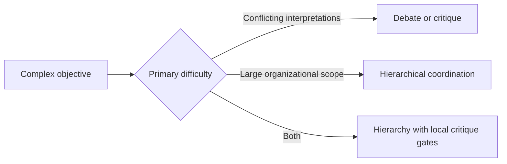

These patterns solve different problems. Debate is about **epistemic quality**: what should the system believe or recommend? Hierarchy is about **organizational scalability**: who owns each part of the work, and how are results combined?

> **Key idea**
>
> Debate creates value only when participants contribute meaningfully different information or evaluation criteria. Hierarchy creates value only when each level has a distinct coordination responsibility.

---

## 2. Debate is not ordinary conversation

A conversational multi-agent system may contain several agents exchanging messages. That does not automatically constitute a useful debate.

A production debate needs:

- a precise question;
- declared positions or responsibilities;
- a shared evidence set or controlled evidence access;
- a structured claim format;
- explicit critique criteria;
- a bounded number of rounds;
- a convergence or termination rule;
- a final decision owner.

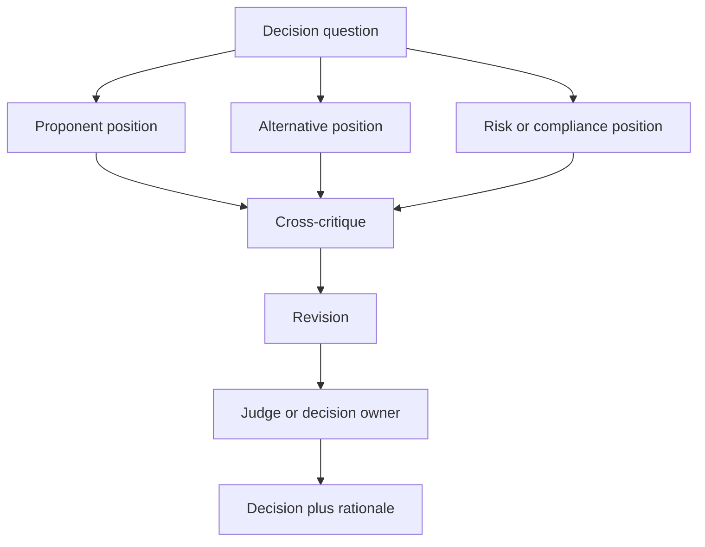

### 2.1 Debate, critique, review, and voting

These terms are related but not interchangeable.

| Pattern | Primary purpose | Typical interaction | Final decision |
|---|---|---|---|
| Debate | Compare competing positions | Agents defend and challenge claims | Judge, rule, vote, or human |
| Critique | Improve one candidate artifact | Critic identifies defects; author revises | Reviewer or owner accepts |
| Review | Check against acceptance criteria | Reviewer tests quality or policy | Pass, revise, escalate |
| Voting | Aggregate independent preferences | Agents select among options | Voting rule |
| Deliberation | Explore trade-offs before deciding | Participants exchange evidence and reasoning | Facilitator or owner |
| Red teaming | Find failures or unsafe behavior | Adversary actively searches for weaknesses | Safety owner |

A planner-executor-reviewer loop is usually a **review** pattern, not a debate. A researcher and skeptic arguing over the interpretation of conflicting evidence is a **debate**. A safety agent attempting to break an action plan is **red teaming**.

### 2.2 When debate adds value

Debate is most defensible when:

- there are multiple plausible answers;
- evidence is incomplete or contradictory;
- the cost of an unchallenged assumption is high;
- different disciplines use different acceptance criteria;
- independent analysis can reduce correlated error;
- the system must expose trade-offs rather than hide them.

Examples:

- supplier selection across cost, quality, delivery, and compliance;
- product prioritization across user value, feasibility, revenue, and risk;
- incident-response hypotheses based on partial telemetry;
- policy interpretation where several clauses apply;
- scientific-literature synthesis with conflicting studies;
- architecture review involving security, reliability, cost, and developer experience.

### 2.3 When debate is unnecessary

Do not use debate when:

- the answer is a direct database lookup;
- a deterministic business rule decides the outcome;
- the system lacks independent evidence sources;
- every debater receives the same prompt, context, and role;
- latency or cost constraints are strict;
- the decision must be made by an accountable human regardless of model opinion;
- the task is low risk and easily reversible.

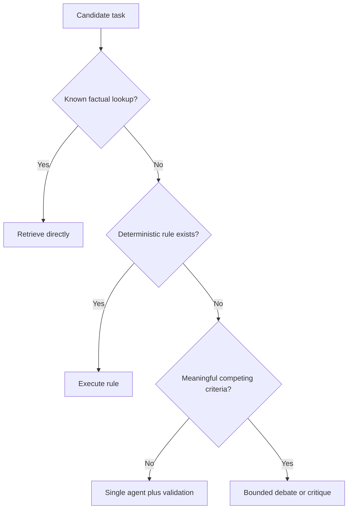

---

## 3. Diversity must be real, not theatrical

A common anti-pattern is to create three agents named Optimist, Pessimist, and Neutral while giving all three the same data, tools, objective, and evaluation standard. This often produces stylistic variation rather than independent insight.

Useful diversity can come from:

- different data sources;
- different tool permissions;
- different domain expertise;
- different loss functions or evaluation criteria;
- independent initial analysis before discussion;
- different model families or configurations;
- separate evidence retrieval paths;
- explicit responsibility for a specific risk class.

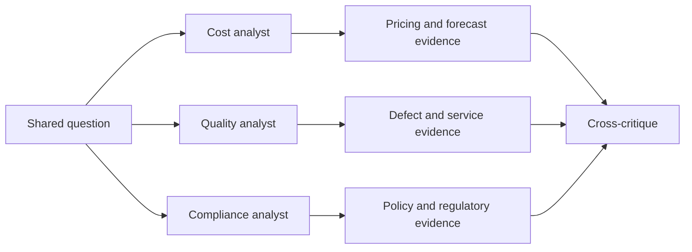

### 3.1 Independent first pass

Agents should usually form an initial position before seeing one another's conclusions. Otherwise, the first response may anchor the rest of the team.

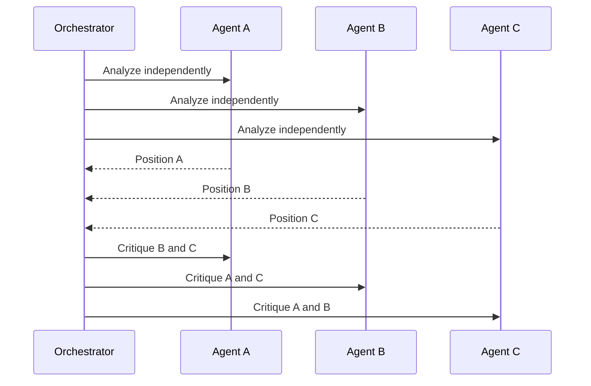

This pattern reduces social convergence and makes disagreement more informative.

### 3.2 Asymmetric roles

Not every participant should attempt to produce the final answer. Asymmetric responsibilities often produce better control.

| Role | Responsibility |
|---|---|
| Proposer | Produce a candidate recommendation |
| Evidence verifier | Check source support and freshness |
| Counterexample seeker | Find cases that invalidate the proposal |
| Risk critic | Identify unsafe or noncompliant implications |
| Cost critic | Quantify operational and financial trade-offs |
| User advocate | Evaluate impact on the target user |
| Judge | Apply a declared decision rubric |

> **Best practice**
>
> Assign critics to specific failure classes. “Find anything wrong” is weaker than “identify unsupported claims, missing evidence, and policy violations.”

---

## 4. Structured argument contracts

Free-form debate is difficult to evaluate and easy to prolong. A structured argument contract makes each contribution testable.

```json
{
  "position_id": "supplier-b-recommendation",
  "claim": "Supplier B should be selected for the launch batch.",
  "decision_criteria": ["delivery", "quality", "cost", "compliance"],
  "evidence": [
    {
      "source_id": "quote-b-2026-08",
      "supports": "cost",
      "statement": "Unit price is 4.3% above Supplier A."
    },
    {
      "source_id": "quality-b-q2",
      "supports": "quality",
      "statement": "Defect rate is below the approved threshold."
    }
  ],
  "assumptions": ["Forecast volume remains within the quoted tier."],
  "uncertainties": ["Expedited-shipping capacity is not confirmed."],
  "risk": "medium",
  "recommended_action": "Request shipping confirmation before award."
}
```

A critique can use a corresponding contract:

```json
{
  "target_position_id": "supplier-b-recommendation",
  "critique_type": "missing_evidence",
  "severity": "high",
  "finding": "The delivery claim is not supported by a confirmed capacity record.",
  "affected_criterion": "delivery",
  "requested_correction": "Retrieve current capacity confirmation or lower confidence.",
  "evidence": ["capacity-record-missing"]
}
```

### 4.1 Claim-evidence-assumption separation

A debate should not allow assumptions to masquerade as facts.

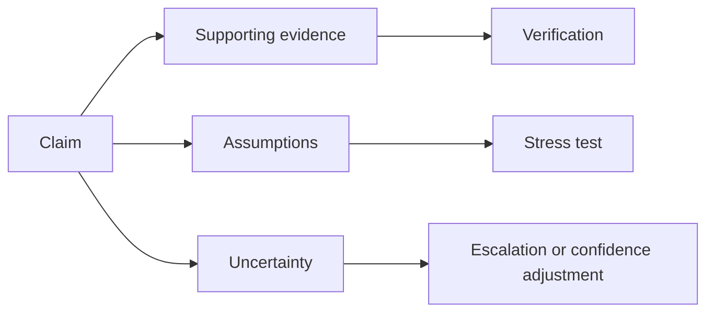

The system should preserve three distinct categories:

- **Evidence:** information supported by a source or tool result.
- **Assumption:** a proposition accepted temporarily but not verified.
- **Inference:** a conclusion derived from evidence and assumptions.

### 4.2 Evidence ledger

A shared evidence ledger prevents agents from repeatedly retrieving the same source and helps the judge inspect provenance.

| Field | Description |
|---|---|
| `evidence_id` | Stable identifier |
| `source` | Document, API, database, or human source |
| `claim_supported` | Claim or criterion the evidence addresses |
| `freshness` | Timestamp or validity period |
| `authority` | Reliability or approval status |
| `access_scope` | Tenant, user, or role restrictions |
| `conflicts_with` | Evidence items that disagree |
| `used_by` | Agents or positions that cited it |

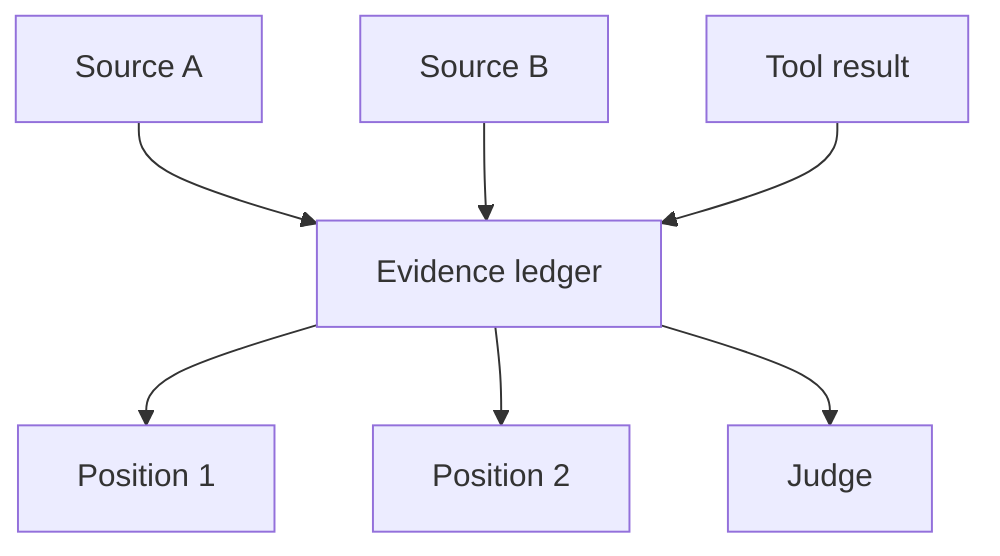

---

## 5. Debate topologies

Different debate structures fit different tasks.

### 5.1 Proponent-opponent-judge

One agent proposes, another challenges, and a judge decides.

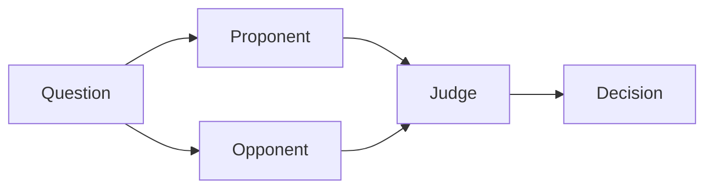

Use this when two positions are clear and the judge has an explicit rubric.

### 5.2 Multi-perspective panel

Several specialists analyze the same decision through different criteria.

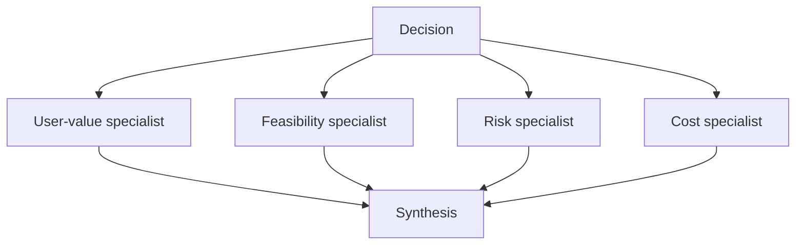

Use this when the decision requires trade-off analysis rather than a binary argument.

### 5.3 Author-critic-reviser

An author creates an artifact, a critic identifies defects, and the author revises.

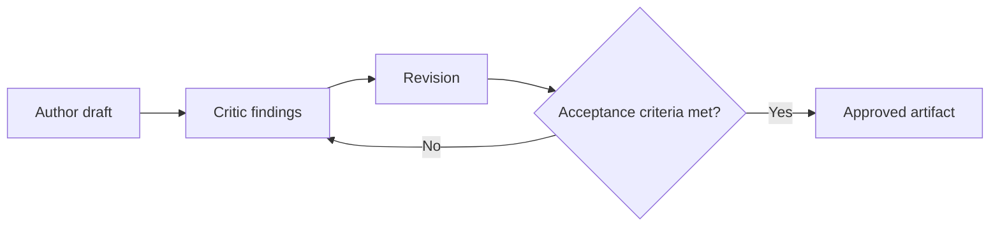

Use this for reports, code, plans, summaries, or policy-compliant responses.

### 5.4 Red-team-blue-team

A blue team proposes or defends a system; a red team attempts to expose vulnerabilities.

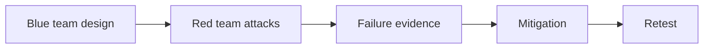

Use this for safety, security, prompt-injection, tool-permission, or failure-recovery testing.

### 5.5 Tournament or bracket

Many candidates are compared pairwise until a small set remains.

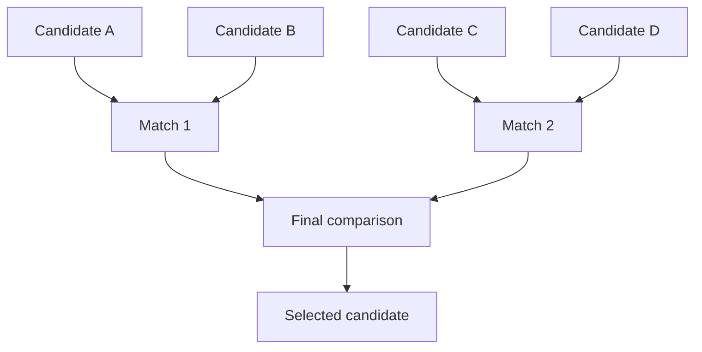

Use this when generating many alternatives would overwhelm a single judge. Be careful: pairwise results may depend on bracket order.

---

## 6. Bounded debate rounds

Unbounded debate is a reliability failure. Production systems need explicit budgets and stop conditions.

A debate controller should track:

- current round;
- remaining model-call budget;
- remaining token budget;
- remaining retrieval budget;
- unresolved high-severity findings;
- evidence coverage;
- position changes;
- duplicate critiques;
- elapsed time;
- escalation state.

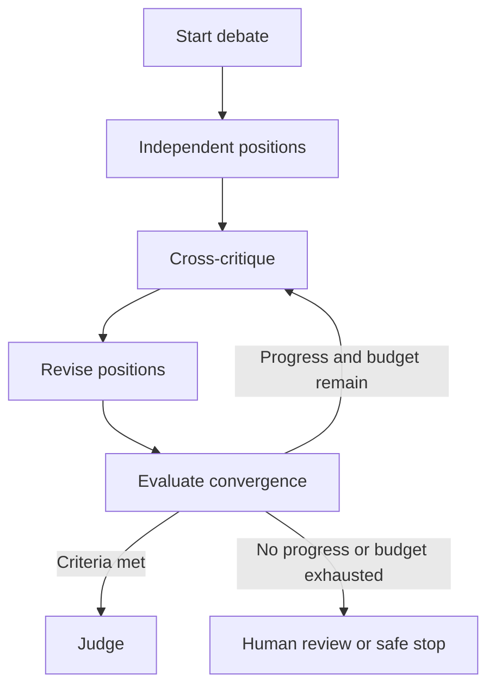

### 6.1 Termination conditions

A debate can stop when one or more conditions hold:

- all mandatory criteria have sufficient evidence;
- no unresolved high-severity critique remains;
- the judge's confidence exceeds a threshold;
- positions converge within an agreed tolerance;
- no material change occurs between rounds;
- maximum rounds are reached;
- the cost or latency budget is exhausted;
- a human decision is required by policy.

### 6.2 Progress measurement

A debate should continue only when another round is likely to improve the artifact.

Possible progress signals:

- evidence coverage increased;
- a contradiction was resolved;
- uncertainty decreased;
- a high-severity critique was addressed;
- the recommendation changed materially;
- confidence became better calibrated;
- an unsupported claim was removed.

```text
progress_score =
    evidence_gain
  + resolved_critical_findings
  + uncertainty_reduction
  + material_artifact_change
  - repeated_claims
  - duplicate_tool_calls
```

The exact formula can be deterministic, model-based, or hybrid. Its main purpose is to prevent conversational motion from being mistaken for progress.

### 6.3 No-progress detection

Stop or escalate when:

- the same critique appears twice without new evidence;
- agents repeat their original positions;
- no new source is added;
- revisions alter wording but not substance;
- the judge requests the same correction repeatedly;
- tool calls return the same failure;
- the remaining disagreement is a value judgment requiring human ownership.

---

## 7. Judge and decision-owner design

The final judge is a critical control point. A weak judge can erase all benefits of independent analysis.

### 7.1 Judge options

| Judge type | Strength | Risk | Appropriate use |
|---|---|---|---|
| Deterministic rule | Reproducible and auditable | Limited to explicit criteria | Compliance thresholds, scoring rules |
| Model judge | Flexible semantic evaluation | Bias and inconsistency | Complex written artifacts |
| Ensemble judge | Reduces single-judge variance | Higher cost and complexity | High-value ambiguous decisions |
| Human judge | Accountable and context-aware | Slower and capacity-limited | High-impact or policy-required decisions |
| Hybrid judge | Combines rules, model, and human | More engineering effort | Enterprise production systems |

### 7.2 Judge rubric

A judge should receive a declared rubric, not a vague instruction to choose the best answer.

```json
{
  "criteria": {
    "factual_support": 0.30,
    "requirement_coverage": 0.20,
    "risk_control": 0.20,
    "cost": 0.10,
    "delivery_feasibility": 0.10,
    "clarity": 0.10
  },
  "hard_constraints": [
    "no confidential data exposure",
    "all required evidence must be current",
    "high-risk actions require human approval"
  ],
  "tie_breaker": "prefer the lower-risk reversible option"
}
```

### 7.3 Separate judge context

Do not expose the judge only to the final persuasive prose. Provide:

- original question;
- decision rubric;
- candidate positions;
- critiques;
- revisions;
- evidence ledger;
- unresolved uncertainties;
- cost and latency trace;
- policy constraints.

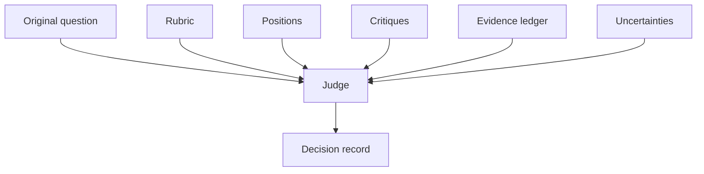

### 7.4 Decision record

The output should be more than a winner label.

```json
{
  "decision": "conditional_approval",
  "selected_position": "supplier-b-recommendation",
  "criteria_scores": {
    "factual_support": 0.92,
    "risk_control": 0.80,
    "delivery_feasibility": 0.68
  },
  "unresolved_issues": ["expedited capacity not confirmed"],
  "required_next_action": "obtain written capacity confirmation",
  "confidence": 0.76,
  "human_approval_required": true
}
```

---

## 8. Failure modes in debate systems

### 8.1 False consensus

Agents converge because they share the same model, prompt, retrieval results, or anchoring response.

**Controls:**

- independent first pass;
- different evidence paths;
- blind candidate identifiers;
- role-specific evaluation criteria;
- delayed exposure to other positions.

### 8.2 Performative disagreement

Agents create artificial conflict without adding evidence.

**Controls:**

- require every critique to identify a testable defect;
- require severity and requested correction;
- reject unsupported stylistic disagreement;
- score novelty and evidence contribution.

### 8.3 Persuasion over truth

A rhetorically strong agent may outperform a cautious evidence-based agent.

**Controls:**

- judge claims and evidence separately;
- hide agent identity from the judge;
- enforce citation validation;
- penalize unsupported certainty;
- use deterministic hard constraints.

### 8.4 Judge bias

The judge may favor the first, longest, or most confident position.

**Controls:**

- randomize or rotate candidate order;
- normalize response length;
- blind labels;
- compare judge decisions across perturbations;
- use an ensemble or human for high-impact cases.

### 8.5 Debate loops

Agents repeat claims and critiques indefinitely.

**Controls:**

- maximum rounds;
- progress proofs;
- duplicate-content detection;
- unresolved-issue ledger;
- explicit escalation after budget exhaustion.

### 8.6 Evidence laundering

One agent repeats another agent's unsupported statement as though it were independently verified.

**Controls:**

- preserve source IDs;
- distinguish original evidence from agent-generated claims;
- require source authority and freshness;
- prohibit agent messages from becoming evidence without verification.

---

## 9. Hierarchical multi-agent systems

A hierarchy introduces multiple levels of coordination. A top-level manager delegates outcomes to domain managers, who delegate bounded work to specialists.

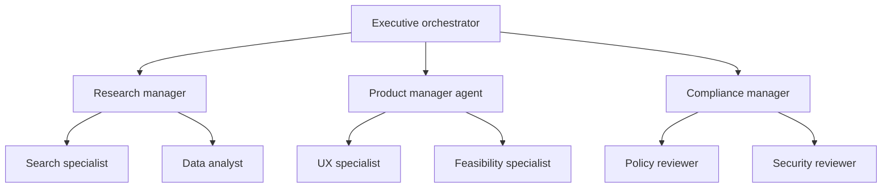

Hierarchy can reduce context overload and align the system with real organizational boundaries. It can also multiply failure modes if authority and state ownership are unclear.

### 9.1 What each level should own

| Level | Primary responsibility |
|---|---|
| Executive orchestrator | Overall objective, budget, cross-domain trade-offs, final escalation |
| Domain manager | Domain decomposition, specialist assignment, local synthesis |
| Specialist agent | Narrow task execution and evidence production |
| Reviewer or control agent | Acceptance, policy, safety, and quality checks |
| Human owner | High-impact approval and accountability |

> **Key idea**
>
> A manager should summarize and coordinate, not redo every specialist's work. If each level repeats the full analysis, hierarchy increases cost without adding control.

### 9.2 Hierarchical work contracts

Delegation across levels should preserve a contract hierarchy.

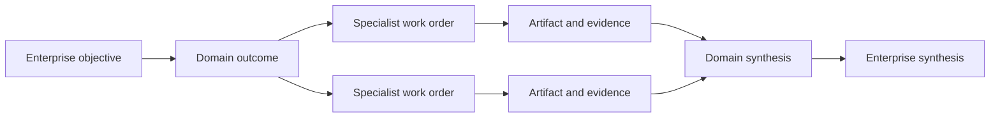

Each contract should specify:

- objective and scope;
- decision owner;
- allowed subdelegation depth;
- budget allocation;
- deliverable schema;
- evidence requirements;
- permissions;
- escalation path;
- deadline;
- acceptance criteria.

### 9.3 Bounded depth

Unbounded hierarchy creates latency, cost, and ambiguity. Define:

- maximum delegation depth;
- maximum children per manager;
- maximum total work orders;
- maximum handoff count;
- maximum review cycles;
- maximum cost and time per subtree.

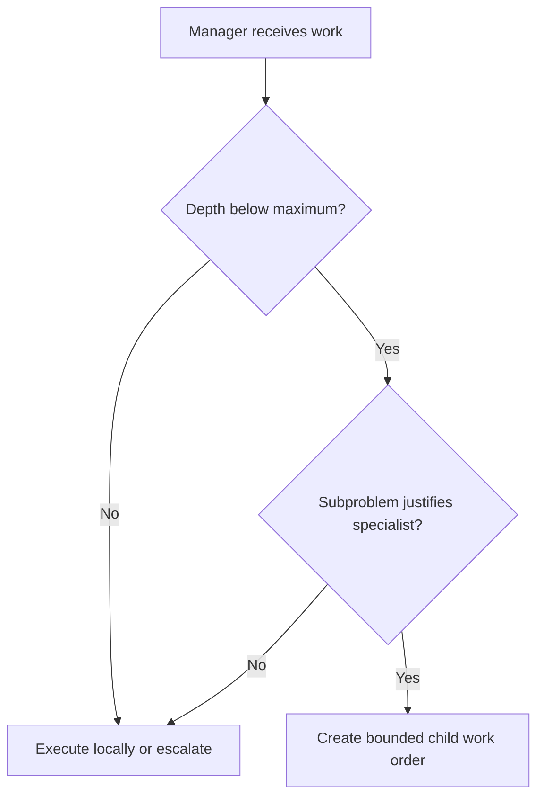

### 9.4 Local autonomy and global control

Domain managers need enough autonomy to complete their responsibilities, but the top-level orchestrator must retain global constraints.

Global controls may include:

- tenant and user authorization;
- safety policies;
- total cost and latency budgets;
- data residency;
- approved tools and models;
- audit requirements;
- final human approval thresholds.

Local controls may include:

- domain-specific routing;
- specialist selection;
- evidence quality criteria;
- local retry policy;
- domain merge rules.

---

## 10. Budget allocation in hierarchies

A hierarchy should treat compute, time, tools, and human review as finite resources.

```text
Total workflow budget
  -> reserve for final synthesis and review
  -> allocate domain budgets
  -> allocate specialist budgets
  -> reclaim unused budget
  -> stop low-value branches
```

### 10.1 Budget dimensions

| Budget | Example control |
|---|---|
| Model calls | Maximum calls per subtree |
| Tokens | Input and output token allowance |
| Time | Deadline or per-step timeout |
| Tool calls | API or retrieval-call limit |
| Money | Maximum estimated cost |
| Retries | Maximum repeated attempts |
| Human reviews | Limited approval capacity |
| Risk | Maximum autonomous impact |

### 10.2 Dynamic budget reallocation

A top-level orchestrator may shift budget when one branch is more valuable or uncertain.

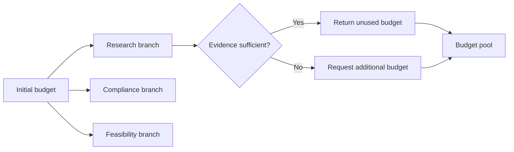

Budget reallocation should be policy-driven. An agent should not silently consume unlimited resources because it is uncertain.

---

## 11. State and provenance across a hierarchy

Hierarchical systems need multiple state scopes.

- **Global workflow state:** objective, user, tenant, budgets, policy, final status.
- **Domain state:** local plan, domain evidence, unresolved issues, subtask status.
- **Specialist state:** tool observations, intermediate artifact, retry count.
- **Audit state:** immutable events, decisions, approvals, and source references.

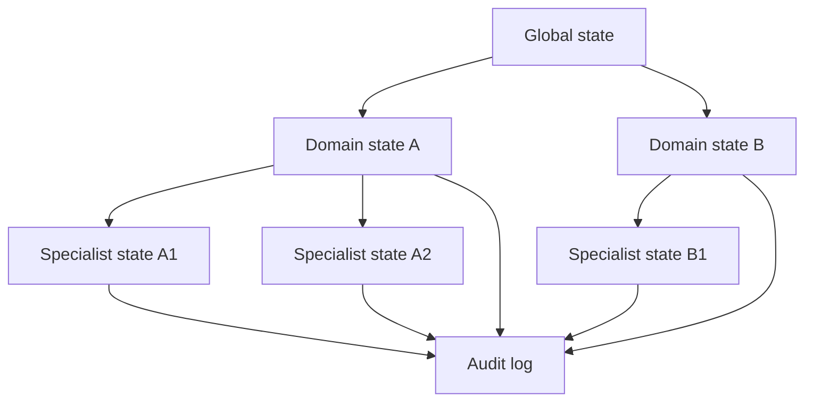

### 11.1 Avoid copying all context everywhere

Every child should receive only the context needed for its work order. This reduces:

- confidential-data exposure;
- irrelevant context;
- token usage;
- prompt injection propagation;
- accidental authority expansion;
- cross-domain contamination.

### 11.2 Provenance-preserving synthesis

When a domain manager summarizes specialist results, it should preserve links to:

- source evidence;
- originating specialist;
- tool-call record;
- timestamp and freshness;
- confidence or uncertainty;
- unresolved contradiction;
- reviewer outcome.

A final answer should never make a claim that cannot be traced back through the hierarchy.

---

## 12. Combining hierarchy with critique

The strongest production design is often not a global free-for-all debate. It is a hierarchy with **local critique gates**.

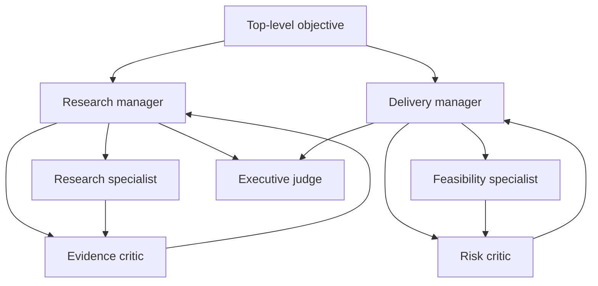

Advantages:

- critics see domain-relevant context;
- disagreement is resolved near its source;
- the top-level judge receives concise validated artifacts;
- permissions remain isolated;
- debate cost is concentrated where risk is highest.

### 12.1 Example: product-launch decision

```text
Executive orchestrator
  -> Market manager
       -> research agent
       -> evidence critic
  -> Engineering manager
       -> feasibility agent
       -> reliability critic
  -> Risk manager
       -> compliance agent
       -> security critic
  -> Executive judge
       -> approve, defer, or escalate
```

The executive judge should not repeat the specialist work. It should compare validated domain conclusions using the launch decision rubric.

---

## 13. Human-in-the-loop boundaries

Debate does not remove the need for human accountability. Hierarchy does not transfer legal or business authority to models.

Human review is appropriate when:

- evidence remains materially conflicting;
- the decision affects employment, healthcare, finance, safety, or legal status;
- the system proposes an irreversible action;
- policy explicitly requires approval;
- confidence is low and impact is high;
- debaters disagree on a value judgment;
- the judge cannot satisfy a hard constraint.

```mermaid
flowchart TD
    J[Judge result] --> H{High impact or unresolved critical issue?}
    H -->|No| A[Automated completion]
    H -->|Yes| Q[Human review queue]
    Q --> P[Approve]
    Q --> E[Edit]
    Q --> R[Reject]
    Q --> X[Request more evidence]
```

The human reviewer should receive:

- concise decision summary;
- candidate positions;
- strongest supporting and opposing evidence;
- unresolved issues;
- policy constraints;
- proposed action and reversibility;
- audit trail.

---

## 14. Observability and evaluation

A debate can sound sophisticated while adding no measurable value. Evaluation must compare it with simpler baselines.

### 14.1 Core metrics

| Metric | Question |
|---|---|
| Outcome quality | Did the final answer improve? |
| Critical-error rate | Were serious mistakes reduced? |
| Evidence coverage | Are required claims supported? |
| Critique precision | Were flagged defects real? |
| Critique recall | Were important defects found? |
| Revision value | Did revisions resolve findings? |
| Judge consistency | Does the judge make stable decisions? |
| Calibration | Does confidence match correctness? |
| Convergence rate | How often does the system reach a decision? |
| Escalation rate | How often is human review required? |
| Debate overhead | Additional latency, calls, tokens, and cost |
| Hierarchy efficiency | Useful work per branch and level |

### 14.2 Baseline comparisons

Evaluate at least:

1. one model response;
2. one model plus deterministic validation;
3. author-critic-reviser;
4. independent panel plus judge;
5. hierarchy with local critique.

```mermaid
flowchart LR
    D[Evaluation dataset] --> B1[Single-agent baseline]
    D --> B2[Single agent plus validator]
    D --> B3[Critique loop]
    D --> B4[Debate panel]
    D --> B5[Hierarchy plus critique]
    B1 --> C[Compare quality, cost, latency, safety]
    B2 --> C
    B3 --> C
    B4 --> C
    B5 --> C
```

Do not adopt a complex pattern unless it improves the target metric enough to justify its overhead.

### 14.3 Trace model

Record events such as:

```json
{
  "workflow_id": "launch-review-042",
  "round": 2,
  "agent": "security_critic",
  "event": "critique_created",
  "target": "engineering-position-v2",
  "severity": "high",
  "evidence_ids": ["threat-model-17"],
  "duration_ms": 1480,
  "model_calls": 1,
  "status": "complete"
}
```

A useful trace answers:

- who made each claim;
- what evidence was used;
- which critiques were resolved;
- why the debate continued or stopped;
- how the judge reached the result;
- which human approved the action;
- how much the workflow cost.

---

## 15. Worked example: supplier recommendation council

The board includes a supplier-recommendation example and multi-agent specialist patterns. A production council can combine hierarchy and critique.

### 15.1 Objective

Recommend a supplier for a time-sensitive product launch while considering:

- price;
- delivery capacity;
- quality history;
- compliance status;
- operational risk.

### 15.2 Architecture

```mermaid
flowchart TB
    U[Procurement request] --> O[Procurement orchestrator]
    O --> CM[Commercial manager]
    O --> OM[Operations manager]
    O --> RM[Risk manager]
    CM --> PA[Pricing analyst]
    CM --> CC[Commercial critic]
    OM --> DA[Delivery analyst]
    OM --> QC[Quality critic]
    RM --> CA[Compliance analyst]
    RM --> SC[Security and continuity critic]
    PA --> CM
    CC --> CM
    DA --> OM
    QC --> OM
    CA --> RM
    SC --> RM
    CM --> J[Decision council]
    OM --> J
    RM --> J
    J --> H{Approval threshold}
    H -->|Low risk| F[Recommendation]
    H -->|High impact| HR[Human procurement review]
```

### 15.3 Domain outputs

Each domain manager returns a typed conclusion.

```json
{
  "domain": "operations",
  "recommended_supplier": "Supplier B",
  "criteria_scores": {
    "delivery_capacity": 0.84,
    "quality_history": 0.91
  },
  "evidence_ids": ["capacity-b-08", "quality-b-q2"],
  "unresolved_issues": ["expedited capacity requires written confirmation"],
  "confidence": 0.79,
  "status": "conditional"
}
```

### 15.4 Final decision rule

The council can use hard and soft criteria:

```text
Hard constraints
- approved compliance status
- defect rate below threshold
- no unresolved critical continuity risk

Weighted criteria
- delivery 35%
- quality 30%
- cost 20%
- service history 15%

Tie-breaker
- choose the more reversible or diversified option
```

### 15.5 Safe result

A good output exposes uncertainty:

```text
Recommended supplier: Supplier B, conditional on written capacity confirmation.

Why:
- strongest quality history;
- acceptable total cost;
- delivery plan meets launch window;
- compliance checks passed.

Unresolved issue:
- expedited capacity is not yet contractually confirmed.

Required next action:
- obtain written confirmation before issuing the purchase order.

Human approval required: Yes.
```

---

## 16. Implementation pattern

The accompanying Python example demonstrates a bounded workflow with:

- independent positions;
- typed critiques;
- evidence IDs;
- revision;
- deterministic judging;
- progress detection;
- maximum rounds;
- a two-level hierarchy;
- human-escalation flags;
- event tracing.

The control flow is intentionally deterministic around the agent-like functions.

```mermaid
flowchart TD
    S[Start] --> P[Generate independent domain positions]
    P --> C[Create targeted critiques]
    C --> R[Revise positions]
    R --> G{Progress made?}
    G -->|Yes and rounds remain| C
    G -->|No| E[Stop or escalate]
    G -->|Criteria met| J[Judge]
    J --> H{Human approval required?}
    H -->|No| O[Return decision]
    H -->|Yes| Q[Return review package]
```

> **Engineering note**
>
> In a real LLM implementation, keep orchestration, budgets, schema validation, permissions, and termination in code. Use models for interpretation, proposal, critique, and synthesis within those controls.

---

## 17. Design checklist

### Debate design

- [ ] The question contains a real ambiguity or trade-off.
- [ ] Each participant has a distinct evidence source or evaluation responsibility.
- [ ] Initial positions are generated independently.
- [ ] Claims, evidence, assumptions, and uncertainty are separated.
- [ ] Critiques use a structured schema.
- [ ] The judge has an explicit rubric.
- [ ] Maximum rounds and budgets are defined.
- [ ] No-progress and duplicate-critique detection are implemented.
- [ ] High-impact decisions have a human owner.

### Hierarchy design

- [ ] Every level has a distinct coordination responsibility.
- [ ] Maximum delegation depth is bounded.
- [ ] Work orders define scope, deliverables, permissions, and acceptance criteria.
- [ ] Global and local policies are separated.
- [ ] State is scoped by workflow, domain, and specialist.
- [ ] Provenance survives every synthesis layer.
- [ ] Budget is allocated and reclaimed explicitly.
- [ ] Circular delegation and duplicate work are detected.
- [ ] Managers do not repeat specialist work unnecessarily.

### Evaluation design

- [ ] Complex patterns are compared with single-agent baselines.
- [ ] Critique precision and revision value are measured.
- [ ] Judge order bias and consistency are tested.
- [ ] Outcome quality, latency, cost, and escalation are monitored.
- [ ] Adversarial and conflicting-evidence test cases are included.

---

## 18. Common mistakes

### Mistake 1: creating personas instead of capabilities

Three differently named agents with the same data and tools are not an independent panel.

**Better:** isolate evidence paths and criteria.

### Mistake 2: allowing unrestricted free-form discussion

The conversation becomes long, persuasive, and hard to evaluate.

**Better:** use typed positions, critiques, revisions, and decision records.

### Mistake 3: treating every disagreement as a reason for another round

Some disagreements are value judgments or require missing external evidence.

**Better:** classify the disagreement and escalate when appropriate.

### Mistake 4: using the same model as proposer, critic, and judge without testing correlation

This can create shared blind spots.

**Better:** use independent prompts, blinded order, deterministic checks, alternative models, or human review for critical cases.

### Mistake 5: building deep hierarchies because they resemble an organization chart

More levels increase handoffs and information loss.

**Better:** add a level only when it owns a meaningful coordination boundary.

### Mistake 6: losing provenance during synthesis

A polished executive summary may contain claims that cannot be traced to evidence.

**Better:** require source IDs and uncertainty to survive every merge.

### Mistake 7: giving managers broad tool permissions

A manager often needs to coordinate, not execute every sensitive action.

**Better:** keep execution permissions with narrow specialists and approval services.

---

## 19. Hands-on lab: architecture review council

### Goal

Design a multi-agent council to review a proposed production RAG architecture.

### Required roles

- architecture proposer;
- retrieval-quality critic;
- security critic;
- reliability critic;
- cost critic;
- final judge.

### Required artifacts

1. Architecture proposal.
2. Evidence ledger.
3. Structured critiques.
4. Revised proposal.
5. Decision record.
6. Escalation rule.
7. Execution trace.

### Hard constraints

- tenant isolation must be enforced;
- documents must be authorization-filtered before generation;
- high-risk write actions require approval;
- source provenance must be visible;
- the workflow must have a bounded latency target.

### Evaluation questions

- Did each critic discover a different failure class?
- Did the revision address the high-severity findings?
- Did the judge follow the declared rubric?
- Was any claim accepted without evidence?
- Did debate improve the architecture enough to justify its cost?

---

## 20. Knowledge checks

1. Why is an independent first pass important in debate systems?
2. What is the difference between critique and debate?
3. Why should claims, evidence, assumptions, and inference be stored separately?
4. What makes diversity between agents substantive rather than cosmetic?
5. Name three valid termination conditions for a debate.
6. What is evidence laundering, and how can it be prevented?
7. Why can a model judge become a single point of failure?
8. What responsibility belongs to a domain manager in a hierarchy?
9. Why should delegation depth be bounded?
10. How can local critique gates reduce global coordination cost?
11. Which metrics show whether critique actually improved an artifact?
12. When should unresolved disagreement be escalated to a human?

---

## 21. Interview questions

### Foundation

1. Compare manager-worker, debate, and hierarchical multi-agent patterns.
2. When is a single agent preferable to a debate system?
3. Explain the role of a judge in multi-agent deliberation.
4. What information should be included in a structured critique?

### Intermediate

5. Design a bounded author-critic-reviser loop.
6. How would you prevent agents from repeating unsupported claims?
7. How would you test whether three debaters are genuinely independent?
8. Explain how evidence provenance should flow through a hierarchy.
9. How would you allocate budgets to domain managers and specialists?
10. What stop conditions would you use for a product-prioritization debate?

### Advanced

11. Design a judge that combines deterministic rules, model evaluation, and human approval.
12. How would you evaluate order bias in an LLM judge?
13. Design a hierarchy for enterprise incident response with security and operational specialists.
14. How would you detect circular delegation across nested managers?
15. How would you prevent prompt injection retrieved by one specialist from propagating to the whole team?
16. Compare global debate with local critique gates.
17. How would you calibrate confidence when participants disagree?
18. Propose an offline benchmark for measuring critique precision and revision value.

---

## 22. Chapter summary

Debate, critique, and hierarchy are not mechanisms for making a system appear more intelligent. They are control patterns for specific classes of uncertainty and organizational complexity.

A reliable debate system:

- uses genuinely different perspectives;
- begins with independent analysis;
- represents positions and critiques structurally;
- preserves evidence and uncertainty;
- runs for a bounded number of rounds;
- measures progress;
- applies an explicit judge rubric;
- escalates high-impact unresolved decisions.

A reliable hierarchy:

- gives every level a distinct responsibility;
- delegates through typed contracts;
- limits depth and fan-out;
- isolates permissions and context;
- allocates finite budgets;
- preserves provenance;
- uses local review gates;
- retains a final accountable owner.

The governing principle is the same throughout this handbook:

> Use the simplest architecture that can reliably satisfy the task, evidence, safety, and accountability requirements.

---

## 23. Next chapter

The next chapter examines **multi-agent coordination failures and reliability controls**, including deadlocks, circular handoffs, delegation storms, duplicated work, inconsistent shared state, context contamination, correlated failures, and production recovery patterns.
