# Chapter 22 - Multi-Agent Failure Modes and Reliability Controls

> **Source basis:** The board identifies circular delegation, failure loops, repeated retries, no-progress behavior, unsafe tool use, shared-state problems, missing termination conditions, human override mechanisms, guardrails, observability, and edge-case testing as core risks in agentic systems [Board, pp. 20-33]. This chapter preserves that framing and expands it into a production reliability guide. Material on failure taxonomy, distributed-systems analogies, quorum controls, idempotency, circuit breakers, bulkheads, fault injection, safety cases, and reliability service-level objectives is **Supplementary**.

---

## Learning objectives

By the end of this chapter, you should be able to:

1. Explain why adding agents increases coordination risk as well as capability.
2. Distinguish model failure, coordination failure, tool failure, state failure, and policy failure.
3. Detect circular delegation, livelock, deadlock, retry storms, and no-progress loops.
4. Define explicit ownership, completion, and termination contracts.
5. Prevent duplicate side effects with idempotency and action ledgers.
6. Use budgets, circuit breakers, timeouts, bulkheads, and fallbacks.
7. Design shared state with versioning, provenance, and conflict resolution.
8. Reduce correlated error and false consensus across agents.
9. Build human escalation paths that preserve context and decision authority.
10. Create observability that reconstructs the full multi-agent trajectory.
11. Evaluate reliability at task, step, system, and business levels.
12. Test edge cases with fault injection and adversarial scenarios.
13. Define production readiness criteria and reliability objectives.
14. Implement a bounded multi-agent reliability controller in Python.

---

## 1. Capability grows faster than predictability

A single agent already combines probabilistic reasoning, external tools, context, and policy. A multi-agent system adds several more dimensions:

- multiple planners;
- multiple model calls;
- multiple tool and data permissions;
- handoffs and message routing;
- shared or isolated memory;
- parallel execution;
- merge and review logic;
- nested retries;
- several possible decision owners.

Each additional component can contribute useful specialization, but every connection also creates a failure surface.

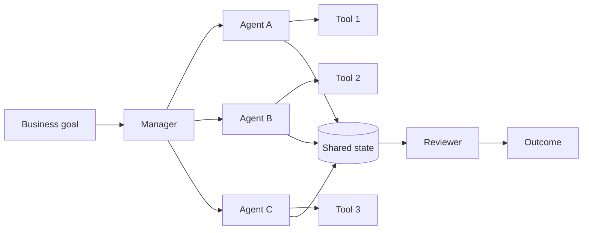

The important engineering question is not merely, "Can the agents complete the task?" It is:

> Can the system complete the task within bounded time, cost, authority, and risk while producing an auditable outcome?

A multi-agent system is reliable when it:

- makes measurable progress;
- stops when progress is absent;
- preserves state integrity;
- avoids duplicate or unauthorized actions;
- degrades safely when dependencies fail;
- explains why it continued, retried, escalated, or stopped.

---

## 2. A failure taxonomy

Failures should be classified before recovery is chosen. Treating every problem as "ask the model again" creates expensive loops and can make side effects unsafe.

| Failure class | Description | Example | Preferred response |
|---|---|---|---|
| Model failure | An agent produces an incorrect or malformed result | Reviewer receives invalid JSON | Validate, repair once, then fallback |
| Coordination failure | Agents do not allocate or hand off work correctly | Two agents delegate the same task repeatedly | Ownership and hop limits |
| Tool failure | External capability is unavailable or returns an error | CRM API times out | Retry with backoff or fallback |
| State failure | Shared state is stale, inconsistent, or corrupted | Two workers overwrite each other's updates | Versioning and atomic writes |
| Policy failure | A proposed action violates permissions or rules | Research agent attempts payroll write | Deny and escalate |
| Evidence failure | Claims are unsupported, stale, or contradictory | Final report cites no source | Retrieve, verify, or lower confidence |
| Resource failure | Time, token, cost, or concurrency budgets are exhausted | Debate continues for ten rounds | Stop or escalate |
| Human-control failure | Approval or intervention cannot be completed | Approval request has no owner | Safe stop with preserved context |

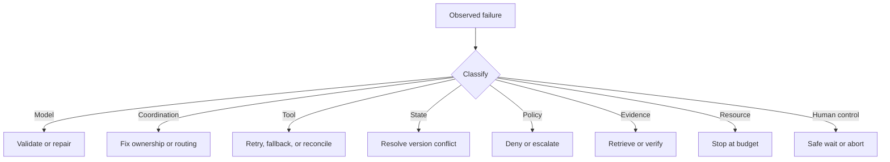

> **Best practice**
>
> Recovery policy should be selected by failure class, not by whichever agent noticed the error.

---

## 3. Circular delegation

The board illustrates a classic failure loop: Agent A delegates to Agent B, and Agent B delegates back to Agent A indefinitely. This is a coordination defect, not a reasoning defect.

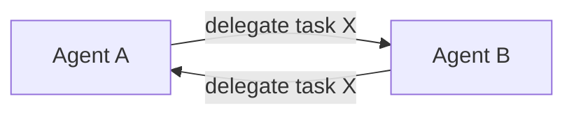

Circular delegation appears when:

- task ownership is not explicit;
- capability descriptions overlap;
- agents are allowed to delegate without constraints;
- a manager is absent or does not enforce assignment;
- the task identity changes slightly at every handoff;
- no agent is accountable for final completion.

### 3.1 Controls

Use all of the following:

1. **Stable work-order ID** - the same logical task keeps the same identifier.
2. **Current owner** - exactly one agent owns the task at a time.
3. **Delegation history** - every handoff is recorded.
4. **Maximum hops** - delegation stops after a declared limit.
5. **Capability check** - a task can be assigned only to a registered capable agent.
6. **Return-to-manager rule** - failed delegation returns to the coordinator, not another peer.
7. **Final decision owner** - one component must accept, reject, escalate, or close the task.

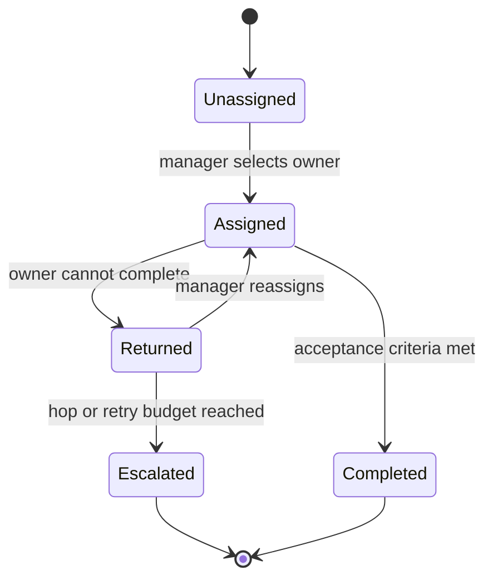

### 3.2 Delegation invariants

A production controller can enforce invariants such as:

```text
one task -> one current owner
one delegation -> one recorded reason
one reassignment -> one manager decision
maximum delegation depth <= configured limit
```

These rules convert delegation from free-form conversation into a controlled state transition.

---

## 4. Livelock, deadlock, and no-progress loops

Multi-agent systems can fail without crashing.

### 4.1 Livelock

Agents remain active and exchange messages, but the artifact does not materially improve.

Examples:

- writer and reviewer repeatedly rephrase the same paragraph;
- two agents keep changing confidence from 0.70 to 0.72;
- an agent retrieves nearly identical documents on every iteration;
- a planner creates a new plan that is functionally equivalent to the previous one.

### 4.2 Deadlock

Agents wait on one another and no action can proceed.

Examples:

- reviewer waits for analyst output while analyst waits for reviewer criteria;
- two write actions each hold a resource needed by the other;
- approval cannot proceed because approver identity was never resolved;
- a child manager waits for a parent decision while the parent waits for child completion.

### 4.3 No-progress detection

A workflow should define a progress function. Progress may be measured by:

- percentage of acceptance criteria satisfied;
- number of unresolved defects;
- evidence coverage;
- reduction in uncertainty;
- successful completion of unique work orders;
- material change in the artifact;
- reduction in policy risk.

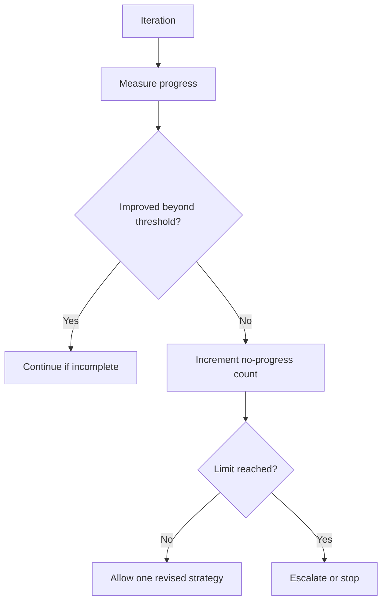

> **Engineering rule**
>
> Message count is activity, not progress. Token usage is activity, not progress. A longer answer is not automatically a better answer.

---

## 5. Retry storms and nested recovery

A retry storm occurs when several layers retry the same failing operation independently.

For example:

- tool client retries three times;
- worker agent retries three times;
- manager reassigns the same task three times;
- top-level orchestrator restarts the workflow twice.

The apparent policy is "three retries," but the actual worst case is far larger.

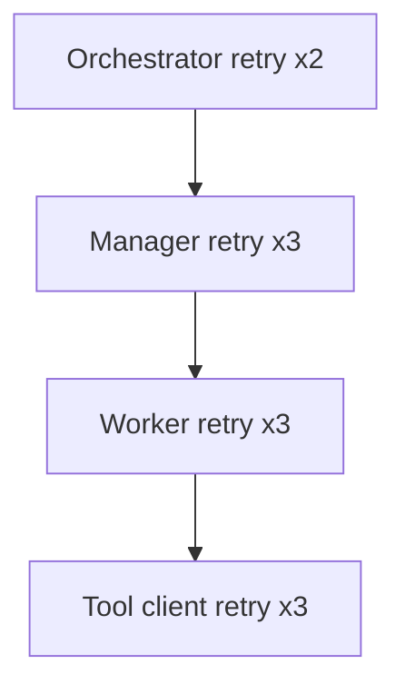

If all layers exhaust their budgets, one business request can create dozens of tool calls.

### 5.1 Single-owner retry policy

Assign retry ownership to one layer.

| Failure | Retry owner | Other layers |
|---|---|---|
| Transient HTTP timeout | Tool adapter | Observe result only |
| Malformed worker output | Worker harness | Manager waits |
| Wrong worker assignment | Manager | Worker does not self-delegate |
| Entire workflow dependency outage | Orchestrator | Children stop |

### 5.2 Global attempt ledger

The attempt ledger should record:

- workflow ID;
- work-order ID;
- action fingerprint;
- attempt number;
- failure class;
- backoff delay;
- outcome;
- next allowed retry time.

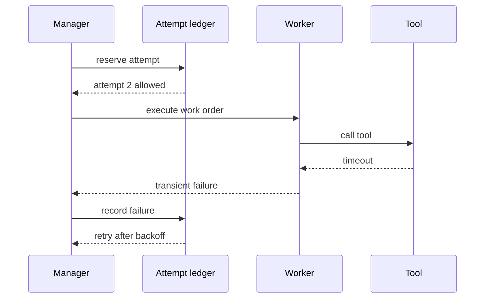

---

## 6. Duplicate actions and side-effect safety

Repeated reasoning is wasteful. Repeated writes can be harmful.

Examples include:

- sending the same email twice;
- creating duplicate CRM cases;
- submitting the same purchase request multiple times;
- updating payroll after a timeout when the first update actually succeeded;
- publishing multiple versions of a report.

### 6.1 Idempotency

An idempotent action produces the same externally visible result when repeated with the same logical request.

Use an idempotency key derived from stable business inputs:

```text
workflow_id + action_type + target_id + normalized_arguments
```

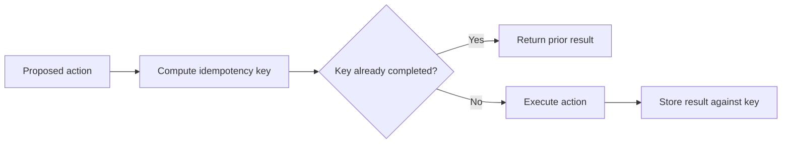

### 6.2 Ambiguous outcomes

A timeout does not prove that a write failed. The system should reconcile before retrying.

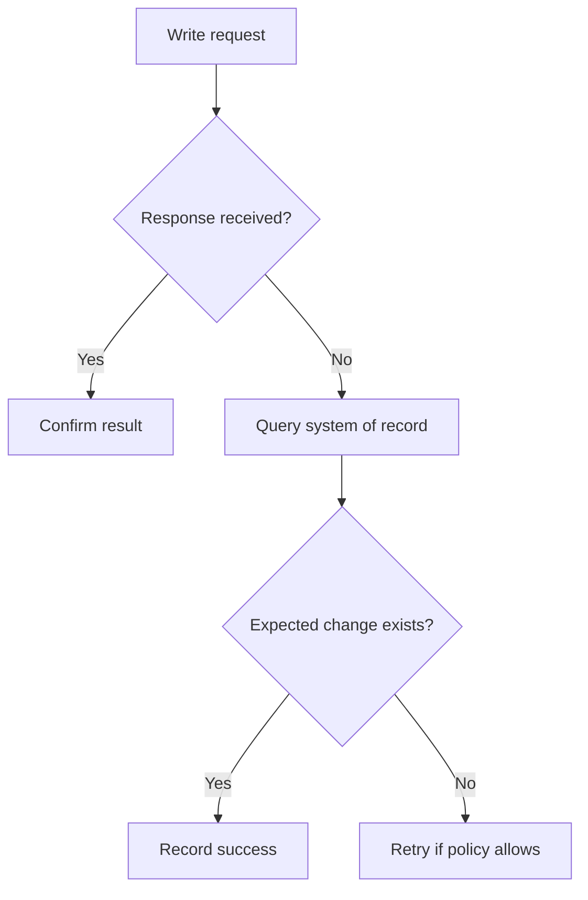

### 6.3 Compensation

Some actions cannot be made idempotent but can be compensated.

Examples:

- reserve inventory, then release reservation;
- create calendar event, then cancel event;
- publish draft, then unpublish;
- submit request, then create reversal request.

Compensation is not always a true rollback. The audit trail must show both the original and corrective actions.

---

## 7. State conflicts and shared-memory corruption

Shared state enables collaboration but creates consistency problems.

### 7.1 Lost updates

Two agents read version 5 of the state. Both write changes. The second write overwrites the first.

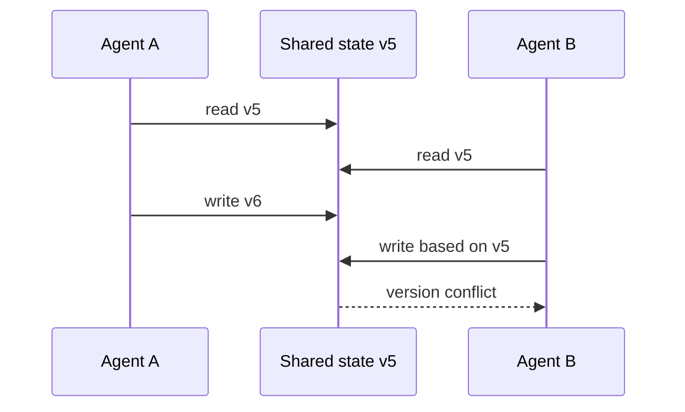

Use optimistic concurrency:

```text
UPDATE state
SET payload = new_payload, version = version + 1
WHERE workflow_id = ? AND version = expected_version
```

If no row is updated, the writer must reread and merge.

### 7.2 Ownership by field

Not every agent should write every field.

| State field | Owner |
|---|---|
| Plan | Planner |
| Retrieved evidence | Research workers |
| Policy findings | Compliance agent |
| Approval status | Human approval service |
| Final answer | Synthesizer |
| Audit events | Append-only event service |

### 7.3 Append-only events

For high-value workflows, store events rather than only the latest mutable state.

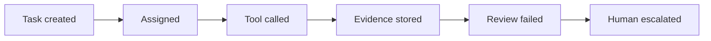

The current state can be reconstructed from the event stream, while the full history remains auditable.

---

## 8. Correlated error and false consensus

Multiple agents do not guarantee independent judgment. Agents may share:

- the same model;
- the same system prompt;
- the same retrieval corpus;
- the same tool output;
- the same mistaken assumption;
- the same initial answer as an anchor.

A unanimous result can therefore be confidently wrong.

### 8.1 Controls for correlated error

- require independent first-pass analysis;
- use different source sets or retrieval strategies;
- assign distinct evaluation criteria;
- verify key claims with deterministic tools;
- preserve original source provenance;
- include a counterexample or red-team role;
- use a rule-based check for critical constraints;
- escalate high-impact uncertainty to a human.

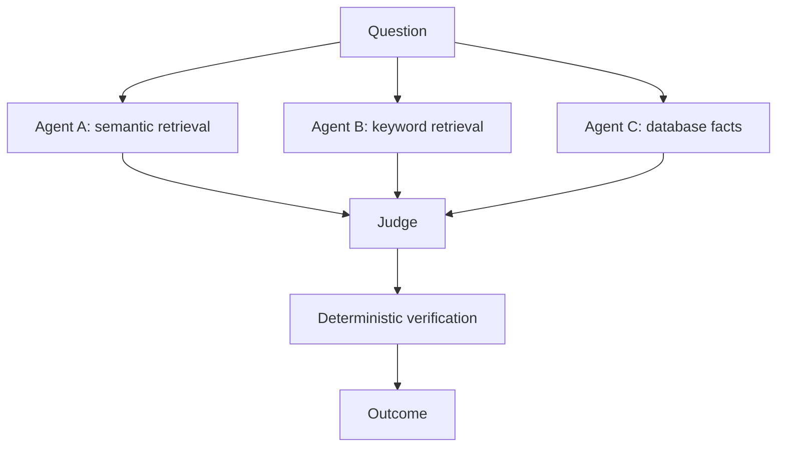

### 8.2 Evidence laundering

A dangerous pattern occurs when one agent invents a claim and another agent repeats it as if it were corroboration. Every claim should retain a source reference or explicit status:

- verified evidence;
- model inference;
- assumption;
- unresolved claim.

The system should not count repeated agent statements as multiple sources.

---

## 9. Tool contention and concurrency hazards

Parallel agents may compete for rate limits, database locks, files, or scarce external resources.

Examples:

- ten workers query the same API and trigger throttling;
- two agents edit the same document section;
- parallel updates violate transaction order;
- a shared browser session becomes corrupted;
- multiple agents consume the entire model quota.

### 9.1 Bulkheads

Bulkheads isolate resource pools so one failing capability cannot exhaust the whole system.

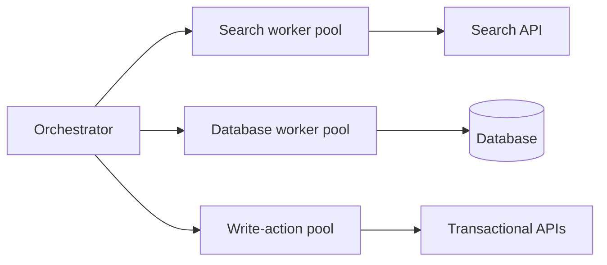

Configure separate:

- concurrency limits;
- queues;
- timeouts;
- retry budgets;
- credentials;
- cost budgets.

### 9.2 Leases and locks

For exclusive work, use a time-bounded lease rather than an indefinite lock. If a worker disappears, the lease expires and the manager can reassign safely.

### 9.3 Parallelism policy

Parallelize only independent operations. Sequentialize when:

- one action depends on another;
- writes affect the same entity;
- the order has business meaning;
- approval is required before execution;
- a previous result changes the permitted next action.

---

## 10. Circuit breakers, timeouts, and fallbacks

### 10.1 Timeout

Every external call and agent step should have a deadline. A missing timeout converts a dependency outage into a workflow deadlock.

### 10.2 Circuit breaker

A circuit breaker stops sending traffic to a repeatedly failing dependency.

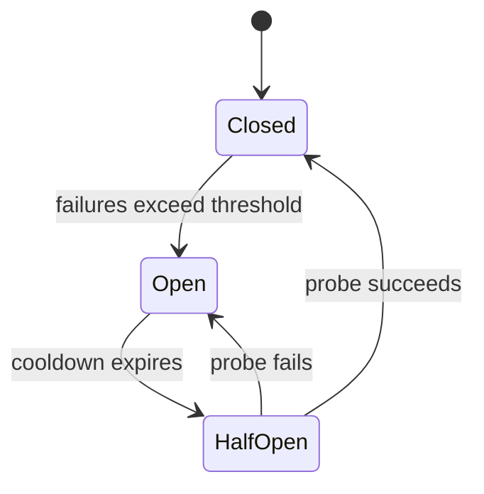

### 10.3 Fallback hierarchy

Fallbacks should preserve safety and truthfulness.

1. alternate tool or replica;
2. cached verified result with freshness warning;
3. partial answer with explicit missing data;
4. human review;
5. safe stop.

A fallback must not silently change the semantic meaning of the task. For example, replacing an authoritative policy database with unrestricted web search may be unacceptable.

---

## 11. Budgeting and bounded autonomy

Reliability requires explicit resource budgets.

| Budget | Example |
|---|---|
| Agent steps | Maximum 20 state transitions |
| Delegation hops | Maximum 4 handoffs |
| Retry attempts | Maximum 2 per transient failure |
| Debate rounds | Maximum 3 rounds |
| Tool calls | Maximum 12 calls |
| Wall-clock time | Maximum 90 seconds |
| Token usage | Maximum 60,000 tokens |
| Cost | Maximum $1.50 per workflow |
| Write actions | Maximum 1 without renewed approval |

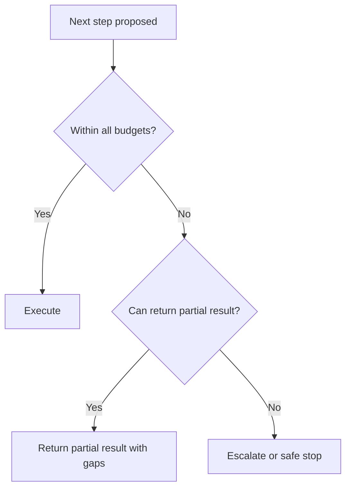

### 11.1 Hierarchical budget allocation

A parent manager should allocate sub-budgets rather than allowing children to consume the global budget freely.

```text
workflow budget: 100 units
  research team: 40
  analytics team: 25
  compliance team: 20
  synthesis and review: 15
```

Unused budget may be returned to the parent. Budget increases should require an explicit decision.

---

## 12. Human-in-the-loop as a reliability mechanism

Human review is not a generic safety label. It needs a concrete workflow.

A useful escalation packet contains:

- original user goal;
- current workflow state;
- completed actions;
- evidence and sources;
- unresolved defects;
- proposed next action;
- reason for escalation;
- exact approval options;
- deadline and fallback behavior.

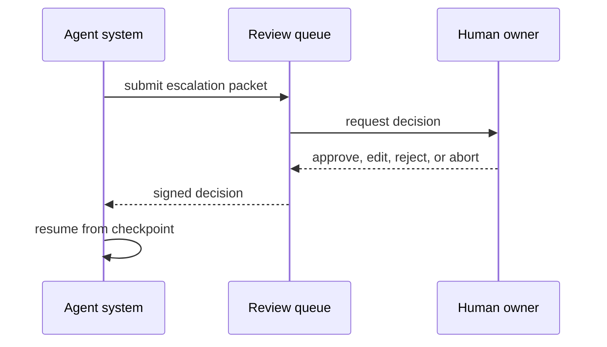

### 12.1 Interrupt, reset, and abort

The board distinguishes three controls:

| Control | Meaning | Reliability use |
|---|---|---|
| Interrupt | Pause execution | Inspect before high-impact action |
| Reset | Return to a known safe state | Clear corrupted context and restart bounded work |
| Abort | Stop completely | Prevent harmful or uncontrolled continuation |

These controls should be available to both humans and deterministic policy services.

---

## 13. Observability for multi-agent systems

A final answer alone is insufficient for diagnosis. Observability must reconstruct the trajectory.

### 13.1 Trace hierarchy

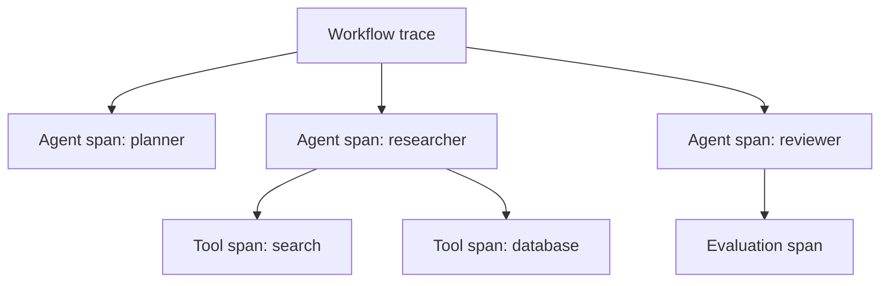

Each event should capture:

- workflow and task IDs;
- parent and child span IDs;
- agent identity and role;
- input and output references;
- tool name and arguments hash;
- model and prompt version;
- state version;
- start time and duration;
- token and cost usage;
- retry and delegation counts;
- policy decision;
- error class;
- final status.

### 13.2 Reliability metrics

| Metric | Meaning |
|---|---|
| Task success rate | Workflows meeting acceptance criteria |
| Safe completion rate | Successful or safely stopped workflows |
| No-progress rate | Workflows terminated for lack of progress |
| Delegation-loop rate | Circular handoff detections |
| Duplicate-action prevention rate | Duplicate writes blocked by idempotency |
| Recovery success rate | Failed steps recovered without unsafe behavior |
| Escalation precision | Escalations that genuinely required human judgment |
| Mean time to recovery | Time from failure detection to safe resolution |
| Budget overrun rate | Workflows exceeding declared resource limits |
| Trace completeness | Required events captured for audit |

> **Important distinction**
>
> A high task-completion rate can hide unsafe retries, duplicate side effects, excessive cost, or poor escalation. Reliability is multidimensional.

---

## 14. Edge-case and fault-injection testing

The board recommends testing ambiguous input, conflicting instructions, offline services, extreme values, repeated retries, user interruption, wrong-tool selection, prompt injection, context overflow, multilingual input, and recursive requests.

### 14.1 Fault-injection matrix

| Scenario | Injected fault | Expected control |
|---|---|---|
| Search outage | Tool returns 503 | Circuit breaker and fallback |
| Partial timeout | Write response lost | Reconcile before retry |
| Circular handoff | A delegates to B; B to A | Hop limit and manager escalation |
| State race | Two workers write same version | Conflict detection and merge |
| Prompt injection | Retrieved text requests secret access | Treat as data, not instruction |
| Retry storm | Nested transient failures | Global attempt budget |
| Reviewer drift | Reviewer changes rubric mid-run | Versioned rubric contract |
| Human unavailable | Approval deadline expires | Safe stop or policy-defined fallback |
| Correlated agents | All agents use same false premise | Independent evidence verification |
| Context overflow | History exceeds token budget | Summarize and preserve critical state |

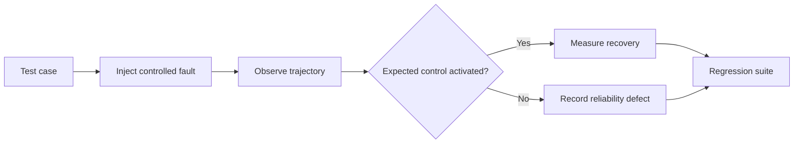

### 14.2 Chaos testing boundaries

Fault injection in production must be carefully scoped. Prefer:

- sandbox environments;
- synthetic tenants;
- read-only tools;
- low-impact canaries;
- deterministic rollback;
- explicit experiment ownership.

Do not test destructive failure modes against real user data without a reviewed safety plan.

---

## 15. Security and reliability are coupled

Many reliability controls are also security controls.

- least privilege limits blast radius;
- idempotency prevents repeated unauthorized effects;
- immutable audit logs support investigation;
- tenant isolation prevents cross-user leakage;
- circuit breakers limit abuse and cascading failure;
- human approval blocks uncertain high-impact actions;
- source provenance prevents evidence laundering;
- bounded autonomy prevents runaway tool usage.

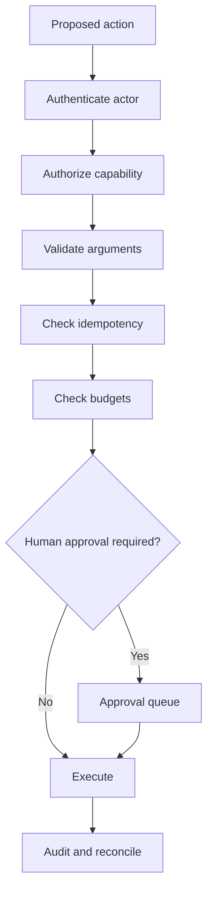

A system that is secure but cannot recover is not reliable. A system that recovers by bypassing policy is not secure.

---

## 16. Production reference architecture

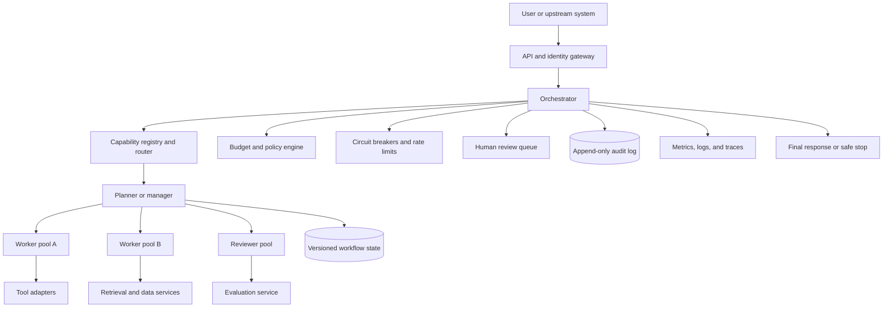

### 16.1 Reliability control plane

The control plane should be independent from the agents it supervises. It owns:

- identity and permissions;
- budgets;
- timeouts;
- retries;
- circuit breakers;
- idempotency keys;
- workflow state versions;
- approval state;
- stop conditions;
- audit events.

Agents may recommend actions, but they should not be able to silently change their own safety budgets or permissions.

---

## 17. Worked example: competitive-research system

Consider the board's competitive-research flow:

```text
Manager -> Research Agent -> Analytics Agent -> Writer Agent -> Reviewer -> Final Report
```

### 17.1 Failure risks

| Stage | Risk |
|---|---|
| Manager | Duplicates work orders or assigns unclear scope |
| Research | Uses stale sources or invents evidence |
| Analytics | Compares incompatible metrics |
| Writer | Removes uncertainty and provenance |
| Reviewer | Repeats stylistic edits without improving quality |
| Finalizer | Publishes despite unresolved high-severity defects |

### 17.2 Reliability design

1. Manager creates stable work-order IDs and acceptance criteria.
2. Research outputs claims linked to source IDs and retrieval timestamps.
3. Analytics receives normalized data schemas.
4. Writer may summarize but cannot remove source references.
5. Reviewer returns typed defects with severity and requested correction.
6. No-progress control compares evidence coverage and unresolved defects.
7. Maximum two revision rounds are allowed.
8. High-severity unresolved defects trigger human review.
9. Final publication uses an idempotency key.
10. All decisions are recorded in an append-only event log.

```mermaid
flowchart LR
    M[Manager] --> R[Research]
    R --> V1[Source validation]
    V1 --> A[Analytics]
    A --> V2[Schema and metric checks]
    V2 --> W[Writer]
    W --> Q[Reviewer]
    Q --> P{Pass?}
    P -->|Yes| I[Idempotent publish]
    P -->|No, progress possible| W
    P -->|No progress or high risk| H[Human review]
```

---

## 18. Reliability controller design

A small controller can enforce reliability independently of any agent framework.

### 18.1 Core records

```python
@dataclass
class WorkOrder:
    task_id: str
    owner: str
    status: str
    hop_count: int
    retry_count: int
    progress_score: float
```

```python
@dataclass
class ReliabilityBudget:
    max_steps: int
    max_hops: int
    max_retries: int
    max_no_progress: int
    max_cost_units: int
```

### 18.2 Decision order

Before every step:

1. validate owner and capability;
2. check workflow state version;
3. check permissions;
4. check delegation, retry, cost, and time budgets;
5. check whether the action already completed;
6. execute under timeout;
7. classify failures;
8. measure progress;
9. continue, retry, reassign, escalate, or stop.

```mermaid
flowchart TD
    N[Next proposed step] --> O[Validate owner]
    O --> S[Validate state version]
    S --> P[Validate permission]
    P --> B[Check budgets]
    B --> I[Check idempotency]
    I --> E[Execute with timeout]
    E --> C[Classify outcome]
    C --> M[Measure progress]
    M --> D{Decision}
    D -->|Continue| N
    D -->|Retry| N
    D -->|Reassign| N
    D -->|Escalate| H[Human review]
    D -->|Stop| X[Safe terminal state]
```

The runnable example accompanying this chapter implements these concepts with only the Python standard library.

---

## 19. Production readiness checklist

### Ownership and control

- [ ] Every work order has one current owner.
- [ ] Final decision ownership is explicit.
- [ ] Delegation depth and hops are bounded.
- [ ] Agents cannot expand their own permissions or budgets.

### Progress and termination

- [ ] Acceptance criteria are machine-readable where practical.
- [ ] Progress is measured independently from message count.
- [ ] No-progress and repeated-action detection are enabled.
- [ ] All loops have maximum iterations and stop conditions.

### Tool and action safety

- [ ] Write actions use idempotency keys.
- [ ] Ambiguous outcomes are reconciled before retry.
- [ ] High-impact actions require approval.
- [ ] Compensation exists where rollback is possible.

### State integrity

- [ ] Shared state has a typed schema.
- [ ] State updates use version checks or transactions.
- [ ] Field ownership is declared.
- [ ] Audit events are append-only.

### Resource protection

- [ ] Global and per-agent budgets exist.
- [ ] Timeouts are configured for all external calls.
- [ ] Retry ownership is defined by layer.
- [ ] Circuit breakers and bulkheads isolate failures.

### Evaluation and operations

- [ ] Traces reconstruct agent, tool, state, and policy decisions.
- [ ] Reliability metrics have alert thresholds.
- [ ] Fault-injection tests cover critical failure modes.
- [ ] Human escalation packets preserve enough context to decide.

---

## 20. Common anti-patterns

### Anti-pattern 1: "Let the agents negotiate until they agree"

Agreement is not a termination criterion. Agents can converge on a shared error or continue forever.

**Better:** bounded rounds, evidence requirements, and a declared decision owner.

### Anti-pattern 2: retries at every layer

Nested retries multiply load and can duplicate effects.

**Better:** assign retry ownership and use a global attempt ledger.

### Anti-pattern 3: shared mutable memory for everything

Uncontrolled writes create stale, conflicting, and sensitive state.

**Better:** typed state, field ownership, versioning, and scoped memory.

### Anti-pattern 4: using a reviewer as the only safety mechanism

The reviewer may share the same model weaknesses as the producer.

**Better:** deterministic validation, permissions, policy checks, and human review for high-impact cases.

### Anti-pattern 5: measuring only final-answer quality

A good final answer may hide excessive retries, unsafe calls, or high cost.

**Better:** evaluate trajectory, recovery, resource use, and side effects.

### Anti-pattern 6: silent fallback

Replacing an authoritative source with a weaker source can produce plausible but invalid results.

**Better:** declare fallback semantics and surface uncertainty.

---

## 21. Hands-on lab: reliable supplier recommendation team

Design a team with:

- manager;
- pricing worker;
- quality worker;
- delivery worker;
- compliance worker;
- reviewer;
- human decision owner.

### Requirements

1. Each work order has a stable ID and one owner.
2. Read-only workers may run in parallel.
3. Every claim has a source ID.
4. Missing data is represented explicitly.
5. Reviewer returns typed defects.
6. Maximum two revision rounds.
7. No-progress detection compares defect count and evidence coverage.
8. Final recommendation requires human approval when compliance confidence is below threshold.
9. Publication is idempotent.
10. Every transition emits an audit event.

### Extension exercises

- Inject a pricing API timeout.
- Make two workers update the same state version.
- Trigger circular delegation.
- Lose the response to a simulated write action.
- Force all agents to repeat the same unsupported claim.
- Exhaust the cost budget and return a safe partial result.

---

## 22. Knowledge check

1. Why is circular delegation a coordination failure rather than a model failure?
2. What is the difference between livelock and deadlock?
3. Why can nested retries create a retry storm?
4. What should a system do after an ambiguous write timeout?
5. How does optimistic concurrency prevent lost updates?
6. Why does consensus among several agents not prove correctness?
7. What is evidence laundering?
8. When should a circuit breaker open?
9. Why should retry policy have a single owner?
10. What information belongs in a human escalation packet?
11. How do bulkheads reduce cascading failure?
12. Which metrics reveal reliability problems hidden by task success rate?

---

## 23. Interview questions

### Beginner

1. What are common failure modes in multi-agent systems?
2. What is a delegation loop?
3. What is an idempotency key?
4. Why do agent workflows need termination conditions?
5. What is the purpose of a timeout?

### Intermediate

1. Design a no-progress detector for a writer-reviewer loop.
2. How would you prevent duplicate emails after a network timeout?
3. Explain the difference between retry, fallback, compensation, and escalation.
4. How would you structure shared state for parallel agents?
5. How would you detect false consensus?
6. What should be logged for an agent-to-agent handoff?

### Senior

1. Design a reliability control plane for a hierarchical multi-agent system.
2. Define service-level objectives for an enterprise agent workflow.
3. Explain how to allocate retry and cost budgets across nested teams.
4. Design a fault-injection program for an approval-gated transactional agent.
5. How would you reconcile an uncertain outcome in an external system without causing duplicate writes?
6. Compare event sourcing, mutable workflow state, and vector memory for audit and recovery.
7. How would you prove that adding agents improves quality enough to justify reliability overhead?
8. Design graceful degradation when retrieval, one specialist agent, and the human review queue are simultaneously unavailable.

---

## 24. Chapter summary

Multi-agent reliability is primarily a control problem. More agents create more opportunities for specialization, but also more handoffs, loops, shared-state conflicts, retries, permissions, and resource contention.

Reliable systems therefore make coordination explicit:

- stable work orders and single ownership;
- typed handoffs and acceptance criteria;
- bounded delegation, retries, and debate rounds;
- idempotency and reconciliation for side effects;
- versioned state and append-only audit events;
- timeouts, circuit breakers, bulkheads, and fallbacks;
- independent evidence checks to reduce correlated error;
- measurable progress and no-progress termination;
- human review with preserved context and authority;
- trajectory-level observability and fault-injection testing.

The central design principle is simple:

> Every autonomous loop must have a measurable purpose, a bounded budget, a safe stop, and an accountable decision owner.

---

## Further study

Continue with **Chapter 23 - Guardrails, Human Overrides, and Safe Agent Control**, which turns reliability controls into a broader safety architecture covering input, output, behavior, policy, content, permissions, sandboxing, and emergency intervention.
