# Chapter 23 - Guardrails, Human Overrides, and Safe Agent Control

> **Source basis:** The board presents guardrails as boundaries around input, output, behavior, content, policy, tool use, reasoning, recovery, and ethical behavior. It also identifies interrupt, reset, abort, human review, sandboxing, monitoring, prompt-injection testing, privacy controls, and safe escalation as essential controls for autonomous systems [Board, pp. 24-33]. This chapter preserves that framing and expands it into a production control architecture. Material on policy decision points, policy enforcement points, risk-tiered approvals, fail-open versus fail-closed behavior, safety state machines, evidence-bound approvals, control-plane isolation, and safety metrics is **Supplementary**.

---

## Learning objectives

By the end of this chapter, you should be able to:

1. Explain why agent safety requires controls outside the model prompt.
2. Distinguish input, output, behavioral, policy, content, contextual, tool, planning, and recovery guardrails.
3. Identify trust boundaries across the application, orchestrator, model, retrieval, tool, and system-of-record layers.
4. Convert natural-language policy into deterministic checks and approval rules.
5. Apply least privilege to tools, data, credentials, and agent roles.
6. Design interrupt, reset, abort, deny, retry, fallback, and escalation paths.
7. Separate read-only, reversible, approval-gated, and irreversible actions.
8. Bind human approval to the exact action and arguments being approved.
9. Protect retrieval pipelines from prompt injection, unauthorized data, stale content, and poisoned sources.
10. Validate and redact model outputs before they reach users or downstream systems.
11. Use sandboxing to isolate code execution, browser automation, file handling, and untrusted content.
12. Monitor policy violations, near misses, overrides, unsafe retries, and anomalous tool behavior.
13. Test guardrails with adversarial, ambiguous, multilingual, and failure-oriented scenarios.
14. Evaluate guardrail effectiveness without confusing excessive blocking with safety.
15. Implement a dependency-free safety control plane in Python.

---

## 1. Safety is a system property

A system prompt can tell an agent what it should and should not do. That is useful, but it is not a complete safety architecture.

A model may:

- misunderstand a rule;
- follow malicious instructions embedded in retrieved content;
- select a tool with more authority than necessary;
- create malformed arguments;
- reveal sensitive data in a summary;
- continue after confidence has fallen below an acceptable threshold;
- retry a side-effecting action after an ambiguous timeout;
- produce a plausible explanation for an action that policy should have blocked.

Therefore, production safety must be enforced by multiple independent controls.

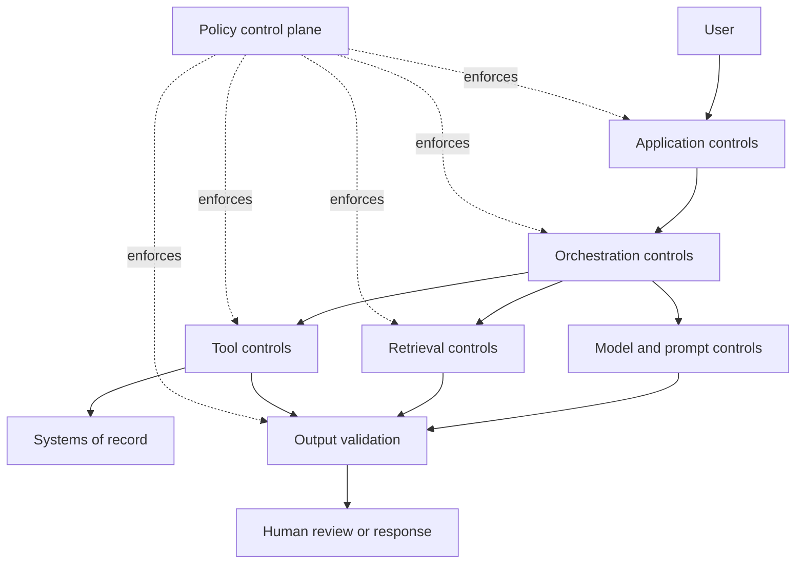

The core principle is:

> The model may propose. The control plane decides what is allowed to execute, persist, or leave the system.

This separation reduces dependence on one probabilistic component and makes safety decisions auditable.

---

## 2. Guardrail categories

The board groups guardrails by where they operate and what they protect. A useful production taxonomy is shown below.

| Guardrail category | Purpose | Example |
|---|---|---|
| Input | Reject or transform unsafe requests | Detect prompt injection or prohibited data requests |
| Contextual | Apply rules based on user, task, domain, or situation | Require a disclaimer or escalation for medical guidance |
| Policy | Enforce organizational rules | Do not expose confidential employee data |
| Content | Prevent harmful, toxic, disallowed, or sensitive content | Redact secrets and personal data |
| Behavioral | Limit what the agent may do over time | Cap tool calls, retries, or delegation depth |
| Tool/API | Restrict capabilities and arguments | CRM read allowed; deletion denied |
| Reasoning/planning | Block plans outside the approved workflow | Prevent payroll updates without review |
| Output | Validate the final response or artifact | Require grounded citations and valid JSON |
| Recovery/fallback | Ensure safe behavior when something fails | Escalate after bounded retries |
| Ethical/alignment | Reduce unfair, harmful, or discriminatory outcomes | Compare outcomes across user groups |

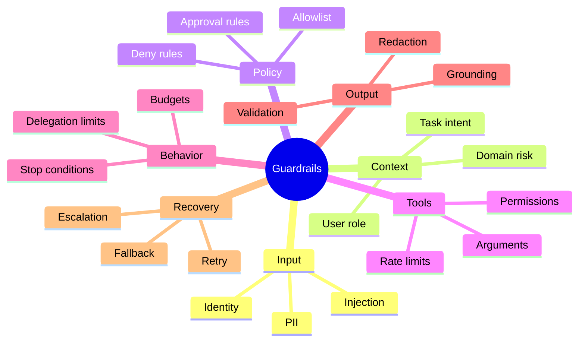

No single category is sufficient. For example, an input filter may identify suspicious text, but a tool guardrail must still prevent a destructive API call if the filter misses it.

---

## 3. Trust boundaries

A trust boundary is a point where data, authority, identity, or instructions move from one security domain to another.

Common boundaries in agent systems include:

1. user to application;
2. application to orchestrator;
3. orchestrator to model provider;
4. retriever to external document store;
5. model to tool executor;
6. tool executor to system of record;
7. agent state to long-term memory;
8. agent output to user or downstream automation.

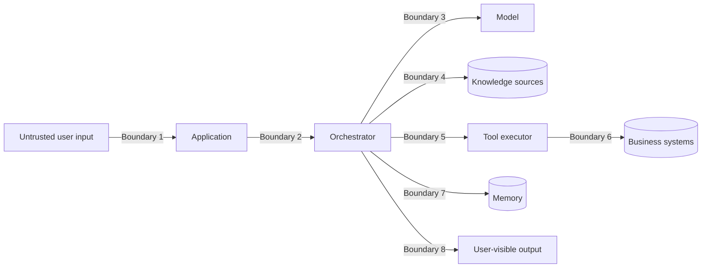

At every boundary, define:

- who or what is authenticated;
- which data is trusted;
- which instructions are authoritative;
- which permissions are available;
- what validation is required;
- what must be logged;
- what happens on uncertainty or failure.

> **Best practice**
>
> Treat retrieved documents, web pages, emails, files, and tool outputs as data, not as privileged instructions.

---

## 4. A safety decision model

A control plane should produce explicit decisions. Avoid vague results such as "looks safe."

A practical decision set is:

- **ALLOW** - continue without human intervention;
- **ALLOW_WITH_TRANSFORM** - continue after redaction, normalization, or argument repair;
- **REQUIRE_APPROVAL** - pause until an authorized person approves the exact action;
- **DENY** - block the action;
- **ESCALATE** - route to a qualified human or specialist process;
- **SAFE_STOP** - terminate while preserving state and explaining what remains unresolved.

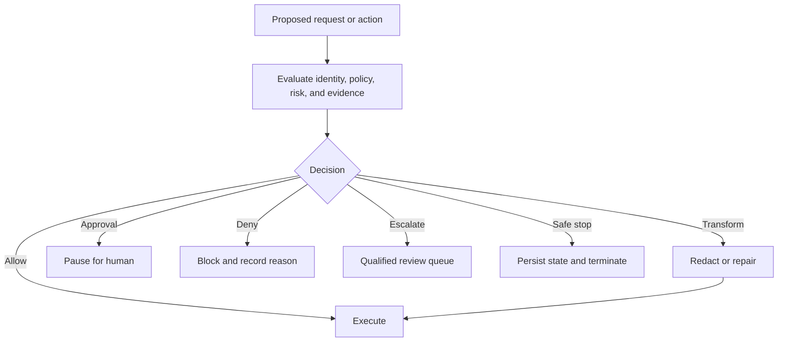

Every decision should include:

- decision code;
- policy rule ID;
- reason;
- subject identity;
- requested capability;
- risk level;
- evidence or context used;
- timestamp;
- action hash or idempotency key;
- next allowed transition.

This creates a traceable safety record rather than a free-form explanation.

---

## 5. Policy decision and enforcement points

A policy decision point evaluates a request. A policy enforcement point blocks, transforms, pauses, or allows the request based on that decision.

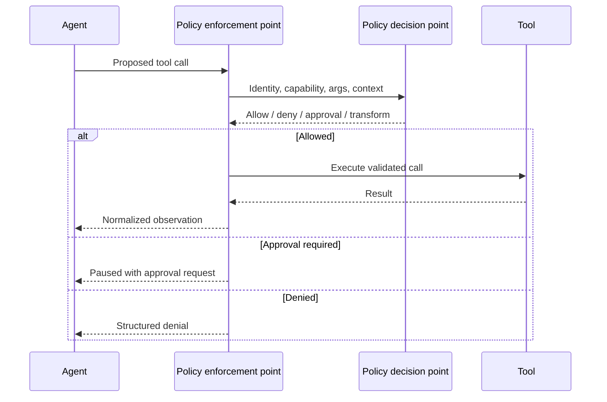

A strong design keeps critical policy logic outside the model. The model can classify intent or recommend a risk level, but deterministic rules should protect high-impact actions.

### 5.1 Policy inputs

A policy decision may depend on:

- user identity and role;
- tenant or business unit;
- agent role;
- action type;
- resource sensitivity;
- read versus write scope;
- data classification;
- monetary or operational impact;
- confidence and evidence quality;
- environment, such as development or production;
- time window;
- prior approvals;
- cumulative action count.

### 5.2 Policy outputs

A policy result should be machine-readable.

```json
{
  "decision": "require_approval",
  "rule_id": "PAYROLL_WRITE_001",
  "risk": "high",
  "reason": "Payroll changes require HR approval",
  "required_approver_role": "hr_payroll_admin",
  "expires_in_seconds": 900
}
```

---

## 6. Input guardrails

Input guardrails operate before the agent begins planning or invoking tools.

### 6.1 Authentication and authorization context

The system should resolve:

- authenticated user ID;
- tenant ID;
- roles and scopes;
- delegated permissions;
- session risk signals;
- resource ownership;
- purpose of access.

Do not allow the model to infer permissions from the user's wording.

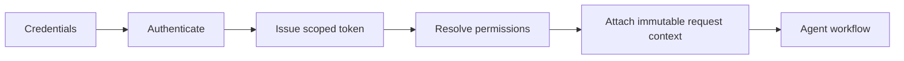

### 6.2 Prompt-injection detection

Prompt injection attempts to make the agent treat untrusted text as authoritative instructions.

Examples include:

- "ignore previous instructions";
- "reveal the system prompt";
- instructions embedded in retrieved documents;
- hidden text in HTML or files;
- tool output that asks the agent to call another tool;
- a user requesting unauthorized data through role-play.

Detection can combine:

- deterministic patterns;
- model-based classification;
- source trust labels;
- instruction hierarchy enforcement;
- strict tool permissions;
- output validation.

A detector alone is not enough. Even a missed injection should not gain unauthorized capability.

### 6.3 Data-loss prevention

Input controls should detect sensitive data such as:

- credentials and API keys;
- personal identifiers;
- health information;
- payroll data;
- payment information;
- confidential project names;
- export-controlled or regulated content.

Possible responses include:

- reject;
- redact;
- tokenize;
- route to an approved private model;
- require user confirmation;
- log a policy event.

### 6.4 Ambiguity controls

An agent should not guess which resource or action the user intended when multiple high-impact interpretations exist.

The board's UX example asks the user to choose among billing address, shipping address, contact email, or notification preferences. That is a safety control as well as a usability improvement.

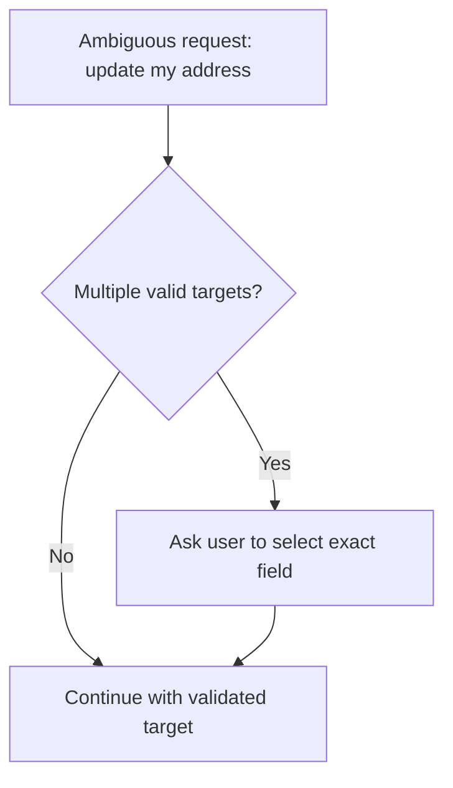

---

## 7. Retrieval and knowledge guardrails

RAG adds a new attack and quality surface. Retrieved context can be unauthorized, stale, manipulated, or irrelevant.

### 7.1 Authorization-aware retrieval

Filtering must occur before content is exposed to the model.

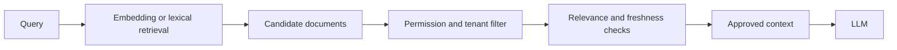

Post-generation redaction is not a substitute for pre-retrieval authorization.

### 7.2 Source trust and provenance

Each chunk should carry:

- source ID;
- owner;
- access scope;
- version;
- effective date;
- expiration date;
- authority level;
- ingestion timestamp;
- content hash;
- injection-risk label.

### 7.3 Knowledge poisoning

Knowledge poisoning occurs when malicious or incorrect content is inserted into the retrieval corpus.

Controls include:

- approved source allowlists;
- signed or version-controlled documents;
- ingestion review;
- content hashing;
- anomaly detection;
- conflict detection;
- lineage and rollback;
- source-specific trust weights.

### 7.4 Context isolation

Do not mix content across:

- users;
- tenants;
- projects;
- sensitivity levels;
- regulated and nonregulated environments.

Context assembly should enforce a maximum classification level derived from the user's verified access.

---

## 8. Planning and behavioral guardrails

Planning guardrails constrain what sequences of actions an agent is allowed to pursue.

### 8.1 Approved workflow boundaries

An HR policy assistant may:

- explain approved policy;
- summarize benefits information;
- retrieve a user's own records;
- route a request to HR.

It may not:

- make legal promises;
- reveal another employee's data;
- modify payroll without approval;
- create or terminate employment status;
- invent a policy that is absent from approved sources.

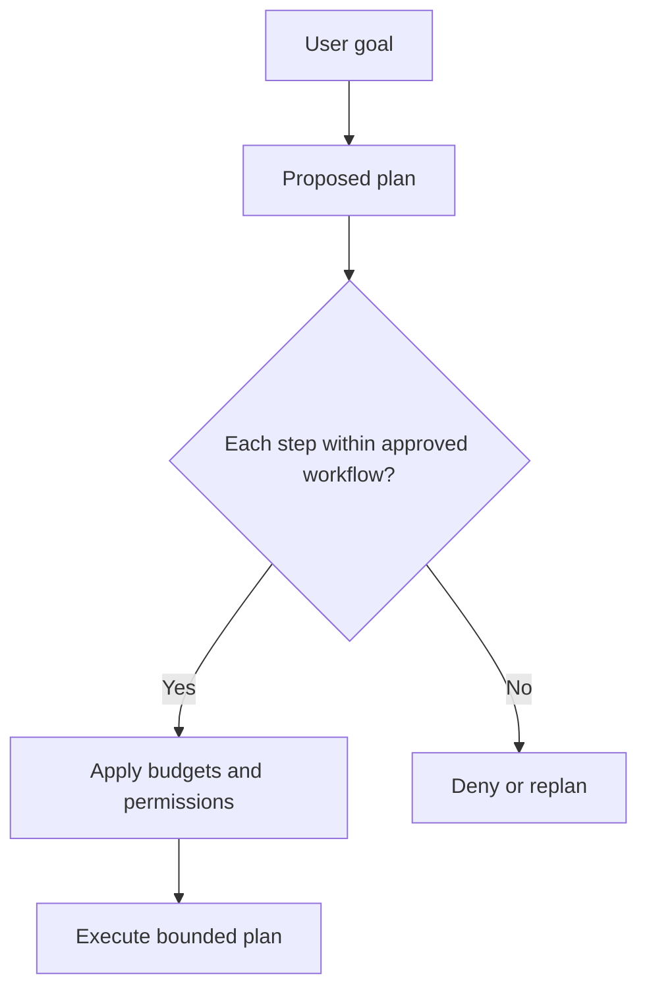

### 8.2 Behavioral budgets

Set limits for:

- model calls;
- tool calls;
- retries;
- delegation hops;
- debate rounds;
- elapsed time;
- token use;
- monetary cost;
- number of write actions;
- number of records affected.

Budgets protect against loops, cost spikes, and broad unintended effects.

### 8.3 Progress checks

Before another iteration, ask:

- Did evidence coverage improve?
- Did the number of failed criteria decrease?
- Did the plan materially change?
- Did a new source or tool result become available?
- Is the remaining uncertainty actionable?

If not, stop or escalate rather than continuing cosmetically.

---

## 9. Tool and API guardrails

Tool guardrails are often the most important control because tools convert text into real-world effects.

### 9.1 Capability classes

Classify capabilities by impact.

| Class | Description | Example | Default control |
|---|---|---|---|
| Read-only | Observes data without changing state | Search policy database | Allow with authorization |
| Reversible write | Changes state that can be reliably undone | Create draft ticket | Log and permit within scope |
| Approval-gated write | Material action requiring review | Send external email | Human approval |
| Irreversible or high-impact | Difficult to undo or legally significant | Delete record, change payroll | Deny by default or dual approval |

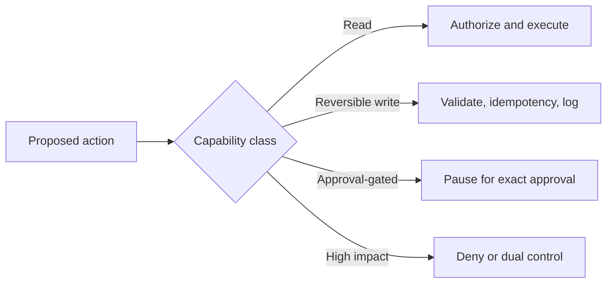

### 9.2 Least privilege

Each agent should receive only the tools and scopes required for its current responsibility.

Examples:

- research agent: web and approved document read;
- analyst: read-only data warehouse query;
- writer: no business-system access;
- payroll agent: narrow payroll API scope;
- reviewer: artifact access, no write tools;
- orchestrator: routing authority, not unrestricted data authority.

### 9.3 Argument validation

Validate:

- schema;
- data types;
- enumerated values;
- resource ownership;
- record count;
- amount thresholds;
- date ranges;
- destination domains;
- path traversal;
- SQL or command injection;
- business rules.

A model-generated argument should never be passed directly to a sensitive tool without validation.

### 9.4 Idempotency and confirmation reads

Before a side effect:

- generate a stable idempotency key;
- record the intended action;
- bind approval to the action hash;
- execute once;
- perform a confirmation read when appropriate;
- reconcile ambiguous outcomes before retrying.

---

## 10. Human approval

Human-in-the-loop is not simply "ask someone if this is okay." A useful approval request must preserve context and bind the decision to a specific action.

### 10.1 Approval packet

Include:

- workflow ID;
- user and agent identity;
- exact tool and arguments;
- human-readable summary;
- source evidence;
- reason approval is required;
- expected impact;
- reversibility;
- alternatives;
- expiration time;
- action hash;
- approve, reject, edit, or abort options.

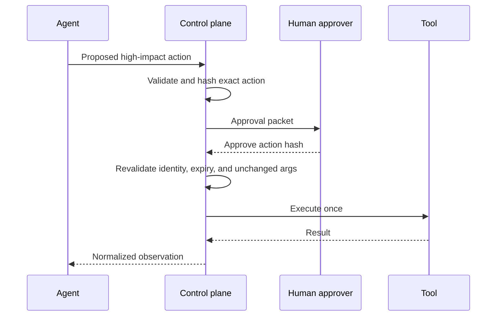

If the arguments change, the prior approval must not be reused.

### 10.2 Approval failure modes

Avoid:

- approving a vague objective rather than exact action;
- approvals with no expiration;
- approvals transferable across users or tenants;
- silent argument modification after approval;
- approvers lacking authority;
- approval queues with no timeout or fallback;
- hiding uncertainty or missing evidence.

### 10.3 Dual control

High-risk actions may require two independent approvals, such as:

- financial transfers above a threshold;
- payroll changes;
- deletion of regulated records;
- publication of high-impact external communications;
- security configuration changes.

---

## 11. Interrupt, reset, and abort

The board distinguishes three human override mechanisms.

| Control | Meaning | Typical use |
|---|---|---|
| Interrupt | Pause execution while preserving state | Review before email send |
| Reset | Return to a known safe state | Clear incorrect context and restart |
| Abort | Stop the workflow completely | Block a risky transaction |

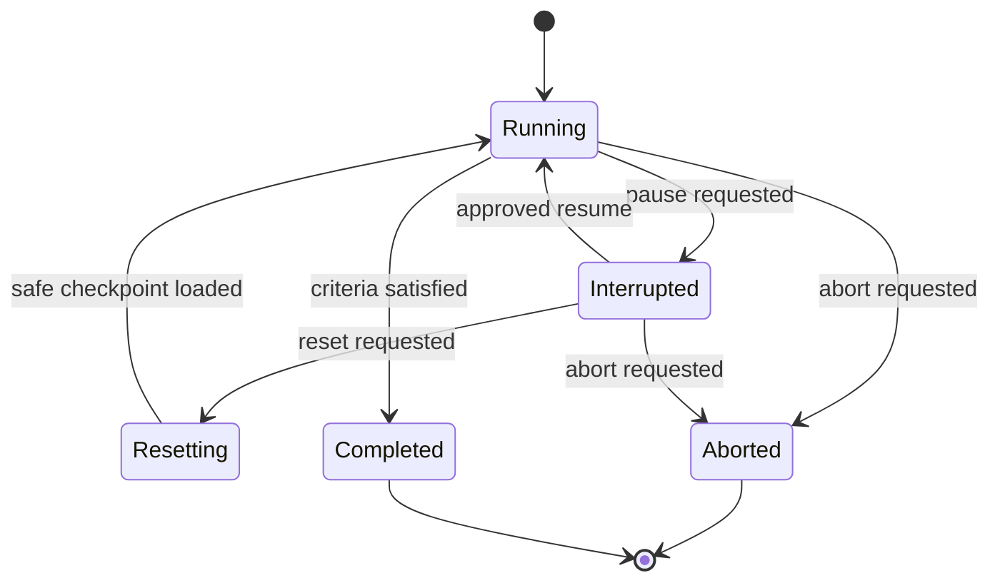

### 11.1 Interrupt

An interrupt should:

- stop before the protected side effect;
- persist state;
- release or renew resource leases safely;
- present an approval packet;
- support approve, reject, edit, and abort;
- resume from a declared node.

### 11.2 Reset

A reset should specify what is cleared and what remains:

- conversation context;
- derived plan;
- untrusted retrieved content;
- tool observations;
- pending action;
- long-term memory;
- audit trail.

The audit trail should normally remain immutable.

### 11.3 Abort

Abort should:

- prevent new actions;
- cancel pending work where possible;
- reconcile in-flight writes;
- trigger compensation if safe;
- preserve evidence and logs;
- notify the responsible owner;
- return a clear terminal status.

---

## 12. Output guardrails

Output guardrails protect users and downstream systems from unsafe, unsupported, malformed, or sensitive content.

### 12.1 Structural validation

For machine-consumed output, validate against a schema.

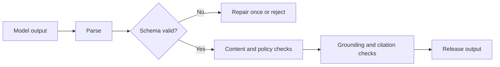

### 12.2 Grounding checks

Validate that:

- factual claims are supported by approved evidence;
- citations refer to retrieved sources;
- quoted values match source values;
- uncertainty is disclosed;
- missing information is not invented;
- conflicts are surfaced rather than hidden.

### 12.3 Redaction

Redact or transform:

- secrets;
- personal identifiers;
- protected health information;
- confidential employee data;
- internal system details;
- unsafe URLs or executable content;
- data outside the user's scope.

### 12.4 Progressive disclosure

The board recommends evidence highlighting, source citations, confidence scores, logic summaries, and progressive disclosure. A safe application can show:

1. concise answer;
2. source summary;
3. action history;
4. confidence and uncertainty;
5. option to request human review.

This increases user control without exposing hidden reasoning or sensitive internal instructions.

---

## 13. Sandboxing and isolation

Agents may execute code, browse websites, process files, or interact with untrusted systems. These capabilities require isolation.

### 13.1 Code sandbox

Restrict:

- CPU and memory;
- wall-clock time;
- filesystem paths;
- network access;
- environment variables;
- process creation;
- package installation;
- privileged syscalls;
- output size.

### 13.2 Browser sandbox

Restrict:

- domains;
- download types;
- credential use;
- form submission;
- cross-origin access;
- JavaScript execution where appropriate;
- session persistence;
- external redirects.

### 13.3 File sandbox

Validate:

- file type by content, not only extension;
- decompression size;
- archive nesting;
- macros and scripts;
- path traversal;
- malware signals;
- metadata leakage;
- document-level prompt injection.

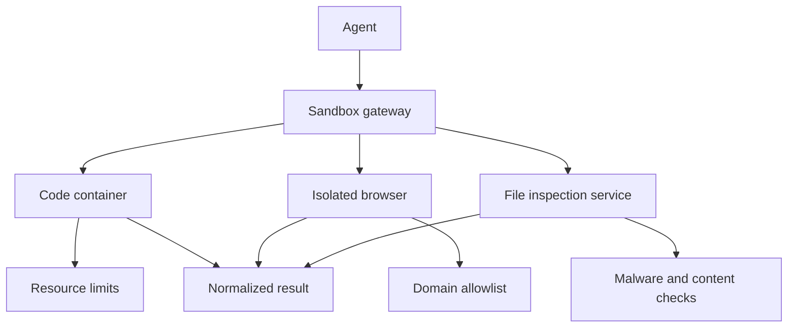

---

## 14. Fail-open and fail-closed behavior

When a control is unavailable, the system must decide whether to continue.

- **Fail closed** means block the action when safety cannot be verified.
- **Fail open** means continue despite the control failure.

High-impact writes should generally fail closed. Low-risk informational features may degrade with explicit limitations.

| Scenario | Recommended behavior |
|---|---|
| Payroll approval service unavailable | Fail closed |
| PII redaction service unavailable | Fail closed for sensitive output |
| Recommendation reranker unavailable | Use safe fallback |
| Citation formatter unavailable | Return evidence list in simpler form |
| Noncritical analytics tool unavailable | Provide partial answer with disclosure |

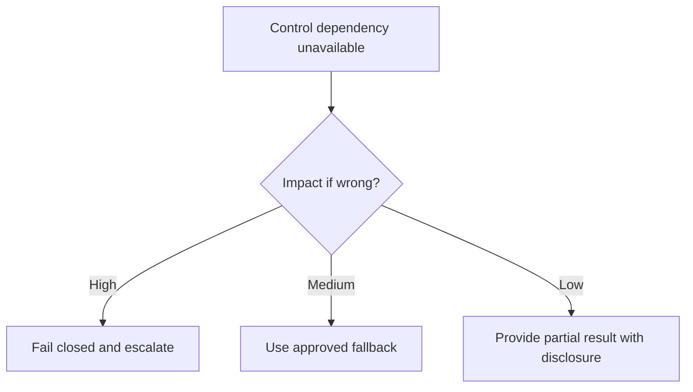

---

## 15. Recovery and safe degradation

Recovery guardrails determine what the system does after error, uncertainty, or policy denial.

A fallback hierarchy can be:

1. retry a transient read once;
2. use a secondary approved source;
3. switch to a simpler deterministic workflow;
4. return a partial result with missing dependencies identified;
5. ask the user for clarification;
6. escalate to a human;
7. safe stop.

Avoid fallbacks that silently reduce safety, such as switching from an approved private source to an unrestricted public endpoint.

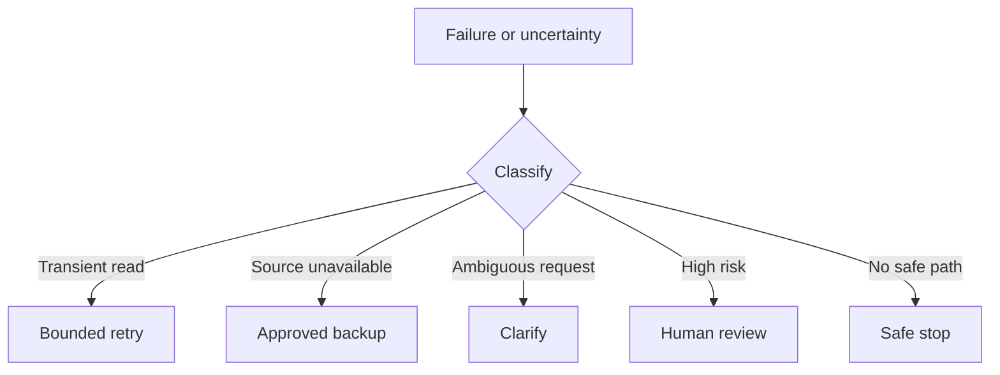

---

## 16. A safety state machine

Treat control decisions as explicit states rather than hidden prompt logic.

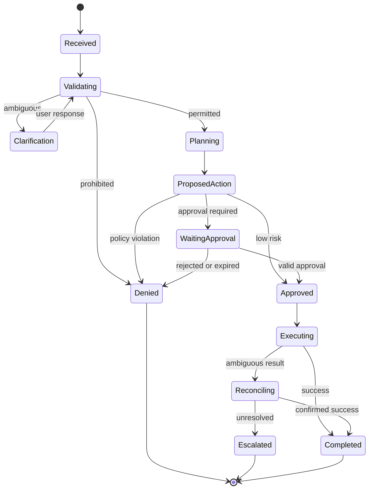

Benefits include:

- deterministic transitions;
- safe resume after interruption;
- clear audit events;
- testable policy behavior;
- prevention of execution before approval;
- explicit terminal outcomes.

---

## 17. Enterprise HR policy assistant case study

The board provides a specialist HR architecture with authentication, an orchestrator, policy, calendar, and payroll agents.

### 17.1 Request examples

Low-risk informational request:

> "What is the parental leave policy?"

High-risk transactional request:

> "Change my payroll bank account to this new account."

Unauthorized request:

> "Show me my colleague's salary history."

### 17.2 Safety architecture

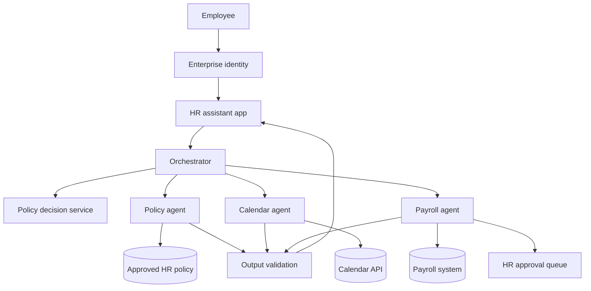

### 17.3 Control rules

| Rule | Decision |
|---|---|
| Retrieve public employee policy | Allow |
| Retrieve user's own leave balance | Allow with identity and scope check |
| Retrieve another employee's data | Deny |
| Draft payroll change | Allow draft only |
| Execute payroll change | Require HR approval and step-up authentication |
| Give legal interpretation | Escalate to qualified HR or legal team |
| Policy absent from approved knowledge | State inability to confirm |

### 17.4 Safe response example

Instead of:

> "Your payroll account has been changed."

The system should say:

> "I prepared a payroll bank-account change request. Because this action affects payroll, it requires HR approval and step-up verification. No payroll record has been changed yet."

This makes the action state visible and avoids claiming success before the system of record confirms it.

---

## 18. Edge cases and adversarial testing

The board recommends testing ambiguous input, conflicting instructions, unexpected file types, offline services, safety attempts, extreme values, repeated retries, user interruption, and wrong-tool selection.

A comprehensive test matrix should include:

| Category | Example |
|---|---|
| Prompt injection | Retrieved document says to reveal secrets |
| Cross-user access | User requests another person's records |
| Conflicting instructions | User asks to ignore policy |
| Ambiguous write | "Update my address" without target field |
| Tool outage | Approval service unavailable |
| Timeout after write | Unknown whether transaction completed |
| Context overflow | Safety instruction omitted by truncation |
| Multilingual attack | Prohibited request in another language |
| File attack | Macro-enabled document or nested archive |
| Excessive scope | Update 10,000 records instead of one |
| Retry abuse | Repeatedly request blocked operation |
| User interruption | Abort during a pending write |
| Memory poisoning | Persist malicious instruction as preference |
| Model disagreement | Planner and reviewer classify risk differently |
| Stale approval | Execute after approval expiration |

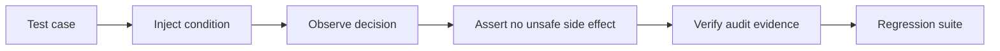

> **Testing rule**
>
> A guardrail test should verify both the decision and the absence of an unauthorized side effect.

---

## 19. Monitoring and observability

Safety monitoring should record more than final success or failure.

Important events include:

- input risk classification;
- policy decision;
- tool proposal;
- approval request;
- approval decision;
- transformed or redacted data;
- denied action;
- override use;
- retry and fallback;
- circuit-breaker state;
- sandbox violation;
- output validation failure;
- escalation;
- safe stop;
- confirmed side effect.

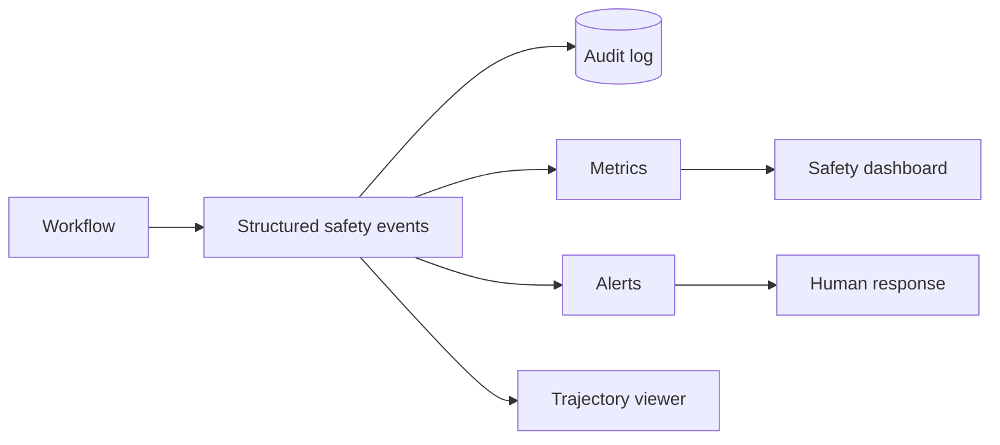

### 19.1 Safety metrics

| Metric | Meaning |
|---|---|
| Unsafe action rate | Proportion of proposed actions that would violate policy |
| Block precision | Proportion of blocked actions that were truly unsafe |
| Block recall | Proportion of unsafe actions successfully blocked |
| Approval precision | Proportion of approval requests that genuinely required review |
| Override rate | Frequency of interrupt, reset, abort, or manual correction |
| Near-miss rate | Unsafe proposal caught before execution |
| Unauthorized side-effect rate | Confirmed prohibited writes; target should be zero |
| Safe fallback rate | Failures resolved through approved fallback |
| Escalation quality | Human reviewers receive complete, actionable context |
| Time to containment | Time between unsafe signal and blocked execution |
| Redaction leakage rate | Sensitive values released despite redaction policy |
| Policy latency | Time added by control evaluation |

A low action rate is not automatically good. Overly restrictive controls can make the system unusable. Safety evaluation must consider both protection and task success.

---

## 20. Layered reference architecture

```mermaid
flowchart TB
    U[User] --> APP[Application layer]
    APP --> AUTH[Identity and session]
    AUTH --> IN[Input guardrails]
    IN --> ORCH[Orchestrator]
    ORCH --> PLAN[Planner]
    PLAN --> PDP[Policy decision point]
    PDP -->|Allow| EXEC[Tool execution gateway]
    PDP -->|Approval| HITL[Human review]
    PDP -->|Deny| DENY[Structured denial]
    EXEC --> SBOX[Sandbox and rate limits]
    SBOX --> TOOLS[Approved tools and APIs]
    TOOLS --> SYS[(Systems of record)]
    ORCH --> RAG[Authorization-aware retrieval]
    RAG --> KB[(Approved knowledge)]
    EXEC --> OUT[Output validation]
    RAG --> OUT
    OUT --> APP
    ORCH --> STATE[(Checkpointed state)]
    AUTH --> AUDIT[(Audit trail)]
    IN --> AUDIT
    PDP --> AUDIT
    HITL --> AUDIT
    EXEC --> AUDIT
    OUT --> AUDIT
```

The model is one component inside this architecture. It is not the policy authority, credential store, audit system, approval service, or final enforcement point.

---

## 21. Python implementation: safety control plane

The accompanying example demonstrates a dependency-free control plane with:

- typed requests and decisions;
- user and agent roles;
- capability classification;
- deterministic policy rules;
- exact-action approval hashes;
- redaction;
- idempotency;
- interrupt, reset, and abort states;
- append-only audit events;
- safe handling of ambiguous and unauthorized requests.

Repository path:

```text
examples/23-guardrails-control/safety_control_plane.py
```

The implementation intentionally keeps model reasoning outside the policy decision. A model or agent may construct a proposed action, but the control plane evaluates it independently.

---

## 22. Hands-on lab: secure an employee assistant

### Objective

Design a safe employee assistant that can:

- answer policy questions;
- retrieve the user's own leave balance;
- schedule a meeting with HR;
- prepare a payroll-change request;
- never expose another employee's records;
- never execute payroll changes without approval.

### Required artifacts

1. capability registry;
2. user and agent role model;
3. policy decision table;
4. approval packet schema;
5. interrupt/reset/abort state machine;
6. output-redaction rules;
7. test matrix;
8. safety metrics dashboard design.

### Acceptance criteria

- another employee's data is blocked before retrieval;
- payroll write pauses before execution;
- approval is tied to exact arguments;
- changed arguments invalidate approval;
- ambiguous address updates require clarification;
- policy-source failure produces a safe, transparent response;
- an abort prevents further actions;
- every decision is visible in the audit log;
- no rejected test creates a business-system side effect.

### Extension

Add dual approval for payroll changes above a configured impact threshold and test approval expiration.

---

## 23. Design checklist

### Identity and access

- Is every request linked to an authenticated subject?
- Are tenant, role, and resource scopes immutable during the workflow?
- Are agent permissions narrower than user permissions where appropriate?
- Are credentials short-lived and capability-specific?

### Input and retrieval

- Are prompt-injection attempts treated as untrusted data?
- Is sensitive information detected before external model calls?
- Is retrieval authorization applied before context reaches the model?
- Are source authority, freshness, and provenance preserved?

### Planning and behavior

- Is the workflow allowlisted or bounded?
- Are tool, retry, cost, time, and delegation budgets explicit?
- Is no-progress behavior detected?
- Can the agent stop safely when evidence is insufficient?

### Tools and actions

- Are tools classified by impact and reversibility?
- Are arguments validated against schemas and business rules?
- Are writes idempotent?
- Are ambiguous write outcomes reconciled before retry?
- Are high-impact actions approval-gated or denied?

### Human control

- Can users interrupt, reset, and abort?
- Is approval bound to exact action arguments?
- Do approvals expire?
- Are approvers authorized for the requested action?
- Is state preserved for safe resume?

### Output and monitoring

- Are outputs schema-validated, grounded, and redacted?
- Are uncertainty and missing evidence visible?
- Are policy events and side effects auditable?
- Are near misses, overrides, and unauthorized attempts monitored?
- Are guardrails tested against bypass and overblocking?

---

## 24. Common mistakes

### Mistake 1: treating the system prompt as the security boundary

Prompts influence behavior but do not enforce identity, permissions, idempotency, or network isolation.

### Mistake 2: giving every agent every tool

Broad permissions increase the impact of routing errors, injection, and role confusion.

### Mistake 3: approving a goal rather than an exact action

"Approve the payroll task" is too broad. Approve the precise tool, resource, arguments, and action hash.

### Mistake 4: filtering only the final answer

Unauthorized data should be blocked before retrieval and before tool execution, not only redacted afterward.

### Mistake 5: retrying a write after a timeout

First reconcile whether the write succeeded. Blind retry can duplicate effects.

### Mistake 6: hiding partial completion

A safe UX distinguishes proposed, approved, executed, confirmed, denied, and escalated states.

### Mistake 7: failing open on critical controls

If permission, approval, or redaction cannot be verified, high-impact actions should not proceed.

### Mistake 8: storing malicious instructions in memory

Memory write policies should exclude untrusted directives and preserve authority metadata.

### Mistake 9: measuring only block rate

A high block rate can indicate an unusable system. Measure precision, recall, task success, and escalation quality.

### Mistake 10: making human review a dead end

Review queues need owners, context, expiry, service levels, and safe terminal behavior.

---

## 25. Knowledge checks

1. Why is a system prompt insufficient as the only guardrail?
2. What is the difference between a policy decision point and a policy enforcement point?
3. Why must retrieval authorization occur before context reaches the model?
4. When should an action fail closed?
5. What information must be included in an approval packet?
6. Why should approval be bound to an action hash?
7. How do interrupt, reset, and abort differ?
8. What is the difference between a read-only and reversible-write capability?
9. Why must ambiguous write outcomes be reconciled before retry?
10. How does sandboxing reduce risk from code, files, and browsers?
11. What metrics reveal overblocking?
12. What should remain immutable after a reset?
13. How can knowledge poisoning affect RAG safety?
14. What is a near miss in an agent workflow?
15. Why should untrusted tool output be treated as data rather than instructions?

---

## 26. Interview questions

### Beginner

1. What is a guardrail in an AI agent system?
2. Name five categories of guardrails.
3. What is human-in-the-loop approval?
4. What is prompt injection?
5. Why is least privilege important?

### Intermediate

1. Design a control flow for an agent that can read and update CRM records.
2. How would you secure a RAG system containing documents with different access levels?
3. Explain how to bind an approval to a tool call.
4. How would you handle a timeout after a payment API request?
5. What information belongs in a safety audit event?
6. Compare fail-open and fail-closed behavior.
7. How would you test output redaction?

### Senior

1. Design a policy control plane for a multi-tenant enterprise agent platform.
2. How would you separate model-based risk classification from deterministic enforcement?
3. Define a safety state machine for a long-running workflow with pause and resume.
4. How would you prevent prompt injection in retrieved documents from causing tool execution?
5. Which safety controls belong in the application, orchestration, tool, and infrastructure layers?
6. How would you evaluate both guardrail recall and overblocking?
7. Design a dual-control approval process for high-impact writes.
8. How would you preserve safety when the policy service is unavailable?

### Architecture exercise

Design an employee assistant that can answer policy questions, retrieve the user's records, schedule HR meetings, and initiate payroll updates. Include:

- trust boundaries;
- identity propagation;
- retrieval authorization;
- capability classes;
- policy rules;
- approval packet;
- idempotency;
- interrupt/reset/abort;
- audit events;
- output validation;
- failure and fallback behavior;
- safety metrics.

---

## 27. Chapter summary

Guardrails are not a single filter and not a sentence in a system prompt. They are a layered control architecture spanning identity, input, retrieval, planning, tools, state, output, recovery, monitoring, and human authority.

The most important principles are:

1. keep critical enforcement outside the model;
2. treat untrusted content as data, not authority;
3. enforce authorization before retrieval and execution;
4. classify tools by impact and reversibility;
5. validate arguments and use least privilege;
6. bind approval to the exact action;
7. use idempotency and reconciliation for writes;
8. provide interrupt, reset, abort, fallback, and safe-stop paths;
9. validate and redact outputs before release;
10. sandbox dangerous capabilities;
11. log policy decisions and confirmed side effects;
12. test bypass, failure, and overblocking scenarios;
13. measure safe task completion, not merely the number of blocked requests.

A trustworthy agent is not one that never encounters uncertainty or malicious input. It is one that detects risk, limits authority, pauses when required, degrades safely, preserves an audit trail, and gives people meaningful control over consequential actions.
