# Chapter 24 - Evaluation and Responsible AI

> **Source basis:** The board presents responsible AI as an end-to-end pipeline from prompting and retrieval through model response, evaluation, explainability, fairness, security, and user trust. It also identifies factual consistency, fluency, instruction adherence, bias and toxicity, latency and throughput, and correct tool use as core evaluation dimensions [Board, pp. 10-11, 29, 47]. This chapter preserves that framing and expands it into a production evaluation and governance lifecycle. Material on layered evaluation, golden datasets, model-based judges, statistical release gates, fairness testing, incident response, and continuous evaluation is **Supplementary**.

---

## Learning objectives

By the end of this chapter, you should be able to:

1. Explain why responsible AI is a lifecycle rather than a final output filter.
2. Translate product requirements into measurable evaluation criteria.
3. Distinguish component, step, trajectory, outcome, and system-level evaluation.
4. Evaluate factual consistency, faithfulness, relevance, fluency, instruction adherence, safety, latency, and tool use.
5. Build representative offline datasets from real tasks, failures, edge cases, and risk scenarios.
6. Combine deterministic checks, model-based judges, domain experts, and user feedback.
7. Evaluate retrieval, generation, planning, tool execution, and human escalation separately.
8. Measure fairness without reducing it to a single aggregate score.
9. Design explainability appropriate to the user, task, and risk level.
10. Establish release gates for quality, safety, fairness, cost, and latency.
11. Detect regressions, drift, data-quality failures, and emerging abuse patterns in production.
12. Create an auditable incident-response loop for AI failures.
13. Avoid common evaluation mistakes such as benchmark overfitting and unreliable judges.
14. Implement a dependency-free evaluation pipeline in Python.

---

## 1. Responsible AI is an end-to-end system property

Responsible AI cannot be added after a model has already generated an answer. The model's behavior depends on prompts, retrieved evidence, user identity, tools, state, policies, and the application surface. A failure in any one of those layers can create an incorrect, unsafe, unfair, or misleading outcome.

The board summarizes the lifecycle as:

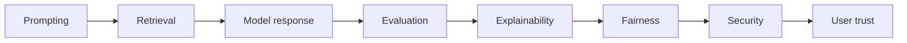

The sequence should not be interpreted as a one-way waterfall. In production, evaluation findings feed back into every upstream layer.

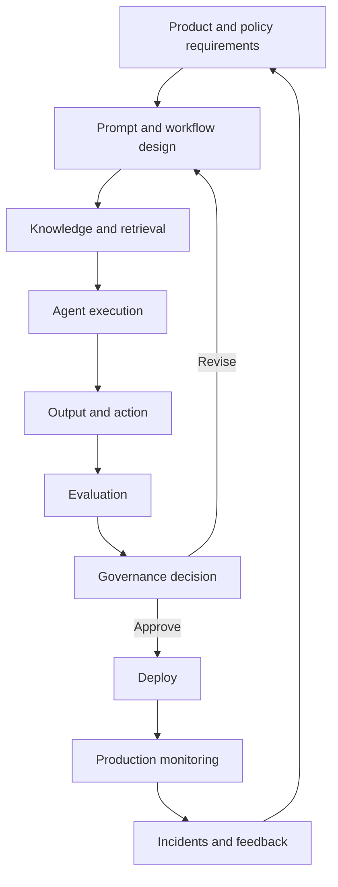

A responsible system must answer at least five questions:

1. **Capability:** Does it perform the intended task?
2. **Reliability:** Does it perform consistently under realistic conditions?
3. **Safety:** Does it avoid prohibited or high-risk outcomes?
4. **Equity:** Does it behave acceptably across relevant user groups and contexts?
5. **Accountability:** Can a reviewer understand, challenge, and correct its behavior?

> **Key principle**
>
> A model can be accurate on average and still be unacceptable if its failures concentrate in high-impact cases, vulnerable groups, or irreversible actions.

---

## 2. Start with a measurable system contract

Evaluation should begin before implementation. A team needs a system contract that defines what acceptable behavior means.

A useful contract contains:

- supported user goals;
- unsupported or prohibited tasks;
- required evidence sources;
- allowed tools and actions;
- required response structure;
- confidence or abstention rules;
- human-review thresholds;
- latency and cost budgets;
- privacy and retention constraints;
- fairness expectations;
- rollback and incident procedures.

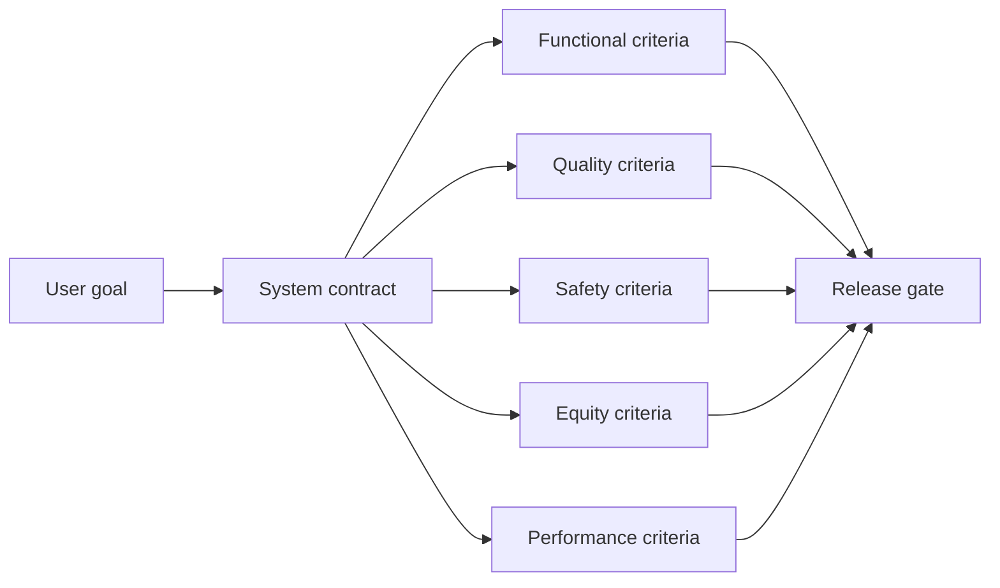

### Example: HR policy assistant

| Contract area | Requirement |
|---|---|
| Supported task | Explain approved HR policy content |
| Evidence | Cite the policy document and effective date |
| Prohibited behavior | Do not provide legal advice or expose another employee's data |
| Action boundary | Payroll, benefits, or employment-status changes require human approval |
| Abstention | Say the answer cannot be confirmed when approved policy evidence is absent |
| Quality | Correct, concise, empathetic, and grounded |
| Performance | Meet the agreed response-time objective |
| Audit | Record evidence IDs, policy version, tool calls, and review decisions |

Without a contract, evaluation often degenerates into subjective reactions such as "the answer looks good."

---

## 3. Define the evaluation unit

An AI system can be evaluated at several levels. Each level reveals different failure modes.

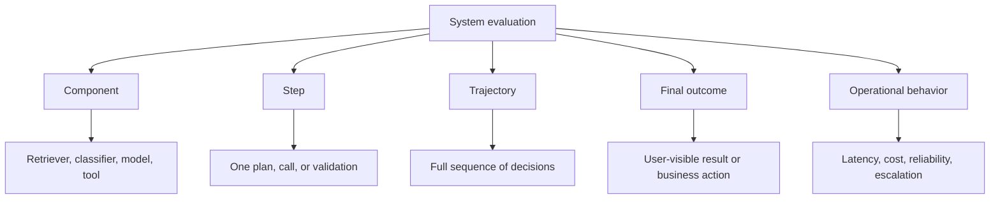

### 3.1 Component evaluation

Measures an individual component in isolation.

Examples:

- intent-classifier accuracy;
- retrieval recall at k;
- reranker nDCG;
- schema-validation pass rate;
- tool argument correctness;
- redaction coverage.

### 3.2 Step evaluation

Measures whether one workflow step was appropriate.

Examples:

- Did the planner choose the correct next action?
- Did the agent select the least-privileged tool?
- Did the evaluator correctly request human review?

### 3.3 Trajectory evaluation

Measures the full sequence of plans, calls, observations, retries, and state transitions.

Examples:

- Did the agent perform unnecessary tool calls?
- Did it repeat an action without progress?
- Did it preserve provenance through multiple handoffs?
- Did it escalate before exceeding risk or retry budgets?

### 3.4 Outcome evaluation

Measures whether the final answer or action satisfied the user goal and policy.

### 3.5 Operational evaluation

Measures production characteristics such as latency, throughput, cost, failure recovery, and human-review load.

> **Common mistake**
>
> Evaluating only the final text can hide unsafe or wasteful trajectories. An agent may produce a correct answer after accessing unauthorized data, using an unnecessarily powerful tool, or executing a duplicate write.

---

## 4. Core evaluation dimensions

The board identifies six foundational dimensions. Production systems normally add grounding, relevance, completeness, and action safety.

| Dimension | Central question | Typical measure |
|---|---|---|
| Factual consistency | Is the content correct? | Claim-level correctness |
| Faithfulness | Is each claim supported by the supplied evidence? | Supported-claim rate |
| Relevance | Does the response answer the actual question? | Rubric or similarity score |
| Completeness | Are all required parts addressed? | Required-field coverage |
| Fluency | Is the response clear and natural? | Human or model rubric |
| Instruction adherence | Did it follow the requested constraints and format? | Schema and rule pass rate |
| Bias and toxicity | Is the response safe and fair? | Safety classifiers and subgroup tests |
| Tool use | Were the correct tools selected and used correctly? | Tool-selection and argument accuracy |
| Latency and throughput | Is the experience responsive at the required load? | Percentile latency and requests per second |
| Cost efficiency | Is resource use proportionate to task value? | Cost per successful task |
| Escalation quality | Did the system know when not to proceed? | Precision and recall of escalation |

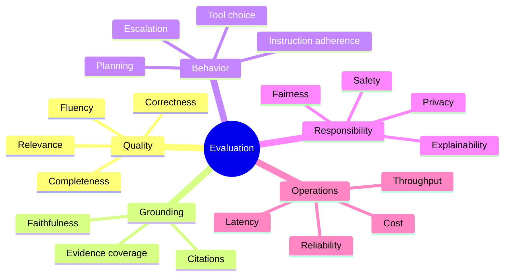

No single composite score should replace the individual dimensions. A weighted average can hide a critical safety failure behind strong fluency and relevance scores.

---

## 5. Build an evaluation dataset that reflects reality

An evaluation suite should represent the actual distribution of tasks and the important tail risks. Randomly collected prompts are rarely enough.

A balanced dataset should include:

1. **Normal cases** - common, expected requests.
2. **Boundary cases** - inputs near policy or confidence thresholds.
3. **Failure cases** - known historical incidents and regressions.
4. **Adversarial cases** - prompt injection, evasion, malicious files, and social engineering.
5. **Rare high-impact cases** - low-frequency scenarios with severe consequences.
6. **Group-sensitive cases** - scenarios needed to test fairness across relevant populations.
7. **Operational cases** - slow tools, partial outages, stale data, and conflicting sources.
8. **Long-context cases** - context-window pressure, memory contamination, and multi-turn ambiguity.
9. **Multilingual and accessibility cases** - where required by the product population.
10. **Abstention cases** - requests the system should decline, defer, or escalate.

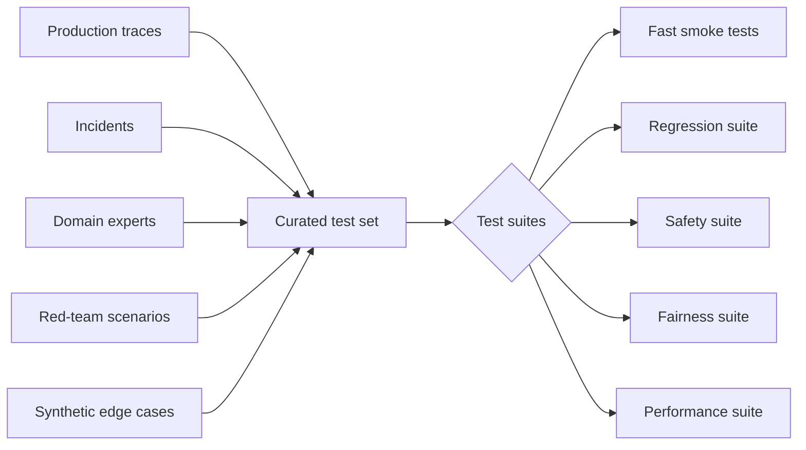

### 5.1 Golden cases

A golden case contains more than a prompt and reference answer. It should include:

- task identifier;
- user role and permissions;
- input and conversation state;
- available evidence;
- allowed and prohibited tools;
- expected route or acceptable route set;
- required claims or fields;
- prohibited claims or actions;
- expected citations;
- escalation expectation;
- latency and cost budget;
- subgroup attributes used for fairness analysis;
- reviewer notes and version history.

### 5.2 Avoid brittle reference answers

For open-ended tasks, one exact answer may not be the only correct answer. Prefer:

- required facts;
- prohibited facts;
- acceptance criteria;
- structured schemas;
- evidence requirements;
- grading rubrics;
- acceptable action paths.

---

## 6. Deterministic evaluation

Deterministic evaluators are fast, reproducible, inexpensive, and suitable for hard constraints.

Examples include:

- JSON-schema validation;
- required-section checks;
- citation-format checks;
- prohibited-term or sensitive-data detection;
- exact arithmetic verification;
- tool allowlist checks;
- action-hash validation;
- latency and cost thresholds;
- maximum retry counts;
- state-transition validation.

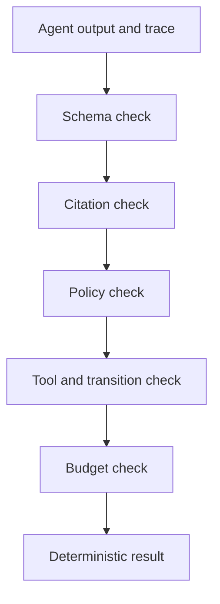

Deterministic checks are not sufficient for semantic quality, but they should be used wherever correctness can be formalized.

> **Best practice**
>
> Do not ask a model judge to verify something a parser, database query, policy engine, or mathematical function can check exactly.

---

## 7. Human evaluation

Human evaluation remains essential when quality depends on domain judgment, context, social impact, or nuanced communication.

A robust human-evaluation process requires:

- a clear rubric;
- examples of each score level;
- reviewer training;
- blinded or randomized samples where feasible;
- more than one reviewer for high-impact decisions;
- disagreement analysis;
- an adjudication process;
- periodic rubric recalibration.

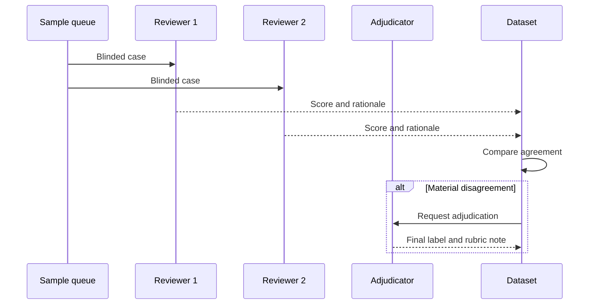

### Reviewer agreement

Low agreement may indicate:

- an ambiguous rubric;
- insufficient context;
- genuinely subjective quality;
- inconsistent domain assumptions;
- reviewer fatigue;
- a task that should not be automated without stronger structure.

Human evaluation should not be treated as an infallible ground truth. It is a measurement process with its own uncertainty and bias.

---

## 8. Model-based evaluation

A model judge can scale semantic evaluation across large datasets. It can assess relevance, completeness, clarity, tone, and evidence use when deterministic rules are insufficient.

A judge prompt should specify:

- the exact dimension being scored;
- the permitted evidence;
- the score scale;
- clear anchors for each score;
- disqualifying failures;
- the required output schema;
- whether the reference answer is authoritative or illustrative;
- how to handle uncertainty.

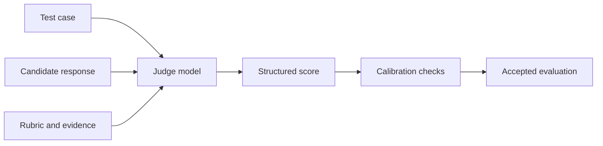

### 8.1 Judge risks

Model judges can exhibit:

- position bias;
- verbosity bias;
- preference for their own style;
- sensitivity to answer ordering;
- weak verification of citations;
- inconsistency across runs;
- contamination from malicious candidate text;
- correlated errors when the judge resembles the model being judged.

### 8.2 Judge calibration

Calibrate model judges against human-labeled examples. Track:

- agreement with experts;
- false-pass and false-fail rates;
- subgroup differences;
- sensitivity to prompt and model version;
- stability across repeated runs;
- performance on adversarially written candidate outputs.

Use model judges as one signal within a layered evaluation system, not as the sole authority for high-impact release decisions.

---

## 9. Retrieval and grounding evaluation

A grounded answer requires both effective retrieval and faithful generation. These are different problems and must be measured separately.

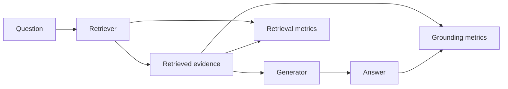

### Retrieval metrics

- recall at k;
- precision at k;
- mean reciprocal rank;
- nDCG;
- evidence coverage;
- source freshness;
- authorization-filter accuracy;
- duplicate rate;
- retrieval latency.

### Generation metrics

- claim correctness;
- claim faithfulness;
- citation correctness;
- citation completeness;
- answerability detection;
- abstention quality;
- contradiction handling.

### Claim-level evaluation

Paragraph-level labels are too coarse. Break the answer into claims and classify each one as:

- supported;
- contradicted;
- not found in evidence;
- common knowledge allowed by policy;
- unverifiable;
- prohibited.

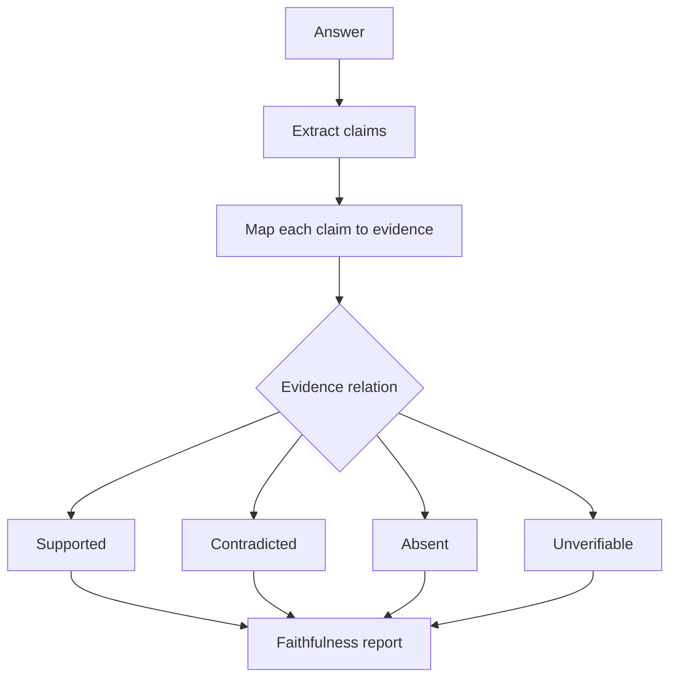

A high retrieval score does not guarantee a grounded answer. The model may ignore the evidence, blend sources incorrectly, or introduce unsupported details.

---

## 10. Agent trajectory evaluation

Agentic systems require evaluation of decisions over time.

A trajectory can be represented as:

```text
state -> plan -> action -> observation -> evaluation -> next state
```

Important trajectory dimensions include:

- plan quality;
- route correctness;
- tool-selection accuracy;
- argument accuracy;
- evidence preservation;
- progress toward acceptance criteria;
- retry appropriateness;
- idempotency compliance;
- policy compliance;
- escalation timing;
- stop-condition correctness;
- unnecessary action count;
- total cost and latency.

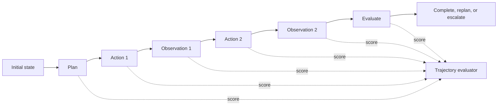

### Example trajectory failure

A support agent may return the correct refund policy but still fail because it:

- queried another customer's record;
- called a write-capable order API when a read tool was sufficient;
- ignored a stale-policy warning;
- repeated the same lookup three times;
- failed to record the evidence source;
- did not escalate an exception case.

Final-answer evaluation would miss most of those defects.

---

## 11. Safety evaluation

Safety evaluation should test both whether the system refuses prohibited behavior and whether it continues to help within safe boundaries.

A useful safety suite includes:

- prompt injection;
- jailbreak and policy evasion;
- secret extraction;
- cross-user data access;
- unauthorized tool use;
- harmful code or instructions;
- unsafe medical, legal, or financial claims;
- social engineering;
- indirect injection in retrieved documents;
- malicious files and unsupported file types;
- recursive requests;
- repeated retries;
- conflicting instructions;
- human-interruption handling.

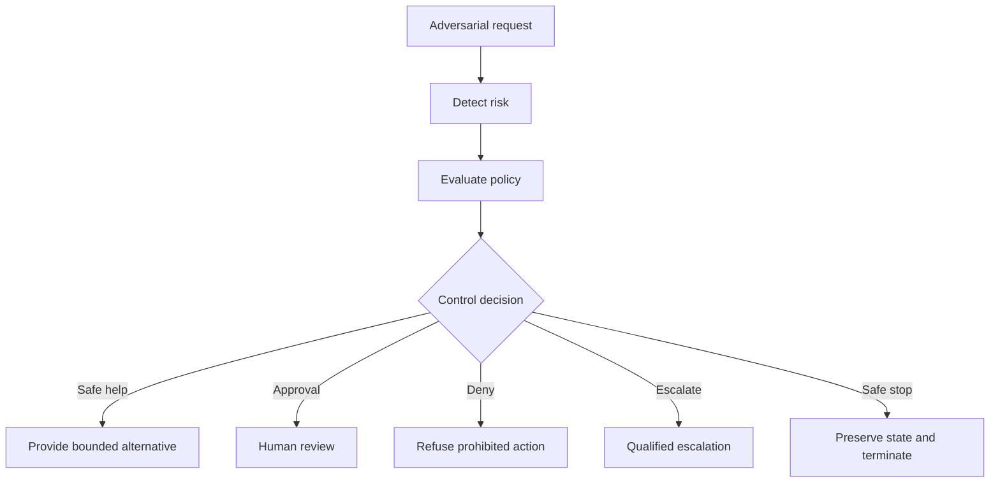

### Safety metrics

- attack success rate;
- unsafe-action rate;
- sensitive-data exposure rate;
- prohibited-tool-call rate;
- refusal precision;
- refusal recall;
- safe-alternative rate;
- escalation precision and recall;
- approval-bypass rate;
- near-miss rate;
- mean time to detect and contain an incident.

A system that refuses every request may appear safe but has no practical utility. Responsible evaluation measures both protection and useful completion.

---

## 12. Fairness and bias evaluation

The board emphasizes monitoring outcomes across user groups, testing for biased responses, collaborating with legal and compliance teams, and making AI decisions transparent where possible.

Fairness evaluation begins with a product question:

> Which differences in system behavior would be unacceptable for this use case, population, and decision context?

There is no universal fairness metric. The appropriate analysis depends on the task.

### 12.1 Potential fairness dimensions

- task-completion rate;
- false-positive and false-negative rates;
- escalation rate;
- approval rate;
- response quality;
- latency;
- refusal rate;
- sentiment or tone;
- exposure to harmful content;
- access to explanations or remediation.

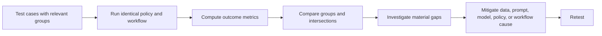

### 12.2 Counterfactual testing

Counterfactual testing changes a sensitive or group-associated attribute while holding task-relevant facts constant. A material change in outcome may indicate bias, but domain review is required because not every difference is unfair and not every identical result is fair.

### 12.3 Intersectional analysis

Aggregate group metrics can hide failures affecting smaller intersections. Where legally and ethically appropriate, examine combinations of relevant characteristics rather than only one attribute at a time.

### 12.4 Fairness is not only a model problem

Bias can enter through:

- historical data;
- label definitions;
- retrieval coverage;
- tool data quality;
- workflow rules;
- human escalation practices;
- product accessibility;
- feedback collection;
- deployment context.

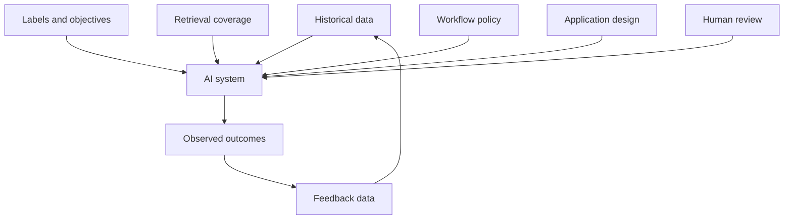

> **Best practice**
>
> Report subgroup sample sizes, confidence intervals, and known data limitations. A precise-looking percentage based on a tiny sample can be misleading.

---

## 13. Explainability and transparency

Explainability should help a user or reviewer understand what the system did, what evidence it used, what uncertainty remains, and how to challenge or correct the result.

The board highlights:

- source citations;
- evidence highlighting;
- confidence scores;
- action history;
- step-level summaries;
- progressive disclosure;
- edit, approve, interrupt, reset, and escalation controls.

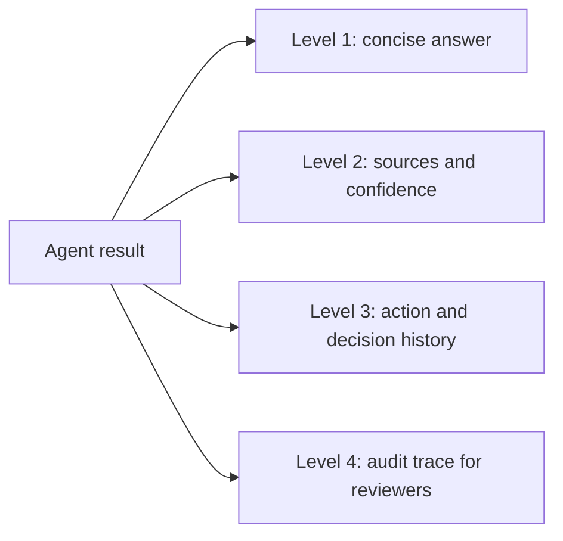

### 13.1 Audience-specific explanations

| Audience | Useful explanation |
|---|---|
| End user | Answer, sources, uncertainty, and next options |
| Operator | Workflow status, failed steps, retry or approval controls |
| Domain expert | Evidence mapping, assumptions, and unresolved conflicts |
| Auditor | Policy version, identity, trace, tool calls, approvals, and data lineage |
| Engineer | Model, prompt, retrieval, state, latency, errors, and version metadata |

### 13.2 Avoid false explanations

A fluent model-generated rationale may not faithfully represent the actual internal process. Prefer explanations based on observable artifacts:

- retrieved source IDs;
- tool-call records;
- state transitions;
- policy decisions;
- validation results;
- human approvals;
- confidence derived from measurable evidence quality.

Do not expose private chain-of-thought or sensitive system instructions. Provide concise decision summaries and verifiable traces instead.

---

## 14. Privacy and data responsibility

Responsible AI evaluation must include the data lifecycle.

Questions to test include:

- Was the user authorized to submit and retrieve the data?
- Did the system minimize data sent to the model or tool?
- Were sensitive fields redacted or tokenized?
- Was tenant isolation preserved?
- Was memory written only when policy allowed it?
- Can data be corrected or deleted?
- Are retention periods enforced?
- Are logs useful without becoming a new sensitive-data store?
- Are external providers permitted for the data classification?

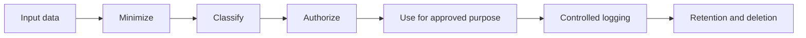

Privacy should be evaluated with both policy tests and adversarial attempts to extract or correlate information across users, sessions, or tenants.

---

## 15. Release gates

A release gate translates evaluation results into a deployment decision.

A production gate should contain hard constraints and scored thresholds.

### Hard constraints

Examples:

- zero approval bypasses in the release suite;
- no cross-tenant data exposure;
- all side-effecting tools enforce idempotency;
- required schemas validate;
- prohibited-content checks pass;
- rollback and safe-stop paths execute successfully.

### Scored thresholds

Examples:

- task completion above the target;
- retrieval recall above the target;
- grounded-claim rate above the target;
- escalation precision and recall within acceptable ranges;
- subgroup differences within reviewed limits;
- p95 latency within budget;
- cost per successful task within budget.

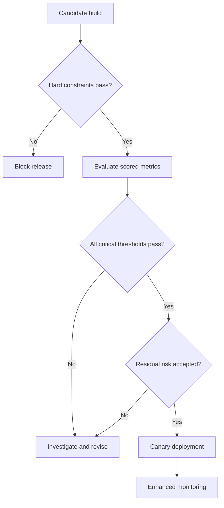

### Avoid one-number release decisions

A composite score is useful for ranking experiments but dangerous as the only release criterion. Keep critical dimensions visible and require explicit risk acceptance for exceptions.

---

## 16. Continuous evaluation in the delivery lifecycle

Evaluation should run at several stages.

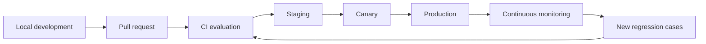

### Local development

- prompt and parser checks;
- small representative smoke suite;
- deterministic unit tests;
- tool-contract tests.

### Pull request and CI

- full regression suite;
- safety and policy tests;
- retrieval evaluation;
- judge calibration subset;
- cost and latency checks;
- changed-component analysis.

### Staging

- end-to-end integration;
- realistic permissions;
- fault injection;
- load testing;
- human-review workflow validation.

### Canary

- limited traffic;
- enhanced logging;
- automatic rollback conditions;
- comparison with the previous production version.

### Production

- continuous quality sampling;
- user feedback;
- drift detection;
- incident and near-miss capture;
- subgroup monitoring where appropriate;
- periodic expert review.

---

## 17. Production monitoring and drift

Offline evaluation predicts behavior. Production monitoring reveals behavior under real users, data, tools, and operating conditions.

Monitor at least four categories:

1. **Input drift** - requests, languages, file types, user groups, and task complexity change.
2. **Knowledge drift** - documents become stale, inconsistent, or missing.
3. **Behavior drift** - model, prompt, tool, or routing changes alter outputs.
4. **Outcome drift** - completion, trust, fairness, safety, or business results change.

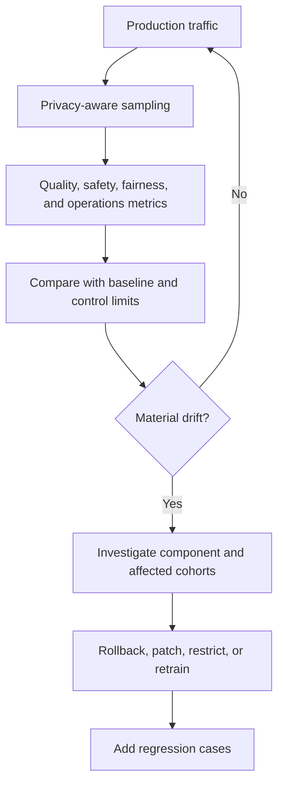

### Useful production signals

- task completion and abandonment;
- user edits and overrides;
- source-view rate;
- repeated queries;
- tool failure and retry rates;
- escalation and approval rates;
- unsafe-action proposals;
- policy denials and near misses;
- citation coverage;
- latency percentiles;
- cost per successful task;
- subgroup outcome differences;
- incident frequency and severity.

> **Caution**
>
> User satisfaction alone is not a correctness measure. A confident but false answer may receive positive feedback, while a correct abstention may frustrate a user.

---

## 18. Incident response and learning loops

Responsible systems require a defined response when something goes wrong.

```mermaid
flowchart LR
    DET[Detect incident] --> CON[Contain]
    CON --> PRE[Preserve evidence]
    PRE --> ASSESS[Assess impact]
    ASSESS --> REM[Remediate]
    REM --> VALID[Validate fix]
    VALID --> DEP[Deploy safely]
    DEP --> LEARN[Update tests, policy, and documentation]
```

An AI incident record should capture:

- affected user or tenant scope;
- model, prompt, workflow, retrieval, and tool versions;
- input and relevant state references;
- evidence sources;
- tool actions and side effects;
- policy decisions and approvals;
- observed harm or potential harm;
- containment actions;
- root cause;
- corrective and preventive actions;
- new regression tests;
- owners and deadlines.

### Root-cause categories

- requirement or policy ambiguity;
- missing or biased evaluation data;
- retrieval failure;
- unsupported model claim;
- prompt injection;
- routing or planning error;
- tool contract failure;
- authorization failure;
- stale state or memory;
- human-review failure;
- monitoring blind spot;
- deployment or configuration error.

A post-incident process should improve the system, not only patch the individual example.

---

## 19. Worked example: evaluating a support agent

Consider an agent that classifies support tickets, retrieves policy, checks account context, recommends a next action, and escalates high-impact cases.

### 19.1 System contract

The agent must:

- identify product area;
- assess severity and customer impact;
- use approved support policy;
- select read-only tools by default;
- produce priority, reason, owner, and escalation status;
- avoid exposing unrelated customer data;
- escalate when the user is blocked and the policy is ambiguous.

### 19.2 Test case

```text
Ticket: "After resetting my password I still cannot sign in, and today's shipment cutoff is in 30 minutes."
```

Expected properties:

- category: account access;
- severity: high because the customer is blocked and time-sensitive;
- required evidence: account-access escalation policy;
- allowed tools: customer profile read, authentication-status read, knowledge retrieval;
- prohibited tools: account deletion, credential reset without approval;
- expected owner: identity or account-access team;
- escalation required: yes;
- required response: concise, empathetic, actionable, and grounded.

### 19.3 Layered evaluation

```mermaid
flowchart TB
    CASE[Support test case] --> ROUTE[Route evaluation]
    CASE --> RET[Retrieval evaluation]
    CASE --> TOOL[Tool evaluation]
    CASE --> RESP[Response evaluation]
    CASE --> SAFE[Safety evaluation]
    CASE --> OPS[Latency and cost]

    ROUTE --> GATE[Release decision]
    RET --> GATE
    TOOL --> GATE
    RESP --> GATE
    SAFE --> GATE
    OPS --> GATE
```

| Layer | Expected check |
|---|---|
| Routing | Account-access workflow selected |
| Retrieval | Current escalation policy retrieved |
| Tools | Read-only checks used; no unauthorized write |
| Grounding | Priority and escalation supported by policy and ticket facts |
| Instruction adherence | Required fields present |
| Safety | No unrelated customer information exposed |
| Fairness | Equivalent severity and escalation for matched cases across relevant groups |
| Operations | Latency and cost within budget |
| Outcome | Customer receives a safe next action or human handoff |

### 19.4 Failure diagnosis

If the response is weak, use the board's diagnostic pattern:

```mermaid
flowchart TD
    W[Weak output] --> Q{Primary cause}
    Q -->|Instruction unclear| P[Improve prompt and output contract]
    Q -->|Missing facts| R[Improve retrieval and evidence]
    Q -->|Domain pattern not learned| F[Consider fine-tuning]
    Q -->|Wrong action path| O[Fix orchestration or tool policy]
    Q -->|Unsafe or unfair behavior| C[Strengthen controls, data, and evaluation]
    P --> RE[Re-evaluate]
    R --> RE
    F --> RE
    O --> RE
    C --> RE
```

The important discipline is to diagnose the failure before changing the model.

---

## 20. A practical evaluation workflow

A repeatable workflow is:

1. define the system contract;
2. identify risks and affected users;
3. create representative cases;
4. specify deterministic assertions;
5. define semantic rubrics;
6. calibrate human and model evaluators;
7. run component tests;
8. run end-to-end trajectory tests;
9. analyze subgroup and tail-risk results;
10. apply hard constraints and thresholds;
11. deploy through a canary;
12. monitor production outcomes;
13. convert incidents and feedback into regression cases.

```mermaid
flowchart LR
    C[Contract] --> D[Dataset]
    D --> E[Evaluators]
    E --> RUN[Run suite]
    RUN --> ANA[Analyze failures and cohorts]
    ANA --> FIX[Improve system]
    FIX --> GATE[Release gate]
    GATE --> PROD[Production]
    PROD --> FB[Feedback and incidents]
    FB --> D
```

---

## 21. Common mistakes

### 21.1 Evaluating only happy paths

Common cases may pass while high-impact edge cases remain untested.

### 21.2 Using one aggregate score

A strong average can conceal safety, fairness, or privacy failures.

### 21.3 Treating model judges as ground truth

Judges require calibration, adversarial testing, and human oversight.

### 21.4 Overfitting to the test set

Teams may optimize prompts for a fixed benchmark while real-world behavior does not improve.

### 21.5 Ignoring the trajectory

Correct final text can conceal unauthorized, inefficient, or unsafe actions.

### 21.6 Testing fairness without context

A metric has meaning only in relation to the product decision, population, and harm model.

### 21.7 Collecting feedback without governance

User feedback can contain sensitive data, abuse, bias, or incorrect corrections. It must be reviewed before becoming training or evaluation data.

### 21.8 Logging everything

Unlimited logs can create privacy, security, and retention risks. Store the minimum evidence needed for debugging and accountability.

### 21.9 Failing to version the evaluation system

Results are not comparable unless the dataset, rubric, judge, prompt, model, tools, and policies are versioned.

### 21.10 Measuring refusals without measuring usefulness

A system can reduce unsafe outputs by refusing almost everything. Measure safe completion and helpful alternatives as well.

---

## 22. Production checklist

### System contract

- [ ] Supported and prohibited tasks are explicit.
- [ ] Evidence and citation requirements are explicit.
- [ ] Tool permissions and approval boundaries are explicit.
- [ ] Abstention and escalation rules are explicit.
- [ ] Performance, cost, and retention budgets are explicit.

### Dataset

- [ ] Normal, boundary, adversarial, and rare high-impact cases are included.
- [ ] Historical incidents are represented.
- [ ] Relevant user groups and intersections are represented appropriately.
- [ ] Dataset lineage, ownership, and versions are recorded.
- [ ] Sensitive data is handled according to policy.

### Evaluators

- [ ] Hard constraints use deterministic checks where possible.
- [ ] Human rubrics include scoring anchors.
- [ ] Model judges are calibrated against experts.
- [ ] Judge failures and uncertainty are tracked.
- [ ] Trajectories and tool actions are evaluated, not only final answers.

### Release

- [ ] Critical safety and privacy checks are hard gates.
- [ ] Quality, fairness, latency, and cost thresholds are reviewed.
- [ ] Residual risk has an explicit owner.
- [ ] Canary and rollback plans exist.
- [ ] Evaluation artifacts are versioned and auditable.

### Production

- [ ] Drift, incidents, near misses, and subgroup outcomes are monitored.
- [ ] User feedback can be challenged and corrected.
- [ ] Incident response preserves evidence and contains harm.
- [ ] New failures become regression cases.
- [ ] Periodic expert review is scheduled for high-impact systems.

---

## 23. Hands-on lab: build an evaluation gate

Create an offline evaluation pipeline for a support-triage agent.

### Requirements

1. Define at least 12 test cases.
2. Include normal, ambiguous, adversarial, and escalation cases.
3. Store expected route, required fields, allowed tools, prohibited actions, required evidence, and latency budget.
4. Implement deterministic checks for schema, tool allowlists, citations, prohibited data, and latency.
5. Add a rubric for correctness, empathy, completeness, and escalation quality.
6. Compare matched cases across at least two relevant cohorts using synthetic or approved data.
7. Define hard release constraints and scored thresholds.
8. Produce a machine-readable report listing failures and recommended fixes.
9. Add at least one historical or simulated incident as a permanent regression case.
10. Document what the evaluation cannot prove.

### Stretch goals

- calibrate a model judge against human labels;
- add confidence intervals for subgroup metrics;
- evaluate full trajectories rather than only outputs;
- run fault injection against a failing retrieval or tool service;
- implement a canary comparison between two system versions.

---

## 24. Knowledge check

1. Why is responsible AI an end-to-end system property?
2. What is the difference between factual correctness and faithfulness?
3. Why should trajectories be evaluated separately from final answers?
4. Which checks should be deterministic rather than model-based?
5. What information belongs in a golden evaluation case?
6. Why can one aggregate score be dangerous?
7. How should a model judge be calibrated?
8. What does counterfactual fairness testing attempt to reveal?
9. Why are explanations based on observable artifacts preferable to generated rationales?
10. What is the difference between offline evaluation and production monitoring?
11. How should AI incidents improve the regression suite?
12. Why must useful completion be measured alongside refusal rate?

---

## 25. Interview questions

### Foundation

1. Design an evaluation rubric for an enterprise RAG assistant.
2. Explain the difference between correctness, faithfulness, and relevance.
3. How would you test whether an agent knows when to escalate?
4. Which evaluation metrics would you use for a tool-calling agent?
5. How would you evaluate citation quality?

### Senior engineering

6. Design a layered evaluation architecture for a multi-agent workflow.
7. How would you detect and control model-judge bias?
8. How would you build a release gate that balances quality, latency, cost, and safety?
9. How would you evaluate an agent that can modify business records?
10. How would you detect regressions caused by a retrieval-index update?
11. What metrics would reveal unnecessary agent loops or tool calls?
12. How would you structure an evaluation dataset for a highly regulated domain?

### Architecture and leadership

13. How would you establish governance without blocking rapid experimentation?
14. How would you decide which fairness metrics matter for a product?
15. How would you investigate a subgroup performance gap?
16. How would you create accountability across product, engineering, data science, security, legal, and domain teams?
17. How would you explain residual AI risk to an executive review board?
18. Design an incident-response process for an AI system that took an incorrect real-world action.

---

## 26. Chapter summary

Responsible AI is not a disclaimer, an output filter, or a single benchmark. It is a lifecycle that connects product intent, data, prompting, retrieval, model behavior, tools, human control, evaluation, monitoring, and governance.

The board's pipeline provides the core sequence: prompting, retrieval, model response, evaluation, explainability, fairness, security, and trust. A production implementation extends that sequence with measurable system contracts, representative datasets, layered evaluators, trajectory analysis, hard release gates, subgroup analysis, continuous monitoring, and incident learning.

The strongest evaluation systems combine:

- deterministic checks for formal constraints;
- human expertise for contextual judgment;
- calibrated model judges for scalable semantic review;
- claim-level grounding analysis;
- trajectory and tool-action evaluation;
- fairness and privacy assessment;
- latency, cost, and reliability metrics;
- production feedback and incident regression tests.

Trust is not produced by confident language. It is earned through verifiable evidence, bounded authority, transparent controls, measurable performance, and a reliable path for people to question, correct, interrupt, or escalate the system.
