# Chapter 25 - Explainability, Bias, and Fairness

> **Source basis:** The board positions explainability, fairness, and security as necessary steps between model evaluation and user trust. It also assigns product leaders responsibility for monitoring outcomes across user groups, testing for biased responses, collaborating with engineering, design, legal, and compliance, and making AI decisions transparent where possible [Board, pp. 46-47]. This chapter preserves that framing and expands it into a practical engineering and product-governance discipline. Material on explanation packets, faithfulness testing, fairness metrics, counterfactual testing, intersectional analysis, mitigation selection, and continuous fairness monitoring is **Supplementary**.

---

## Learning objectives

By the end of this chapter, you should be able to:

1. Distinguish transparency, interpretability, explainability, auditability, and contestability.
2. Design explanations for users, operators, auditors, developers, and approvers.
3. Explain an AI-assisted decision without exposing private internal reasoning.
4. Separate evidence, policy, tool results, uncertainty, and human judgment in an explanation.
5. Evaluate whether an explanation is faithful rather than merely persuasive.
6. Identify bias introduced by data, labels, prompts, retrieval, tools, policies, interfaces, and feedback loops.
7. Select fairness metrics that match the product decision and harm model.
8. Measure error, escalation, abstention, latency, and service-quality differences across groups.
9. Use counterfactual and intersectional testing responsibly.
10. Diagnose fairness problems in RAG and agent trajectories, not only final model outputs.
11. Choose mitigations at the correct system layer.
12. Design human review and appeal paths for consequential outcomes.
13. Build continuous fairness monitoring without creating unnecessary privacy risk.
14. Implement a dependency-free fairness and explanation audit in Python.

---

## 1. Explainability and fairness are product properties

Explainability is often treated as a paragraph attached to a model answer. Fairness is often treated as one metric calculated before launch. Both approaches are too narrow.

An AI product is a system of prompts, models, retrieval sources, tools, policies, user interfaces, state, and human decisions. Its explanations and group outcomes are produced by the whole system.

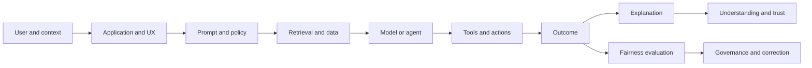

A well-written answer can still be unfair if one group receives lower-quality evidence, slower service, more false escalations, or fewer opportunities to correct errors. A numerically balanced system can still be untrustworthy if users cannot understand what happened or challenge a consequential decision.

The engineering goal is therefore not "make the model explain itself." It is:

> Build a system that can show the evidence, rules, actions, uncertainty, and accountability behind an outcome, while measuring whether outcomes and failure modes are acceptably distributed.

---

## 2. Core terms

These terms overlap but are not interchangeable.

| Term | Practical meaning | Example |
|---|---|---|
| Transparency | Visibility into what the system is, what data it uses, and what it can do | Disclose that an AI assistant uses policy documents and may call an order API |
| Interpretability | How directly a human can understand the mechanism | A small rules model is easier to inspect than a large neural model |
| Explainability | A useful account of why a particular output or action occurred | Show policy evidence, tool results, and the rule that triggered escalation |
| Auditability | Ability to reconstruct and verify what happened later | Persist model version, prompt version, evidence IDs, tool calls, and approvals |
| Contestability | Ability for an affected person to question, correct, or appeal an outcome | Provide a correction path and human review |
| Justification | Normative reason an action was allowed or chosen | "Refund requires approval because the amount exceeds the configured threshold" |
| Provenance | Origin and transformation history of evidence | Document ID, version, effective date, and retrieval score |

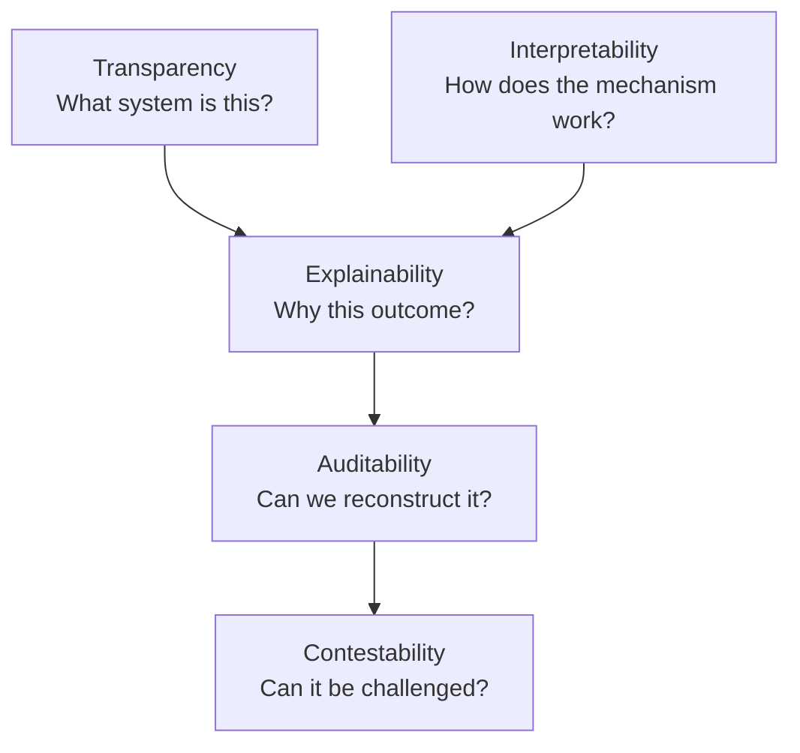

> **Key principle**
>
> An explanation is not complete merely because it sounds reasonable. It must be linked to the actual evidence and control path that produced the outcome.

---

## 3. Different audiences need different explanations

A single explanation format cannot satisfy every audience.

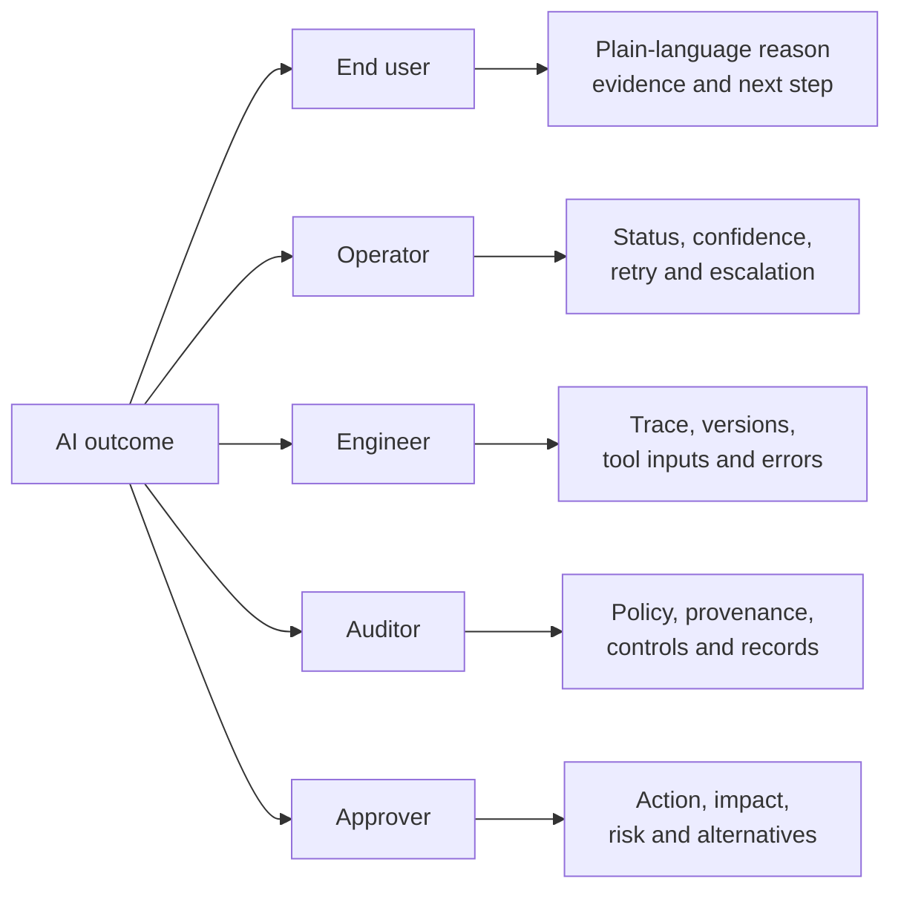

### 3.1 End-user explanation

A user usually needs:

- what the system understood;
- what information it used;
- the answer or action;
- important uncertainty or limitations;
- what the user can do next;
- how to correct or appeal.

### 3.2 Operator explanation

An operator needs:

- workflow state;
- failed and completed steps;
- confidence or sufficiency indicators;
- fallback and escalation options;
- safe restart point.

### 3.3 Developer explanation

A developer needs:

- model, prompt, tool, and policy versions;
- exact structured inputs and outputs;
- retrieval results and scores;
- state transitions;
- timing, cost, retries, and errors.

### 3.4 Auditor or compliance explanation

An auditor needs:

- policy basis;
- authorization decision;
- evidence provenance;
- approvals;
- retention and access history;
- proof that prohibited actions were blocked.

### 3.5 Human approver explanation

An approver needs a concise decision packet:

- proposed action;
- exact arguments;
- expected impact;
- evidence;
- uncertainty;
- policy trigger;
- alternatives;
- expiration and action hash.

---

## 4. Explanation layers

A production explanation should be assembled from system records rather than invented after the fact.

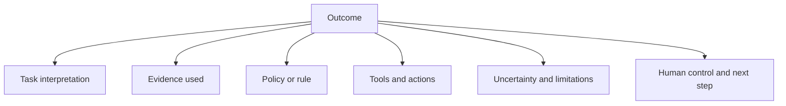

### 4.1 Task interpretation

State what the system believed the user wanted. This is especially important when the request was ambiguous.

### 4.2 Evidence

Show the approved documents, records, or tool observations that support the result. Evidence should include version and date where freshness matters.

### 4.3 Policy or decision rule

Identify the policy condition, threshold, workflow rule, or business constraint that shaped the action.

### 4.4 Tool and action history

For action-taking agents, disclose the relevant external systems checked and any state-changing operations performed.

### 4.5 Uncertainty and limitations

Distinguish:

- missing evidence;
- conflicting evidence;
- low-confidence classification;
- unavailable tool;
- out-of-scope request;
- human judgment still required.

### 4.6 User control

Explain whether the user can edit, retry, approve, reject, reset, or escalate.

---

## 5. Do not expose private chain-of-thought

Useful explanations do not require revealing hidden internal reasoning. Internal reasoning traces can be unreliable, overly verbose, sensitive, or vulnerable to manipulation. A safer design provides a concise rationale derived from observable system records.

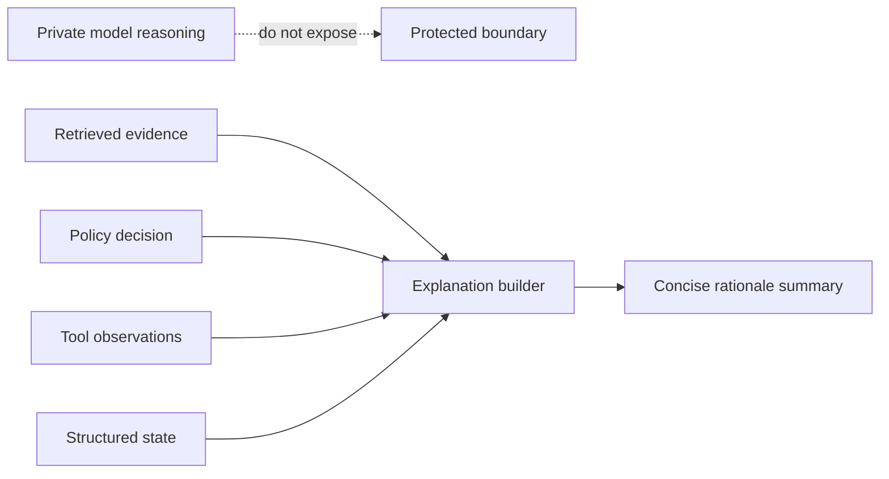

Prefer:

> "The ticket was escalated because the customer is blocked, the affected service is production, and the incident policy classifies this combination as severity 1. Sources: ticket fields and incident policy v4.2."

Avoid presenting a long internal monologue as if it were authoritative evidence.

> **Best practice**
>
> Explain observable reasons: inputs, evidence, rules, actions, uncertainty, and controls. Do not equate verbosity with transparency.

---

## 6. Explanation packets

A structured explanation packet makes explanations reproducible across channels.

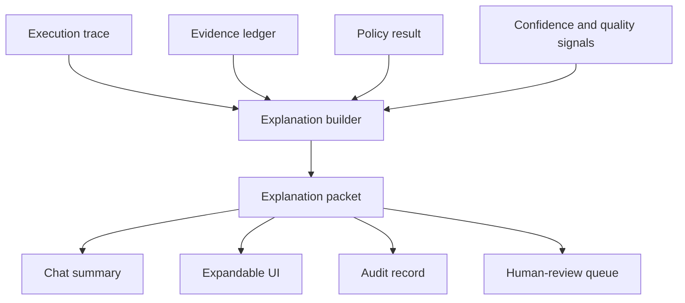

Example schema:

```json
{
  "outcome": "escalate_to_incident_team",
  "task_interpretation": "Classify and route a production support incident",
  "reasons": [
    "Customer is blocked",
    "Production environment is affected",
    "Multiple users are impacted"
  ],
  "evidence": [
    {
      "source_id": "ticket-8472",
      "source_type": "support_ticket",
      "version": "12",
      "summary": "Production login failure affecting 23 users"
    },
    {
      "source_id": "incident-policy",
      "version": "4.2",
      "summary": "Blocked production incidents affecting multiple users are severity 1"
    }
  ],
  "tools_used": ["ticket_reader", "policy_retriever"],
  "uncertainty": "low",
  "human_control": "Incident manager may reclassify severity",
  "appeal_or_correction": "Update ticket impact fields or request incident-manager review"
}
```

A packet should be generated from the actual trace. It should not be a separate model response with no connection to execution.

---

## 7. Faithful explanations versus plausible explanations

A plausible explanation sounds convincing. A faithful explanation reflects the system's actual causal or procedural basis.

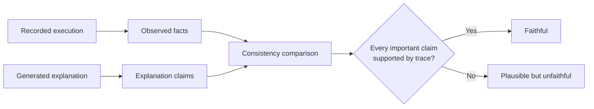

Tests for explanation faithfulness include:

1. **Trace consistency:** Does the explanation mention only evidence and actions that occurred?
2. **Policy consistency:** Is the stated rule the rule that actually fired?
3. **Counterfactual sensitivity:** If a decisive input changes, does the explanation and outcome change appropriately?
4. **Omission analysis:** Does the explanation omit a critical adverse factor?
5. **Stability:** Do repeated explanations remain materially consistent for the same execution trace?
6. **Provenance coverage:** Can each evidence claim be linked to a source record?

### Explanation evaluation rubric

| Dimension | Question |
|---|---|
| Accuracy | Does it describe the real workflow and evidence? |
| Completeness | Does it include all material reasons? |
| Relevance | Does it focus on what the audience needs? |
| Clarity | Can the intended audience understand it? |
| Actionability | Does it show correction, appeal, or next steps? |
| Privacy | Does it avoid exposing secrets or unrelated personal data? |
| Stability | Is it consistent under equivalent conditions? |

---

## 8. Where bias enters an agentic system

Bias is not limited to training data. It can enter at every stage.

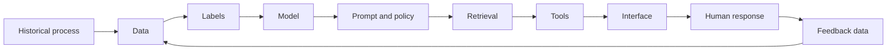

### 8.1 Historical bias

Historical outcomes may reflect unequal access, inconsistent enforcement, or previous human discrimination.

### 8.2 Representation bias

Some languages, regions, job families, document formats, or user behaviors may be underrepresented.

### 8.3 Label bias

Human labels may encode inconsistent standards. For example, "difficult customer" or "high potential" may be subjective and unevenly applied.

### 8.4 Measurement bias

A proxy may not measure the intended construct equally across groups. Response length is not a reliable proxy for issue complexity.

### 8.5 Retrieval bias

The knowledge base may cover one geography, language, or product line better than another. Embeddings may retrieve high-quality evidence for one phrasing but not another.

### 8.6 Prompt and policy bias

Examples, role instructions, thresholds, or escalation rules can systematically favor one style of communication or one user context.

### 8.7 Tool bias

External APIs may have incomplete records or different service levels across regions or customer segments.

### 8.8 Interaction bias

The interface may demand a level of literacy, language fluency, accessibility, or technical confidence that not all users share.

### 8.9 Automation bias

Humans may over-trust an AI recommendation, especially when the explanation appears confident.

### 8.10 Feedback-loop bias

If only accepted recommendations become future training examples, the system may reinforce its own prior decisions.

---

## 9. Fairness begins with a harm model

There is no universal fairness metric. A team must define:

- the decision or service being evaluated;
- who may be affected;
- the relevant groups and intersections;
- the possible benefits and harms;
- whether errors are symmetric;
- whether the action is reversible;
- the acceptable human-review path.

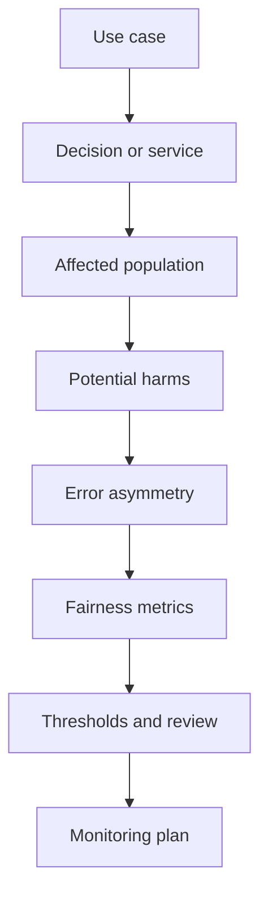

### Example: support triage

Possible harms include:

- urgent cases routed too slowly;
- routine cases escalated unnecessarily;
- one language group experiencing more misclassification;
- one customer segment receiving fewer useful explanations;
- accessibility-related requests being interpreted as low priority;
- slower tool calls or more failures for a region.

The fairness objective is not necessarily equal priority rates. Different tickets have different legitimate severity. A more appropriate objective may be comparable false-negative rates for truly urgent tickets, comparable escalation quality, and comparable time to resolution after controlling for relevant facts.

---

## 10. Fairness metrics

Metrics must be matched to the decision and harm model.

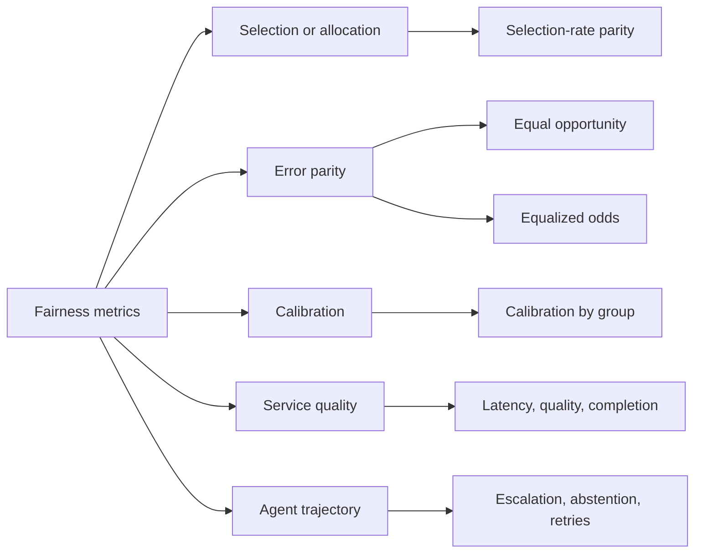

### 10.1 Selection-rate parity

Compares the rate at which groups receive a positive decision or resource. This can be useful for allocation systems but may be inappropriate when legitimate base rates differ and the positive outcome is not clearly beneficial.

### 10.2 Equal opportunity

Compares true-positive rates across groups. It asks whether qualified or truly positive cases are detected at similar rates.

### 10.3 Equalized odds

Compares both true-positive and false-positive rates. It is stricter and can conflict with calibration when group base rates differ.

### 10.4 Predictive parity

Compares positive predictive value: when the system predicts positive, how often is it correct for each group?

### 10.5 Calibration

A score is calibrated when cases assigned a given probability have approximately that outcome frequency. Calibration should be examined by group and score range.

### 10.6 Error-rate parity

Compares false negatives, false positives, or other errors directly. For safety-critical triage, false-negative parity may matter more than aggregate accuracy.

### 10.7 Abstention and escalation parity

Agentic systems can decline or escalate. Teams should measure whether some groups are disproportionately sent to manual review, denied service, or asked for additional information.

### 10.8 Service-quality parity

Measure differences in:

- task completion;
- evidence quality;
- citation coverage;
- explanation usefulness;
- latency;
- retries;
- tool failures;
- human-review wait time;
- successful correction or appeal.

> **Common mistake**
>
> Reporting only output parity can hide unequal service quality. Two groups may receive the same final decision rate while one experiences more failures, longer waits, and weaker explanations.

---

## 11. Fairness trade-offs

Some fairness criteria cannot all be satisfied simultaneously under realistic conditions. Teams must make an explicit, documented choice based on the harm model.

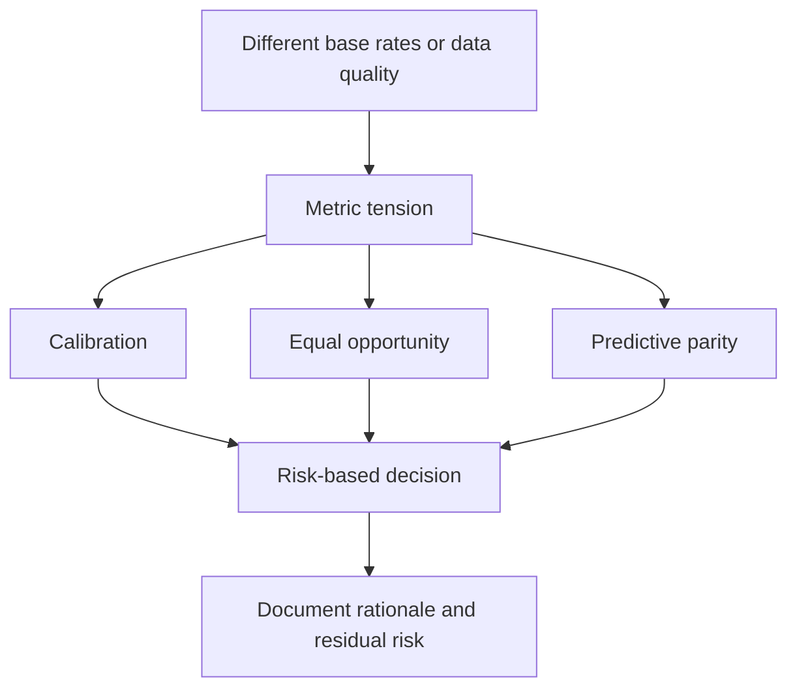

The correct response to metric tension is not to select the number that looks best. It is to:

1. identify the affected decision;
2. identify the more harmful error;
3. consider legal and policy constraints;
4. examine whether data quality causes the disparity;
5. choose a mitigation and review path;
6. document residual risk and accountable ownership.

---

## 12. Counterfactual testing

Counterfactual testing changes a group-associated attribute while holding task-relevant facts constant.

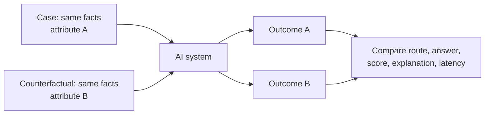

Example:

- keep the support issue, impact, and account history constant;
- vary language style, name, pronouns, region, or accessibility-related phrasing only where testing is lawful and appropriate;
- compare classification, evidence retrieval, escalation, explanation tone, and latency.

Counterfactual tests are valuable but incomplete. They may miss structural differences in real data and can create unrealistic cases. Use them alongside real cohort analysis and expert review.

### Good counterfactual test properties

- one intended variable changes;
- task-relevant facts remain fixed;
- the expected invariant is explicit;
- the test covers the full workflow;
- sensitive test data is governed and access-controlled;
- the result is reviewed for both statistical and practical significance.

---

## 13. Intersectional analysis and small groups

Single-axis comparisons can hide concentrated harm. A system may perform adequately by language and by region separately but poorly for users in the intersection of a particular language and region.

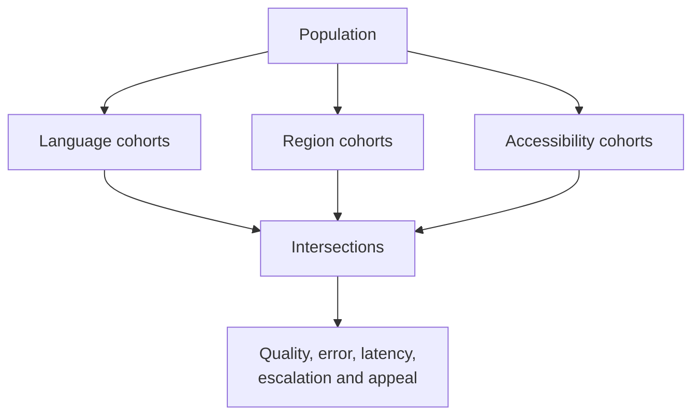

Challenges include:

- small sample sizes;
- unstable rates;
- privacy risk;
- multiple-comparison errors;
- difficulty defining meaningful groups;
- missing or self-reported attributes.

Mitigations include:

- confidence intervals;
- minimum sample thresholds;
- hierarchical or pooled analysis;
- longer monitoring windows;
- qualitative review;
- privacy-preserving aggregation;
- explicit "insufficient evidence" labels rather than false certainty.

> **Privacy note**
>
> Fairness measurement may require sensitive attributes, but collecting them can create risk. Use purpose limitation, minimum necessary collection, access controls, retention limits, and legal review.

---

## 14. Fairness in RAG systems

RAG introduces distinct fairness risks.

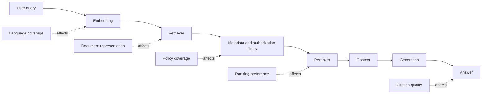

Evaluate by cohort:

- retrieval recall;
- evidence relevance;
- source freshness;
- source authority;
- citation coverage;
- answerability and abstention;
- latency;
- unsupported-claim rate.

### Example failure

A global HR assistant may retrieve strong policy evidence for English questions but weak or outdated evidence for translated questions. The generation model may still produce fluent answers, hiding the retrieval disparity.

A useful control is to expose evidence sufficiency and require abstention or human review when coverage is weak.

---

## 15. Fairness in agent trajectories

Agent fairness must be evaluated across the sequence of actions, not only the final answer.

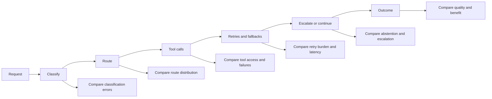

Questions include:

- Are some groups routed to less capable agents?
- Do some languages trigger more clarification turns?
- Are tool failures concentrated by region?
- Are certain users escalated to human review more often?
- Do approval queues create unequal waiting times?
- Are explanations less detailed for some channels?
- Are correction requests accepted consistently?

Trajectory analysis often reveals harms that final-output metrics miss.

---

## 16. Mitigation strategies

Mitigation should target the system layer causing the problem.

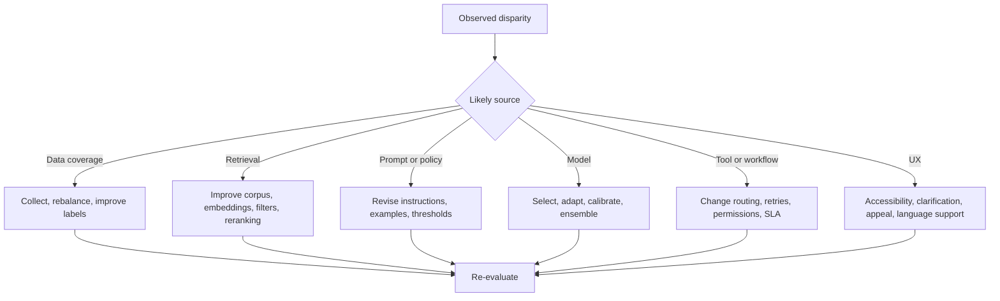

### 16.1 Data and label mitigations

- improve representation;
- remove duplicated or poisoned records;
- create clearer annotation guidance;
- measure annotator disagreement;
- relabel ambiguous cases;
- separate policy labels from historical outcomes.

### 16.2 Retrieval mitigations

- add missing authoritative sources;
- improve multilingual indexing;
- use hybrid retrieval;
- evaluate per-cohort recall;
- add metadata and freshness filters;
- abstain when evidence is insufficient.

### 16.3 Prompt and policy mitigations

- remove stereotypes from examples;
- make task-relevant criteria explicit;
- neutralize leading wording;
- separate sensitive attributes from decision inputs where appropriate;
- add consistency and evidence checks.

### 16.4 Model mitigations

- choose a better-performing model for affected languages or formats;
- calibrate thresholds by validated risk policy;
- use domain adaptation where justified;
- use an ensemble or fallback;
- constrain structured outputs.

### 16.5 Workflow mitigations

- add human review for uncertain high-impact cases;
- reduce unequal retry burden;
- route affected cases to specialized support;
- enforce the same evidence and approval standards across routes;
- monitor service-level objectives by cohort.

### 16.6 UX mitigations

- allow users to correct misunderstood facts;
- make clarification questions accessible;
- provide multilingual and assistive support;
- show evidence and uncertainty;
- provide appeal and escalation paths.

---

## 17. Human review, correction, and appeal

Fairness controls should not assume the automated system will always be right.

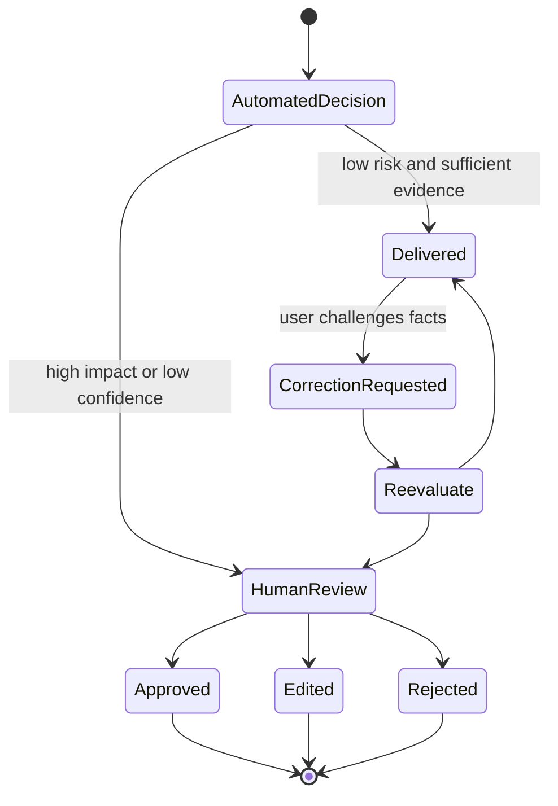

A review experience should provide:

- the original request and context;
- the proposed outcome;
- evidence and policy basis;
- uncertainty;
- relevant prior actions;
- exact editable fields;
- approve, reject, modify, and request-more-information actions;
- reason codes;
- audit trail;
- service-level target.

Reviewers should be trained not to rubber-stamp the system. Human override rates and patterns should be evaluated by group and reviewer.

---

## 18. Explainability in the application layer

The board emphasizes that the application layer shapes trust through transparency, confidence, source views, action history, and user control. Explainability should therefore be designed as an interaction, not a static paragraph.

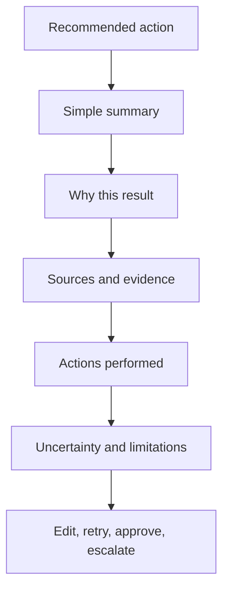

### Progressive disclosure

Show the minimum useful explanation first, then allow expansion.

**Level 1: outcome**

> Recommended priority: High.

**Level 2: key reasons**

> Customer is blocked and production access is unavailable.

**Level 3: evidence**

> Ticket fields, service-health API, and incident policy v4.2.

**Level 4: trace**

> Classification, policy lookup, tool results, and review history.

This avoids overwhelming the user while preserving access to detail.

### Confidence language

Do not show a confidence percentage unless it is meaningful and calibrated. Alternatives include:

- evidence complete / partial / conflicting;
- policy match clear / ambiguous;
- tool results verified / unavailable;
- human review required / optional.

---

## 19. Governance and accountability

Fairness and explainability require named ownership.

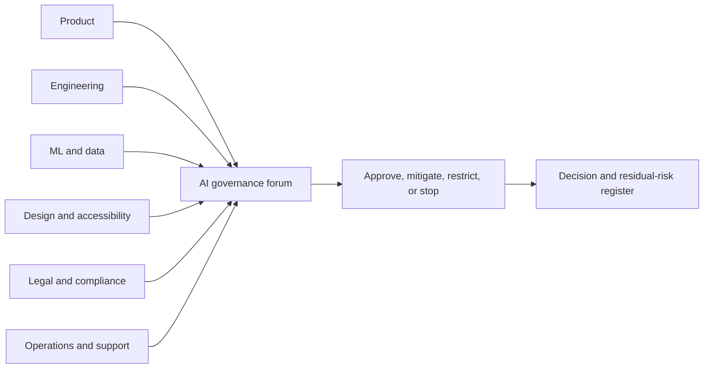

### Product responsibilities

- define affected users and harms;
- make acceptance criteria measurable;
- ensure correction and appeal paths;
- track user trust and service quality;
- decide whether automation is appropriate.

### Engineering responsibilities

- preserve provenance and traceability;
- implement policy and access controls;
- instrument cohort-aware metrics;
- make changes reproducible and reversible.

### Data and ML responsibilities

- document datasets and model limitations;
- evaluate cohorts and intersections;
- calibrate metrics and thresholds;
- investigate drift and disparity.

### Design responsibilities

- make explanations understandable;
- avoid dark patterns;
- support accessibility and multilingual use;
- expose meaningful user control.

### Legal, compliance, and risk responsibilities

- determine applicable obligations;
- review sensitive-attribute handling;
- define documentation and retention requirements;
- assess residual risk.

---

## 20. Continuous fairness monitoring

Pre-release evaluation is necessary but insufficient. User populations, documents, tools, policies, and model behavior change.

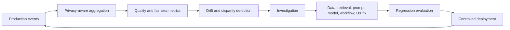

Monitor:

- outcome and error rates;
- escalation and abstention;
- retrieval evidence quality;
- latency and failure rate;
- correction and appeal success;
- human override;
- explanation coverage;
- policy violations;
- cohort sample size and confidence intervals.

### Alerts should consider

- practical significance, not only statistical significance;
- sustained trends, not one noisy window;
- high-impact rare failures;
- changes in group composition;
- missing group data;
- privacy minimums.

### Incident response

When a material disparity appears:

1. contain high-risk automation;
2. preserve traces and versions;
3. validate the measurement;
4. identify the affected population and time window;
5. diagnose the system layer;
6. provide remediation or review for affected cases where possible;
7. implement and regression-test the fix;
8. document residual risk and lessons learned.

---

## 21. Worked example: support-triage fairness audit

Consider an agent that classifies support tickets as urgent or routine, retrieves policy, and routes urgent tickets to an incident team.

```mermaid
flowchart LR
    T[Ticket] --> C[Urgency classifier]
    C --> R[Policy retrieval]
    R --> V[Evidence validation]
    V --> D{Urgent?}
    D -->|Yes| INC[Incident queue]
    D -->|No| SUP[Standard support]
    INC --> X[Explanation packet]
    SUP --> X
    X --> MON[Outcome and fairness monitor]
```

### Audit questions

1. Does urgent-case recall differ by language group?
2. Does retrieval return equally authoritative policy evidence?
3. Are some groups asked more clarification questions?
4. Does latency differ because of translation or region-specific tools?
5. Are false escalations concentrated in a communication style?
6. Are explanations equally complete and actionable?
7. Are correction requests resolved consistently?

### Example findings

| Finding | Likely layer | Mitigation |
|---|---|---|
| Lower urgent recall for short non-native English tickets | Data and prompt | Add representative examples and explicit impact extraction |
| Weaker policy retrieval for translated queries | Retrieval | Multilingual embeddings, hybrid search, translated index fields |
| More manual reviews in one region | Tool and policy | Investigate data availability and region-specific approval rules |
| Lower explanation coverage in mobile channel | Application layer | Use the same explanation packet with channel-specific rendering |

### Release decision

The team should not rely on overall accuracy. A release gate can require:

- minimum urgent recall for every sufficiently sized cohort;
- maximum recall gap;
- evidence coverage threshold;
- no unauthorized use of sensitive attributes;
- explanation completeness threshold;
- human review for unresolved high-impact cases.

---

## 22. Implementation architecture

A practical fairness and explanation subsystem sits beside the main agent workflow.

```mermaid
flowchart TB
    REQ[Request] --> AGENT[Agent workflow]
    AGENT --> TRACE[Structured trace]
    AGENT --> OUT[Outcome]

    TRACE --> EXB[Explanation builder]
    OUT --> EXB
    EXB --> PACK[Explanation packet]

    TRACE --> FE[Fairness event builder]
    OUT --> FE
    FE --> STORE[(Privacy-aware metrics store)]
    STORE --> AUDIT[Fairness audit]
    AUDIT --> GATE[Release or incident gate]

    PACK --> UI[User and reviewer UI]
    GATE --> GOV[Governance owner]
```

### Event design

A fairness event should avoid raw sensitive content where possible. It may contain:

- case ID or pseudonymous reference;
- model, prompt, policy, and tool versions;
- relevant cohort attributes under approved governance;
- ground-truth label when available;
- prediction and confidence;
- route and escalation result;
- latency and retry count;
- evidence-quality indicators;
- explanation completeness;
- appeal or correction outcome.

---

## 23. Hands-on lab

The accompanying Python example implements a small fairness and explainability audit for a synthetic support-triage system.

It demonstrates:

- typed evaluation records;
- confusion-matrix metrics by group;
- true-positive, false-positive, false-negative, and precision rates;
- service-quality metrics such as explanation coverage and latency;
- pairwise gap calculation;
- counterfactual consistency checks;
- a release gate with hard minimums;
- structured explanation packets;
- a machine-readable audit report.

Run:

```bash
python examples/25-explainability-fairness/fairness_explainability_audit.py
```

The example uses synthetic groups and cases. Production use requires privacy, legal, statistical, and domain review.

---

## 24. Production checklist

### Purpose and scope

- [ ] The decision, service, affected population, and harm model are documented.
- [ ] Sensitive attributes are collected only when justified and governed.
- [ ] Unsupported uses are explicitly prohibited.

### Explainability

- [ ] Explanations are generated from trace, evidence, policy, and tool records.
- [ ] Audience-specific views are defined.
- [ ] Internal private reasoning is not exposed.
- [ ] Evidence provenance and freshness are visible.
- [ ] Uncertainty and limitations are communicated.
- [ ] Correction, appeal, and human-review paths exist.
- [ ] Explanation faithfulness is tested.

### Fairness evaluation

- [ ] Relevant groups and intersections are defined with domain experts.
- [ ] Metrics match the harm model.
- [ ] Error, escalation, abstention, service quality, and latency are measured.
- [ ] RAG evidence quality is measured by cohort.
- [ ] Agent trajectories are evaluated, not only final outputs.
- [ ] Counterfactual tests are included where appropriate.
- [ ] Small-sample uncertainty and privacy are handled explicitly.

### Mitigation and governance

- [ ] Disparities are diagnosed at the correct system layer.
- [ ] Mitigations are regression-tested.
- [ ] Human reviewers receive adequate context and training.
- [ ] Residual risk has an accountable owner.
- [ ] Release gates contain hard constraints for high-impact failures.
- [ ] Production monitoring and incident response are defined.

---

## 25. Knowledge checks

1. Why is a persuasive explanation not necessarily a faithful explanation?
2. How do transparency, explainability, auditability, and contestability differ?
3. What information belongs in an explanation packet?
4. Why should internal chain-of-thought not be used as the primary user explanation?
5. Name five system layers where bias can enter an agentic application.
6. Why is overall accuracy insufficient for fairness evaluation?
7. When is equal opportunity more relevant than selection-rate parity?
8. What does counterfactual testing reveal, and what can it miss?
9. Why should RAG fairness include retrieval and evidence metrics?
10. What trajectory-level fairness metrics are useful for agents?
11. Why can human review preserve rather than remove bias?
12. What privacy risks arise from fairness measurement?
13. How should small intersectional cohorts be handled?
14. What should happen when a high-impact disparity is detected in production?

---

## 26. Interview questions

### Foundational

1. Explain the difference between model interpretability and system explainability.
2. What makes an explanation faithful?
3. What is demographic parity, and when can it be misleading?
4. Explain equal opportunity and equalized odds.
5. What is calibration by group?
6. What is counterfactual fairness testing?

### Intermediate

1. Design an explanation packet for an agent that recommends a supplier.
2. How would you audit a multilingual RAG assistant for fairness?
3. Which metrics would you use for a support-triage agent, and why?
4. How would you detect unequal escalation burden across user groups?
5. How would you distinguish a model problem from a retrieval problem?
6. How would you measure explanation faithfulness?
7. What are the risks of using a model as a fairness judge?

### Senior and system design

1. Design a fairness-monitoring architecture for an enterprise agent platform.
2. How would you collect sensitive attributes while minimizing privacy risk?
3. A system is calibrated across groups but has different false-negative rates. How would you decide what to optimize?
4. How would you create a release gate for a high-impact HR assistant?
5. How would you prevent an explanation layer from fabricating reasons after the fact?
6. How would you test fairness across a multi-agent trajectory with dynamic routing?
7. When should automation be restricted or removed rather than mitigated?
8. How would you investigate a production disparity when ground truth arrives weeks later?

---

## 27. Summary

Explainability and fairness are properties of the complete AI product, not isolated model features. Explanations should be assembled from real evidence, policy decisions, tool observations, state, and controls. They should be tailored to the audience, protect private reasoning and sensitive data, and support correction and appeal.

Fairness begins with a use-case-specific harm model. No single metric is universally correct. Teams must measure relevant errors, service quality, escalation, abstention, latency, evidence quality, and human-review outcomes across meaningful groups and intersections. Agentic systems require trajectory-level analysis because routing, retrieval, tool failures, retries, and approvals can distribute harm even when final outputs appear balanced.

The most effective mitigation targets the system layer that creates the disparity: data, labels, retrieval, prompts, model, tools, workflow, or UX. Product, engineering, data, design, operations, legal, and compliance teams share responsibility. Continuous monitoring, strong release gates, human control, and accountable incident response turn explainability and fairness from abstract principles into operational practice.
