# Chapter 27 - Application Layer and Agent UX

> **Source basis:** The board describes the application layer as the part of the system responsible for authentication, session handling, response rendering, feedback, telemetry, simplified output, multi-channel interaction, source visibility, confidence, retry patterns, and user controls such as edit, approve, interrupt, reset, and escalate. It also contrasts weak opaque answers with richer, evidence-backed results and identifies task success, latency, retries, satisfaction, abandonment, trust, and escalation as important UX metrics [Board, pp. 28-29]. This chapter preserves those concepts and expands them into a complete design and engineering discipline for agentic products. Material on interaction contracts, progressive disclosure, action previews, accessibility, frontend-backend event protocols, and the reference implementation is **Supplementary**.

---

## Learning objectives

By the end of this chapter, you should be able to:

1. Explain why the application layer is a safety and control surface, not merely a visual shell.
2. Distinguish chatbot UX from workflow and agent UX.
3. Choose between chat, form, and hybrid interaction modes.
4. Design transparent result cards that expose evidence, uncertainty, and action history without overwhelming the user.
5. Represent planning, tool use, approvals, progress, and recovery as understandable interface states.
6. Design safe confirmation and approval experiences for consequential actions.
7. Apply interrupt, reset, abort, retry, edit, and escalation controls correctly.
8. Connect frontend telemetry to agent traces and business outcomes.
9. Define UX metrics for performance, trust, user control, satisfaction, and error recovery.
10. Design accessible, multilingual, permission-aware, and multi-channel agent experiences.
11. Test agent UX with happy paths, ambiguity, tool failures, safety attempts, and long-running tasks.
12. Implement a dependency-free interaction controller that manages visible state, approvals, feedback, and UX metrics.

---

## 1. The application layer is part of the agent system

A user does not experience the model, retriever, tool gateway, or orchestration graph directly. The user experiences the application layer that frames the request, displays progress, asks for clarification, presents evidence, requests approval, and handles failure.

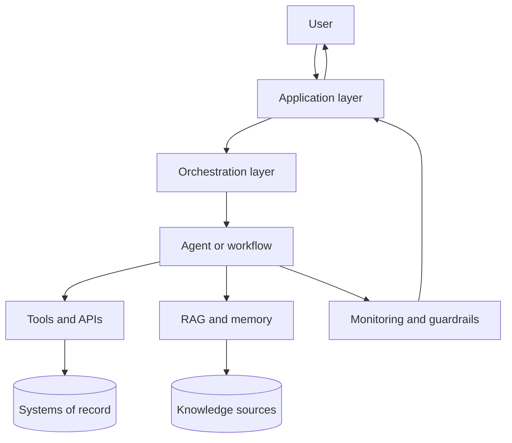

The application layer determines whether an autonomous system feels:

- understandable or mysterious;
- controlled or unpredictable;
- trustworthy or careless;
- efficient or frustrating;
- recoverable or brittle.

A technically capable agent can still fail as a product when the interface hides uncertainty, gives no indication of progress, performs actions without a preview, or offers no way to correct a misunderstanding.

> **Key principle**
>
> Agent UX is the design of a human-control loop around probabilistic reasoning and real-world action.

The application layer should therefore be designed alongside orchestration, state, guardrails, and evaluation—not added after the backend is complete.

---

## 2. Chatbot UX and agent UX are different

A basic chatbot accepts a message and returns text. An agent may plan, retrieve, call tools, wait for approvals, update state, recover from errors, and continue over time.

| Capability | Basic chatbot | Agentic application |
|---|---|---|
| Input | Mostly free text | Chat, forms, files, selections, confirmations |
| Execution | One model response | Multi-step workflow with tools and state |
| Duration | Usually seconds | Seconds, minutes, or asynchronous completion |
| Visibility | Typing indicator | Plan, progress, tool status, evidence, approvals |
| User control | Send another message | Edit, approve, interrupt, retry, reset, abort, escalate |
| Output | Text answer | Result, evidence, action summary, downloadable artifact |
| Failure | Error message | Partial result, fallback, retry, clarification, human handoff |
| Trust | Tone and fluency | Evidence, permissions, history, reversibility, control |

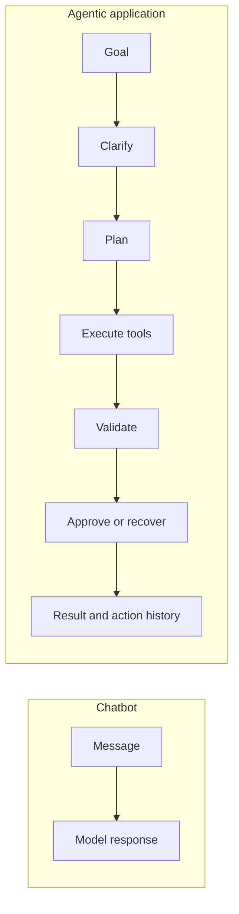

The interface should reveal the parts of the workflow that matter to the user while hiding implementation noise. Showing every token, internal prompt, or raw tool payload is not transparency. It is clutter and may disclose sensitive information. Useful transparency focuses on:

- what the system understood;
- what sources or systems it used;
- what action it proposes or completed;
- what remains uncertain;
- what the user can do next.

---

## 3. Start with the user goal and interaction contract

An agent experience should begin with a clear interaction contract. The contract states what the application can do, what information it needs, what actions require approval, and what the user will receive.

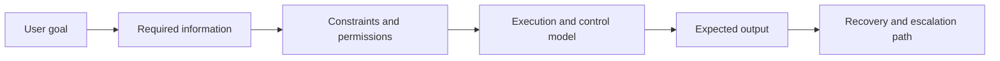

A good contract answers:

1. **Goal:** What job is the user trying to complete?
2. **Inputs:** Which facts, files, or selections are required?
3. **Capabilities:** Which data sources and actions are available?
4. **Boundaries:** What will the agent not do?
5. **Control:** Which steps are automatic and which need approval?
6. **Output:** What result or artifact will be produced?
7. **Recovery:** What happens when information or a tool is unavailable?

For example, a supplier recommendation application might state:

> Compare approved suppliers using quoted price, delivery date, and historical quality. The application can read supplier records and draft a recommendation. It cannot place an order without procurement approval.

This short statement reduces ambiguity and prevents users from assuming capabilities that do not exist.

---

## 4. Choose the right interaction mode

The board identifies three common modes: chat, form-fill, and hybrid interaction [Board, p. 29]. Each is appropriate for a different kind of task.

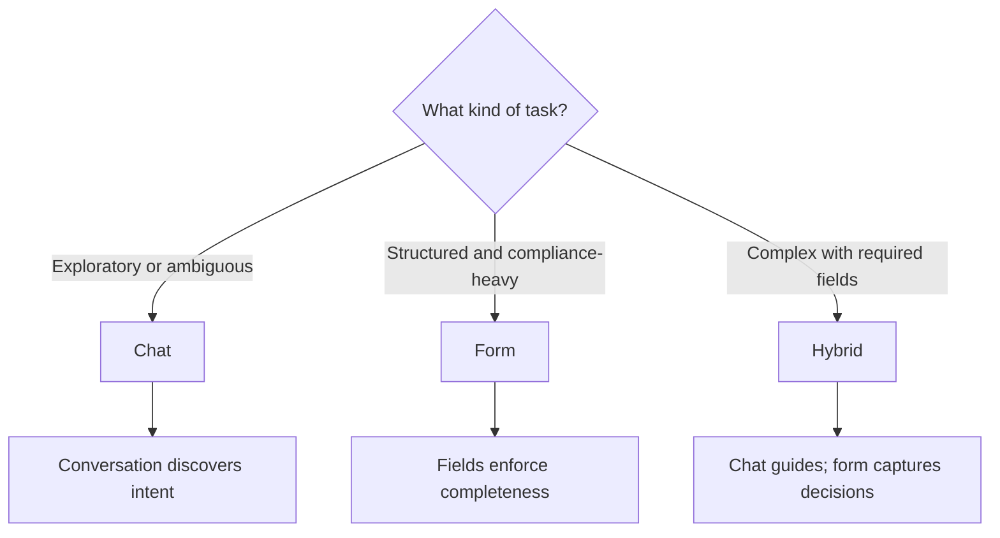

### 4.1 Chat

Use chat when the user is exploring, does not know the exact request structure, or needs iterative explanation.

Examples:

- “What are the most common customer pain points?”
- “Help me understand why this project is delayed.”
- “Compare these architecture options.”

Strengths:

- natural and flexible;
- useful for discovery;
- supports follow-up questions;
- handles incomplete initial intent.

Risks:

- required information may be omitted;
- users may believe fluent text is authoritative;
- consequential actions can be hidden inside casual language;
- long conversations can make state unclear.

### 4.2 Form-fill

Use a form when inputs are known, validation matters, or the workflow is regulated.

Examples:

- expense claim;
- employee onboarding;
- access request;
- supplier approval;
- regulatory submission.

Strengths:

- explicit required fields;
- deterministic validation;
- clear review and approval;
- easier auditing.

Risks:

- rigid experience;
- poor fit for ambiguous goals;
- users may not understand what to enter;
- complex forms create abandonment.

### 4.3 Hybrid

A hybrid interface uses conversation to understand the goal and structured controls to capture critical facts.

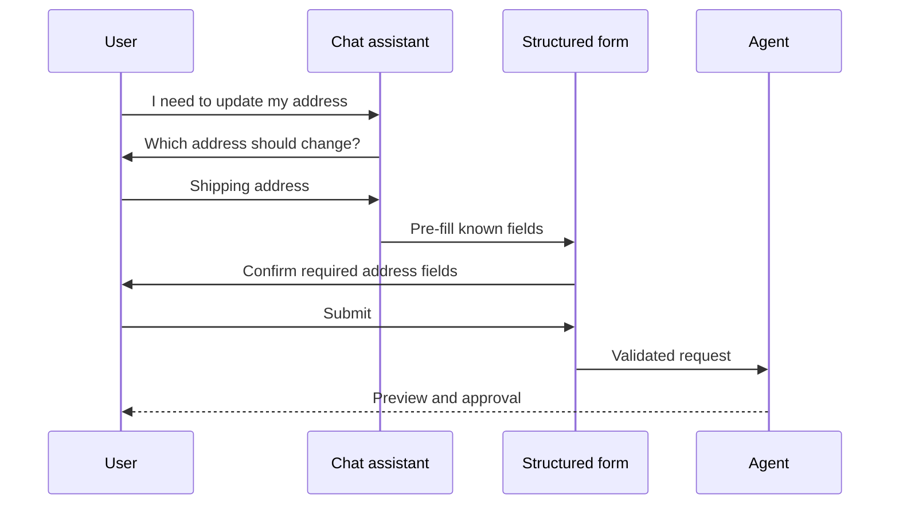

Hybrid interaction is often the strongest default for enterprise agents because it combines natural language with explicit controls.

---

## 5. Application-layer responsibilities

The board highlights authentication, session management, rendering, feedback, and telemetry as core responsibilities [Board, p. 28]. In production, these responsibilities form a control surface around the agent.

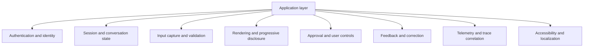

### 5.1 Authentication and identity

The interface must establish who the user is and pass identity context to the orchestration layer. Identity should not be inferred from conversation text.

The application should display meaningful permission boundaries. For example:

- “You can view your own payroll information.”
- “Manager approval is required to change compensation.”
- “This source is unavailable for your role.”

### 5.2 Session and state

The interface should make state visible enough for the user to understand continuity:

- current task;
- selected files or records;
- pending approval;
- previous completed actions;
- whether the session is paused, resumed, or reset.

The user should not need to guess whether the agent remembers a prior decision.

### 5.3 Input capture and validation

Use deterministic controls for required, typed, or sensitive data:

- date pickers instead of free-text dates;
- record selectors instead of guessed identifiers;
- explicit scopes for file or folder access;
- confirmation for target account, employee, or order;
- visible validation errors before execution.

### 5.4 Rendering

Raw agent output is rarely the ideal user output. The application should transform backend events into task-oriented components:

- summaries;
- tables;
- comparison cards;
- cited evidence;
- confidence or uncertainty indicators;
- action previews;
- completion receipts;
- downloadable reports.

### 5.5 Feedback

Feedback must be actionable. A thumbs-down alone rarely explains what failed. Better feedback controls allow users to identify:

- incorrect fact;
- missing source;
- wrong interpretation;
- unsafe or inappropriate action;
- poor formatting;
- failed tool or stale data.

### 5.6 Telemetry

Frontend events must correlate with backend workflow traces using stable identifiers such as:

- session ID;
- workflow ID;
- request ID;
- action ID;
- approval ID;
- trace ID.

This connection allows teams to answer whether a user abandoned because of latency, confusion, a tool failure, or an incorrect result.

---

## 6. Design the visible agent state machine

Users should see a small set of understandable states rather than an unstructured stream of backend logs.

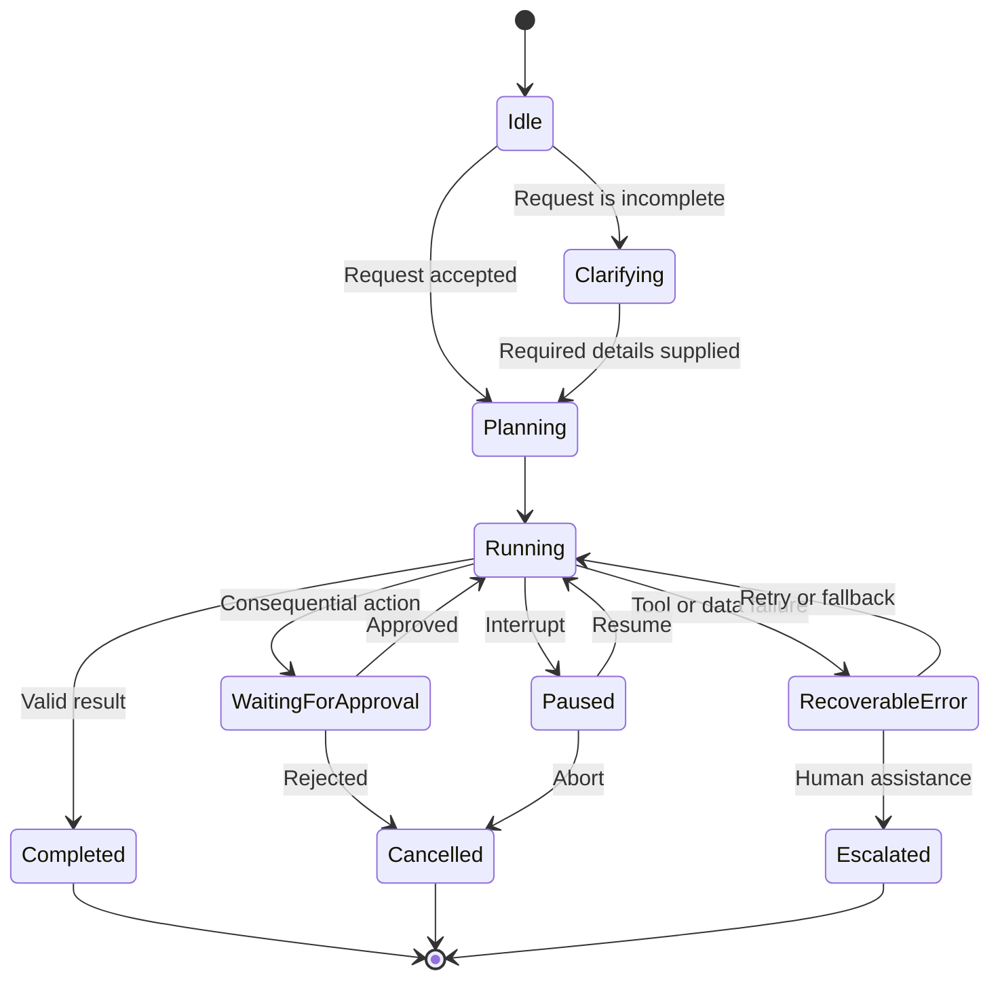

Recommended user-facing states include:

- **Understanding your request**
- **Waiting for required information**
- **Planning the task**
- **Checking approved sources**
- **Comparing results**
- **Waiting for your approval**
- **Recovering from a service error**
- **Completed with partial information**
- **Escalated to a human reviewer**

Avoid technical labels such as “node_7 executing” or “LLM tool-call round 4.” The interface can store those details in diagnostics while showing language aligned with the user’s goal.

---

## 7. Show progress without pretending certainty

Long-running workflows need progress communication. A spinner gives no evidence that useful work is occurring, while a precise percentage may be misleading when the workflow can branch or replan.

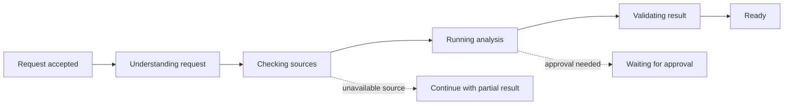

Useful progress design includes:

- named phases rather than invented percentages;
- completed, active, waiting, and skipped steps;
- explicit reasons for waiting;
- partial results when safe;
- estimated ranges only when based on historical data;
- a visible cancel or interrupt control.

Streaming can improve perceived latency, but teams should distinguish:

- **text streaming**, which shows generated content;
- **event streaming**, which shows meaningful workflow progress;
- **artifact streaming**, which progressively renders a table, report, or comparison.

For agentic products, event streaming is usually more valuable than exposing raw token generation.

---

## 8. Progressive disclosure

The board recommends simplified output, evidence highlighting, citations, confidence, step summaries, and progressive disclosure [Board, pp. 28-29]. Progressive disclosure presents the most important result first and lets users inspect supporting detail.

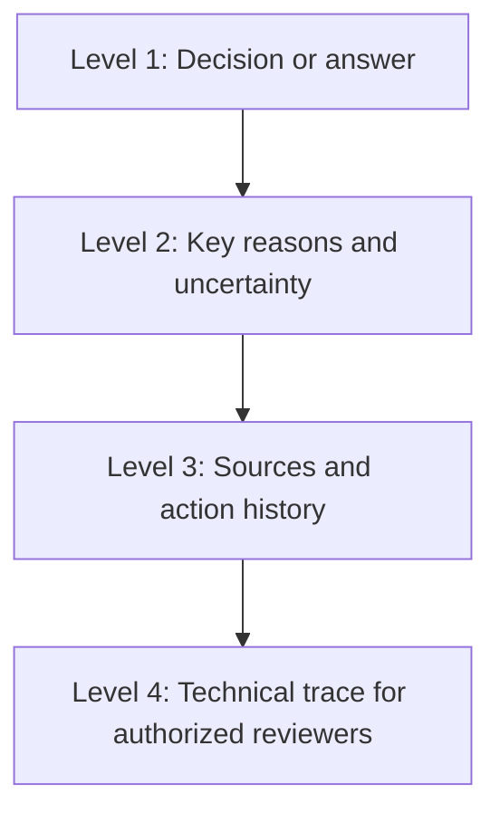

A result card can contain:

1. **Outcome:** The answer, recommendation, or completed action.
2. **Why:** The two or three most material reasons.
3. **Confidence or uncertainty:** What is known and what remains unresolved.
4. **Sources checked:** Human-readable provenance.
5. **Actions taken:** Tools or systems that changed state.
6. **Next actions:** Approve, edit, compare, retry, or escalate.

### Weak result

> The best supplier is Supplier A.

### Better result

> **Recommended supplier: Supplier A**
>
> **Why**
> - Lowest approved quote among three suppliers
> - Delivery date meets the requested milestone
> - Historical quality score is above the procurement threshold
>
> **Uncertainty:** Medium. The latest capacity confirmation is 48 hours old.
>
> **Sources checked:** Approved supplier table, delivery-estimate API, historical quality record
>
> **Next:** Compare suppliers, request refreshed capacity, or send for procurement approval

The richer result is not merely more verbose. It supports verification and action.

---

## 9. Design evidence and grounding into the interface

Citations are useful only when users can understand and inspect them.

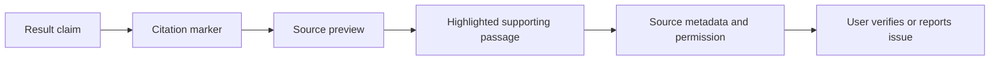

Effective evidence UX should:

- connect each important claim to the relevant source;
- show the source title, owner, date, and version;
- highlight the passage or record field that supports the claim;
- distinguish retrieved evidence from model inference;
- show when a source is unavailable or access-restricted;
- avoid implying certainty from irrelevant citations;
- allow users to report stale or incorrect evidence.

> **Common mistake**
>
> Displaying a long list of sources at the bottom of a response without showing which claim each source supports creates the appearance of grounding without useful traceability.

For transactional workflows, evidence also includes system receipts:

- order ID;
- ticket ID;
- updated field names;
- timestamp;
- approval identity;
- before-and-after values.

---

## 10. Confidence and uncertainty

A numeric confidence value is not automatically meaningful. It may represent model probability, retrieval coverage, rule-based confidence, or a product-specific score. The interface must define what the signal means.

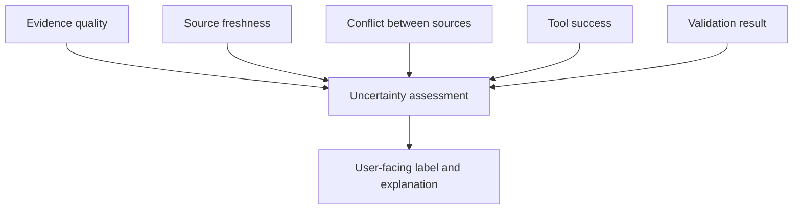

Better uncertainty language is specific:

- “Two approved sources agree.”
- “The policy document is current as of June 2026.”
- “The delivery estimate could not be refreshed.”
- “The request is ambiguous between billing and shipping address.”
- “A human reviewer is required because the amount exceeds the approval threshold.”

Use a confidence label only when it maps to defined criteria. For example:

| Label | Example criteria |
|---|---|
| High | Required sources available, no conflicts, deterministic validation passed |
| Medium | Core evidence available but one source is stale or incomplete |
| Low | Conflicting evidence, missing critical source, or uncertain task interpretation |

Low confidence should change behavior, not merely change a badge color. It should trigger clarification, abstention, fallback, or escalation.

---

## 11. Approval and confirmation UX

A consequential action should never be hidden inside a conversational response. The application should present a structured action preview.

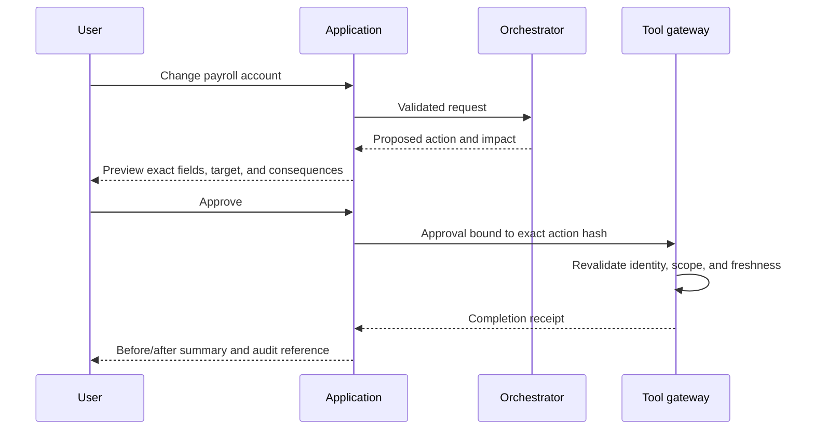

An approval card should state:

- the exact action;
- the target record or system;
- before-and-after values;
- expected impact;
- whether the action is reversible;
- which evidence or policy supports it;
- whether approval expires;
- who will receive a notification;
- approve, edit, reject, and escalate controls.

Approval should be bound to the exact action payload. If the arguments change, the prior approval must not remain valid.

### Confirmation is not always approval

- **Confirmation** checks that the system understood the user.
- **Approval** authorizes an action with consequences.

A low-impact search might need neither. A draft email may need confirmation. A payroll change needs explicit approval and possibly dual control.

---

## 12. Interrupt, reset, abort, retry, and escalation

The board describes interrupt, reset, and abort as distinct controls [Board, p. 25]. They should not be presented as interchangeable buttons.

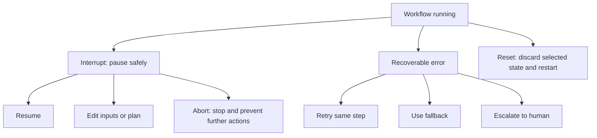

| Control | Meaning | Typical use |
|---|---|---|
| Interrupt | Pause at a safe boundary | Review before sending an email |
| Resume | Continue from checkpoint | Proceed after review |
| Reset | Return to a known safe state | Clear incorrect context and start again |
| Abort | Stop completely | Prevent a risky transaction |
| Retry | Repeat a failed step | Temporary API failure |
| Edit | Change inputs or proposed action | Correct supplier quantity |
| Escalate | Transfer to a human or specialist | Policy ambiguity or high impact |

The application should display what happened to in-flight work. For example:

- “Paused before the message was sent.”
- “The database update completed before cancellation.”
- “No external actions were performed.”
- “The refund request was created but not approved.”

This is essential when workflows cross irreversible boundaries.

---

## 13. Error and recovery design

An error message should help the user decide what to do next.

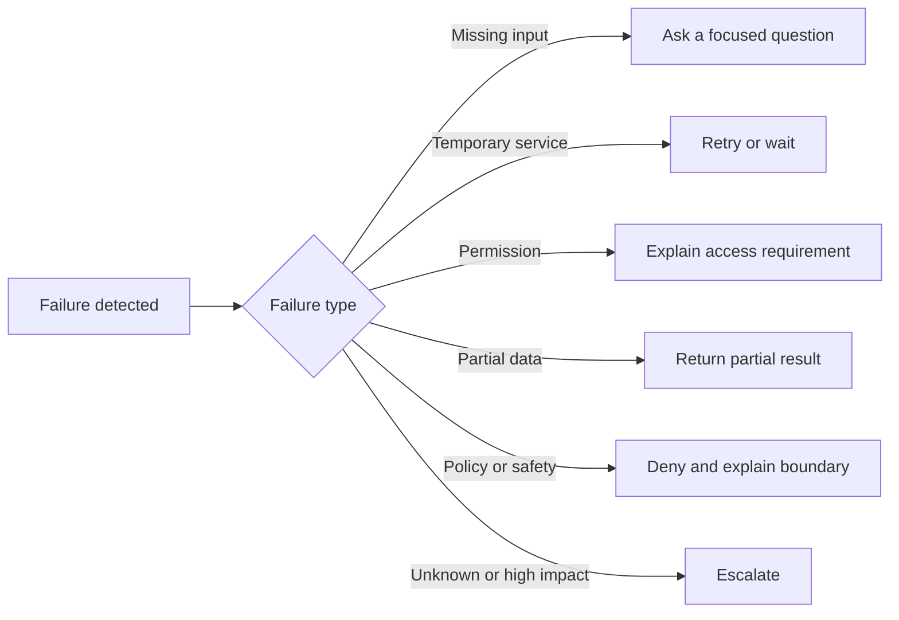

A good recovery message includes:

1. what failed in user language;
2. whether any action already occurred;
3. what information is still available;
4. what the application will do automatically;
5. what options the user has;
6. whether human support is available.

### Weak error

> Tool execution failed: 503.

### Better error

> The calendar service is temporarily unavailable. No meeting was created. I saved the proposed time and attendees. You can retry now, continue without calendar verification, or send the request to an assistant.

Safe partial completion is often better than total failure. The interface may return the completed research while clearly marking the missing pricing or calendar result.

---

## 14. Permission-aware UX

The interface should not offer actions the user cannot perform.

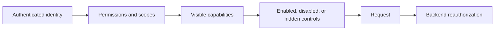

Frontend controls improve clarity but never replace backend authorization. A permission-aware UI should:

- hide irrelevant capabilities;
- disable unavailable actions with a reason;
- show when manager or specialist approval is required;
- prevent accidental cross-tenant selection;
- separate read and write capabilities;
- avoid displaying sensitive records in previews;
- re-check authorization at execution time.

Do not expose inaccessible records merely to explain that they are inaccessible. The UI can state that a source is restricted without revealing its title or contents.

---

## 15. Multi-channel interaction

The board highlights chat, forms, voice, and dashboards as possible application surfaces [Board, p. 28]. A consistent agent may operate across several channels, but each channel has different capabilities and risks.

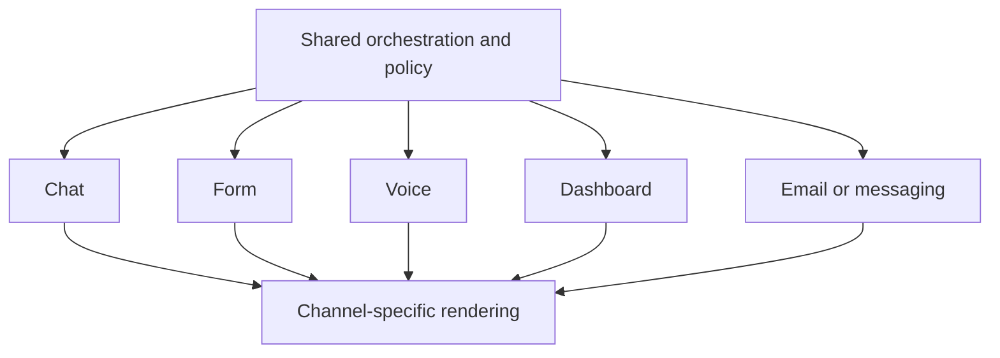

Examples:

- **Chat:** exploration and follow-up.
- **Form:** validated submission.
- **Dashboard:** monitoring, comparison, and approval queues.
- **Voice:** hands-free access, requiring careful confirmation.
- **Email or messaging:** notifications and low-friction handoffs.

The underlying workflow state should remain consistent across channels. A user who begins in chat and approves in a dashboard should see the same action ID, evidence, and status.

Channel-specific rules matter. Voice interfaces should repeat consequential details and require explicit confirmation. Email should not contain sensitive records merely because the user has application access. Mobile interfaces need compact progress and approval cards.

---

## 16. Accessibility and inclusive design

Agent experiences must remain usable when output is dynamic, streamed, or uncertain.

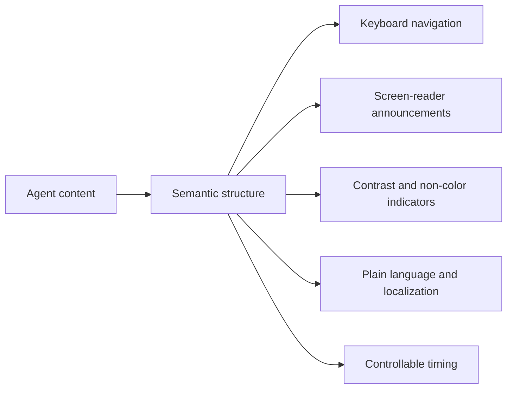

Key practices include:

- use headings, lists, tables, and labels semantically;
- do not rely on color alone for confidence, risk, or status;
- announce progress changes without overwhelming screen-reader users;
- keep interrupt and approval controls keyboard accessible;
- allow extra time before approval expiration where appropriate;
- use plain language for errors and policy boundaries;
- support bidirectional and multilingual layouts;
- provide text alternatives for charts and diagrams;
- let users stop animation and streaming effects;
- test generated content for readability and structure.

Accessibility also applies to cognitive load. Long model responses should be summarized with expandable detail. The system should ask one focused clarification question at a time rather than presenting a large ambiguous form.

---

## 17. Feedback and correction loops

Feedback should improve both the immediate task and future system quality.

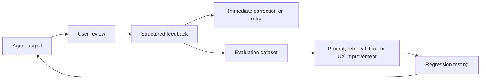

Useful feedback dimensions include:

- correct or incorrect;
- complete or missing information;
- source useful or stale;
- action appropriate or inappropriate;
- explanation clear or confusing;
- response too slow;
- escalation needed;
- user corrected a field or decision.

A correction should be linked to the relevant claim, source, tool step, or action. This makes the signal far more valuable than generic satisfaction feedback.

> **Enterprise insight**
>
> User edits are often stronger quality signals than thumbs-up or thumbs-down because they show the exact difference between the generated output and the accepted result.

---

## 18. UX metrics

The board groups metrics around performance, trust, user control, satisfaction, and error handling [Board, p. 29]. A useful measurement model connects interface behavior to task and business outcomes.

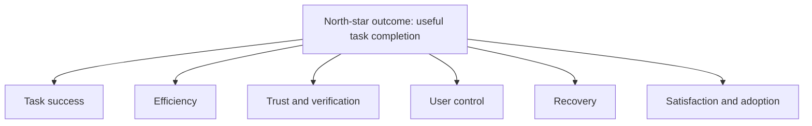

### 18.1 Task success

- completion rate;
- accepted recommendation rate;
- correct artifact produced;
- action completed without rework;
- time to verified outcome.

### 18.2 Performance

- time to first meaningful event;
- time to first useful result;
- total completion time;
- perceived latency;
- abandonment while waiting.

### 18.3 Trust

- source-view rate;
- citation verification rate;
- confidence-label acceptance;
- user-reported unsupported claims;
- approval acceptance after review;
- correction and appeal rate.

Trust metrics require interpretation. A high source-view rate may indicate healthy verification or poor initial confidence. Combine behavioral metrics with user research.

### 18.4 User control

- edit-before-approval rate;
- interrupt success rate;
- reset and abort frequency;
- successful resume rate;
- human-escalation rate;
- unauthorized-action prevention.

### 18.5 Error handling

- retry success rate;
- fallback success rate;
- partial-result usefulness;
- escalation resolution time;
- duplicate-action rate;
- recovery abandonment rate.

### 18.6 Satisfaction and adoption

- CSAT;
- repeat use;
- weekly active users;
- task-specific retention;
- recommendation acceptance;
- user preference for agent vs manual workflow.

> **Common mistake**
>
> Measuring message volume as success. More conversation can indicate value, but it can also indicate confusion, repeated corrections, or inability to complete the task.

---

## 19. Connect UX telemetry to agent traces

The application and backend should produce a single end-to-end trace.

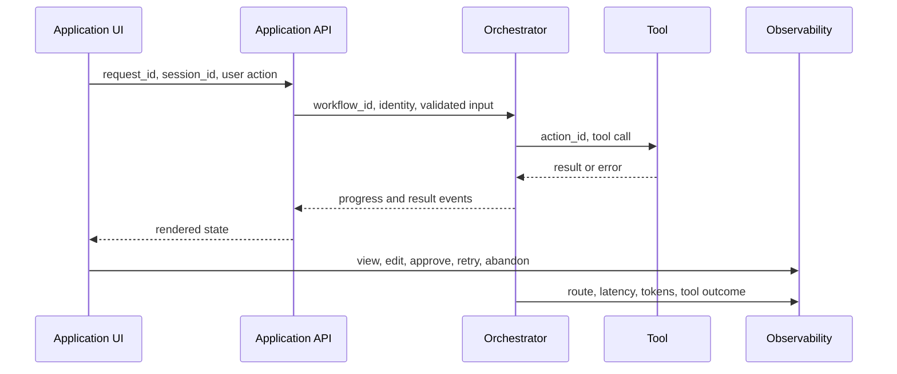

A minimal event should include:

- timestamp;
- event type;
- request, workflow, session, and action IDs;
- user role or privacy-safe cohort;
- visible state;
- backend step;
- latency;
- result status;
- error class;
- user control used;
- model, prompt, tool, and policy versions where relevant.

Avoid logging full sensitive prompts or outputs by default. Store references, hashes, redacted extracts, or protected audit artifacts according to policy.

End-to-end telemetry allows teams to identify patterns such as:

- users abandon when clarification exceeds two turns;
- approvals are often rejected because quantity is not visible;
- retries succeed but the interface still shows a terminal error;
- source previews improve acceptance for medium-confidence answers;
- one tool dominates total latency.

---

## 20. Reference application architecture

```mermaid
flowchart TB
    U[User] --> CLIENT[Web, mobile, chat, or voice client]
    CLIENT --> BFF[Application backend / BFF]
    BFF --> AUTH[Identity and permission service]
    BFF --> SESS[Session and UX state store]
    BFF --> ORCH[Agent orchestrator]
    ORCH --> POLICY[Policy and approval service]
    ORCH --> MODEL[Models]
    ORCH --> RET[Retrieval and memory]
    ORCH --> GATE[Tool gateway]
    GATE --> SYS[(Business systems)]
    ORCH --> EVENT[Workflow event stream]
    EVENT --> BFF
    BFF --> CLIENT
    CLIENT --> FEED[Feedback service]
    BFF --> OBS[Telemetry and audit]
    ORCH --> OBS
    FEED --> EVAL[Evaluation pipeline]
    OBS --> EVAL
```

The application backend or backend-for-frontend should:

- translate client events into validated workflow commands;
- subscribe to workflow events;
- maintain display-oriented state;
- enforce channel-specific rendering and privacy;
- correlate user actions with workflow traces;
- prevent the client from directly invoking privileged tools.

The orchestrator owns business workflow state. The application owns presentation state. These states are related but should not be confused.

Examples of presentation state:

- which source panel is expanded;
- whether a user dismissed a tooltip;
- draft text not yet submitted;
- selected comparison columns.

Examples of workflow state:

- current task and step;
- retrieved evidence;
- approved action;
- completed tool calls;
- retry count;
- checkpoint and status.

---

## 21. Worked example: supplier recommendation experience

### 21.1 User goal

A procurement manager wants a supplier recommendation based on price, delivery date, quality, and approved-vendor status.

```mermaid
flowchart LR
    G[Choose supplier] --> I[Collect quantity, date, and criteria]
    I --> P[Show evaluation plan]
    P --> R[Retrieve approved supplier data]
    R --> C[Compare and validate]
    C --> O[Present recommendation and alternatives]
    O --> A[Request procurement approval]
    A --> X[Create purchase request]
```

### 21.2 Hybrid input

The conversation asks what the user is trying to procure. A structured panel captures:

- item and specification;
- quantity;
- required date;
- location;
- maximum budget;
- mandatory certifications;
- weighting preferences.

### 21.3 Visible progress

1. Requirements confirmed
2. Approved suppliers checked
3. Current quotes retrieved
4. Delivery and quality compared
5. Recommendation validated

If a quote service fails, the interface says:

> Two supplier quotes are current. Supplier C’s quote could not be refreshed. I can compare the available data, retry the quote, or send the case to procurement.

### 21.4 Result card

```text
Recommended supplier: Supplier A

Why
- Lowest valid total cost
- Delivery is three days before the required date
- Quality score exceeds the mandatory threshold

Uncertainty
- Medium: capacity was confirmed yesterday rather than today

Sources
- Approved supplier registry
- Quote Q-4821
- Delivery estimate API
- Historical quality dashboard

Next actions
[Compare all suppliers] [Refresh capacity] [Send for approval]
```

### 21.5 Approval

The approval card displays the exact supplier, quantity, total value, delivery date, shipping location, and cancellation policy. Approval creates a purchase request, not a final order, unless the user has explicit ordering authority.

### 21.6 Completion receipt

After action execution, the user sees:

- purchase-request ID;
- status;
- approver;
- timestamp;
- link to the system of record;
- notification recipients;
- undo or cancellation path where available.

This experience makes the agent visible, controllable, and auditable.

---

## 22. UX testing for agentic systems

Agent UX requires more than screenshot testing. Teams should test interaction trajectories and failure recovery.

```mermaid
flowchart TB
    UNIT[Component and rendering tests] --> CONTRACT[Frontend-backend contract tests]
    CONTRACT --> FLOW[Workflow interaction tests]
    FLOW --> ADV[Adversarial and edge-case tests]
    ADV --> USER[Usability and accessibility studies]
    USER --> PROD[Production experiments and monitoring]
```

### 22.1 Core test scenarios

- complete and incomplete requests;
- ambiguous target records;
- conflicting instructions;
- permission denied;
- missing or stale evidence;
- unavailable tools;
- partial success;
- repeated retries;
- user interruption;
- reset after incorrect context;
- abort before and after a side effect;
- rejected approval;
- changed action after approval;
- cross-channel resume;
- multilingual and long-form input;
- screen-reader and keyboard navigation;
- prompt-injection content in a displayed source;
- slow and asynchronous completion.

### 22.2 Contract testing

The UI and orchestrator should agree on a typed event model such as:

```json
{
  "event_type": "approval_required",
  "workflow_id": "wf_2048",
  "action_id": "act_17",
  "title": "Create purchase request",
  "summary": "Supplier A, 500 units, total 42,000 USD",
  "impact": "Creates a request in the procurement system",
  "reversible": true,
  "expires_at": "2026-08-04T10:00:00Z"
}
```

Contract tests should verify that:

- every backend status has a supported rendering state;
- unknown events fail safely;
- stale approval events cannot trigger execution;
- completion receipts display authoritative IDs;
- redaction rules apply before content reaches the client.

### 22.3 Usability testing

Ask users to explain:

- what the agent understood;
- what it is doing now;
- which sources it used;
- whether any action has occurred;
- what approval would authorize;
- how to stop or correct the workflow.

When users cannot answer these questions, the interface is not sufficiently transparent or controllable.

---

## 23. Common failure modes

| Failure mode | Why it happens | Better design |
|---|---|---|
| Fluent but opaque answer | Interface renders only final text | Show evidence, uncertainty, and action history |
| Fake progress percentage | Workflow duration is nondeterministic | Show meaningful phases and waiting reasons |
| Accidental action | Conversation implies confirmation | Use a structured preview and explicit approval |
| Approval fatigue | Every action requires approval | Gate by impact and reversibility |
| Raw logs presented as transparency | Backend details are easy to expose | Provide task-oriented explanations and protected diagnostics |
| No recovery path | Errors treated as terminal | Offer retry, fallback, partial result, edit, or escalation |
| Ambiguous memory | User cannot tell what is retained | Show session scope and allow reset or correction |
| Misleading confidence | Undefined numeric score | Explain evidence quality and missing information |
| Hidden permission failure | Action simply disappears | Show role-appropriate capability and reason |
| Feedback without learning | Thumbs are not linked to failure | Capture structured, step-specific correction |
| Chat used for everything | Conversational UI chosen by default | Use form or hybrid mode for structured tasks |
| Overloaded result | Every detail shown at once | Apply progressive disclosure |

---

## 24. Design checklist

### Interaction model

- [ ] The primary user goal is explicit.
- [ ] Chat, form, or hybrid mode is chosen intentionally.
- [ ] Required facts are captured with suitable controls.
- [ ] The interface states what the agent can and cannot do.

### Transparency

- [ ] The user can see what the system understood.
- [ ] Important claims connect to inspectable evidence.
- [ ] Uncertainty is specific and behaviorally meaningful.
- [ ] Completed actions have authoritative receipts.

### Control

- [ ] Consequential actions use structured previews.
- [ ] Approval is bound to exact action arguments.
- [ ] Interrupt, edit, retry, reset, abort, and escalation are distinct.
- [ ] The interface explains what already happened after cancellation.

### Recovery

- [ ] Tool failures have user-oriented explanations.
- [ ] Partial results are clearly labeled.
- [ ] Safe retry and fallback options are available.
- [ ] Human escalation includes the relevant context.

### Accessibility and inclusion

- [ ] Status does not rely on color alone.
- [ ] Dynamic changes are accessible to assistive technology.
- [ ] Keyboard, mobile, and multilingual use are tested.
- [ ] Long output uses headings and progressive disclosure.

### Measurement

- [ ] UX events correlate with backend workflow traces.
- [ ] Task success is measured, not only message volume.
- [ ] Latency, abandonment, retry, and escalation are tracked.
- [ ] Feedback is linked to claims, sources, steps, or actions.

---

## 25. Hands-on lab: design an HR policy assistant

Design a hybrid application for an employee who wants to understand parental-leave policy and submit a request.

### Requirements

The application must:

1. authenticate the employee;
2. retrieve only approved HR policy documents;
3. show sources and policy effective dates;
4. distinguish general guidance from employee-specific eligibility;
5. collect required dates and employment details through validated fields;
6. prevent access to another employee’s data;
7. obtain approval before creating a leave request;
8. provide interrupt, edit, reset, abort, and HR-escalation controls;
9. show a completion receipt with request ID;
10. record UX and workflow telemetry.

### Deliverables

- user journey;
- interaction-mode rationale;
- visible state machine;
- result-card design;
- approval packet;
- error and recovery matrix;
- accessibility checklist;
- metric definitions;
- event schema.

### Evaluation questions

- Can the user tell whether the answer is general policy or personalized eligibility?
- Can the user verify the source and effective date?
- Is it clear when a request has or has not been submitted?
- Can an interrupted workflow resume safely?
- Does the UI prevent unauthorized employee selection?

---

## 26. Runnable implementation

The companion Python example implements a small application-layer controller without external dependencies. It demonstrates:

- typed UX and workflow state;
- hybrid request validation;
- meaningful progress events;
- result rendering with evidence and uncertainty;
- action proposals and exact-action approvals;
- interrupt, resume, reset, and abort;
- structured feedback;
- UX metric calculation;
- append-only event history.

Run it with:

```bash
python examples/27-agent-ux/agent_ux_controller.py
```

The example is intentionally framework-independent. A production application would connect the same concepts to a web or mobile client, an event stream, an identity provider, a persistent session store, and the orchestration system described in Chapter 19.

---

## 27. Knowledge check

1. Why is an application layer a safety surface rather than only a visual layer?
2. When is a hybrid interface preferable to pure chat?
3. What information belongs in a consequential-action approval card?
4. How does progressive disclosure differ from hiding details?
5. Why can a numeric confidence score be misleading?
6. What is the difference between interrupt, reset, and abort?
7. Which UX metrics reveal whether users can recover from failure?
8. Why should frontend events share identifiers with backend traces?
9. How should the interface represent a partial result?
10. Why must backend authorization still run when the UI hides an unavailable action?

---

## 28. Interview questions

### Beginner

1. What responsibilities belong to the application layer of an agentic system?
2. Compare chat, form, and hybrid interfaces.
3. What is progressive disclosure?
4. What information should accompany an AI recommendation?
5. What is the purpose of a human approval step?

### Intermediate

1. Design a visible state model for a long-running research agent.
2. How would you display retrieval evidence without overwhelming the user?
3. What metrics would you use to evaluate trust and user control?
4. How would you handle a tool failure after two other tools succeeded?
5. How would you keep application state consistent across chat and dashboard channels?

### Advanced

1. Design a typed event protocol between an orchestrator and a multi-channel application.
2. How would you bind a user approval to an exact action while preventing replay?
3. Explain how you would correlate abandonment with backend route, tool, and latency data.
4. Design an agent UX that supports interruption after a reversible side effect but before an irreversible one.
5. How would you test whether confidence labels improve decisions rather than merely increase acceptance?
6. How would you separate presentation state from workflow state in a distributed system?
7. Design a permission-aware interface for a multi-tenant HR agent.
8. How would you evaluate accessibility when responses and progress events are generated dynamically?

---

## 29. Summary

The application layer determines how users understand, control, verify, and recover from an agentic system. It is responsible for identity, session handling, input validation, rendering, progress, evidence, approvals, feedback, telemetry, accessibility, and channel-specific interaction.

Strong agent UX does not expose every internal detail. It exposes the information needed for informed use: task interpretation, material evidence, uncertainty, proposed or completed actions, and available controls. Chat is useful for exploration, forms for structured and regulated input, and hybrid interfaces for complex enterprise workflows.

Consequential actions require structured previews and exact-action approvals. Interrupt, reset, abort, retry, edit, and escalation are separate recovery tools. Errors should state what failed, what already happened, and what the user can do next. Progressive disclosure keeps the primary result clear while preserving inspectable evidence and audit detail.

The most important UX metric is useful task completion, supported by measures of latency, verification, control, recovery, satisfaction, and adoption. These frontend signals must connect to backend agent traces so teams can improve the entire human-agent workflow rather than optimizing the model or interface in isolation.

---

## Further study

- Revisit Chapter 19 for orchestration and shared state.
- Revisit Chapter 23 for approvals, interrupt/reset/abort, and safe control.
- Revisit Chapter 24 for evaluation and release gates.
- Continue to Chapter 28 for latency, cost, and performance optimization.
