# Chapter 28 - Latency, Cost, and Performance Optimization

> **Source basis:** The board treats latency as a system-level concern rather than a model-only concern. Its latency budget attributes most time to model inference, followed by retrieval, tool calls, routing, reflection, replanning, and orchestration overhead. It recommends optimizing the largest slice first and highlights smaller models, streaming, caching, and parallel execution of independent tools [Board, pp. 31-32]. The board also connects state, retries, tool execution, UX metrics, orchestration, and observability to the user experience [Board, pp. 15-17, 28-32]. This chapter preserves those ideas and expands them into a complete performance-engineering discipline. Material on service-level objectives, queueing, admission control, semantic caching, cost attribution, capacity planning, workload isolation, and the reference implementation is **Supplementary**.

---

## Learning objectives

By the end of this chapter, you should be able to:

1. Explain why agent performance must be measured across the entire execution path.
2. Distinguish end-to-end latency, time to first progress, time to first token, and tail latency.
3. Build a stage-level latency and cost budget for an agent workflow.
4. Identify the critical path in sequential, parallel, branching, and iterative workflows.
5. Reduce latency through routing, caching, context reduction, parallelism, streaming, and bounded execution.
6. Reduce cost without silently degrading task quality, safety, or reliability.
7. Design model-routing policies based on task complexity and risk.
8. Optimize retrieval, reranking, tool execution, memory, and state persistence.
9. Apply timeouts, retries, circuit breakers, backpressure, and admission control.
10. Define performance service-level indicators and release gates.
11. Evaluate cost per successful task rather than cost per model call.
12. Implement a dependency-free performance-budget simulator for an agentic workflow.

---

## 1. Performance is an end-to-end property

An agent is not a single model call. It is a distributed workflow that may classify intent, retrieve evidence, read memory, call APIs, wait for approvals, validate outputs, retry failures, and render a final result.

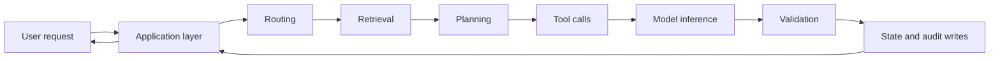

Optimizing only model inference can leave the experience slow when retrieval, external systems, serialization, retries, or queueing dominate. Conversely, reducing model latency may not improve perceived speed if the interface remains blank until the entire workflow completes.

> **Key principle**
>
> Optimize the user-visible critical path, not the component with the most impressive benchmark.

A useful performance program answers four questions:

1. **Where does time go?**
2. **Where does money go?**
3. **Which work is necessary for quality and safety?**
4. **Which work can be removed, reused, routed, parallelized, delayed, or bounded?**

---

## 2. Define the performance contract before optimizing

Optimization without an explicit contract often produces the wrong result. A team may reduce average latency while making failures slower, lower cost while increasing rework, or stream text faster while delaying the actual decision.

A performance contract should define:

- the user journey being measured;
- expected quality and safety floors;
- latency objectives;
- cost objectives;
- concurrency assumptions;
- acceptable degradation behavior;
- escalation rules;
- measurement boundaries.

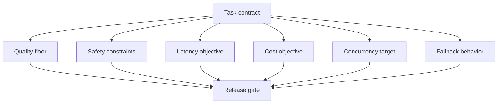

For a project-blocker assistant, an example contract might be:

- show meaningful progress within 500 ms;
- produce the first useful content within 2 seconds;
- complete 95% of ordinary requests within 5 seconds;
- cite every material blocker;
- never invent an owner;
- spend no more than an agreed cost per successful summary;
- return partial results when one noncritical source is unavailable;
- escalate when evidence conflicts or all authoritative sources fail.

The quality and safety conditions matter because a faster incorrect answer is not an optimization.

---

## 3. Latency metrics that matter

A single “response time” number hides important differences.

### 3.1 End-to-end latency

End-to-end latency is the time from accepted user request to a completed result. It includes application, orchestration, model, retrieval, tools, validation, and rendering.

### 3.2 Time to first progress

Time to first progress measures how quickly the system acknowledges the request with meaningful state, such as:

- “Checking sprint tickets”;
- “Retrieving the latest policy”;
- “Waiting for approval”;
- “One source is unavailable; continuing with the remaining sources.”

This is more useful than a generic spinner.

### 3.3 Time to first token

Time to first token measures when generated content begins streaming. It is valuable for conversational output, but it is not always the same as time to first useful information.

### 3.4 Time to first useful result

For action-oriented systems, the first useful result may be:

- a validated route;
- an evidence card;
- a completed tool lookup;
- an action preview;
- a partial report.

### 3.5 Tail latency

Tail latency describes slow requests at percentiles such as p95 or p99. Tail latency often determines trust because users remember the worst waits more than the average.

| Metric | Meaning | Best use |
|---|---|---|
| Average latency | Mean completion time | Broad trend only |
| Median or p50 | Typical request | Normal user experience |
| p95 | Slow but common tail | Service objective |
| p99 | Extreme tail | Reliability and capacity planning |
| Time to first progress | First meaningful state | Perceived responsiveness |
| Time to first token | First generated token | Streaming systems |
| Time to first useful result | First actionable information | Agent and workflow UX |

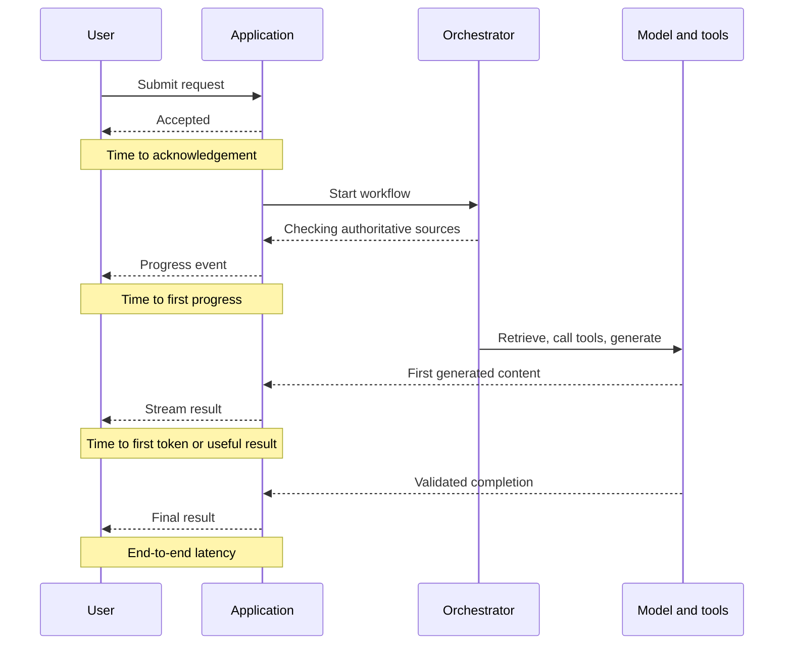

---

## 4. Build a stage-level latency budget

The board’s illustrative budget assigns the largest share to model inference, followed by retrieval, tool calls, and overhead [Board, p. 32]. The exact percentages will vary, but the method is broadly useful: decompose the workflow and measure each stage.

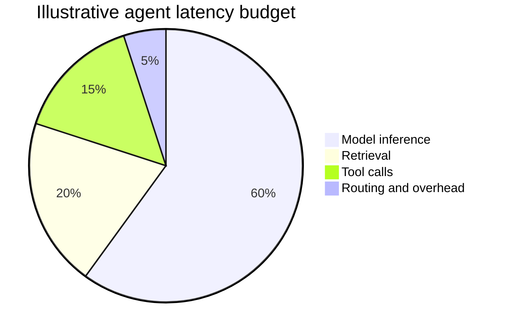

A latency budget should separate:

- queue time;
- network time;
- retrieval time;
- reranking time;
- model time;
- tool time;
- validation time;
- persistence time;
- user or human approval time.

Human approval is often excluded from automated service latency because it is externally controlled, but the system should still measure it as workflow elapsed time.

| Stage | Budget | Measurement |
|---|---:|---|
| Request admission | 50 ms | Gateway and queue trace |
| Intent routing | 100 ms | Route decision span |
| Retrieval | 400 ms | Search plus reranking |
| Parallel tools | 800 ms | Slowest required tool |
| Model generation | 1,500 ms | First token and completion |
| Validation | 150 ms | Schema, grounding, policy |
| Rendering and persistence | 100 ms | BFF, state, audit |
| **Total automated path** | **3,100 ms** | End-to-end trace |

Budgets are not predictions. They are design constraints that help teams decide where to invest.

---

## 5. Critical-path analysis

The critical path is the longest chain of dependent work that determines completion time.

### 5.1 Sequential execution

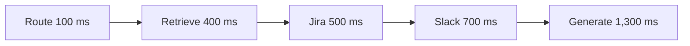

Total latency is approximately the sum: 3,000 ms.

### 5.2 Parallel execution

When Jira and Slack are independent, they can run concurrently.

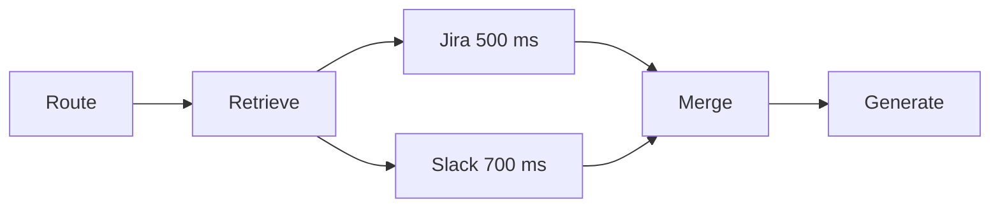

The tool segment now takes approximately 700 ms instead of 1,200 ms. Parallelism improves latency only when the branches are truly independent and the merge is well defined.

### 5.3 Iterative execution

Agent loops complicate the critical path.

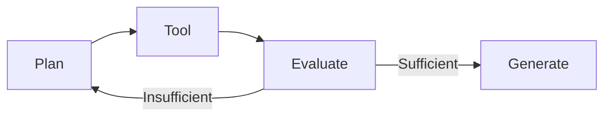

The latency contribution of the loop depends on:

- attempts;
- progress per attempt;
- tool latency;
- model latency;
- termination policy.

This is why retry and replan budgets are performance controls, not only reliability controls.

---

## 6. Cost is also an end-to-end property

Agent cost includes more than model tokens.

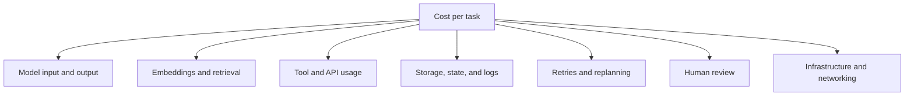

A complete cost model may include:

- model input tokens;
- model output tokens;
- cached-token charges where applicable;
- embedding operations;
- vector queries and reranking;
- paid search, data, or SaaS API calls;
- compute for code execution;
- browser or document processing;
- memory and checkpoint storage;
- trace and log retention;
- moderation and evaluator calls;
- retries and duplicate work;
- human review time.

### 6.1 Cost per successful task

Cost per model call is an implementation metric. Cost per successful task is a product metric.

```text
Cost per successful task = total workflow cost / number of successful tasks
```

A cheap request that fails and must be repeated can be more expensive than a well-routed request that succeeds once.

### 6.2 Cost per business outcome

For mature systems, teams may also measure:

- cost per resolved support ticket;
- cost per approved supplier recommendation;
- cost per completed employee workflow;
- cost per research report accepted without revision.

The denominator should represent delivered value, not activity.

---

## 7. Optimize in the right order

The board recommends optimizing the largest slice first [Board, p. 32]. A disciplined sequence is:

1. remove unnecessary work;
2. route simple work to simpler paths;
3. reduce repeated work through caching;
4. parallelize independent work;
5. reduce context and output volume;
6. choose an appropriate model;
7. tune infrastructure and transport;
8. verify quality, safety, and reliability after every change.

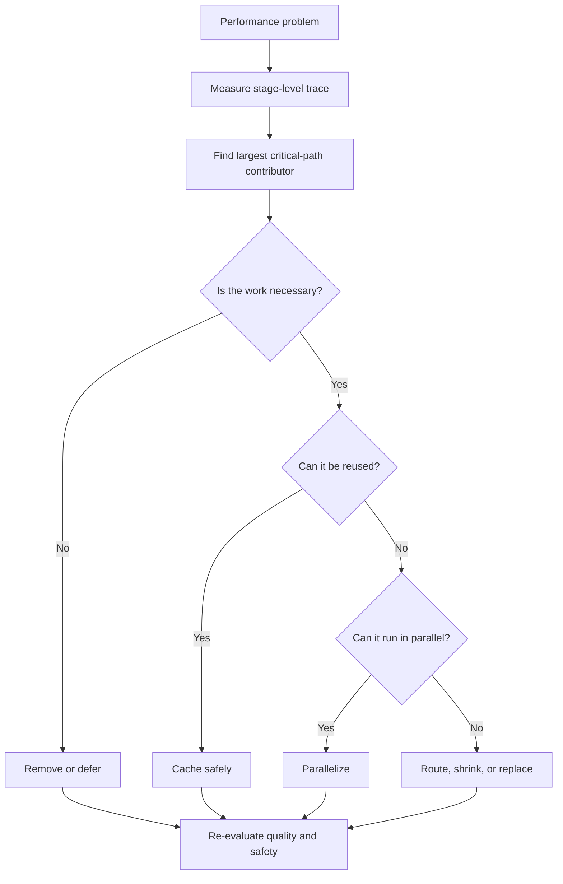

Premature micro-optimization is common. Replacing a serializer may save milliseconds while an unnecessary second model call adds seconds.

---

## 8. Model routing and cascade design

Not every request needs the same model.

### 8.1 Complexity routing

A router can classify requests into paths such as:

- deterministic rule or template;
- small model;
- larger model;
- specialist model;
- human review.

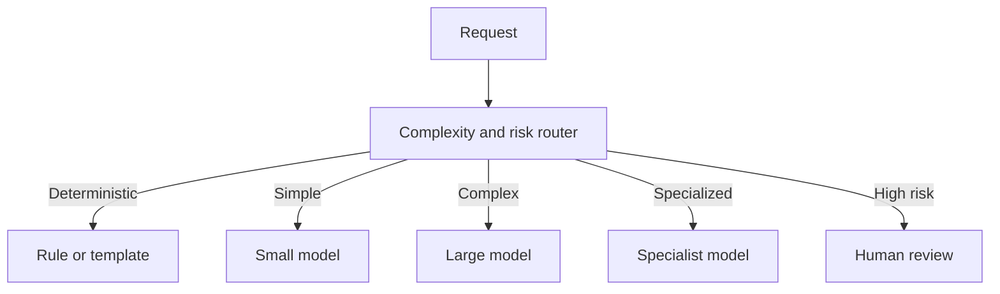

Routing features can include:

- input length;
- task type;
- domain;
- required tools;
- evidence burden;
- action impact;
- ambiguity;
- previous failures;
- user tier or service level.

### 8.2 Cascades

A cascade starts with a cheaper path and escalates only when a measurable condition fails.

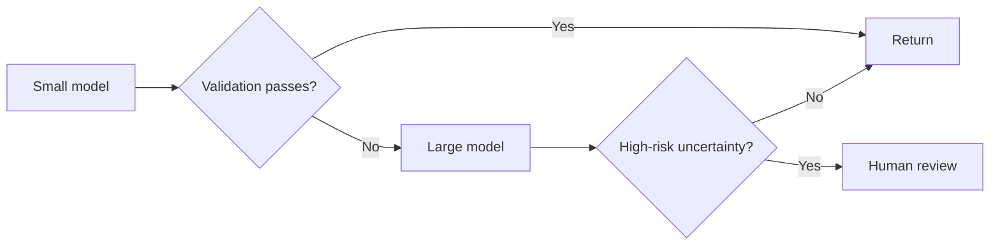

A cascade should not rely only on the model’s self-reported confidence. Use deterministic checks, evidence coverage, schema validity, business rules, or calibrated evaluators.

### 8.3 Risks of routing

- inconsistent behavior across models;
- router error;
- hidden quality degradation;
- duplicated work in cascades;
- difficult debugging;
- cost spikes when many requests escalate.

Route decisions must therefore be traced and evaluated as first-class outputs.

---

## 9. Prompt and context optimization

Input size affects cost, latency, and attention quality.

### 9.1 Remove redundant instructions

Long prompts often accumulate repeated policies, examples, and formatting rules. Consolidate stable instructions and eliminate duplication.

### 9.2 Use structured context

Prefer concise, labeled evidence over raw logs or documents.

| Inefficient context | Better context |
|---|---|
| Entire ticket history | Latest state plus material changes |
| Full policy manual | Retrieved sections with metadata |
| Raw tool payload | Normalized fields required for the decision |
| Entire conversation | Current goal, unresolved facts, compact summary |
| Repeated role text | Stable system instruction |

### 9.3 Separate authoritative and optional context

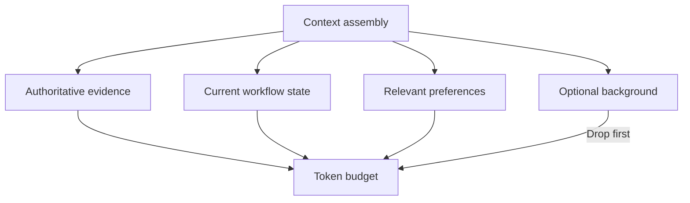

Context budgeting should preserve:

1. safety and policy instructions;
2. the current task;
3. authoritative evidence;
4. required tool results;
5. recent unresolved state;
6. optional background.

### 9.4 Control output length

Output tokens can dominate both latency and cost. Request the smallest artifact that satisfies the job:

- table instead of essay;
- concise explanation with expandable evidence;
- structured JSON for machine processing;
- summary plus links to details;
- diff instead of full document rewrite.

---

## 10. Retrieval performance optimization

Retrieval has several independently tunable stages.

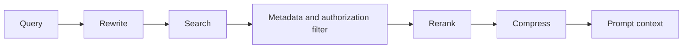

### 10.1 Index and filter early

Use metadata and authorization filters before expensive reranking when possible. This reduces candidate volume and prevents unauthorized evidence from entering later stages.

### 10.2 Tune candidate counts

Large top-k values increase recall but also increase reranking time, context size, and noise. Measure the smallest candidate set that preserves evidence coverage.

### 10.3 Cache retrieval safely

Retrieval caching can reuse:

- query embeddings;
- normalized query forms;
- search candidates;
- reranked results;
- document parses;
- chunk summaries.

Cache keys must include the dimensions that affect correctness:

- tenant;
- user or authorization scope;
- index version;
- document version;
- filter set;
- embedding model version;
- reranker version;
- query normalization version.

### 10.4 Freshness controls

A fast stale answer is often worse than a slower fresh answer. Apply:

- time-to-live rules;
- event-based invalidation;
- source-version checks;
- freshness labels;
- bypass for volatile data.

---

## 11. Caching patterns

Caching reduces repeated work but can create correctness, privacy, and freshness failures.

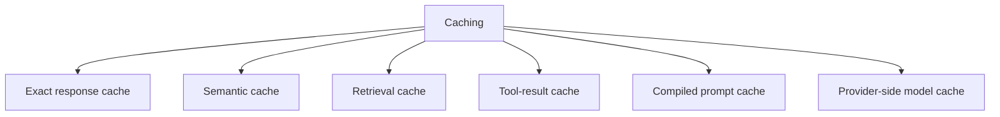

### 11.1 Exact cache

An exact cache reuses a result for an identical normalized request and context key. It is safe when all relevant state is included in the key.

### 11.2 Semantic cache

A semantic cache reuses results for meaningfully similar queries. It requires stricter controls because two similar questions may differ in identity, time, permissions, or requested action.

Never use semantic caching across users or tenants unless the cached artifact is explicitly public and independent of user context.

### 11.3 Tool-result cache

Tool caching works well for:

- static reference data;
- low-volatility configuration;
- read-only lookups with known freshness tolerances.

It is dangerous for:

- balances;
- inventory;
- approvals;
- workflow status;
- permissions;
- rapidly changing operational data.

### 11.4 Negative caching

Repeated calls for a missing resource can overload systems. Negative caching stores a short-lived “not found” result. Its TTL should be short because the resource may appear later.

### 11.5 Cache observability

Measure:

- hit rate;
- miss rate;
- stale-hit rate;
- invalidation rate;
- latency saved;
- cost saved;
- quality difference between hits and misses.

---

## 12. Parallelism, batching, and speculative execution

### 12.1 Parallel independent calls

The board explicitly recommends parallelizing independent tool calls [Board, p. 32].

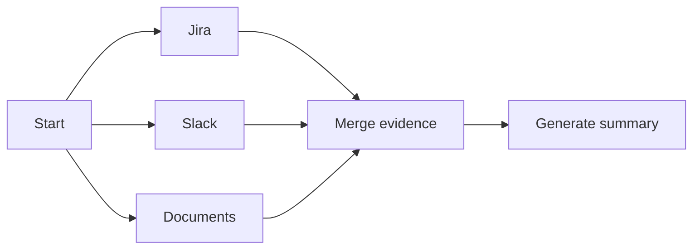

Parallelism requires:

- independent inputs;
- explicit deadlines;
- bounded concurrency;
- deterministic merge rules;
- partial-failure policy;
- cancellation of unnecessary work.

### 12.2 Batching

Batching combines similar work:

- embedding multiple chunks;
- scoring multiple candidates;
- classifying multiple tickets;
- writing telemetry in batches.

Batching improves throughput but may increase per-request waiting time. It is usually better for offline or high-volume asynchronous workloads than interactive tasks.

### 12.3 Speculative execution

Speculative execution starts likely-needed work before the final route is confirmed. Examples include:

- prefetching a user profile while intent classification runs;
- starting a common retrieval query while the planner refines subquestions;
- preparing two candidate tool routes and cancelling one.

Use speculation only when:

- cancellation is supported;
- side effects are impossible;
- the predicted branch is common;
- extra cost is bounded;
- privacy and authorization are already established.

---

## 13. Streaming and progressive delivery

Streaming does not necessarily reduce total work, but it can reduce perceived latency.

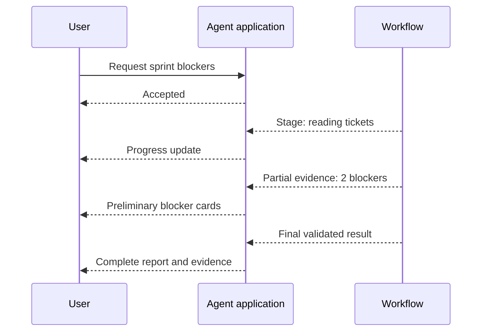

Useful stream events include:

- request accepted;
- route selected;
- source started;
- source completed;
- partial evidence available;
- approval required;
- fallback activated;
- final validation completed.

Do not stream unvalidated sensitive content, private reasoning traces, or provisional actions that users may mistake for completion.

### 13.1 Progressive result design

A good agent can return:

1. acknowledgement;
2. meaningful progress;
3. partial read-only evidence;
4. validated result;
5. completion receipt.

For high-impact actions, execution should still wait for required validation and approval.

---

## 14. Tool-call performance

External systems frequently dominate tail latency.

### 14.1 Set per-tool deadlines

A workflow deadline should be divided among required components.

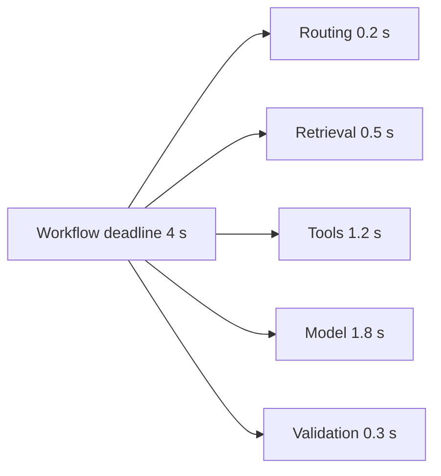

A tool should not be allowed to consume the entire workflow budget.

### 14.2 Classify required and optional tools

- **Required:** the workflow cannot complete safely without the result.
- **Optional:** the result improves quality but can be omitted.
- **Deferrable:** the result can be delivered asynchronously.

### 14.3 Use partial results deliberately

A project assistant may continue when meeting notes are unavailable if Jira and team messages provide sufficient evidence. It should state the missing source.

### 14.4 Reconcile ambiguous writes

When a write times out, do not immediately retry. First determine whether it succeeded. Blind retries can duplicate purchases, messages, or updates.

### 14.5 Apply circuit breakers

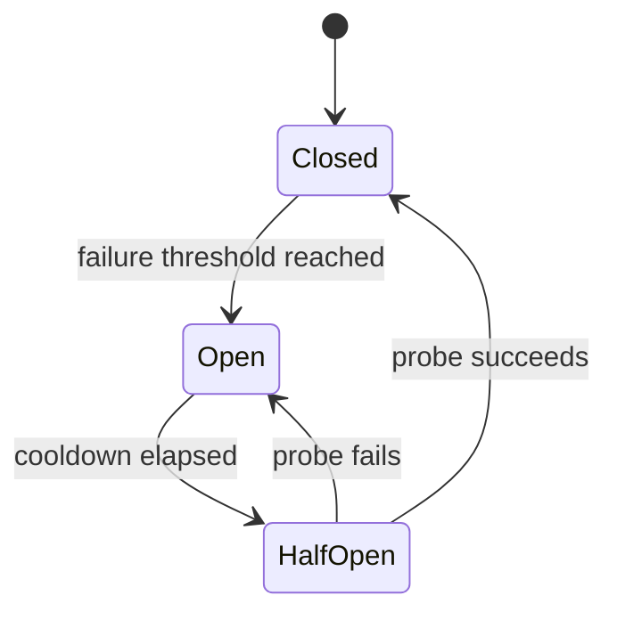

A circuit breaker prevents repeated calls to a failing dependency and protects the rest of the workflow.

---

## 15. Retry, reflection, and replan budgets

Retries are often hidden cost and latency multipliers.

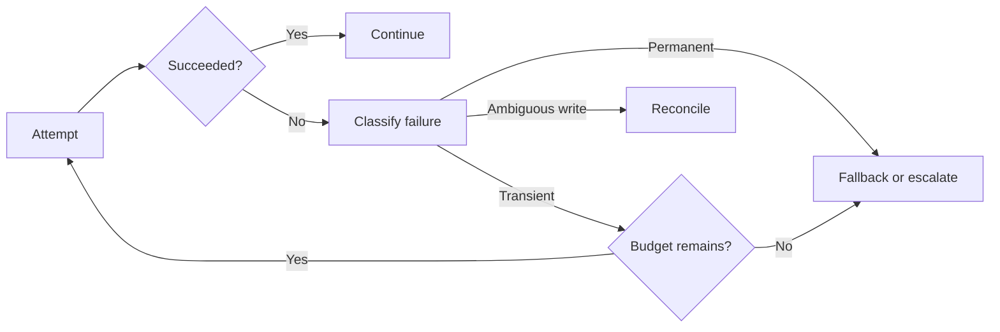

A retry policy should specify:

- retryable error classes;
- maximum attempts;
- exponential backoff;
- jitter;
- idempotency requirement;
- workflow deadline;
- global attempt budget;
- fallback and escalation.

Reflection and replanning also need limits:

- maximum model calls;
- maximum tool calls;
- maximum plan revisions;
- maximum no-progress iterations;
- maximum elapsed time;
- maximum cost.

> **Engineering rule**
>
> Every loop must consume a visible budget and produce measurable progress.

---

## 16. Queueing, concurrency, and backpressure

Fast individual requests do not guarantee a fast service under load.

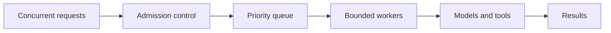

### 16.1 Queue time

Queue time should be measured separately from execution time. Rising queue time often signals capacity pressure before component errors appear.

### 16.2 Concurrency limits

Set limits for:

- model requests;
- each tool or connector;
- browser sessions;
- code sandboxes;
- retrieval queries;
- per-user or per-tenant execution;
- global workflow count.

### 16.3 Backpressure

Backpressure slows or rejects new work when downstream capacity is exhausted. Options include:

- queue with a bounded wait;
- return a retry-after signal;
- degrade to a smaller model;
- switch to asynchronous completion;
- disable optional enrichment;
- reject low-priority work.

### 16.4 Admission control

Admission control evaluates whether a request can start within policy and resource limits. It can consider:

- current queue depth;
- user priority;
- tenant quota;
- expected cost;
- required tools;
- workflow deadline;
- system health.

### 16.5 Workload isolation

Separate pools for interactive, batch, high-risk, and evaluation workloads prevent one class from exhausting shared capacity.

```mermaid
flowchart TB
    IN[Requests] --> CLASS[Workload classifier]
    CLASS --> INT[Interactive pool]
    CLASS --> BATCH[Batch pool]
    CLASS --> HIGH[High-risk pool]
    CLASS --> EVAL[Evaluation pool]
```

---

## 17. State and persistence performance

Persistent state enables recovery and continuity, but excessive state access can add latency and cost.

Optimize state by:

- reading only fields required for the current node;
- separating hot workflow state from long-term memory;
- compacting old messages;
- batching noncritical audit writes;
- using asynchronous telemetry where safe;
- indexing state by workflow and version;
- avoiding repeated serialization of large tool payloads;
- storing references to large artifacts instead of duplicating content.

```mermaid
flowchart TB
    NODE[Workflow node] --> HOT[Hot working state]
    NODE --> MEM[Selective long-term memory]
    NODE --> AUDIT[Append-only audit]
    NODE --> ART[Artifact references]
    HOT --> NEXT[Next node]
    MEM -->|Only relevant entries| NEXT
```

Do not delay critical durability. Approval decisions, consequential writes, and recovery checkpoints should be persisted before the workflow acknowledges completion.

---

## 18. Quality-preserving degradation

When resources are constrained, degradation should be explicit and safe.

| Constraint | Safe degradation | Unsafe degradation |
|---|---|---|
| Retrieval slow | Use cached public reference with freshness label | Use stale personalized policy silently |
| Optional tool unavailable | Return partial result and name missing source | Invent the missing value |
| Large model overloaded | Route simple low-risk tasks to smaller validated model | Route high-impact decisions without evaluation |
| Queue saturated | Offer asynchronous completion | Hold request indefinitely |
| Cost budget exhausted | Stop optional enrichment | Skip required safety validation |
| Human reviewer unavailable | Preserve pending state | Auto-approve high-impact action |

```mermaid
flowchart TB
    PRESS[Resource pressure] --> CLASS{Task risk}
    CLASS -->|Low| DEG[Validated degraded path]
    CLASS -->|Medium| PART[Partial result or async completion]
    CLASS -->|High| HOLD[Hold or human escalation]
    DEG --> DISCLOSE[Disclose limitations]
    PART --> DISCLOSE
    HOLD --> DISCLOSE
```

Degradation behavior should be tested before incidents, not invented during them.

---

## 19. Performance evaluation and release gates

Performance changes must be evaluated jointly with quality and safety.

### 19.1 Offline workload

Build a workload that represents:

- simple and complex requests;
- short and long context;
- cache hits and misses;
- fast and slow tools;
- tool failures;
- approval paths;
- multi-turn state;
- peak concurrency;
- different tenants and permission scopes.

### 19.2 Metrics

| Category | Metrics |
|---|---|
| Latency | p50, p95, p99, first progress, first token, completion |
| Cost | Cost per request, successful task, tool, tenant, and workflow |
| Throughput | Requests or tasks per second/minute |
| Efficiency | Tokens per successful task, tool calls per completion |
| Quality | Accuracy, evidence coverage, task success |
| Reliability | Timeout, retry, fallback, and escalation rates |
| Cache | Hit, stale-hit, and invalidation rates |
| Capacity | Queue depth, saturation, rejection, worker utilization |

### 19.3 Release gate

```mermaid
flowchart LR
    BUILD[Candidate build] --> QUAL{Quality floor met?}
    QUAL -->|No| BLOCK[Block]
    QUAL -->|Yes| SAFE{Safety floor met?}
    SAFE -->|No| BLOCK
    SAFE -->|Yes| LAT{Latency SLO met?}
    LAT -->|No| BLOCK
    LAT -->|Yes| COST{Cost budget met?}
    COST -->|No| REVIEW[Review trade-off]
    COST -->|Yes| CANARY[Canary release]
```

A release should not pass because average latency improved if p95 regressed severely or high-risk quality dropped.

---

## 20. Observability for performance engineering

Performance optimization depends on traceable measurements.

Each workflow trace should include:

- workflow and request identifiers;
- user or tenant scope in privacy-safe form;
- route decision;
- model and prompt versions;
- input and output token counts;
- retrieval candidates and timing;
- tool names, attempts, and latency;
- queue and network time;
- cache decisions;
- validation time;
- state persistence time;
- final quality and status;
- cost attribution.

```mermaid
flowchart LR
    REQ[Request] --> TRACE[Workflow trace]
    TRACE --> SP1[Routing span]
    TRACE --> SP2[Retrieval span]
    TRACE --> SP3[Tool spans]
    TRACE --> SP4[Model span]
    TRACE --> SP5[Validation span]
    TRACE --> SP6[Persistence span]
    SP1 --> DASH[Performance dashboard]
    SP2 --> DASH
    SP3 --> DASH
    SP4 --> DASH
    SP5 --> DASH
    SP6 --> DASH
```

Do not log raw secrets, private prompts, or sensitive tool outputs merely to obtain timing data. Performance telemetry should follow the same data-minimization rules as other observability.

---

## 21. Capacity planning

Capacity planning converts workload expectations into required service capacity.

Inputs include:

- requests per minute;
- concurrent active workflows;
- model calls per workflow;
- average and tail model duration;
- tool-call fan-out;
- retry rate;
- token volume;
- cache hit rate;
- batch and interactive mix;
- growth and seasonal peaks.

### 21.1 Simple concurrency estimate

A rough concurrency estimate is:

```text
Concurrent work ≈ arrival rate × average processing time
```

This is only a starting point. Agent workflows have branching, queues, external dependencies, and heavy-tailed durations, so production planning should use measured distributions and load tests.

### 21.2 Headroom

Do not size only for average load. Reserve headroom for:

- traffic bursts;
- tool slowdown;
- model-provider throttling;
- retries;
- failover;
- deployments;
- evaluation traffic.

### 21.3 Autoscaling signals

Useful signals include:

- queue depth;
- queue wait time;
- active workflows;
- model concurrency;
- token throughput;
- tool saturation;
- CPU and memory for local components;
- p95 latency.

Scaling on CPU alone can miss model-API or connector bottlenecks.

---

## 22. Case study: project-blocker summary

The board’s project-coordination example asks an agent to inspect sprint tickets, team messages, and documents, then summarize blockers, owners, impact, and next actions [Board, pp. 1-4, 35-36].

### 22.1 Baseline design

```mermaid
flowchart LR
    U[User] --> R[Route]
    R --> K[Retrieve project context]
    K --> J[Jira lookup]
    J --> S[Slack lookup]
    S --> D[Document lookup]
    D --> L[Large model]
    L --> V[Validate]
    V --> O[Output]
```

Problems:

- tools run sequentially;
- the same project context is retrieved repeatedly;
- the full conversation and raw tool payloads are sent to the model;
- every request uses the largest model;
- no progress is shown until completion;
- retries are not bounded globally.

### 22.2 Optimized design

```mermaid
flowchart TB
    U[User] --> ROUTE[Intent, complexity, and risk routing]
    ROUTE --> CACHE{Fresh project context cached?}
    CACHE -->|Yes| CTX[Compact context]
    CACHE -->|No| RET[Retrieve and cache]
    RET --> CTX
    CTX --> J[Jira]
    CTX --> S[Team messages]
    CTX --> D[Meeting notes]
    J --> MERGE[Normalize and merge]
    S --> MERGE
    D --> MERGE
    MERGE --> MODEL[Right-sized model]
    MODEL --> VALID[Evidence and schema validation]
    VALID --> STREAM[Stream result and receipt]
```

Optimizations:

1. route simple requests to a smaller model;
2. cache stable project context with versioned keys;
3. execute read-only tools in parallel;
4. normalize tool outputs before prompting;
5. compact context to material evidence;
6. stream meaningful progress;
7. bound retries and no-progress loops;
8. return partial results when an optional source fails;
9. preserve evidence and quality gates.

### 22.3 What to measure

- first progress;
- first useful blocker card;
- total completion time;
- per-source latency;
- tool timeout rate;
- cache hit rate;
- input and output tokens;
- evidence coverage;
- cost per accepted report;
- retry and escalation rates.

---

## 23. Reference implementation

The accompanying example is dependency-free and uses synthetic timing and locally configured illustrative token rates. It compares a baseline workflow with an optimized workflow.

It demonstrates:

- stage-level latency and cost records;
- sequential versus parallel tool critical paths;
- retrieval and tool caching;
- model routing;
- context compaction;
- streaming-oriented first-token calculation;
- quality floors;
- cost per successful task;
- release gates.

Run it with:

```bash
python examples/28-performance-optimization/performance_budget_optimizer.py
```

The generated `sample_output.json` contains the baseline, optimized result, improvement percentages, and release-gate decision.

> **Important**
>
> The example’s rates and latencies are synthetic. Replace them with measured provider, infrastructure, and tool data before using the model for planning.

---

## 24. Practical optimization checklist

### Measurement

- [ ] End-to-end latency is traced.
- [ ] Queue time is separated from execution time.
- [ ] p50, p95, and p99 are monitored.
- [ ] Time to first progress and first useful result are measured.
- [ ] Cost is attributed by workflow, model, tool, and tenant.
- [ ] Quality and safety outcomes are linked to performance traces.

### Architecture

- [ ] The critical path is documented.
- [ ] Independent read-only calls are parallelized.
- [ ] Optional work is separated from required work.
- [ ] Every loop has time, cost, and attempt budgets.
- [ ] High-risk paths preserve validation and approval.
- [ ] Interactive and batch workloads are isolated.

### Models and prompts

- [ ] Model choice reflects complexity and risk.
- [ ] Routing decisions are evaluated.
- [ ] Prompts avoid duplicate instructions.
- [ ] Context contains only relevant evidence and state.
- [ ] Output length matches the task.
- [ ] Cascades have deterministic escalation criteria.

### Retrieval and tools

- [ ] Candidate counts and reranking depth are measured.
- [ ] Cache keys include identity, authorization, and versions.
- [ ] Freshness and invalidation rules are explicit.
- [ ] Tool deadlines fit inside the workflow deadline.
- [ ] Ambiguous writes are reconciled before retry.
- [ ] Circuit breakers and fallback policies exist.

### Operations

- [ ] Concurrency limits are defined per dependency.
- [ ] Backpressure and admission control are tested.
- [ ] Degraded modes are quality- and safety-preserving.
- [ ] Capacity plans include bursts and retry amplification.
- [ ] Release gates include quality, safety, latency, and cost.

---

## 25. Common mistakes

### Mistake 1: optimizing average latency only

A low average can hide severe p95 and p99 waits.

### Mistake 2: making the model smaller without evaluating the task

A cheaper model may increase corrections, escalations, or tool misuse.

### Mistake 3: caching without authorization and freshness dimensions

This can create privacy leaks and stale answers.

### Mistake 4: parallelizing dependent or side-effecting work

Parallel execution can create race conditions and inconsistent state.

### Mistake 5: streaming unvalidated content

Early output can expose private data or create false confidence.

### Mistake 6: allowing local retries to multiply globally

Three retries in several nested agents can create a retry storm.

### Mistake 7: measuring tokens but not successful outcomes

Low token usage is not valuable if task completion falls.

### Mistake 8: ignoring queue time

Component benchmarks can look healthy while users wait in a saturated queue.

### Mistake 9: removing safety checks to meet latency targets

This changes the product contract rather than optimizing it.

### Mistake 10: treating every request as interactive

Long research, batch evaluation, and report generation often belong in asynchronous workflows.

---

## 26. Hands-on lab: optimize a supplier recommendation workflow

Design a workflow that:

1. reads approved supplier records;
2. retrieves pricing, delivery, and quality evidence;
3. compares candidates;
4. generates a recommendation;
5. requests approval before purchase creation.

### Baseline

Assume:

- three data sources run sequentially;
- the full supplier history is sent to a large model;
- there is no caching;
- the UI remains blank until completion;
- failures retry three times independently.

### Tasks

1. Draw the baseline critical path.
2. Define p50 and p95 latency objectives.
3. Identify required, optional, and deferrable work.
4. Parallelize safe read-only calls.
5. Define cache keys and freshness rules.
6. Design a model-routing or cascade policy.
7. Limit input and output tokens.
8. Define retry, timeout, and circuit-breaker budgets.
9. Design progress events and partial-result behavior.
10. Define a release gate that preserves recommendation quality and approval safety.

### Evaluation criteria

- latency improvement;
- cost per approved recommendation;
- evidence coverage;
- ranking consistency;
- stale-data rate;
- tool failure recovery;
- approval integrity.

---

## 27. Knowledge check

1. Why is end-to-end latency more useful than model latency alone?
2. How does time to first progress differ from time to first token?
3. What is the critical path in a parallel workflow?
4. Why can retries increase both latency and cost nonlinearly?
5. Which dimensions should be included in an authorization-aware retrieval cache key?
6. When is semantic caching unsafe?
7. Why should optional tool calls be separated from required calls?
8. How does backpressure protect a system?
9. Why is cost per successful task more meaningful than cost per model call?
10. What should prevent a model cascade from silently degrading quality?
11. How can streaming improve perceived latency without reducing total work?
12. Why should high-impact actions fail closed under performance pressure?

---

## 28. Interview questions

### Beginner

1. What are the major contributors to agent latency?
2. What is p95 latency?
3. What is time to first token?
4. Why does context length affect cost?
5. What is a cache hit?

### Intermediate

1. How would you reduce the latency of three independent tool calls?
2. How would you design a cache for permission-sensitive RAG results?
3. What is the difference between batching and parallelism?
4. How would you measure cost per successful task?
5. What should happen when an optional tool exceeds its deadline?
6. How do circuit breakers differ from retries?

### Advanced

1. Design a model-routing policy that balances quality, safety, latency, and cost.
2. How would you detect that a latency regression is caused by queueing rather than model inference?
3. How would you prevent retry amplification across nested agents?
4. Design admission control for a multi-tenant agent platform.
5. How would you evaluate whether semantic caching changes answer quality or fairness?
6. How would you define an SLO for a workflow that may wait for human approval?
7. How would you optimize a multi-hop RAG workflow without reducing evidence coverage?
8. What telemetry is required to calculate the true critical path of an agent graph?
9. How would you design graceful degradation for an enterprise HR agent during a provider outage?
10. When should a long-running agent workflow become asynchronous rather than interactive?

---

## 29. Summary

Agent performance is a system property shaped by routing, retrieval, tools, models, state, validation, queues, retries, and the application layer. Effective optimization begins with a measurable contract and a stage-level trace. Teams should identify the critical path, remove unnecessary work, reuse safe results, parallelize independent calls, compact context, route tasks to appropriate models, stream meaningful progress, and bound every retry and reflection loop.

Cost should be measured per successful task or business outcome, not only per model call. Caching, model routing, and degradation must preserve authorization, freshness, quality, safety, and approval boundaries. Under load, concurrency limits, workload isolation, admission control, backpressure, and capacity planning become as important as component speed.

The goal is not the smallest latency or lowest cost in isolation. The goal is a system that delivers useful, grounded, safe outcomes within a predictable time and resource budget.

---

## 30. Further study

Continue with:

- **Chapter 29 - Production Observability and Operations** for traces, metrics, logs, alerting, incident response, and operational readiness.
- **Chapter 22 - Multi-Agent Failure Modes and Reliability Controls** for bounded retries, circuit breakers, no-progress detection, and fault isolation.
- **Chapter 27 - Application Layer and Agent UX** for progress, streaming, partial results, approvals, and user-visible recovery.
- **Chapter 24 - Evaluation and Responsible AI** for joint release gates across quality, safety, fairness, latency, and cost.
