# Chapter 29 - Production Observability and Operations

> **Source basis:** The board presents observability as a core responsibility of the orchestration and application layers. It connects logging, audit trails, tool accuracy, retry behavior, escalation, latency, task success, state recovery, guardrails, and user control to the operation of trustworthy agent systems [Board, pp. 15-18, 22-33]. It also shows that agent state should support continuity, auditability, failure recovery, and collaboration, while the application layer should expose useful progress, feedback, and action history [Board, pp. 28-32]. This chapter preserves those ideas and expands them into a complete production operations discipline. Material on distributed tracing, service-level objectives, error budgets, incident response, canary releases, replay, telemetry governance, sampling, cardinality control, and the reference implementation is **Supplementary**.

---

## Learning objectives

By the end of this chapter, you should be able to:

1. Explain why agent observability must cover decisions, evidence, tools, state, policies, and outcomes rather than only infrastructure health.
2. Design a telemetry model that correlates a user request with every workflow step, model call, retrieval, tool action, approval, and state transition.
3. Distinguish logs, metrics, traces, events, evaluations, and user feedback.
4. Define spans and attributes for model, retrieval, tool, memory, guardrail, and orchestration operations.
5. Build service-level indicators and objectives for quality, safety, latency, reliability, and cost.
6. Use error budgets and burn-rate alerts to manage operational risk.
7. Detect loops, retry storms, stale evidence, tool failures, and authorization problems from workflow telemetry.
8. Design privacy-aware logging and retention policies.
9. Create dashboards and alerts that are actionable rather than noisy.
10. Build runbooks for common agent incidents.
11. Replay and diagnose failed trajectories without repeating unsafe side effects.
12. Operate canary, shadow, rollback, and version-attribution workflows.
13. Implement a dependency-free observability controller that produces traces, metrics, alerts, and an incident packet.

---

## 1. Why agent observability is different

Traditional application monitoring asks whether services are available, requests are fast, and errors are within tolerance. Those questions remain necessary for agentic systems, but they are not sufficient.

An agent can return HTTP 200 while still failing in important ways:

- it routed the request to the wrong specialist;
- it retrieved stale or unauthorized evidence;
- it called an unnecessary tool;
- it repeated the same action several times;
- it used an expensive model for a simple task;
- it ignored a guardrail decision;
- it produced a fluent but unsupported answer;
- it asked for approval after performing the action;
- it completed the workflow but failed the user's actual goal.

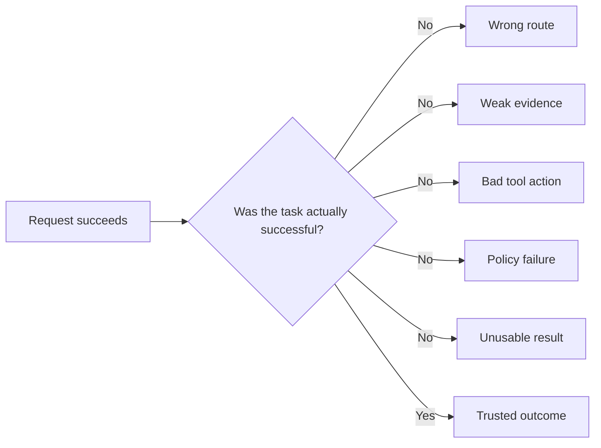

Production observability must therefore answer five classes of questions:

1. **System health:** Are the services, queues, stores, and providers healthy?
2. **Workflow health:** Did the graph progress, terminate, and recover correctly?
3. **Decision quality:** Were routing, planning, evidence, and tool choices appropriate?
4. **Control effectiveness:** Did authorization, guardrails, approvals, and budgets work?
5. **Outcome quality:** Did the user receive a correct, useful, safe, and timely result?

> **Key principle**
>
> The unit of observability is the complete task trajectory, not the individual model call.

---

## 2. Start with an operational contract

Telemetry becomes useful only when the team knows what a healthy run means. An operational contract should define:

- the user goal;
- required evidence;
- permitted tools and actions;
- quality and safety conditions;
- expected workflow states;
- latency and cost budgets;
- retry and escalation limits;
- success, partial success, safe failure, and unsafe failure.

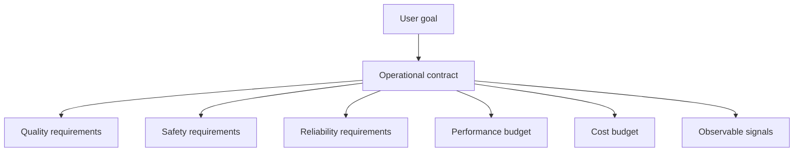

For a sprint-blocker assistant, an operational contract might require:

- read the current sprint from the project system;
- retrieve recent team messages and meeting notes;
- identify blockers with an owner, impact, and source;
- never invent an owner;
- label unavailable sources;
- show progress within one second;
- complete within five seconds for ordinary requests;
- make no write action without an explicit approval;
- escalate when authoritative sources conflict.

This contract determines which signals must be captured. If source coverage is part of success, the telemetry must record which sources were requested, which returned data, and which claims cite them.

---

## 3. The six observability signals

Agent operations benefit from six complementary signal types.

| Signal | Primary question | Example |
|---|---|---|
| Logs | What happened at a point in time? | Tool call rejected by authorization policy |
| Metrics | How often or how much? | p95 workflow latency, retry rate, cost per success |
| Traces | How did this request flow through the system? | Router to retrieval to Jira to model to validator |
| Events | Which state transition occurred? | Approval requested, workflow resumed, safe stop |
| Evaluations | Was the behavior or output good? | Citation coverage, routing accuracy, policy adherence |
| Feedback | How did the user experience the result? | Edited answer, override, CSAT, abandonment |

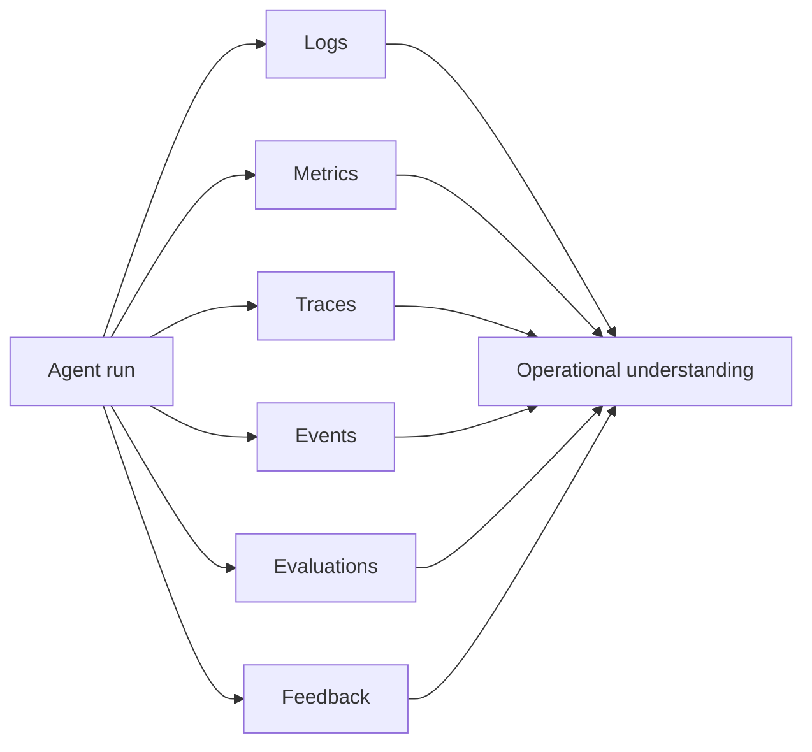

No single signal is enough. A metric can show that retries increased, but a trace is needed to see where. A trace can show a retrieval span, but an evaluation is needed to determine whether the evidence was relevant. User feedback can expose a trust problem even when automated evaluations pass.

---

## 4. Correlation identifiers and the telemetry envelope

Every signal must be joinable. A practical telemetry envelope includes identifiers such as:

- `request_id`: one accepted client request;
- `run_id`: one workflow execution;
- `trace_id`: one distributed trace;
- `span_id`: one operation within the trace;
- `thread_id`: one continuing conversation or workflow thread;
- `user_id_hash`: a privacy-preserving identity reference;
- `tenant_id`: the authorization and isolation boundary;
- `workflow_version`: deployed orchestration version;
- `prompt_version`: prompt or instruction package;
- `model_route`: selected model class and provider route;
- `knowledge_version`: retrieval corpus or index version;
- `policy_version`: active control policy;
- `tool_version`: connector or capability version.

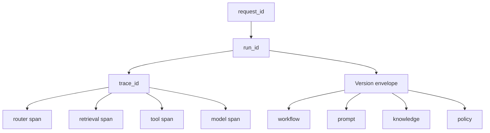

The version envelope is critical. Without it, a team may know that quality fell on Tuesday but not whether the cause was a new prompt, a new model, an index refresh, a policy change, or a tool deployment.

> **Best practice**
>
> Make version identifiers immutable attributes of the run. Do not infer them later from deployment time alone.

---

## 5. Distributed traces for agent workflows

A trace represents the path of one request. Each span represents a meaningful operation with a start, end, status, parent, and attributes.

A project-coordination trace might look like this:

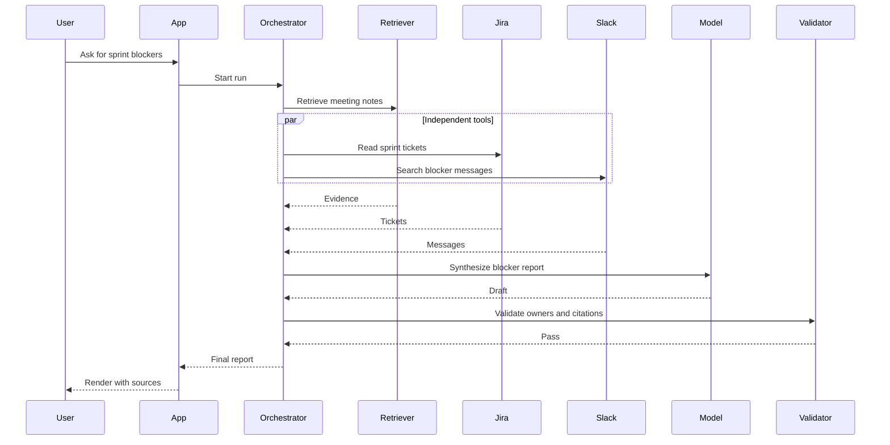

A useful span should include:

- operation name;
- component type;
- status;
- duration;
- retry count;
- input and output references rather than unrestricted raw payloads;
- relevant version identifiers;
- error category;
- policy decision;
- cost or token attributes when applicable;
- quality evaluation references.

Do not create a span for every trivial line of code. Spans should align with operations that matter to performance, reliability, security, or diagnosis.

### 5.1 Suggested span taxonomy

| Span type | Examples |
|---|---|
| Orchestration | classify, plan, route, merge, validate, checkpoint |
| Model | generate, classify, judge, summarize, embed |
| Retrieval | search, filter, rerank, fetch parent document |
| Tool | jira.read, payroll.update, calendar.lookup |
| State | checkpoint.write, memory.read, audit.append |
| Guardrail | authorize, redact, injection.scan, approval.verify |
| Human | approval.wait, reviewer.edit, escalation.resolve |
| Application | render, stream, feedback.capture |

---

## 6. Orchestration telemetry

The orchestration layer decides what happens next. It should expose:

- selected route and alternatives considered;
- plan identifier and task count;
- dependency graph;
- active state;
- completed and pending steps;
- retry and replan counters;
- termination reason;
- escalation reason;
- budget consumption;
- no-progress detection.

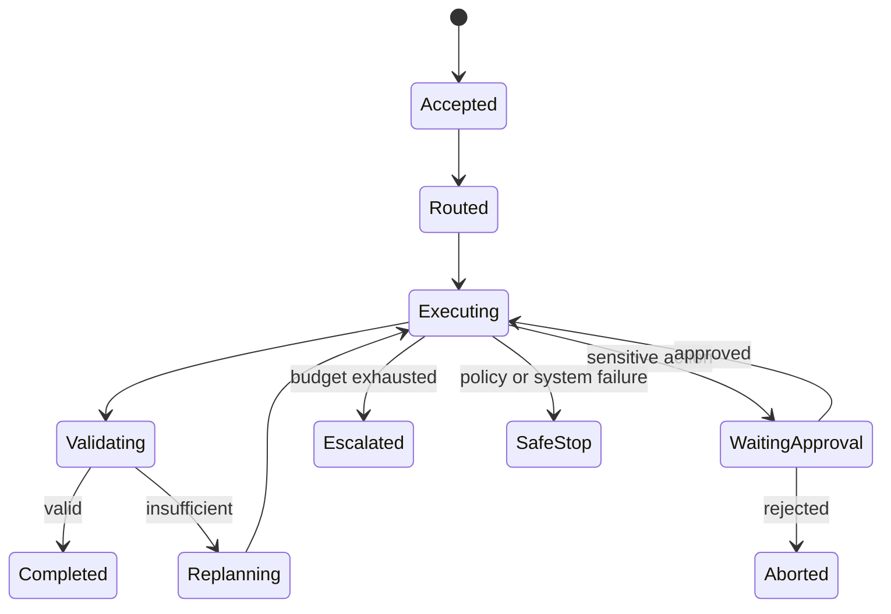

Useful workflow metrics include:

- runs by terminal state;
- average steps per completed task;
- replans per run;
- no-progress stops;
- maximum-hop violations;
- approval wait time;
- partial-completion rate;
- fallback usage;
- recovery success rate.

An increasing average step count can indicate prompt drift, weaker routing, a failing tool, or a hidden loop. It should be investigated before it becomes an obvious incident.

---

## 7. Model telemetry

Model telemetry should support diagnosis without turning every prompt and response into an unrestricted data leak.

Capture:

- model route and version;
- request purpose, such as routing, generation, judging, or summarization;
- input and output token counts;
- latency to first token and completion;
- stop reason;
- structured-output validation status;
- retry count;
- estimated cost;
- context composition summary;
- safety-filter outcomes;
- evaluation references.

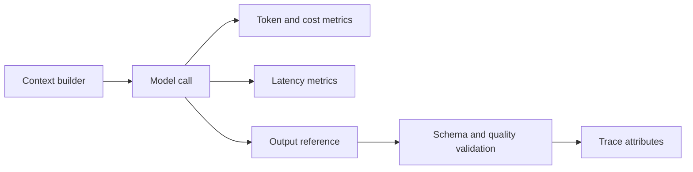

Avoid relying only on provider-reported success. A model request can succeed technically while producing malformed JSON, an unsupported claim, or the wrong action proposal. Model spans should therefore link to downstream validation and evaluation results.

### 7.1 Prompt and context observability

For sensitive systems, store:

- prompt template version;
- variable names and sizes;
- source identifiers;
- truncation decisions;
- system and policy package versions;
- hashes or protected references to full content.

This provides enough information to diagnose context assembly while minimizing raw-data retention.

---

## 8. Retrieval observability

Retrieval is often the hidden cause of poor generation. A retrieval span should record:

- query type and rewrite strategy;
- index and embedding versions;
- requested and returned `top_k`;
- metadata filters;
- authorization filters;
- candidate count;
- reranking strategy;
- selected document identifiers;
- source freshness;
- retrieval latency;
- cache status;
- evidence coverage evaluation.

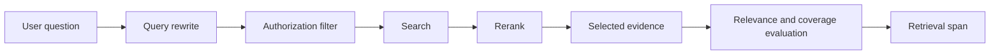

Operational retrieval metrics include:

- zero-result rate;
- low-score-result rate;
- stale-source rate;
- unauthorized-candidate rejection count;
- reranker disagreement;
- citation coverage;
- evidence conflict rate;
- retrieval cache hit rate;
- search and reranking p95 latency.

A rising zero-result rate after an index refresh may indicate ingestion failure, metadata changes, or embedding incompatibility. Observability should connect the symptom to the index and knowledge versions used by the affected run.

---

## 9. Tool and action telemetry

Tool calls turn reasoning into business effects. Their telemetry must support both reliability and auditability.

Capture:

- capability name and version;
- operation class: read, write, delete, external communication, or code execution;
- target system;
- authorization decision;
- approval requirement and approval identifier;
- idempotency key;
- sanitized argument summary;
- start, end, timeout, and retry count;
- result status;
- confirmation-read status;
- side-effect receipt;
- compensation status if rollback is needed.

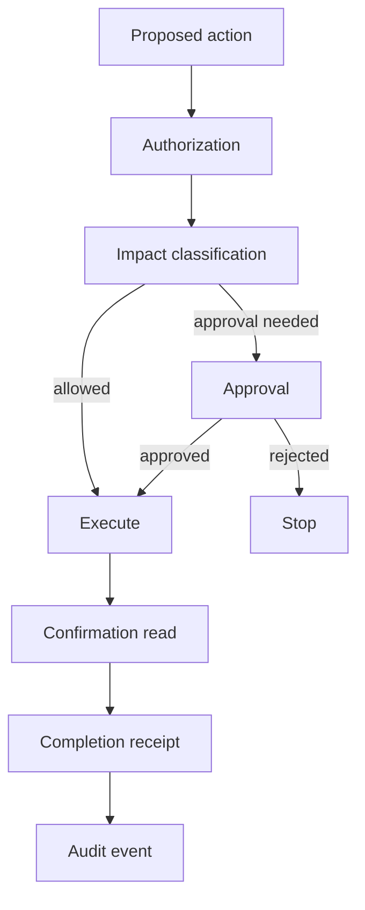

Key tool metrics include:

- tool selection accuracy;
- call success rate;
- timeout rate;
- retry rate;
- ambiguous-write rate;
- duplicate-action blocks;
- approval rejection rate;
- compensation rate;
- read-after-write mismatch;
- errors by dependency and operation.

A tool retry should remain part of the original logical action. Otherwise, repeated calls can appear as unrelated events and duplicate side effects may go unnoticed.

---

## 10. State, memory, and checkpoint telemetry

State enables continuity and recovery, but it can also hide stale or corrupted information. Observe:

- checkpoint creation and restoration;
- state-schema version;
- optimistic-concurrency conflicts;
- memory reads and writes;
- memory source and authority;
- retention and deletion actions;
- compaction or summarization;
- stale-memory rejection;
- cross-agent shared-state access;
- recovery point used after failure.

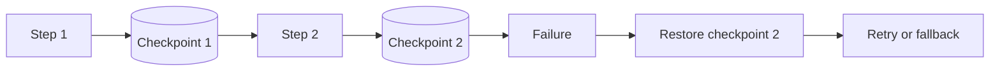

Useful metrics include:

- checkpoint-write latency;
- checkpoint failure rate;
- resume success rate;
- state conflict rate;
- memory hit and rejection rates;
- stale-memory incidents;
- context compaction frequency;
- average state size;
- cross-tenant access blocks.

When a workflow resumes, the trace should show the original run, the resume event, the checkpoint used, and the new execution branch.

---

## 11. Guardrail, policy, and approval telemetry

Controls are only trustworthy when their decisions are visible and measurable.

For each policy decision, record:

- policy version;
- decision point;
- decision: allow, transform, approve, deny, escalate, or safe stop;
- reason code;
- input classification;
- identity and tenant scope;
- action impact;
- transformed fields;
- approval packet and decision reference;
- enforcement point outcome.

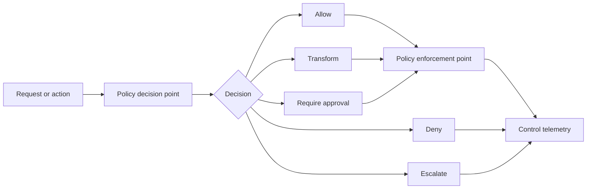

Control metrics include:

- guardrail trigger rate;
- false-positive and false-negative estimates;
- denied-action rate;
- approval rate and wait time;
- policy bypass attempts;
- prompt-injection detection rate;
- sensitive-data redaction count;
- fail-open and fail-closed events;
- safe-stop frequency.

A sudden drop in guardrail triggers can be as suspicious as a sudden increase. It may indicate a disabled control, missing telemetry, or traffic shifting away from the expected path.

---

## 12. User experience and outcome telemetry

Operational success is not just backend completion. The application layer should measure:

- task completion;
- time to first progress;
- time to first useful result;
- abandonment;
- retries initiated by the user;
- edits and overrides;
- approval behavior;
- source expansion and evidence viewing;
- confidence acceptance;
- escalation requests;
- satisfaction and repeat use.

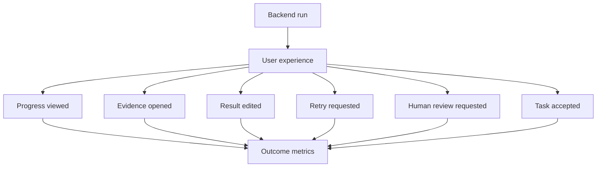

User behavior provides signals that automated evaluation may miss. For example:

- frequent edits can reveal tone, structure, or factual problems;
- frequent evidence expansion may indicate healthy verification or low trust;
- abandonment after an approval request may indicate poor action framing;
- repeated retries can expose weak clarification or unstable generation.

Telemetry should be interpreted carefully. Opening citations is not automatically a sign of distrust, and accepting an answer is not proof of correctness.

---

## 13. Service-level indicators and objectives

A service-level indicator (SLI) is a measured property. A service-level objective (SLO) is a target for that indicator over a defined period and workload.

Agent systems need multidimensional SLOs.

| Dimension | Example SLI | Example objective |
|---|---|---|
| Availability | Accepted runs that start successfully | 99.9% |
| Completion | Tasks reaching valid completion | >= 97% |
| Quality | Evaluated outputs meeting quality floor | >= 95% |
| Grounding | Material claims with valid evidence | >= 98% |
| Safety | Unauthorized consequential actions | 0 |
| Reliability | Tool actions with confirmed outcome | >= 99.5% |
| Latency | p95 automated completion time | <= 5 seconds |
| Cost | Cost per successful ordinary task | <= agreed budget |
| Recovery | Recoverable failures resolved automatically | >= 90% |
| UX | Users accepting result without retry | >= target |

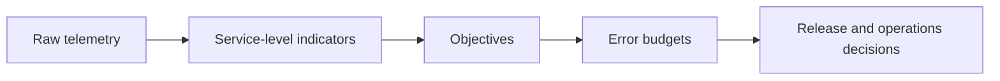

Do not collapse quality, safety, latency, and cost into one opaque score. Hard safety constraints should remain hard constraints, while other dimensions may be optimized within explicit trade-offs.

---

## 14. Error budgets and burn rates

An error budget is the amount of allowed unreliability implied by an SLO. If valid task completion must be 99%, then up to 1% of requests may fail the defined condition during the measurement window.

Error budgets help balance reliability and delivery:

- when the budget is healthy, the team can release changes at a normal pace;
- when the budget is being consumed quickly, risky changes should slow;
- when the budget is exhausted, reliability work and rollback take priority.

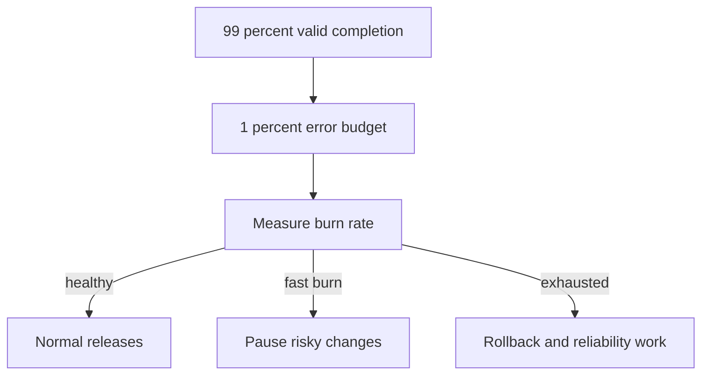

A burn-rate alert measures how quickly the budget is being consumed relative to the allowed rate. Multi-window alerts are useful because they can detect both severe short incidents and slower persistent degradation.

Agent error budgets can include:

- invalid final answers;
- unsupported material claims;
- incorrect routes;
- tool failures not recovered;
- policy violations;
- user-visible timeouts;
- cost overruns;
- unsafe side-effect attempts.

Some events, such as an unauthorized payroll modification, should not be treated as ordinary budget consumption. They require immediate incident handling even if rare.

---

## 15. Dashboards that support decisions

A dashboard should help an operator decide what to do. A useful hierarchy is:

1. **Executive service view:** success, safety, adoption, cost, and SLO status.
2. **Workflow view:** terminal states, route mix, steps, retries, escalations, and versions.
3. **Component view:** model, retrieval, tool, state, and policy performance.
4. **Trace view:** one run with evidence, decisions, errors, and versions.

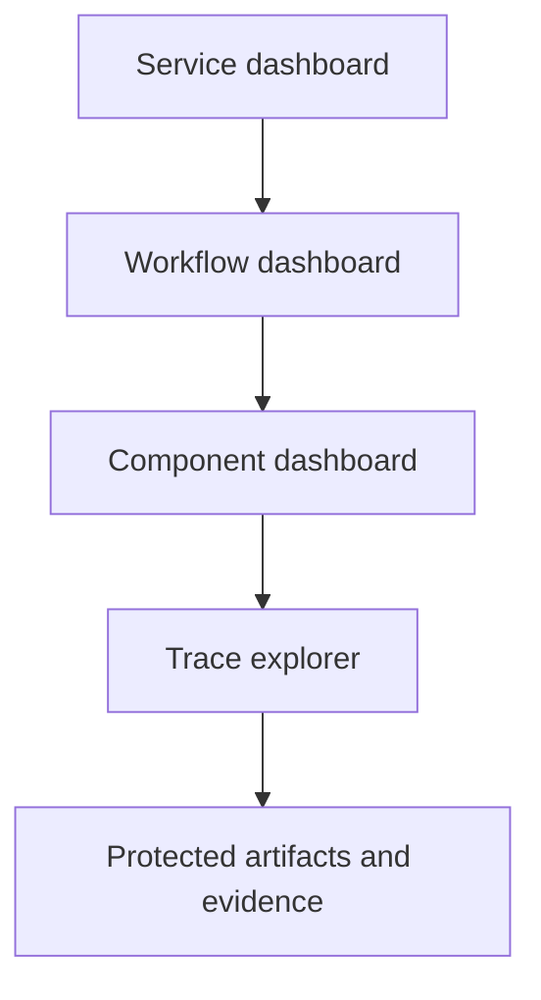

Recommended dashboard panels include:

- successful tasks and partial completions;
- SLO status and error-budget burn;
- p50, p95, and p99 latency;
- time to first progress;
- cost per successful task;
- route and model distribution;
- top tool errors;
- retrieval zero-result and stale-source rates;
- retry and replan counts;
- approval and escalation queues;
- policy decisions;
- evaluation pass rates;
- changes by workflow, prompt, model, index, and policy version.

Avoid dashboards with hundreds of low-level charts but no service contract. They create the appearance of observability without operational clarity.

---

## 16. Alerting without alert fatigue

Alerts should indicate a condition that requires timely action. Every alert should have:

- a clear owner;
- severity;
- affected service or workflow;
- trigger condition;
- user and business impact;
- diagnostic links;
- a runbook;
- escalation path;
- resolution criteria.

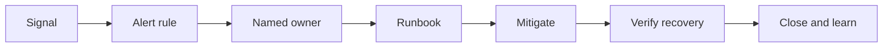

Good alert examples:

- p95 completion latency exceeds the SLO for 15 minutes;
- the retrieval zero-result rate doubles after an index release;
- a write tool's ambiguous-outcome rate exceeds threshold;
- the safe-stop rate rises after a policy deployment;
- model-route cost increases without a corresponding workload change;
- no-progress terminations exceed the baseline;
- citation coverage falls below the release floor;
- cross-tenant access denials rise sharply.

Poor alert examples:

- one ordinary tool timeout;
- every user retry;
- every model refusal;
- raw token usage without budget context;
- alerts with no action or owner.

---

## 17. Incident response for agent systems

Agent incidents can combine software failure, data failure, model behavior, control failure, and business-process impact. A practical incident lifecycle is:

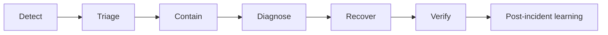

### 17.1 Triage questions

1. What user journey is affected?
2. Is the issue quality, safety, latency, availability, cost, or authorization?
3. Which versions are involved?
4. Is the problem global, tenant-specific, cohort-specific, or tool-specific?
5. Are consequential actions still enabled?
6. Is evidence or state corrupted?
7. Can the service degrade safely?
8. Is rollback possible?

### 17.2 Containment actions

Possible containment actions include:

- disable a write capability;
- route to a read-only fallback;
- force human approval;
- pin the previous prompt, model, index, or policy version;
- isolate a failing dependency;
- reduce concurrency;
- invalidate poisoned cache entries;
- stop a workflow class;
- preserve traces and state for investigation.

### 17.3 Incident packet

A useful incident packet contains:

- incident identifier;
- affected run and trace identifiers;
- first and last known occurrence;
- impacted tenants and workflows;
- symptom and user impact;
- relevant version envelope;
- failing spans and error categories;
- policy and approval history;
- evidence and tool receipts;
- containment actions;
- owner and next checkpoint.

---

## 18. Runbooks for common failures

A runbook converts an alert into a repeatable response.

### 18.1 Retrieval quality degradation

1. Compare zero-result, relevance, and citation metrics by index version.
2. Check ingestion completion and document counts.
3. Check embedding and metadata compatibility.
4. Compare before-and-after sample queries.
5. Roll back or route to the previous index if required.
6. Re-evaluate grounding before restoring traffic.

### 18.2 Tool timeout spike

1. Identify the dependency, operation, region, and tenant scope.
2. Check queue depth, provider status, and connection saturation.
3. Apply circuit breaker and fallback.
4. Stop retries if they increase load.
5. Return partial results when safe.
6. Reconcile ambiguous writes before retrying.

### 18.3 Cost anomaly

1. Segment by route, model, workflow, tenant, and version.
2. Check prompt and context growth.
3. Check loops, retries, and duplicate tool calls.
4. Check cache hit rate and model-route distribution.
5. Apply budget limits or route to a lower-cost path.
6. Verify that quality and safety remain above floors.

### 18.4 Policy-denial spike

1. Determine whether traffic or policy changed.
2. Compare reason codes and impacted cohorts.
3. Verify policy deployment and enforcement points.
4. Check for attacks, prompt injection, or malformed requests.
5. Roll back an incorrect policy or isolate hostile traffic.
6. Review denied high-impact actions manually.

---

## 19. Replay and reproducibility

A failed trajectory should be reproducible enough to diagnose. Exact reproduction can be difficult because models, external tools, data, and time-sensitive systems change.

A replay package should include:

- input reference;
- workflow, prompt, model, knowledge, policy, and tool versions;
- route and plan;
- protected snapshots or references to retrieved evidence;
- tool request and response references;
- state checkpoints;
- random seed or decoding settings when available;
- evaluation results;
- terminal reason.

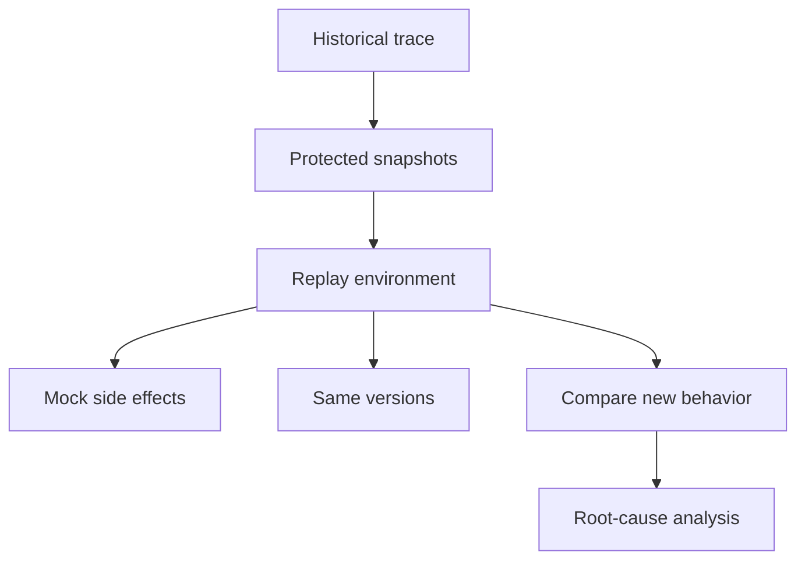

Consequential tools should be mocked or forced into dry-run mode during replay. A diagnostic replay must never resend an email, change payroll, create a purchase order, or repeat another irreversible action.

### 19.1 Counterfactual replay

Counterfactual replay changes one variable at a time:

- old prompt vs new prompt;
- old model vs new model;
- old index vs new index;
- policy A vs policy B;
- routing strategy A vs B.

This supports change attribution and regression analysis.

---

## 20. Versioning and change attribution

Every behavior change should be attributable to a controlled version.

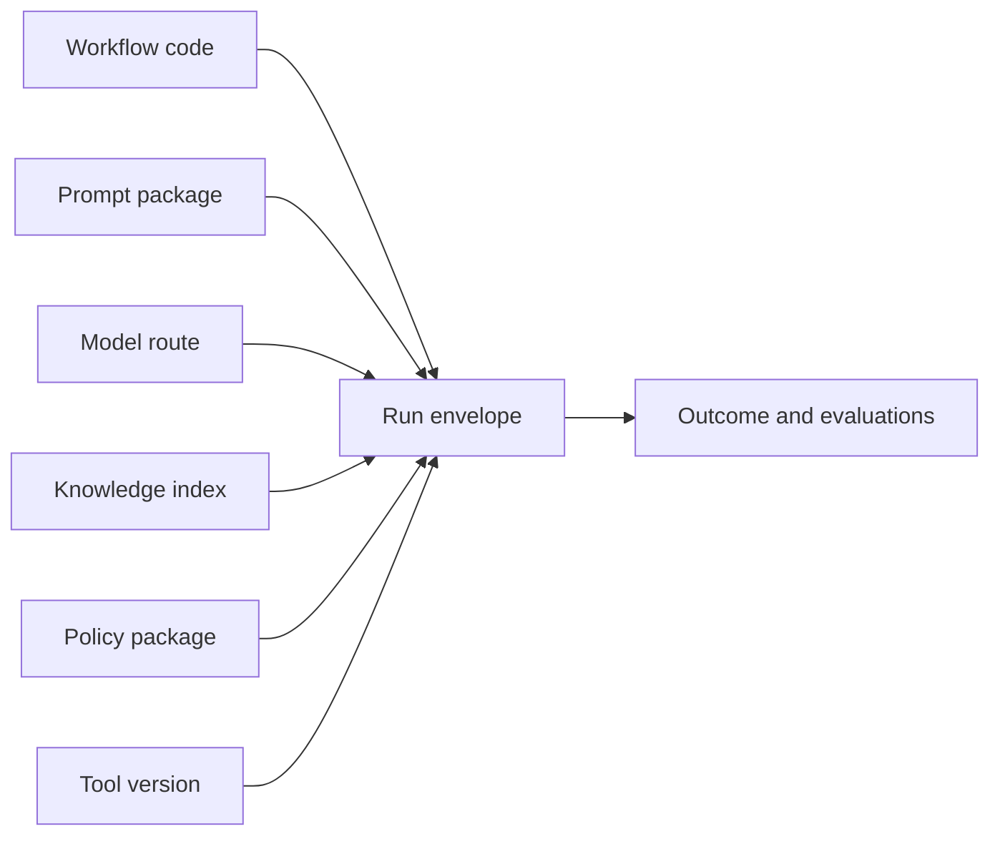

Track at least:

- application version;
- workflow graph version;
- prompt version;
- model provider and route;
- retrieval index and embedding version;
- policy version;
- schema version;
- tool connector version;
- experiment assignment.

When metrics change, compare them across versions. Without this discipline, teams fall back to speculation and manual log inspection.

---

## 21. Safe deployment patterns

Agent changes should progress through controlled stages.

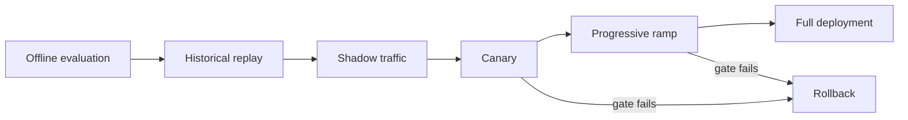

### 21.1 Shadow mode

The new version observes real inputs but does not control the user-visible result or execute side effects. Compare routes, evidence, output, latency, cost, and policy decisions.

### 21.2 Canary mode

A small, controlled traffic segment receives the new version. Use release gates for:

- task success;
- grounding;
- safety;
- latency;
- cost;
- retry and escalation behavior;
- user feedback.

### 21.3 Rollback

Rollback must cover more than code. The team may need to restore:

- prompt package;
- model route;
- retrieval index;
- policy version;
- tool connector;
- state schema compatibility.

A new state schema can make rollback difficult. Migration and backward compatibility should be designed before deployment.

---

## 22. Privacy, retention, and telemetry governance

Observability data can contain sensitive information, model inputs, retrieved documents, user identities, and action details. More logging is not automatically safer.

Apply the following controls:

- data minimization;
- field classification;
- redaction and tokenization;
- encrypted storage and transport;
- role-based access;
- tenant separation;
- retention periods by signal type;
- deletion and legal-hold processes;
- audit access to sensitive traces;
- protected artifact stores for payloads;
- sampled rather than universal raw-content capture.

```mermaid
flowchart TB
    RAW[Raw telemetry] --> CLASS[Classify fields]
    CLASS --> REDACT[Redact or tokenize]
    REDACT --> ROUTE{Storage class}
    ROUTE -->|metrics| MET[(Metrics store)]
    ROUTE -->|traces| TR[(Trace store)]
    ROUTE -->|sensitive artifacts| SEC[(Protected store)]
    SEC --> ACCESS[Restricted access and audit]
```

### 22.1 Sampling

High-volume traces may require sampling. Common approaches include:

- head sampling: decide at request start;
- tail sampling: retain traces based on outcome;
- error-biased sampling: retain failures and anomalies;
- risk-biased sampling: retain high-impact workflows;
- cohort sampling: preserve representative traffic segments.

Always retain enough information for serious security and consequential-action investigations, subject to legal and privacy requirements.

### 22.2 Cardinality control

Metrics systems can become unstable when labels contain unbounded values such as raw user IDs, document IDs, prompts, or error messages. Use bounded dimensions for metrics and put high-cardinality details in traces or protected logs.

---

## 23. Operating the human review queue

Human-in-the-loop systems create an operational queue that must be managed like any other production dependency.

Observe:

- queue depth;
- oldest pending item;
- approval wait time;
- reviewer load;
- approval, rejection, and edit rates;
- expired approvals;
- repeated escalation reasons;
- post-review outcome quality.

```mermaid
flowchart LR
    AGENT[Agent escalation] --> QUEUE[Review queue]
    QUEUE --> ASSIGN[Assign reviewer]
    ASSIGN --> DEC{Decision}
    DEC -->|approve| RESUME[Resume]
    DEC -->|edit| RESUME
    DEC -->|reject| STOP[Stop]
    DEC -->|need more data| AGENT
```

A review queue without ownership, service objectives, and prioritization can become the slowest and least visible part of the system.

---

## 24. Production reference architecture

```mermaid
flowchart TB
    USER[Users and channels] --> APP[Application and BFF]
    APP --> ORCH[Agent orchestrator]
    ORCH --> MODEL[Model gateway]
    ORCH --> RET[Retrieval services]
    ORCH --> TOOLS[Tool gateway]
    ORCH --> STATE[State and memory]
    ORCH --> POLICY[Policy and approval service]

    APP --> SDK[Telemetry SDK]
    ORCH --> SDK
    MODEL --> SDK
    RET --> SDK
    TOOLS --> SDK
    STATE --> SDK
    POLICY --> SDK

    SDK --> COL[Telemetry collector]
    COL --> MET[(Metrics)]
    COL --> TRACE[(Traces)]
    COL --> LOG[(Logs and events)]
    COL --> ART[(Protected artifacts)]
    COL --> EVAL[Evaluation pipeline]

    MET --> DASH[Dashboards and SLOs]
    TRACE --> DASH
    LOG --> ALERT[Alerts and incidents]
    EVAL --> DASH
    ALERT --> RUNBOOK[Runbooks and responders]
    DASH --> RELEASE[Release gates]
```

The architecture separates telemetry collection from storage and operations. Sensitive artifacts are protected separately from ordinary metrics and traces. Evaluation results are correlated with the same run and version identifiers as operational telemetry.

---

## 25. Worked example: project-blocker assistant

Consider an assistant that reads sprint tickets, recent team messages, and meeting notes, then produces a blocker table.

### 25.1 Operational contract

- every blocker must have evidence;
- owner must come from an authoritative source or be marked unknown;
- unavailable sources must be stated;
- read-only execution requires no approval;
- any ticket update requires approval;
- p95 automated completion should remain within the agreed objective;
- cost and retries must stay within budget.

### 25.2 Trace shape

```mermaid
flowchart LR
    A[accept] --> C[classify]
    C --> P[plan]
    P --> J[Jira read]
    P --> S[Slack search]
    P --> D[Docs retrieval]
    J --> M[merge]
    S --> M
    D --> M
    M --> G[generate]
    G --> V[validate]
    V --> R[render]
```

### 25.3 Signals

- route: `project_status`;
- tool success by source;
- source coverage;
- evidence identifiers;
- model and prompt versions;
- claim validation results;
- missing-owner count;
- partial-result flag;
- latency per source and total;
- cost per successful report;
- user edits and evidence views.

### 25.4 Example incident

After a connector update, Slack searches return empty results but no technical error. The workflow still completes using Jira and meeting notes.

A purely infrastructure-oriented monitor may report success. Agent observability detects:

- Slack result count dropped to zero;
- source-coverage score fell;
- partial-result rate increased;
- user retries increased;
- affected runs share the same tool version.

The operator can disable the connector version, route to a backup search, and label the result as partial until recovery.

---

## 26. Reference implementation

The example at:

```text
examples/29-production-observability/observability_operations.py
```

implements a small observability control plane using only the Python standard library. It demonstrates:

- run, trace, and span identifiers;
- structured span attributes;
- workflow events;
- model, retrieval, and tool telemetry;
- service-level indicator calculation;
- SLO evaluation;
- alert generation;
- error-budget burn estimation;
- incident-packet creation;
- version attribution;
- privacy-aware references rather than raw prompts.

Run it with:

```bash
python observability_operations.py
```

The script writes a machine-readable `sample_output.json` file in the same directory.

---

## 27. Operational checklist

### Contracts and ownership

- [ ] Each workflow has a documented success and safe-failure contract.
- [ ] Every SLO and alert has an owner.
- [ ] Consequential actions have explicit audit and receipt requirements.

### Correlation and versions

- [ ] Request, run, trace, thread, and tenant identifiers are correlated.
- [ ] Workflow, prompt, model, index, policy, schema, and tool versions are captured.
- [ ] Experiments and canary assignments are recorded.

### Signals

- [ ] Orchestration, retrieval, model, tool, state, guardrail, and UX spans are present.
- [ ] Evaluations and user feedback link to the run.
- [ ] Metrics avoid unbounded label cardinality.

### Reliability

- [ ] Retry, replan, fallback, safe-stop, and escalation reasons are visible.
- [ ] Idempotency and ambiguous-write reconciliation are observable.
- [ ] Checkpoint and resume behavior can be diagnosed.

### Privacy and security

- [ ] Raw payload logging is minimized.
- [ ] Sensitive artifacts are protected separately.
- [ ] Retention and deletion policies are enforced.
- [ ] Trace access is audited.

### Operations

- [ ] Dashboards show service, workflow, component, and trace views.
- [ ] Alerts are actionable and linked to runbooks.
- [ ] Incident packets can be generated quickly.
- [ ] Replay uses mocks for side-effecting tools.
- [ ] Canary and rollback procedures are tested.

---

## 28. Common mistakes

### Mistake 1: Monitoring only infrastructure

Healthy CPUs and HTTP status codes do not prove correct routing, evidence, or outcomes.

### Mistake 2: Logging every prompt and response

This creates privacy, security, cost, and retention risk. Prefer structured metadata and protected references.

### Mistake 3: No version envelope

Without version attribution, root-cause analysis becomes guesswork.

### Mistake 4: Metrics without traces

Aggregates show that a problem exists but often cannot explain one request.

### Mistake 5: Traces without evaluations

A trace shows what happened but not whether the route, evidence, or answer was good.

### Mistake 6: Alerts on every event

This causes alert fatigue and teaches operators to ignore the system.

### Mistake 7: Replaying real side effects

Diagnostic replay must never repeat consequential actions.

### Mistake 8: Treating human review as invisible

Review queues need ownership, priorities, service objectives, and telemetry.

### Mistake 9: Optimizing averages only

Tail latency, rare safety failures, and high-impact workflows deserve separate attention.

### Mistake 10: One dashboard for every audience

Executives, on-call engineers, evaluators, security teams, and product managers need different views over the same correlated signals.

---

## 29. Knowledge check

1. Why can a technically successful model call still represent a failed agent task?
2. What is the difference between a log, metric, trace, event, evaluation, and user-feedback signal?
3. Which identifiers should connect a user request to a workflow trace?
4. Why should prompt, model, knowledge, policy, and tool versions be captured on every run?
5. What telemetry should a retrieval span include?
6. How does a completion SLO differ from a grounding SLO?
7. What is an error budget, and how does burn rate affect release decisions?
8. Why should high-impact policy violations not be treated as ordinary budget consumption?
9. What must an incident packet contain?
10. Why should side-effecting tools be mocked during replay?
11. How can high-cardinality metric labels damage observability systems?
12. What makes an alert actionable?

---

## 30. Interview questions

### Foundation

1. How does observability for an LLM application differ from traditional API monitoring?
2. Design a trace for a RAG-based support assistant.
3. Which model-call attributes are useful, and which data should not be logged by default?
4. How would you monitor a human-approval step?

### Intermediate

5. Define quality, safety, latency, reliability, and cost SLOs for a supplier-recommendation agent.
6. How would you identify whether a quality regression came from a prompt, model, index, or tool change?
7. Design alerts for retry storms without alerting on every retry.
8. How would you detect a connector that returns empty but technically successful responses?
9. Explain how to correlate offline evaluation with production traces.

### Advanced

10. Design a privacy-aware telemetry architecture for a multi-tenant HR agent.
11. How would you implement tail-based sampling for high-risk agent runs?
12. Design a replay system that reproduces failures but prevents repeated side effects.
13. How would you manage SLO error budgets for quality and latency simultaneously?
14. Describe a canary-release strategy for a new routing policy and retrieval index.
15. How would you operate an agent system during a third-party model-provider outage?
16. Design an incident response for suspected cross-tenant retrieval leakage.

---

## 31. Summary

Production agent systems require more than logs and uptime checks. Teams must observe the entire trajectory: user intent, routing, planning, evidence, model calls, tools, state, policy decisions, approvals, validation, user interaction, and final outcomes.

The most important practices are:

- define an operational contract before collecting telemetry;
- correlate every signal with stable run, trace, tenant, and version identifiers;
- combine logs, metrics, traces, events, evaluations, and feedback;
- observe orchestration, retrieval, tools, memory, guardrails, and UX;
- measure multidimensional SLOs for quality, safety, reliability, latency, and cost;
- use error budgets and actionable alerts to guide operations;
- build runbooks, incident packets, replay, and rollback before incidents occur;
- minimize sensitive telemetry and govern retention and access;
- attribute changes to prompt, model, index, policy, workflow, and tool versions;
- operate human review as a visible production queue.

Observability is not an afterthought added after deployment. It is the control surface through which teams understand, improve, and safely operate agentic systems.
