# Chapter 30 - AI-Native Product Management

> **Source basis:** The board places AI across the complete product lifecycle: discovery, planning, design and development, launch, measurement, and growth. It illustrates a continuous loop in which customer behavior generates data and feedback, AI supports analysis, the product manager applies judgment, a product decision leads to an experiment or release, and the resulting behavior feeds the next cycle. It also contrasts AI-assisted research, prompted documentation, and agent-based workflows with manual research, documentation, and prioritization, arguing that AI-native work creates faster learning loops [Board, pp. 5, 43-45]. This chapter preserves that framing and expands it into a complete operating model for product managers building or using AI systems. Material on decision contracts, metric trees, model-risk reviews, experiment governance, product operating cadences, and the reference implementation is **Supplementary**.

---

## Learning objectives

By the end of this chapter, you should be able to:

1. Explain how AI-native product management differs from using AI as a writing assistant.
2. Map AI-assisted activities across discovery, planning, design, development, launch, and growth.
3. Design a continuous product learning loop that combines data, AI analysis, PM judgment, experiments, and customer behavior.
4. Separate tasks that AI may assist from decisions that require accountable human ownership.
5. Frame AI product opportunities using users, jobs, evidence, constraints, and measurable outcomes.
6. Build a metric system spanning user value, business value, model quality, safety, reliability, and cost.
7. Prioritize AI opportunities using evidence quality, expected impact, feasibility, risk, and reversibility.
8. Use prompting, retrieval, and agent workflows to accelerate product work without weakening evidence standards.
9. Define release gates for AI features and agentic workflows.
10. Design feedback loops that improve the product without creating biased or unsafe optimization.
11. Collaborate effectively with engineering, ML, design, legal, security, and operations.
12. Implement a dependency-free product learning-loop controller that converts signals into governed product decisions.

---

## 1. What makes product management AI-native?

Using an LLM to rewrite a document does not make a team AI-native. AI-native product management changes how the team learns, decides, builds, and operates.

A traditional product process often treats research, planning, delivery, and measurement as separate phases. Research is collected periodically, requirements are written manually, development proceeds against a mostly fixed plan, and post-launch analysis occurs later.

An AI-native process attempts to shorten the distance between signal and decision:

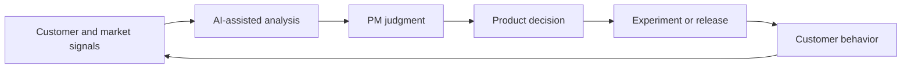

The board presents this as a learning loop rather than a one-way delivery pipeline [Board, p. 44]. The important shift is not that AI makes every decision. The shift is that AI can continuously organize evidence, surface patterns, generate alternatives, simulate implications, automate low-risk work, and monitor outcomes. Human product leaders remain responsible for goals, trade-offs, risk, and accountability.

> **Key principle**
>
> AI-native product management uses AI to increase the frequency and quality of learning, not merely the volume of artifacts.

---

## 2. Traditional PM work versus AI-native PM work

The board contrasts manual research, documentation, and prioritization with AI-assisted research, prompted documentation, and agent-based workflows [Board, p. 45]. The distinction can be summarized as follows.

| Traditional pattern | AI-native pattern | Product implication |
|---|---|---|
| Periodic manual research | Continuous AI-assisted synthesis | Faster detection of emerging needs |
| Static documents | Prompted and evidence-linked documents | Easier updates and traceability |
| Manual prioritization | Decision support with explicit scoring | More consistent comparison of options |
| One-time analysis | Persistent monitoring and feedback loops | Earlier detection of drift or failure |
| PM coordinates every handoff | Agents automate bounded workflow steps | More PM attention for judgment and strategy |
| Success measured mainly by delivery and adoption | Success includes quality, safety, trust, reliability, and learning | Broader product accountability |

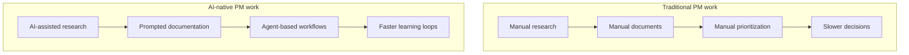

AI-native does not mean fully autonomous. A mature operating model combines three modes:

1. **Assist:** AI drafts, summarizes, classifies, or compares.
2. **Recommend:** AI proposes an action with evidence, confidence, and alternatives.
3. **Act:** AI executes a bounded, reversible, policy-approved action.

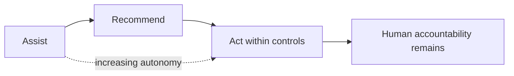

The correct mode depends on impact, reversibility, evidence quality, policy, and organizational readiness.

---

## 3. The AI-native product lifecycle

The board maps AI support across discovery, planning, design and development, launch, measurement, and growth [Board, p. 43]. This chapter uses the same lifecycle while treating it as iterative rather than linear.

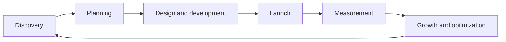

Each stage has a different product question.

| Lifecycle stage | Core question | Typical AI contribution |
|---|---|---|
| Discovery | What problem is worth solving? | Synthesize feedback, detect themes, scan competitors |
| Planning | What should we do next? | Compare options, forecast risk, draft roadmaps |
| Design | What experience should users have? | Generate flows, copy, variants, and edge cases |
| Development | How do we specify and validate it? | Draft PRDs, acceptance criteria, tests, and prototypes |
| Launch | Are we ready and how will users understand it? | Segment audiences, produce assets, generate FAQs |
| Measurement | Did it create the intended outcome? | Analyze behavior, model quality, safety, and cost |
| Growth | What should we improve next? | Detect churn signals, propose experiments, monitor drift |

The lifecycle is not a license to apply AI everywhere. The product manager should identify where AI changes the quality, speed, or economics of learning enough to justify the complexity.

---

## 4. Product framing before solution selection

AI projects often begin with a technology statement: "We should build an agent" or "We need a chatbot." A stronger product frame begins with the user and the decision.

A practical opportunity statement contains:

- **User:** Who experiences the problem?
- **Job:** What are they trying to accomplish?
- **Current friction:** What makes the job slow, costly, confusing, or risky?
- **Evidence:** What observations support the problem?
- **Desired outcome:** What measurable change matters?
- **Constraints:** What privacy, policy, latency, or workflow limits apply?
- **AI hypothesis:** Why might AI outperform a simpler solution?
- **Fallback:** What happens when the AI is uncertain or unavailable?

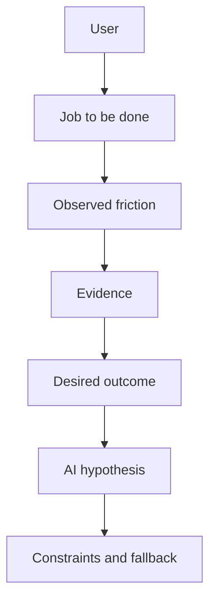

### Example: sprint blocker reporting

A weak framing is:

> Build an agent that summarizes Jira and Slack.

A stronger framing is:

> Engineering managers spend 45 minutes before each stand-up reconciling blocked tickets, chat messages, and meeting notes. We want to reduce preparation time while preserving owner accuracy, source visibility, and human control over escalation. The system may read project data but must not change ticket status without approval.

The stronger framing makes architecture and evaluation decisions possible.

---

## 5. Discovery with AI

Discovery seeks evidence about users, problems, environments, and alternatives. AI can make discovery faster, but it can also create false confidence by compressing weak data into polished summaries.

### 5.1 Signal sources

Useful discovery signals include:

- interviews and usability sessions;
- support tickets and complaint logs;
- search queries and help-center behavior;
- product analytics and event sequences;
- sales calls and win/loss notes;
- churn reasons;
- survey responses;
- operational incidents;
- competitor materials;
- community discussions;
- field observations.

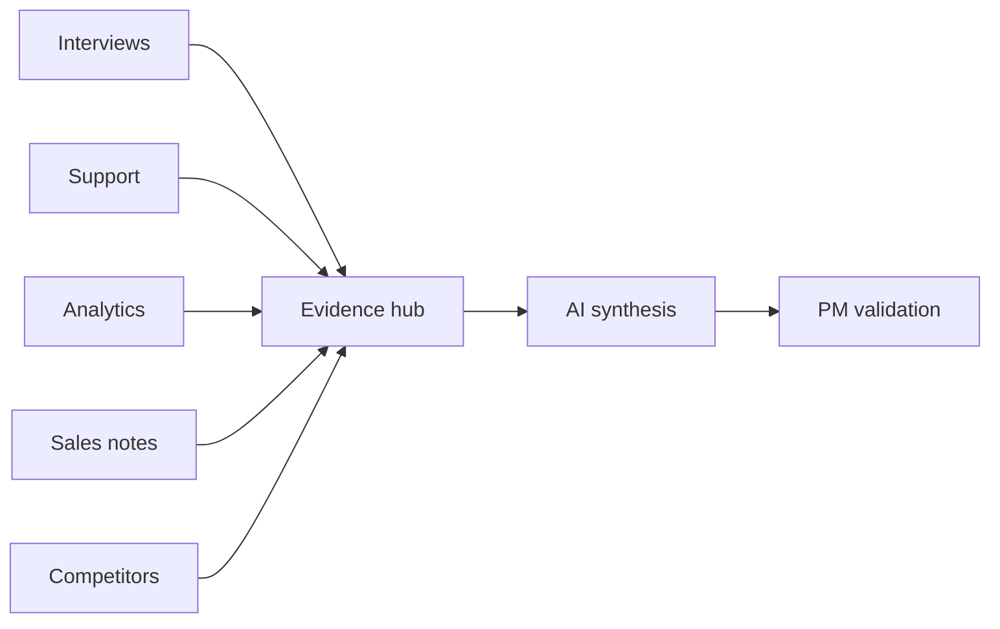

### 5.2 Appropriate uses of AI in discovery

AI is useful for:

- clustering large volumes of qualitative feedback;
- extracting recurring jobs, pain points, and workarounds;
- summarizing evidence by user segment;
- identifying contradictions;
- proposing interview follow-ups;
- generating alternative interpretations;
- mapping feedback to an existing taxonomy;
- finding evidence linked to a product hypothesis.

AI should not silently replace direct observation. A generated theme must link back to source evidence. The product manager should be able to inspect examples, sample distribution, date range, and coverage.

> **Evidence rule**
>
> A theme without traceable examples is a hypothesis, not a discovery finding.

### 5.3 Discovery synthesis contract

A robust synthesis request asks for:

- the theme;
- supporting examples;
- counterexamples;
- affected segments;
- frequency or coverage;
- confidence;
- evidence gaps;
- recommended next research step.

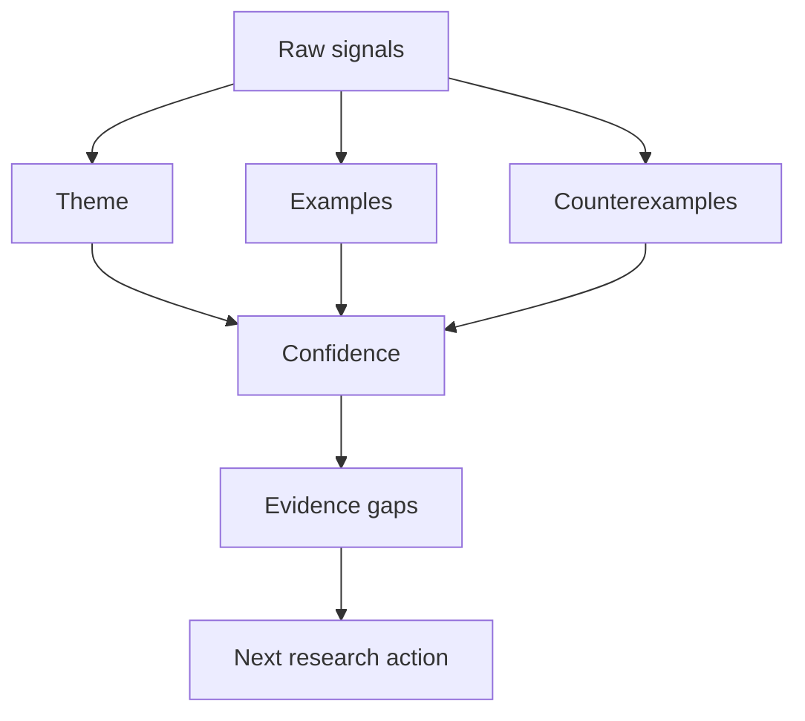

---

## 6. Planning and prioritization

Planning converts validated problems into a sequence of investments. AI can help compare opportunities, but prioritization remains a judgment problem because strategic value, risk, timing, and organizational capability are not fully observable in data.

### 6.1 A decision-oriented backlog

A backlog item should contain more than a title. For AI products, include:

- target user and job;
- problem evidence;
- intended outcome;
- baseline metric;
- solution hypothesis;
- model or automation dependency;
- safety and policy constraints;
- data readiness;
- expected cost;
- reversibility;
- experiment design;
- decision owner.

### 6.2 Multi-factor opportunity scoring

A supplementary scoring model can combine:

- user impact;
- strategic alignment;
- evidence strength;
- confidence in feasibility;
- learning value;
- time sensitivity;
- delivery effort;
- operational cost;
- safety and compliance risk;
- irreversibility.

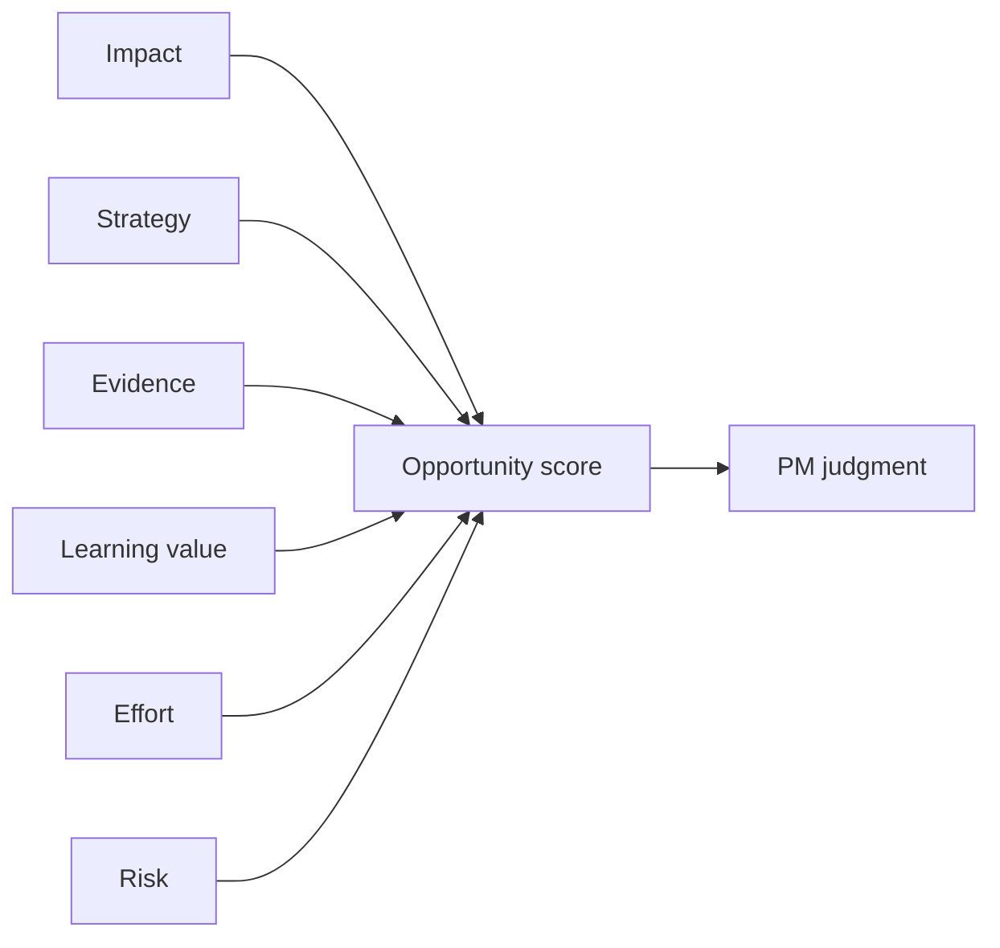

The score should organize the discussion, not decide it automatically. A high numerical score based on weak evidence is not strong prioritization.

### 6.3 Roadmaps for adaptive systems

Traditional roadmaps often emphasize feature delivery. AI-native roadmaps should also include capability and learning milestones:

- data collection and labeling;
- evaluation-set creation;
- retrieval-quality improvements;
- model or prompt upgrades;
- guardrail coverage;
- human-review workflows;
- latency and cost targets;
- monitoring and rollback readiness;
- expansion of approved autonomy.

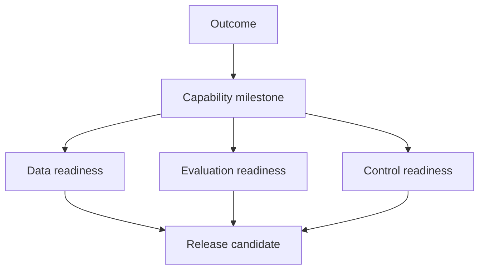

---

## 7. Design for probabilistic behavior

AI products are not deterministic interfaces wrapped around predictable logic. The product experience must account for uncertainty, variation, and failure.

Design questions include:

- How will the system communicate what it understood?
- When will it ask a clarifying question?
- How will it show sources or evidence?
- How will users edit or correct the result?
- What actions require approval?
- How can users interrupt, reset, or abort?
- What happens when a tool fails?
- How is partial success displayed?
- What is the safe fallback?

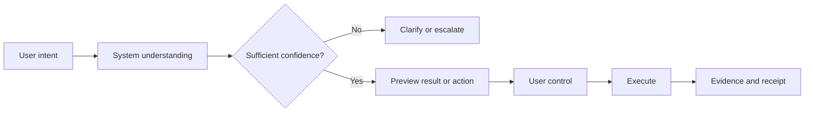

### 7.1 Progressive disclosure

Do not expose every internal step by default. Show the information users need to trust and control the outcome:

1. concise result;
2. supporting evidence;
3. assumptions and confidence;
4. action history;
5. technical trace for authorized operators.

### 7.2 Designing for correction

A correction mechanism is a product feature, not merely a feedback icon. Corrections should be typed when possible:

- wrong source;
- missing context;
- incorrect classification;
- unsafe recommendation;
- wrong tool action;
- outdated policy;
- poor formatting;
- user preference.

Typed corrections improve both product analytics and future evaluation.

---

## 8. Development and delivery

The board shows AI assisting with prioritization, PRDs, wireframes, test cases, prototypes, launch assets, and measurement [Board, p. 43]. These artifacts are useful only when connected to evidence and acceptance criteria.

### 8.1 AI-assisted requirements

AI can draft:

- problem statements;
- user stories;
- functional requirements;
- non-functional requirements;
- acceptance criteria;
- edge cases;
- risk scenarios;
- data contracts;
- evaluation cases;
- rollout plans.

A PM should review requirements for hidden assumptions. For agentic systems, a requirement set should explicitly define:

- allowed data sources;
- allowed tools and permissions;
- completion criteria;
- abstention and escalation rules;
- approval requirements;
- state retention;
- auditability;
- performance budgets;
- failure behavior.

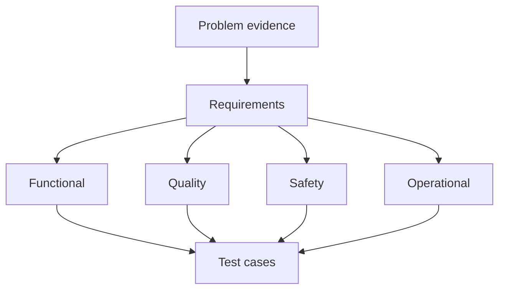

### 8.2 Prototyping strategy

Use the cheapest prototype that answers the riskiest question.

| Uncertainty | Prototype |
|---|---|
| Do users understand the interaction? | Clickable or conversational mock |
| Can the model perform the task? | Prompt and evaluation prototype |
| Can retrieval find the right evidence? | Small retrieval benchmark |
| Can tools complete the workflow safely? | Sandbox workflow with fake actions |
| Will users trust the recommendation? | Wizard-of-Oz study with evidence UI |
| Can the system meet latency and cost targets? | Instrumented technical spike |

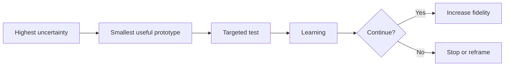

---

## 9. Launch readiness for AI products

A feature-complete system is not necessarily launch-ready. AI launches require evidence that the system performs acceptably across quality, safety, reliability, UX, cost, and operations.

### 9.1 Release-gate dimensions

A release gate may include:

- task-success rate;
- groundedness or evidence coverage;
- tool-selection accuracy;
- policy adherence;
- harmful-output rate;
- cohort fairness thresholds;
- escalation precision;
- p95 latency;
- cost per successful task;
- recovery rate;
- human-review capacity;
- rollback readiness.

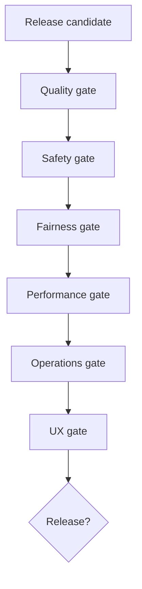

### 9.2 Progressive release

Prefer staged exposure:

1. offline evaluation;
2. internal dogfood;
3. shadow mode;
4. limited pilot;
5. canary release;
6. gradual expansion;
7. continuous monitoring.


The product manager owns the decision criteria and the learning plan, even when technical teams implement the gates.

---

## 10. Measurement: more than adoption

AI products require a broader metric system than ordinary feature analytics. A system may have high usage while producing weak, unsafe, or costly outcomes.

### 10.1 Six metric layers

1. **User outcome:** Did the user complete the job?
2. **Experience:** Was the interaction understandable and controllable?
3. **Model and retrieval quality:** Was the answer correct, relevant, and grounded?
4. **Agent behavior:** Were routes, tools, retries, and escalations appropriate?
5. **Safety and fairness:** Were policies followed across groups and contexts?
6. **Operations and economics:** Was performance reliable and cost-effective?

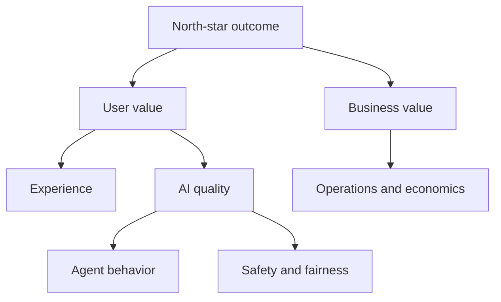

### 10.2 Example metric tree: support triage agent

| Layer | Metric |
|---|---|
| User outcome | Time to correct owner assignment |
| Experience | Clarification rate, edit rate, abandonment |
| Quality | Category accuracy, severity accuracy |
| Agent behavior | Correct tool use, unnecessary tool calls |
| Safety | Unauthorized data access, policy violations |
| Operations | p95 latency, cost per triaged ticket |
| Business | Reduced manual triage time, SLA improvement |

### 10.3 Guardrail metrics versus optimization metrics

Optimization metrics are improved continuously. Guardrail metrics define boundaries that must not be crossed.

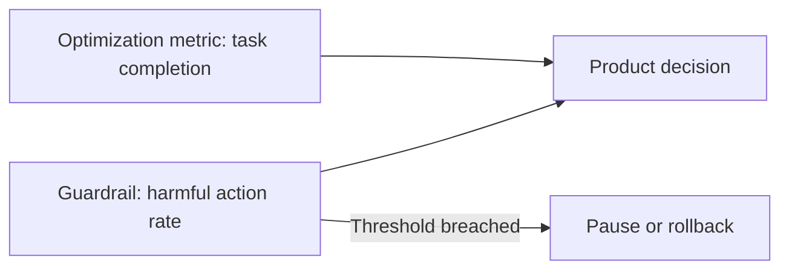

A team should never trade a hard safety threshold for a modest gain in engagement.

---

## 11. Experimentation and learning loops

The board's product loop connects customer behavior to data, AI analysis, PM judgment, a decision, and an experiment or release [Board, p. 44]. A disciplined experiment loop makes each step explicit.

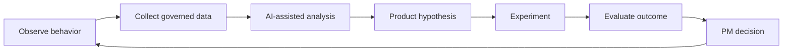

### 11.1 Experiment contract

Each experiment should define:

- target population;
- hypothesis;
- expected mechanism;
- primary metric;
- guardrail metrics;
- minimum detectable effect or decision threshold;
- exposure duration;
- stop conditions;
- analysis method;
- owner;
- follow-up decision.

### 11.2 AI-specific experiment risks

AI experiments may be confounded by:

- model-version changes;
- prompt changes;
- index refreshes;
- provider variation;
- non-deterministic output;
- changing user behavior;
- reviewer learning;
- feedback-loop effects;
- traffic mix changes.

Use immutable version envelopes so the team can attribute outcomes to the system that produced them.

---

## 12. Feedback as a governed product asset

Feedback is not automatically training data. It can be incomplete, manipulated, biased, or context-dependent.

A feedback pipeline should distinguish:

- explicit ratings;
- user edits;
- rejected recommendations;
- successful task outcomes;
- human reviewer decisions;
- support escalations;
- operational failures;
- safety incidents.

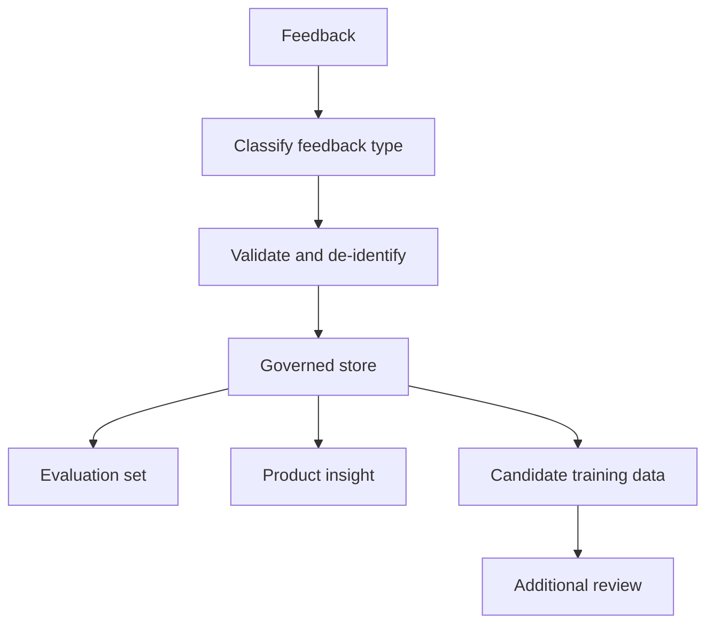

Do not optimize blindly for thumbs-up rates. Users may reward confident but incorrect answers, accept automation because it is faster, or avoid reporting subtle harms. Combine behavioral, quality, safety, and qualitative signals.

---

## 13. PM judgment and human accountability

The board explicitly places PM judgment between AI analysis and the product decision [Board, p. 44]. This is a critical design choice.

AI can organize evidence and propose alternatives. Product judgment integrates factors that may not be fully encoded:

- company strategy;
- ethical implications;
- stakeholder commitments;
- brand risk;
- regulatory interpretation;
- long-term platform effects;
- organizational capacity;
- reversibility;
- opportunity cost.

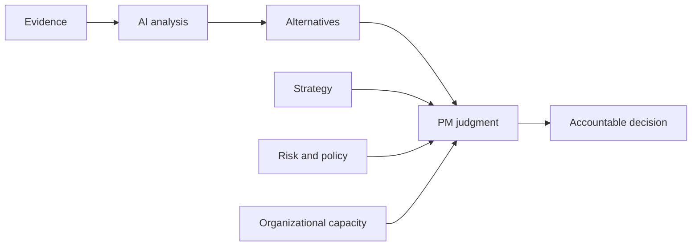

### 13.1 Decision contract

A supplementary decision contract records:

- decision question;
- options considered;
- evidence used;
- assumptions;
- known uncertainties;
- constraints;
- selected option;
- rationale summary;
- owner;
- review date;
- reversal condition.

This improves auditability and prevents later summaries from erasing uncertainty.

---

## 14. AI-assisted, agent-assisted, and autonomous PM workflows

Not every PM workflow needs an agent.

### 14.1 AI-assisted workflow

The user invokes AI for a bounded task, reviews the result, and manually continues.


Good for drafting, summarization, and ad hoc analysis.

### 14.2 Agent-assisted workflow

The system executes a multi-step read-only workflow and returns evidence for a human decision.

```mermaid
flowchart LR
    PM[PM request] --> AG[Agent workflow]
    AG --> T1[Analytics]
    AG --> T2[Support]
    AG --> T3[Research]
    T1 --> MERGE[Evidence merge]
    T2 --> MERGE
    T3 --> MERGE
    MERGE --> PMD[PM decision]
```

Good for recurring research, reporting, and monitoring.

### 14.3 Bounded autonomous workflow

The system takes predefined low-risk actions when deterministic conditions pass, with audit logs and escalation.

```mermaid
flowchart LR
    TRIG[Trigger] --> AG[Agent]
    AG --> VAL[Validate policy and evidence]
    VAL -->|Low risk| ACT[Execute bounded action]
    VAL -->|Uncertain or high risk| HUM[Human review]
    ACT --> AUD[Audit and monitor]
    HUM --> AUD
```

Good for reversible, policy-approved operations. Avoid autonomous product or customer-impacting decisions without strong controls.

---

## 15. Prompting and documentation for product work

Chapter 6 describes the prompt anatomy used throughout the board: role, task, context, constraints, output format, and quality check. Product managers can use the same structure for discovery, planning, and delivery.

### Example: evidence-backed opportunity summary

```text
Role:
You are a product analyst supporting a product manager.

Task:
Synthesize the supplied support tickets into product opportunities.

Context:
The product is an enterprise scheduling application. Use only the supplied tickets.

Constraints:
Do not invent frequency, revenue impact, or user segments. Separate evidence from inference.

Output format:
Return a table with opportunity, user job, evidence examples, affected segment, confidence, and next research question.

Quality check:
Every opportunity must cite at least two ticket IDs or be labeled as low confidence.
```

```mermaid
flowchart TB
    ROLE[Role] --> PROMPT[Product prompt]
    TASK[Task] --> PROMPT
    CONTEXT[Context and evidence] --> PROMPT
    CONS[Constraints] --> PROMPT
    FORMAT[Output schema] --> PROMPT
    QC[Quality check] --> PROMPT
```

Prompted documentation should remain connected to source evidence and versioned decisions. Do not allow AI to turn provisional ideas into apparently final commitments.

---

## 16. Cross-functional product leadership

AI-native product management is inherently cross-functional. The PM coordinates not only design and engineering but also ML, data, security, legal, compliance, operations, and human reviewers.

| Function | Core contribution |
|---|---|
| Product | Outcomes, trade-offs, decision ownership |
| Design | Interaction, trust, control, accessibility |
| Engineering | Application, orchestration, tools, reliability |
| ML / data science | Model and retrieval quality, experimentation |
| Data engineering | Source quality, lineage, access, freshness |
| Security | Threat model, permissions, incident controls |
| Legal / compliance | Policy interpretation, regulatory constraints |
| Operations | Runbooks, escalation queues, service readiness |
| Domain experts | Correctness, edge cases, human judgment |

```mermaid
flowchart TB
    PM[Product manager] --> DES[Design]
    PM --> ENG[Engineering]
    PM --> ML[ML and data]
    PM --> SEC[Security]
    PM --> LEG[Legal and compliance]
    PM --> OPS[Operations]
    PM --> DOM[Domain experts]
    DES --> OUT[Trusted product outcome]
    ENG --> OUT
    ML --> OUT
    SEC --> OUT
    LEG --> OUT
    OPS --> OUT
    DOM --> OUT
```

A PM should not become the sole owner of model correctness or safety. The PM owns the integrated product decision and ensures that specialist owners have clear responsibilities and release criteria.

---

## 17. Worked case study: AI support-insight loop

Consider a product team receiving thousands of support tickets each month.

### 17.1 Goal

Reduce recurring customer friction by turning support evidence into prioritized product experiments.

### 17.2 Workflow

```mermaid
sequenceDiagram
    participant S as Support systems
    participant P as Product insight agent
    participant A as Analytics
    participant PM as Product manager
    participant E as Experiment platform
    S->>P: New tickets and escalations
    A->>P: Usage and funnel data
    P->>P: Cluster issues and link evidence
    P-->>PM: Opportunities, examples, confidence, gaps
    PM->>PM: Apply strategy and risk judgment
    PM->>E: Approve experiment
    E-->>PM: Outcome and guardrail metrics
    PM->>P: Feed decision and outcome back
```

### 17.3 Opportunity record

```json
{
  "opportunity": "Improve password-reset completion",
  "user_job": "Regain account access without contacting support",
  "evidence": ["TCK-104", "TCK-221", "TCK-338"],
  "analytics_signal": "31% abandonment after reset-email request",
  "confidence": "medium",
  "evidence_gap": "mobile and desktop failure modes are not separated",
  "candidate_experiment": "Add reset-status guidance and resend controls",
  "guardrail": "Do not weaken identity verification"
}
```

### 17.4 Decision

The PM does not simply select the highest-frequency theme. The PM considers account security, engineering effort, segment impact, and whether the proposed change addresses the observed mechanism.

### 17.5 Measurement

- reset completion rate;
- support contact rate;
- time to access restoration;
- account takeover or abuse indicators;
- accessibility success;
- user-reported clarity.

This case demonstrates the board's core loop: behavior produces data, AI accelerates analysis, PM judgment produces a decision, and the experiment creates new behavior and evidence.

---

## 18. Common anti-patterns

### 18.1 Artifact acceleration without decision improvement

The team generates more PRDs, summaries, and roadmaps but does not improve evidence quality or decision speed.

**Correction:** Measure time from signal to accountable decision, not documents produced.

### 18.2 AI-generated certainty

Polished summaries hide weak or contradictory evidence.

**Correction:** Require source links, counterexamples, confidence, and evidence gaps.

### 18.3 Automating an undefined process

An agent is built before the team agrees on ownership, completion criteria, or escalation.

**Correction:** Define the workflow contract before selecting the framework.

### 18.4 Optimizing one metric

The team increases usage while quality, cost, or safety degrades.

**Correction:** Use a metric tree with hard guardrails.

### 18.5 Treating feedback as truth

User ratings are directly converted into training data.

**Correction:** Validate, segment, de-identify, and review feedback before reuse.

### 18.6 Hiding uncertainty from users

The interface presents recommendations as facts.

**Correction:** Show evidence, assumptions, confidence, and controls appropriate to impact.

### 18.7 Delegating accountability to the model

The team claims that a decision was made by AI.

**Correction:** Assign a human decision owner and retain decision provenance.

```mermaid
flowchart TB
    ANTI[Anti-pattern] --> SYM[Symptom]
    SYM --> ROOT[Root cause]
    ROOT --> CTRL[Product control]
    CTRL --> LEARN[Measured improvement]
```

---

## 19. Operating cadence for an AI-native product team

A practical cadence combines daily operational visibility with periodic strategic learning.

### Daily

- review incidents and guardrail breaches;
- monitor quality, latency, and cost anomalies;
- inspect human-review queues;
- verify significant model, prompt, index, or tool changes.

### Weekly

- review user evidence and outcome trends;
- inspect failed trajectories and escalations;
- assess experiment progress;
- prioritize evaluation gaps;
- decide bounded improvements.

### Monthly

- review metric tree and cohort differences;
- assess product and model drift;
- evaluate operating cost and reviewer capacity;
- update roadmap assumptions;
- revisit autonomy boundaries.

### Quarterly

- reassess strategic fit;
- review governance and risk posture;
- validate long-term user and business outcomes;
- retire low-value automation;
- invest in reusable platform capabilities.

```mermaid
flowchart LR
    D[Daily operations] --> W[Weekly learning]
    W --> M[Monthly portfolio review]
    M --> Q[Quarterly strategy]
    Q --> D
```

---

## 20. Product manager checklist

### Opportunity

- Is the user problem supported by evidence?
- Is AI necessary or is deterministic automation sufficient?
- Is the intended outcome measurable?
- Are the affected users and contexts clear?

### Experience

- Can users understand what the system did?
- Can they correct, retry, interrupt, or escalate?
- Are evidence and uncertainty visible?
- Are approvals placed before consequential actions?

### Quality and safety

- Is there a representative evaluation set?
- Are failure and abstention behaviors defined?
- Are fairness and privacy risks tested?
- Are tool permissions and data scopes explicit?

### Launch

- Do release gates cover quality, safety, latency, cost, and operations?
- Is human-review capacity sufficient?
- Are canary, rollback, and incident procedures ready?
- Are version identifiers recorded?

### Learning

- Does feedback link to outcomes and system versions?
- Can the team distinguish evidence from inference?
- Are product decisions and assumptions recorded?
- Does each experiment have a follow-up decision?

---

## 21. Hands-on lab: design an AI-native product decision loop

### Scenario

A product team wants to reduce customer onboarding abandonment using support tickets, funnel analytics, interview notes, and an AI assistant.

### Your task

Design a workflow that:

1. collects governed product signals;
2. extracts evidence-backed opportunities;
3. ranks opportunities without hiding weak evidence;
4. proposes experiments;
5. applies human judgment and release gates;
6. records decisions and assumptions;
7. measures user, model, safety, and operational outcomes;
8. feeds outcomes into the next planning cycle.

### Deliverables

- one lifecycle diagram;
- an opportunity schema;
- a prioritization rubric;
- a metric tree;
- an experiment contract;
- a human-approval policy;
- a feedback-governance plan;
- three failure cases and mitigations.

### Extension

Implement the example controller in `examples/30-ai-native-product-management/ai_native_product_loop.py`, then modify:

- opportunity weights;
- evidence thresholds;
- release gates;
- experiment outcomes;
- rollback rules.

Observe how the recommended decision changes.

---

## 22. Knowledge check

1. Why is document generation alone insufficient to make product work AI-native?
2. What role does PM judgment play between AI analysis and a product decision?
3. How should discovery themes be tied to evidence?
4. Why should prioritization scores not decide the roadmap automatically?
5. What additional requirements do probabilistic systems create for product design?
6. Which metric layers are required for an AI product?
7. How do guardrail metrics differ from optimization metrics?
8. Why is user feedback not automatically valid training data?
9. What is the difference between AI-assisted, agent-assisted, and bounded autonomous workflows?
10. Which release gates should be satisfied before expanding an agent's autonomy?

---

## 23. Interview questions

### Beginner

1. How can AI help a product manager during discovery?
2. What is an AI-native product learning loop?
3. Why should AI outputs include evidence and confidence?
4. What is the difference between a feature metric and a model-quality metric?
5. Give an example of a low-risk PM workflow suitable for automation.

### Intermediate

1. Design a prioritization framework for AI product opportunities.
2. How would you evaluate an AI-generated research synthesis?
3. What metrics would you use for an enterprise support agent?
4. How would you design a human approval flow for a consequential action?
5. How should prompt, model, retrieval, and policy versions be incorporated into product experiments?

### Advanced

1. Design an operating model for a product team managing continuous model and prompt changes.
2. How would you detect that an AI feature is improving adoption while degrading trust?
3. Design a product decision contract that preserves evidence, uncertainty, and reversal conditions.
4. How would you prevent feedback loops from amplifying bias or manipulation?
5. When should an AI product be simplified into deterministic software rather than expanded into an agent?
6. Design release gates for increasing an agent from read-only recommendations to bounded write actions.

---

## Summary

The board presents AI-native product management as a shift from manual, periodic work toward AI-assisted research, prompted documentation, agent-based workflows, and faster learning loops [Board, pp. 43-45]. The central mechanism is a continuous cycle: customer behavior produces data and feedback; AI accelerates analysis; the product manager applies judgment; a product decision creates an experiment or release; and the resulting behavior generates the next set of evidence.

A mature AI-native PM practice:

- begins with user problems and measurable outcomes rather than technology;
- uses AI to organize evidence and generate options;
- preserves human accountability for consequential decisions;
- designs for probabilistic behavior, correction, and uncertainty;
- evaluates user value, business value, model quality, safety, fairness, reliability, and cost together;
- uses progressive release and explicit gates;
- treats feedback as governed product data;
- records assumptions, versions, decisions, and reversal conditions;
- automates bounded workflow steps while preserving human control;
- optimizes for learning quality, not artifact volume.

The next chapters apply this operating model to complete end-to-end projects, including support triage, supplier recommendation, project coordination, and competitive research systems.
