# Chapter 38 - AI Product Discovery and Prioritization

> **Source basis:** The board places AI across the product lifecycle and gives concrete examples such as summarizing support tickets into pain points, ranking feature ideas by impact versus effort, drafting product artifacts, and creating continuous feedback loops. It contrasts traditional product work with AI-native work that combines customer signals, model capabilities, human judgment, and governed automation [Board, pp. 43-45]. This chapter preserves that product-management framing and expands it into an end-to-end discovery and prioritization method. Material on evidence contracts, opportunity graphs, portfolio balancing, decision records, uncertainty penalties, and the reference implementation is **Supplementary**.

---

## Learning objectives

By the end of this chapter, you should be able to:

1. Explain how AI changes product discovery without replacing product judgment.
2. Build a governed pipeline that converts raw customer and operational signals into evidence-backed opportunities.
3. Distinguish observations, themes, problems, opportunities, solutions, and roadmap commitments.
4. Assess signal quality, source independence, freshness, representativeness, and possible bias.
5. Use AI to classify, cluster, summarize, and compare evidence while preserving traceability.
6. Frame AI product opportunities using user jobs, measurable outcomes, constraints, and failure conditions.
7. Prioritize opportunities using value, confidence, feasibility, risk, reversibility, and strategic alignment.
8. Account for AI-specific factors such as data readiness, evaluation difficulty, model uncertainty, safety, and operational burden.
9. Separate deterministic scoring support from accountable human product decisions.
10. Create a balanced portfolio across discovery, delivery, reliability, safety, and platform investments.
11. Design feedback loops that do not overfit to the loudest users or easiest-to-measure signals.
12. Implement a dependency-free discovery and prioritization engine that produces auditable recommendations.

---

## 1. Discovery is an evidence discipline

Product discovery is often described as finding ideas. That description is too weak. Discovery is the disciplined process of reducing uncertainty about:

- who has a meaningful problem;
- what outcome they are trying to achieve;
- how frequently and severely the problem occurs;
- which constraints shape a viable solution;
- whether the organization can deliver and operate the solution responsibly;
- how success and failure will be measured.

AI can accelerate this process by reading large volumes of feedback, extracting recurring themes, comparing segments, identifying contradictions, and producing candidate opportunity statements. It can also make discovery worse by producing polished summaries that hide weak evidence.


The quality of the final opportunity cannot exceed the quality of the evidence chain supporting it.

> **Key principle**
>
> AI should compress the cost of analysis, not compress away the evidence.

---

## 2. The discovery object model

Teams frequently mix different levels of abstraction. A support-ticket quote becomes a “feature request,” a theme becomes a roadmap item, or a solution idea is presented as if it were the underlying problem. A clear object model prevents this collapse.

| Object | Meaning | Example |
|---|---|---|
| Signal | A raw observation from a source | “I reset my password but still cannot log in.” |
| Evidence item | A governed signal with metadata | Ticket, tenant, date, severity, source link |
| Theme | A recurring pattern across evidence | Post-reset login failures |
| Problem hypothesis | A proposed explanation of user friction | Reset tokens are not consistently invalidating sessions |
| Opportunity | A valuable outcome the product could enable | Reduce failed access after password reset |
| Solution hypothesis | A possible intervention | Session invalidation service and guided recovery |
| Experiment | A test of a solution or assumption | Roll out new recovery flow to 10% of users |
| Roadmap commitment | An approved investment | Deliver the recovery initiative in Q3 |

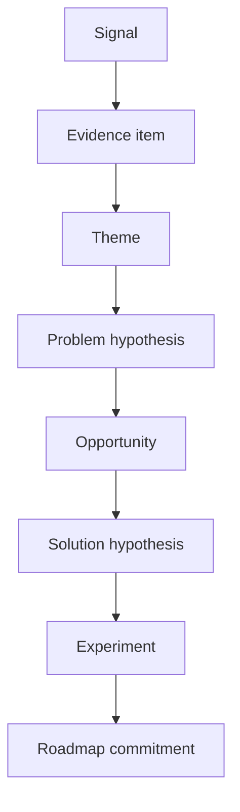

Each transition requires a different type of reasoning. AI may assist every transition, but the organization should preserve the boundaries.

---

## 3. Signal architecture

Discovery quality improves when signals are intentionally designed rather than collected opportunistically.

### 3.1 Common signal families

- Customer interviews and field studies
- Support tickets and escalation logs
- Product analytics and event sequences
- Search behavior and help-center usage
- Sales calls, loss reasons, and procurement objections
- Customer-success notes and renewal risks
- Surveys and structured feedback
- Operational incidents and reliability reports
- Competitive and market research
- Policy, legal, security, and compliance constraints
- Model evaluations, agent traces, and human-review outcomes

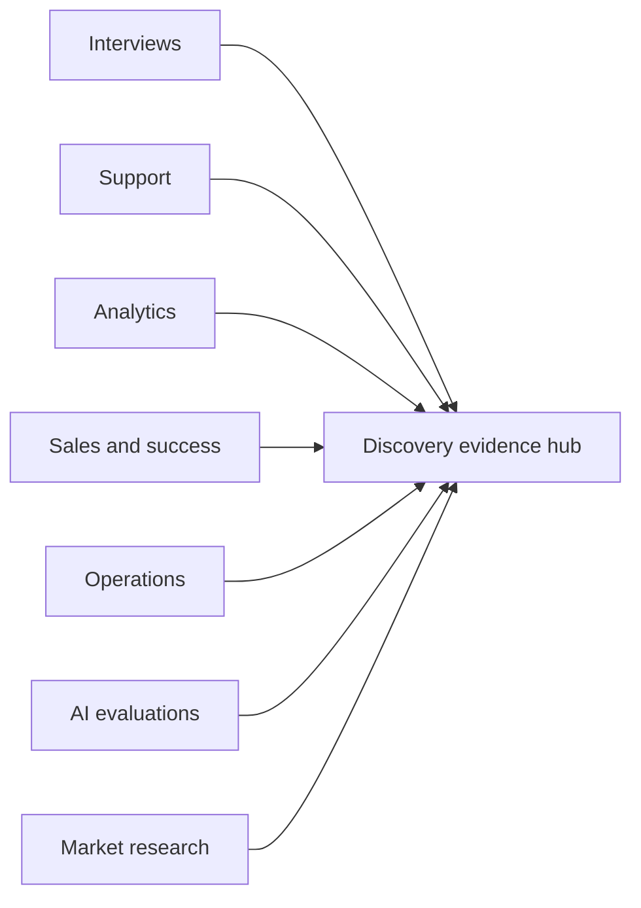

An AI product requires signals beyond user preference. Model quality, safety, latency, cost, escalation, and failure-recovery data are also product signals.

### 3.2 Source metadata

Every evidence item should carry enough metadata to answer:

- Where did this come from?
- When was it observed?
- Which user, segment, environment, or workflow did it represent?
- Was the source direct or interpreted?
- Was the evidence solicited or naturally occurring?
- Can an authorized reviewer inspect the original source?
- Does the evidence contain sensitive information?
- Is it independent of other evidence or merely a repost?

A useful evidence record contains:

```text
Evidence ID
Source type
Source reference
Observed at
User or segment scope
Product and workflow scope
Direct quote or measured event
Interpreter, if any
Sensitivity classification
Freshness window
Confidence and limitations
```

---

## 4. Evidence quality and representativeness

Frequency alone is not evidence quality. One severe issue may matter more than one hundred minor complaints. One enterprise account may represent strategic revenue but not the broader population. A large set of tickets may all originate from the same outage.

A practical evidence-quality model considers:

1. **Directness:** Is the item a direct observation or a second-hand interpretation?
2. **Specificity:** Does it identify the user, context, job, and failure?
3. **Freshness:** Is it recent enough for the product and market?
4. **Independence:** Does it add a distinct observation?
5. **Representativeness:** Which population does it represent?
6. **Severity:** What is the consequence of the problem?
7. **Verifiability:** Can a reviewer inspect the source?
8. **Bias risk:** How might collection or interpretation distort the signal?

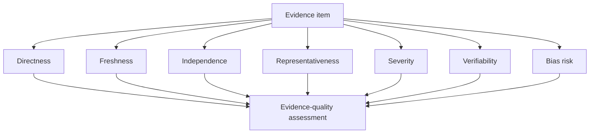

### 4.1 Avoiding false volume

Suppose 300 tickets mention “slow reports.” Investigation may show that 270 were generated by one temporary incident. The independent evidence count is not 300. It may be one incident affecting many users.

Use grouping keys such as:

- incident ID;
- customer account;
- session;
- root-cause signature;
- source document;
- interview participant;
- campaign or survey wave.

### 4.2 Segment coverage

A theme should include segment coverage, not only total frequency.

| Theme | Total items | Distinct accounts | Segments | Severity | Interpretation |
|---|---:|---:|---|---|---|
| Login reset failure | 48 | 31 | SMB, enterprise | High | Broad and severe |
| Custom dashboard color | 90 | 2 | Enterprise | Low | Concentrated preference |
| Invoice export mismatch | 12 | 10 | Finance-heavy accounts | High | Narrow but critical |

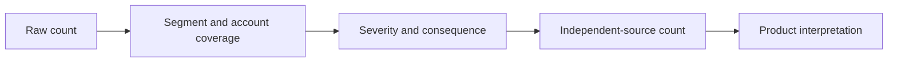

---

## 5. AI-assisted evidence processing

AI is useful for repetitive semantic work, especially when paired with deterministic controls.

### 5.1 Suitable tasks

- Language normalization
- PII redaction
- Taxonomy classification
- Theme extraction
- Duplicate detection
- Sentiment and urgency tagging
- Quote selection
- Contradiction detection
- Segment comparison
- Evidence-linked summary generation

### 5.2 Unsuitable unbounded tasks

- Inventing missing customer context
- Estimating market size without sources
- Converting weak themes directly into commitments
- Treating sentiment as objective business impact
- Deciding legal or safety acceptability
- Prioritizing purely from generated prose


### 5.3 Preserve source linkage

Every generated theme should link back to the evidence that created it.

A theme record may contain:

```json
{
  "theme_id": "TH-LOGIN-RESET",
  "label": "Access failure after password reset",
  "evidence_ids": ["EV-102", "EV-188", "EV-204"],
  "distinct_accounts": 3,
  "segments": ["SMB", "Enterprise"],
  "confidence": 0.82,
  "limitations": ["No mobile telemetry for two accounts"]
}
```

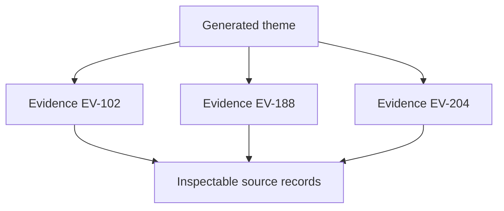

---

## 6. Taxonomy design

AI-based classification performs better when the taxonomy is explicit, bounded, and periodically reviewed.

A taxonomy can represent:

- user job;
- product area;
- journey stage;
- issue type;
- desired outcome;
- severity;
- blocked status;
- workaround availability;
- customer segment;
- evidence source;
- confidence.

### 6.1 Hierarchical taxonomies

A hierarchical taxonomy avoids hundreds of flat, overlapping labels.

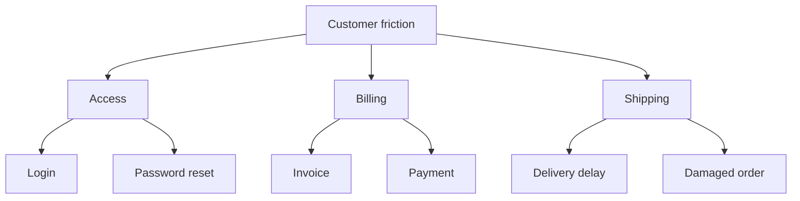

### 6.2 Unknown and multi-label cases

The classifier should support:

- `unknown` when evidence is insufficient;
- `other` when a valid class is not yet represented;
- multi-label classification when one item spans multiple problems;
- clarification requests for ambiguous high-impact evidence.

Forcing every signal into one label creates false precision.

---

## 7. Theme generation and clustering

Clustering groups semantically related evidence. It does not determine whether the cluster is strategically important.

A reliable workflow is:

1. Normalize the text and metadata.
2. Generate or retrieve embeddings.
3. Produce candidate clusters.
4. Inspect low-cohesion and high-overlap clusters.
5. Name clusters using evidence-grounded language.
6. Merge duplicates and split mixed clusters.
7. Record confidence and limitations.
8. Re-evaluate clusters as new data arrives.

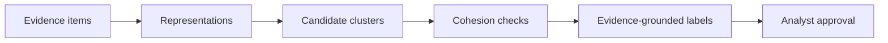

### 7.1 Cluster quality questions

- Do the items describe the same user job and failure?
- Is the cluster held together by superficial vocabulary?
- Does one high-volume source dominate it?
- Does the label preserve important distinctions?
- Are opposing signals being incorrectly merged?
- Is the cluster stable across time and model versions?

### 7.2 Negative evidence

Discovery should record evidence that challenges a theme.

Example:

- Theme: “Users need a fully automated return process.”
- Supporting evidence: High volume of return-status questions.
- Contradicting evidence: Users frequently request human confirmation before refunds.

Negative evidence protects teams from building a solution around a partial interpretation.

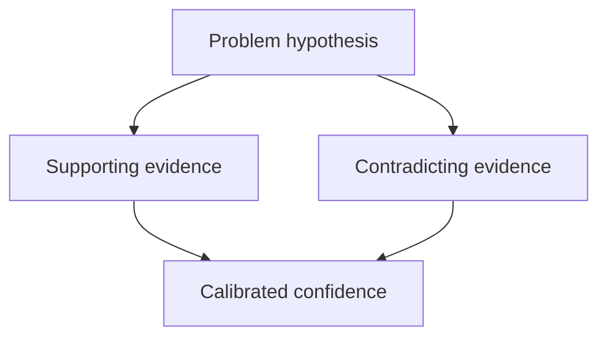

---

## 8. From themes to problem hypotheses

A theme describes a pattern. A problem hypothesis explains the user and business significance of that pattern.

A strong problem hypothesis includes:

- affected user or role;
- job to be done;
- context and trigger;
- current friction;
- consequence;
- observed evidence;
- uncertainty;
- constraints.

### Example

Weak:

> Users dislike reporting.

Stronger:

> Finance administrators exporting monthly reconciliation reports frequently encounter field mismatches between the dashboard and CSV export. The issue creates manual reconciliation work, delays month-end close, and generates high-severity support escalations. Evidence currently covers ten accounts in two regions; mobile usage is not represented.


### 8.1 Do not embed the solution

Problem statements such as “users need an AI chatbot” are solution statements. The actual problem may be poor navigation, missing data, unclear policy, or slow human response.

A problem statement should remain valid even if the final solution contains no AI.

---

## 9. Opportunity framing

An opportunity describes a valuable change in user or business outcomes without prematurely committing to implementation.

A complete opportunity record contains:

- opportunity ID and title;
- user and job;
- current problem;
- evidence summary and links;
- target outcome;
- affected segments;
- strategic connection;
- assumptions;
- constraints;
- AI suitability hypothesis;
- simpler non-AI alternative;
- risks and failure conditions;
- confidence;
- next learning action.

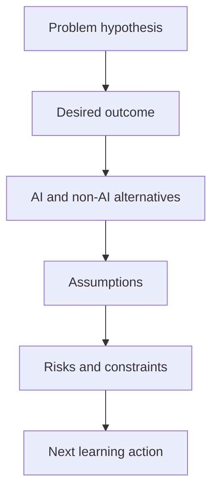

### 9.1 AI suitability test

An opportunity is not automatically an AI opportunity. Ask:

1. Is the task language-, perception-, prediction-, or reasoning-heavy?
2. Is there enough governed data or context?
3. Is uncertainty acceptable and manageable?
4. Can outputs be evaluated?
5. Can the system abstain or escalate?
6. Are actions reversible or approval-gated?
7. Does AI materially outperform rules, search, forms, or workflow automation?
8. Can the organization operate the system after launch?

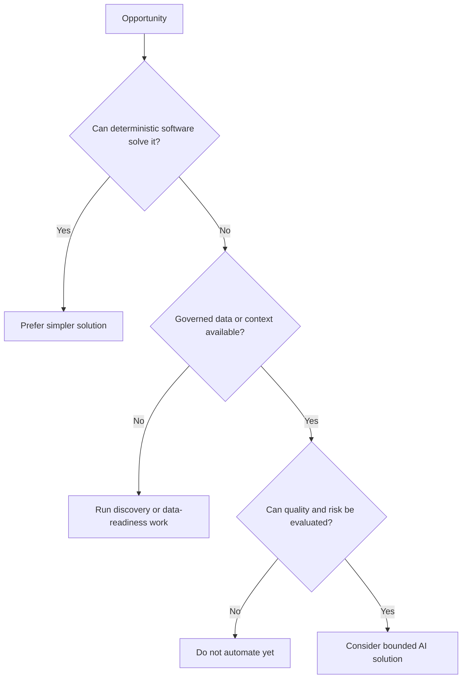

---

## 10. Opportunity sizing

Opportunity sizing is an estimate under uncertainty. The goal is not perfect precision. The goal is to compare assumptions consistently.

Useful dimensions include:

- affected users or accounts;
- frequency of the job or failure;
- severity and consequence;
- time or cost currently spent;
- revenue or retention exposure;
- compliance or safety implications;
- strategic importance;
- adoption likelihood;
- evidence confidence.

### 10.1 Expected value under uncertainty

A simple conceptual model is:

```text
Expected opportunity value
= Reach × Outcome magnitude × Adoption probability × Evidence confidence
```

This is not a universal formula. It is a prompt to make assumptions visible.

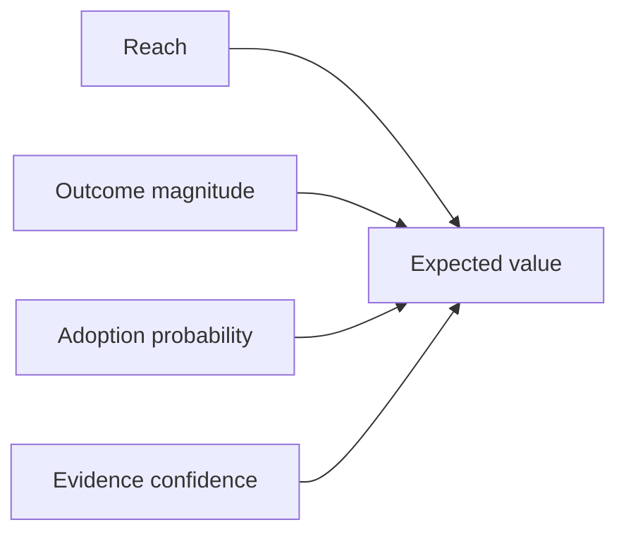

### 10.2 Avoiding false precision

Do not claim that an opportunity is worth exactly `$4.37M` when the inputs are rough estimates. Use ranges and scenarios:

- conservative;
- expected;
- optimistic.

Document which assumptions drive the range.

---

## 11. Prioritization as decision support

Prioritization is not the same as sorting a spreadsheet. A prioritization system should support judgment by making trade-offs explicit.

Traditional factors include:

- reach;
- impact;
- confidence;
- effort;
- urgency;
- strategic alignment;
- dependency readiness.

AI opportunities add several factors:

- data readiness;
- evaluation readiness;
- uncertainty tolerance;
- safety and privacy risk;
- operational burden;
- model and vendor dependency;
- human-review cost;
- reversibility;
- expected automation level.

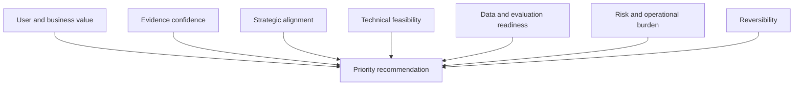

### 11.1 A practical scoring model

One possible normalized model is:

```text
Priority score =
  0.25 × user value
+ 0.20 × business value
+ 0.15 × strategic alignment
+ 0.15 × evidence confidence
+ 0.10 × feasibility
+ 0.10 × data and evaluation readiness
+ 0.05 × reversibility
- 0.15 × safety and compliance risk
- 0.10 × delivery effort
- 0.10 × operational burden
```

Weights should reflect the organization's context. A regulated workflow may assign a larger risk penalty. An early-stage product may weight learning speed more highly.

### 11.2 Confidence-adjusted scoring

A high-value claim based on weak evidence should not outrank a well-supported opportunity automatically.

```text
Confidence-adjusted value = Raw value × Evidence confidence
```

This makes discovery quality part of prioritization rather than a separate presentation note.

---

## 12. Reversibility and autonomy

Reversibility affects both product sequencing and architecture.

| Action | Reversibility | Recommended product approach |
|---|---|---|
| Generate internal draft | High | Automate with review |
| Recommend supplier | Medium | Show evidence and alternatives |
| Send customer message | Medium | Approval for sensitive cases |
| Update payroll | Low | Strong policy, dual control, audit |
| Deny benefit or access | Very low | Human decision and appeal path |

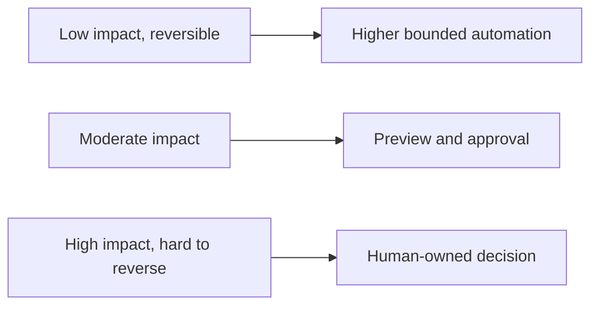

An opportunity may be valuable but unsuitable for autonomous action. Prioritize the outcome while selecting a safer mode such as recommendation, draft generation, or decision support.

---

## 13. Portfolio balancing

A roadmap composed only of visible customer features becomes fragile. AI products also require investments in evaluation, safety, data quality, platform capability, reliability, and operational readiness.

A balanced portfolio may contain:

- customer-value initiatives;
- discovery experiments;
- model and retrieval quality;
- safety and governance;
- reliability and latency;
- platform and reusable capabilities;
- technical debt and simplification.

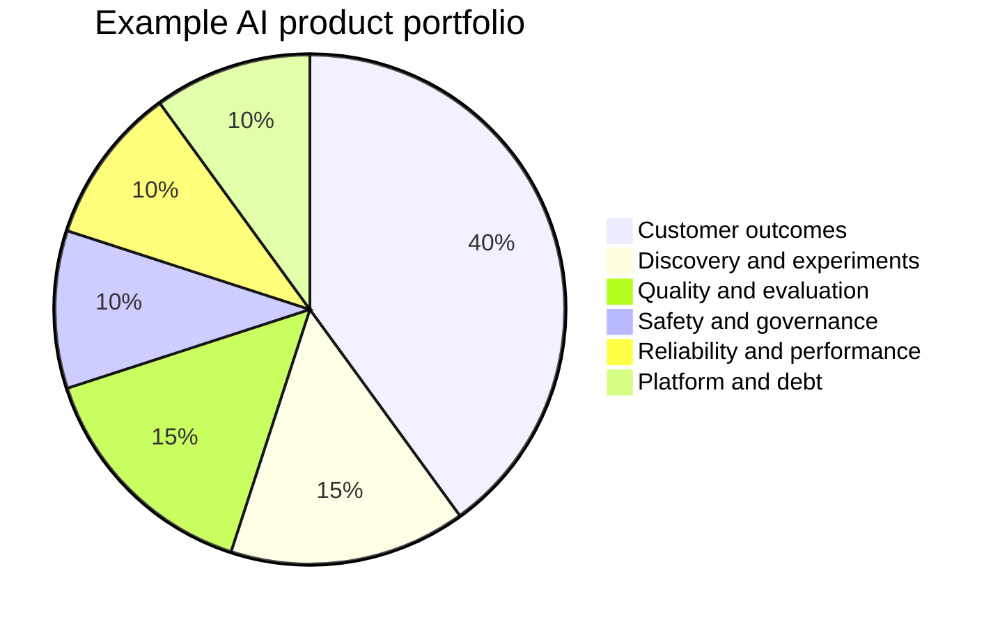

### 13.1 Portfolio constraints

Teams can impose constraints such as:

- at least 15% capacity for quality and evaluation;
- no high-impact automation without safety work;
- no more than two model-dependent bets in one quarter;
- platform work must serve multiple validated opportunities;
- every major feature has an operating and rollback plan.

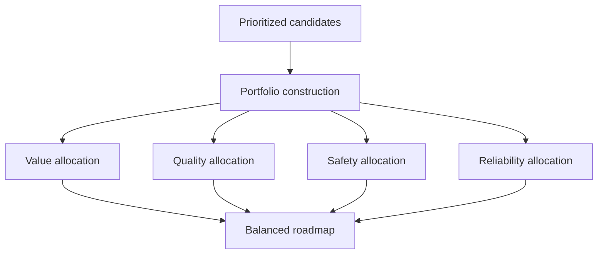

---

## 14. Prioritizing learning, not only delivery

When uncertainty is high, the next best action may be a research activity rather than a feature.

Examples:

- interview five users from an underrepresented segment;
- instrument an unclear workflow;
- run a retrieval-quality benchmark;
- test whether a deterministic search experience solves the problem;
- create a concierge prototype;
- validate whether users accept an approval step;
- measure human-review burden.

### 14.1 Learning value

A learning action has value when it can change a decision.

Ask:

- Which uncertainty will this reduce?
- Which decision depends on it?
- What result would cause us to stop, continue, or change direction?
- Is there a cheaper way to learn the same thing?

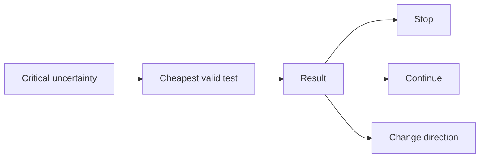

---

## 15. Human decision contracts

A scoring engine should not silently decide the roadmap. The accountable product decision should be recorded separately.

A decision contract includes:

- decision owner;
- date and review date;
- options considered;
- selected option;
- evidence summary;
- assumptions;
- dissent or unresolved questions;
- expected outcome;
- guardrail metrics;
- reversal conditions;
- next review trigger.

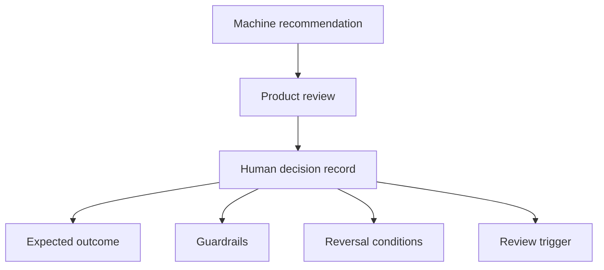

This separation protects accountability and makes later learning possible. Teams can compare what the system recommended, what the human decided, and what actually happened.

---

## 16. Bias and discovery failure modes

### 16.1 Loud-user bias

The users who submit the most feedback may not represent the highest-value or most underserved users.

### 16.2 Availability bias

Teams over-prioritize evidence from sources that are easiest to query, such as support tickets, while ignoring interviews or operational constraints.

### 16.3 Automation bias

A polished AI summary may receive more trust than the underlying evidence deserves.

### 16.4 Taxonomy lock-in

A fixed classification system can hide emerging problems that do not fit existing labels.

### 16.5 Metric bias

Teams prioritize what can be measured easily rather than what matters.

### 16.6 Solution anchoring

The team starts with an agent or chatbot and interprets all evidence in support of that solution.

### 16.7 Strategic theater

Scoring frameworks produce precise numbers that conceal political decisions or weak assumptions.

```mermaid
flowchart TB
    BIAS[Discovery bias] --> LOUD[Loud-user bias]
    BIAS --> AVAIL[Availability bias]
    BIAS --> AUTO[Automation bias]
    BIAS --> TAX[Taxonomy lock-in]
    BIAS --> METRIC[Metric bias]
    BIAS --> ANCHOR[Solution anchoring]
```

Mitigations include segment quotas, counter-evidence, analyst review, hidden holdouts, taxonomy audits, and explicit uncertainty.

---

## 17. Operating workflow

A production discovery and prioritization system can use the following bounded workflow.

```mermaid
flowchart TD
    START[New signals arrive] --> VALID[Validate permissions and metadata]
    VALID --> REDACT[Redact sensitive fields]
    REDACT --> ENRICH[Classify and enrich]
    ENRICH --> DEDUP[Deduplicate and group]
    DEDUP --> THEME[Update themes]
    THEME --> REVIEW[Analyst review]
    REVIEW --> PROB[Create or update problem hypotheses]
    PROB --> OPP[Create opportunity candidates]
    OPP --> SCORE[Score with uncertainty and risk]
    SCORE --> PORT[Portfolio review]
    PORT --> DECIDE[Human decision contract]
    DECIDE --> LEARN[Experiment, deliver, or gather more evidence]
    LEARN --> START
```

### 17.1 State transitions

Useful states include:

```text
new_signal
validated
redacted
classified
clustered
analyst_reviewed
problem_hypothesis
opportunity_candidate
prioritized
approved_for_learning
approved_for_delivery
rejected
parked
```

State transitions should be auditable and reversible where possible.

---

## 18. Reference architecture

```mermaid
flowchart TB
    subgraph SOURCES[Signal sources]
        TICK[Support tickets]
        INT[Interview notes]
        PROD[Product analytics]
        SALES[Sales and success]
        OPS[Operational and model telemetry]
    end

    SOURCES --> ING[Ingestion and access controls]
    ING --> GOV[PII handling, lineage, retention]
    GOV --> PROC[Classification, deduplication, clustering]
    PROC --> EVID[(Evidence store)]
    EVID --> ANALYST[Analyst review workspace]
    ANALYST --> OPP[(Opportunity registry)]
    OPP --> SCORE[Prioritization service]
    SCORE --> PORT[Portfolio review]
    PORT --> DEC[(Decision registry)]
    DEC --> EXP[Experiments and delivery]
    EXP --> OBS[Outcome telemetry]
    OBS --> SOURCES
```

### 18.1 Component responsibilities

| Component | Responsibility |
|---|---|
| Ingestion | Connect approved sources and preserve source identifiers |
| Governance | Enforce access, redaction, retention, and tenant boundaries |
| Processing | Classify, cluster, deduplicate, and summarize |
| Evidence store | Preserve inspectable source-linked records |
| Analyst workspace | Review AI-generated themes and contradictions |
| Opportunity registry | Maintain problems, assumptions, evidence, and next actions |
| Prioritization service | Produce transparent, configurable decision support |
| Decision registry | Record accountable human decisions and reversal conditions |
| Outcome telemetry | Close the learning loop with measured results |

---

## 19. Evaluation and metrics

Discovery systems require both component metrics and decision-quality metrics.

### 19.1 Processing metrics

- classification accuracy;
- taxonomy coverage;
- duplicate precision and recall;
- cluster cohesion and separation;
- evidence-link accuracy;
- PII-redaction recall;
- source-freshness compliance;
- analyst correction rate.

### 19.2 Discovery metrics

- percentage of themes with inspectable evidence;
- segment coverage;
- time from signal to reviewed theme;
- proportion of opportunities with counter-evidence;
- percentage of opportunities with explicit uncertainty;
- evidence age distribution;
- unsupported-claim rate.

### 19.3 Decision metrics

- decision reversal rate;
- forecast calibration;
- experiment learning rate;
- percentage of roadmap items linked to validated opportunities;
- share of capacity allocated to reliability and safety;
- realized versus expected outcomes;
- time from evidence to decision;
- number of decisions changed by new evidence.

```mermaid
flowchart LR
    COMP[Component quality] --> DISC[Discovery quality]
    DISC --> DEC[Decision quality]
    DEC --> OUT[Outcome quality]
    OUT --> CAL[Calibration and learning]
    CAL --> COMP
```

### 19.4 Guardrail metrics

- cross-tenant evidence access: zero;
- unsupported market claims: below threshold;
- sensitive-data leakage: zero;
- analyst-override rate monitored by segment;
- high-impact roadmap decisions without decision records: zero.

---

## 20. Worked case study: support insight prioritization

A B2B software company receives thousands of monthly support tickets. The team wants AI to identify product opportunities.

### 20.1 Raw signal themes

The pipeline identifies:

1. Password-reset login failures
2. Invoice-export mismatches
3. Requests for dashboard color customization
4. Slow report generation

### 20.2 Evidence review

| Theme | Evidence finding |
|---|---|
| Password reset | Broad across 31 accounts, high blocked rate, direct telemetry support |
| Invoice export | Twelve incidents across ten finance-heavy accounts, severe close-process impact |
| Dashboard colors | Ninety requests from two large accounts, low severity |
| Slow reports | Mostly one incident; low independent evidence after deduplication |

### 20.3 Opportunity candidates

- Reduce failed access after password reset
- Eliminate reconciliation mismatch between dashboard and CSV export
- Improve enterprise dashboard personalization
- Improve reporting reliability

### 20.4 AI-specific assessment

The first two problems may not need generative AI. Deterministic product fixes are likely superior. The discovery system still used AI to synthesize evidence, but the product solution can remain conventional software.

This illustrates an important outcome:

> An AI-enabled discovery process should be willing to recommend a non-AI product solution.

### 20.5 Prioritization result

The invoice-export opportunity receives the highest confidence-adjusted priority because it combines severe business impact, strong evidence independence, strategic importance, and a feasible deterministic fix.

The password-reset issue is second and receives an urgent reliability track. Dashboard customization is parked for targeted discovery. Slow reports are reclassified as an incident follow-up rather than a broad product opportunity.

```mermaid
flowchart LR
    RAW[Four raw themes] --> REVIEW[Evidence review]
    REVIEW --> DEDUP[Remove false volume]
    DEDUP --> FRAME[Frame opportunities]
    FRAME --> SCORE[Confidence-adjusted scoring]
    SCORE --> DET[Prefer deterministic fixes where suitable]
    DET --> DEC[Human roadmap decision]
```

---

## 21. Runnable reference implementation

The companion implementation is located at:

```text
examples/38-product-discovery-prioritization/product_discovery_prioritizer.py
```

It demonstrates:

- typed signal and opportunity records;
- evidence-quality scoring;
- account and incident deduplication;
- segment-coverage analysis;
- theme aggregation;
- deterministic AI-suitability checks;
- confidence-adjusted prioritization;
- risk and effort penalties;
- portfolio-category recommendations;
- human decision records;
- machine-readable output.

The implementation is intentionally dependency-free so that the decision logic can be inspected without a model provider.

---

## 22. Product discovery checklist

### Evidence

- [ ] Every theme links to inspectable evidence.
- [ ] Duplicate and syndicated signals are grouped.
- [ ] Segment and account coverage are visible.
- [ ] Evidence freshness is measured.
- [ ] Contradicting evidence is recorded.
- [ ] Sensitive data is handled according to policy.

### Problem framing

- [ ] User, job, context, friction, and consequence are explicit.
- [ ] The statement does not embed a preferred solution.
- [ ] Uncertainty and limitations are visible.
- [ ] A measurable outcome is defined.

### AI suitability

- [ ] A simpler deterministic alternative was considered.
- [ ] Data and evaluation readiness were assessed.
- [ ] Uncertainty and abstention are acceptable.
- [ ] Operational and human-review costs are included.
- [ ] Safety, privacy, and reversibility are assessed.

### Prioritization

- [ ] Scoring weights are documented.
- [ ] Evidence confidence affects the recommendation.
- [ ] Risk and operational burden are not hidden.
- [ ] Portfolio balance is reviewed.
- [ ] The machine recommendation is separated from the human decision.
- [ ] Reversal conditions and next review triggers are recorded.

---

## 23. Hands-on lab

### Scenario

You are the product manager for an enterprise knowledge assistant. Signals include:

- complaints about stale policy answers;
- requests for faster response time;
- concern about missing citations;
- requests for the agent to update HR records;
- complaints that the system asks too many clarifying questions.

### Task

Create:

1. a signal schema;
2. a taxonomy;
3. evidence-quality rules;
4. five candidate themes;
5. three problem hypotheses;
6. opportunity records;
7. an AI-suitability assessment;
8. a prioritization model;
9. a balanced quarterly portfolio;
10. one human decision contract.

### Required constraints

- Personal employee information must remain tenant- and role-restricted.
- HR-record changes require approval.
- Stale or unsupported answers must trigger abstention.
- Latency improvements must not remove citations or safety checks.
- Segment-level performance must be measured.

### Extension

Modify the companion implementation by:

- changing scoring weights;
- adding a new evidence source;
- introducing a high-severity low-frequency issue;
- simulating one dominant customer account;
- changing the AI-suitability rules;
- adding a portfolio-capacity constraint.

Compare the recommendations before and after each change.

---

## 24. Knowledge check

1. What is the difference between a signal, theme, problem hypothesis, and opportunity?
2. Why is raw frequency an unreliable prioritization signal?
3. Which metadata is required to evaluate evidence quality?
4. Why should themes preserve links to original evidence?
5. How can clustering create misleading themes?
6. What is negative evidence, and why should it be recorded?
7. How does an AI-suitability test prevent unnecessary agent development?
8. Why should evidence confidence affect opportunity scoring?
9. How does reversibility influence product autonomy?
10. Why should portfolio planning include evaluation, safety, and reliability work?
11. What is the difference between a machine recommendation and a human decision contract?
12. Which metrics show whether the discovery system is improving decision quality?

---

## 25. Interview questions

### Beginner

1. How can AI help a product manager analyze customer feedback?
2. What is the difference between a customer request and a product opportunity?
3. Why should AI-generated themes include citations or source links?
4. What is evidence confidence?
5. Why might a high-volume theme still be low priority?

### Intermediate

1. Design a taxonomy for support-ticket discovery.
2. How would you detect duplicate evidence created by one incident?
3. Propose a scoring model for AI product opportunities.
4. How would you evaluate whether an opportunity needs AI at all?
5. What product metrics would you use for a discovery-assistant system?
6. How would you prevent one enterprise customer from dominating prioritization?

### Advanced

1. Design a multi-source product discovery architecture with governance, evidence lineage, and analyst review.
2. How would you calibrate an AI-generated evidence-confidence score?
3. Design a portfolio model balancing customer value, safety, reliability, and platform investments.
4. How would you evaluate whether AI-assisted prioritization improves business outcomes rather than merely decision speed?
5. Design safeguards against taxonomy lock-in and automation bias.
6. How would you maintain continuity between discovery evidence, roadmap decisions, experiments, and post-launch outcomes?
7. Explain when a product team should prioritize a learning experiment over a delivery commitment.

---

## Summary

The board presents AI as a force across the product lifecycle, including support-ticket synthesis, feature ranking, prompted documentation, agent workflows, and continuous feedback loops [Board, pp. 43-45]. This chapter turns that framing into an evidence-based discovery and prioritization discipline.

A mature AI product discovery process:

- separates signals, evidence, themes, problems, opportunities, solutions, experiments, and commitments;
- preserves source metadata and inspectable lineage;
- evaluates directness, freshness, independence, representativeness, severity, and bias risk;
- uses AI for classification, clustering, summarization, and contradiction detection without delegating accountability;
- frames opportunities around user outcomes rather than predetermined AI solutions;
- assesses deterministic alternatives before choosing an AI architecture;
- adjusts value estimates by evidence confidence;
- includes data readiness, evaluation readiness, risk, reversibility, and operational burden in prioritization;
- balances customer-facing work with quality, safety, reliability, and platform investments;
- records human decisions, assumptions, guardrails, and reversal conditions;
- closes the loop by comparing predicted outcomes with actual results.

The next chapter applies this foundation to product experimentation and optimization: hypotheses, experiment design, AI-specific release gates, causal interpretation, online evaluation, and governed iteration.
