# Chapter 39 - AI Product Experimentation and Optimization

> **Source basis:** The board places AI across the product lifecycle and contrasts traditional product work with AI-native product management. It emphasizes continuous feedback, evaluation, trust, safety, learning, latency, and user control rather than treating launch as the end of delivery [Board, pp. 43-45]. It also presents iterative prompt evaluation, model-quality metrics, responsible-AI checks, and operational measurements such as success rate, tool accuracy, completion time, retries, and escalation [Board, pp. 3, 10-11, 29, 42, 47, 50]. This chapter preserves that framing and expands it into a governed experimentation and optimization system. Material on experiment contracts, sequential release gates, metric trees, causal interpretation, variance reduction, shadow experiments, policy experiments, and the reference implementation is **Supplementary**.

---

## Learning objectives

By the end of this chapter, you should be able to:

1. Explain why AI product experimentation must measure quality, safety, reliability, cost, and user outcomes together.
2. Distinguish model evaluation, workflow evaluation, usability testing, controlled experiments, and production monitoring.
3. Write a versioned experiment contract with hypotheses, assignment, metrics, guardrails, and stopping rules.
4. Build an AI product metric tree that connects model behavior to user and business outcomes.
5. Select an experimental method appropriate to the product's maturity, traffic, risk, and action impact.
6. Design offline, shadow, canary, A/B, switchback, interleaving, and phased-rollout experiments.
7. Handle stochastic model outputs, repeated users, correlated sessions, delayed outcomes, and changing knowledge bases.
8. Define primary metrics, guardrail metrics, diagnostic metrics, and operational constraints.
9. Prevent optimization from increasing hallucination, unfairness, unsafe actions, user effort, or operating cost.
10. Interpret experimental results without confusing statistical significance with practical value.
11. Establish release, rollback, escalation, and learning decisions before an experiment starts.
12. Implement a dependency-free evaluation and release-gate engine for an AI assistant.

---

## 1. AI products are continuously learned systems

A conventional product experiment often changes a visible interface or business rule. The treatment is relatively stable, and the observed outcome is primarily driven by user behavior. AI products introduce additional sources of variation:

- model versions and decoding settings;
- prompt and policy versions;
- retrieval indexes, documents, filters, and rerankers;
- tools, APIs, permissions, and workflow routes;
- memory and state;
- evaluator and guardrail versions;
- source availability and freshness;
- stochastic outputs;
- human approvals and corrections.

The experimental unit is therefore rarely “the prompt.” It is the complete product configuration that the user experiences.

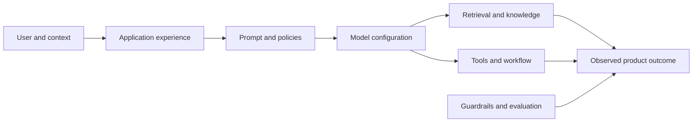

A useful experiment asks whether a controlled configuration causes a meaningful improvement while remaining inside quality, safety, fairness, latency, cost, and operational boundaries.

> **Key principle**
>
> Optimize the product outcome, not an isolated model score.

---

## 2. The experimentation hierarchy

Teams frequently call every comparison an A/B test. That creates confusion. AI product development uses several distinct forms of evidence.

| Method | Main question | Typical environment |
|---|---|---|
| Component evaluation | Does one component meet its technical contract? | Offline |
| End-to-end evaluation | Does the complete workflow produce acceptable results? | Offline or staging |
| Usability test | Can intended users understand and control it? | Moderated prototype or beta |
| Shadow evaluation | How would a candidate behave on real traffic without affecting users? | Production, non-serving |
| Canary release | Does the candidate remain healthy under limited real exposure? | Production |
| Controlled experiment | Does the candidate cause a better user or business outcome? | Production |
| Longitudinal monitoring | Does the benefit persist as data and behavior change? | Production |

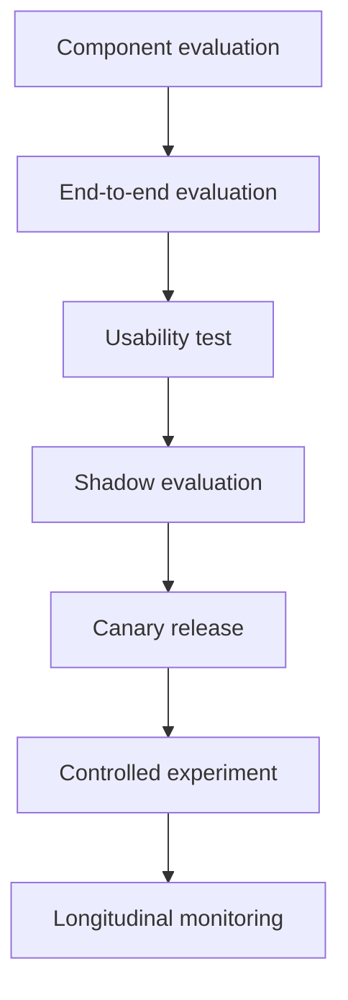

The levels are complementary. A statistically successful A/B test does not excuse unsafe tool use. A strong offline benchmark does not prove adoption. A usable interface does not prove that answers are grounded.

### 2.1 Evidence should accumulate

A candidate should move through progressively more realistic and risky environments only after passing earlier gates.

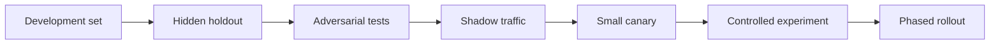

Skipping directly to production converts users into unprotected test subjects and makes failure diagnosis much harder.

---

## 3. Start with an experiment contract

An experiment contract is a versioned specification written before exposure begins. It prevents teams from changing success criteria after seeing the data.

A complete contract should contain:

- decision to be informed;
- user and business problem;
- treatment and control configurations;
- causal hypothesis;
- population and exclusions;
- assignment unit;
- primary outcome metric;
- guardrail metrics;
- diagnostic metrics;
- minimum detectable effect or practical improvement threshold;
- exposure and duration plan;
- stopping and rollback rules;
- analysis method;
- segmentation plan;
- data-quality requirements;
- responsible owner and approvers;
- follow-up decision states.

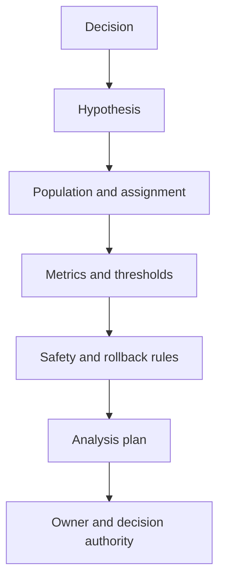

### 3.1 Example experiment contract

**Decision:** Should the support assistant use a reranked retrieval pipeline for password-reset questions?

**Hypothesis:** Reranking will increase successful self-service resolution by at least 4 percentage points without increasing unsupported claims, p95 latency, escalation disparity, or cost beyond approved limits.

**Control:** Hybrid retrieval with top-five chunks.

**Treatment:** Hybrid retrieval, cross-encoder reranking, and top-three context assembly.

**Assignment unit:** Customer account, not message, to avoid users switching between variants during one support journey.

**Primary metric:** Verified self-service resolution within 24 hours.

**Guardrails:** Unsupported-claim rate, inappropriate action rate, repeat-contact rate, p95 latency, cost per resolved case, and cohort escalation disparity.

**Decision:** Ship, iterate, rollback, or escalate for further review.

---

## 4. Write a causal hypothesis, not a feature preference

Weak hypothesis:

> The new agent is better.

Stronger hypothesis:

> For authenticated users asking supported return-policy questions, adding order-aware retrieval and evidence-backed explanations will reduce repeat contacts within seven days because users can see eligibility, policy basis, and next steps. The change must not increase unauthorized data access, false eligibility decisions, p95 latency above three seconds, or human escalation disparity above five percentage points.

A useful causal chain connects the intervention to a mechanism and measurable outcome.

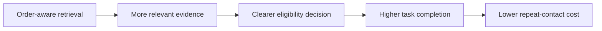

The mechanism matters because a metric may improve for the wrong reason. Escalation rate can decline because the assistant became better, or because it stopped recognizing uncertainty. The second outcome is dangerous.

---

## 5. Build a product metric tree

An AI product metric tree links technical behavior to user and business outcomes.

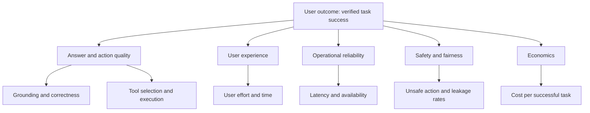

### 5.1 Metric roles

#### Primary outcome metric

The primary metric represents the decision's main objective. There should normally be one primary metric per experiment.

Examples:

- verified issue resolution;
- completed onboarding;
- accepted and correct supplier recommendation;
- time to unblock a sprint dependency;
- decision-quality score from blinded experts.

#### Guardrail metrics

Guardrails define what must not worsen beyond a threshold.

Examples:

- unsupported-claim rate;
- harmful or policy-violating output;
- unauthorized action attempts;
- escalation disparity;
- repeat contacts;
- severe user corrections;
- p95 latency;
- cost per successful task.

#### Diagnostic metrics

Diagnostics explain why the primary metric changed.

Examples:

- retrieval recall;
- evidence coverage;
- tool-call success;
- clarification frequency;
- approval acceptance;
- retries per run;
- abandonment stage;
- model-call count.

#### Operational metrics

Operational metrics show whether the system can be supported.

Examples:

- timeout rate;
- queue depth;
- circuit-breaker openings;
- source availability;
- human-review backlog;
- rollback time.

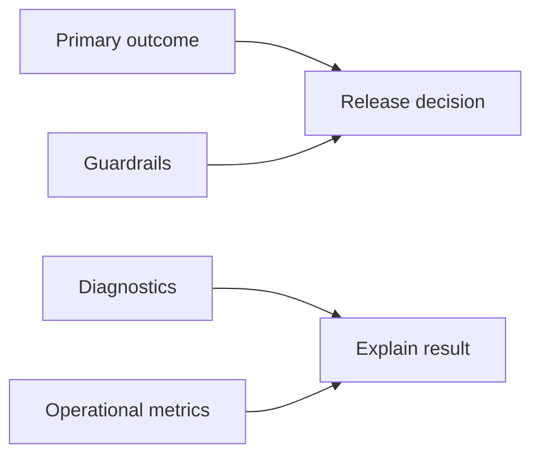

### 5.2 Do not use proxy metrics blindly

Thumbs-up rate may correlate weakly with correctness. Conversation length may indicate engagement or confusion. Lower escalation may indicate autonomy or unsafe overconfidence.

A proxy should have documented evidence that it predicts the intended outcome. When possible, pair immediate metrics with delayed verification.

| Immediate metric | Delayed verification |
|---|---|
| User accepts answer | Issue remains resolved after seven days |
| Supplier selected | Delivery, quality, and cost meet contract |
| Code suggestion accepted | Build, tests, and production behavior remain correct |
| Agent closes ticket | No reopen or complaint within the verification window |

---

## 6. Define the correct unit of randomization

The assignment unit determines which entity consistently receives a variant.

Common units include:

- user;
- account or tenant;
- session;
- conversation thread;
- task;
- team;
- time window;
- geographic region;
- business process.

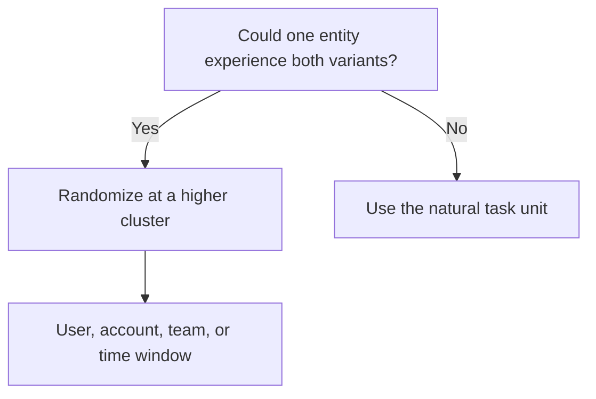

### 6.1 Avoid cross-variant contamination

Randomizing each message is usually inappropriate for a stateful assistant. One conversation may accumulate memory from both variants. A human reviewer may learn from one treatment and apply it to control cases. A team may share generated results.

Use cluster assignment when behavior or state spills across individual events.

### 6.2 Switchback experiments

Some systems cannot randomize users cleanly. A routing policy, staffing workflow, or shared queue may affect everyone simultaneously. A switchback experiment alternates the active variant by controlled time windows.

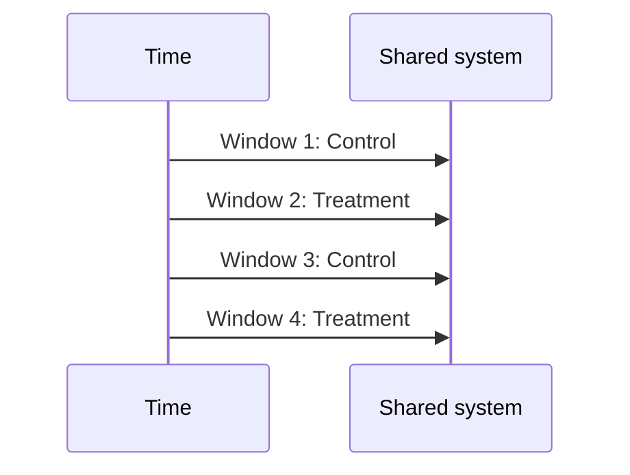

Switchbacks require careful handling of carryover effects, seasonality, and unequal workload.

---

## 7. Choose the right experimental method

### 7.1 Offline evaluation

Use offline evaluation to test known tasks, regressions, adversarial inputs, and deterministic requirements.

Best for:

- rapid iteration;
- comparing prompt or retrieval configurations;
- safety and policy tests;
- reproducible failure analysis;
- low-cost screening.

Limitations:

- dataset may not represent production;
- user adaptation is absent;
- delayed business outcomes are not measured;
- model judges may be biased.

### 7.2 Shadow experiments

The candidate receives a copy of real traffic but does not affect user-visible output or external systems.

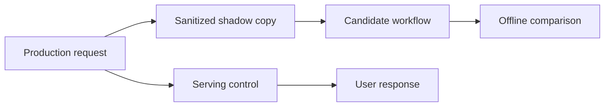

Shadowing is useful for latency, tool selection, retrieval, cost, and quality estimation. It must not perform side effects.

### 7.3 Canary release

A canary exposes a small, monitored population to the candidate. The goal is operational safety before causal inference.

Canary gates should emphasize:

- severe safety failures;
- authorization errors;
- latency and availability;
- cost spikes;
- human-review load;
- unexpected workflow transitions.

### 7.4 A/B experiment

An A/B experiment estimates the causal difference between control and treatment under randomized assignment. It is appropriate when:

- the product has enough traffic;
- outcomes are measurable;
- spillover can be controlled;
- both variants are ethically acceptable;
- the exposure risk is bounded.

### 7.5 Interleaving and preference tests

For ranking or retrieval systems, an interleaved result list can compare two rankers with less traffic than separate experiences. For generative responses, blinded pairwise human or user preference tests can compare outputs, but preference must not replace factual and safety evaluation.

### 7.6 Phased rollout

Phased rollout increases exposure only after each gate passes.

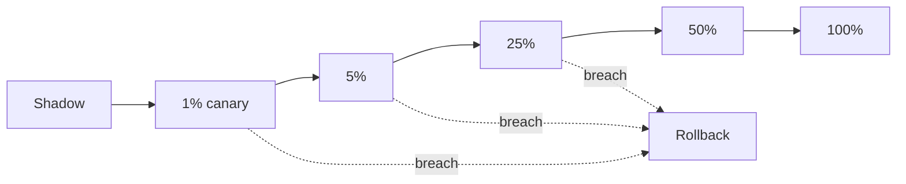

---

## 8. AI outputs are stochastic

The same input can produce different outputs because of sampling, changing context, tool responses, or model infrastructure. One run per case can hide instability.

### 8.1 Repeated-run evaluation

For important offline cases, run each configuration multiple times and measure:

- pass rate;
- variance;
- worst-case behavior;
- policy-failure probability;
- citation stability;
- tool-selection stability;
- cost and latency distribution.

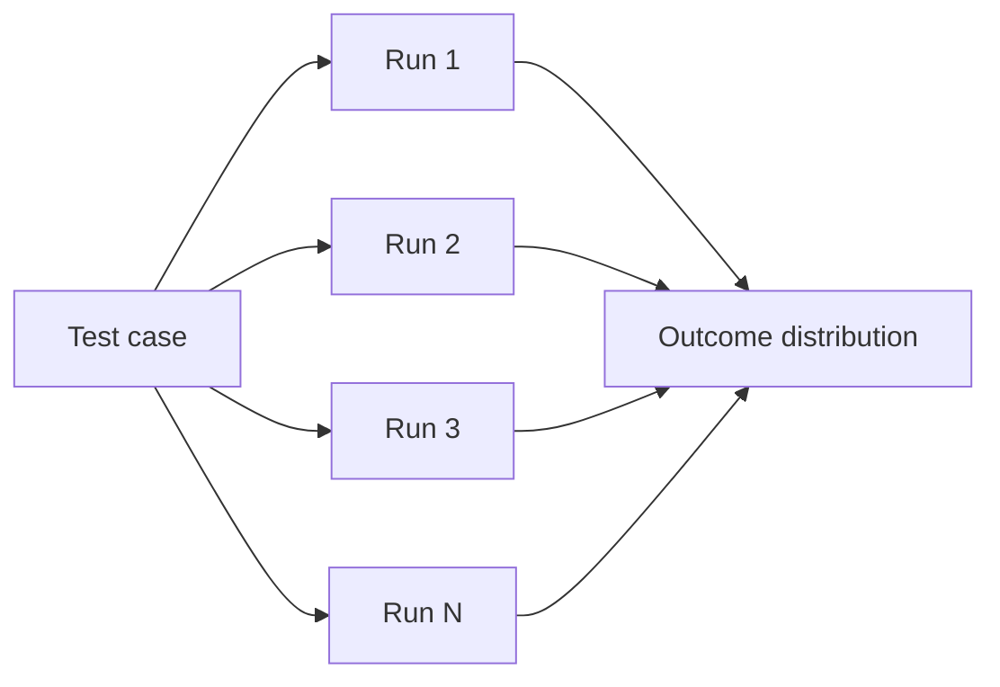

A candidate with a high average score but rare severe failures may be worse than a slightly lower-scoring stable system.

### 8.2 Paired comparison

Run control and treatment on the same cases, source snapshots, and tool fixtures. Paired comparisons reduce noise because both variants face the same conditions.

### 8.3 Version every dependency

Record:

- model and decoding settings;
- prompts and policies;
- retriever and embedding versions;
- knowledge snapshot;
- tool schemas and fixtures;
- guardrail and evaluator versions;
- application version.

Without this information, experimental results cannot be reproduced.

---

## 9. Measure quality at several levels

### 9.1 Component quality

- classification accuracy;
- retrieval recall and ranking quality;
- schema validity;
- tool-selection accuracy;
- policy-rule compliance.

### 9.2 Step quality

- was the plan valid;
- was the correct evidence retrieved;
- were action arguments correct;
- was uncertainty recognized;
- was the next state appropriate.

### 9.3 Trajectory quality

- unnecessary loops;
- repeated actions;
- retry effectiveness;
- progress per step;
- bounded completion;
- correct escalation.

### 9.4 Outcome quality

- task completed;
- result verified;
- user effort reduced;
- no harmful side effect;
- business outcome achieved.

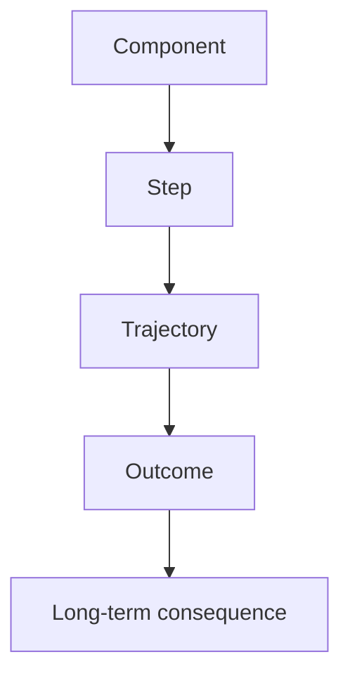

The most useful evaluation stack covers all levels. Component metrics aid debugging, while outcome metrics support product decisions.

---

## 10. Safety and fairness are experiment constraints

Safety and fairness should not be analyzed only after a positive result.

### 10.1 Hard constraints

A treatment should not ship if it violates a hard constraint, even when the average primary metric improves.

Examples:

- any cross-tenant data disclosure;
- unapproved high-impact action;
- severe policy violation above zero tolerance;
- unsupported medical, legal, or financial decision;
- unacceptable disparity in denial or escalation;
- audit-trail loss.

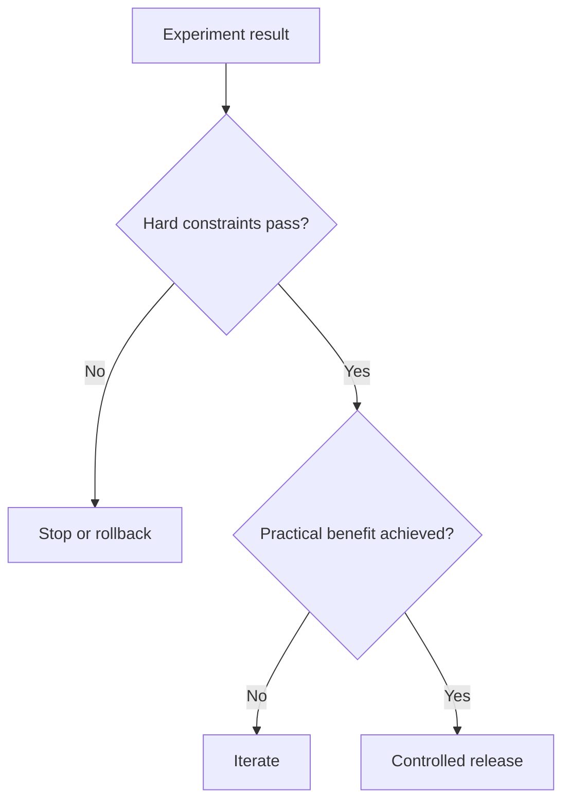

### 10.2 Slice analysis

Analyze important cohorts and task slices:

- language;
- accessibility need;
- customer tier;
- geography;
- request complexity;
- high-risk action class;
- source availability;
- new versus returning user;
- ambiguous versus clear request.

Aggregate improvement can conceal serious regressions in a smaller but important group.

### 10.3 Fairness-aware decision rules

A release gate can require:

- minimum performance for every protected or operationally important slice;
- maximum disparity across slices;
- counterfactual consistency;
- comparable escalation quality;
- equivalent access to correction and appeal.

---

## 11. Latency, cost, and capacity are part of product quality

A candidate may improve response correctness while doubling latency or tripling human-review volume. That may not be a viable product improvement.

### 11.1 Cost per successful task

Cost per request can be misleading. A cheaper answer that fails more often may increase total support cost.

A better measure is:

```text
cost per verified successful task
=
(model + retrieval + tool + infrastructure + human-review cost)
/
verified successful tasks
```

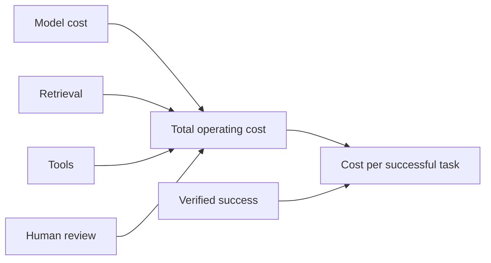

### 11.2 Capacity guardrails

Experiments should monitor:

- token and request rate;
- queue depth;
- tool quotas;
- human-review backlog;
- cache hit rate;
- source-system load;
- retry amplification.

A treatment that overwhelms a review queue has transferred work rather than removed it.

---

## 12. Statistical significance is not the decision

Statistical analysis estimates uncertainty around an observed difference. Product decisions also require practical significance, risk, cost, reversibility, and strategic fit.

### 12.1 Four questions for every result

1. **Is the result credible?** Was assignment valid and data quality acceptable?
2. **Is the effect practically meaningful?** Does it exceed the predefined minimum improvement?
3. **Are constraints satisfied?** Did safety, fairness, latency, and cost remain acceptable?
4. **Is the result durable?** Does it persist across slices, time, and source conditions?


### 12.2 Avoid repeated peeking

Stopping an experiment whenever the current result looks favorable inflates false-positive risk. Define minimum exposure, duration, and stopping logic in advance. Sequential methods can support valid early stopping, but the method must be chosen before observing treatment effects.

### 12.3 Confidence intervals over binary declarations

Report the estimated effect and its uncertainty rather than only “significant” or “not significant.” A wide interval may indicate insufficient evidence. A narrow interval around a tiny effect may indicate a statistically detectable but commercially irrelevant change.

---

## 13. Data quality and instrumentation gates

An experiment is invalid when assignment, exposure, or outcome data is unreliable.

### 13.1 Required checks

- assignment is stable and unbiased;
- control and treatment exposure is logged;
- users receive the assigned variant;
- outcome events are complete and deduplicated;
- clocks and identifiers align across systems;
- bots, internal tests, and invalid traffic are excluded;
- source outages are recorded;
- sample-ratio mismatch is checked;
- metric definitions are versioned.

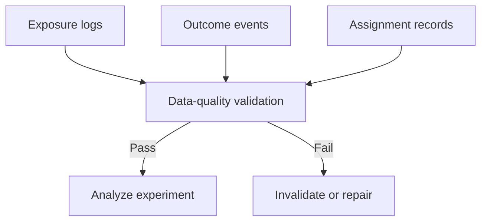

### 13.2 Sample-ratio mismatch

If the observed control-treatment split differs materially from the intended allocation, possible causes include assignment bugs, selective logging, variant-specific failures, or eligibility logic differences. Do not interpret outcome metrics until the mismatch is explained.

---

## 14. Experiment decision states

A disciplined process uses more than “ship” and “do not ship.”

| Decision | Meaning |
|---|---|
| Ship | Primary benefit achieved and all gates passed |
| Phased rollout | Evidence is positive but broader operational validation is required |
| Iterate | Mechanism appears promising, but thresholds were not met |
| Extend | Data is valid but uncertainty remains too high |
| Roll back | A hard guardrail or operational threshold failed |
| Stop | The hypothesis or mechanism is not supported |
| Escalate | Risk, fairness, or policy review requires accountable human decision |

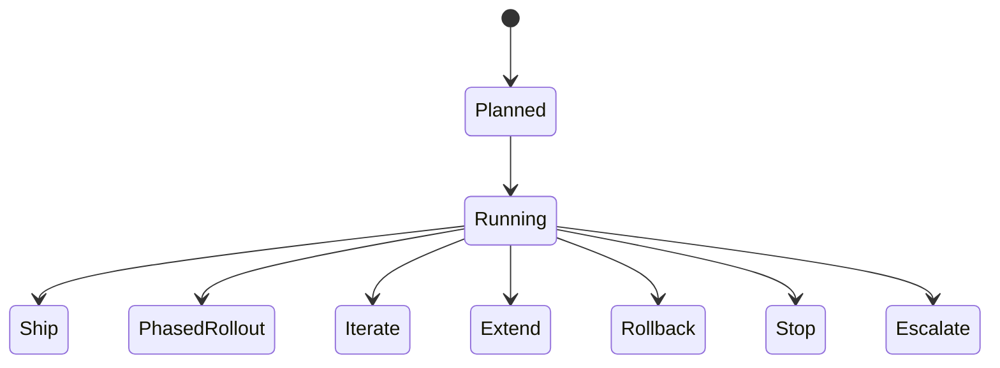

The decision and its reasoning should be written into an experiment record, including limitations and follow-up actions.

---

## 15. Continuous optimization after release

A successful experiment establishes evidence for a specific population, configuration, and time period. It does not guarantee permanent performance.

### 15.1 Sources of post-release drift

- user behavior changes;
- model provider updates;
- knowledge-base changes;
- product policy changes;
- tool schemas and permissions change;
- traffic mix shifts;
- adversaries adapt;
- human reviewers change behavior;
- feedback loops alter the training or retrieval corpus.

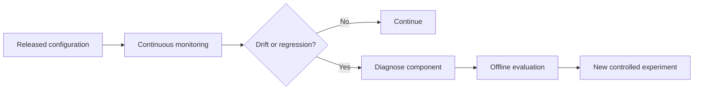

### 15.2 Optimization backlog

Maintain a backlog of observed opportunities organized by layer:

- prompt and instruction;
- retrieval and evidence;
- model and routing;
- tool and workflow;
- UX and human control;
- safety and fairness;
- latency and cost;
- observability and operations.

This avoids treating every failure as a prompt problem.

---

## 16. Worked example: optimizing a support triage assistant

### 16.1 Problem

The current assistant classifies tickets accurately but asks unnecessary clarification questions, increasing time to assignment.

### 16.2 Candidate

The treatment adds a confidence-aware decision rule:

- classify directly when category and severity confidence exceed thresholds;
- retrieve account context for business-impact questions;
- ask one targeted clarification only when the missing field changes priority or routing;
- escalate high-impact ambiguity.

### 16.3 Hypothesis

The treatment will reduce median time to correct assignment by 20% without reducing category accuracy, increasing P1 false positives, or creating cohort-level escalation disparity.

### 16.4 Metric tree

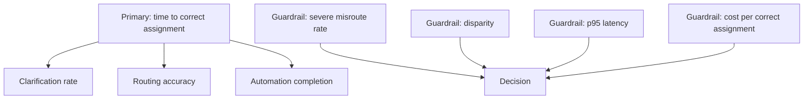

### 16.5 Experiment path

1. Offline evaluation on historical tickets.
2. Repeated-run stability tests on ambiguous and adversarial cases.
3. Shadow comparison on live traffic.
4. Five-percent canary with writes disabled.
5. Account-level randomized experiment.
6. Human verification of assignment correctness.
7. Delayed check for ticket reassignment and reopen.
8. Phased rollout if all gates pass.

### 16.6 Interpretation

Suppose time to assignment improves by 24%, but severe misroutes rise from 0.3% to 0.8% against a 0.5% maximum. The candidate does not ship. The team may preserve the direct-classification policy for low-risk categories while restoring clarification or human review for severe cases.

This is optimization under constraints, not metric maximization.

---

## 17. Reference implementation

The accompanying dependency-free Python example models an experiment between two AI support-assistant variants. It demonstrates:

- typed experiment and observation records;
- stable assignment;
- primary, guardrail, diagnostic, and operational metrics;
- slice analysis;
- practical-improvement thresholds;
- hard release constraints;
- cost per verified success;
- sample-ratio checks;
- machine-readable decisions.

```text
examples/39-product-experimentation/
├── ai_product_experiment.py
└── sample_output.json
```

The implementation is intentionally deterministic and educational. A production platform would integrate an experimentation service, event warehouse, privacy controls, statistical analysis library, feature flags, model and prompt registries, and release automation.

---

## 18. Production experimentation architecture

```mermaid
flowchart TB
    USER[Eligible user or account] --> ASSIGN[Experiment assignment service]
    ASSIGN --> CTRL[Control configuration]
    ASSIGN --> TREAT[Treatment configuration]
    CTRL --> APP[Agent application]
    TREAT --> APP
    APP --> OBS[Exposure, trace, and outcome events]
    OBS --> WARE[Governed event warehouse]
    WARE --> QA[Data-quality checks]
    QA --> ANALYSIS[Experiment analysis]
    ANALYSIS --> GATES[Quality, safety, fairness, latency, and cost gates]
    GATES --> DECISION[Human-owned release decision]
    DECISION --> REG[Experiment and configuration registry]
```

Important supporting services include:

- feature and configuration flags;
- stable identity and tenant boundaries;
- prompt, model, retrieval, tool, and policy version registries;
- evaluation datasets;
- approval and rollback controls;
- privacy-aware telemetry;
- audit history;
- incident response.

---

## 19. Common failure modes

### 19.1 Optimizing an offline score only

The candidate improves a benchmark but increases user effort or fails on current production traffic.

**Control:** combine offline, shadow, controlled, and longitudinal evidence.

### 19.2 Choosing a manipulable primary metric

The system increases “resolution” by closing tasks prematurely.

**Control:** use verified outcomes and delayed checks.

### 19.3 Ignoring severe rare failures

Average quality improves while a small number of unsafe actions appear.

**Control:** hard constraints, adversarial tests, and worst-case analysis.

### 19.4 Randomizing at the wrong unit

A user sees multiple variants in one workflow, contaminating state and behavior.

**Control:** randomize at the highest unit that contains shared state and spillover.

### 19.5 Changing several major mechanisms without diagnostics

A treatment changes the model, prompt, retriever, UX, and policy simultaneously. The result cannot explain which mechanism mattered.

**Control:** use staged experiments or factorial designs when practical, and retain diagnostic metrics.

### 19.6 Peeking and stopping opportunistically

The team ends the test when a favorable result appears.

**Control:** predefine duration, exposure, and valid sequential rules.

### 19.7 Treating no significance as no effect

The experiment may be underpowered or highly variable.

**Control:** inspect confidence intervals, practical thresholds, and data quality.

### 19.8 Treating significance as product value

A tiny improvement may not justify cost, complexity, or risk.

**Control:** require minimum practical benefit and total-cost analysis.

### 19.9 Allowing guardrail debt

The team accepts a safety or fairness regression with a promise to fix it later.

**Control:** encode non-negotiable release gates.

### 19.10 Failing to monitor after rollout

The initial result decays as data and behavior change.

**Control:** connect experiment metrics to continuous operational monitoring.

---

## 20. Product experimentation checklist

### Before the experiment

- [ ] State the decision and causal hypothesis.
- [ ] Version control and treatment configurations.
- [ ] Define the eligible population and exclusions.
- [ ] Choose a stable assignment unit.
- [ ] Define one primary outcome metric.
- [ ] Define quality, safety, fairness, latency, cost, and operational guardrails.
- [ ] Define diagnostic metrics and slices.
- [ ] Set practical-improvement thresholds.
- [ ] Set exposure, duration, stopping, and rollback rules.
- [ ] Validate instrumentation and privacy handling.
- [ ] Name the accountable decision owner.

### During the experiment

- [ ] Check exposure and sample-ratio integrity.
- [ ] Monitor hard safety and operational thresholds.
- [ ] Avoid unplanned metric or population changes.
- [ ] Record incidents, outages, and source changes.
- [ ] Protect treatment isolation.
- [ ] Track human-review capacity.

### After the experiment

- [ ] Report effects with uncertainty.
- [ ] Review all predefined slices and constraints.
- [ ] Distinguish practical from statistical significance.
- [ ] Document limitations and unexpected findings.
- [ ] Record the ship, iterate, extend, rollback, stop, or escalate decision.
- [ ] Define monitoring and reversal conditions.
- [ ] Add failures and edge cases to regression datasets.

---

## 21. Knowledge checks

1. Why is an AI experiment's treatment broader than a prompt template?
2. How do primary, guardrail, diagnostic, and operational metrics differ?
3. When should assignment occur at account rather than request level?
4. What can shadow traffic reveal, and what can it not prove?
5. Why should repeated-run evaluation be used for stochastic systems?
6. How can lower escalation rate represent a harmful regression?
7. What is the difference between practical and statistical significance?
8. Why is cost per successful task preferable to cost per request?
9. What does sample-ratio mismatch indicate?
10. Why must safety and fairness be encoded as release constraints?
11. When is a switchback experiment useful?
12. Why does a successful experiment still require longitudinal monitoring?

---

## 22. Interview questions

### Foundational

1. Design a metric tree for an enterprise knowledge assistant.
2. Explain the difference between offline evaluation and an A/B experiment.
3. What metrics would you use for an agent that performs tool actions?
4. How would you evaluate a retrieval improvement?
5. What is the correct unit of randomization for a stateful assistant?

### Senior engineering and product

6. A treatment improves task completion but increases p95 latency by 40%. How would you decide?
7. Design a shadow experiment for a new tool-routing policy.
8. How would you prevent a treatment from silently reducing human escalation through overconfidence?
9. How would you measure delayed outcomes such as repeat contact or workflow rework?
10. How would you evaluate a candidate when production traffic is low?
11. How would you handle multiple correlated sessions from the same account?
12. What should trigger an automatic rollback?
13. How would you compare two stochastic agents fairly?
14. How would you detect that a knowledge-base update invalidated an experiment?
15. What evidence is required before granting an agent greater autonomy?

### Leadership and governance

16. Who owns an experiment decision when quality improves but fairness regresses?
17. How should legal, security, operations, design, and product participate in release gates?
18. How do you prevent metric gaming in AI product teams?
19. When should an experiment be prohibited even if both variants are technically possible?
20. How do you build an organizational learning loop from incidents, experiments, and user corrections?

---

## 23. Summary

AI product experimentation is the controlled process of learning whether a complete system configuration causes better outcomes under explicit constraints. It extends beyond prompt comparison and includes models, retrieval, tools, policies, state, UX, guardrails, and operations.

The strongest experimentation programs:

- accumulate evidence from offline evaluation through production monitoring;
- define a versioned experiment contract before exposure;
- connect technical metrics to verified user and business outcomes;
- randomize at a unit that prevents state and behavior contamination;
- account for stochasticity and repeated users;
- treat safety, fairness, latency, cost, and capacity as release constraints;
- preserve diagnostic metrics that explain mechanisms;
- use practical significance and uncertainty rather than binary significance alone;
- encode rollback and escalation before incidents occur;
- continue monitoring after launch because AI systems and their environments drift.

The purpose of experimentation is not to prove that a favored feature works. It is to make a defensible decision, expose uncertainty, protect users, and improve the product's learning system.
