# Chapter 32 - End-to-End Supplier Recommendation Agent Project

> **Source basis:** The board introduces a supplier recommendation agent that compares suppliers, checks price, delivery, and historical quality, explains the recommendation, exposes confidence and sources, and allows a user to inspect details or request human review. It also provides the orchestration, RAG, tool-routing, multi-agent, guardrail, UX, state, latency, evaluation, and observability patterns needed to turn that concept into a production system [Board, pp. 2, 15-19, 20-30, 35-39, 47-50]. This chapter preserves that project. The scoring model, contracts, test data, and dependency-free implementation are **Supplementary**.

---

## Learning objectives

By the end of this project, you should be able to:

1. Translate a supplier-selection request into explicit hard constraints, preferences, and decision criteria.
2. Separate supplier data retrieval, normalization, eligibility checks, scoring, review, and award execution.
3. Design a recommendation that preserves evidence, freshness, confidence, and uncertainty.
4. Combine price, delivery, quality, capacity, compliance, and risk without hiding trade-offs.
5. Prevent a weighted score from overriding mandatory policy or regulatory constraints.
6. Parallelize independent supplier checks and merge their outputs safely.
7. Handle missing, stale, contradictory, and incomparable supplier data.
8. Apply least privilege, approval gates, idempotency, and confirmation reads to sourcing actions.
9. Design an application-layer explanation that users can inspect and challenge.
10. Evaluate ranking quality, constraint compliance, calibration, fairness, latency, and business outcomes.
11. Deploy the system progressively from analyst assistance to bounded automation.
12. Run and inspect a dependency-free reference implementation.

---

## 1. Project brief

A procurement or sourcing team receives a request such as:

> Recommend the best supplier for 5,000 sterile sample tubes. Delivery is required within 21 days. The supplier must be approved for the requested region and must meet the minimum historical quality threshold.

A superficial agent might read a spreadsheet, choose the lowest price, and produce a confident sentence. A production system must do considerably more:

- resolve the requested item and specification;
- confirm quantity, destination, and required-by date;
- retrieve current quotes and lead times;
- verify supplier approval, certifications, and regional eligibility;
- check historical quality and on-time delivery;
- determine whether capacity is sufficient;
- identify contractual or concentration risk;
- normalize incomparable units and currencies;
- apply mandatory constraints before ranking;
- show the evidence behind every material claim;
- communicate uncertainty and missing information;
- require human approval before creating a purchase request or award;
- record the decision and its versions for audit.

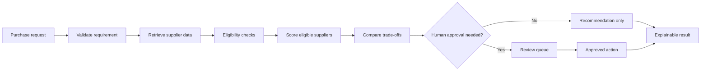

### 1.1 Goal

Build a bounded agent that recommends suppliers using approved enterprise data and may create a draft sourcing action only after the required approval.

### 1.2 Non-goals

The system does not:

- negotiate legal terms autonomously;
- override supplier sanctions or compliance restrictions;
- fabricate a quote, certification, or quality score;
- award business solely because one aggregate score is highest;
- expose one supplier's confidential pricing to another supplier;
- create or approve a purchase order without delegated authority;
- treat stale data as current without disclosure;
- silently convert units, currencies, or dates when the conversion is ambiguous.

### 1.3 Success criteria

The project succeeds when it:

- excludes ineligible suppliers deterministically;
- ranks eligible suppliers consistently;
- explains why the winner is preferred and where alternatives are stronger;
- cites current source records;
- reports missing or conflicting evidence;
- routes high-risk cases to a human;
- prevents duplicate purchase actions;
- supports replay, audit, and post-award learning.

---

## 2. Convert the sourcing request into a decision contract

A procurement request is not merely a natural-language prompt. It is a decision contract with mandatory fields and explicit ownership.

### 2.1 Request contract

| Field | Type | Required | Example |
|---|---|---:|---|
| `request_id` | string | Yes | `SR-2048` |
| `tenant_id` | string | Yes | `business-unit-a` |
| `item_id` | string | Yes | `TUBE-15ML-S` |
| `quantity` | integer | Yes | `5000` |
| `destination_region` | string | Yes | `US` |
| `required_by` | date | Yes | `2026-09-01` |
| `currency` | string | Yes | `USD` |
| `minimum_quality` | decimal | Yes | `0.95` |
| `required_certifications` | list | No | `ISO-9001` |
| `maximum_budget` | decimal | No | `12500` |
| `preferences` | object | No | Sustainability weight |
| `requested_action` | enum | Yes | Recommend or create draft |

### 2.2 Hard constraints and preferences

Hard constraints determine eligibility. Preferences determine ranking among eligible suppliers.

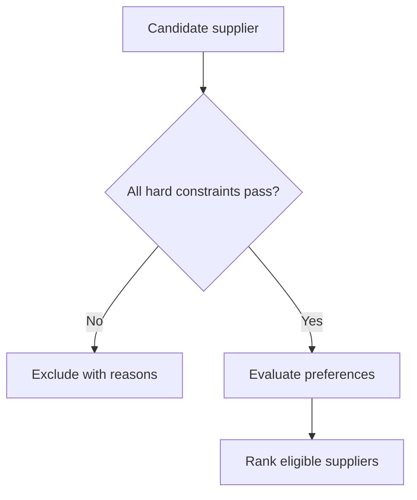

Examples of hard constraints:

- supplier is approved for the destination region;
- quote is valid on the decision date;
- capacity meets the requested quantity;
- delivery estimate is on or before the required date;
- quality score meets the minimum threshold;
- required certification is present and unexpired;
- supplier is not suspended, sanctioned, or blocked;
- currency and unit-of-measure conversions are validated.

Examples of preferences:

- lower total landed cost;
- earlier delivery margin;
- higher quality performance;
- stronger on-time delivery history;
- lower concentration risk;
- preferred payment terms;
- sustainability or diversity objectives;
- existing contractual relationship.

> **Best practice:** Never let a favorable weighted score compensate for a failed mandatory constraint. Eligibility comes before optimization.

### 2.3 Output contract

```json
{
  "request_id": "SR-2048",
  "status": "recommendation_ready",
  "recommended_supplier": "Supplier A",
  "confidence": 0.88,
  "summary": "Supplier A is the best eligible option because it meets the delivery date, has the highest quality score, and remains within budget.",
  "ranked_suppliers": [
    {
      "supplier_id": "SUP-A",
      "eligible": true,
      "score": 0.91,
      "landed_cost": 11250,
      "delivery_date": "2026-08-24",
      "quality_score": 0.98,
      "strengths": ["highest quality", "8-day delivery buffer"],
      "tradeoffs": ["not the lowest unit price"]
    }
  ],
  "excluded_suppliers": [
    {
      "supplier_id": "SUP-C",
      "reasons": ["certification expired"]
    }
  ],
  "evidence": [],
  "limitations": [],
  "approval_required": true,
  "proposed_action": null
}
```

### 2.4 Completion contract

The workflow is complete only when:

1. the request is valid and authorized;
2. the item specification has been resolved;
3. supplier records come from approved sources;
4. hard constraints have been evaluated;
5. eligible suppliers have comparable normalized values;
6. the ranking includes evidence and trade-offs;
7. uncertainty and data gaps are disclosed;
8. the requested action is executed, held for approval, or safely declined;
9. the decision is recorded with its data, policy, and model versions.

---

## 3. Reference architecture

The architecture separates the user experience, orchestration, specialist evaluations, policy enforcement, enterprise systems, and audit trail.

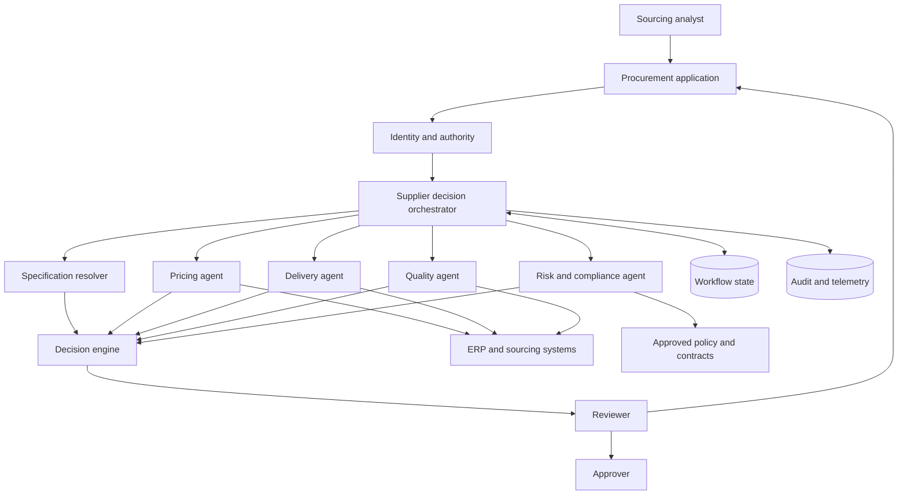

### 3.1 Why specialist checks are useful

Price, delivery, quality, and compliance are separate domains with different sources, validation rules, and failure modes. A specialist design can make those boundaries explicit without requiring every project to become a free-form multi-agent conversation.

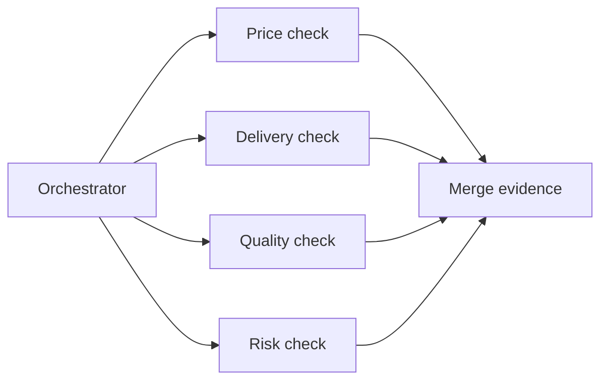

Use separate agents or services only where the separation creates real value. Simple calculations should remain deterministic functions.

### 3.2 Why scoring is not delegated entirely to an LLM

The language model is useful for interpreting requests, resolving ambiguous descriptions, and drafting explanations. Eligibility rules, normalized calculations, and release gates should be deterministic whenever possible.

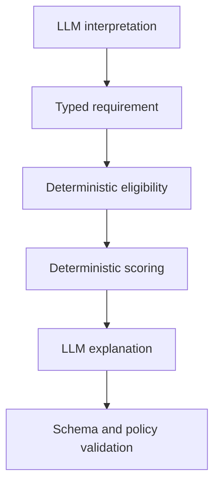

---

## 4. Data model and evidence contract

A recommendation is only as reliable as the supplier data behind it.

### 4.1 Supplier evidence

A supplier record may combine:

- supplier master status;
- approved-region status;
- quote and validity dates;
- item and unit-of-measure match;
- lead time and available capacity;
- historical defect or acceptance rate;
- historical on-time delivery rate;
- certification status;
- contractual terms;
- risk and sanctions screening;
- sustainability or diversity attributes;
- incident and corrective-action history.

Each material value should include:

| Field | Purpose |
|---|---|
| Source identifier | Where the fact came from |
| Source version | Which version was used |
| Observed timestamp | When the fact was measured |
| Valid-through date | When it expires |
| Unit and currency | How to interpret the value |
| Provenance | Original or derived |
| Confidence | Reliability of the evidence |
| Access class | Who may view it |

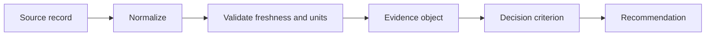

### 4.2 Freshness policy

Different facts age at different rates:

- a quote may expire in days;
- available capacity may change hourly;
- certification may remain valid for a year;
- historical quality may be updated monthly;
- sanctions status may require near-real-time checking.

Do not use one universal freshness threshold.

### 4.3 Data conflict

Two systems may disagree about lead time or supplier status. The system needs a source-of-truth hierarchy, not an average.

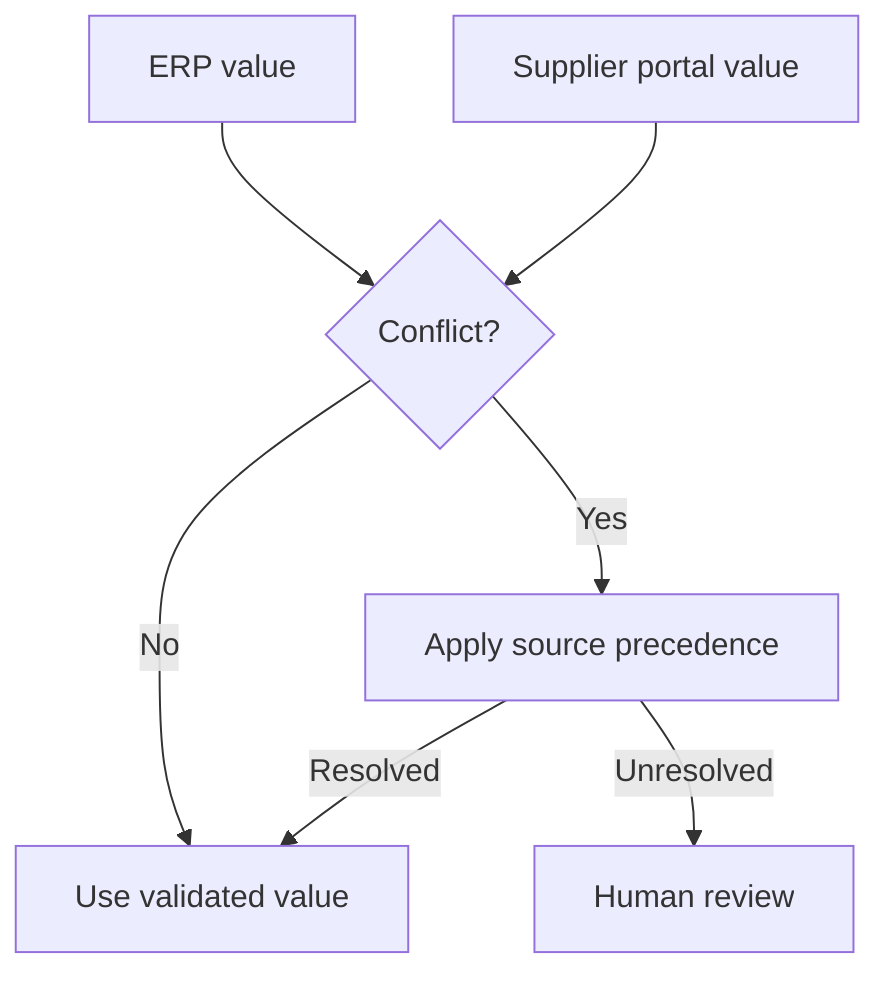

A conflict should become a visible limitation. It must not be hidden inside the final score.

---

## 5. Eligibility before ranking

### 5.1 Deterministic eligibility checks

For each candidate, evaluate mandatory criteria and record each result separately.

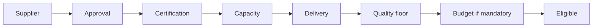

An exclusion record should include:

- failed criterion;
- observed value;
- required value;
- evidence source;
- whether remediation is possible;
- whether a human exception is legally permitted.

### 5.2 Exceptions

Some policies allow exceptions. The agent should not invent them. An exception flow requires:

- explicit policy authority;
- named approver role;
- documented rationale;
- expiration or review date;
- separate audit event;
- no automatic reuse of the exception for future requests.

### 5.3 No eligible supplier

If every supplier fails, the correct answer is not to select the least-bad supplier.

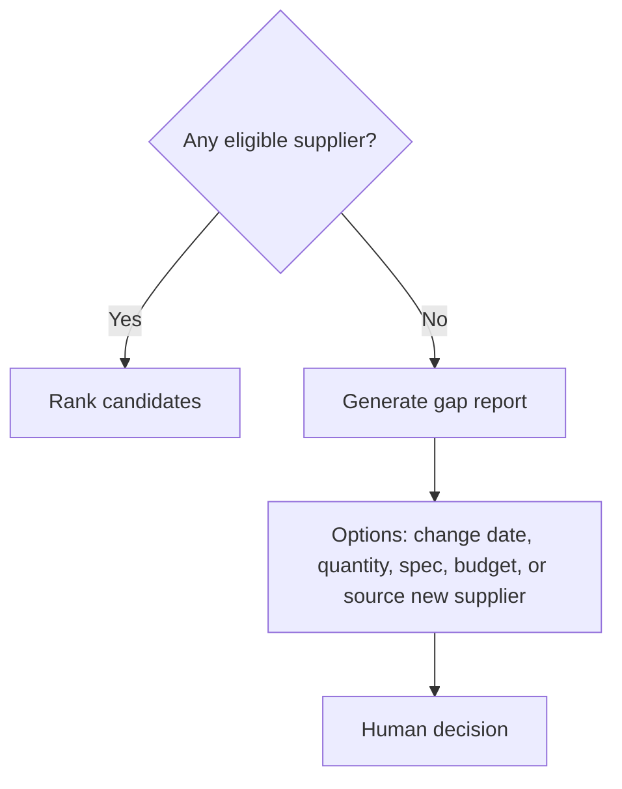

---

## 6. Transparent scoring

A weighted score supports comparison, but it is not a substitute for judgment.

### 6.1 Normalize criteria

Raw values use different units. Convert each preference to a common 0-to-1 scale.

For a lower-is-better criterion such as cost:

```text
normalized_cost = (max_cost - supplier_cost) / (max_cost - min_cost)
```

For a higher-is-better criterion such as quality:

```text
normalized_quality = (supplier_quality - min_quality) / (max_quality - min_quality)
```

Clamp values to the expected range and disclose when a business threshold is used instead of observed minima and maxima.

### 6.2 Weighted score

```text
score =
    cost_weight * normalized_cost
  + delivery_weight * normalized_delivery
  + quality_weight * normalized_quality
  + reliability_weight * normalized_reliability
  + risk_weight * normalized_risk
```

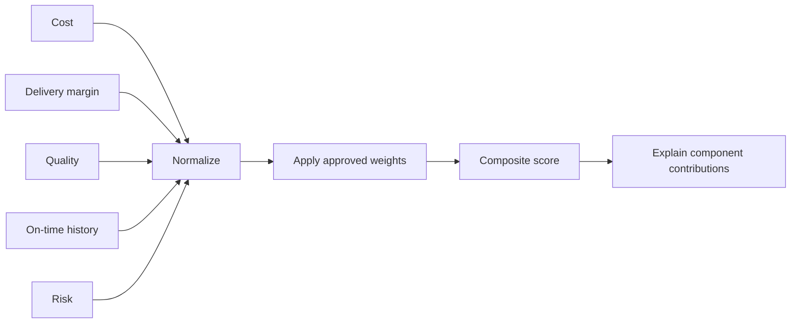

### 6.3 Weight governance

Weights encode policy and business priorities. They should be:

- versioned;
- owned by a named function;
- reviewed periodically;
- tested against historical decisions;
- protected from ad hoc user manipulation;
- visible in the explanation when they materially affect the result.

### 6.4 Sensitivity analysis

A recommendation is fragile when small weight changes alter the winner.

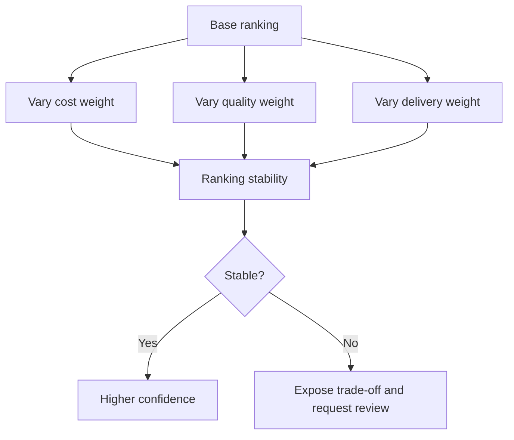

### 6.5 Pareto view

Do not force every decision into one number. Present the best trade-off alternatives:

- lowest cost;
- earliest delivery;
- highest quality;
- lowest risk;
- best balanced option.

This allows a decision owner to understand what is being traded away.

---

## 7. Parallel checks and safe merge

Price, delivery, quality, and risk checks are often independent and can run concurrently.

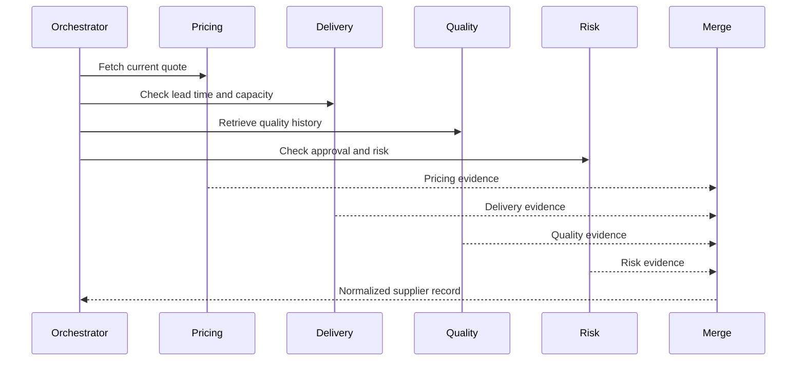

### 7.1 Merge contract

The merge step should verify:

- every result refers to the same supplier and item;
- units and currencies are compatible;
- timestamps satisfy criterion-specific freshness rules;
- required fields are present;
- conflicting values have been resolved or surfaced;
- errors remain associated with the originating check.

### 7.2 Partial failure

A failed sustainability lookup might allow a recommendation with a limitation. A failed compliance lookup should normally block the recommendation.

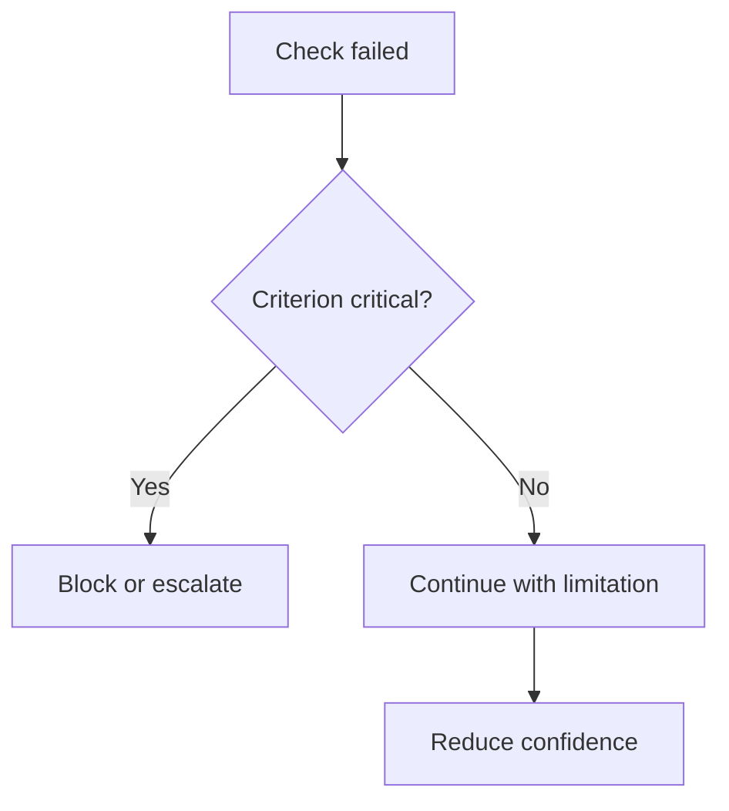

Use an explicit criticality map rather than allowing the model to decide informally.

---

## 8. Confidence and uncertainty

Confidence is not the model's tone. It should derive from observable conditions.

Possible components:

- evidence completeness;
- data freshness;
- source agreement;
- margin between top candidates;
- ranking stability;
- number of policy exceptions;
- unresolved ambiguity;
- historical calibration.

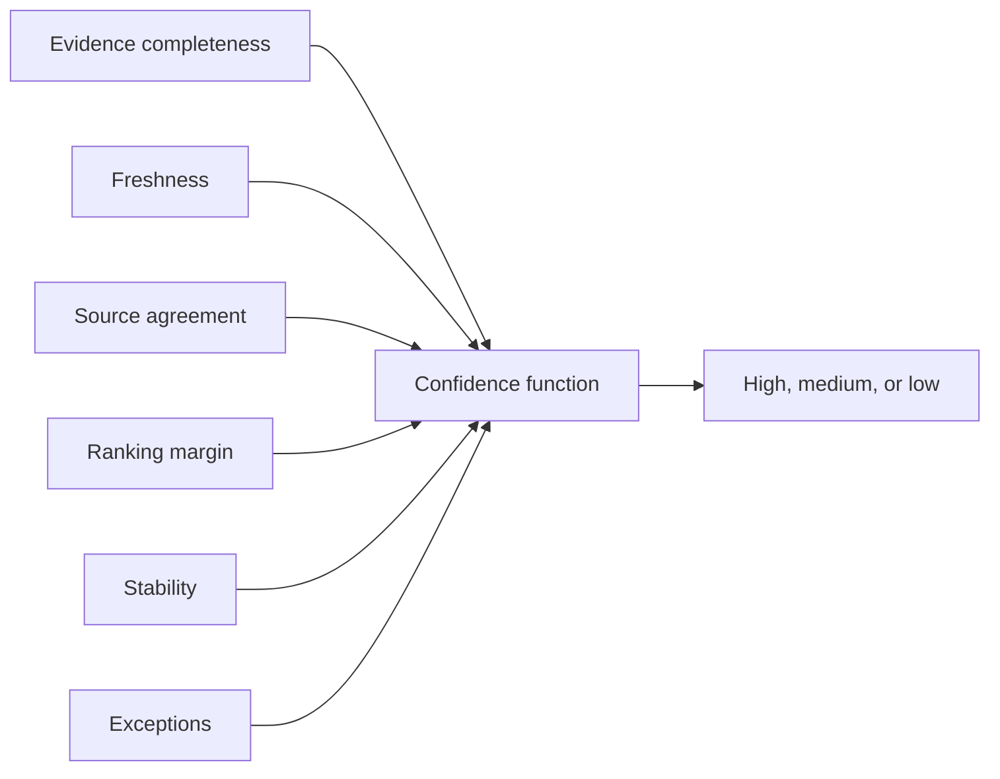

A close score is not automatically low confidence if the alternatives are genuinely equivalent. It may instead mean that the decision is preference-sensitive and should be presented as a trade-off.

---

## 9. Tool contracts and safe actions

### 9.1 Read capabilities

Typical read-only tools include:

- retrieve approved suppliers;
- fetch current quotes;
- check inventory or capacity;
- retrieve quality metrics;
- check certification and sanctions status;
- calculate landed cost;
- retrieve contract terms;
- obtain currency rates from an approved service.

### 9.2 Write capabilities

Write tools may:

- create a sourcing review case;
- create a draft purchase requisition;
- request an updated quote;
- reserve capacity;
- notify an approver;
- record the final decision.

Each write tool needs a typed schema, scope, risk class, idempotency key, approval policy, and confirmation read.

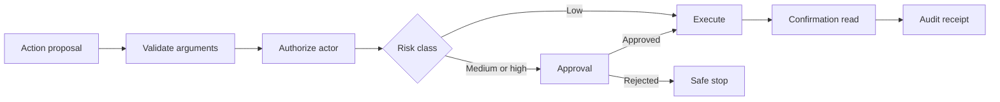

### 9.3 Exact-action approval

Approval must be bound to the exact supplier, quantity, amount, item, destination, and action type. If any field changes, the approval is invalid.

### 9.4 Idempotency

Use a stable idempotency key such as:

```text
hash(tenant_id + request_id + action_type + normalized_arguments)
```

This prevents retries from creating duplicate requisitions.

---

## 10. Guardrails and policy controls

### 10.1 Input guardrails

Reject or clarify requests that:

- omit the item or quantity;
- contain impossible dates;
- use an unsupported unit;
- ask to bypass approved-supplier policy;
- request confidential competitor pricing;
- embed instructions to ignore procurement controls;
- attempt cross-tenant access.

### 10.2 Supplier-data isolation

Supplier commercial data can be sensitive. Apply:

- tenant and business-unit filters;
- purpose-based access;
- field-level redaction;
- separation between supplier submissions;
- no leakage of one supplier's quote into communication with another.

### 10.3 Policy enforcement

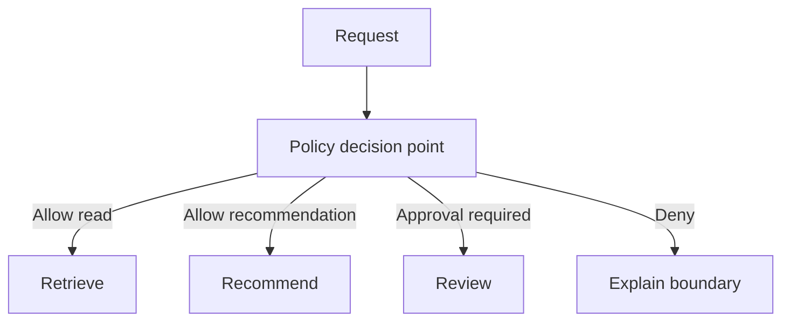

The policy engine should be independent of the recommendation prose.

### 10.4 Human review triggers

Require human review when:

- expected spend exceeds authority;
- only one eligible supplier remains;
- data freshness is inadequate;
- the recommendation changes an incumbent supplier;
- certification or sanctions evidence is ambiguous;
- the top candidates are nearly tied;
- a policy exception is requested;
- the action creates a contractual commitment;
- the recommendation affects a regulated or safety-critical item.

---

## 11. State, recovery, and auditability

The workflow state should record:

- original request and normalized requirement;
- candidate supplier identifiers;
- per-criterion evidence;
- exclusions and reasons;
- normalized values and weight version;
- ranking and sensitivity results;
- approval status;
- proposed and executed actions;
- retries, failures, and limitations;
- prompt, model, policy, and code versions.

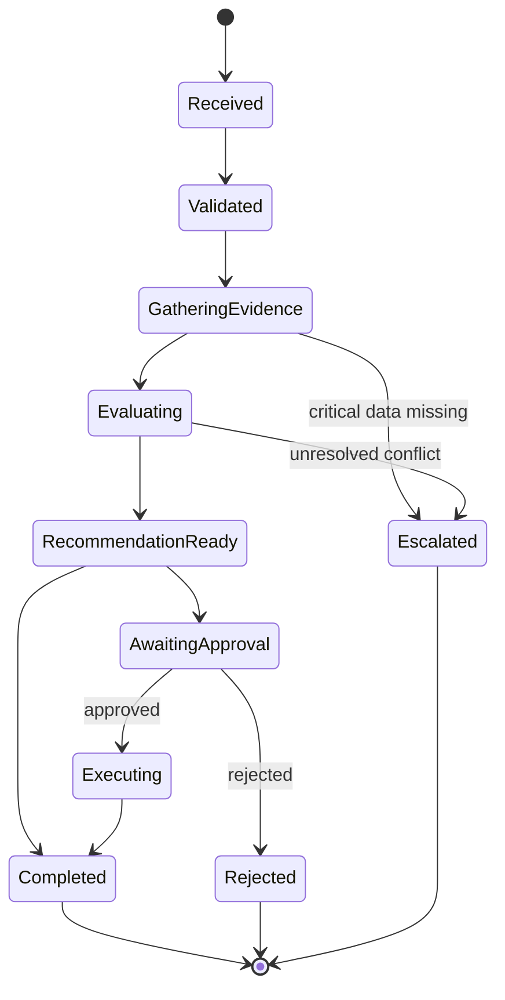

### 11.1 Retry policy

Retry transient reads with bounded exponential backoff. Do not retry:

- authorization denials;
- invalid input;
- expired approval;
- permanent supplier ineligibility;
- an ambiguous write until reconciliation is complete.

### 11.2 Checkpointing

Checkpoint after:

- validation;
- evidence collection;
- eligibility;
- ranking;
- human approval;
- action confirmation.

This allows the workflow to resume without repeating expensive calls or side effects.

---

## 12. Application-layer UX

The board contrasts a weak answer such as "The best supplier is Supplier A" with a better answer that explains why, shows confidence and sources, and offers details or human review. That is the right design principle for this project.

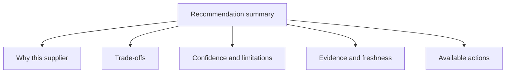

A strong result view should show:

- recommended supplier;
- status: recommendation, approval pending, or executed;
- total landed cost and currency;
- delivery date and buffer;
- quality and reliability metrics;
- mandatory constraints passed;
- strongest alternatives;
- excluded suppliers and reasons;
- confidence and unresolved limitations;
- source records and timestamps;
- exact proposed action;
- controls to compare, edit, approve, reject, or escalate.

### 12.1 Progressive disclosure

The first screen should communicate the decision. Deeper views can expose:

1. component scores;
2. evidence records;
3. weight version;
4. policy checks;
5. sensitivity analysis;
6. complete audit history.

### 12.2 Do not fake certainty

Use language such as:

- "recommended based on current approved records";
- "delivery capacity was last updated 6 hours ago";
- "Supplier B is cheaper, but does not meet the required delivery date";
- "human review is required because the top suppliers are separated by less than the decision threshold."

---

## 13. Evaluation strategy

Evaluate the system at component, trajectory, decision, and business-outcome levels.

### 13.1 Component metrics

| Component | Example metrics |
|---|---|
| Requirement extraction | Field accuracy, clarification rate |
| Retrieval | Source coverage, freshness, authorization precision |
| Eligibility | Constraint accuracy, unsafe inclusion rate |
| Normalization | Unit and currency conversion accuracy |
| Ranking | Top-1 agreement, NDCG, pairwise preference accuracy |
| Explanation | Evidence coverage, contradiction rate |
| Tool use | Correct tool and argument rate |
| Approval | Required-approval recall, invalid-approval rejection |

### 13.2 Decision metrics

- percentage of recommended suppliers that satisfy all hard constraints;
- agreement with expert sourcing decisions;
- rate of hidden trade-offs;
- calibration of confidence bands;
- recommendation stability under small input changes;
- rate of appropriate abstention or escalation;
- severity-weighted policy violations.

### 13.3 Outcome metrics

- realized cost variance from quote;
- on-time delivery rate;
- incoming quality acceptance rate;
- emergency replacement or expediting rate;
- supplier concentration risk;
- analyst time saved;
- approval cycle time;
- override rate and override reason;
- post-award incident rate.

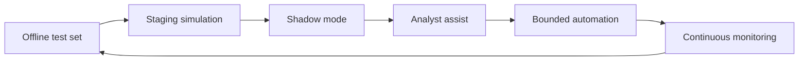

### 13.4 Fairness and governance

Procurement programs may include lawful supplier-diversity or sustainability goals. Treat these as governed criteria with documented policy ownership. Do not infer protected attributes or create hidden preferences. Measure whether the system applies the approved criteria consistently and preserves contestability.

---

## 14. Performance and cost

A supplier recommendation can often parallelize its slowest reads.

```mermaid
gantt
    title Illustrative supplier decision latency
    dateFormat X
    axisFormat %L ms
    section Parallel reads
    Price and quote        :0, 450
    Delivery and capacity  :0, 700
    Quality history        :0, 500
    Compliance check       :0, 650
    section Critical path
    Merge and validate     :700, 850
    Score and review       :850, 1050
    Render                 :1050, 1150
```

Optimization priorities:

1. parallelize independent reads;
2. cache stable policy and certification metadata within safe freshness limits;
3. use deterministic calculations rather than model calls for arithmetic;
4. retrieve only relevant contract clauses;
5. stream progress states to the UI;
6. avoid repeated evidence retrieval during explanation;
7. reserve larger models for ambiguous specification resolution or narrative comparison.

---

## 15. Worked example

### 15.1 Request

- item: sterile sample tubes;
- quantity: 5,000;
- destination: US;
- required within 21 days;
- minimum quality: 95%;
- maximum budget: USD 12,500;
- required certification: ISO-9001.

### 15.2 Candidates

| Supplier | Landed cost | Delivery | Quality | On-time | Certification | Capacity |
|---|---:|---:|---:|---:|---|---:|
| A | 11,250 | 14 days | 98% | 96% | Valid | 7,000 |
| B | 10,900 | 24 days | 97% | 94% | Valid | 10,000 |
| C | 11,500 | 12 days | 96% | 97% | Expired | 8,000 |
| D | 12,100 | 18 days | 95% | 91% | Valid | 6,000 |

### 15.3 Eligibility

- Supplier A passes all constraints.
- Supplier B fails the delivery date.
- Supplier C fails certification.
- Supplier D passes all constraints.

### 15.4 Recommendation

Supplier A is preferred over Supplier D because it provides:

- lower landed cost;
- earlier delivery;
- higher quality;
- stronger on-time performance;
- adequate capacity.

The system should still show Supplier D as an eligible alternative and display the evidence for both.

```mermaid
flowchart LR
    A[Supplier A eligible] --> CMP[Compare]
    D[Supplier D eligible] --> CMP
    B[Supplier B excluded: late] --> EX[Exclusions]
    C[Supplier C excluded: certification] --> EX
    CMP --> REC[Recommend A]
    EX --> REC
```

### 15.5 Action

If the user requests a draft requisition, the system creates an action proposal. It does not execute until a user with sufficient authority approves the exact supplier, item, quantity, amount, and destination.

---

## 16. Reference implementation

The accompanying Python example is dependency-free. It demonstrates:

- typed request and supplier records;
- validation and authorization;
- deterministic eligibility checks;
- normalized weighted scoring;
- evidence and exclusion records;
- confidence based on evidence and ranking margin;
- exact-action approval hashing;
- idempotent draft-requisition creation;
- confirmation reads;
- append-only audit events;
- multiple test scenarios.

Run it with:

```bash
python examples/32-supplier-recommendation-agent/supplier_recommendation_system.py
```

The output is also saved as `sample_output.json`.

> **Learning note:** The reference implementation is intentionally compact. A production system should use authenticated connectors, durable transactional storage, enterprise policy services, approved exchange-rate sources, encrypted secrets, and formal observability.

---

## 17. Deployment plan

### Stage 1 - Offline replay

Run historical sourcing requests without affecting decisions. Compare eligibility, ranking, and explanations with expert records.

### Stage 2 - Shadow mode

Process live requests while hiding the result from users. Measure data freshness, latency, and recommendation differences.

### Stage 3 - Analyst assist

Show the recommendation, evidence, and alternatives. The analyst remains responsible for the decision.

### Stage 4 - Approval-gated draft actions

Allow the system to create draft requisitions or quote requests only after exact-action approval.

### Stage 5 - Bounded automation

Automate narrowly defined, low-value, repeatable sourcing cases with stable suppliers and reversible actions. Preserve exception routing and continuous evaluation.

```mermaid
flowchart LR
    O[Offline] --> S[Shadow]
    S --> A[Analyst assist]
    A --> G[Approval-gated drafts]
    G --> B[Bounded automation]
    B --> R[Review and rollback capability]
```

---

## 18. Production checklist

### Requirements and data

- [ ] Item, quantity, destination, date, unit, and currency are explicit.
- [ ] Hard constraints are separated from preferences.
- [ ] Supplier sources and precedence are documented.
- [ ] Freshness rules are criterion-specific.
- [ ] Unit and currency conversions are validated.

### Decision logic

- [ ] Ineligible suppliers are excluded before ranking.
- [ ] Weight versions have owners and approval history.
- [ ] Component contributions are explainable.
- [ ] Sensitivity and near-tie behavior are defined.
- [ ] Missing critical data triggers safe escalation.

### Safety and control

- [ ] Retrieval is authorization-aware.
- [ ] Supplier data is isolated and redacted appropriately.
- [ ] Write tools use least privilege.
- [ ] Approval is bound to exact action arguments.
- [ ] Idempotency and confirmation reads are implemented.
- [ ] Exceptions are separately authorized and audited.

### UX and operations

- [ ] Alternatives and exclusions are visible.
- [ ] Confidence and limitations are meaningful.
- [ ] Users can compare, edit, approve, reject, and escalate.
- [ ] Workflow state can pause and resume safely.
- [ ] Metrics connect recommendations to realized outcomes.
- [ ] Rollback and incident runbooks exist.

---

## 19. Knowledge check

1. Why must hard constraints be evaluated before weighted scoring?
2. Which supplier facts require the shortest freshness windows?
3. What should happen when every candidate is ineligible?
4. Why is a single composite score insufficient for explanation?
5. How does sensitivity analysis affect confidence?
6. Which supplier checks can be parallelized safely?
7. What should a merge contract validate?
8. Why must approval be bound to exact action arguments?
9. How does idempotency protect procurement workflows?
10. Which metrics connect recommendation quality to business outcomes?

---

## 20. Interview and architecture questions

### Beginner

1. Describe the difference between supplier eligibility and supplier ranking.
2. What data should appear in an explainable supplier recommendation?
3. Why should the system show excluded suppliers and reasons?

### Intermediate

4. Design a normalization strategy for price, delivery, quality, and risk.
5. How would you handle stale capacity data and a current quote?
6. Explain how you would test confidence calibration.
7. How would you prevent one supplier's confidential quote from leaking to another?

### Senior

8. Design a multi-region supplier recommendation system with tenant isolation and delegated authority.
9. Define an approval and idempotency protocol for creating a draft purchase requisition.
10. How would you monitor recommendation drift after a policy-weight change?
11. How would you detect that historical data systematically favors incumbent suppliers?
12. When would you use specialist agents instead of deterministic services?

### System design

13. Design the complete architecture for a regulated-material sourcing assistant that uses ERP data, quality systems, contracts, sanctions screening, and human approvals.
14. Define the state machine, failure modes, replay strategy, and release gates.
15. Explain how you would attribute a bad recommendation to data, policy, scoring, model interpretation, or human override.

---

## Chapter summary

A supplier recommendation agent is a governed decision system, not a lowest-price chatbot. The system must first translate the sourcing request into a typed contract, retrieve approved and fresh supplier evidence, apply mandatory eligibility rules, and then compare eligible suppliers using transparent criteria. Parallel specialist checks can reduce latency, but their outputs require a strict merge contract. The recommendation should expose trade-offs, alternatives, exclusions, confidence, evidence, and limitations. Consequential actions require authorization, exact-action approval, idempotency, confirmation reads, persistent state, and auditability. Production success is measured not only by ranking agreement, but by realized cost, delivery, quality, risk, analyst productivity, overrides, and incidents.
