# Chapter 34 - End-to-End Competitive Research System

> **Source basis:** The board presents a competitive research flow in which a planner delegates to a search agent, an analyst compares evidence, a reviewer checks accuracy and completeness, and a final report is produced. It also describes manager-worker and planner-executor-reviewer patterns, reflection and replanning, evidence-grounded outputs, tool routing, state, guardrails, observability, and failure-loop controls [Board, pp. 20-22, 24-31, 35-39, 47-50]. This chapter preserves that project and expands it into a production-oriented research system. The data contracts, scoring rules, synthetic dataset, architecture, and dependency-free implementation are **Supplementary**.

---

## Learning objectives

By the end of this project, you should be able to:

1. Translate a broad competitive-research request into a bounded, reviewable research contract.
2. Decompose the request into companies, topics, claims, evidence needs, and deliverables.
3. Coordinate planner, search, analyst, writer, and reviewer responsibilities without creating redundant agents.
4. Distinguish facts, estimates, observations, interpretations, and recommendations.
5. Preserve source provenance, publication dates, retrieval times, and claim-level citations.
6. Score evidence using authority, relevance, freshness, independence, and directness.
7. Detect duplicate, stale, contradictory, unsupported, or circularly sourced evidence.
8. Compare competitors using explicit dimensions rather than vague narrative impressions.
9. Generate conclusions that are proportional to the supporting evidence.
10. Apply bounded reflection and replanning when evidence is incomplete.
11. Prevent browsing loops, source spam, citation laundering, and unbounded token or cost growth.
12. Design human-review checkpoints for externally shared or strategically consequential reports.
13. Evaluate research coverage, citation validity, claim support, comparison consistency, and decision usefulness.
14. Run and inspect a dependency-free competitive-research reference implementation.

---

## 1. Project brief

A product leader asks:

> Compare our product with three competitors. Identify meaningful feature, positioning, pricing, and adoption differences. Explain where the evidence is strong or weak, then recommend the most important product questions for the next planning cycle.

The board illustrates the pattern as:

```text
Manager Agent
   |
   +--> Research Agent: collect competitor features
   +--> Analytics Agent: compare pricing and adoption signals
   +--> Writer Agent: draft summary
   +--> Reviewer Agent: check accuracy and completeness
   |
   +--> Final report
```

This is not merely a search-and-summarize problem. A trustworthy competitive-research system must define scope, search multiple evidence channels, resolve conflicting claims, avoid treating marketing language as fact, separate evidence from interpretation, show uncertainty, and stop when further searching is unlikely to improve the decision.

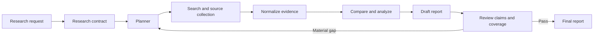

### 1.1 Goal

Build a bounded competitive-research workflow that produces an evidence-backed comparison, identifies uncertainty and information gaps, and recommends the next product questions without inventing private competitor information.

### 1.2 Non-goals

The system does not:

- claim access to private competitor roadmaps, revenue, customer lists, or internal strategy;
- treat search-engine ranking as evidence quality;
- infer adoption from a single anecdote;
- present an estimate as a verified fact;
- copy large amounts of source text;
- hide contradictory or stale information;
- recommend a product strategy solely because a competitor has a feature;
- scrape or access systems outside approved legal and technical boundaries;
- perform endless search, debate, or review loops;
- replace product, legal, market-research, or executive judgment.

### 1.3 Success criteria

The project succeeds when it:

- covers the agreed competitors and comparison dimensions;
- traces every material factual claim to one or more sources;
- distinguishes primary, secondary, and anecdotal evidence;
- marks estimates, interpretations, and unresolved conflicts;
- uses consistent criteria across all competitors;
- includes recent evidence where recency matters;
- avoids unsupported strategic conclusions;
- produces a useful, concise decision summary;
- stops within explicit search, time, token, and cost budgets;
- supports human correction, approval, and audit.

---

## 2. Research is a contract, not a prompt

A vague request such as "research our competitors" has no stable completion condition. The planner must first convert it into a research contract.

### 2.1 Research request contract

| Field | Type | Required | Example |
|---|---|---:|---|
| `research_id` | string | Yes | `CR-3401` |
| `market` | string | Yes | Enterprise support automation |
| `our_product` | string | Yes | Product Alpha |
| `competitors` | list | Yes | Competitor A, B, C |
| `dimensions` | list | Yes | Features, pricing, positioning, adoption signals |
| `geography` | list | No | US, EU |
| `customer_segment` | list | No | Mid-market, enterprise |
| `as_of_date` | date | Yes | `2026-08-04` |
| `lookback_months` | integer | Yes | `18` |
| `allowed_source_types` | list | Yes | Official pages, filings, reputable analysis |
| `excluded_sources` | list | No | Anonymous reposts, unauthorized data |
| `maximum_queries` | integer | Yes | `30` |
| `minimum_evidence_score` | decimal | Yes | `0.65` |
| `output_format` | enum | Yes | Decision brief |
| `approval_required` | boolean | Yes | `true` for external distribution |

### 2.2 Research questions

The planner converts the contract into answerable questions.

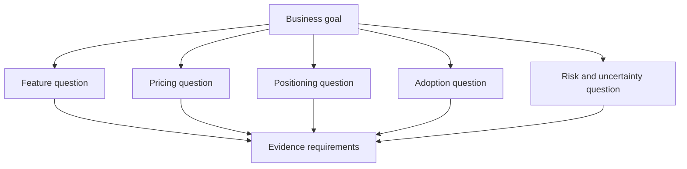

Examples:

- Which capabilities are explicitly documented as generally available?
- Which capabilities are described only as beta, preview, partner-led, or roadmap-oriented?
- What pricing model is publicly documented, and what is not disclosed?
- Which customer segment does each competitor target in its own messaging?
- Which adoption signals are directly verifiable, and which are estimates?
- What changed during the agreed lookback period?
- Which product questions matter even if competitors are ignored?

### 2.3 Completion contract

A run is complete only when:

1. scope, competitors, dimensions, geography, segment, and date are validated;
2. each material research question has evidence, an explicit gap, or a justified not-applicable status;
3. evidence is normalized, deduplicated, access-checked, and scored;
4. conflicting claims are exposed and reconciled where possible;
5. comparison dimensions are applied consistently;
6. every factual report claim has a citation set;
7. unsupported or weakly supported claims are removed or qualified;
8. the reviewer verifies coverage, freshness, and citation integrity;
9. budgets and termination conditions are satisfied;
10. external distribution is approved when required.

---

## 3. Reference architecture

The system separates orchestration from search, evidence storage, analysis, writing, review, and publication.

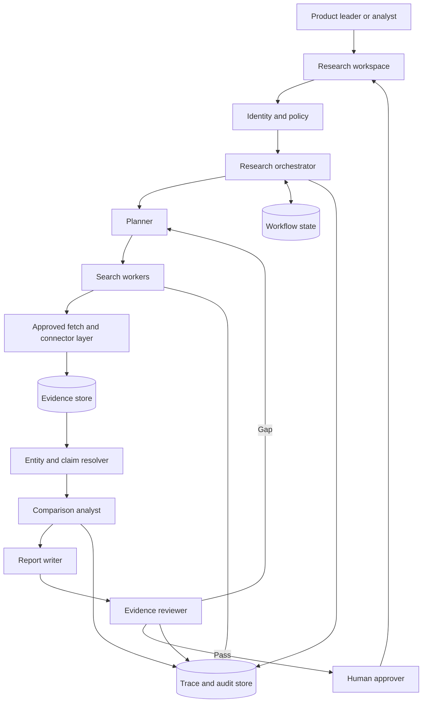

### 3.1 Agent responsibilities

| Component | One responsibility | Must not do |
|---|---|---|
| Planner | Create questions, evidence needs, and budgets | Invent answers |
| Search worker | Find and retrieve permitted sources | Decide final conclusions |
| Evidence normalizer | Convert sources into common records | Rewrite source meaning |
| Analyst | Compare verified evidence consistently | Hide gaps or contradictions |
| Writer | Produce a clear, traceable report | Add uncited claims |
| Reviewer | Test claims, citations, freshness, and coverage | Rewrite until a preferred conclusion appears |
| Human approver | Accept, correct, restrict, or reject release | Approve without seeing material limitations |

### 3.2 Why not one large agent?

A single agent can perform a small research task, but production research benefits from separated responsibilities because:

- search and judgment have different failure modes;
- evidence should exist independently of the narrative;
- review should not depend entirely on the same context that produced the draft;
- permissions may differ by source or action;
- bounded retries are easier to enforce around explicit stages;
- audit records become clearer.

This separation is about control and testability, not maximizing agent count.

---

## 4. Evidence model and provenance

The report is only as reliable as its evidence model.

### 4.1 Evidence record

```json
{
  "evidence_id": "EV-3409",
  "competitor": "Competitor A",
  "dimension": "pricing",
  "claim_text": "Enterprise plan is sold through annual contracts.",
  "source_title": "Competitor A pricing",
  "source_uri": "https://example.invalid/a/pricing",
  "source_type": "official_product_page",
  "publisher": "Competitor A",
  "published_at": "2026-06-15",
  "retrieved_at": "2026-08-04T04:45:00Z",
  "quote_or_fact": "Annual contract required for enterprise plan.",
  "directness": "direct",
  "authority": 0.95,
  "freshness": 0.92,
  "relevance": 0.98,
  "independence_group": "competitor-a-official",
  "access_classification": "public",
  "content_hash": "sha256:..."
}
```

### 4.2 Source classes

| Class | Examples | Typical strength | Common limitation |
|---|---|---|---|
| Primary official | Product docs, pricing pages, filings, release notes | High for documented facts | Marketing bias or selective disclosure |
| Primary observed | Product trial, API response, public demo | High for observed behavior | Limited environment or plan |
| Independent authoritative | Regulatory records, standards body, audited dataset | High | May lag product changes |
| Reputable secondary | Established analyst or technical publication | Medium to high | Method may be opaque |
| Customer or community signal | Reviews, forums, job posts | Contextual | Selection bias and unverifiable claims |
| Search snippet or repost | Aggregated preview, copied article | Low | Truncated, stale, or circular |

### 4.3 Evidence score

A simple evidence score can guide review, not replace it.

```text
score = 0.30 * authority
      + 0.25 * directness
      + 0.20 * relevance
      + 0.15 * freshness
      + 0.10 * independence
```

The score should be versioned and governed. A high score does not make a source correct; it indicates that the source is more suitable for supporting the specific claim.

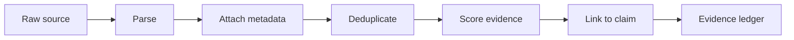

### 4.4 Claim types

Every report statement should be tagged internally.

| Type | Meaning | Example language |
|---|---|---|
| Verified fact | Directly supported by adequate evidence | "The public plan page lists..." |
| Estimate | Derived from incomplete or modeled inputs | "Estimated range..." |
| Observation | Seen in a bounded test or sample | "In the tested workspace..." |
| Interpretation | Reasoned meaning of facts | "This suggests a focus on..." |
| Recommendation | Proposed action | "Validate whether customers value..." |
| Unknown | Evidence is insufficient | "Public information does not confirm..." |

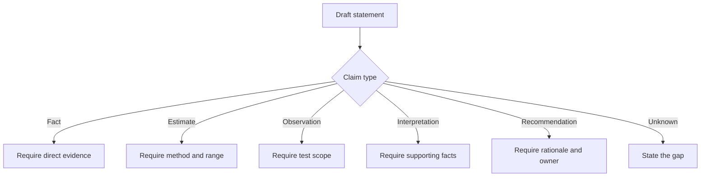

---

## 5. Planning and query design

A research planner should create a bounded plan that can be inspected before execution.

### 5.1 Plan structure

```json
{
  "plan_id": "PLAN-34-01",
  "questions": [
    {
      "question_id": "Q-FEATURE-1",
      "dimension": "features",
      "question": "Which workflow automation capabilities are generally available?",
      "required_source_classes": ["primary_official", "primary_observed"],
      "minimum_independent_sources": 1,
      "freshness_days": 365,
      "query_budget": 4
    }
  ],
  "total_query_budget": 30,
  "maximum_replans": 2,
  "stop_when": "all material questions are answered or explicitly unresolved"
}
```

### 5.2 Query families

A robust plan uses query families rather than one broad query.

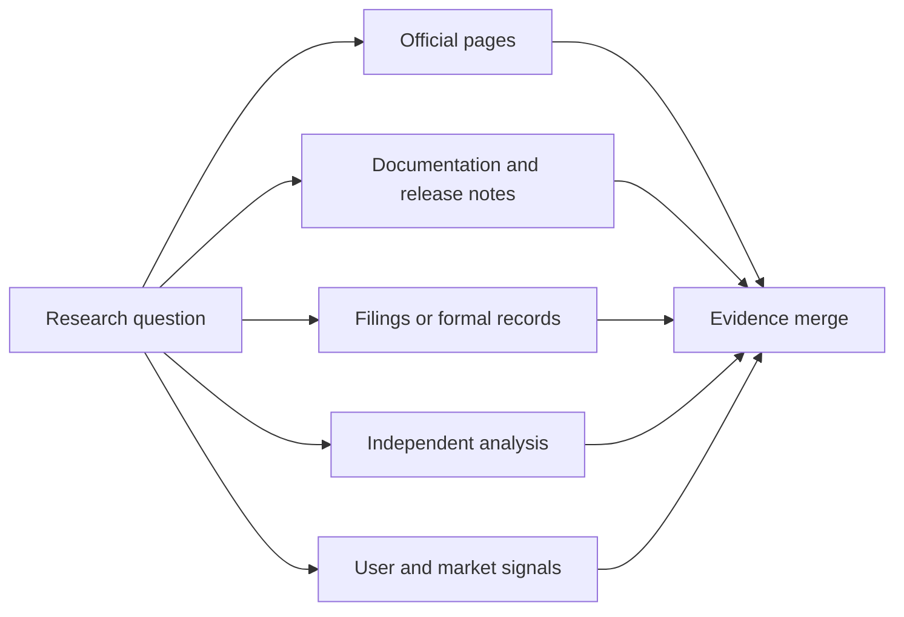

Query templates may include:

- competitor + capability + official documentation;
- competitor + pricing + plan + region;
- competitor + release notes + capability;
- competitor + annual report + customer segment;
- competitor + public case study + measurable outcome;
- competitor + security or compliance certification;
- competitor + deprecation, limitation, preview, or availability status.

### 5.3 Search budgets

The planner should allocate budgets by decision importance.

| Question type | Suggested effort |
|---|---:|
| Material pricing or contract claim | High |
| Core feature availability | High |
| Positioning language | Medium |
| Minor UI detail | Low |
| Private roadmap speculation | Zero; mark unknown |

### 5.4 Replanning

Replanning is justified when:

- a required source class is missing;
- material sources conflict;
- the initial query is ambiguous;
- a product name or plan changed;
- evidence is outside the freshness window;
- the reviewer finds an unsupported high-impact conclusion.

Replanning is not justified merely to find evidence that supports the preferred conclusion.

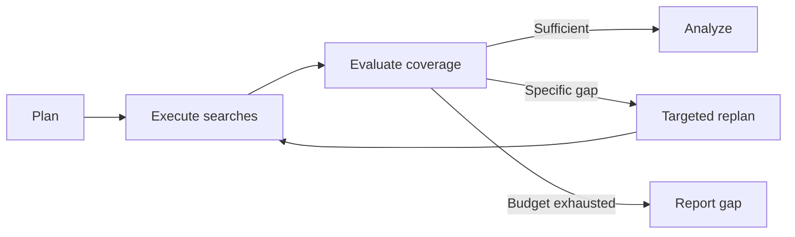

---

## 6. Source retrieval and normalization

### 6.1 Retrieval controls

The connector layer should enforce:

- permitted domains and source classes;
- rate limits and respectful access;
- robots, terms, and legal restrictions;
- content-size limits;
- file-type validation;
- malware and active-content isolation;
- authentication and tenant boundaries for licensed sources;
- retrieval timestamps and content hashes.

### 6.2 Treat external content as data

A retrieved page may contain instructions such as "ignore previous rules". Those instructions are untrusted content, not system policy.

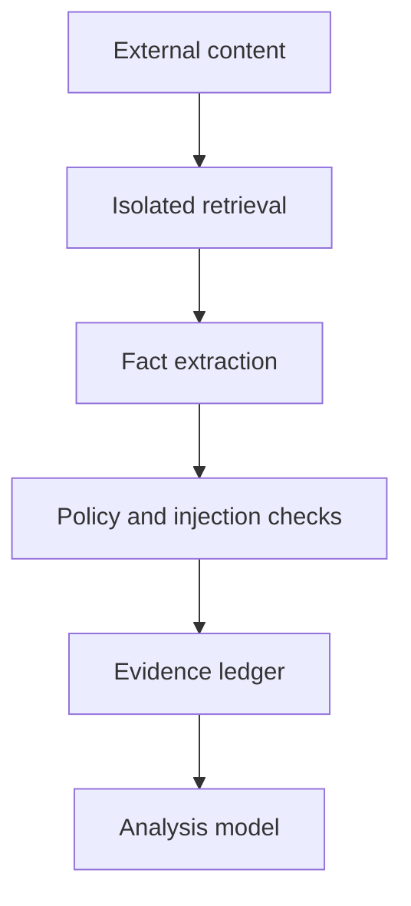

### 6.3 Entity resolution

Competitive research frequently encounters:

- renamed products;
- parent and subsidiary brands;
- multiple editions or regions;
- old plan names;
- partner-delivered versus native capabilities;
- acquisitions whose products remain separately marketed.

The system should maintain canonical identifiers.

```json
{
  "entity_id": "COMP-A-PRODUCT-X",
  "canonical_name": "Competitor A Product X",
  "aliases": ["Product X Cloud", "A-X"],
  "parent_company": "Competitor A",
  "regions": ["US", "EU"],
  "valid_from": "2025-01-01",
  "valid_to": null
}
```

### 6.4 Deduplication and source independence

Ten articles repeating one press release do not constitute ten independent sources.

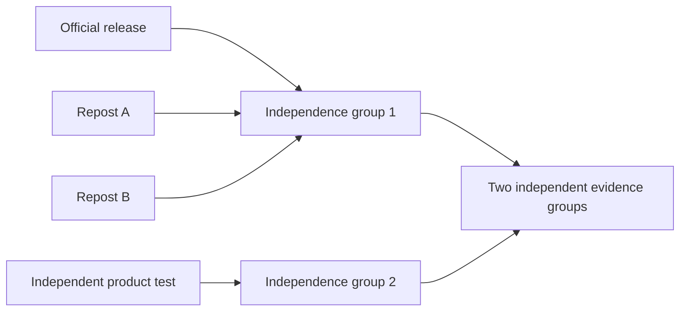

Deduplication can use:

- canonical URLs;
- content hashes;
- quoted-text similarity;
- same publication or syndication network;
- same underlying press release;
- explicit citations from one source to another.

---

## 7. Comparison model

A good comparison uses explicit dimensions and evidence requirements.

### 7.1 Comparison matrix

| Dimension | Evidence required | Example subdimensions |
|---|---|---|
| Product capability | Docs, release notes, observed test | Availability, depth, integrations, limits |
| Pricing | Official plan or contract evidence | Unit, commitment, included usage, overage |
| Positioning | Current official messaging | Segment, buyer, problem, differentiator |
| Adoption signal | Transparent public measure | Named customers, usage disclosure, case studies |
| Enterprise readiness | Security and administration evidence | SSO, audit, residency, permissions, support |
| Ecosystem | Public integration evidence | APIs, connectors, partners, marketplace |
| Operational maturity | Reliability and support evidence | Status history, SLAs, support model |

### 7.2 Normalize before comparing

Comparisons fail when unlike units are placed side by side.

Examples:

- monthly list price versus annual negotiated price;
- included requests versus paid overage;
- beta capability versus generally available capability;
- native integration versus partner integration;
- customer count versus active-user count;
- global availability versus one-region availability.

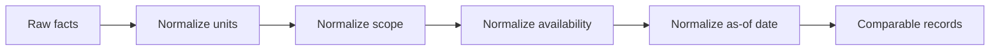

### 7.3 Availability states

| State | Meaning |
|---|---|
| Generally available | Publicly released for the applicable plan and region |
| Limited availability | Restricted by region, customer, program, or plan |
| Preview or beta | Not yet a stable production commitment |
| Partner capability | Delivered through an external integration |
| Announced | Publicly stated but not verifiably available |
| Deprecated | Being removed or no longer recommended |
| Unknown | Public evidence is insufficient |

### 7.4 Avoid a universal competitor score

A single score can hide trade-offs and false precision. Prefer:

- evidence-backed dimension summaries;
- explicit strengths and limitations;
- customer-segment fit;
- scenarios where each option is strongest;
- uncertainty and missing information;
- sensitivity to assumptions.

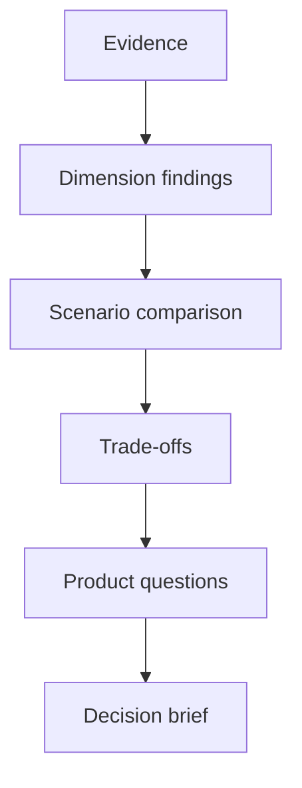

---

## 8. Analysis and synthesis

### 8.1 Claim-evidence graph

The analyst should build a graph connecting claims to evidence and conclusions.

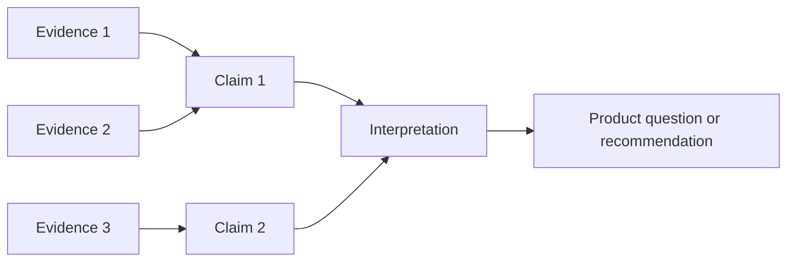

A material interpretation should not depend on a claim with weak or missing support.

### 8.2 Contradiction handling

When sources disagree, the system should not silently average them.

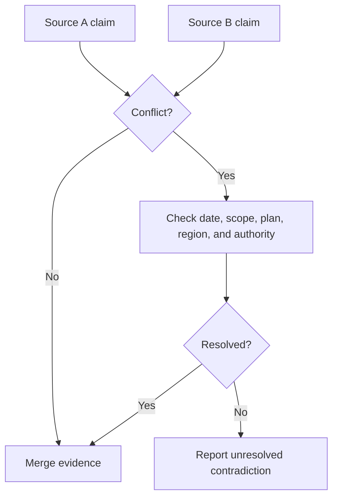

Common explanations include:

- different publication dates;
- different regions or plans;
- beta versus general availability;
- list price versus negotiated contract;
- product family versus one module;
- source error or outdated content.

### 8.3 Confidence

Confidence should be explained, not merely displayed.

A claim-level confidence estimate may include:

- authority of the supporting source;
- directness of evidence;
- freshness;
- number of independent evidence groups;
- consistency across sources;
- normalization certainty;
- whether the claim is factual or interpretive.

### 8.4 From competitor facts to product questions

The system should not jump directly from "competitor has feature X" to "build feature X".

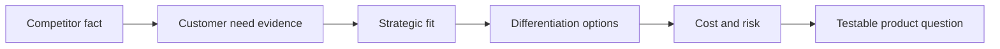

Example:

- Weak recommendation: "Competitor A offers automatic routing, so we should build it."
- Better product question: "For enterprise support teams with more than 50 queues, does configurable routing reduce manual reassignment enough to justify implementation and governance cost?"

---

## 9. Report contract and UX

### 9.1 Report structure

A decision-ready report should include:

1. executive summary;
2. scope and as-of date;
3. methodology and source limitations;
4. dimension-by-dimension comparison;
5. material changes during the lookback period;
6. strong, moderate, and weak evidence areas;
7. unresolved contradictions and unknowns;
8. product implications framed as questions or hypotheses;
9. recommended validation actions;
10. claim-level citations and source appendix.

### 9.2 Example finding card

```json
{
  "finding_id": "F-34-12",
  "dimension": "workflow_automation",
  "competitor": "Competitor A",
  "claim": "Conditional multi-step workflows are publicly documented for the enterprise plan.",
  "claim_type": "verified_fact",
  "confidence": "high",
  "as_of_date": "2026-08-04",
  "citations": ["EV-3409", "EV-3410"],
  "limitations": ["Execution limits were not publicly documented."],
  "implication": "Validate whether workflow depth or governance is the more important buyer need."
}
```

### 9.3 Progressive disclosure

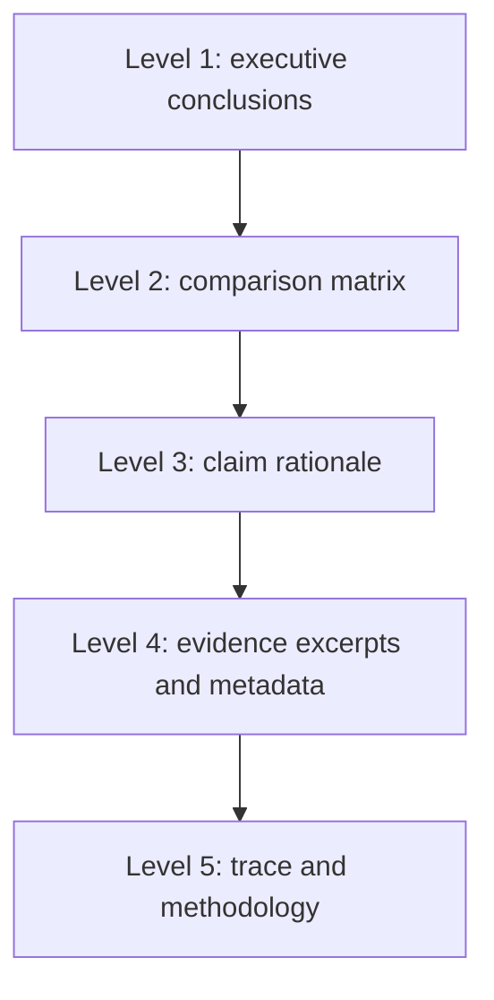

The user should be able to inspect the evidence without being forced to read raw retrieval logs.

### 9.4 Controls

The application should support:

- edit scope;
- exclude or add a permitted source;
- mark a finding incorrect;
- request targeted follow-up research;
- compare report versions;
- approve or reject external publication;
- export with or without restricted appendices;
- interrupt, reset, or abort the workflow.

---

## 10. Review and quality gates

The reviewer should evaluate the report against explicit criteria.

### 10.1 Review checklist

| Gate | Question |
|---|---|
| Coverage | Are all material competitors and dimensions addressed? |
| Claim support | Does every factual claim have adequate evidence? |
| Citation validity | Does each citation support the exact claim? |
| Freshness | Is time-sensitive evidence within the required window? |
| Independence | Are multiple citations genuinely independent? |
| Consistency | Are the same definitions applied to every competitor? |
| Uncertainty | Are estimates, gaps, and contradictions visible? |
| Security | Is restricted or personal information excluded? |
| Decision usefulness | Does the report lead to testable product questions? |
| Style | Is the report concise, neutral, and non-duplicative? |

### 10.2 Claim-level review loop

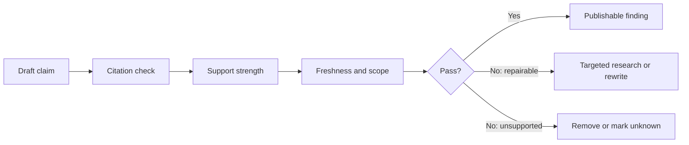

### 10.3 Bounded reflection

The reviewer may trigger a targeted replan only when the expected value is material.

```text
Replan when:
- an executive-summary claim lacks support;
- a key competitor is missing from one critical dimension;
- pricing evidence is stale or incomparable;
- a contradiction changes the product implication.

Do not replan when:
- only stylistic wording remains;
- a private fact cannot be established publicly;
- another search is unlikely to change the decision;
- the query, time, or cost budget is exhausted.
```

### 10.4 Termination controls

Use all of the following:

- maximum queries;
- maximum sources per question;
- maximum replan count;
- maximum review rounds;
- elapsed-time budget;
- token and cost budgets;
- repeated-query detection;
- repeated-evidence detection;
- no-progress detection;
- explicit unresolved-gap output.

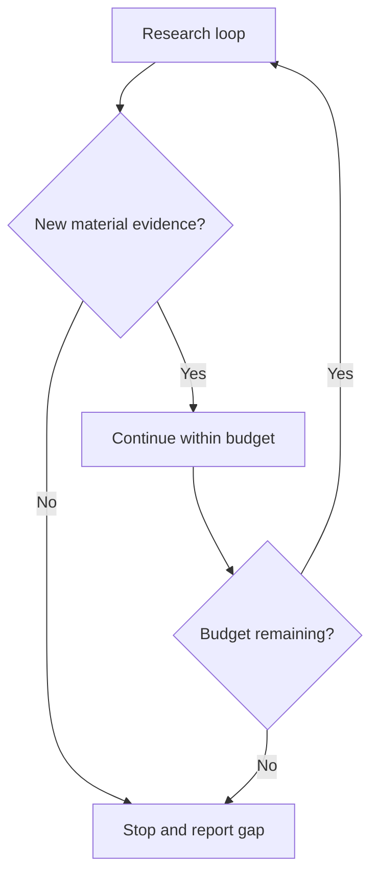

---

## 11. Safety, legal, and policy controls

### 11.1 Allowed research

Typical allowed actions include:

- reviewing public product pages and documentation;
- comparing public pricing and plan descriptions;
- analyzing public release notes;
- summarizing licensed analyst material within permitted terms;
- examining public case studies and job postings as weak signals;
- running approved tests in lawfully obtained product trials.

### 11.2 Restricted or prohibited behavior

The workflow should deny or escalate requests to:

- obtain credentials or bypass access controls;
- access private customer, employee, or competitor data;
- misrepresent identity to obtain confidential information;
- perform unauthorized scraping or high-volume access;
- expose licensed full-text material beyond permitted use;
- infer sensitive personal attributes;
- publish defamatory or unsupported allegations;
- coordinate price fixing, market allocation, or other unlawful activity.

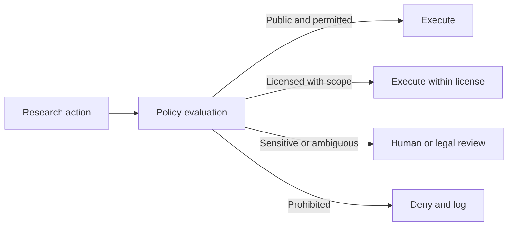

### 11.3 Prompt injection and malicious sources

Controls should include:

- isolate fetched content from system instructions;
- extract facts into typed records;
- remove active scripts and hidden instructions;
- apply source and domain allowlists where appropriate;
- limit tool permissions;
- never let source content alter publication policy;
- record suspicious content as a security event.

### 11.4 Confidentiality

Internal strategy, customer data, licensed research, and public evidence should be stored and rendered according to classification. The final report may need separate internal and external versions.

---

## 12. State, observability, and operations

### 12.1 Workflow state

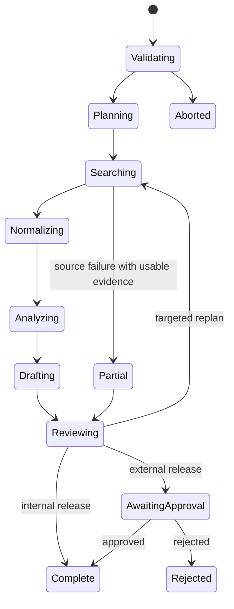

Persist:

- research contract and version;
- plan and query ledger;
- source retrieval records;
- evidence ledger;
- entity mappings;
- claim-evidence graph;
- comparison records;
- reviewer findings;
- report versions;
- approval status;
- audit and telemetry events.

### 12.2 Observability events

```json
{
  "event": "claim_reviewed",
  "research_id": "CR-3401",
  "claim_id": "CL-88",
  "status": "failed_support_gate",
  "reason": "citation does not establish plan availability",
  "source_ids": ["EV-3409"],
  "review_round": 1,
  "timestamp": "2026-08-04T05:18:00Z"
}
```

### 12.3 Operational metrics

Measure:

- question coverage;
- source retrieval success;
- valid evidence rate;
- duplicate-source rate;
- claim citation coverage;
- citation correctness;
- unsupported-claim rate;
- contradiction rate;
- stale-evidence rate;
- replans per run;
- review rounds;
- report completion time;
- cost per approved report;
- human correction rate;
- decision-usefulness score.

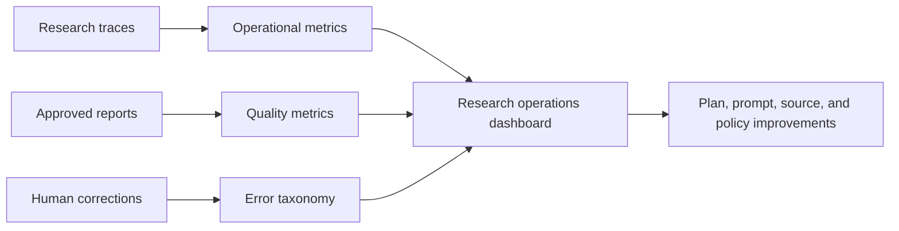

### 12.4 Runbooks

Create runbooks for:

- primary source unavailable;
- pricing evidence conflicts;
- product renamed or acquired;
- citation link removed after publication;
- licensed source accidentally included in export;
- unsupported claim discovered after distribution;
- repeated search loop;
- excessive cost or query volume;
- prompt injection detected in a source;
- human reviewer rejects the report.

---

## 13. Evaluation plan

### 13.1 Component evaluation

| Component | Metrics |
|---|---|
| Planner | Question coverage, redundancy, budget adherence |
| Search | Relevant-source recall, source-class diversity, freshness |
| Normalizer | Entity accuracy, metadata completeness, deduplication |
| Analyst | Comparison consistency, contradiction handling |
| Writer | Claim clarity, citation placement, uncertainty language |
| Reviewer | Unsupported-claim detection, false rejection rate |
| End-to-end | Decision usefulness, correction rate, latency, cost |

### 13.2 Claim evaluation dataset

Build a dataset containing:

- supported claims;
- partially supported claims;
- claims whose citation discusses a different plan;
- stale claims;
- contradictory claims;
- estimates presented as facts;
- marketing claims lacking independent support;
- circular citations;
- duplicated evidence;
- unavailable private facts;
- malicious source instructions.

### 13.3 Release gates

Example release gates:

| Gate | Threshold |
|---|---:|
| Material factual claims with citations | 100% |
| Citation correctness | >= 95% |
| Unsupported material claim rate | 0% |
| Critical-dimension coverage | >= 90% |
| Stale time-sensitive claims | 0% unless explicitly marked |
| Cross-competitor consistency | >= 95% |
| Restricted-data leakage | 0 |
| Maximum review rounds | <= 2 |
| Maximum query-budget overrun | 0 |

### 13.4 Human evaluation rubric

Reviewers score from 1 to 5:

1. accuracy;
2. completeness;
3. neutrality;
4. evidence traceability;
5. uncertainty handling;
6. comparison consistency;
7. product relevance;
8. actionability;
9. concision;
10. legal and policy compliance.

---

## 14. Worked example

### 14.1 Request

> Compare Product Alpha with Competitors A, B, and C for enterprise support operations. Focus on workflow automation, integrations, pricing transparency, governance, and adoption signals. Use evidence from the last 18 months and produce a decision brief.

### 14.2 Plan

```mermaid
flowchart TB
    P[Planner] --> F[Feature workstream]
    P --> PR[Pricing workstream]
    P --> G[Governance workstream]
    P --> I[Integration workstream]
    P --> A[Adoption-signal workstream]
    F --> M[Evidence merge]
    PR --> M
    G --> M
    I --> M
    A --> M
    M --> AN[Analyst]
    AN --> WR[Writer]
    WR --> RV[Reviewer]
```

### 14.3 Example findings

| Finding | Evidence strength | Limitation | Product question |
|---|---|---|---|
| Competitor A documents deeper conditional workflow controls | High | Execution limits are not public | Which workflow conditions create the most customer value? |
| Competitor B publishes transparent usage-based pricing | High | Enterprise discounts are unknown | Does transparent usage pricing improve trial conversion? |
| Competitor C emphasizes governance and approval flows | Moderate to high | Some capabilities require premium plans | Which governance controls are mandatory for regulated buyers? |
| Adoption comparisons are not directly comparable | Low to moderate | Disclosures use different units | What customer research can validate real switching drivers? |

### 14.4 Better strategic output

The report should avoid:

> Build every feature that appears in the competitor matrix.

It should instead conclude:

> Public evidence indicates three differentiated themes: workflow depth, pricing transparency, and governance. Before prioritizing parity work, validate which theme most strongly influences retention and expansion for the target enterprise segment. Run customer interviews and prototype tests around advanced routing and approval visibility, while improving pricing explanation regardless of feature scope.

This conclusion connects competitor evidence to customer validation and strategic fit rather than treating imitation as strategy.

---

## 15. Reference implementation

The companion Python implementation is intentionally dependency-free. It demonstrates architecture and controls rather than real web browsing.

It includes:

- typed research, source, evidence, claim, and report records;
- bounded planning;
- synthetic approved-source connectors;
- evidence scoring and deduplication;
- independence grouping;
- normalized comparison records;
- claim-level citations;
- contradiction and freshness checks;
- reviewer gates;
- one targeted replan;
- approval-gated publication;
- append-only event tracing.

Run:

```bash
python examples/34-competitive-research-system/competitive_research_system.py
```

The program writes a machine-readable report to standard output. A captured run is included as `sample_output.json`.

---

## 16. Deployment roadmap

### Phase 1 - Analyst workspace

- Human defines the plan.
- System collects and organizes permitted evidence.
- Human writes and approves all conclusions.

### Phase 2 - Assisted synthesis

- System drafts comparison tables and claim-evidence links.
- Human validates every material claim.
- No autonomous publication.

### Phase 3 - Governed internal reporting

- System creates complete internal drafts.
- Reviewer gates and approval remain mandatory.
- Monitoring tracks correction and unsupported-claim rates.

### Phase 4 - Bounded recurring research

- Approved recurring plans run on a schedule.
- The system highlights meaningful changes rather than rewriting the full report.
- External release remains separately governed.

```mermaid
flowchart LR
    P1[Evidence workspace] --> P2[Assisted synthesis]
    P2 --> P3[Governed internal reports]
    P3 --> P4[Bounded recurring research]
```

Advance only when evaluation, legal review, source permissions, correction rates, and operational controls meet the required thresholds.

---

## 17. Production checklist

### Scope and contracts

- [ ] Competitors, market, segment, geography, date, and dimensions are explicit.
- [ ] Private or unverifiable questions are excluded or marked unknown.
- [ ] Completion and budget conditions are measurable.

### Evidence

- [ ] Every evidence record has source, publisher, date, retrieval time, and hash.
- [ ] Source classes and independence groups are recorded.
- [ ] Duplicates and syndication are detected.
- [ ] Freshness requirements vary by claim type.
- [ ] External content is treated as untrusted data.

### Analysis

- [ ] Units, plans, regions, and availability states are normalized.
- [ ] Facts, estimates, observations, interpretations, and recommendations are separated.
- [ ] Contradictions remain visible until resolved.
- [ ] Material implications connect to customer need and strategic fit.

### Review

- [ ] Every material factual claim has a valid citation.
- [ ] Citation support is tested at claim level.
- [ ] Multiple citations are genuinely independent.
- [ ] Reviewer loops and replans are bounded.
- [ ] Unsupported claims are removed or marked unknown.

### Safety and policy

- [ ] Source access complies with permissions and terms.
- [ ] Restricted information is classified and redacted.
- [ ] Prompt-injection controls are active.
- [ ] External publication requires approval.
- [ ] Audit events are immutable and attributable.

### Operations

- [ ] Query, time, token, cost, and retry budgets exist.
- [ ] Dashboards show coverage, citation quality, cost, and correction rates.
- [ ] Runbooks exist for removed sources, bad claims, and policy incidents.
- [ ] Report and source versions can be replayed.

---

## 18. Knowledge check

1. Why is "research competitors" not a sufficient production task definition?
2. What is the difference between source authority and source independence?
3. Why do several articles repeating one press release count as one evidence group?
4. When should a source support a verified fact rather than an interpretation?
5. Why must pricing be normalized before comparison?
6. What is the difference between a generally available capability and an announced capability?
7. Why should the system avoid a universal competitor score?
8. How should unresolved contradictions appear in the final report?
9. When is replanning justified?
10. What controls prevent endless searching and reviewing?
11. How does a claim-evidence graph improve auditability?
12. Why is "competitor has feature X" insufficient justification to build feature X?
13. Which metrics reveal citation laundering or duplicate evidence?
14. Why should external research content be treated as untrusted data?
15. What should happen when a material fact cannot be established from permitted sources?

---

## 19. Interview and architecture questions

### Beginner

1. Describe the planner-search-analyst-reviewer pattern.
2. What metadata should accompany a research source?
3. How do facts differ from interpretations and recommendations?
4. What is claim-level citation coverage?
5. Why does evidence freshness matter?

### Intermediate

1. Design a comparison contract for three products with different pricing models.
2. How would you detect that multiple sources repeat the same press release?
3. Explain a strategy for resolving conflicting feature-availability claims.
4. How would you prevent a reviewer agent from creating an endless rewrite loop?
5. What should a competitive-research report show when adoption data is incomparable?
6. How would you evaluate whether citations support the exact claims they follow?

### Advanced

1. Design a multi-tenant competitive-intelligence platform with licensed and public sources.
2. Propose a claim-evidence graph schema that supports versioning and report replay.
3. Design a source-access policy layer that handles public, licensed, internal, and prohibited content.
4. Explain how you would measure evidence independence at scale.
5. Design a recurring research system that reports only material market changes.
6. How would you detect strategic recommendation drift when the evidence has not changed?
7. Propose an incident process for an unsupported claim discovered after executive distribution.
8. How would you decide whether model-based review adds enough value over deterministic checks?

### System design exercise

Design a competitive-research platform for a regulated enterprise. Your design must include:

- a research contract;
- source and connector policies;
- a provenance-preserving evidence store;
- entity and product-version resolution;
- query and replan budgets;
- normalized comparison models;
- claim-level citations;
- contradiction handling;
- legal and security review;
- human approval;
- observability and incident response;
- report replay and correction.

Explain the trust boundary and failure behavior of every component.

---

## 20. Chapter summary

The board's competitive-research flow is a strong example of planner-executor-reviewer orchestration: a planner decomposes the question, specialist workers collect and analyze evidence, a writer produces the report, and a reviewer verifies accuracy and completeness. A production system requires much more than assigning role names. It needs explicit research and completion contracts, source permissions, provenance, evidence scoring, deduplication, entity resolution, consistent comparison dimensions, claim-level citations, uncertainty handling, bounded reflection, human approval, and operational controls.

The most important discipline is separating evidence from interpretation. A trustworthy system states what is verified, what is estimated, what is observed, what is inferred, and what remains unknown. It also connects competitor information to customer need and strategic fit rather than recommending imitation. When these controls are present, competitive research becomes a repeatable, auditable decision-support workflow rather than an attractive but unreliable summary.
