# Chapter 35 - Agentic AI Interview Guide and Architecture Exercises

> **Source basis:** The board covers prompt engineering, RAG, agent planning, tool use, memory, orchestration, frameworks, multi-agent patterns, guardrails, evaluation, security, application UX, latency, observability, product management, and four end-to-end project patterns [Board, pp. 1-51]. This chapter converts those concepts into an interview-preparation and system-design practice guide. The question bank, answer rubrics, practice schedule, architecture exercises, and scoring utility are **Supplementary**.

---

## Learning objectives

By the end of this chapter, you should be able to:

1. Explain core LLM, RAG, agent, and multi-agent concepts precisely and without unnecessary jargon.
2. Structure an agentic-AI system-design answer from requirements through production operations.
3. Select the simplest architecture that can reliably solve a stated problem.
4. Compare prompting, RAG, fine-tuning, workflows, single agents, and multi-agent systems.
5. Design tool contracts, state models, guardrails, approvals, and recovery paths.
6. Discuss retrieval quality, grounding, evaluation, latency, cost, and observability as first-class concerns.
7. Identify failure modes before an interviewer prompts you to do so.
8. Communicate trade-offs rather than presenting one framework as universally best.
9. Whiteboard an enterprise architecture with explicit trust boundaries and ownership.
10. Practice architecture exercises using a repeatable scoring rubric.
11. Answer product, engineering, and leadership questions from the same system-level mental model.
12. Produce concise, evidence-based answers under time pressure.

---

## 1. What strong interview performance looks like

Agentic-AI interviews often appear broad because the system spans model behavior, data, retrieval, tools, application design, distributed systems, security, evaluation, and product judgment. Strong candidates do not attempt to list every technology they know. They build a coherent chain of reasoning.

A strong answer usually does five things:

1. **Clarifies the objective.** It identifies the user, task, risk, constraints, and success criteria.
2. **Chooses an appropriate architecture.** It avoids agents when a deterministic workflow or ordinary application is sufficient.
3. **Defines contracts.** Inputs, outputs, tool schemas, state, evidence, approvals, and completion conditions are explicit.
4. **Designs for failure.** The answer includes retries, fallbacks, escalation, loop prevention, and safe stopping.
5. **Explains measurement.** Quality, safety, latency, cost, and business outcomes are evaluated separately.

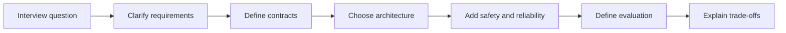

### 1.1 Weak answer pattern

A weak answer jumps directly to a framework:

> I would use LangGraph with three agents, a vector database, and memory.

This leaves the interviewer with unanswered questions:

- Why are multiple agents needed?
- What is the completion condition?
- What data is authoritative?
- Which actions require approval?
- What happens when a tool times out?
- How is success measured?
- Why is a graph better than a fixed service workflow?

### 1.2 Strong answer pattern

A stronger answer starts from the operating contract:

> The user wants a grounded answer and may optionally initiate a transaction. I would separate the informational path from the write path. The informational path uses authorization-aware retrieval and citation validation. The transactional path uses typed tools, an approval gate, idempotency, and a confirmation read. I would begin with one orchestrator and deterministic routing, then add model-based planning only for requests that cannot be classified reliably.

The second answer demonstrates architecture judgment, not framework memorization.

---

## 2. The CLEAR system-design method

Use the **CLEAR** method to structure architecture answers.

| Step | Question | Output |
|---|---|---|
| **C - Clarify** | Who is the user, what is the goal, and what can go wrong? | Requirements and risk profile |
| **L - Lay out contracts** | What enters, what leaves, and what must be true at completion? | Input, output, state, evidence, and action contracts |
| **E - Establish architecture** | Which components and control flow solve the problem? | Reference architecture and sequence |
| **A - Add controls** | How do we secure, evaluate, recover, and observe it? | Guardrails, approvals, fallbacks, metrics |
| **R - Review trade-offs** | What alternatives exist and what would trigger a redesign? | Decision record and evolution path |

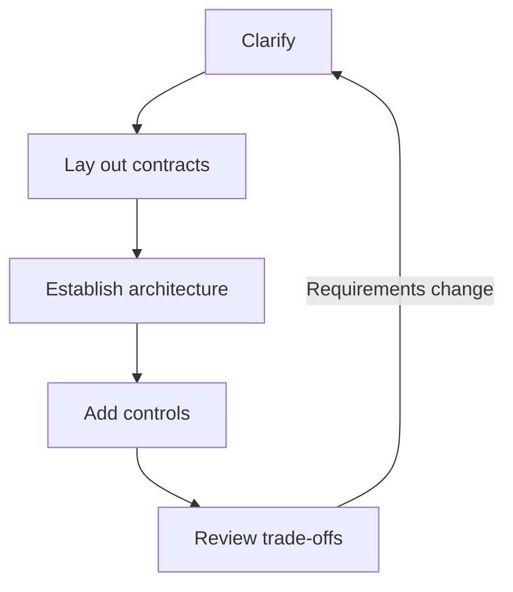

### 2.1 Clarify

Ask questions such as:

- Is the task informational, analytical, transactional, or mixed?
- Is the output advisory or does it create real-world side effects?
- Which users, tenants, regions, and languages are supported?
- What data sources are authoritative?
- What latency and availability targets matter?
- What level of autonomy is acceptable?
- What happens when the system is uncertain?
- What must be logged, retained, or deleted?

### 2.2 Lay out contracts

Define contracts before discussing implementation details.

```text
Request contract
  user identity
  tenant
  goal
  constraints
  permitted actions

Evidence contract
  source
  authority
  freshness
  access scope
  citation identifier

Action contract
  tool
  arguments
  impact class
  approval requirement
  idempotency key

Completion contract
  required fields
  evidence threshold
  policy checks
  maximum attempts
  final state
```

### 2.3 Establish architecture

Choose among these increasingly complex shapes:

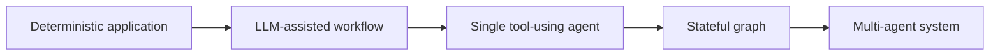

Use the least complex shape that satisfies the contract.

### 2.4 Add controls

Controls should match the risk:

- authentication and authorization;
- source and tenant filtering;
- input and output validation;
- tool allowlists and least privilege;
- human approval for high-impact actions;
- idempotency and confirmation reads;
- retry budgets and circuit breakers;
- no-progress and loop detection;
- tracing, evaluation, and audit logging;
- safe fallback and escalation.

### 2.5 Review trade-offs

Discuss what would change your design:

- higher request volume;
- stricter latency target;
- more tools;
- long-running workflows;
- regulated data;
- cross-region deployment;
- lower model budget;
- need for human collaboration;
- unreliable upstream systems;
- need for deterministic replay.

---

## 3. Architecture decision ladder

A common interview mistake is to treat every generative-AI problem as an agent problem. Use this decision ladder.

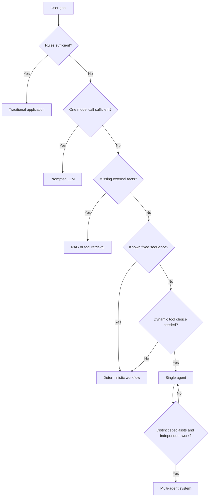

### 3.1 Prompting

Use prompting when:

- the task is general;
- the model already has enough context;
- output behavior can be controlled through instructions and examples;
- rapid iteration matters;
- no external action is required.

### 3.2 RAG

Use RAG when:

- answers depend on private, current, or domain-specific knowledge;
- evidence and citations matter;
- knowledge changes faster than model retraining cycles;
- authorization must filter what can be retrieved.

### 3.3 Fine-tuning

Consider fine-tuning when:

- behavior must be consistent across high volume;
- the task is stable and repeated;
- curated training data exists;
- prompting becomes excessively long or unreliable;
- the goal is behavior adaptation rather than injecting current facts.

### 3.4 Workflows

Use a workflow when the control sequence is known:

```text
Validate request -> retrieve data -> apply rules -> generate summary -> review -> return
```

### 3.5 Agents

Use an agent when the system must choose actions dynamically based on observations. An agent should have:

- a bounded goal;
- tools;
- state;
- a policy;
- stop conditions;
- an evaluator;
- recovery and escalation paths.

### 3.6 Multi-agent systems

Use multiple agents only when specialization produces measurable value, for example:

- independent parallel research;
- separate writer and reviewer responsibilities;
- distinct permissions or data boundaries;
- planner-worker decomposition;
- adversarial critique for high-stakes reasoning.

Do not add agents merely to mirror an organizational chart.

---

## 4. Foundational question bank

The following questions are intentionally concise. A strong answer should define the concept, explain why it matters, provide one example, and mention one limitation.

### 4.1 AI, ML, deep learning, and LLMs

#### Q1. How do AI, machine learning, deep learning, and LLMs relate?

**Answer points**

- AI is the umbrella field.
- Machine learning learns patterns from data.
- Deep learning uses multi-layer neural networks for representation learning.
- LLMs are large transformer-based models trained primarily on token prediction and adapted for language tasks.
- Agentic systems combine models with tools, state, planning, and control loops.

#### Q2. What is representation learning?

A model learns useful internal features rather than relying entirely on manually engineered features. Embeddings are learned representations that position semantically related inputs near each other in a vector space.

#### Q3. What does attention do?

Attention computes context-dependent weighted combinations of token representations. Queries determine what a token seeks, keys describe what other tokens offer, and values carry the information that is combined.

#### Q4. Why do transformers scale better than recurrent networks for language modeling?

Training can process tokens in parallel rather than strictly sequentially, long-range relationships are represented directly through attention, and the architecture maps well to modern accelerators. The trade-off is attention cost with long context.

#### Q5. What is a context window?

The maximum amount of input and generated token context the model can consider in one inference process. Larger windows do not eliminate retrieval, relevance, latency, or cost problems.

### 4.2 Prompt engineering

#### Q6. What belongs in a good prompt?

Role, task, context, constraints, output format, examples when useful, and a quality or verification instruction.

#### Q7. Zero-shot vs one-shot vs few-shot?

- Zero-shot uses instructions only.
- One-shot includes one example.
- Few-shot includes several representative examples.
- More examples can improve consistency but increase token cost and may overfit the demonstrated pattern.

#### Q8. What is the difference between chain-of-thought-style prompting and ReAct?

Chain-of-thought-style prompting organizes reasoning steps. ReAct interleaves reasoning with actions and observations. In production, expose concise rationale and evidence rather than private hidden reasoning traces.

#### Q9. How do you debug a weak model output?

Use the board's decision logic:

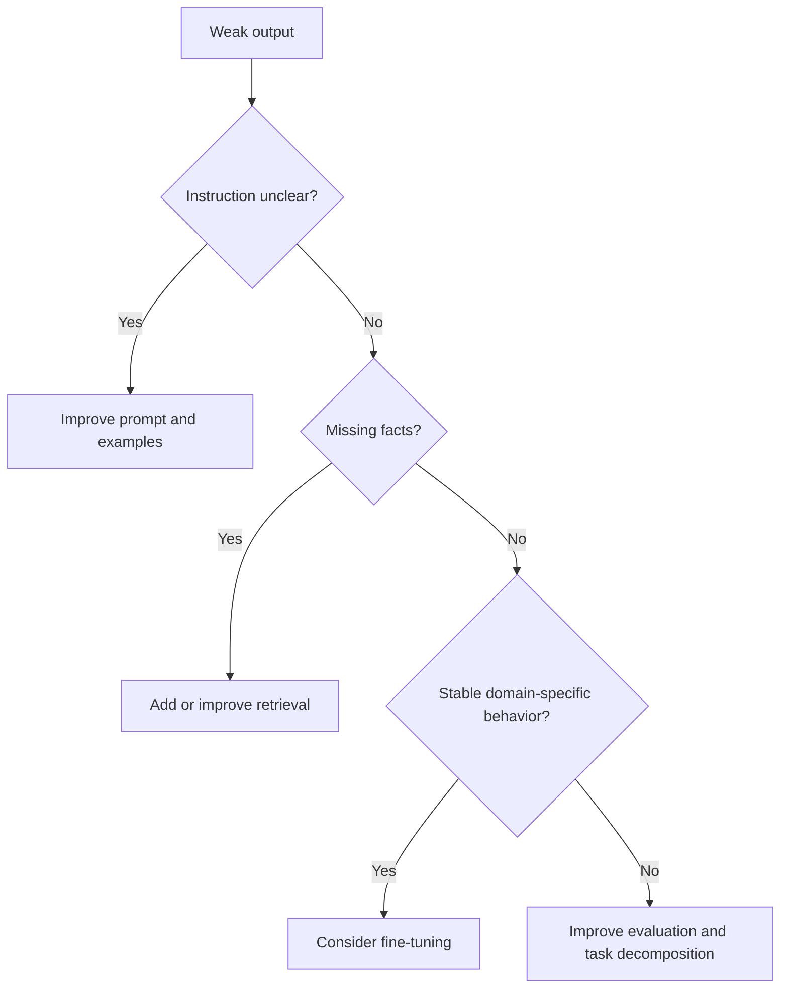

#### Q10. What makes structured output reliable?

A schema, constrained values, explicit field semantics, validation, retries limited to correctable failures, and a fallback when the model cannot satisfy the contract.

### 4.3 RAG and retrieval

#### Q11. Describe a RAG pipeline.

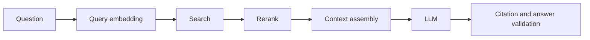

At ingestion time, documents are parsed, chunked, embedded, enriched with metadata, and indexed. At query time, relevant evidence is retrieved and assembled into the model context.

#### Q12. Why does chunking matter?

Chunks define the unit of retrieval. Oversized chunks dilute relevance and consume context; undersized chunks lose necessary context. Structure-aware, parent-child, or sentence-window patterns can preserve meaning.

#### Q13. Dense vs sparse retrieval?

- Dense retrieval uses learned vectors and semantic similarity.
- Sparse retrieval uses token-based signals such as term frequency.
- Hybrid retrieval combines semantic and lexical strengths.

#### Q14. What is reranking?

A second-stage model or rule scores a smaller candidate set more precisely than the first-stage retriever. It improves ordering but adds latency and cost.

#### Q15. How do you evaluate retrieval?

Recall@k, precision@k, MRR, nDCG, evidence coverage, freshness, authorization correctness, and downstream answer impact.

#### Q16. What is faithfulness?

The degree to which generated claims are supported by the supplied evidence. An answer can be factually correct but unfaithful if its evidence does not support the claim.

#### Q17. How do you protect RAG from prompt injection?

Treat retrieved content as untrusted data, separate instructions from evidence, sanitize and classify sources, enforce tool and policy rules outside the model, filter by authorization, and validate outputs and actions.

### 4.4 Agent fundamentals

#### Q18. What makes an LLM system an agent?

A model participates in a loop that observes state, chooses actions, invokes tools, updates state, evaluates progress, and stops or escalates according to policy.

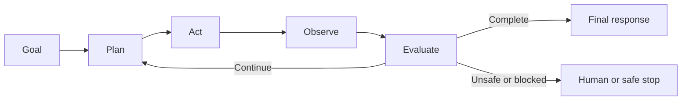

#### Q19. What is agent state?

Structured information required to continue the workflow: goal, current step, past actions, tool observations, evidence, approvals, errors, budgets, and completion status.

#### Q20. Memory vs state?

State is the authoritative workflow record for a run. Memory is selectively retained information used across turns or runs. External business records remain in systems of record and should not be treated as model memory.

#### Q21. What is reflection?

A bounded evaluation step that checks whether an intermediate or final result meets a contract. Reflection should produce actionable defects, not open-ended self-criticism.

#### Q22. What is replanning?

Changing the remaining plan because evidence, tool results, or constraints invalidate the original plan. Replanning must be bounded by budgets and progress checks.

#### Q23. How do you prevent infinite loops?

Maximum hops, attempt budgets, duplicate-action detection, no-progress detection, explicit completion conditions, semantic termination, and human escalation.

### 4.5 Tool calling

#### Q24. What belongs in a tool contract?

Name, purpose, argument schema, output schema, permissions, side-effect class, timeout, retry policy, idempotency behavior, error taxonomy, and observability fields.

#### Q25. Why is idempotency important?

Retries must not duplicate side effects. Use an idempotency key tied to the intended action and verify uncertain write outcomes before retrying.

#### Q26. How should a model choose tools?

From an allowlisted registry filtered by user identity, tenant, workflow phase, and policy. The model proposes an action; deterministic controls authorize and execute it.

#### Q27. How do you handle an ambiguous write timeout?

Do not immediately retry. Reconcile by querying the target system with an operation identifier, then retry only if the write is confirmed absent.

#### Q28. When should humans approve actions?

When actions are high impact, irreversible, legally meaningful, financially consequential, privacy-sensitive, or outside the system's confidence and policy thresholds.

### 4.6 Frameworks and orchestration

#### Q29. Compare LangGraph, CrewAI, AutoGen, and LangChain agents.

| Framework style | Primary mental model | Best fit |
|---|---|---|
| LangGraph | Stateful graph with nodes and edges | Branching, loops, persistence, approvals |
| CrewAI | Role-based team and tasks | Researcher-writer-reviewer collaboration |
| AutoGen | Conversational agents and teams | Multi-agent discussion and handoff |
| LangChain agents | Model with dynamic tools | General tool-routing agents |

The correct choice follows workflow shape, reliability needs, and team operating model.

#### Q30. What does an orchestration layer do?

It classifies requests, selects agents or tools, schedules work, manages shared state, applies policies, handles errors, records traces, and returns or replans.

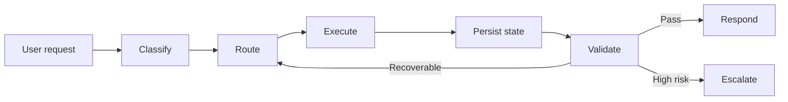

#### Q31. Deterministic vs model-based routing?

Deterministic routing is predictable and auditable but may be brittle. Model routing handles ambiguity but requires confidence thresholds, permission filtering, evaluation, and fallbacks. Hybrid routing uses rules for known and high-risk cases and models for residual ambiguity.

### 4.7 Multi-agent systems

#### Q32. Manager-worker vs planner-executor-reviewer?

- Manager-worker distributes independent work across specialists.
- Planner-executor-reviewer separates plan creation, execution, and quality control.
- They can be combined, but each role must have a distinct contract.

#### Q33. When does debate help?

When independent perspectives can expose assumptions or evidence gaps and a credible judge can compare them. Debate is harmful when agents share the same evidence and model biases, when there is no termination condition, or when rhetoric replaces evidence.

#### Q34. Shared vs isolated memory?

Use isolated memory for privacy, independence, or compliance. Use shared state for coordination. Share only the minimum data required and define ownership of each field.

#### Q35. What are common multi-agent failure modes?

Circular delegation, livelock, deadlock, correlated hallucination, false consensus, duplicate work, state races, retry storms, evidence laundering, unbounded cost, and unclear final decision ownership.

### 4.8 Safety, security, and responsible AI

#### Q36. What are major guardrail categories?

Input, contextual, policy, content, behavioral, planning, tool/API, output, and recovery guardrails.

#### Q37. Interrupt vs reset vs abort?

- Interrupt pauses execution and preserves state.
- Reset clears or returns to a known safe state.
- Abort terminates the workflow and may trigger compensation or incident handling.

#### Q38. What is a confused-deputy risk in agents?

The agent has greater privileges than the requester and is tricked into using them on the requester's behalf. Prevent it through delegated identity, scope checks, tenant isolation, and authorization at every tool call.

#### Q39. How do you evaluate fairness in an agent?

Compare outcomes, error rates, evidence coverage, escalation, latency, and service quality across relevant and intersectional cohorts; run counterfactual tests; investigate root causes by system layer.

#### Q40. How do you provide explainability without exposing chain-of-thought?

Return decision factors, evidence, tool actions, policy rules, confidence, limitations, and user recourse. Do not expose private hidden reasoning traces.

### 4.9 UX, performance, and operations

#### Q41. What should the application layer own?

Authentication, sessions, rendering, progress, feedback, approvals, user controls, accessibility, telemetry, and evidence presentation.

#### Q42. How do you improve perceived latency?

Show meaningful progress, stream safe partial output, parallelize independent work, cache stable results, route simple tasks to smaller models, and avoid unnecessary reflection or agent hops.

#### Q43. What should be traced?

Request, route, prompt version, model, retrieval query, evidence identifiers, tool calls, approvals, state transitions, retries, guardrail decisions, latency, cost, and final outcome.

#### Q44. What is a useful agent SLO?

A multidimensional target such as: 95% of eligible tasks complete successfully, 99% of writes are idempotent, 100% of high-impact actions are approved, p95 latency is below the target, and grounded-answer rate exceeds the release threshold.

### 4.10 Product management

#### Q45. How does AI-native product management differ?

It manages probabilistic behavior and continuous learning loops. Product teams measure accuracy, trust, safety, drift, latency, cost, and human override in addition to delivery and adoption.

#### Q46. What is an AI product release gate?

A predefined set of quality, safety, fairness, security, latency, cost, and operational thresholds that must pass before broader deployment.

#### Q47. What should remain human-owned?

Risk acceptance, policy decisions, high-impact approvals, product trade-offs, interpretation of ambiguous evidence, and accountability for outcomes.

---

## 5. Senior-level deep-dive questions

Senior interviews test whether a candidate can reason across layers.

### Q48. Your RAG system has high answer accuracy in offline tests but low user trust in production. What do you investigate?

Investigate:

- citation visibility and usability;
- whether citations support specific claims;
- stale or contradictory sources;
- confidence language;
- unresolved answer ambiguity;
- user ability to inspect and correct;
- latency and partial failures;
- cohort-specific failure patterns;
- mismatch between offline questions and real tasks;
- business workflow outcomes rather than answer-only metrics.

### Q49. An agent occasionally repeats a financial transaction after a timeout. How do you redesign it?

- Assign a stable idempotency key before execution.
- Persist intent and operation identifier.
- Use a tool with idempotent semantics where possible.
- On timeout, query the system of record before retrying.
- Record confirmation reads.
- Prevent the model from directly controlling retry count.
- Require approval for materially changed arguments.
- Add duplicate-action alerts and incident replay.

### Q50. A multi-agent research system becomes slower and less accurate as agents are added. Why?

Likely causes include redundant work, overlapping roles, larger context, inconsistent evidence, correlated errors, excessive debate, merge failures, and no shared completion contract. Reduce agent count, enforce single responsibility, parallelize only independent work, centralize evidence, and measure marginal value per agent.

### Q51. How do you migrate from a prototype to production?

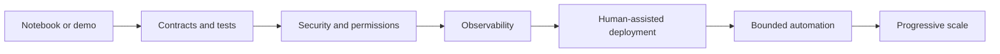

Key changes:

- typed interfaces;
- versioned prompts and policies;
- production data connectors;
- authorization and tenant isolation;
- persistent state;
- evaluation datasets;
- SLOs and runbooks;
- deployment gates;
- approval and rollback controls.

### Q52. When would you avoid an LLM entirely?

When deterministic rules, search, calculation, database queries, or standard automation solve the task more reliably, cheaply, and transparently. LLMs should not replace exact computation or policy enforcement.

### Q53. How do you compare two agent architectures experimentally?

Use the same task set, tools, data, and release constraints. Compare task success, trajectory correctness, safety violations, tool accuracy, retries, latency, cost, user effort, escalation, and operational complexity. Use paired analysis and inspect failure distributions, not only average scores.

### Q54. How should model upgrades be released?

- Run offline regression suites.
- Compare retrieval and tool behavior.
- Use shadow traffic.
- Canary by low-risk cohorts.
- Monitor quality, safety, latency, cost, and route changes.
- Preserve prompt, model, policy, index, and tool versions in traces.
- Define automatic rollback conditions.

### Q55. How do you prevent memory from becoming a liability?

Use explicit write policies, typed memory, provenance, freshness, scope, retention, correction, deletion, access controls, summaries, and separation between user preferences, workflow state, and authoritative business records.

---

## 6. Architecture exercise 1: Enterprise support triage agent

### 6.1 Prompt

Design an enterprise support system that classifies tickets, retrieves approved troubleshooting guidance, recommends ownership and priority, and escalates severe cases. It must support multiple tenants and must not perform destructive actions.

### 6.2 Clarifying questions

- Which channels create tickets?
- What priority taxonomy is authoritative?
- What customer and entitlement data is available?
- Which actions are read-only, write, or approval-gated?
- What qualifies as a severe incident?
- Are generated replies sent automatically?
- What is the latency target?
- How are tenant documents separated?

### 6.3 Reference architecture

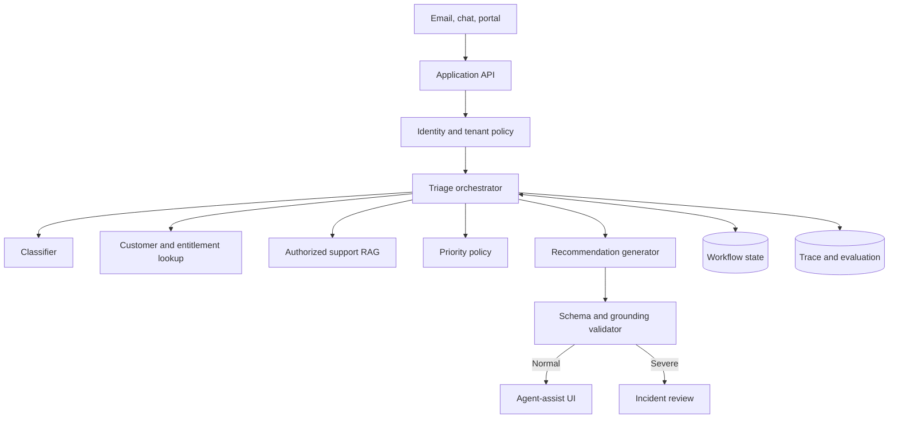

### 6.4 Critical design decisions

- Priority should be a hybrid of model classification and deterministic severity overrides.
- Retrieval must be tenant- and product-version-aware.
- The system should show evidence and permit edits.
- P1 escalation should not depend only on model confidence.
- Ticket updates require idempotency and confirmation.
- Offline evaluation must include ambiguous, multi-intent, malicious, and minority-language cases.

### 6.5 Interview follow-ups

- How would you support attachments?
- How would you detect a widespread incident across tickets?
- What if the knowledge base contains conflicting instructions?
- How would you measure reduced resolution time without hiding quality regressions?
- When would you allow automatic customer replies?

---

## 7. Architecture exercise 2: HR policy and payroll assistant

### 7.1 Prompt

Design an employee assistant that answers HR policy questions, checks calendar availability, and can initiate payroll corrections only after authorized human approval.

### 7.2 Reference architecture

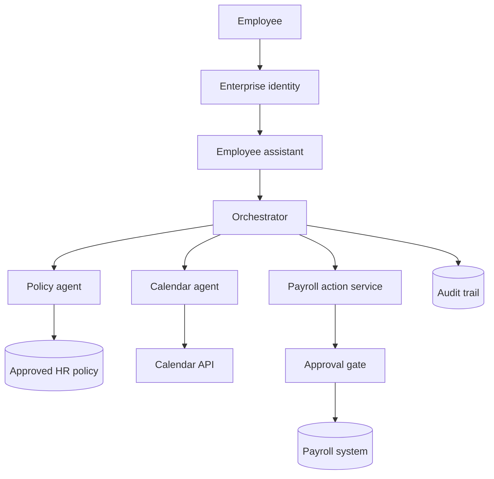

### 7.3 Threat model points

- cross-employee data access;
- indirect prompt injection in policy documents;
- confused-deputy payroll action;
- excessive tool permissions;
- exposure of salary data in logs;
- approval replay;
- stale employment policy;
- legal-advice overreach.

### 7.4 Expected controls

- delegated identity and per-tool authorization;
- policy-only grounded responses;
- explicit uncertainty when evidence is absent;
- read and write scopes separated;
- exact-action approval hash;
- dual approval above a configured threshold;
- output redaction and limited retention;
- incident-grade audit events.

---

## 8. Architecture exercise 3: Project coordination agent

### 8.1 Prompt

Design an agent that identifies sprint blockers from Jira or Azure DevOps, scans approved team messages, incorporates meeting notes, ranks blockers, and prepares a status update.

### 8.2 Parallel retrieval pattern

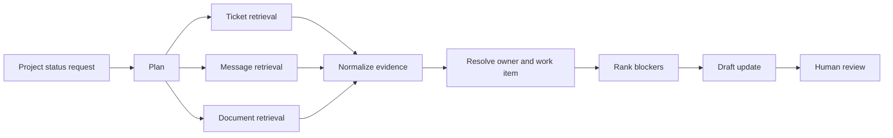

### 8.3 Key trade-offs

- Parallel retrieval improves latency but complicates partial-failure handling.
- Team messages are timely but less authoritative than ticket status.
- Meeting notes can provide context but may be stale.
- Owner inference should be presented as uncertain unless backed by an assignment record.
- Publishing a status update is a write action and may require approval.

### 8.4 Evaluation

Measure blocker recall, false blocker rate, owner accuracy, evidence freshness, source availability, ranking usefulness, update acceptance, and time saved.

---

## 9. Architecture exercise 4: Supplier recommendation agent

### 9.1 Prompt

Design a sourcing assistant that compares suppliers using price, delivery, quality, capacity, certifications, and risk. It may create a draft requisition only after approval.

### 9.2 Decision architecture

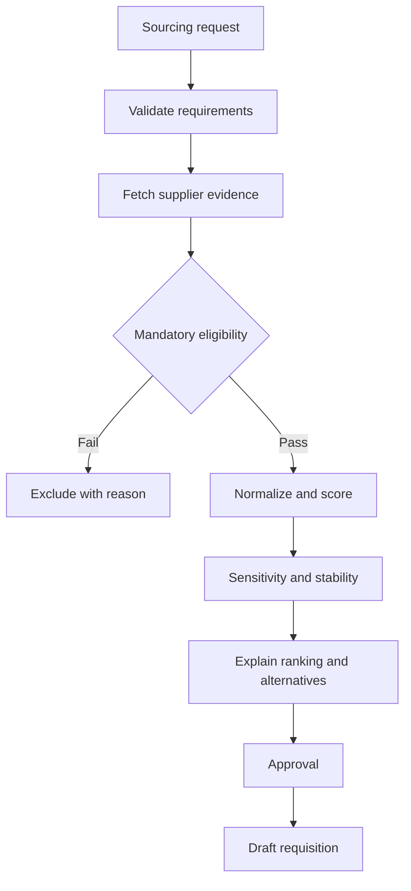

### 9.3 What interviewers look for

- separation of hard constraints and preferences;
- transparent scoring;
- missing-data handling;
- ranking sensitivity;
- data freshness;
- conflict-of-interest and fairness controls;
- no false precision;
- human ownership of the final sourcing decision.

---

## 10. Architecture exercise 5: Competitive research system

### 10.1 Prompt

Design a competitive-research system that compares public product capabilities, pricing, positioning, and adoption signals, with claim-level citations and bounded search.

### 10.2 Evidence architecture

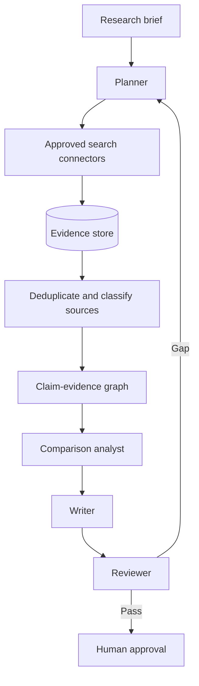

### 10.3 Reliability requirements

- source authority and independence;
- publication and retrieval timestamps;
- facts separated from estimates and interpretation;
- duplicate and syndicated sources grouped;
- citation scope validated;
- contradictions exposed;
- explicit search and review budgets;
- no claim of access to private competitor information.

---

## 11. Architecture exercise 6: Multimodal laboratory safety assistant

### 11.1 Prompt

Design an assistant that analyzes images of a laboratory bench, identifies visible safety risks, missing PPE, and equipment placement concerns, then returns a checklist for human review.

### 11.2 Architecture


### 11.3 Important limitations

- the system cannot detect hazards outside the image;
- image quality and viewpoint affect performance;
- it should not replace required physical inspection;
- recommendations should map to approved safety policy;
- high-risk findings should trigger expert review;
- image retention and access must be governed.

---

## 12. A complete sample system-design answer

### Question

Design an enterprise product-return assistant that answers policy questions and can initiate a return.

### 12.1 Clarify

Assumptions:

- authenticated customers use web and mobile channels;
- policy differs by product, geography, membership, and purchase date;
- the assistant can create a return request but cannot issue an immediate high-value refund;
- source systems are order, product policy, warranty, shipping, and compliance services;
- target p95 latency is five seconds for information and ten seconds for return initiation;
- uncertain or conflicting cases escalate to a human.

### 12.2 Contracts

**Input**

```json
{
  "customer_id": "C-123",
  "tenant": "retail-us",
  "order_id": "O-458",
  "request": "Can I return this product?",
  "channel": "web"
}
```

**Decision output**

```json
{
  "eligible": true,
  "reason": "Within return window and product is not excluded",
  "deadline": "2026-08-14",
  "fees": [],
  "evidence": ["policy:returns:v17", "order:O-458"],
  "confidence": "high",
  "next_actions": ["Create return request"]
}
```

**Action contract**

```json
{
  "tool": "create_return_request",
  "arguments": {
    "order_id": "O-458",
    "item_id": "I-2",
    "reason_code": "DAMAGED"
  },
  "approval_required": true,
  "idempotency_key": "return-O-458-I-2-DAMAGED"
}
```

### 12.3 Architecture

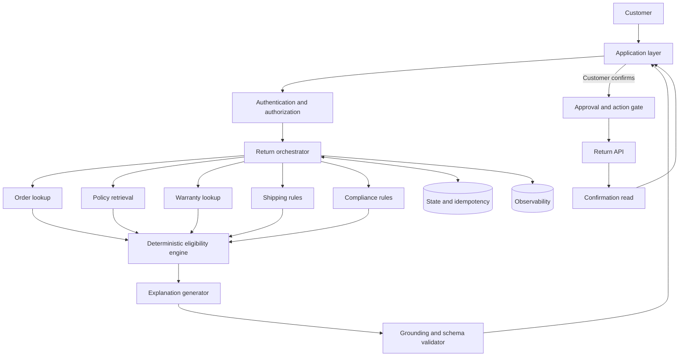

### 12.4 Why this design

- Eligibility is deterministic because policy and order facts should not be left to free-form generation.
- The LLM interprets the request and produces an explanation, but it does not own the policy decision.
- Independent reads can run in parallel.
- Conflicting or unavailable systems reduce confidence and may trigger escalation.
- The write path is separate and approval-gated.
- An idempotency key prevents duplicate returns.
- The final response includes evidence, deadline, fees, limitations, and next actions.

### 12.5 Failure handling

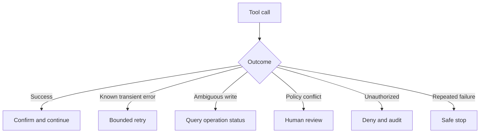

### 12.6 Evaluation

- policy decision accuracy;
- order and product match accuracy;
- grounded explanation rate;
- unauthorized data-access rate;
- duplicate-return rate;
- escalation precision and recall;
- p50 and p95 latency;
- cost per completed return;
- customer correction and abandonment;
- successful return completion.

### 12.7 Trade-offs

- A fully model-driven decision would be more flexible but less auditable.
- A fully deterministic form would be reliable but less conversational.
- A hybrid design provides natural-language interaction while preserving rule ownership.
- A stateful graph becomes useful when the return process includes long-running shipping, inspection, refund, and exception stages.

---

## 13. Whiteboard architecture checklist

During a system-design interview, ensure the diagram contains these layers.

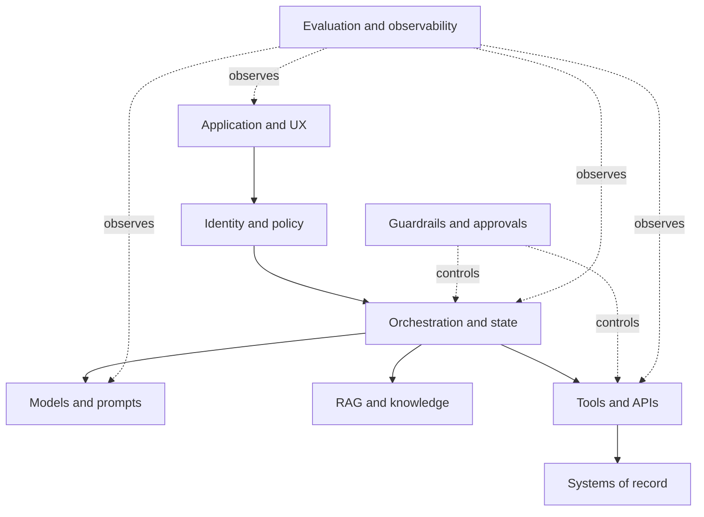

### 13.1 Requirements

- user and business goal;
- functional scope;
- non-functional constraints;
- risk and autonomy level;
- source-of-truth systems;
- human ownership.

### 13.2 Data and evidence

- data sources;
- ingestion and freshness;
- metadata and provenance;
- authorization filtering;
- conflict handling;
- retention and deletion.

### 13.3 Control flow

- route and plan;
- sequential vs parallel steps;
- state ownership;
- completion condition;
- retries and fallbacks;
- human checkpoints.

### 13.4 Tools and actions

- schema;
- permissions;
- side effects;
- idempotency;
- timeout and reconciliation;
- confirmation.

### 13.5 Safety and security

- prompt injection;
- data leakage;
- tenant isolation;
- least privilege;
- sandboxing;
- output validation;
- incident response.

### 13.6 Evaluation and operations

- golden and adversarial datasets;
- component, trajectory, and outcome metrics;
- quality and safety release gates;
- latency and cost budgets;
- traces and version attribution;
- dashboards, alerts, and runbooks.

---

## 14. Interview answer rubric

Use a 0-4 scale for each dimension.

| Dimension | 0 | 2 | 4 |
|---|---|---|---|
| Requirements | No clarification | Some assumptions | Explicit users, goals, risks, constraints |
| Architecture choice | Technology-first | Plausible design | Simplest justified design with evolution path |
| Contracts | Unstructured | Partial schemas | Typed inputs, outputs, state, evidence, actions |
| Data and grounding | Ignored | Basic retrieval | Provenance, freshness, authorization, conflicts |
| Tools and side effects | Ignored | Tools named | Permissions, idempotency, confirmation, errors |
| State and memory | Vague | Basic history | State ownership, persistence, scope, retention |
| Safety and security | Generic | Some guardrails | Threat-specific controls and human boundaries |
| Evaluation | Accuracy only | Several metrics | Component, trajectory, outcome, cohort, release gates |
| Reliability and operations | Happy path only | Retries and logs | Budgets, fallbacks, SLOs, tracing, runbooks |
| UX and human control | Chat only | Basic approval | Progress, evidence, correction, interrupt, escalation |
| Trade-offs | None | One alternative | Clear alternatives, triggers, cost and complexity |
| Communication | Disorganized | Understandable | Structured, concise, prioritizes key decisions |

### 14.1 Score interpretation

- **0-15:** Fundamental gaps. Revisit core concepts and answer structure.
- **16-28:** Developing. Architecture is plausible but lacks production depth.
- **29-38:** Strong mid-level. Covers most layers and meaningful trade-offs.
- **39-44:** Strong senior. Integrates reliability, security, evaluation, and operations.
- **45-48:** Exceptional. Clear prioritization, precise contracts, and mature judgment.

---

## 15. Common interview mistakes

### 15.1 Starting with a framework

Frameworks implement designs; they do not replace requirements or architecture decisions.

### 15.2 Using agents for deterministic tasks

Exact rules, calculations, database queries, and policy checks should remain deterministic.

### 15.3 Treating retrieval as solved by a vector database

Retrieval quality depends on content, parsing, chunking, metadata, hybrid search, reranking, freshness, authorization, and evaluation.

### 15.4 Saying "add guardrails" without specificity

Name the threat, enforcement point, decision, fallback, and evidence required.

### 15.5 Ignoring write semantics

Transactional agents need approval, idempotency, ambiguous-outcome reconciliation, compensation, and confirmation reads.

### 15.6 Confusing memory with databases

Authoritative business state belongs in systems of record. Agent memory is selective context, not a replacement for transactional storage.

### 15.7 Giving only average metrics

Tail latency, cohort failures, severe safety events, and rare duplicate writes matter more than averages in many systems.

### 15.8 No stop condition

Every loop, debate, reflection, retry, and search process requires a budget and termination condition.

### 15.9 No human ownership

High-impact decisions need clear accountability, approval, correction, and appeal.

### 15.10 Overclaiming current framework details

Framework APIs evolve. Explain the architecture pattern first, then identify the current implementation approach and version assumptions.

---

## 16. Behavioral and leadership questions

### Q56. Tell me about an AI system that failed in production.

Use a structured response:

1. Situation and impact.
2. Detection signal.
3. Root cause across model, data, control, or operations.
4. Immediate containment.
5. Permanent corrective action.
6. Evaluation and monitoring added.
7. What you would do earlier next time.

### Q57. How do you handle disagreement between product and engineering about agent autonomy?

Frame autonomy as a risk-tiered product decision. Define action classes, measurable readiness gates, human review costs, user value, failure impact, and a staged rollout from assistive to bounded automation.

### Q58. How do you explain an AI limitation to executives?

Describe the business consequence, evidence, frequency, affected users, mitigation options, residual risk, and recommendation. Avoid model jargon unless it changes the decision.

### Q59. How do you prioritize quality, latency, and cost?

Start with the task's risk and user need. Define minimum safety and correctness constraints, then optimize latency and cost within those constraints. Use routing, caching, and progressive delivery rather than silently lowering quality.

### Q60. How do you decide whether to build or buy an agent platform?

Compare strategic differentiation, data boundaries, control requirements, integration complexity, evaluation and observability needs, security posture, team capability, total cost, portability, and expected workflow change.

### Q61. How do you lead an AI incident review?

Create a blameless timeline, preserve traces and versions, identify containment and impact, separate proximate and systemic causes, define owners and deadlines, add regression cases, and communicate residual risk.

---

## 17. Thirty-day preparation plan

### Week 1 - Foundations and retrieval

- Review Chapters 1-10.
- Explain AI, transformers, LLMs, prompting, RAG, embeddings, chunking, and reranking aloud.
- Draw a RAG architecture from memory.
- Practice five retrieval debugging scenarios.

### Week 2 - Agents and frameworks

- Review Chapters 11-19.
- Implement or inspect one tool-calling loop.
- Compare fixed workflow, LangGraph, CrewAI, AutoGen, and LangChain designs.
- Practice state, memory, approval, retry, and idempotency questions.

### Week 3 - Multi-agent, safety, and operations

- Review Chapters 20-29.
- Practice failure-mode analysis.
- Threat-model one architecture each day.
- Build evaluation and observability checklists.
- Explain one incident response scenario.

### Week 4 - Projects and mock interviews

- Review Chapters 30-34.
- Complete all six architecture exercises in this chapter.
- Record 30-minute mock system-design answers.
- Score them with the supplied rubric.
- Rewrite weak sections into concise answer patterns.

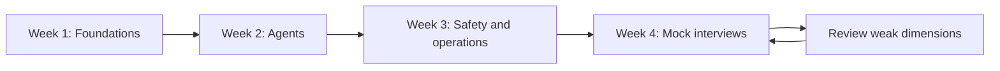

---

## 18. Rapid-review cheat sheet

### Prompt

```text
Role + Task + Context + Constraints + Output + Quality check
```

### RAG

```text
Ingest -> Parse -> Chunk -> Embed -> Index
Query -> Retrieve -> Rerank -> Assemble -> Generate -> Validate
```

### Agent

```text
Goal -> Plan -> Act -> Observe -> Evaluate -> Continue / Complete / Escalate
```

### Tool safety

```text
Authenticate -> Authorize -> Validate -> Approve -> Execute -> Confirm -> Audit
```

### Multi-agent

```text
Distinct roles + typed handoffs + shared contract + bounded coordination + final owner
```

### Production

```text
Quality + Safety + Fairness + Latency + Cost + Reliability + User outcome
```

### Incident response

```text
Detect -> Contain -> Preserve evidence -> Diagnose -> Recover -> Prevent recurrence
```

---

## 19. Hands-on lab: conduct a mock architecture interview

### 19.1 Scenario

Design a regulated document-review assistant that:

- accepts documents and questions;
- retrieves approved policies;
- highlights evidence;
- flags missing information;
- drafts a review summary;
- requires human approval before any external submission.

### 19.2 Deliverables

Produce:

1. assumptions and clarifying questions;
2. request, evidence, output, and approval contracts;
3. architecture diagram;
4. sequence for normal and failure paths;
5. threat model;
6. evaluation plan;
7. SLOs and operational metrics;
8. staged deployment plan;
9. trade-off discussion;
10. self-score using the rubric.

### 19.3 Suggested sequence

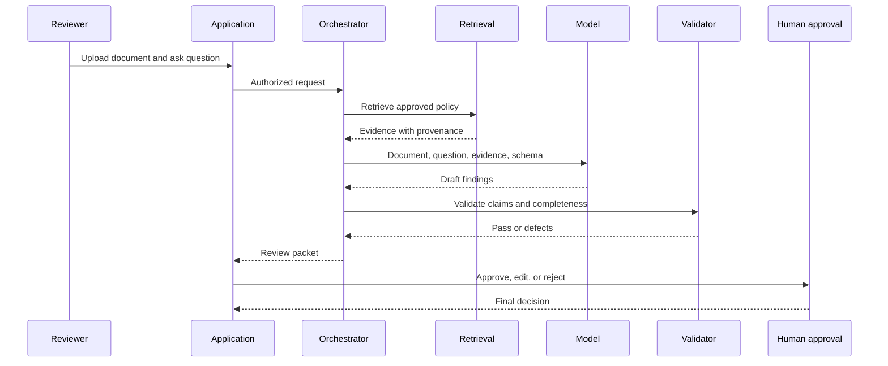

### 19.4 Extension challenges

- add multilingual documents;
- add conflicting policy versions;
- add a malicious instruction inside an uploaded file;
- add a temporary policy-service outage;
- add a request to compare two employees' confidential records;
- add a strict five-second latency budget;
- add regional retention and deletion rules.

---

## 20. Knowledge check

1. Why should an architecture answer begin with requirements rather than frameworks?
2. When is a deterministic workflow preferable to an agent?
3. What is the difference between evidence quality and answer fluency?
4. Why must write actions be separated from informational responses?
5. What conditions justify a multi-agent design?
6. How does no-progress detection differ from a maximum retry count?
7. What belongs in a completion contract?
8. Why is tenant-aware retrieval a security control?
9. How should a system handle an ambiguous write timeout?
10. Why is average latency insufficient for production evaluation?
11. What is the difference between state, memory, and a system of record?
12. How can a team provide explainability without exposing hidden reasoning?
13. What should trigger human review?
14. Why are framework comparisons secondary to workflow shape?
15. What makes an interview answer senior-level rather than merely technically correct?

---

## 21. Chapter summary

- Strong interviews test architecture judgment, not the number of tools a candidate can name.
- Start with users, goals, risks, constraints, and completion conditions.
- Define typed contracts for requests, evidence, state, tools, approvals, and outputs.
- Choose the simplest architecture that reliably solves the task.
- Keep deterministic policy, exact calculation, authorization, and side-effect control outside the model.
- Treat retrieval quality, security, evaluation, UX, latency, cost, and operations as core design dimensions.
- Use agents only when dynamic action selection is required.
- Use multiple agents only when specialization, parallelism, permission boundaries, or independent review justify coordination cost.
- Design retries, fallbacks, no-progress controls, safe stopping, and human escalation before deployment.
- Evaluate components, trajectories, outcomes, cohorts, and operational behavior.
- Explain alternatives and the conditions that would cause the architecture to evolve.
- Practice with a repeatable rubric and improve the lowest-scoring dimensions.

---

## 22. Further study within this handbook

- Foundations and LLMs: Chapters 1-5
- Prompt engineering: Chapter 6
- RAG and retrieval: Chapters 7-10
- Agents, tools, reflection, and memory: Chapters 11-14
- Frameworks and orchestration: Chapters 15-19
- Multi-agent design and reliability: Chapters 20-22
- Guardrails, evaluation, fairness, and security: Chapters 23-26
- UX, performance, and operations: Chapters 27-29
- AI-native product management: Chapter 30
- End-to-end projects: Chapters 31-34

The accompanying scoring utility under `examples/35-interview-architecture/` supports structured self-assessment without pretending that keyword matching can replace expert interview feedback.
