# Chapter 40 - MCP and Agent-to-Agent Interoperability

> **Source basis:** The board describes agents that plan, call tools, retain state, coordinate specialist roles, route work, and collaborate through orchestrated handoffs [Board, pp. 12-22, 34-40]. It also presents a distinction between an agent's access to tools and data, and multi-agent collaboration across specialist systems [Board, pp. 16-21, 36-39]. This chapter preserves that architecture and expands it using two current interoperability standards. **Standards snapshot:** Model Context Protocol (MCP) specification `2026-07-28`; Agent2Agent (A2A) Protocol specification `1.0.0`, current as of 4 August 2026. Detailed protocol fields, security guidance, compatibility engineering, and the reference implementation are **Supplementary**.

---

## Learning objectives

By the end of this chapter, you should be able to:

1. Explain why agent interoperability requires more than framework-specific tool wrappers.
2. Distinguish MCP's model-to-capability boundary from A2A's agent-to-agent collaboration boundary.
3. Describe MCP hosts, clients, servers, tools, resources, prompts, and request metadata.
4. Describe A2A Agent Cards, skills, messages, parts, tasks, artifacts, contexts, and task states.
5. Select MCP, A2A, an ordinary API, or an internal function call for a given integration.
6. Design an agent that discovers a remote agent through an A2A Agent Card and delegates bounded work.
7. Design a remote agent that uses MCP servers to access tools and governed data without exposing internal implementation details.
8. Apply identity propagation, authorization, least privilege, consent, approval, and audit controls across both protocols.
9. Handle synchronous responses, streaming updates, long-running tasks, interruptions, retries, and cancellation.
10. Version capability descriptions and preserve compatibility as protocols and agent skills evolve.
11. Test interoperability at schema, transport, semantic, security, and outcome levels.
12. Implement a dependency-free simulation of an A2A delegation whose serving agent uses MCP-style capabilities.

---

## 1. Why interoperability is now an architecture concern

The first generation of agent applications often connected an LLM to tools through code written inside one application. That worked while one team owned the model, orchestration, tools, permissions, and user interface. It becomes fragile when capabilities are distributed across:

- different frameworks;
- different programming languages;
- different business units;
- separate cloud accounts or networks;
- vendors and partners;
- independent release cycles;
- different identity and compliance domains.

Without a protocol boundary, each integration becomes custom glue.

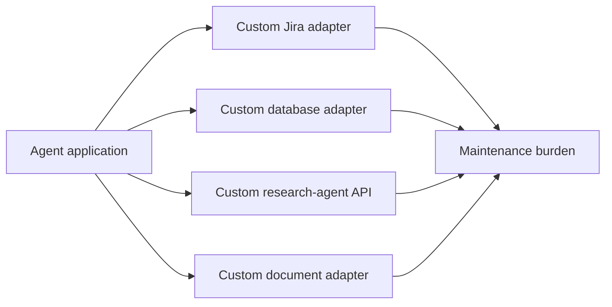

Custom integrations are not automatically wrong. They become expensive when every consumer must independently understand capability discovery, schemas, authentication, streaming, long-running state, errors, approvals, and versioning.

Interoperability protocols move these concerns into shared contracts.

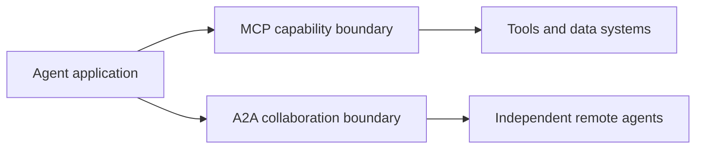

> **Key principle**
>
> Standardize the boundary, not the internal reasoning implementation.

A protocol should let two systems collaborate without requiring either side to expose private prompts, internal memory, model choice, chain-of-thought, or framework internals.

---

## 2. MCP and A2A solve different problems

MCP and A2A are complementary rather than competing standards.

| Question | MCP | A2A |
|---|---|---|
| What is being connected? | An AI host or agent to tools, resources, and prompt templates | One independent agentic system to another |
| Primary abstraction | Capability | Collaborative task |
| Typical provider | Tool or data server | Remote specialist agent |
| Internal reasoning exposed? | No | No |
| Main discovery object | Tool/resource/prompt catalog | Agent Card and skills |
| Long-running work | Protocol requests and extensions where supported | Stateful Task lifecycle is central |
| Typical example | Query a database or create a ticket | Delegate competitive research to a specialist agent |

The most useful mental model is:

```text
MCP: "Use this capability."
A2A: "Own this delegated objective."
```

An MCP server normally exposes a bounded operation or source of context. An A2A server exposes an agent that may plan internally, call several tools, request more input, produce intermediate status, and return artifacts.

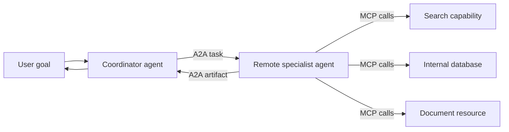

### 2.1 Use ordinary APIs when ordinary APIs are enough

Neither protocol should be adopted merely because an integration involves AI.

Use a direct API or function call when:

- producer and consumer are tightly coupled;
- one team owns both sides;
- the operation is stable and narrow;
- no dynamic discovery is needed;
- ordinary OpenAPI, gRPC, event, or library contracts already solve the problem.

Use MCP when multiple AI hosts need a standardized way to discover and invoke capabilities or consume context.

Use A2A when an independent agent owns a meaningful subgoal and needs a collaboration lifecycle rather than a single function invocation.

---

## 3. MCP architecture

The current MCP architecture uses a host-client-server model. A host application manages one or more MCP clients, and each client communicates with one server. The host owns model integration, consent, orchestration, and cross-server context aggregation.

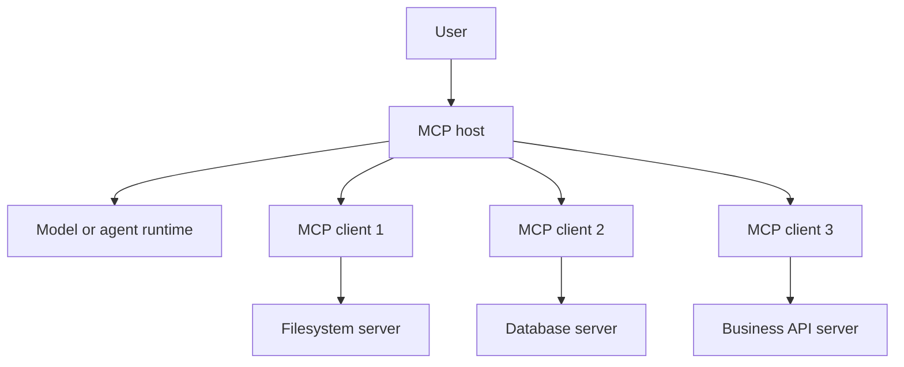

### 3.1 Host responsibilities

The host should:

- decide which servers may be connected;
- create and isolate client instances;
- enforce user and organizational consent;
- maintain the user conversation;
- decide which context is shared with each server;
- coordinate model calls;
- display tool activity and approvals;
- enforce security policy;
- correlate telemetry across requests.

A server should not automatically receive the entire user conversation or visibility into other connected servers.

### 3.2 Stateless protocol core

The `2026-07-28` MCP revision moved the core toward stateless request/response behavior. Every request is self-describing and carries protocol metadata, which improves horizontal scalability and allows ordinary load balancing without sticky sessions.

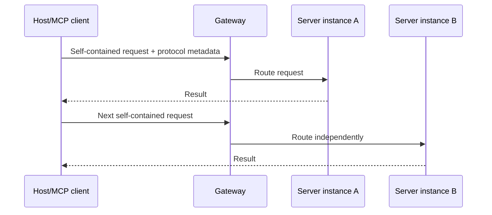

This does not mean applications have no state. Conversation state, user state, approvals, caches, and workflow state still exist. The key change is that the protocol request itself does not depend on an open session with one server instance.

### 3.3 MCP primitives

MCP servers expose three primary primitives.

| Primitive | Typical control | Purpose | Example |
|---|---|---|---|
| Prompt | User-controlled | Reusable interaction template | “Review repository” command |
| Resource | Application-controlled | Contextual data | File, schema, policy document |
| Tool | Model-controlled, host-governed | Executable capability | Query CRM, calculate, create ticket |

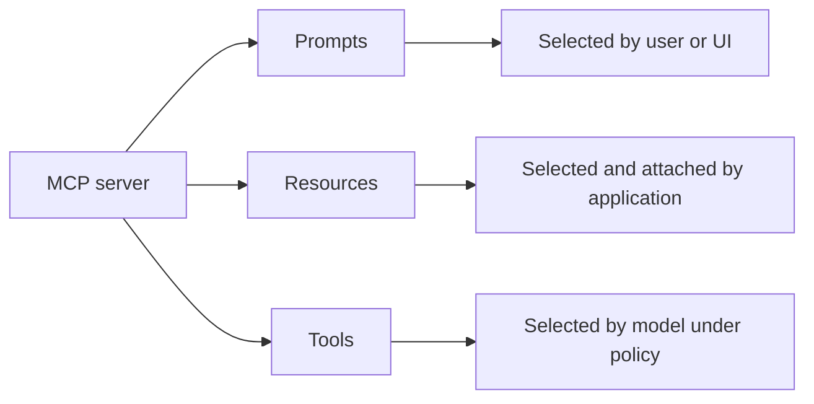

The control labels are defaults, not permission grants. A host remains responsible for deciding whether a model may see or invoke a tool and whether a human must approve an action.

---

## 4. MCP tools, resources, and prompts

### 4.1 Tools

A tool is identified by name and described with metadata and an input schema. The schema is part of the safety and interoperability contract.

```json
{
  "name": "create_purchase_request",
  "description": "Create a draft purchase request for an approved supplier",
  "inputSchema": {
    "type": "object",
    "properties": {
      "supplier_id": {"type": "string"},
      "amount": {"type": "number", "minimum": 0},
      "currency": {"type": "string"}
    },
    "required": ["supplier_id", "amount", "currency"]
  }
}
```

A trustworthy host should not treat schema validation as sufficient authorization. Before execution, it should also validate:

- authenticated identity;
- tenant and data scope;
- tool allowlist;
- action impact;
- argument semantics;
- approval state;
- idempotency key;
- policy version;
- rate and cost budgets.

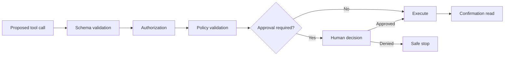

### 4.2 Resources

Resources are URI-identified contextual objects such as files, database schemas, or application records. Resource discovery does not imply unrestricted access. The server must enforce access controls when listing or reading resources.

Examples:

```text
policy://returns/consumer-electronics
schema://warehouse/orders
file://project/architecture.md
crm://customer/12345
```

Resource metadata should include provenance, freshness, classification, and version where relevant.

### 4.3 Prompts

MCP prompts are reusable templates exposed by a server and typically selected through a user-facing interface. They can encode domain workflows while remaining discoverable across compatible hosts.

Examples:

- review a pull request;
- summarize a policy document;
- prepare a supplier-risk checklist;
- compare two laboratory procedures.

A prompt is not an authority boundary. Server-provided instructions must still be treated as untrusted relative to host policy, user intent, and system-level rules.

---

## 5. MCP transport, metadata, and interaction patterns

MCP messages use JSON-RPC semantics. Standard transports include `stdio` for local subprocesses and Streamable HTTP for remote services.

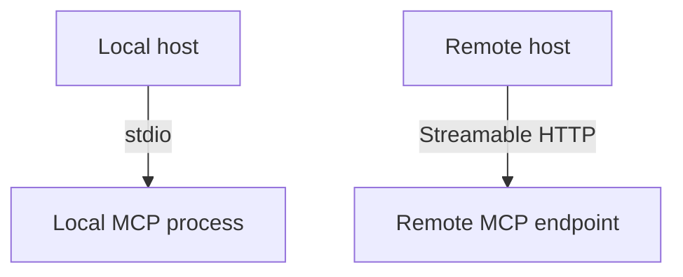

### 5.1 Local subprocess transport

`stdio` is useful when the host launches a trusted local server process. The protocol messages travel over standard input and output, while logs belong on standard error.

Security considerations include:

- executable trust and supply-chain verification;
- environment-variable secrets;
- filesystem permissions;
- process isolation;
- command-injection prevention;
- safe working directories.

### 5.2 Remote HTTP transport

Remote servers require standard web controls:

- HTTPS;
- OAuth-based authorization where applicable;
- token audience validation;
- short-lived credentials;
- exact redirect validation;
- request size and rate limits;
- gateway policy enforcement;
- server identity verification.

### 5.3 Multi Round-Trip Requests

Some MCP operations need additional user or client input during request processing. The current protocol uses Multi Round-Trip Requests rather than requiring a permanently open bidirectional session.

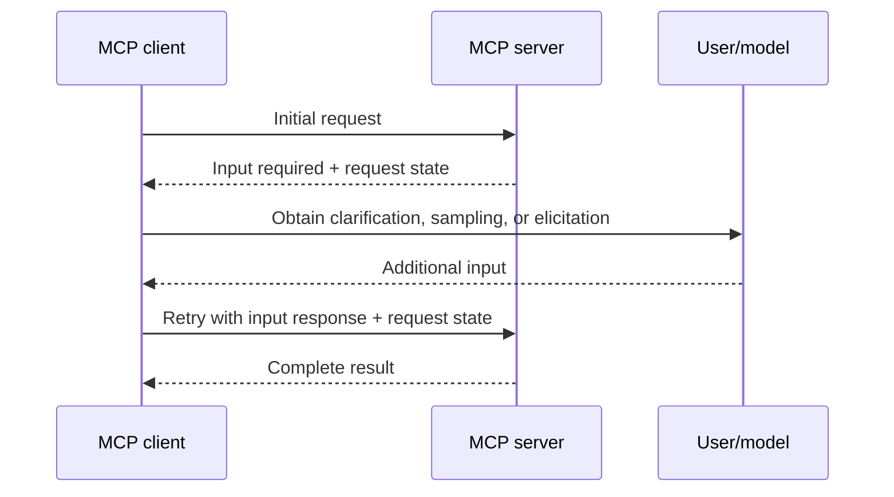

Hosts must show the user what additional information is being requested and why. Sensitive-data collection should be minimized and bound to an explicit purpose.

---

## 6. A2A architecture

A2A connects a client agent to a remote agent that remains operationally opaque. The remote agent exposes supported skills and interaction requirements without exposing its internal tools, prompts, or memory.

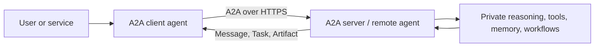

This opacity supports organizational and vendor boundaries. The client evaluates the remote agent through declared capabilities, protocol behavior, evidence, security posture, service levels, and delivered outcomes.

### 6.1 Core A2A actors

- **User:** human or automated initiator.
- **A2A client:** acts on behalf of the user and initiates protocol interactions.
- **A2A server:** remote agent or agentic system that receives messages and owns task execution.

### 6.2 Agent Card

An Agent Card is a JSON metadata document that describes:

- agent identity and description;
- supported interfaces and protocol versions;
- endpoint URLs;
- capabilities such as streaming or push notifications;
- authentication requirements;
- skills;
- optional extensions.

```json
{
  "name": "Supplier Intelligence Agent",
  "description": "Evaluates supplier pricing, delivery, quality, and risk",
  "supportedInterfaces": [
    {
      "url": "https://agents.example.com/supplier/a2a/v1",
      "protocolBinding": "JSONRPC",
      "protocolVersion": "1.0"
    }
  ],
  "skills": [
    {
      "id": "compare-suppliers",
      "name": "Compare suppliers",
      "description": "Return an evidence-backed supplier comparison"
    }
  ]
}
```

A client should validate a card before trust:

- retrieve it over HTTPS;
- verify its source and optional signature;
- compare supported protocol versions;
- validate required extensions;
- check advertised authentication schemes;
- cache using version and freshness controls;
- restrict discovery to trusted registries or domains where necessary.

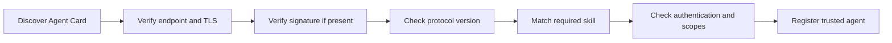

### 6.3 Skills are not unrestricted authority

A skill describes what an agent can do. It does not prove the caller is authorized to use it. The remote agent must enforce authorization at the skill, data, and action levels.

---

## 7. A2A messages, parts, tasks, and artifacts

### 7.1 Messages and parts

A message represents one communication turn. Its content is carried in one or more parts. Parts support text, structured data, referenced files, and inline binary content.

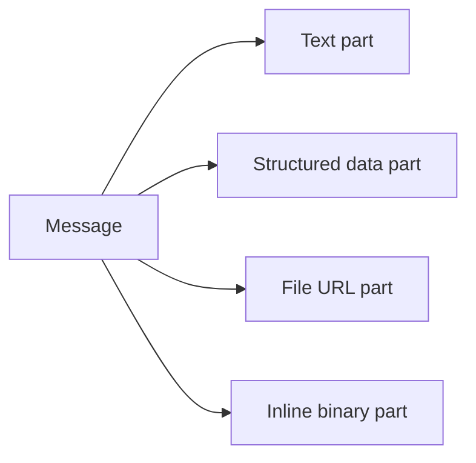

Structured parts are preferable when another agent must reliably parse the result. Natural language may accompany the structure for human readability.

### 7.2 Immediate Message versus stateful Task

A remote agent can respond immediately with a Message or create a Task for trackable work.

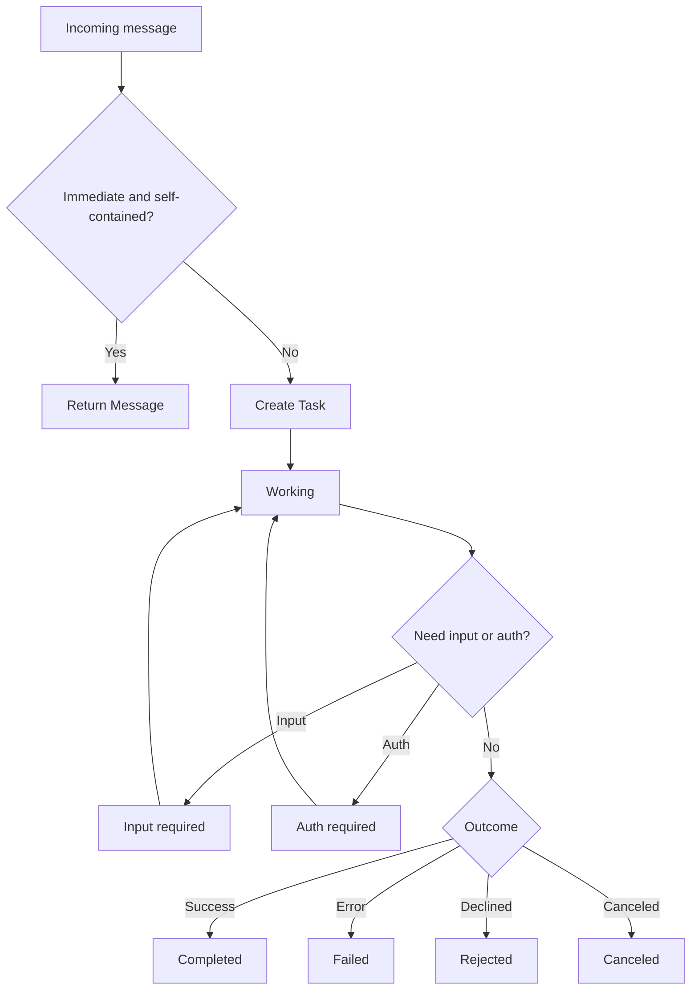

Task states make long-running collaboration observable and controllable. Client applications should define timeouts, cancellation, status polling, streaming, and user-visible progress.

### 7.3 Context and task identifiers

A `contextId` groups related interactions. A `taskId` identifies a specific stateful unit of work. Several tasks may exist within one context, including parallel follow-ups.

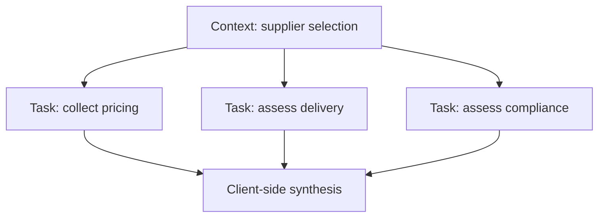

The client should not use context identifiers as authorization tokens. They are correlation identifiers and must be protected from enumeration and cross-tenant leakage.

### 7.4 Artifacts

Artifacts are concrete task outputs such as reports, images, tables, or machine-readable records. They should be versioned and traceable to the task and evidence that produced them.

Examples:

- supplier comparison report;
- generated architecture diagram;
- code patch;
- research evidence ledger;
- structured risk assessment.

The client should manage accepted artifact versions when follow-up tasks refine an earlier deliverable.

---

## 8. Interaction modes for long-running collaboration

A2A supports multiple delivery patterns.

| Pattern | Best for | Main control concern |
|---|---|---|
| Request/response | Short work | Timeout and retries |
| Polling | Trackable work without open stream | Poll interval and task expiry |
| Streaming | Incremental progress or partial artifacts | Reconnect and duplicate events |
| Push notification | Very long or disconnected work | Webhook authentication and replay protection |

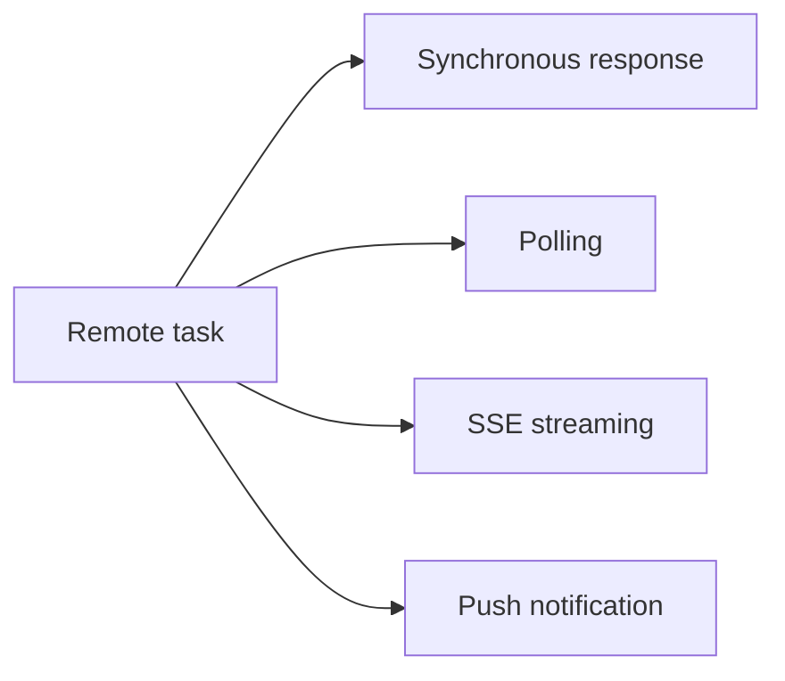

### 8.1 Delivery is not completion

A successfully delivered protocol response does not prove the business objective succeeded. The client still needs to validate:

- task state;
- artifact schema;
- evidence quality;
- policy compliance;
- freshness;
- completeness;
- user acceptance.

---

## 9. The combined MCP and A2A architecture

The cleanest combined pattern is:

1. A client agent discovers a remote specialist through A2A.
2. The client delegates a bounded objective and acceptance criteria.
3. The remote specialist owns internal planning.
4. The specialist uses MCP clients to access governed tools and resources.
5. The specialist returns task status and artifacts through A2A.
6. The client validates, merges, presents, or escalates the result.

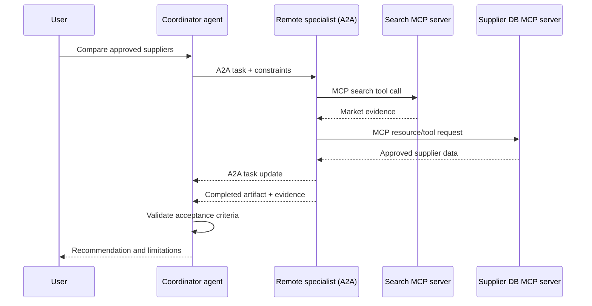

### 9.1 Why not expose every MCP tool directly to the coordinator?

Sometimes the coordinator could call all tools itself. Delegating to a specialist agent is justified when the specialist owns:

- domain-specific planning;
- several internal capabilities;
- private knowledge or vendor systems;
- a long-running workflow;
- domain-specific validation;
- independent service-level responsibility.

Do not add an A2A boundary merely to wrap one deterministic tool. That increases latency, cost, and failure modes without adding meaningful specialization.

---

## 10. Identity, authorization, and delegation

Interoperability does not remove the need for an end-to-end identity model.

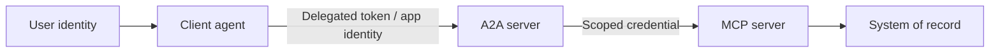

Every hop must answer:

- Who is the human or service principal?
- Which application is acting?
- Is the action on behalf of a user or as the agent's own service identity?
- Which tenant and data scope apply?
- Which skill or tool is permitted?
- Can the remote agent delegate further?
- Does a write require approval?
- Which identity appears in the audit record?

### 10.1 Avoid token passthrough

A token issued for one resource should not be blindly forwarded to another resource. Each service must validate audience and scope. Where downstream access is required, use an approved delegation or token-exchange pattern.

### 10.2 Bind approvals to exact actions

For write actions, an approval should reference an immutable action description or hash.

```text
approval = hash(
  agent_id,
  skill_or_tool,
  normalized_arguments,
  target_resource,
  policy_version,
  expiry
)
```

Changing the amount, supplier, recipient, or target invalidates the approval.

### 10.3 Restrict transitive delegation

An A2A server may itself call another agent. Unbounded transitive delegation creates hidden privilege chains.

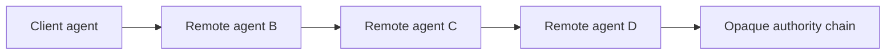

Controls should include:

- maximum delegation depth;
- approved downstream-agent registry;
- scope attenuation at each hop;
- hop-by-hop audit events;
- user disclosure for material delegation;
- no delegation of approval authority unless explicitly allowed.

---

## 11. Capability discovery and semantic matching

Discovery is not simply string matching between a request and a tool or skill description.

A robust selector evaluates:

- required outcome;
- accepted input and output modalities;
- data classification;
- user and tenant permissions;
- latency and cost budget;
- geographic or regulatory constraints;
- protocol version;
- reliability history;
- required extensions;
- evidence and citation capabilities.

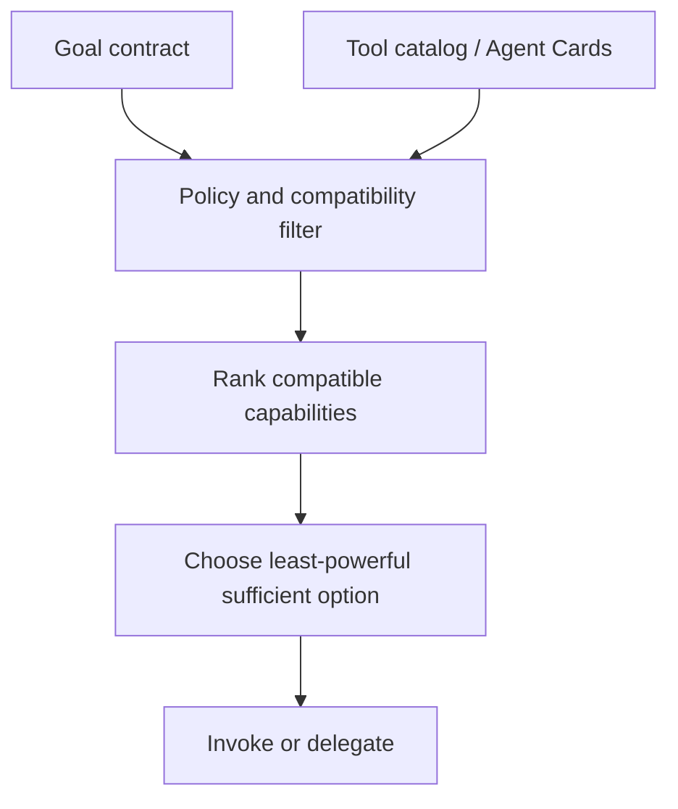

> **Best practice**
>
> Prefer the least-powerful capability that can reliably satisfy the objective.

A read-only tool is safer than a transactional skill. A deterministic API is safer than an autonomous remote agent when both satisfy the same need.

---

## 12. Error handling and recovery

Interoperable systems introduce several error layers.

| Layer | Example | Recovery |
|---|---|---|
| Discovery | Agent Card unavailable | Use cached verified card or approved fallback |
| Compatibility | Unsupported protocol version | Negotiate supported interface or reject |
| Authentication | Expired token | Refresh out of band and retry once |
| Authorization | Missing scope | Ask for step-up authorization or deny |
| Schema | Invalid arguments | Repair before invocation |
| Transport | Timeout or disconnect | Retry idempotent request with backoff |
| Task | Remote task failed | Inspect status, fallback, or escalate |
| Semantic | Artifact does not satisfy contract | Request targeted refinement |
| Policy | Unsafe requested action | Deny or require human approval |

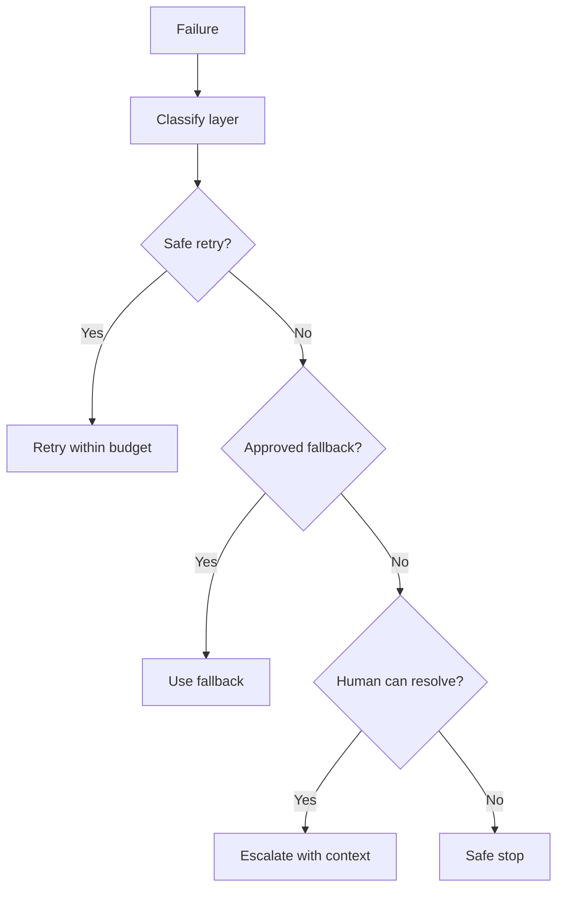

### 12.1 Idempotency across protocol boundaries

Retries must not duplicate side effects. The caller should provide a stable idempotency key for the business action, and every downstream component should preserve it.

```text
user request
  -> A2A task id
  -> remote workflow id
  -> MCP tool-call idempotency key
  -> system-of-record transaction id
```

Correlation identifiers and idempotency keys serve different purposes. A correlation ID links telemetry. An idempotency key prevents duplicate effects.

---

## 13. State ownership and data minimization

A combined system may contain state in several places:

- user-facing host session;
- coordinator workflow state;
- A2A context and task state;
- remote agent internal state;
- MCP request metadata;
- underlying business records;
- audit and observability stores.

```mermaid
flowchart TB
    HOST[Host session state] --> COORD[Coordinator workflow]
    COORD --> A2ACTX[A2A context/task state]
    A2ACTX --> REMOTE[Remote private state]
    REMOTE --> MCPREQ[MCP request state]
    MCPREQ --> RECORD[Business system]
    ALL[Audit trail] --- HOST
    ALL --- COORD
    ALL --- A2ACTX
    ALL --- MCPREQ
```

Each state owner should define:

- schema and version;
- authority and write ownership;
- retention period;
- encryption;
- tenant partition;
- correction and deletion process;
- sensitive-field policy;
- replay behavior;
- recovery guarantees.

Do not copy full conversation history into every A2A message or MCP call. Pass the minimum structured context needed for the capability.

---

## 14. Observability across MCP and A2A

A useful trace spans the complete user objective rather than stopping at one protocol boundary.

```mermaid
flowchart LR
    U[User request span] --> D[A2A delegation span]
    D --> T[Remote task span]
    T --> M1[MCP search span]
    T --> M2[MCP database span]
    T --> V[Validation span]
    V --> R[Artifact return span]
```

Recommended trace attributes include:

- user-safe request reference;
- tenant;
- coordinator run ID;
- A2A context and task IDs;
- remote agent identity and Agent Card version;
- skill ID;
- MCP server identity and protocol revision;
- tool/resource/prompt name;
- authorization decision;
- approval reference;
- latency and cost;
- retries and fallback;
- artifact ID and schema version;
- final outcome and user feedback.

Avoid logging secrets, access tokens, unnecessary prompt content, or sensitive artifacts.

### 14.1 Interoperability metrics

Measure:

- successful discovery rate;
- compatible-version rate;
- authentication and authorization failure rate;
- schema-valid invocation rate;
- task completion rate;
- artifact contract pass rate;
- cancellation success rate;
- duplicate side-effect rate;
- average delegation depth;
- p50/p95/p99 end-to-end latency;
- cost per verified successful delegated task;
- fallback and human-escalation rate.

---

## 15. Interoperability testing

Interoperability must be tested beyond whether two SDK demos connect.

### 15.1 Test layers

```mermaid
flowchart TB
    S[Schema conformance] --> T[Transport conformance]
    T --> P[Protocol lifecycle]
    P --> SEC[Security and authorization]
    SEC --> SEM[Semantic contract]
    SEM --> REL[Reliability and recovery]
    REL --> OUT[Business outcome]
```

#### Schema conformance

- required fields;
- data types;
- enum values;
- unknown-field behavior;
- versioned schemas;
- malformed payload rejection.

#### Protocol lifecycle

- discovery;
- list pagination and caching;
- tool invocation;
- immediate message;
- task creation;
- streaming or polling;
- input-required and auth-required states;
- cancellation;
- completion and failure.

#### Security

- invalid and expired tokens;
- wrong audience;
- missing scopes;
- cross-tenant access;
- malicious Agent Cards;
- prompt injection inside resources or artifacts;
- webhook replay;
- approval tampering;
- transitive delegation abuse.

#### Semantic contract

- skill or tool actually performs the advertised function;
- artifact contains required evidence;
- confidence and limitations are meaningful;
- no unsupported claims;
- completion criteria are satisfied.

### 15.2 Contract test suite

Every production capability should publish or internally maintain fixtures for:

- valid request and response;
- minimal request;
- maximum-size request;
- authorization failure;
- invalid schema;
- timeout;
- partial result;
- retryable failure;
- permanent failure;
- cancellation;
- incompatible version;
- malicious content.

---

## 16. Versioning and compatibility

Protocols, SDKs, tool schemas, Agent Cards, and business capabilities evolve independently.

A capability version model should distinguish:

- protocol version;
- interface binding version;
- Agent Card version;
- skill version;
- MCP server version;
- tool/resource schema version;
- business policy version;
- artifact schema version.

```mermaid
flowchart LR
    PROTO[Protocol version] --> COMPAT[Compatibility decision]
    CARD[Agent Card/skill version] --> COMPAT
    TOOL[Tool schema version] --> COMPAT
    POLICY[Policy version] --> COMPAT
    COMPAT --> RUN[Run]
```

### 16.1 Safe evolution rules

- Add optional fields before making them required.
- Do not silently change a tool's side effects.
- Use new skill or tool identifiers for materially different behavior.
- Maintain explicit deprecation windows.
- Preserve old artifact schemas during migration.
- Test mixed-version deployments.
- Cache capability catalogs only within their declared freshness.
- Roll back by configuration, not emergency code changes.

---

## 17. Reference architecture: regulated supplier intelligence

Consider an enterprise coordinator that evaluates laboratory-equipment suppliers.

```mermaid
flowchart TB
    USER[Procurement analyst] --> APP[Procurement assistant]
    APP --> IDP[Enterprise identity provider]
    APP --> REG[A2A trusted-agent registry]
    REG --> CARD[Supplier intelligence Agent Card]
    APP -->|A2A task| AGENT[Supplier intelligence agent]
    AGENT --> MCP1[Pricing MCP server]
    AGENT --> MCP2[Quality-history MCP server]
    AGENT --> MCP3[Compliance-document MCP server]
    MCP1 --> ERP[ERP]
    MCP2 --> QMS[Quality system]
    MCP3 --> DMS[Document system]
    AGENT -->|Artifact + evidence| APP
    APP --> REVIEW[Policy and human review]
    REVIEW --> USER
```

### 17.1 Goal contract

The coordinator delegates:

- compare only approved suppliers;
- use current pricing and delivery evidence;
- verify required certifications;
- separate facts from estimates;
- explain exclusions;
- return a structured comparison artifact;
- do not create a requisition;
- escalate if no supplier satisfies mandatory constraints.

### 17.2 Remote-agent implementation freedom

The supplier intelligence agent may use any internal model or workflow. The coordinator does not need to know whether it uses LangGraph, CrewAI, AutoGen, deterministic code, or a human review queue. It evaluates the delivered contract.

### 17.3 MCP boundary inside the specialist

The specialist uses MCP for narrowly scoped internal capabilities:

- `get_current_quotes` tool;
- `read_quality_history` resource;
- `verify_certification` tool;
- `supplier_risk_review` prompt.

This separates domain coordination from system integration.

---

## 18. Common design mistakes

### Mistake 1: Treating an A2A agent as a tool with a fancy name

A remote agent should own a meaningful objective. If the operation is deterministic and atomic, use a tool or API.

### Mistake 2: Giving the model every discovered tool

Discovery must be followed by policy filtering and least-privilege selection.

### Mistake 3: Trusting descriptions as security controls

Descriptions help selection. Authorization requires enforceable identity, scopes, policies, and backend checks.

### Mistake 4: Forwarding full user context

Minimize and structure context at every hop.

### Mistake 5: Losing provenance during agent handoffs

Claims and artifacts should preserve source and task references.

### Mistake 6: Unlimited delegation

Bound depth, fan-out, retries, latency, cost, and token usage.

### Mistake 7: Retrying writes without idempotency

A transport retry must never duplicate a purchase, message, or record mutation.

### Mistake 8: Assuming protocol success equals user success

Validate business outcome and user acceptance separately.

### Mistake 9: Mixing public discovery with confidential capabilities

Publish only safe metadata. Use authenticated extended discovery for sensitive skills where supported.

### Mistake 10: Ignoring protocol revision changes

Pin compatible SDK ranges, record protocol versions in traces, and run conformance tests during upgrades.

---

## 19. Implementation walkthrough

The accompanying dependency-free Python example simulates a coordinator agent, an A2A remote supplier agent, and two MCP-style capability servers.

### 19.1 Architecture

```mermaid
flowchart LR
    C[Coordinator] --> R[Agent registry]
    R --> AC[Agent Card]
    C -->|A2A request| S[Supplier specialist]
    S --> M1[Pricing MCP server]
    S --> M2[Quality MCP server]
    S -->|A2A artifact| C
```

### 19.2 Contracts represented in code

- `AgentCard` and `AgentSkill` for discovery;
- `A2AMessage`, `A2ATask`, `Artifact`, and `TaskState` for collaboration;
- `MCPTool` and `MCPServer` for capabilities;
- `IdentityContext` for tenant and scopes;
- stable task and idempotency identifiers;
- structured audit events;
- validation before task completion.

### 19.3 Demonstrated scenarios

1. Successful supplier comparison.
2. Missing required scope.
3. Unsupported skill request.
4. No eligible supplier, resulting in a completed artifact that recommends human sourcing review rather than fabricating a winner.

The example does not implement the complete wire specifications. It teaches boundary design and lifecycle semantics without external dependencies.

---

## 20. Production readiness checklist

### Architecture

- [ ] MCP is used for capabilities and context, not as a substitute for all APIs.
- [ ] A2A is used only when a remote agent owns a meaningful objective.
- [ ] Internal framework choices remain encapsulated.
- [ ] State ownership is documented.

### Discovery and compatibility

- [ ] Agent Cards come from trusted locations.
- [ ] Optional signatures are verified when required.
- [ ] Protocol, binding, skill, and schema versions are recorded.
- [ ] Required capabilities and extensions are validated before invocation.
- [ ] Catalog caching respects freshness and invalidation.

### Identity and authorization

- [ ] Identity is established at each transport boundary.
- [ ] Token audience and scopes are validated.
- [ ] Cross-tenant access is denied by default.
- [ ] Skill- and tool-level authorization is enforced.
- [ ] Transitive delegation is bounded.
- [ ] Approval is bound to an exact action.

### Reliability

- [ ] Requests and tasks have deadlines.
- [ ] Retries are classified and bounded.
- [ ] Writes are idempotent.
- [ ] Cancellation is tested.
- [ ] Streaming and push delivery handle replay and reconnect.
- [ ] Fallbacks and safe stops are defined.

### Data and safety

- [ ] Context is minimized at every hop.
- [ ] Resources and artifacts are treated as potentially untrusted content.
- [ ] Sensitive data is redacted from logs.
- [ ] Evidence provenance survives handoffs.
- [ ] Retention and deletion rules cover task and artifact data.

### Evaluation and operations

- [ ] Schema, lifecycle, semantic, security, and outcome tests exist.
- [ ] End-to-end traces cross A2A and MCP boundaries.
- [ ] Version changes are attributable.
- [ ] Task completion is distinguished from business success.
- [ ] Cost per verified successful delegated task is monitored.

---

## 21. Knowledge checks

1. What is the architectural difference between an MCP tool and an A2A skill?
2. Why should an MCP server not receive the host's full conversation by default?
3. When should an A2A server return an immediate Message rather than create a Task?
4. What is the difference between an A2A `contextId` and `taskId`?
5. Why is an Agent Card not an authorization grant?
6. How can a remote A2A agent use MCP internally without exposing its tool inventory to the client agent?
7. Why must approval be bound to normalized arguments?
8. Which failures are safe to retry automatically?
9. How should the system prevent duplicate side effects across A2A and MCP retries?
10. Why is semantic contract testing necessary in addition to protocol conformance testing?

---

## 22. Interview questions

### Foundational

1. Compare MCP, A2A, OpenAPI, and framework-native tool calling.
2. Explain hosts, clients, and servers in MCP.
3. Explain Agent Cards, skills, tasks, messages, parts, and artifacts in A2A.
4. Describe a system that uses both protocols.
5. What security responsibilities remain with the host or remote agent even when the protocol validates schemas?

### Senior engineering

6. Design identity propagation from a user-facing coordinator through an A2A remote agent to an MCP-protected backend.
7. How would you implement safe retries for a long-running task that eventually performs a write?
8. How would you prevent a malicious Agent Card from causing capability confusion or credential leakage?
9. How would you trace one user request across several remote agents and MCP servers?
10. How would you migrate a fleet of servers to a new protocol revision without a flag day?
11. What is the difference between capability discovery and capability authorization?
12. When would you reject A2A and use a deterministic workflow instead?

### Architecture exercise

Design a cross-company laboratory-supply workflow in which:

- a buyer's coordinator delegates compliance review to a vendor-managed agent;
- the vendor agent reads certification data and test reports through MCP servers;
- confidential pricing is visible only to authorized buyers;
- long-running review streams progress;
- missing credentials pause the task;
- final recommendations require human approval;
- all claims retain evidence provenance;
- cancellation and duplicate-request behavior are safe.

Your answer should include trust boundaries, identity, task states, data contracts, approval binding, idempotency, observability, and failure recovery.

---

## 23. Summary

MCP and A2A standardize two different boundaries in agentic systems.

MCP connects an AI host or agent to tools, resources, and reusable prompts. It gives capability providers a common contract while allowing the host to retain orchestration, model integration, consent, and security control.

A2A connects independent, potentially opaque agentic systems. It supports discovery through Agent Cards, skill matching, modality-independent messages, long-running task lifecycles, streaming, asynchronous updates, and concrete artifacts.

They work together when a coordinator delegates a meaningful objective to a specialist through A2A, and the specialist uses MCP to access governed tools and data. The standards do not remove architecture responsibilities. Identity, authorization, approval, idempotency, state ownership, provenance, observability, compatibility, and outcome evaluation remain essential.

Use the simplest boundary that reliably solves the problem:

- function call for local deterministic logic;
- ordinary API for stable service integration;
- MCP for reusable AI-facing capabilities and context;
- A2A for delegated collaboration with an independent agent.

---

## 24. Standards and further reading

- Model Context Protocol specification, revision `2026-07-28`.
- Model Context Protocol architecture, tools, resources, prompts, transports, authorization, and Multi Round-Trip Requests documentation.
- Official MCP Python and TypeScript SDK documentation.
- Agent2Agent Protocol specification, version `1.0.0`.
- A2A core concepts, task lifecycle, enterprise security, and protocol-definition documentation.
- A2A specification appendix on the complementary relationship between A2A and MCP.
