# Chapter 41 - Modern Agent SDKs and Programming Frameworks

> **Source basis:** The board introduces four agent composition styles: graph-based workflows, role-based teams, conversational agents, and dynamic tool-routing agents [Board, pp. 12-17]. It also emphasizes planning, tools, memory, orchestration, state, evaluation, guardrails, observability, and human control [Board, pp. 18-40]. This chapter preserves those design concerns and maps them to five modern development ecosystems: OpenAI Agents SDK, Google Agent Development Kit (ADK), Microsoft Semantic Kernel and its successor Microsoft Agent Framework, LlamaIndex, and DSPy. **Framework snapshot:** 4 August 2026. Framework APIs and maturity levels can change; verify the official documentation before production upgrades. All framework-specific material is **Supplementary**.

---

## Learning objectives

By the end of this chapter, you should be able to:

1. Separate an agent system's architecture from the SDK used to implement it.
2. Explain the primary abstraction and design center of each framework.
3. Distinguish an agent runtime, a workflow engine, a context-augmentation framework, and an LM-program optimization framework.
4. Compare built-in support for tools, handoffs, sessions, memory, workflows, tracing, evaluation, and deployment.
5. Select a framework based on control-flow shape, data requirements, operational constraints, team skills, and ecosystem fit.
6. Avoid choosing a framework solely because it offers the largest feature list.
7. Design a portable domain layer that limits framework lock-in.
8. Build anti-corruption adapters around framework-specific events, messages, tools, and state.
9. Recognize when a framework feature is experimental, vendor-specific, or outside the core responsibility of the framework.
10. Combine multiple frameworks without allowing them to compete for ownership of the same execution loop.
11. Evaluate a framework with a proof-of-capability scorecard rather than a demo-driven decision.
12. Implement a dependency-free framework-selection and adapter simulation.

---

## 1. Framework choice is an architecture decision

A modern agent SDK can provide an execution loop, tool wrappers, handoffs, state, tracing, workflow primitives, deployment integrations, or optimization. Those capabilities save engineering time, but they do not remove the need to design the system.

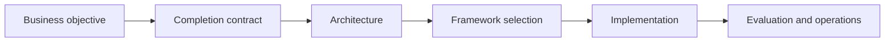

The order matters. Starting with a framework often leads teams to reshape the business problem around the framework's abstractions.

> **Architecture principle**
>
> Choose the simplest runtime that can enforce the required control, safety, state, and operational contracts.

A framework does not answer questions such as:

- What counts as task completion?
- Which actions require approval?
- Which data may cross tenant boundaries?
- How is evidence attached to claims?
- What happens after a partially successful write?
- When should the system stop, retry, replan, or escalate?
- Which state is authoritative?
- How will the team evaluate production trajectories?

Those are product and architecture decisions.

---

## 2. The five ecosystems have different design centers

The frameworks in this chapter overlap, but they are not interchangeable.

| Ecosystem | Primary design center | Strongest fit |
|---|---|---|
| OpenAI Agents SDK | Managed agent loop around agents, tools, handoffs, guardrails, sessions, and tracing | Applications using OpenAI models that want a compact production agent runtime |
| Google ADK | End-to-end agent development, graph and multi-agent workflows, context services, evaluation, and deployment | Multi-language teams, Google Cloud environments, and structured production workflows |
| Semantic Kernel / Microsoft Agent Framework | Enterprise integration, plugins, middleware, typed state, telemetry, and explicit workflows | Microsoft-centric enterprise applications and .NET-heavy teams |
| LlamaIndex | Context augmentation, retrieval, data connectors, agents, and event-driven workflows | Data-intensive agents and RAG-centric applications |
| DSPy | Declarative LM programs optimized against metrics | Teams treating prompts and reasoning strategies as learnable program components |

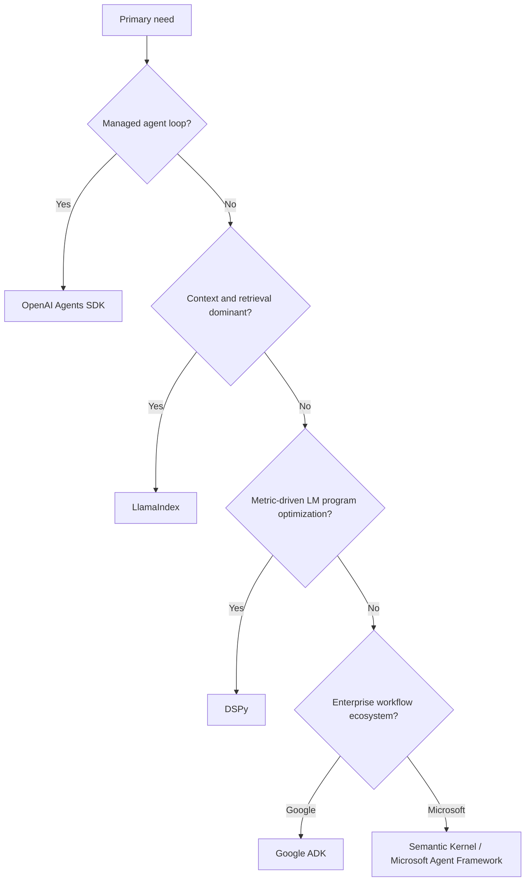

This decision tree is deliberately simplified. A real system may use one runtime for orchestration, LlamaIndex for retrieval, and DSPy to optimize a classifier or routing program.

---

## 3. Separate architecture layers before comparing SDKs

A production agent system normally has several layers.

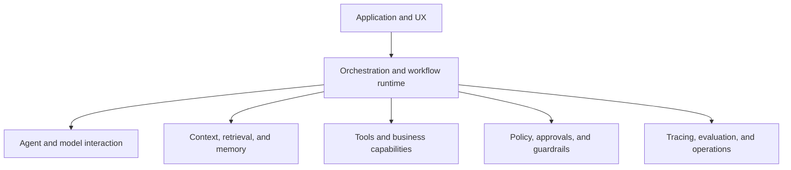

A framework may cover several layers, but one layer should have a clear owner.

### 3.1 Dangerous ownership overlap

A common integration mistake is nesting multiple autonomous loops.

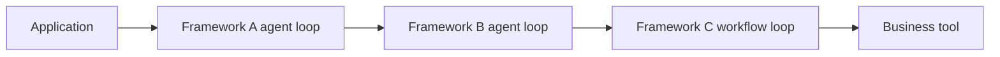

This can create:

- hidden retries;
- multiplied token and tool costs;
- conflicting stop conditions;
- duplicated memory;
- opaque tracing;
- difficult cancellation;
- unexpected side effects.

A safer composition assigns one runtime as the top-level owner.

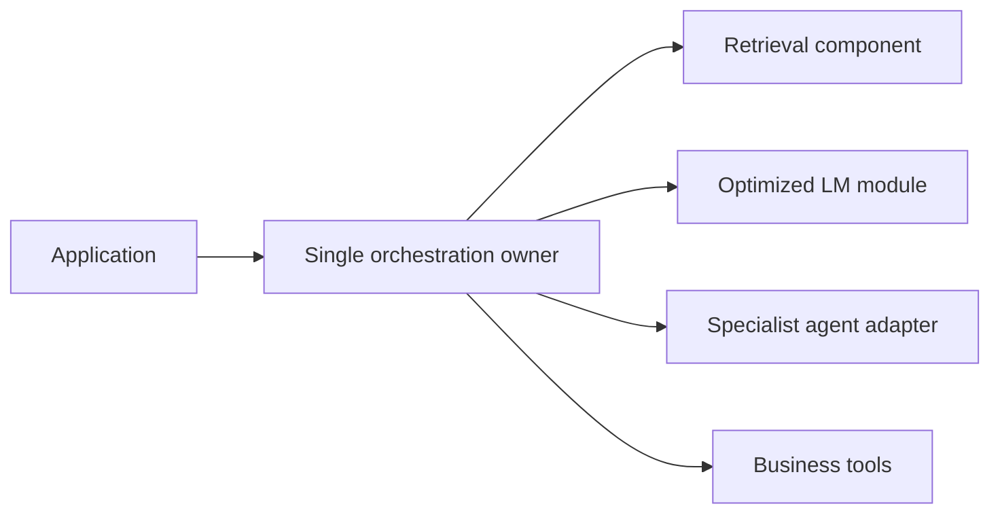

The subordinate components should expose bounded capabilities rather than independently owning the end-to-end task.

---

## 4. OpenAI Agents SDK

The OpenAI Agents SDK is a compact Python runtime for agentic applications. Its central abstractions are `Agent` and `Runner`. The runtime can manage model turns, function tools, guardrails, handoffs, sessions, and tracing. OpenAI models use the Responses API by default, while the SDK owns the higher-level orchestration loop.

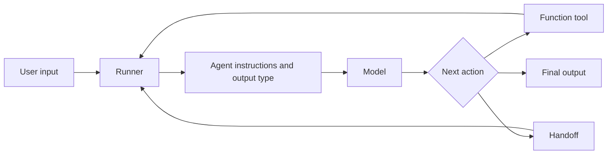

### 4.1 Core concepts

| Concept | Responsibility |
|---|---|
| Agent | Instructions, model, tools, handoffs, guardrails, and output type |
| Runner | Executes the loop until final output, exception, or configured limit |
| Function tool | Converts a Python capability into a model-callable tool |
| Handoff | Transfers control to a specialist agent and appears to the model as a tool |
| Guardrail | Validates input or output and can terminate the run |
| Session | Persists conversation history across runs |
| Trace | Records model generations, tools, handoffs, guardrails, and custom spans |

### 4.2 Minimal shape

```python
from agents import Agent, Runner, function_tool

@function_tool
def lookup_order(order_id: str) -> dict:
    """Return the current order state for an authorized order."""
    return {"order_id": order_id, "status": "shipped"}

agent = Agent(
    name="Order Support",
    instructions="Resolve order questions using approved tools.",
    tools=[lookup_order],
)

result = Runner.run_sync(agent, "Where is order O-1042?")
print(result.final_output)
```

### 4.3 Handoffs versus agents-as-tools

A handoff transfers control to another agent. An agent used as a tool performs a bounded subtask and returns its result to the original agent.

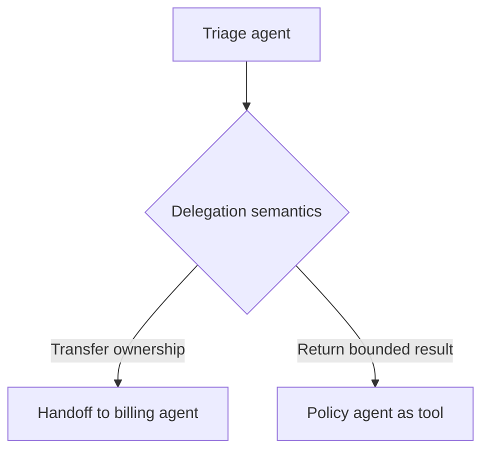

Use a handoff when the specialist should own the remainder of the conversation. Use an agent-as-tool pattern when the coordinator must retain control and combine several specialist results.

### 4.4 Guardrail placement matters

Input guardrails are associated with the first agent handling user input. A handoff target should not be assumed to re-run the original entry guardrails automatically. Tool-level authorization and policy checks must therefore remain inside the tool or control plane.

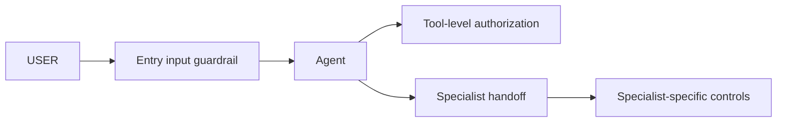

### 4.5 Sessions and tracing

Sessions automate conversation-history persistence. They are not a substitute for authoritative business state or governed long-term memory. Built-in tracing captures model calls, tools, handoffs, guardrails, and custom events, making the SDK attractive for teams that want an integrated debugging experience.

### 4.6 Best fit

Choose the OpenAI Agents SDK when:

- OpenAI models are a primary provider;
- the team wants a concise managed execution loop;
- handoffs and function tools map naturally to the workflow;
- built-in tracing is valuable;
- Python is acceptable;
- the application does not require a large independent workflow engine.

### 4.7 Watch-outs

- Provider-specific capabilities can increase switching cost.
- An SDK session is not the same as a business transaction store.
- Handoffs can create opaque control transfer if ownership is not explicit.
- Guardrails must be complemented by deterministic tool authorization.
- Teams should still own idempotency, approval binding, and reconciliation.

---

## 5. Google Agent Development Kit

Google ADK is an open-source, multi-language framework for building, evaluating, and deploying agents. Its current documentation emphasizes production agents, graph workflows, template workflows, multi-agent collaboration, sessions, state, memory, evaluation, observability, and deployment to several runtime targets.

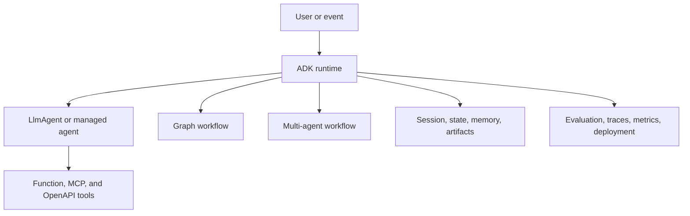

### 5.1 Minimal agent definition

```python
from google.adk import Agent

agent = Agent(
    name="researcher",
    model="gemini-flash-latest",
    instruction="Research approved sources and return cited findings.",
    tools=[search_approved_sources],
)
```

ADK supports Gemini directly and documents adapters for other model providers. It is available across Python, TypeScript, Go, Java, and Kotlin, which is unusual among agent frameworks.

### 5.2 Workflow choices

ADK exposes several workflow styles:

- graph workflows with explicit routes;
- collaborative multi-agent workflows;
- sequential templates;
- loop templates;
- parallel templates;
- dynamic routing.

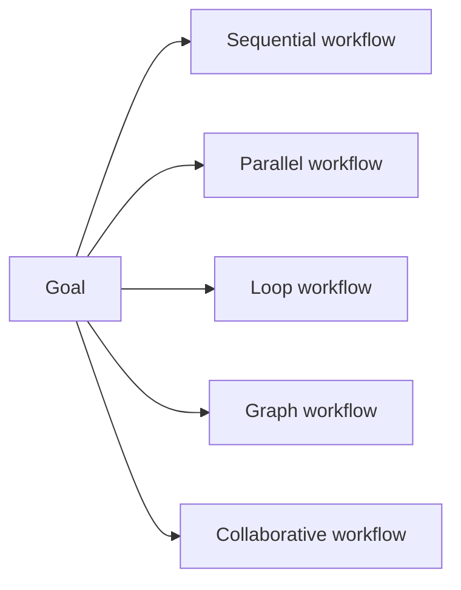

The choice should follow the workflow shape. A known approval process should be explicit. A research task may use parallel workers followed by synthesis. A bounded revision cycle may use a loop with a termination condition.

### 5.3 Session, state, and memory

ADK distinguishes:

- `Session`: one current conversation thread and its chronological events;
- `State`: temporary data stored inside that session;
- `Memory`: searchable information spanning sessions or external sources.

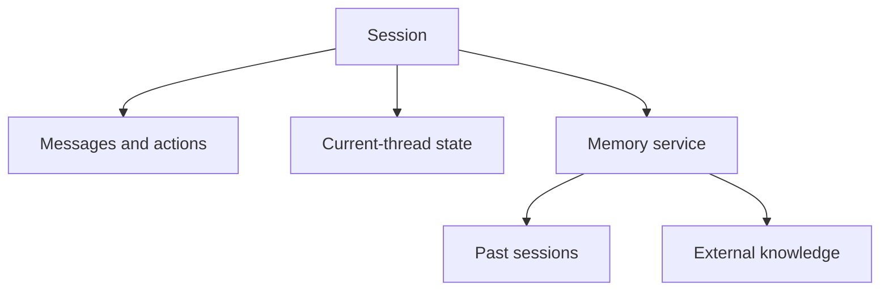

This distinction aligns well with the state model developed earlier in the handbook.

### 5.4 Context management

ADK's documentation presents context as a structured assembly of sessions, memory, tool outputs, and artifacts rather than an unlimited transcript. Context compression, event filtering, lazy artifact loading, and token tracking are first-class concerns.

### 5.5 Deployment and operations

ADK can be containerized and deployed independently or integrated with Google Cloud runtime options. Its documentation includes logging, metrics, traces, evaluation criteria, user simulation, environment simulation, and optimization.

### 5.6 Best fit

Choose ADK when:

- multiple implementation languages matter;
- Google Cloud is a strategic platform;
- the team needs an integrated development-to-deployment path;
- graph and template workflows are central;
- session, state, memory, artifact, evaluation, and observability primitives should live in one ecosystem;
- Gemini or Google grounding capabilities are important, while retaining model flexibility.

### 5.7 Watch-outs

- ADK 2.0 features can evolve rapidly.
- Broad platform scope can tempt teams to adopt more components than needed.
- Cloud convenience should not blur application-level identity and authorization requirements.
- Template workflows still require explicit termination and side-effect contracts.

---

## 6. Semantic Kernel and Microsoft Agent Framework

Semantic Kernel has long provided enterprise-oriented model integration, plugins, function calling, agent abstractions, memory integrations, and process or orchestration features across .NET, Python, and Java. In 2026, Microsoft introduced Microsoft Agent Framework as the direct successor that combines ideas from Semantic Kernel and AutoGen.

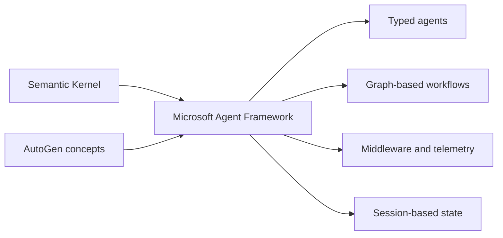

This transition is important. A new project should evaluate Microsoft Agent Framework alongside Semantic Kernel rather than assuming the older agent APIs are the long-term default.

### 6.1 Semantic Kernel design strengths

Semantic Kernel's core strengths include:

- plugins that expose native functions to models;
- dependency injection and enterprise application integration;
- support for several model providers;
- typed languages and strong .NET alignment;
- middleware, filters, and telemetry;
- agent threads and orchestration abstractions;
- process modeling that combines AI and conventional code.

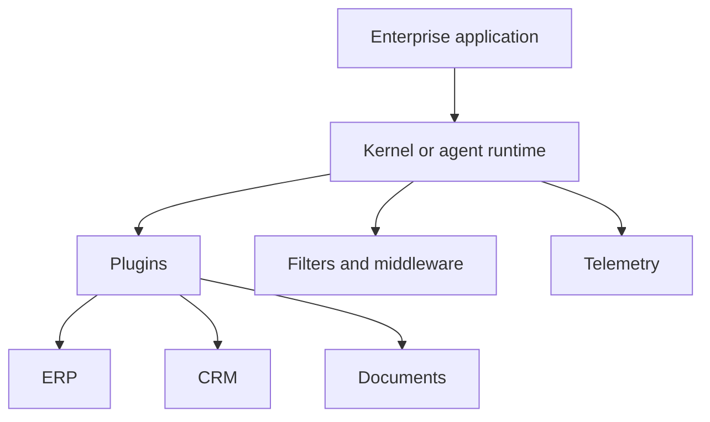

### 6.2 Plugins as enterprise capabilities

A Semantic Kernel plugin groups functions that an agent may call. The important engineering work is not the wrapper itself; it is the contract around identity, scope, validation, side effects, and observability.

```text
Plugin function
  = typed input schema
  + implementation
  + authorization policy
  + error contract
  + audit behavior
```

### 6.3 Experimental features

Microsoft documentation has marked some Semantic Kernel orchestration, process, and memory features as experimental. That means they may change significantly. Teams should isolate those APIs behind adapters and avoid persisting framework-specific serialized state as a long-lived business contract.

### 6.4 Microsoft Agent Framework

Microsoft Agent Framework is positioned as a successor that combines AutoGen's simpler agent abstractions with Semantic Kernel's enterprise capabilities. Current documentation highlights session-based state management, type safety, middleware, telemetry, and graph-based workflows.

For a greenfield Microsoft-stack project, compare:

1. stable Semantic Kernel integration features needed today;
2. Microsoft Agent Framework's newer agent and workflow abstractions;
3. migration cost and preview maturity;
4. language support and hosting requirements;
5. Azure identity, observability, and compliance integration.

### 6.5 Best fit

Choose this ecosystem when:

- .NET is a primary application platform;
- Azure and Microsoft identity services are central;
- enterprise plugins and dependency injection matter;
- type safety and middleware are important;
- the organization prefers Microsoft-supported integration patterns;
- teams can manage the transition from Semantic Kernel agent APIs to Microsoft Agent Framework.

### 6.6 Watch-outs

- Distinguish stable features from experimental orchestration features.
- Do not mix old and successor abstractions without a migration boundary.
- Keep business state outside framework-specific thread objects.
- Evaluate the Python and Java experiences separately from .NET rather than assuming complete parity.

---

## 7. LlamaIndex

LlamaIndex is centered on context augmentation: connecting language models and agents to enterprise data, documents, indexes, retrieval systems, and structured workflows. Its agent layer sits naturally beside its ingestion and retrieval capabilities.

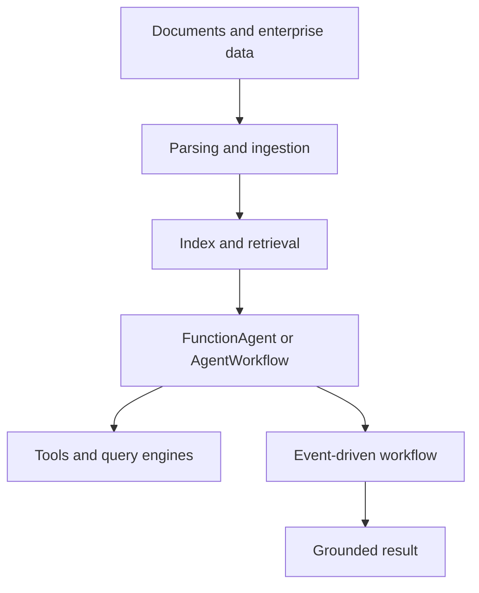

### 7.1 Agent abstractions

Current LlamaIndex documentation includes:

- `FunctionAgent` for function or tool-calling agents;
- `AgentWorkflow` for multi-agent coordination;
- `ReActAgent` and `CodeActAgent` for different execution strategies;
- custom workflows built from events and typed steps.

```python
from llama_index.core.agent.workflow import FunctionAgent

workflow = FunctionAgent(
    tools=[search_policy, calculate_refund],
    llm=llm,
    system_prompt="Resolve return questions using retrieved policy evidence.",
)

response = await workflow.run(
    user_msg="Can I return order O-1042?"
)
```

### 7.2 Event-driven workflows

A LlamaIndex workflow is event-driven and step-based. A step receives a typed event, performs work, and emits another event. Event types form the edges of the workflow.

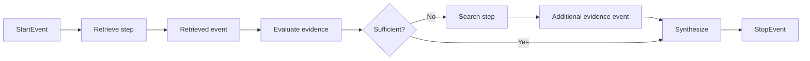

Branches can use ordinary Python conditions and different event types. Loops return an event handled by an earlier step. Concurrent work can emit batches or direct events through workflow context.

### 7.3 Type-first control

Typed event inputs and outputs enable workflow validation before execution. Validation can catch missing producers, missing consumers, accidental dead ends, and absent terminal events.

### 7.4 Best fit

Choose LlamaIndex when:

- document and data access dominate the system;
- RAG, parsing, indexing, retrieval, and agents need tight integration;
- the team wants event-driven workflow control;
- query engines and retrieval tools are first-class capabilities;
- provider flexibility matters;
- the application needs corrective or multi-stage retrieval patterns.

### 7.5 Watch-outs

- A data-centric framework does not eliminate business authorization requirements.
- Retrieval quality still requires independent evaluation.
- Avoid turning every query engine into an unconstrained agent tool.
- Keep durable business workflows separate from index implementation details.

---

## 8. DSPy

DSPy describes itself as a framework for programming rather than manually prompting language models. It uses declarative signatures, composable modules, metrics, examples, and optimizers to improve LM programs.

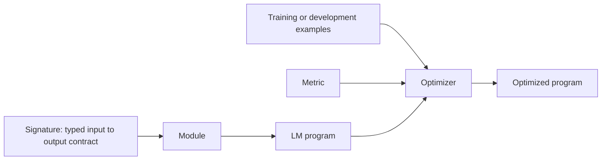

DSPy is not primarily a deployment runtime, session store, or business workflow engine. It is most valuable when an LM program's instructions, demonstrations, or reasoning strategy should be optimized against a measurable objective.

### 8.1 Signatures

A signature defines:

- input fields;
- output fields;
- field types;
- the task instruction.

```python
import dspy

class TriageTicket(dspy.Signature):
    """Classify a support ticket and explain the evidence."""

    ticket: str = dspy.InputField()
    category: str = dspy.OutputField()
    priority: str = dspy.OutputField()
    evidence: list[str] = dspy.OutputField()
```

The signature is the task contract. Modules decide how to execute it.

### 8.2 Modules

Modules can be composed with ordinary Python control flow. Common strategies include prediction, chain-of-thought-style modules, retrieval, and ReAct tool use.

```python
program = dspy.ReAct(
    TriageTicket,
    tools=[lookup_customer, search_policy],
    max_iters=6,
)
```

### 8.3 Optimizers

An optimizer searches for improved prompts, demonstrations, or program settings using examples and a metric.

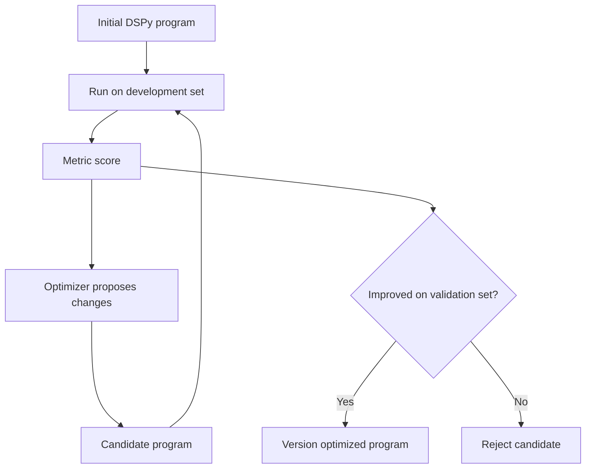

The important shift is from editing prompt strings by intuition to optimizing a typed LM program against a quality measure.

### 8.4 Best fit

Choose DSPy when:

- the task has a representative dataset and measurable metric;
- prompts, demonstrations, and reasoning strategies need systematic optimization;
- the team wants model-provider flexibility;
- LM behavior should be expressed as composable Python modules;
- a separate runtime already handles state, tools, safety, and deployment.

### 8.5 Watch-outs

- Optimization is only as good as the metric and examples.
- A benchmark can be overfit.
- DSPy does not replace authorization, transaction safety, durable state, or application operations.
- Optimized programs should be versioned and regression-tested like model artifacts.

---

## 9. Comparison matrix

The following matrix describes design emphasis, not absolute capability. Integrations and extensions can fill many gaps.

| Capability | OpenAI Agents SDK | Google ADK | Semantic Kernel / Agent Framework | LlamaIndex | DSPy |
|---|---|---|---|---|---|
| Managed agent loop | Strong | Strong | Strong or emerging, depending API | Strong | Module-specific |
| Function tools | Strong | Strong | Strong through plugins/functions | Strong | Supported through modules such as ReAct |
| Handoffs | Native | Multi-agent routing and workflows | Agent orchestration | AgentWorkflow and workflow patterns | Custom composition |
| Explicit graph workflows | Limited compared with graph-first engines | Strong in ADK 2.0 | Strong direction in Agent Framework | Strong event-driven workflows | Custom Python control flow |
| Session state | Built-in sessions | Session and state services | Session/thread abstractions | Workflow context and external stores | External responsibility |
| Long-term memory | Integrate externally | Memory service | Integrations; maturity varies | Strong data and retrieval ecosystem | External responsibility |
| Retrieval and indexing | Integrate through tools | Integrations and grounding | Plugins and connectors | Core design strength | Integrate as retrievers or tools |
| Guardrails | Native input/output guardrails | Safety and callbacks | Filters, middleware, policies | Application and workflow logic | Metrics and custom program logic |
| Tracing | Built in | Logging, metrics, traces | Enterprise telemetry | Integrations and observability tools | Tracing integrations |
| Evaluation | External plus tracing ecosystem | Built-in evaluation concepts | Enterprise evaluation integrations | Evaluation ecosystem | Core optimization workflow |
| Multi-language | Primarily Python SDK | Python, TypeScript, Go, Java, Kotlin | .NET, Python, Java; Agent Framework scope evolving | Primarily Python and TypeScript ecosystem | Primarily Python |
| Deployment emphasis | Application-managed with OpenAI services | Strong local-to-cloud path | Azure and enterprise application alignment | Data and agent deployment ecosystem | Usually embedded in another application |
| Main lock-in risk | Provider-specific runtime features | ADK runtime and cloud integrations | Microsoft application and workflow APIs | Index and workflow abstractions | Optimizer and module artifacts |

---

## 10. Framework selection scorecard

A framework decision should be evidence-based. Score each candidate against the actual workload.

| Dimension | Questions |
|---|---|
| Workflow control | Are routes known, dynamic, cyclic, or long-running? |
| Data intensity | How much ingestion, retrieval, reranking, and citation work is required? |
| State | Is there multi-turn context, durable workflow state, or cross-session memory? |
| Safety | Are there high-impact actions, approvals, tenant boundaries, or regulated data? |
| Provider strategy | Is one model provider strategic, or is portability mandatory? |
| Language and platform | Python, .NET, Java, TypeScript, Go, or mixed? |
| Operations | What tracing, replay, evaluation, deployment, and incident tools are required? |
| Optimization | Is there a labeled dataset and metric for improving LM behavior? |
| Ecosystem | Which cloud, identity, data, and observability platforms already exist? |
| Maturity | Which required features are stable, preview, or experimental? |
| Team capability | Can the team debug the runtime and own its operational consequences? |
| Exit cost | Can state, tools, policies, and tests survive a framework migration? |

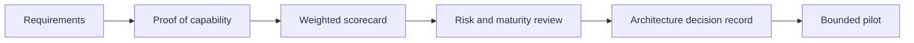

### 10.1 Proof-of-capability scenarios

Test every candidate against the same scenarios:

1. A read-only question requiring retrieval and citations.
2. A tool call with invalid arguments.
3. A high-impact write requiring exact-action approval.
4. A partial tool timeout.
5. A cancellation during a long-running task.
6. A retry after an ambiguous write outcome.
7. A multi-turn conversation resumed after process restart.
8. A tenant-isolation attack.
9. A prompt-injection attempt inside retrieved content.
10. A production trace reconstructed for incident review.

A framework that excels in a hello-world example may fail these operational tests.

---

## 11. Portability architecture

Framework portability does not mean abstracting every API behind the least common denominator. It means protecting the business contracts that must outlive the SDK.

### 11.1 Portable domain contracts

Keep these framework-neutral:

- request and response schemas;
- user and tenant identity;
- authorization decisions;
- business capabilities;
- approval records;
- idempotency keys;
- business state;
- evidence objects;
- evaluation datasets and metrics;
- audit events.

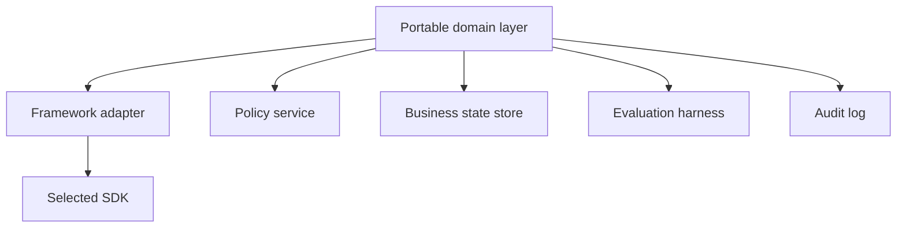

### 11.2 Framework-specific layer

The adapter may translate:

- domain tools into SDK tool definitions;
- domain messages into framework messages;
- domain state into session or thread state;
- framework events into normalized telemetry;
- framework handoffs into domain delegation events;
- framework outputs into validated response contracts.

### 11.3 Anti-corruption layer

An anti-corruption layer prevents framework terminology and data structures from leaking into the business domain.

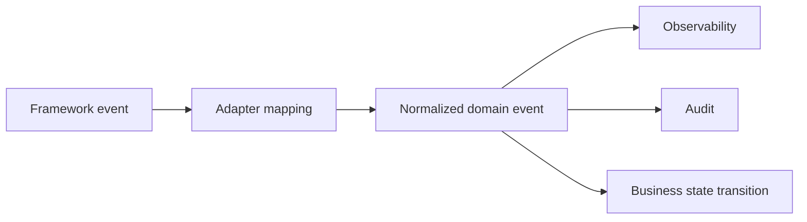

For example, a handoff, task transfer, agent delegation, or route change can all map to a normalized event:

```json
{
  "event_type": "delegation_started",
  "from_role": "triage",
  "to_role": "billing",
  "reason": "billing dispute",
  "correlation_id": "run-1042"
}
```

---

## 12. Combining frameworks safely

Using more than one framework can be rational when each owns a different concern.

### 12.1 Example: OpenAI Agents SDK plus LlamaIndex

```mermaid
flowchart LR
    USER --> OA[OpenAI agent runtime]
    OA --> TOOL[Retrieval tool adapter]
    TOOL --> LI[LlamaIndex query workflow]
    LI --> INDEX[Index and reranker]
    INDEX --> LI
    LI --> TOOL
    TOOL --> OA
    OA --> USER
```

The OpenAI runtime owns the conversation and tool loop. LlamaIndex owns retrieval and evidence assembly. LlamaIndex should not start an independent open-ended loop unless the top-level architecture explicitly permits it.

### 12.2 Example: ADK plus DSPy

```mermaid
flowchart LR
    ADK[ADK graph workflow] --> ROUTER[Optimized DSPy router]
    ROUTER --> DECISION[Typed route decision]
    DECISION --> ADK
    ADK --> AGENTS[Specialist agents]
```

DSPy optimizes the routing module against a dataset. ADK owns workflow state, tools, deployment, and operations.

### 12.3 Example: Microsoft enterprise runtime plus MCP

```mermaid
flowchart LR
    MAF[Microsoft Agent Framework] --> PLUGIN[Capability adapter]
    PLUGIN --> MCP[MCP client]
    MCP --> SERVER[MCP server]
    SERVER --> ERP[Enterprise system]
```

The enterprise runtime owns orchestration and identity. MCP standardizes access to a capability boundary.

### 12.4 Avoid double autonomy

```mermaid
flowchart TB
    TOP[Top-level runtime] --> SUB[Bounded component]
    SUB --> OK[Returns result]
    SUB -. Avoid .-> HIDDEN[Hidden autonomous loop with its own retries and handoffs]
```

Every nested component should publish:

- maximum execution time;
- maximum model calls;
- maximum tool calls;
- cancellation behavior;
- side-effect policy;
- error taxonomy;
- output schema.

---

## 13. Maturity and upgrade management

Framework evolution is a production risk.

### 13.1 Classify every dependency

| Classification | Treatment |
|---|---|
| Stable core | Pin version, regression-test, and monitor release notes |
| Preview | Use behind an adapter with a rollback path |
| Experimental | Keep out of critical paths or isolate aggressively |
| Deprecated | Plan migration and stop new adoption |
| Provider-specific extension | Record portability and exit cost |

### 13.2 Upgrade workflow

```mermaid
flowchart LR
    RELEASE[Framework release] --> REVIEW[Read migration and security notes]
    REVIEW --> BRANCH[Upgrade branch]
    BRANCH --> TEST[Contract and regression tests]
    TEST --> REPLAY[Trajectory replay]
    REPLAY --> CANARY[Canary deployment]
    CANARY --> DECIDE{Healthy?}
    DECIDE -- Yes --> ROLL[Progressive rollout]
    DECIDE -- No --> BACK[Rollback]
```

### 13.3 State compatibility

Do not assume a framework's serialized session or checkpoint remains compatible forever. Store a portable business snapshot and maintain a migration strategy.

```text
Portable business state
+ framework execution metadata
+ schema version
+ migration function
```

---

## 14. Security and governance considerations

Framework convenience can obscure powerful capabilities. Apply the same control model regardless of SDK.

### 14.1 Required controls

- Authenticate the user and propagate the correct identity.
- Authorize every data read and side effect.
- Use least-privilege tool scopes.
- Validate tool arguments independently of the model.
- Bind human approval to exact action arguments.
- Use idempotency keys for writes.
- Reconcile ambiguous outcomes.
- Isolate tenants, sessions, memory, and logs.
- Treat retrieved content and remote agents as untrusted.
- Redact sensitive telemetry.
- Maintain a framework-independent audit log.

```mermaid
flowchart LR
    MODEL[Model decision] --> POLICY[Deterministic policy]
    POLICY --> AUTH[Authorization]
    AUTH --> APPROVAL{Approval required?}
    APPROVAL -- Yes --> HUMAN[Human approval]
    APPROVAL -- No --> EXEC[Executor]
    HUMAN --> EXEC
    EXEC --> CONFIRM[Confirmation read]
    CONFIRM --> AUDIT[Audit event]
```

### 14.2 Framework guardrails are not the policy authority

SDK guardrails, callbacks, filters, and middleware are useful enforcement points. The policy source of truth should remain independent, testable, and callable outside the model loop.

---

## 15. Observability normalization

Each framework emits different telemetry. Normalize it into a common trace model.

| Normalized span | Framework examples |
|---|---|
| model_call | Model generation or response |
| tool_call | Function tool, plugin function, ADK tool, LlamaIndex tool |
| delegation | Handoff, route, agent transfer, team assignment |
| retrieval | Query engine, retriever, memory search |
| guardrail | Guardrail, callback, filter, policy check |
| state_write | Session update, checkpoint, context store write |
| approval | Human input or action confirmation |
| evaluation | Judge, metric, or optimizer score |

```mermaid
flowchart LR
    OA[OpenAI trace] --> N[Normalizer]
    ADK[ADK trace] --> N
    MS[Microsoft telemetry] --> N
    LI[LlamaIndex event] --> N
    DP[DSPy trace] --> N
    N --> OTEL[Common telemetry backend]
```

A common schema supports cross-framework dashboards and incident analysis.

---

## 16. Evaluation strategy

Framework evaluation should include more than developer experience.

### 16.1 Quality and reliability metrics

- task completion rate;
- structured-output validity;
- tool-selection accuracy;
- unauthorized-action rate;
- evidence coverage;
- citation correctness;
- retry and loop rate;
- human-escalation precision;
- recovery success;
- cancellation success;
- p50 and p95 latency;
- cost per verified successful task.

### 16.2 Developer and operational metrics

- lines of custom orchestration code;
- time to implement a new tool;
- debugging time per incident;
- percentage of framework-specific domain code;
- upgrade failure rate;
- testability without live model calls;
- quality of trace reconstruction;
- deployment and rollback time.

```mermaid
flowchart TB
    CAND[Candidate SDK] --> Q[Quality evaluation]
    CAND --> S[Safety evaluation]
    CAND --> O[Operational evaluation]
    CAND --> D[Developer evaluation]
    Q --> SCORE[Decision score]
    S --> SCORE
    O --> SCORE
    D --> SCORE
```

---

## 17. Worked selection example: enterprise support assistant

### 17.1 Requirements

The assistant must:

- answer product and policy questions with citations;
- read customer and order data;
- route billing and account issues to specialists;
- create draft actions only after approval;
- maintain multi-turn sessions;
- support cancellation and recovery;
- produce auditable traces;
- deploy in an existing cloud environment.

### 17.2 Candidate analysis

| Candidate | Strength | Main concern |
|---|---|---|
| OpenAI Agents SDK | Compact loop, tools, handoffs, sessions, tracing | Provider-specific runtime and Python focus |
| ADK | Broad workflow, context, evaluation, deployment, and language support | Platform breadth and evolving ADK 2.0 surface |
| Microsoft ecosystem | Enterprise identity, .NET integration, middleware, workflows | Transition between Semantic Kernel and Agent Framework |
| LlamaIndex | Strong retrieval and data integration | Needs another layer for some enterprise workflow concerns |
| DSPy | Can optimize triage, routing, or answer programs | Not an end-to-end runtime |

### 17.3 Reasonable architecture choices

**Option A: OpenAI-centered application**

- OpenAI Agents SDK owns conversation and handoffs.
- LlamaIndex owns retrieval.
- Domain services enforce authorization and writes.
- A portable audit and evaluation layer sits outside both.

**Option B: Google Cloud application**

- ADK graph workflow owns orchestration.
- Session and memory services manage context.
- MCP or OpenAPI tools expose business capabilities.
- DSPy optimizes the triage router offline.

**Option C: Microsoft enterprise application**

- Microsoft Agent Framework or stable Semantic Kernel features own runtime integration.
- Azure identity is propagated to domain services.
- Retrieval is implemented through enterprise search or LlamaIndex behind an adapter.
- High-impact writes use a separate approval service.

No option is universally best. The environment and non-functional requirements decide.

---

## 18. Common failure modes

### 18.1 Feature-list selection

**Failure:** The team selects the framework with the most features.

**Why it fails:** Many features are irrelevant, experimental, or overlap with existing platform services.

**Control:** Weight only required capabilities and operational evidence.

### 18.2 Framework leakage

**Failure:** Business services accept framework message, thread, or tool objects.

**Why it fails:** Migration requires rewriting the domain layer.

**Control:** Use domain schemas and adapters.

### 18.3 Hidden nested loops

**Failure:** One framework invokes another agent runtime as a tool without budgets.

**Why it fails:** Retries, cost, and cancellation become unpredictable.

**Control:** Publish bounded component contracts.

### 18.4 Session as database

**Failure:** The team treats conversational session state as authoritative order, payroll, or approval state.

**Why it fails:** Session state may be stale, duplicated, or lost.

**Control:** Keep business systems authoritative.

### 18.5 Experimental feature on the critical path

**Failure:** A preview orchestration API controls irreversible actions.

**Why it fails:** Upgrades or behavioral changes can break control guarantees.

**Control:** Isolate, pin, test, and maintain a fallback.

### 18.6 Optimizing the wrong metric

**Failure:** DSPy or another optimizer improves benchmark score while worsening safety or cost.

**Why it fails:** The metric does not represent the full product contract.

**Control:** Use hard safety constraints and a balanced validation suite.

### 18.7 Assuming built-in guardrails are sufficient

**Failure:** The team relies on model-facing guardrails for authorization.

**Why it fails:** Model controls are not a substitute for deterministic policy enforcement.

**Control:** Enforce authorization at the capability boundary.

---

## 19. Hands-on lab: framework decision and adapter design

### Goal

Select an implementation ecosystem for a project coordination agent and design a portable adapter boundary.

### Requirements

The agent must:

- read Jira or Azure DevOps tickets;
- scan Slack or Teams messages;
- summarize blockers with evidence;
- publish a status draft after approval;
- maintain session continuity;
- recover from a message-source outage;
- trace every tool call and approval;
- run in an enterprise cloud environment.

### Tasks

1. Create a weighted scorecard for the five ecosystems.
2. Mark every required feature as stable, preview, or external.
3. Choose one top-level runtime.
4. Decide whether LlamaIndex or DSPy adds distinct value.
5. Define portable schemas for `ProjectRequest`, `Blocker`, `Evidence`, `Approval`, and `StatusDraft`.
6. Define adapter methods for tools, state, events, and structured output.
7. Create tests for cancellation, partial failure, approval mismatch, and duplicate publication.
8. Record the decision in an architecture decision record.

### Extension

Implement two adapters against the same portable domain layer and compare:

- completion rate;
- p95 latency;
- framework-specific code percentage;
- trace quality;
- time required to add a new tool;
- upgrade and migration effort.

---

## 20. Production checklist

### Architecture

- [ ] The business completion contract is framework-neutral.
- [ ] One component owns the end-to-end execution loop.
- [ ] Nested agent components have explicit budgets and cancellation contracts.
- [ ] Business state is stored outside ephemeral framework sessions.
- [ ] Framework adapters isolate messages, tools, state, and events.

### Safety

- [ ] Tool authorization is deterministic.
- [ ] Write actions use idempotency keys.
- [ ] High-impact actions use exact-action approvals.
- [ ] Retrieved content and remote agents are treated as untrusted.
- [ ] Tenant identity propagates to every capability call.

### Reliability

- [ ] Retries have global budgets.
- [ ] Ambiguous writes have reconciliation paths.
- [ ] Long-running work supports cancellation.
- [ ] Framework session or checkpoint schemas are versioned.
- [ ] Preview features have rollback paths.

### Evaluation

- [ ] All candidates are tested on the same scenario suite.
- [ ] Quality, safety, latency, cost, and recovery are measured.
- [ ] Traces can be reconstructed outside the SDK UI.
- [ ] Upgrade tests include trajectory replay.
- [ ] Framework-specific benefits justify their operational cost.

### Operations

- [ ] Telemetry maps to a normalized schema.
- [ ] Prompt, model, framework, workflow, and policy versions are logged.
- [ ] Sensitive content is redacted.
- [ ] Canary and rollback procedures are documented.
- [ ] The team monitors release notes and deprecations.

---

## 21. Knowledge checks

1. Why should architecture precede framework selection?
2. What is the difference between an agent runtime and an LM-program optimization framework?
3. When should an OpenAI Agents SDK handoff be preferred over an agent-as-tool pattern?
4. How does ADK distinguish session, state, and memory?
5. Why should teams evaluate Microsoft Agent Framework when considering Semantic Kernel for a greenfield project?
6. Why is LlamaIndex especially suitable for data-intensive agents?
7. What problem do DSPy optimizers solve?
8. Why is nesting autonomous loops dangerous?
9. Which contracts should remain framework-neutral?
10. What is an anti-corruption layer?
11. Why is built-in SDK guardrail support insufficient for business authorization?
12. How should experimental framework features be treated?
13. What scenarios belong in a framework proof of capability?
14. How can observability be normalized across SDKs?
15. What does cost per verified successful task measure that token cost alone does not?

---

## 22. Interview questions

### Foundation

1. Compare OpenAI Agents SDK, Google ADK, Semantic Kernel, LlamaIndex, and DSPy by design center.
2. What is the difference between tools, handoffs, workflows, and modules?
3. Why should domain objects not depend on framework message types?
4. What is the role of a framework adapter?
5. How would you choose between a graph workflow and a managed agent loop?

### Senior engineering

6. Design a portable agent architecture that can switch from one runtime to another.
7. How would you prevent double retries when one agent SDK calls another agent runtime?
8. How would you migrate persistent sessions after a breaking framework upgrade?
9. How would you compare trace quality across frameworks?
10. How would you combine DSPy with a production workflow runtime?
11. How would you determine whether an experimental feature is acceptable for a critical workflow?
12. How would you enforce exact-action approval independently of the SDK?
13. How would you test cancellation and ambiguous write recovery?
14. How would you introduce LlamaIndex into an existing agent runtime without giving it control of the full loop?
15. How would you evaluate Microsoft Agent Framework versus Semantic Kernel for an existing .NET estate?

### Architecture leadership

16. When is framework lock-in an acceptable trade-off?
17. What evidence should appear in an architecture decision record for an agent SDK?
18. How would you govern five teams that each prefer a different agent framework?
19. Which capabilities should be standardized centrally and which should remain team-specific?
20. How would you plan a framework exit strategy before the first production release?

---

## 23. Key takeaways

1. Frameworks accelerate implementation but do not define the business or safety contract.
2. OpenAI Agents SDK is a compact managed runtime centered on agents, tools, handoffs, sessions, guardrails, and tracing.
3. Google ADK offers a broad multi-language environment spanning agents, graph and template workflows, context services, evaluation, observability, and deployment.
4. Semantic Kernel remains important for enterprise plugins and integration, while Microsoft Agent Framework is the strategic successor to evaluate for new Microsoft-centric systems.
5. LlamaIndex is strongest when context augmentation, retrieval, data connectors, and event-driven workflows dominate.
6. DSPy is strongest when LM programs should be optimized against representative examples and metrics.
7. One runtime should own the top-level loop; subordinate frameworks should expose bounded components.
8. Portable domain contracts, deterministic policy, business state, evaluation data, and audit events reduce lock-in.
9. Proof-of-capability testing should include failures, approvals, cancellation, recovery, security, and operations—not only successful demos.
10. Framework maturity, versioning, and migration are ongoing production concerns.

---

## 24. Official references

- OpenAI Agents SDK documentation: <https://openai.github.io/openai-agents-python/>
- OpenAI Agents SDK agents, handoffs, sessions, guardrails, and tracing guides: <https://openai.github.io/openai-agents-python/agents/>
- Google Agent Development Kit documentation: <https://adk.dev/>
- Google ADK sessions, state, and memory: <https://adk.dev/sessions/>
- Microsoft Semantic Kernel Agent Framework: <https://learn.microsoft.com/en-us/semantic-kernel/frameworks/agent/>
- Microsoft Agent Framework overview: <https://learn.microsoft.com/en-us/agent-framework/overview/>
- LlamaIndex agent documentation: <https://developers.llamaindex.ai/python/framework/understanding/agent/>
- LlamaIndex Workflows documentation: <https://developers.llamaindex.ai/python/llamaagents/workflows/>
- DSPy documentation: <https://dspy.ai/>
