# Chapter 42 - Evaluation and Observability Frameworks

> **Source basis:** The board treats evaluation as a first-class part of the AI lifecycle. It highlights factual consistency, fluency, instruction adherence, bias and toxicity, latency, throughput, tool use, responsible AI, observability, auditability, retry success, escalation, and user trust [Board, pp. 10-11, 18, 22-33, 47]. This chapter preserves those concerns and maps them to four current ecosystems: Ragas, DeepEval, LangSmith, and Phoenix. **Framework snapshot:** 4 August 2026. APIs and hosted-product capabilities change frequently; verify the official documentation before adopting a specific integration. All product-specific material is **Supplementary**.

---

## Learning objectives

By the end of this chapter, you should be able to:

1. Distinguish evaluation from observability, monitoring, testing, and analytics.
2. Design a framework-neutral evaluation contract for RAG, agents, and multi-turn systems.
3. Explain the design center of Ragas, DeepEval, LangSmith, and Phoenix.
4. Select metrics for retrieval, generation, tool use, planning, safety, latency, and cost.
5. Build offline datasets from curated examples, production traces, and adversarial scenarios.
6. Use deterministic checks, human review, and model-based judges together.
7. Evaluate final answers, intermediate steps, and full agent trajectories.
8. Instrument an AI system with traces and spans that preserve prompts, tools, retrieval, state, and versions.
9. Connect online failures back to offline regression datasets.
10. Compare managed platforms with local-first and open-source alternatives.
11. Avoid evaluator drift, judge bias, benchmark overfitting, and privacy leakage.
12. Build a portable evaluation and observability layer that reduces platform lock-in.
13. Define release gates based on quality, safety, latency, cost, and operational reliability.
14. Implement a dependency-free evaluation harness that exports normalized payloads for multiple platforms.

---

## 1. Evaluation and observability answer different questions

Evaluation and observability are related, but they are not interchangeable.

- **Evaluation** asks whether the system behaved well according to a defined contract.
- **Observability** asks what happened inside the system and why.
- **Monitoring** asks whether production behavior is crossing operational or quality thresholds.
- **Testing** asks whether known requirements hold under controlled conditions.
- **Analytics** asks how users, features, and business outcomes behave over time.

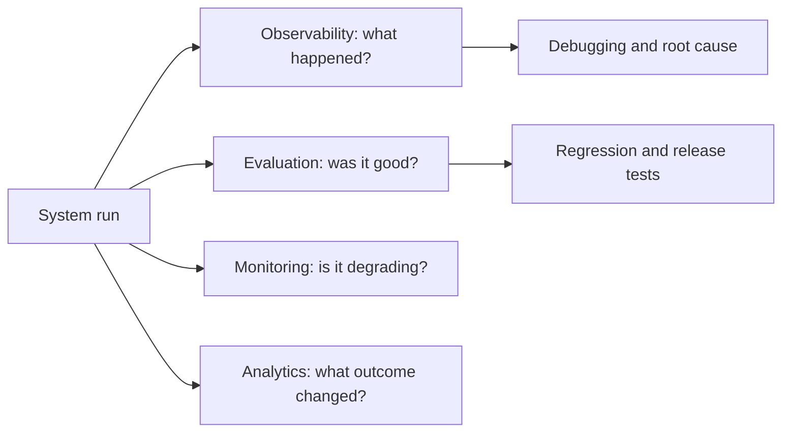

A trace can show that an agent called the wrong tool. An evaluator can score that tool choice as incorrect. A monitor can alert when tool correctness falls below a threshold. Product analytics can reveal that users then abandon the workflow.

> **Engineering principle**
>
> Traces provide evidence. Evaluators convert evidence into judgments. Release gates convert judgments into decisions.

---

## 2. The evaluation lifecycle

A mature evaluation system is not a one-time benchmark. It is a closed learning loop.

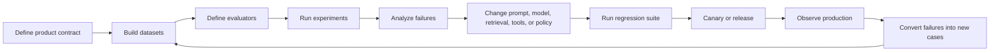

The board's weak-output decision tree already implies this logic:

- unclear instruction -> improve the prompt;
- missing facts -> improve retrieval;
- stable domain-specific behavior -> consider fine-tuning;
- unsafe or untrustworthy behavior -> strengthen policy, evaluation, and control.

Evaluation tells the team which lever is failing. Without that diagnosis, optimization becomes guesswork.

---

## 3. Start with a system contract, not a metric library

A tool can provide hundreds of metrics, but a product still needs a clear definition of success.

A useful system contract includes:

| Contract dimension | Example question |
|---|---|
| Task completion | Did the agent resolve the user goal? |
| Correctness | Is the answer factually correct? |
| Grounding | Are claims supported by approved evidence? |
| Tool use | Were the correct tools selected and called correctly? |
| Policy | Were permissions and business rules respected? |
| Safety | Did the system avoid prohibited outputs or actions? |
| User control | Could the user review, interrupt, edit, or escalate? |
| Performance | Was the result delivered within latency and cost budgets? |
| Reliability | Did retries, fallbacks, and recovery behave correctly? |
| Fairness | Did quality and treatment remain acceptable across groups? |

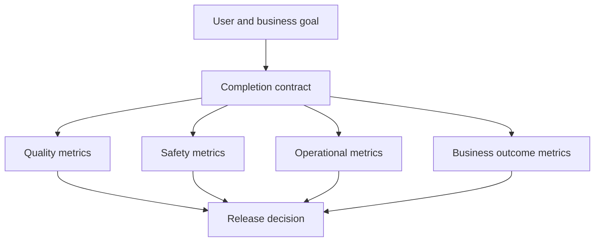

A high answer-relevancy score does not compensate for unauthorized data access. A safe answer that never completes the task is also not successful. Production evaluation therefore needs both weighted quality scores and hard constraints.

---

## 4. A framework-neutral data model

Before selecting a platform, define canonical data structures owned by your application.

### 4.1 Evaluation case

```json
{
  "case_id": "return-policy-001",
  "input": "Can I return an unopened cartridge after 20 days?",
  "reference_output": "Eligible unopened cartridges may be returned within 30 days.",
  "expected_tools": ["lookup_order", "retrieve_return_policy"],
  "expected_evidence": ["30-day policy", "order eligibility"],
  "tags": ["rag", "policy", "returns"]
}
```

### 4.2 Execution trace

```json
{
  "run_id": "run-2031",
  "version": "agent-v2.4",
  "input": "Can I return an unopened cartridge after 20 days?",
  "output": "The item is within the 30-day window, subject to eligibility.",
  "retrieval": ["policy-17", "order-O-2001"],
  "tool_calls": ["lookup_order", "retrieve_return_policy"],
  "plan_steps": ["lookup_order", "retrieve_policy", "compose_answer"],
  "latency_ms": 1850,
  "cost_usd": 0.024
}
```

### 4.3 Evaluation result

```json
{
  "run_id": "run-2031",
  "scores": {
    "correctness": 0.93,
    "faithfulness": 1.0,
    "tool_correctness": 1.0,
    "plan_adherence": 1.0
  },
  "hard_failures": [],
  "release_gate": "pass"
}
```

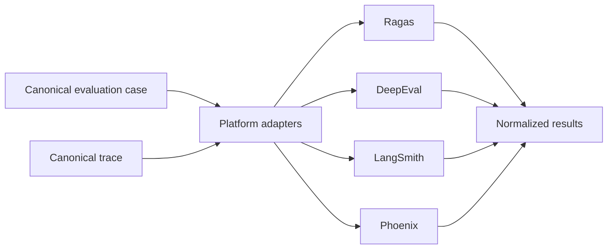

Owning this contract keeps datasets, release logic, and business metrics portable even when platform APIs change.

---

## 5. Ragas: evaluation-first workflows for RAG and agents

Ragas is designed around evaluation datasets, experiments, and metrics for AI applications. It is particularly well known for RAG evaluation, while current documentation also includes metrics for agentic and multi-turn workflows.

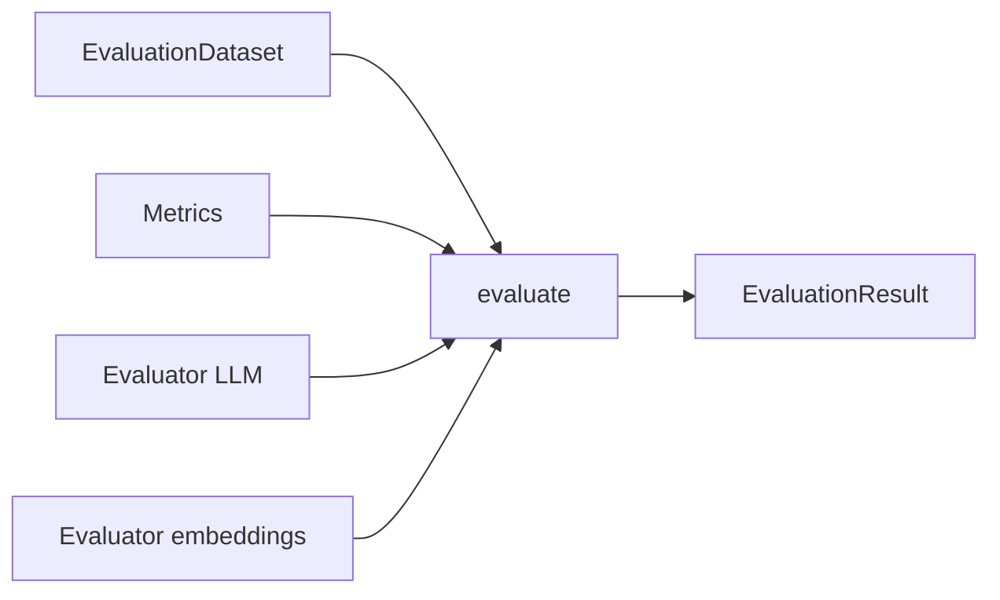

### 5.1 Core design center

Ragas is a good fit when the team wants to:

- evaluate retrieval and grounded generation;
- compare RAG pipeline versions;
- score single-turn and multi-turn interactions;
- build custom metrics;
- generate or manage test data;
- integrate evaluation with LangChain, LlamaIndex, or custom applications;
- run experiments without adopting a full production observability platform.

### 5.2 Typical RAG dimensions

Common RAG evaluation dimensions include:

| Dimension | Question |
|---|---|
| Context precision | How much retrieved context was actually relevant? |
| Context recall | Did retrieval include the evidence required for the answer? |
| Faithfulness | Is the answer supported by the retrieved context? |
| Answer relevance | Does the answer directly address the question? |
| Factual correctness | Does the answer align with a reference answer or facts? |
| Citation correctness | Do citations support the claims they are attached to? |

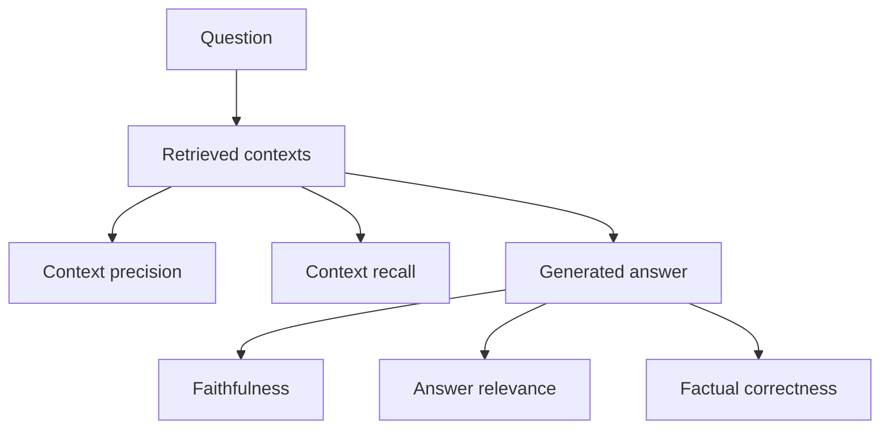

### 5.3 Strengths

- Focused mental model for evaluation.
- Strong vocabulary for RAG quality.
- Supports dataset, metric, and experiment concepts.
- Can be used with custom evaluator models and embeddings.
- Suitable for offline comparison and regression testing.
- Can evaluate single-turn and multi-turn samples.

### 5.4 Trade-offs

- Many semantic metrics depend on model-based judges.
- Scores can shift when evaluator models or prompts change.
- Production tracing and incident operations require additional infrastructure.
- Metric names can appear objective while still containing judgment assumptions.
- Teams still need deterministic policy and authorization checks outside the evaluator.

### 5.5 Best use

Use Ragas when retrieval quality and grounded generation are central and the team wants a focused, code-centric evaluation layer. Pair it with a trace platform when production root-cause analysis is required.

---

## 6. DeepEval: test-oriented evaluation for LLM and agent systems

DeepEval presents evaluation in a software-testing style. A typical workflow uses test cases, metrics, datasets, and test runs. Its documentation emphasizes local-first execution, end-to-end and component-level evaluation, tracing for agents, synthetic data, custom metrics, and CI/CD integration.

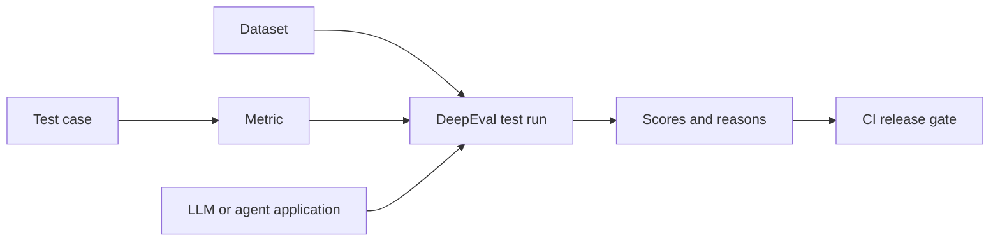

### 6.1 Core design center

DeepEval is a good fit when the team wants to:

- write evaluation tests alongside application code;
- run evaluations locally and in CI;
- use predefined RAG, agent, tool-use, conversational, safety, and multimodal metrics;
- add trace-based plan or trajectory metrics;
- create custom metrics with deterministic or model-based logic;
- generate synthetic edge cases;
- optionally send results to a shared platform for dashboards and monitoring.

### 6.2 Test-case anatomy

An evaluation case may include:

- input;
- actual output;
- expected output;
- retrieval context;
- expected tools;
- tools actually called;
- conversational turns;
- trace components;
- metadata and tags.

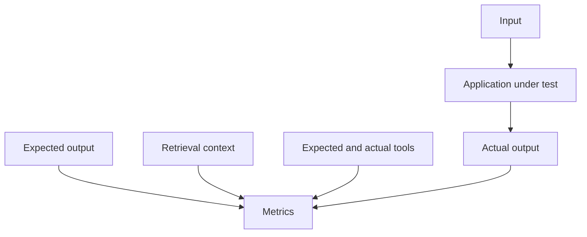

### 6.3 Agentic metrics

For agents, final-answer evaluation is not enough. Relevant dimensions include:

- plan quality;
- plan adherence;
- tool correctness;
- task completion;
- argument correctness;
- unnecessary tool calls;
- safety violations;
- conversation quality;
- recovery behavior.

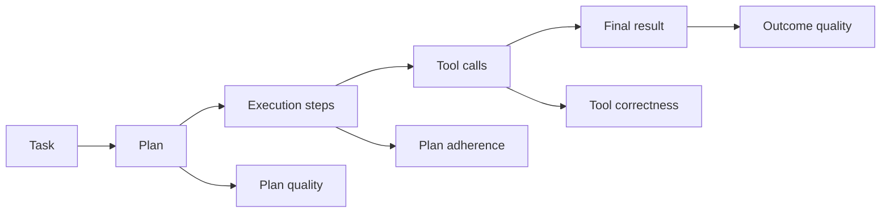

### 6.4 Strengths

- Familiar test-run model for engineering teams.
- Local-first and CI-friendly.
- Broad metric coverage across RAG, agents, conversation, safety, and multimodal systems.
- Supports custom metrics and structured scoring.
- Trace-aware evaluation can target internal components.
- Good fit for regression suites and developer workflows.

### 6.5 Trade-offs

- A large metric catalog can encourage metric accumulation without a product contract.
- Model-based metrics need calibration and cost controls.
- Shared production observability may depend on an additional hosted platform.
- Teams must distinguish core, community, preview, and custom metrics by maturity.
- Test success can still diverge from user and business outcomes.

### 6.6 Best use

Use DeepEval when evaluation should behave like automated software testing, especially when agent traces, CI integration, custom metrics, and local execution are priorities.

---

## 7. LangSmith: integrated tracing, datasets, experiments, and online evaluation

LangSmith combines observability and evaluation around traces, datasets, experiments, evaluators, projects, and production runs. Its documentation distinguishes offline evaluation on datasets from online evaluation over production runs and threads.

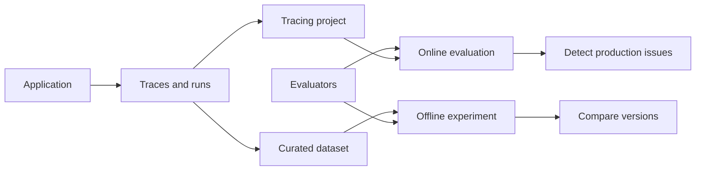

### 7.1 Core design center

LangSmith is a good fit when the team wants to:

- trace LLM applications and agents;
- inspect prompts, model calls, tools, and intermediate steps;
- curate datasets from traces;
- version datasets and compare experiments;
- use code, human, pairwise, and model-based evaluators;
- run offline regression tests;
- attach online evaluators to production traffic;
- evaluate multi-turn threads;
- connect prompt engineering, evaluation, and observability in one environment.

### 7.2 Offline and online evaluation

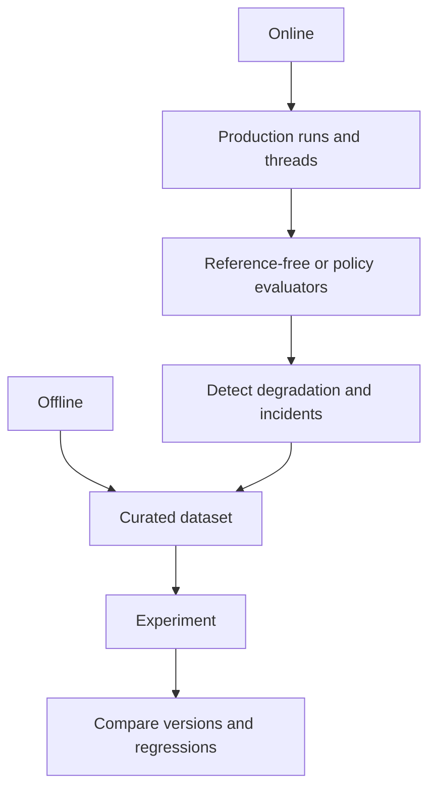

The most valuable pattern is the feedback loop:

1. production traces reveal a failure;
2. the trace is added to a dataset;
3. the team creates a reference or expected behavior;
4. a fix is tested offline;
5. the new version is released;
6. online evaluation confirms whether the issue improves.

### 7.3 Dataset and experiment concepts

- A **dataset** contains examples.
- An **example** contains inputs, optional reference outputs, and metadata.
- An **experiment** records one application version's outputs, scores, and traces over a dataset.
- A **run** is one execution in production or testing.
- A **thread** groups related runs in a multi-turn conversation.
- An **evaluator** scores examples, runs, or threads.

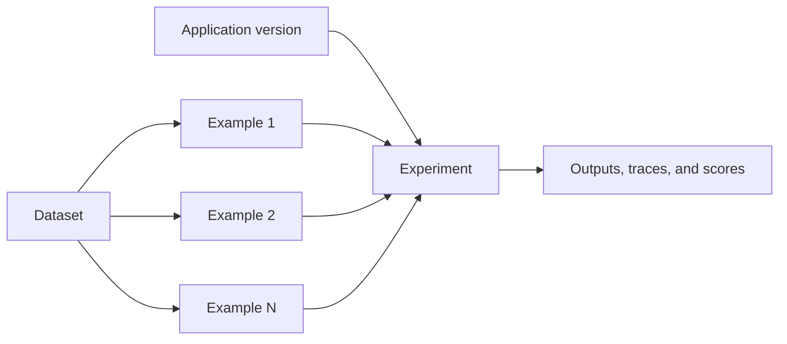

### 7.4 Strengths

- Tight integration between traces, datasets, evaluation, and production monitoring.
- Strong experiment-comparison workflow.
- Dataset versioning and trace-to-dataset curation.
- Supports offline and online evaluation.
- Useful for LangChain and LangGraph, while also supporting other applications and OpenTelemetry-based workflows.
- Good UI for debugging individual trajectories.

### 7.5 Trade-offs

- Platform adoption introduces hosted-service, retention, governance, and cost considerations.
- Teams can become dependent on platform-specific run and evaluator schemas.
- High-volume tracing requires sampling and data-governance discipline.
- Online model judges can create significant evaluator cost.
- A convenient UI does not replace canonical data export and long-term audit storage.

### 7.6 Best use

Use LangSmith when the team wants one integrated platform for agent tracing, dataset curation, experiment comparison, regression evaluation, and online quality monitoring.

---

## 8. Phoenix: OpenTelemetry-oriented AI observability and evaluation

Phoenix is an open-source AI observability platform built around tracing, evaluation, prompt iteration, experiments, and dataset curation. It uses OpenTelemetry and the OpenInference semantic conventions to represent LLM, retrieval, tool, and agent spans.

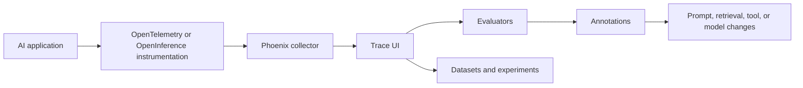

### 8.1 Core design center

Phoenix is a good fit when the team wants to:

- instrument LLM and agent systems with OpenTelemetry-compatible traces;
- inspect model, retrieval, embedding, tool, and workflow spans;
- run open-source or self-hosted observability infrastructure;
- attach evaluations and annotations to traces;
- organize traces by project and multi-turn sessions;
- perform experiments and dataset curation;
- integrate with diverse frameworks through OpenInference instrumentation.

### 8.2 Trace anatomy

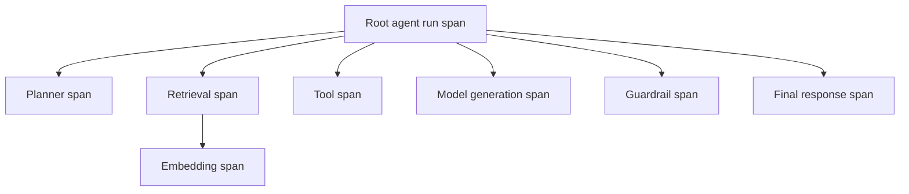

Each span should carry enough metadata to reconstruct the run:

- trace and span identifiers;
- parent-child relationships;
- application, prompt, model, policy, and tool versions;
- input and output references;
- latency and token usage;
- error status;
- retrieval documents and scores;
- tool name and arguments, with redaction;
- session and tenant identifiers;
- evaluator annotations.

### 8.3 Sessions and multi-turn systems

Phoenix sessions group related traces for conversational systems. This supports conversation-level analysis rather than treating every turn as independent.

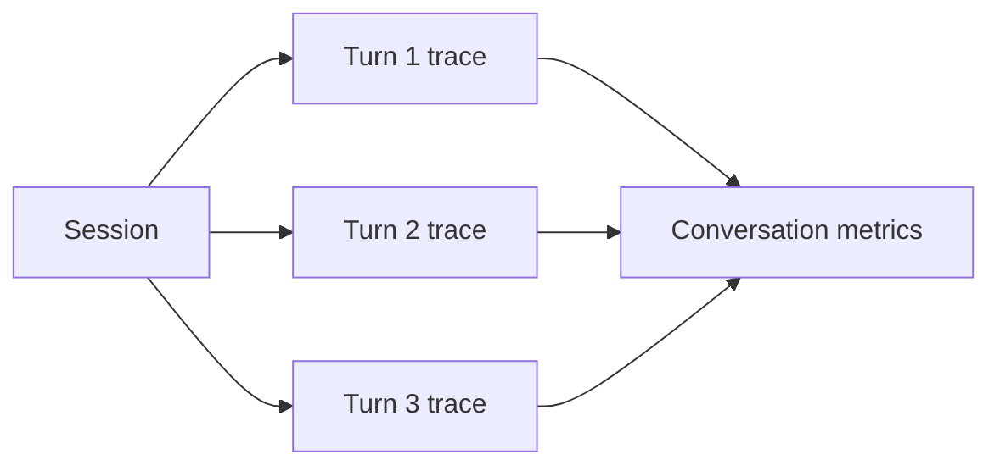

### 8.4 Strengths

- Open-source deployment option.
- OpenTelemetry-oriented architecture.
- Strong trace-level visibility for heterogeneous stacks.
- Framework-neutral instrumentation through OpenInference.
- Evaluation, experiments, annotations, and dataset workflows integrated with traces.
- Useful when teams want control over data location and infrastructure.

### 8.5 Trade-offs

- Self-hosting transfers upgrade, scaling, backup, security, and retention responsibilities to the team.
- Instrumentation quality depends on consistent semantic attributes.
- Open standards do not automatically produce useful product metrics.
- Teams still need a release-gate and dataset-governance layer.
- Phoenix and Arize's managed offerings are distinct products and should not be treated as interchangeable APIs.

### 8.6 Best use

Use Phoenix when open-source deployment, OpenTelemetry interoperability, heterogeneous-framework tracing, and trace-centered debugging are primary concerns.

---

## 9. Comparison matrix

| Dimension | Ragas | DeepEval | LangSmith | Phoenix |
|---|---|---|---|---|
| Primary design center | Evaluation metrics and experiments | Evaluation as software testing | Integrated tracing, datasets, experiments, and online evaluation | Open-source AI observability and evaluation |
| Strongest fit | RAG and grounded generation | CI, local tests, agents, broad metric coverage | End-to-end managed evaluation and observability | OpenTelemetry-centric and self-hosted observability |
| Offline evaluation | Strong | Strong | Strong | Strong |
| Online evaluation | Requires integration | Via platform/integration | Native platform workflow | Trace annotations and production workflows |
| Trace-first | Limited | Optional tracing | Strong | Strong |
| RAG metrics | Strong | Strong | Custom and prebuilt evaluator workflows | Prebuilt and custom evaluator workflows |
| Agent trajectory metrics | Available and growing | Strong trace-aware options | Strong run/trajectory evaluation | Strong trace and span evaluation |
| Dataset management | Built in | Built in | Strong and versioned | Integrated with experiments |
| CI orientation | Good | Very strong | Strong | Good with custom pipelines |
| Self-hosting | Library-based | Local-first library | Cloud, hybrid, or self-hosted options | Open-source self-hosting |
| OpenTelemetry orientation | Integration-dependent | Integration-dependent | Supported | Core design choice |
| UI and collaborative workflow | Limited by deployment choices | Platform-dependent | Strong managed UI | Strong trace UI |

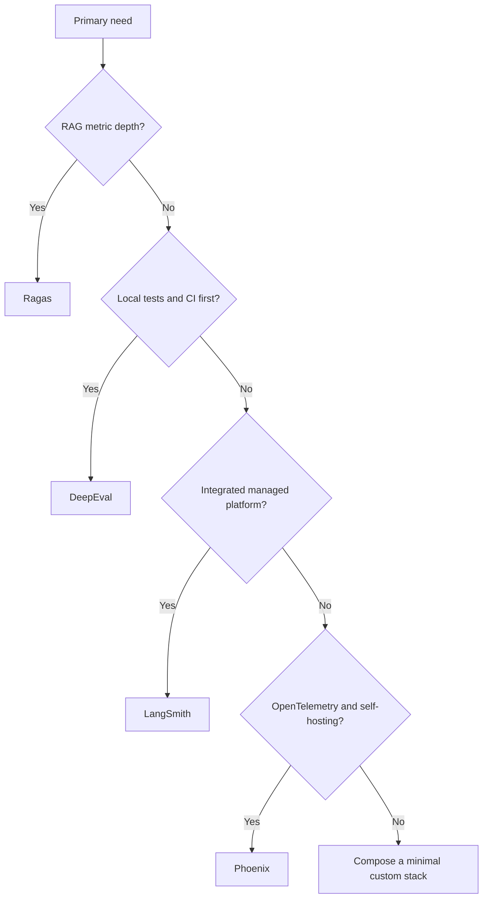

A team may use more than one. The key is to avoid duplicating datasets, judge prompts, and release logic without a canonical contract.

---

## 10. Metric architecture: evaluate the whole system

Production AI systems need metrics at several levels.

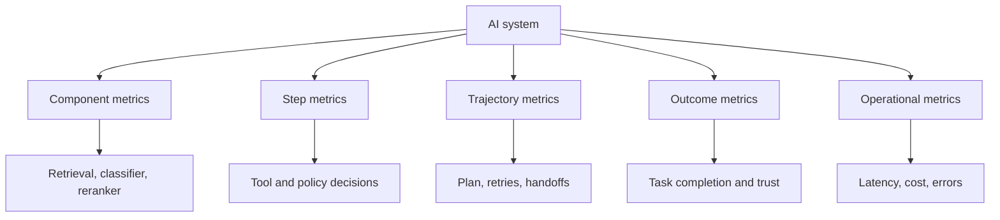

### 10.1 Component metrics

- retrieval recall and precision;
- reranker quality;
- classification accuracy;
- entity extraction accuracy;
- structured-output validity;
- tool argument validation;
- policy decision accuracy.

### 10.2 Step metrics

- correct route selected;
- correct tool selected;
- correct arguments generated;
- permission check performed;
- evidence attached;
- approval requested when needed.

### 10.3 Trajectory metrics

- plan quality;
- plan adherence;
- unnecessary steps;
- repeated tool calls;
- delegation depth;
- progress per iteration;
- retry efficiency;
- termination correctness;
- recovery success.

### 10.4 Outcome metrics

- task completion;
- answer correctness;
- user effort;
- escalation appropriateness;
- action success;
- business outcome;
- satisfaction and trust.

### 10.5 Operational metrics

- p50, p95, and p99 latency;
- time to first token or first progress;
- token and model cost;
- tool error rate;
- evaluator cost;
- queue delay;
- trace completeness;
- incident rate.

---

## 11. Build datasets that represent reality

A benchmark is only as useful as its coverage.

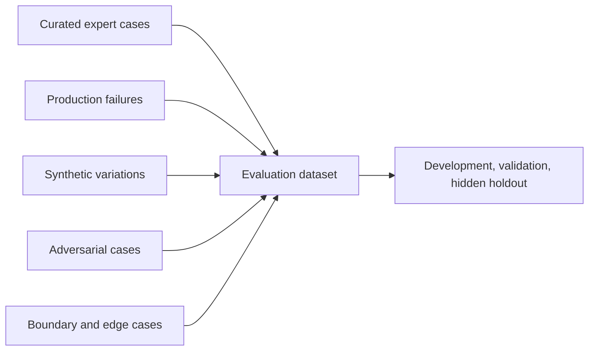

### 11.1 Dataset sources

1. **Expert-curated cases** establish correct behavior.
2. **Historical production traces** represent real language and operational conditions.
3. **Synthetic generation** expands rare combinations and edge cases.
4. **Adversarial cases** test prompt injection, data leakage, and unsafe actions.
5. **Boundary cases** test empty input, conflicting instructions, extreme values, source outages, and ambiguous requests.
6. **Counterfactual cases** test whether irrelevant demographic or stylistic changes alter treatment.

### 11.2 Required metadata

Each case should include:

- source and creation method;
- owner and reviewer;
- expected output or rubric;
- expected tools and prohibited tools;
- required evidence;
- policy and risk category;
- language, channel, and user segment;
- difficulty and edge-case tags;
- dataset version;
- expiry or review date.

### 11.3 Avoid benchmark overfitting

Do not repeatedly tune against one visible dataset. Maintain:

- development set;
- validation set;
- hidden holdout;
- production backtest set;
- adversarial set;
- freshness rotation.

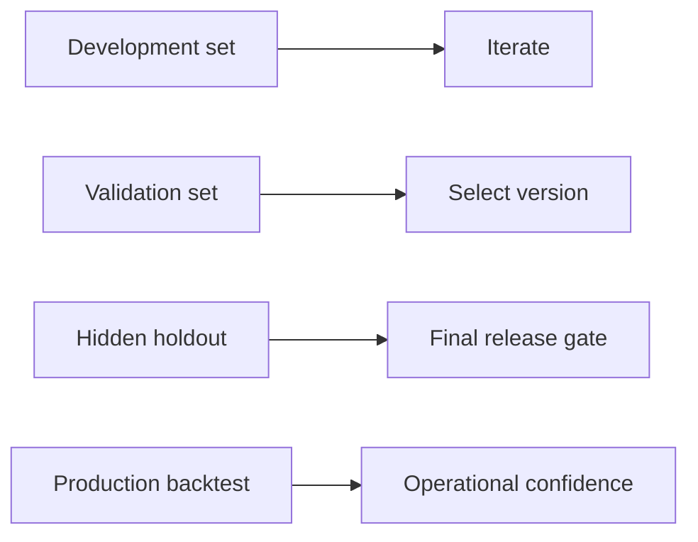

---

## 12. Deterministic checks, human review, and model judges

No single evaluator is sufficient.

### 12.1 Deterministic evaluators

Use code when the requirement is exact:

- JSON schema validity;
- required field presence;
- allowed label set;
- tool name and argument validation;
- citation format;
- policy allowlist;
- permission scope;
- latency and cost budgets;
- duplicate action detection.

### 12.2 Human evaluators

Use subject-matter experts when:

- correctness depends on domain judgment;
- quality has nuanced trade-offs;
- fairness or user experience is being assessed;
- a reference answer is difficult to define;
- the evaluator itself needs calibration.

### 12.3 Model-based judges

Use model judges for scalable semantic evaluation, but treat them as measurement instruments that require validation.

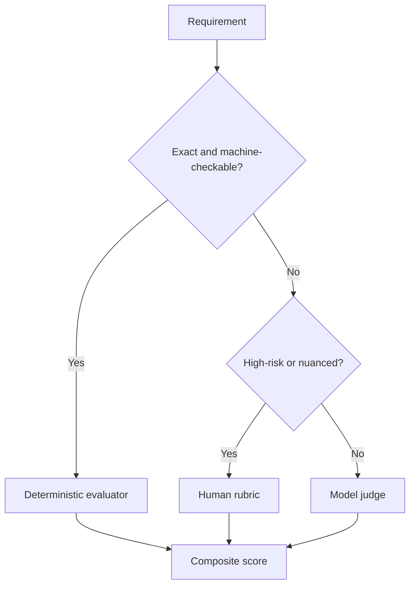

### 12.4 Judge calibration

Evaluate the evaluator by measuring:

- agreement with expert reviewers;
- consistency across repeated runs;
- sensitivity to irrelevant formatting;
- position and verbosity bias;
- model-family bias;
- score distribution and threshold stability;
- false-pass and false-fail rates.

Store the evaluator model, prompt, temperature, rubric, and version with every score.

---

## 13. RAG evaluation should separate retrieval and generation

A poor answer may originate in retrieval or generation. Scoring only the final output hides the failure source.

```mermaid
flowchart LR
    Q[Question] --> RET[Retriever]
    RET --> DOCS[Contexts]
    DOCS --> GEN[Generator]
    GEN --> ANSWER[Answer]
    RET --> RM[Retrieval metrics]
    GEN --> GM[Generation metrics]
    ANSWER --> EM[End-to-end metrics]
```

### 13.1 Retrieval metrics

- recall@k;
- precision@k;
- mean reciprocal rank;
- nDCG;
- evidence coverage;
- metadata and authorization correctness;
- freshness;
- source diversity;
- duplicate rate.

### 13.2 Generation metrics

- faithfulness;
- answer relevance;
- factual correctness;
- citation correctness;
- completeness;
- abstention correctness;
- policy compliance.

### 13.3 End-to-end metrics

- verified task success;
- user acceptance;
- escalation rate;
- answer correction rate;
- latency and cost;
- source-view rate;
- repeat query rate.

If retrieval recall is low, prompt optimization will not solve the missing evidence. If retrieval is strong but faithfulness is low, context assembly or generation policy may be the correct lever.

---

## 14. Agent evaluation needs trajectory evidence

Agents make multiple decisions. A correct final answer can hide unsafe or wasteful behavior.

```mermaid
flowchart LR
    INPUT --> PLAN --> ROUTE --> TOOL1 --> TOOL2 --> REVIEW --> OUTPUT
    PLAN --> E1[Plan evaluator]
    ROUTE --> E2[Routing evaluator]
    TOOL1 --> E3[Tool evaluator]
    TOOL2 --> E3
    REVIEW --> E4[Recovery evaluator]
    OUTPUT --> E5[Outcome evaluator]
```

Evaluate:

- whether the plan was appropriate;
- whether the agent followed the plan when it should;
- whether deviations were justified;
- whether the right tools were selected;
- whether arguments were valid;
- whether writes were authorized and idempotent;
- whether retries made progress;
- whether the agent stopped at the correct time;
- whether escalation occurred when confidence or authority was insufficient.

### 14.1 Agent success is not only answer quality

A useful composite can include:

```text
Agent Success =
  Outcome Quality
  x Policy Compliance
  x Execution Validity
  x Reliability
  x Efficiency
```

This multiplicative framing reflects that a zero in a hard safety dimension should not be hidden by a high fluency score.

---

## 15. Tracing architecture

A trace should make every important decision reconstructable without storing unrestricted sensitive content.

```mermaid
flowchart TB
    REQ[Request] --> ROOT[Root trace]
    ROOT --> AUTH[Auth span]
    ROOT --> ROUTE[Routing span]
    ROOT --> RET[Retrieval span]
    ROOT --> MODEL[Model span]
    ROOT --> TOOL[Tool span]
    ROOT --> POLICY[Policy span]
    ROOT --> STATE[State span]
    ROOT --> APPROVAL[Approval span]
    ROOT --> RESP[Response span]
```

### 15.1 Required correlation fields

- request ID;
- trace ID;
- run ID;
- thread or session ID;
- tenant ID;
- user or actor reference;
- workflow version;
- prompt version;
- model and provider;
- retrieval index and embedding version;
- tool and API version;
- policy version;
- evaluator version;
- experiment or release version.

### 15.2 Redaction and references

Do not log raw secrets, full customer records, unrestricted prompts, or sensitive documents by default. Prefer:

- secure references;
- hashes;
- redacted excerpts;
- field-level allowlists;
- tenant-scoped storage;
- restricted retention;
- separate audit and debugging stores.

---

## 16. OpenTelemetry and OpenInference

OpenTelemetry provides vendor-neutral traces, metrics, and logs. OpenInference adds semantic conventions for AI-specific operations such as model calls, embeddings, retrieval, reranking, and tools.

```mermaid
flowchart LR
    APP[Application] --> INST[Framework or manual instrumentation]
    INST --> OTEL[OpenTelemetry SDK]
    OTEL --> COLLECTOR[Collector]
    COLLECTOR --> PX[Phoenix]
    COLLECTOR --> LS[LangSmith OTEL endpoint]
    COLLECTOR --> OTHER[Other observability backend]
```

This architecture helps teams avoid instrumenting the same application separately for every backend. However, portability depends on disciplined attribute naming and avoiding backend-only metadata in the domain layer.

> **Best practice**
>
> Instrument once with a canonical semantic model, then export to one or more backends through adapters or collectors.

---

## 17. Online evaluation and production sampling

Evaluating every trace with an expensive model judge is rarely necessary.

```mermaid
flowchart TB
    TRAFFIC[Production traffic] --> RULES[Deterministic checks on all runs]
    TRAFFIC --> SAMPLE[Risk-based sample]
    SAMPLE --> JUDGE[Model-based evaluators]
    TRAFFIC --> FLAGS[All failures, complaints, and high-risk actions]
    FLAGS --> HUMAN[Human review]
    JUDGE --> DASH[Quality dashboard]
    HUMAN --> DATASET[Regression dataset]
```

### 17.1 Sampling strategies

- uniform random sample;
- risk-based sample;
- low-confidence sample;
- high-latency or high-cost sample;
- error and retry sample;
- negative-feedback sample;
- new-version or new-tool sample;
- underrepresented cohort sample.

### 17.2 Online evaluators

Useful online checks include:

- policy violation detection;
- groundedness without a gold reference;
- tool-selection correctness;
- citation presence;
- prompt-injection detection;
- answer completeness heuristics;
- conversation coherence;
- abandonment or correction signals;
- latency and cost anomaly detection.

Online scores should trigger investigation, curation, or rollback—not automatically rewrite production prompts without governance.

---

## 18. Release gates

A release gate should combine averages, slices, and hard constraints.

```mermaid
flowchart LR
    EXP[Candidate experiment] --> AVG[Aggregate metrics]
    EXP --> SLICE[Critical slices]
    EXP --> HARD[Hard safety constraints]
    EXP --> PERF[Latency and cost]
    AVG --> DECIDE{Release?}
    SLICE --> DECIDE
    HARD --> DECIDE
    PERF --> DECIDE
    DECIDE -- Yes --> CANARY[Canary]
    DECIDE -- No --> HOLD[Hold and diagnose]
```

Example gate:

```yaml
quality:
  mean_task_success: ">= 0.88"
  faithfulness: ">= 0.92"
  tool_correctness: ">= 0.95"
critical_slices:
  security_cases: "100% pass"
  high-impact_actions: "100% approval compliance"
operations:
  p95_latency_ms: "<= 2500"
  mean_cost_usd: "<= 0.03"
hard_failures:
  unauthorized_action: 0
  cross_tenant_leak: 0
  duplicate_write: 0
```

Do not release based only on a statistically significant average improvement. The candidate must also meet practical, safety, and operational constraints.

---

## 19. Platform selection

Select an evaluation and observability stack based on operating requirements, not popularity.

### 19.1 Questions to ask

1. Is the primary need RAG metric depth, CI testing, managed collaboration, or open-source tracing?
2. Must traces remain in a private network?
3. Is OpenTelemetry already standardized internally?
4. How many production runs will be traced?
5. Which content must be redacted or excluded?
6. Are online evaluators required?
7. How will subject-matter experts review and annotate cases?
8. Must datasets be versioned and exported?
9. Which framework integrations are required?
10. What is the evaluator model and platform cost budget?
11. Is self-hosting operationally acceptable?
12. What is the exit strategy?

### 19.2 Typical patterns

```mermaid
flowchart TB
    P1[RAG-focused team] --> A1[Ragas + existing telemetry]
    P2[Test-driven engineering team] --> A2[DeepEval + CI + trace backend]
    P3[Managed agent platform team] --> A3[LangSmith integrated workflow]
    P4[Open-source and OTEL team] --> A4[Phoenix + OpenTelemetry]
    P5[Large enterprise] --> A5[Canonical data layer + multiple adapters]
```

### 19.3 Avoid tool overlap

Do not run four model judges over every case simply because four products are available. Assign responsibilities:

- one canonical dataset store;
- one release-gate engine;
- one primary trace backend;
- selected metric libraries;
- one human annotation workflow;
- normalized exports for audit and migration.

---

## 20. Portable multi-platform architecture

A resilient architecture separates instrumentation, evaluation logic, and platform adapters.

```mermaid
flowchart TB
    APP[AI application] --> TRACE[Canonical trace events]
    CASES[Canonical datasets] --> HARNESS[Evaluation harness]
    TRACE --> HARNESS
    METRICS[Code, human, and model evaluators] --> HARNESS
    HARNESS --> RESULT[Normalized results]
    TRACE --> OTEL[OpenTelemetry exporter]
    OTEL --> BACKEND[Primary observability backend]
    RESULT --> GATE[Release gate]
    RESULT --> ADAPTERS[Platform adapters]
    ADAPTERS --> RAGAS
    ADAPTERS --> DEEPEVAL
    ADAPTERS --> LANGSMITH
    ADAPTERS --> PHOENIX
```

### 20.1 Keep portable

- dataset schemas;
- trace identifiers;
- task and completion contracts;
- metric definitions;
- release thresholds;
- human labels;
- product outcomes;
- incident records;
- version metadata.

### 20.2 Allow platform-specific value

- interactive trace UIs;
- prebuilt metrics;
- experiment dashboards;
- annotation queues;
- online evaluator scheduling;
- framework-native instrumentation;
- managed retention and access controls.

The architecture should benefit from platform features without making the business contract dependent on them.

---

## 21. Evaluation security and governance

Evaluation systems process some of the most sensitive data in an AI stack: prompts, retrieved documents, tool arguments, model outputs, human corrections, and failure traces.

```mermaid
flowchart LR
    PROD[Production data] --> FILTER[Redaction and minimization]
    FILTER --> TRACE[Trace store]
    FILTER --> DATASET[Evaluation dataset]
    DATASET --> JUDGE[Evaluator model]
    JUDGE --> RESULT[Scores]
    RESULT --> ACCESS[Role-based access and retention]
```

### 21.1 Risks

- customer data copied into test datasets;
- secrets included in trace spans;
- evaluator prompts sent to an unapproved provider;
- cross-tenant traces visible in a shared project;
- human annotations containing sensitive comments;
- production data retained indefinitely;
- synthetic generation reproducing confidential source text;
- model judges being manipulated by malicious output text;
- evaluators executing untrusted code or tools.

### 21.2 Controls

- data minimization and redaction before export;
- tenant- and project-level isolation;
- approved evaluator providers;
- encrypted storage and transport;
- role-based access;
- retention and deletion policies;
- evaluator prompt-injection defenses;
- sandboxed code evaluation;
- audit logs for dataset and evaluator changes;
- approval for exporting traces outside the environment.

---

## 22. Cost and performance of evaluation

Evaluation can become a material production workload.

### 22.1 Cost drivers

- evaluator model calls;
- repeated candidate generations;
- multi-judge ensembles;
- synthetic dataset generation;
- trace storage and retention;
- online sampling rate;
- human annotation;
- experiment concurrency;
- embedding and retrieval evaluation.

```mermaid
flowchart LR
    CASES[Cases] --> REPEAT[Repeated runs]
    REPEAT --> JUDGES[Multiple judges]
    JUDGES --> COST[Evaluation cost]
    TRACE[Trace volume] --> STORE[Storage and retention]
    STORE --> COST
    HUMAN[Human review] --> COST
```

### 22.2 Optimization strategies

- run deterministic checks first;
- use model judges only where semantic judgment is required;
- cache evaluator results by input, output, rubric, and judge version;
- batch and parallelize safely;
- sample production traffic by risk;
- reduce full-trace retention after an investigation window;
- compare candidates pairwise when absolute scoring is unstable;
- run expensive judges only on cases where candidates differ;
- track cost per verified successful improvement.

---

## 23. Case study: support triage agent

Consider a support agent that classifies tickets, retrieves policy, looks up orders, and recommends escalation.

### 23.1 Evaluation contract

| Dimension | Requirement |
|---|---|
| Classification | Correct product area and issue type |
| Priority | Deterministic severity and blocked-user rules respected |
| Retrieval | Approved, current policy evidence retrieved |
| Tool use | Correct lookup tools and valid arguments |
| Grounding | Every policy claim supported by evidence |
| Safety | No cross-customer data access |
| Escalation | P1 and uncertain cases escalated |
| UX | Clear reason, owner, source, and next action |
| Performance | p95 below 2.5 seconds |
| Cost | Mean cost below configured budget |

### 23.2 Trace model

```mermaid
flowchart LR
    IN[Ticket] --> AUTH[Authorization]
    AUTH --> CLASS[Classification]
    CLASS --> RET[Policy retrieval]
    CLASS --> LOOK[Customer or order lookup]
    RET --> DEC[Priority and next-action decision]
    LOOK --> DEC
    DEC --> GUARD[Policy and safety check]
    GUARD --> OUT[Structured response]
```

### 23.3 Framework roles

- **Ragas:** evaluate retrieval context, faithfulness, and answer quality.
- **DeepEval:** run CI tests for classification, tool correctness, plan adherence, and safety.
- **LangSmith:** inspect traces, compare prompt and model experiments, curate failures into datasets, and monitor production runs.
- **Phoenix:** provide OpenTelemetry-based traces, session analysis, evaluation annotations, and self-hosted observability.

This does not require all four products. It illustrates how their design centers map to one system.

### 23.4 Release decision

The runnable example compares a baseline and candidate:

- the baseline misses tools, omits evidence, and mishandles ambiguity;
- the candidate improves correctness, tool selection, planning, latency, and cost;
- deterministic hard gates prevent unsafe or invalid versions from passing;
- normalized exports show how one canonical case can map to each framework.

---

## 24. Hands-on lab: build a portable evaluation stack

### Goal

Evaluate a RAG-enabled project coordination agent while keeping the dataset and release logic framework-neutral.

### Requirements

The agent must:

- read ticket data;
- scan team messages;
- retrieve meeting notes;
- identify blockers and owners;
- cite evidence;
- report source outages;
- avoid publishing without approval;
- complete within a latency and cost budget.

### Tasks

1. Define a canonical `EvaluationCase` schema.
2. Define a canonical `TraceRun` schema.
3. Create 30 curated examples.
4. Add ten source-outage cases.
5. Add ten ambiguous and contradictory cases.
6. Add ten prompt-injection and unauthorized-action cases.
7. Implement deterministic evaluators for schema, tools, approvals, citations, and latency.
8. Add a model judge for completeness and clarity.
9. Calibrate the model judge against two human reviewers.
10. Export RAG-oriented cases to Ragas.
11. Export test cases and traces to DeepEval.
12. Send traces to LangSmith or Phoenix.
13. Define release gates and critical slices.
14. Run baseline and candidate experiments.
15. Convert every production incident into a regression case.

### Extension

Implement two trace backends while preserving one canonical OpenTelemetry schema. Compare:

- instrumentation effort;
- trace completeness;
- debugging speed;
- evaluator workflow;
- dataset curation;
- self-hosting burden;
- cost at projected production volume;
- migration effort.

---

## 25. Production checklist

### Evaluation contract

- [ ] Task completion is explicitly defined.
- [ ] Hard safety constraints are separate from weighted quality metrics.
- [ ] Component, trajectory, outcome, and operational metrics are represented.
- [ ] Critical slices have explicit thresholds.
- [ ] Product and user outcomes are included.

### Datasets

- [ ] Datasets include curated, production, adversarial, and boundary cases.
- [ ] Development, validation, and hidden holdout sets are separated.
- [ ] Every case has provenance, ownership, and review metadata.
- [ ] Sensitive data is minimized and governed.
- [ ] Production failures can be promoted into regression datasets.

### Evaluators

- [ ] Deterministic checks are used where possible.
- [ ] Model judges are calibrated against human labels.
- [ ] Evaluator model and prompt versions are recorded.
- [ ] Repeated-run stability is measured.
- [ ] Judge cost and latency are budgeted.

### Observability

- [ ] Root traces include every material decision and side effect.
- [ ] Prompt, model, retrieval, tool, workflow, and policy versions are logged.
- [ ] Multi-turn sessions can be reconstructed.
- [ ] Sensitive fields are redacted.
- [ ] Trace completeness is monitored.

### Release and operations

- [ ] Offline gates run before release.
- [ ] Canary and rollback procedures exist.
- [ ] Online evaluators use risk-based sampling.
- [ ] Alerts identify actionable quality or safety degradation.
- [ ] Incidents create new evaluation cases.

### Portability

- [ ] Canonical datasets and results are exportable.
- [ ] Release logic is not embedded only in a vendor UI.
- [ ] OpenTelemetry or another normalized trace schema is used.
- [ ] Platform adapters isolate API-specific details.
- [ ] Retention and exit procedures are documented.

---

## 26. Knowledge checks

1. What is the difference between evaluation and observability?
2. Why should a system contract precede metric selection?
3. What belongs in a canonical evaluation case?
4. What is the design center of Ragas?
5. Why is DeepEval attractive for CI workflows?
6. How do LangSmith offline and online evaluations differ?
7. Why is Phoenix well suited to OpenTelemetry-based stacks?
8. Why should retrieval and generation be evaluated separately?
9. What is trajectory evaluation?
10. Why can a correct final answer still represent an unsafe agent run?
11. When should a deterministic evaluator be preferred over a model judge?
12. How should a model judge be calibrated?
13. What is benchmark overfitting?
14. Why should evaluator versions be logged?
15. How can production traces become regression datasets?
16. What is a hard release constraint?
17. Why is online evaluation usually sampled?
18. Which evaluation data creates privacy risk?
19. How does OpenTelemetry reduce backend lock-in?
20. Why should canonical release logic remain outside a platform UI?

---

## 27. Interview questions

### Foundation

1. Compare Ragas, DeepEval, LangSmith, and Phoenix by design center.
2. Explain the relationship between traces, datasets, evaluators, experiments, and release gates.
3. What metrics would you use for a RAG assistant?
4. What metrics would you use for an agent that writes to a CRM?
5. Why is answer relevancy insufficient for production evaluation?
6. How do offline and online evaluation differ?
7. What is an LLM-as-a-judge evaluator?
8. What are the risks of model-based evaluation?

### Senior engineering

9. Design a framework-neutral evaluation architecture for a multi-agent system.
10. How would you evaluate tool correctness and argument correctness?
11. How would you detect an agent that reaches the correct answer through an unsafe path?
12. How would you calibrate a faithfulness judge?
13. How would you create a dataset from production traces without leaking sensitive information?
14. How would you prevent evaluator drift from invalidating historical comparisons?
15. How would you evaluate a multi-turn support conversation?
16. How would you choose a production trace sampling strategy?
17. How would you combine Ragas with Phoenix or LangSmith?
18. How would you run DeepEval in CI without making builds too slow or expensive?
19. How would you design critical-slice release gates?
20. How would you evaluate recovery after a tool outage?

### Architecture leadership

21. When should an enterprise self-host Phoenix rather than use a managed platform?
22. Which evaluation artifacts should be centrally governed across teams?
23. How would you standardize evaluator prompts and human rubrics?
24. What is your strategy for platform portability and exit?
25. How would you budget trace storage and evaluator-model cost?
26. How would you prove that online evaluation is improving product outcomes rather than only scores?
27. How would you govern human annotations across regions and business units?
28. What evidence should be required before promoting an AI agent from recommendation to bounded autonomy?

---

## 28. Key takeaways

1. Evaluation determines whether an AI system met its contract; observability explains what happened inside the run.
2. A product contract should define task, quality, safety, performance, reliability, fairness, and user-control requirements before metrics are selected.
3. Canonical datasets, traces, and result schemas reduce platform lock-in.
4. Ragas is strongest as an evaluation-focused toolkit for RAG and increasingly agentic workflows.
5. DeepEval is strongest when evaluation should resemble automated software testing with local and CI execution.
6. LangSmith integrates tracing, datasets, experiments, offline evaluation, and online production evaluation.
7. Phoenix provides open-source, OpenTelemetry-oriented AI observability with traces, evaluation, experiments, and session analysis.
8. RAG systems should separate retrieval, generation, and end-to-end evaluation.
9. Agents require step and trajectory evaluation in addition to final-answer scoring.
10. Deterministic checks, human review, and model judges should be combined according to the requirement.
11. Model judges require calibration, versioning, cost controls, and drift monitoring.
12. Production failures should continuously expand the offline regression suite.
13. Release gates should combine averages, critical slices, and zero-tolerance hard failures.
14. Sensitive traces and evaluation datasets require the same security discipline as production systems.
15. Instrument once with a normalized semantic model and use platform adapters where possible.

---

## 29. Official references

- Ragas documentation: <https://docs.ragas.io/en/latest/>
- Ragas metrics: <https://docs.ragas.io/en/latest/concepts/metrics/>
- Ragas available metrics: <https://docs.ragas.io/en/stable/concepts/metrics/available_metrics/>
- Ragas evaluation API: <https://docs.ragas.io/en/stable/references/evaluate/>
- DeepEval documentation: <https://deepeval.com/docs/introduction>
- DeepEval evaluation workflow: <https://deepeval.com/docs/evaluation-introduction>
- DeepEval metrics: <https://deepeval.com/docs/metrics-introduction>
- DeepEval tool correctness: <https://deepeval.com/docs/metrics-tool-correctness>
- DeepEval plan adherence: <https://deepeval.com/docs/metrics-plan-adherence>
- LangSmith evaluation: <https://docs.langchain.com/langsmith/evaluation>
- LangSmith evaluation concepts: <https://docs.langchain.com/langsmith/evaluation-concepts>
- LangSmith observability: <https://docs.langchain.com/langsmith/observability>
- LangSmith dataset management: <https://docs.langchain.com/langsmith/manage-datasets>
- LangSmith OpenTelemetry evaluation: <https://docs.langchain.com/langsmith/evaluate-with-opentelemetry>
- Phoenix documentation: <https://arize.com/docs/phoenix/user-guide>
- Phoenix tracing overview: <https://arize.com/docs/phoenix/get-started>
- Phoenix evaluation: <https://arize.com/docs/phoenix/evaluation/llm-evals>
- Phoenix sessions: <https://arize.com/docs/phoenix/tracing/llm-traces/sessions>
- Phoenix OpenTelemetry setup: <https://arize.com/docs/phoenix/tracing/how-to-tracing/setup-tracing/setup-using-phoenix-otel>
