# Chapter 43 - Workflow Automation and Production Deployment with n8n, FastAPI, Docker, and CI/CD

> **Source basis:** The board positions workflow automation as the layer that turns model reasoning into business action. It covers trigger-action systems, webhooks, multi-step orchestration, API integration, human approval, retries, logging, metrics, self-hosting, and the progression from an AI agent to a deployed enterprise workflow [Board, automation and deployment sections]. This chapter preserves that architecture and expands it into an implementation and operations guide. **Technology snapshot:** 4 August 2026. n8n, FastAPI, Docker, and CI/CD services evolve frequently; verify the official documentation and supported versions before production adoption. Product-specific details are **Supplementary**.

---

## Learning objectives

By the end of this chapter, you should be able to:

1. Separate agent reasoning, API control, workflow automation, and business-system responsibilities.
2. Decide when to use n8n, application code, or a hybrid architecture.
3. Design a typed FastAPI boundary for agent and workflow execution.
4. Implement authentication, authorization, idempotency, approval, and trace propagation at the API layer.
5. Package an agent service in a secure, reproducible Docker image.
6. compose local and single-host deployments with health checks, persistent storage, and secrets.
7. Scale n8n with a main process, workers, Redis-backed queues, and PostgreSQL.
8. version workflows, prompts, policies, schemas, and images as one release unit.
9. build CI pipelines that lint, test, scan, build, attest, and publish immutable artifacts.
10. build CD pipelines with environment protection, canaries, quality gates, and rollback.
11. connect n8n webhooks to FastAPI without giving the workflow engine excessive privilege.
12. operate long-running workflows with callbacks, polling, queues, and durable state.
13. expose liveness, readiness, metrics, traces, and workflow-level business telemetry.
14. avoid common production failures such as duplicate actions, hidden secrets, unbounded retries, and workflow drift.
15. use the accompanying deployable example as a starting point for an enterprise implementation.

---

## 1. From an agent demo to an operational system

A notebook can prove that a model can reason. A production system must prove that the entire workflow can execute safely, repeatedly, observably, and within business constraints.

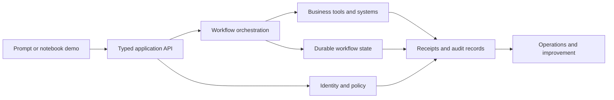

The transition introduces concerns that a model demonstration usually ignores:

- Who is the caller?
- What is the caller allowed to do?
- Which input and output schemas are valid?
- What happens when a tool times out after completing a write?
- How are duplicate webhook deliveries handled?
- Which workflow, prompt, model, and policy versions produced the outcome?
- How can an operator pause, resume, retry, or abort the run?
- How is a deployment rolled back without corrupting in-flight work?

> **Production principle**
>
> A useful model is only one component. The product is the complete controlled execution path from request to verified business outcome.

---

## 2. Four distinct responsibilities

The cleanest deployment architecture assigns different concerns to different layers.

| Layer | Primary responsibility | Typical technology |
|---|---|---|
| Experience layer | User interaction, progress, approvals, evidence | Web, mobile, chat, forms |
| API and control layer | Contracts, identity, policy, idempotency, state transitions | FastAPI or another application framework |
| Workflow layer | Cross-system sequencing, triggers, waits, routing, connectors | n8n or a workflow engine |
| Intelligence layer | Classification, generation, retrieval, planning, evaluation | LLMs, RAG, agent runtimes |
| Systems of record | Durable authoritative business state | CRM, ERP, databases, ticketing systems |

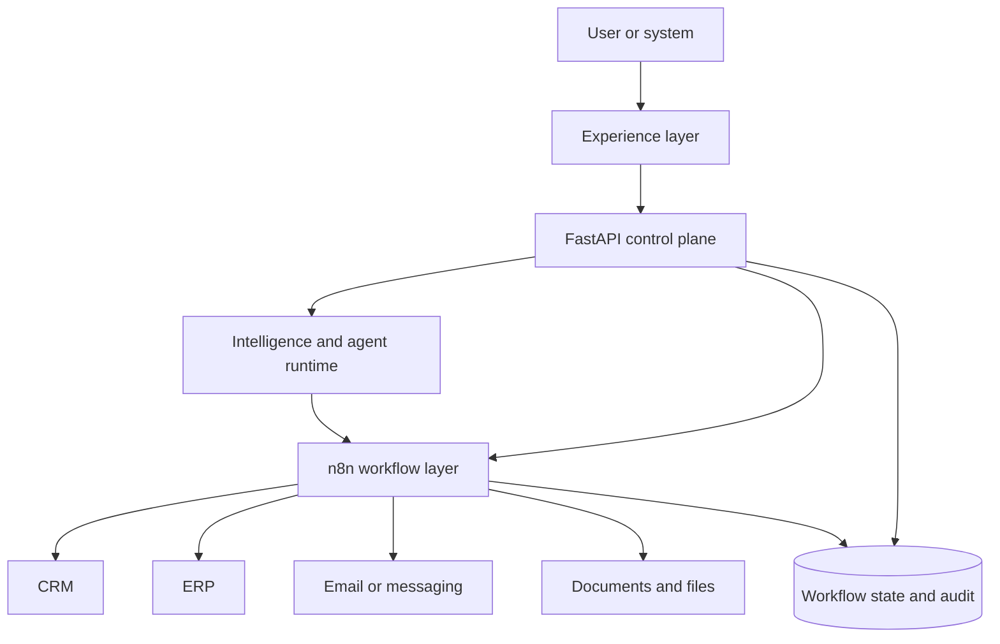

This separation prevents two common anti-patterns:

1. **Putting all business logic in visual workflow nodes.** The workflow becomes hard to test, review, reuse, and migrate.
2. **Putting all integration logic in an agent prompt.** The model receives too much authority and the execution path becomes nondeterministic.

A strong hybrid design keeps domain rules and safety policy in code, while using n8n for integration-heavy orchestration.

---

## 3. What n8n is good at

n8n is a workflow-automation platform that connects triggers, logic, APIs, data transformations, approvals, and external systems. Its design center is operational orchestration rather than model training.

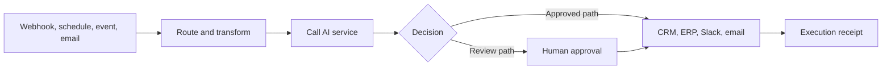

### 3.1 Strong use cases

Use n8n when the workflow contains many of the following:

- SaaS and enterprise-system connectors;
- webhook and schedule triggers;
- data mapping between systems;
- human approval or wait states;
- cross-platform notifications;
- operationally visible branching;
- retries around integration steps;
- workflows that business operations teams need to inspect;
- self-hosting or controlled-network requirements.

### 3.2 Weak use cases

Do not default to n8n for:

- high-throughput, low-latency request paths where every millisecond matters;
- complex domain algorithms that require extensive unit testing;
- deeply nested control logic better represented as code;
- security policy that must be centrally enforced across channels;
- large-scale data processing better suited to a stream or batch platform;
- stateful agent reasoning that needs specialized checkpoint semantics.

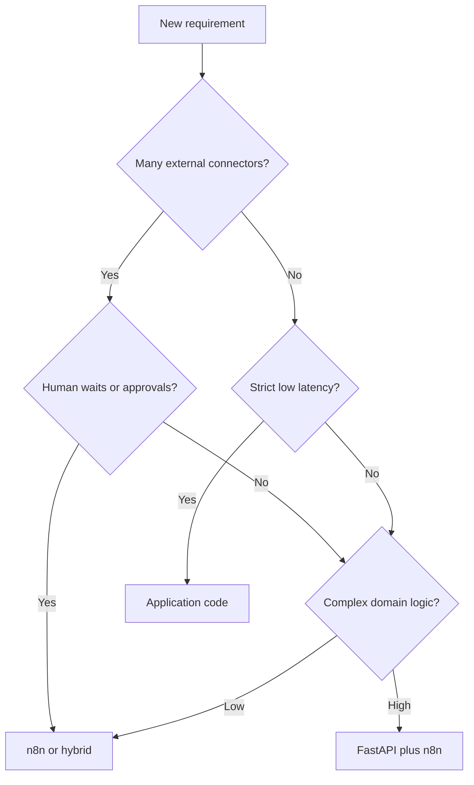

> **Architecture rule**
>
> Use n8n to coordinate systems. Use code to define durable business contracts. Use the model for bounded intelligence.

---

## 4. The hybrid reference architecture

The recommended architecture in this chapter uses FastAPI as the control plane and n8n as the workflow plane.

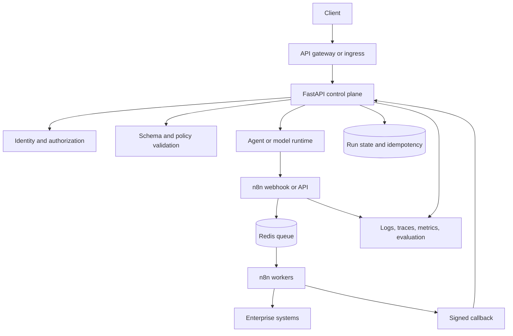

The API owns:

- public and internal request schemas;
- caller identity and delegated permissions;
- policy checks;
- request-size and rate limits;
- idempotency keys;
- approval tokens;
- workflow-run identifiers;
- callbacks and state transitions;
- release version metadata.

n8n owns:

- webhook, schedule, and event triggers;
- integration-specific credentials;
- connector invocation;
- multi-system sequencing;
- wait states and human tasks;
- operational routing;
- integration retries within bounded policy;
- workflow execution receipts.

The model or agent owns:

- classification;
- extraction;
- summarization;
- retrieval-grounded analysis;
- recommendation within a constrained action space;
- structured plan proposals.

---

## 5. FastAPI as the typed control plane

FastAPI is well suited to this boundary because request, response, security, and OpenAPI contracts are explicit and testable.

### 5.1 Organize by domain rather than endpoint count

```text
app/
├── main.py
├── api/
│   ├── health.py
│   ├── workflows.py
│   └── approvals.py
├── domain/
│   ├── contracts.py
│   ├── policies.py
│   └── services.py
├── adapters/
│   ├── n8n.py
│   ├── model.py
│   └── storage.py
└── observability/
    ├── logging.py
    └── tracing.py
```

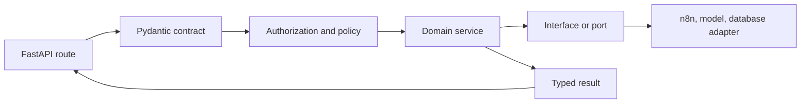

The route should not contain the entire workflow. It should validate transport concerns, call a domain service, and return a stable contract.

### 5.2 Use lifespan for managed resources

Initialize long-lived resources at application startup and release them at shutdown:

- database connection pools;
- HTTP clients;
- model-provider clients;
- telemetry exporters;
- key and policy caches;
- queue connections.

The current FastAPI guidance recommends lifespan handling for startup and shutdown behavior. Tests should enter the application lifespan so readiness and cleanup behavior are exercised.

### 5.3 Separate liveness and readiness

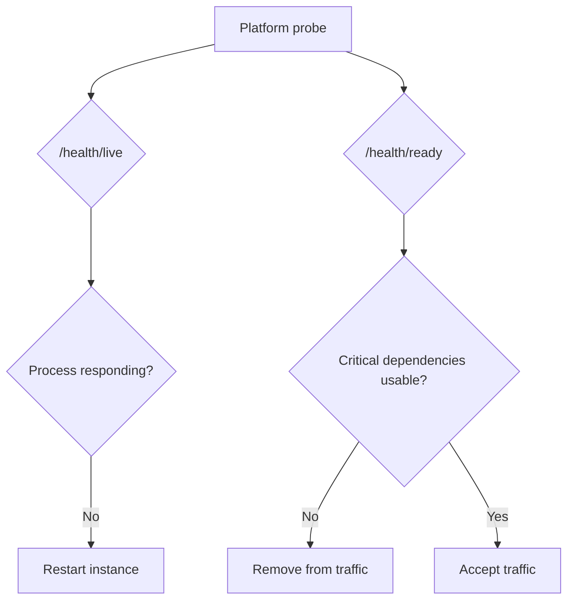

- **Liveness** answers whether the process should be restarted.
- **Readiness** answers whether the instance should receive traffic.

Do not make liveness depend on every downstream system. A temporary database outage should usually remove the instance from traffic, not force an endless restart loop.

---

## 6. API contracts for workflow execution

A workflow API should distinguish a request to *analyze* from a request to *act*.

```json
{
  "ticket_id": "T-1042",
  "text": "Production is down for all users",
  "customer_tier": "enterprise",
  "customer_blocked": true,
  "requested_action": "classify_and_escalate"
}
```

A safe response can require approval before the side effect:

```json
{
  "run_id": "run-...",
  "ticket_id": "T-1042",
  "product_area": "General Support",
  "priority": "P1",
  "recommended_owner": "Tier 1 Support",
  "escalation_required": true,
  "status": "approval_required",
  "approval_token": "sha256-of-the-exact-action",
  "trace_id": "trace-..."
}
```

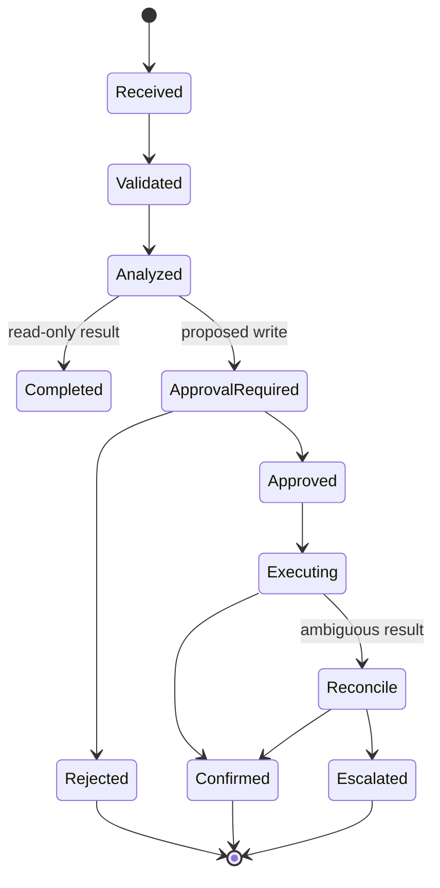

### 6.1 Idempotency is mandatory for side effects

Webhook senders, users, gateways, and workflow engines can retry. A repeated request must not create repeated tickets, emails, orders, or payroll changes.

A practical idempotency record includes:

| Field | Purpose |
|---|---|
| Idempotency key | Stable identifier from caller or derived request |
| Action hash | Exact normalized action and arguments |
| Status | Started, succeeded, failed, uncertain |
| Result reference | Created ticket, order, or message ID |
| First-seen time | Retention and replay policy |
| Caller and tenant | Isolation and auditability |

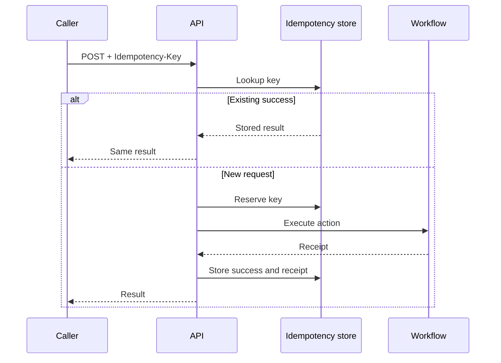

### 6.2 Bind approval to the exact action

An approval should not be a generic “yes.” Hash the normalized action, arguments, target, policy version, and expiry. If any material field changes, require a new approval.

---

## 7. Invoking n8n safely

There are three common integration patterns.

### 7.1 Synchronous webhook

The API invokes an n8n production webhook and waits for a response.

Use it when:

- the workflow is short;
- downstream systems are reliable;
- response time stays within the caller budget;
- no long human wait is required.

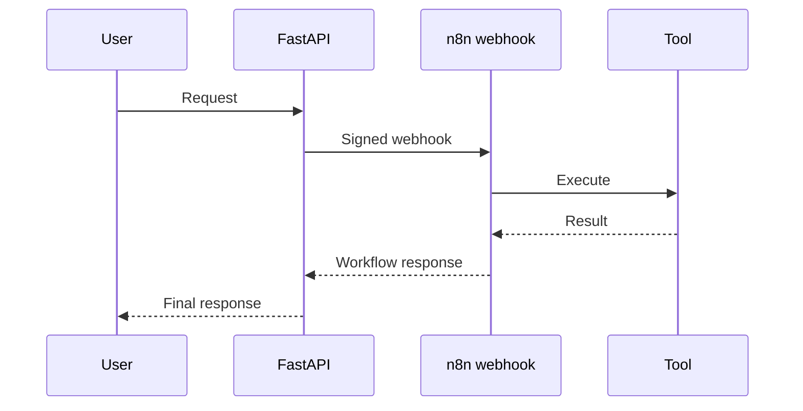

### 7.2 Asynchronous workflow with callback

The API creates a run, n8n executes asynchronously, then sends a signed callback.

Use it for:

- multi-minute workflows;
- human approvals;
- rate-limited systems;
- retries and waits;
- large fan-out work.

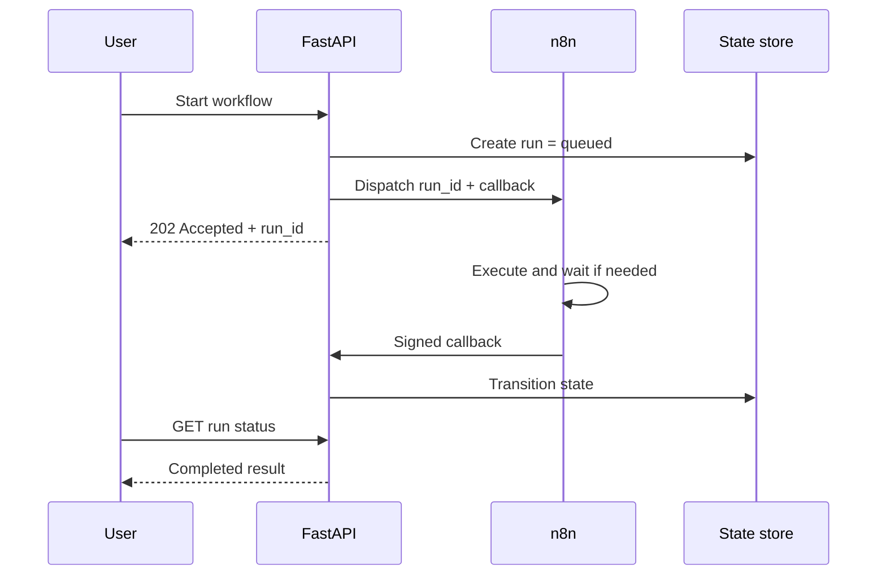

### 7.3 Event or queue integration

The API publishes an event; a worker or workflow engine consumes it. This decouples availability and throughput but introduces eventual consistency and queue operations.

---

## 8. n8n workflow design

### 8.1 Keep nodes single-purpose

A readable workflow separates:

1. trigger;
2. input validation;
3. identity or signature verification;
4. data lookup;
5. AI analysis;
6. deterministic decision;
7. approval;
8. side effect;
9. confirmation;
10. callback and telemetry.

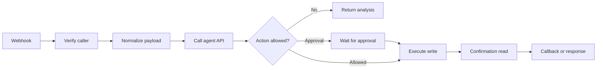

### 8.2 Do not hide policy in expressions

Visual expressions are useful for mapping, but important policy should be:

- named;
- versioned;
- tested;
- reviewed;
- observable;
- preferably centralized in the control plane.

### 8.3 Test and production webhook URLs

n8n distinguishes test and production webhook behavior. Development should use the test URL and execution inspection; production callers should use the active workflow's production URL. Never accidentally embed a test URL in an application release.

### 8.4 Workflow credentials

Use n8n credentials or an external secret store, not plaintext node parameters. Restrict which nodes, APIs, and credentials each workflow can use. Separate read and write credentials where the target system permits it.

---

## 9. Scaling n8n

For scalable self-hosting, n8n supports queue mode. A main instance receives triggers and schedules work; workers execute jobs using a Redis-backed queue, with shared database state.

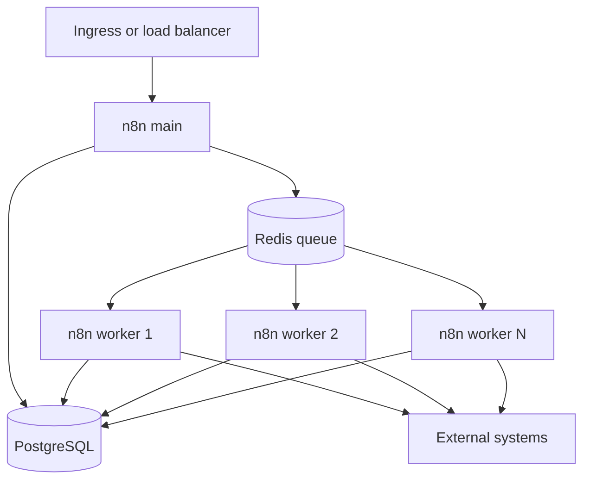

### 9.1 Capacity dimensions

Scale based on:

- execution arrival rate;
- average workflow duration;
- concurrent waits;
- tool latency;
- binary-data volume;
- memory per execution;
- database write load;
- external API rate limits.

### 9.2 Queue-mode implications

- All instances must use a consistent encryption key and compatible configuration.
- PostgreSQL and Redis become critical dependencies.
- Binary data must use a supported shared-storage strategy rather than worker-local filesystem assumptions.
- Workflow concurrency should respect downstream service limits.
- Workers require graceful shutdown so in-flight tasks are not abandoned unnecessarily.

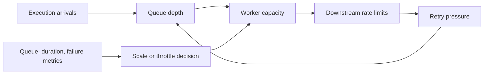

> **Operational warning**
>
> Adding workers does not fix a slow database or a rate-limited downstream API. It can amplify the failure by increasing concurrency.

---

## 10. Workflow source control and environments

Treat workflows as deployable software artifacts.

Version together:

- workflow JSON;
- API contracts;
- prompts and evaluator rubrics;
- policy definitions;
- database migrations;
- container image digest;
- environment configuration schema;
- release notes.

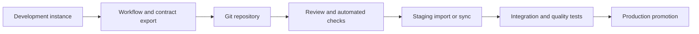

n8n provides Git-based source-control and environment capabilities in supported editions. Its Git behavior is not identical to a native pull-request workflow; teams should still perform review, merge, signing, and policy enforcement in the Git provider where appropriate.

### 10.1 Environment separation

At minimum, separate:

| Environment | Purpose | Data policy |
|---|---|---|
| Development | Build and debug | Synthetic or masked data |
| Test | Automated integration | Controlled fixtures |
| Staging | Release candidate validation | Production-like, minimized |
| Production | Real workflows | Governed data and credentials |

Do not point a development workflow at production write credentials.

---

## 11. Containerizing the FastAPI service

A container image should be reproducible, minimal, non-root, and immutable.

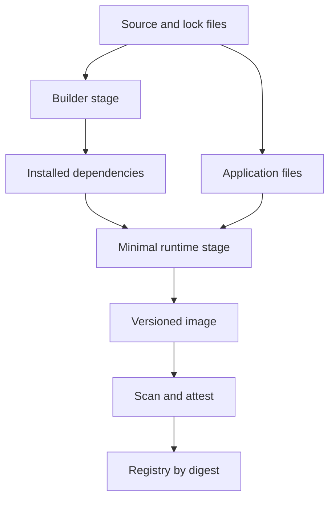

### 11.1 Dockerfile practices

- Start from a trusted, maintained base image.
- Pin application dependencies and review base-image updates.
- Use a multi-stage build when it reduces compilers and caches in the runtime image.
- Run as an unprivileged user.
- Copy only required files.
- Set deterministic environment behavior.
- Include a useful health check where the platform benefits from it.
- Avoid embedding credentials, `.env` files, model keys, or private certificates.
- Prefer a read-only filesystem plus explicit writable mounts or `tmpfs`.
- Generate and store software-bill-of-materials and provenance metadata in the release pipeline.

### 11.2 One process or multiple workers?

On a single server, multiple Uvicorn workers can use multiple CPU cores. In an orchestrated environment, a common pattern is one server process per container and horizontal replication at the platform layer. The correct choice depends on memory, startup cost, model clients, and deployment platform.

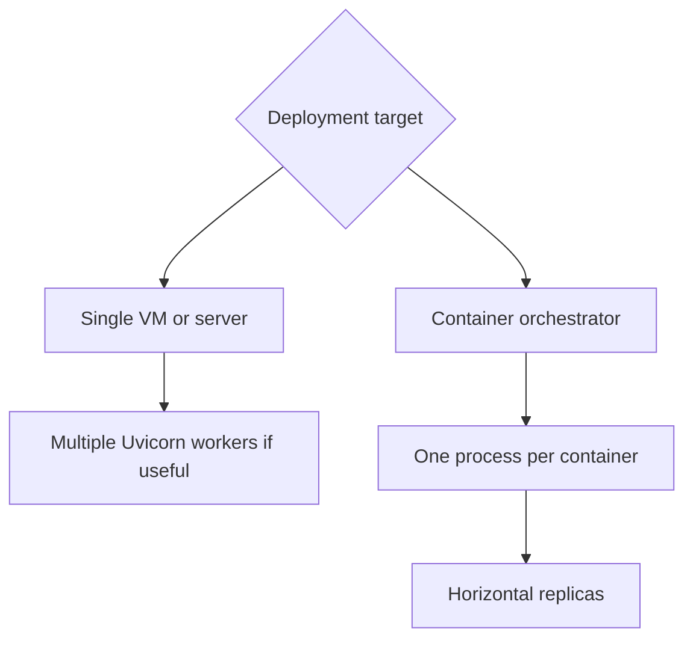

Measure memory before increasing worker count. Each worker may load its own model client, cache, tokenizer, or local model.

---

## 12. Docker Compose for local and controlled single-host deployments

Compose provides a useful development, integration-test, and single-host deployment specification.

The example stack includes:

- FastAPI service;
- PostgreSQL;
- Redis;
- n8n main instance;
- n8n worker;
- health checks;
- named volumes;
- file-mounted secrets;
- a production override file.

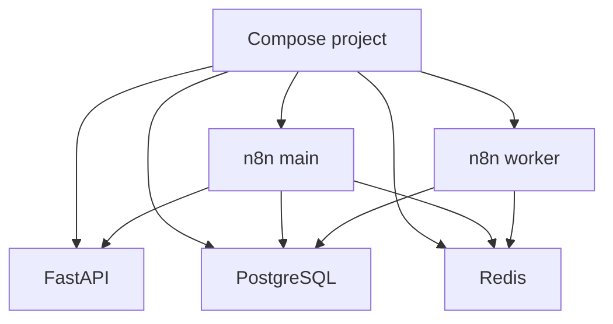

### 12.1 Health-aware startup

`depends_on` controls ordering, but readiness requires health checks. A process being started does not mean its database is accepting connections.

### 12.2 Persistence

Store database, queue persistence where required, and n8n configuration outside the container writable layer. Back up both data and the encryption material required to decrypt credentials.

### 12.3 Secrets

Docker Compose supports secrets mounted as files. Applications should accept both environment variables and `_FILE` variants. For larger deployments, integrate a managed secret store and short-lived credentials.

### 12.4 Production override

Keep environment-specific changes in an override file:

```bash
docker compose -f compose.yaml -f compose.production.yaml up -d
```

Use immutable image tags or digests in production. The chapter example uses a placeholder registry and tag that must be replaced.

---

## 13. CI: prove the artifact is releasable

Continuous integration should validate more than Python syntax.

```mermaid
flowchart LR
    COMMIT[Commit or pull request] --> LINT[Lint and type checks]
    LINT --> UNIT[Unit tests]
    UNIT --> CONTRACT[API and workflow contract tests]
    CONTRACT --> SECURITY[Dependency and secret scans]
    SECURITY --> BUILD[Build container]
    BUILD --> IMAGE_TEST[Container smoke tests]
    IMAGE_TEST --> EVAL[AI quality and safety suite]
    EVAL --> ATTEST[SBOM and provenance]
    ATTEST --> PUBLISH[Publish immutable image]
```

### 13.1 Minimum gates

A production agent pipeline should normally include:

- formatting and linting;
- type checking;
- unit tests;
- FastAPI endpoint tests;
- workflow JSON validation;
- contract tests between FastAPI and n8n;
- prompt and model regression tests;
- retrieval and tool-use evaluation;
- security and dependency scanning;
- secret detection;
- container build and health smoke test;
- migration validation;
- image vulnerability policy;
- provenance attestation.

### 13.2 Test the workflow contract without the workflow engine

Use a mock n8n adapter to verify:

- request signature;
- timeout behavior;
- retry policy;
- callback authentication;
- duplicate callback handling;
- invalid state transitions;
- partial failure behavior.

Then run integration tests against a real disposable n8n instance for representative workflows.

---

## 14. CD: deploy safely rather than quickly

Continuous delivery should promote the same immutable artifact through environments.

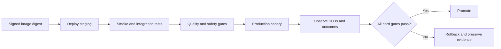

### 14.1 GitHub Actions deployment controls

GitHub Actions supports deployment environments, concurrency controls, protection rules, OIDC-based cloud authentication, package publication, and artifact attestations.

Use these controls to:

- prevent concurrent production deploys;
- require review for high-risk environments;
- restrict deployable branches and tags;
- authenticate to cloud providers with short-lived OIDC credentials instead of long-lived keys;
- publish images to a registry;
- attest where and how the artifact was built;
- retain deployment history.

### 14.2 Deploy by digest

A tag can move. A digest identifies the exact image content.

```text
registry.example.com/agent-api@sha256:...
```

Record the digest with:

- workflow version;
- prompt version;
- model configuration;
- policy version;
- schema version;
- database migration version.

### 14.3 Release gates for AI systems

Traditional health checks are necessary but insufficient. Promotion should also require:

| Gate | Example |
|---|---|
| Functional | API and workflow smoke tests pass |
| Quality | Task success and grounding above threshold |
| Safety | No critical unauthorized actions or leakage |
| Fairness | Critical cohort disparities within policy |
| Performance | p95 latency and queue wait within budget |
| Cost | Cost per verified successful task acceptable |
| Operations | Error-budget burn and retry rate acceptable |

---

## 15. Database migrations and workflow compatibility

Deployments often change schemas and workflows simultaneously.

Use an expand-and-contract strategy:

```mermaid
flowchart LR
    OLD[Old application and schema] --> EXPAND[Add backward-compatible fields]
    EXPAND --> DUAL[Deploy code that reads both versions]
    DUAL --> MIGRATE[Migrate data and workflows]
    MIGRATE --> VERIFY[Verify no old consumers]
    VERIFY --> CONTRACT[Remove old fields]
```

Never deploy a workflow that requires a new field before the API and database can support it. Never remove a callback field while old workflow executions can still return it.

### 15.1 In-flight workflow compatibility

Long-running executions may outlive a deployment. Persist the workflow definition version and route callbacks to a compatible handler. For high-risk changes, drain old executions before removal.

---

## 16. Observability across FastAPI and n8n

A trace must cross the API and workflow boundary.

```mermaid
sequenceDiagram
    participant U as Caller
    participant A as FastAPI
    participant N as n8n
    participant T as Tool
    U->>A: Request + trace context
    A->>N: Webhook + trace_id + run_id
    N->>T: Tool call + correlation data
    T-->>N: Receipt
    N->>A: Callback + execution_id
    A-->>U: Result
    Note over A,N: Correlate run, trace, workflow, execution, tenant, and versions
```

Capture at least:

- trace ID;
- workflow run ID;
- n8n execution ID;
- user, service, and tenant identity references;
- workflow and API version;
- node or stage name;
- tool and target system;
- attempt number;
- latency;
- input and output references, not unnecessary raw secrets;
- status and error classification;
- approval and idempotency references;
- token and model cost where relevant.

n8n provides health endpoints and can expose Prometheus metrics in self-hosted deployments. Keep metrics endpoints internal. Application metrics should add business-level measures such as task completion, approval wait time, duplicate-action blocks, and verified side-effect success.

```mermaid
flowchart TB
    API[FastAPI telemetry] --> OTEL[Collector or telemetry pipeline]
    N8N[n8n metrics and execution events] --> OTEL
    DB[Database and queue metrics] --> OTEL
    OTEL --> TRACE[Trace store]
    OTEL --> METRIC[Metrics platform]
    OTEL --> LOG[Log platform]
    TRACE --> INCIDENT[Incident investigation]
    METRIC --> ALERT[Alerts and SLOs]
    LOG --> AUDIT[Audit and diagnostics]
```

---

## 17. Security architecture

### 17.1 Protect every boundary

```mermaid
flowchart LR
    INTERNET[Untrusted caller] --> WAF[Gateway, TLS, limits]
    WAF --> API[FastAPI authentication]
    API --> POLICY[Authorization and policy]
    POLICY --> N8N[Signed workflow invocation]
    N8N --> CREDS[Scoped credentials]
    CREDS --> SYSTEM[System of record]
    SYSTEM --> RECEIPT[Verified receipt]
```

Controls include:

- TLS at ingress;
- authenticated webhooks;
- request signatures with timestamp and replay protection;
- short-lived service identities;
- tenant and scope checks in the API;
- separate read and write credentials;
- node and API restrictions in n8n;
- external secret stores;
- network egress restrictions;
- non-root containers;
- read-only filesystems;
- image scanning and build provenance;
- redacted execution data;
- bounded payload and file processing;
- human approval for high-impact actions.

### 17.2 Never trust retrieved or workflow data as instruction

An n8n workflow may process email, documents, websites, or tickets containing prompt injection. Treat their content as data. The model must not gain new tools or permissions because an untrusted document requested them.

### 17.3 Security audits

Self-hosted n8n includes security-audit capabilities. Use platform audits as one control, not a substitute for infrastructure, identity, workflow, dependency, and application threat modeling.

---

## 18. Reliability patterns

### 18.1 Classify failures before retrying

| Failure | Typical response |
|---|---|
| Validation failure | Reject; do not retry |
| Authentication failure | Stop and alert |
| Rate limit | Retry with bounded backoff |
| Temporary dependency outage | Retry or queue |
| Permanent business rejection | Return structured failure |
| Ambiguous write result | Reconcile before retry |
| Policy denial | Stop or request approval |
| No progress | Escalate or safe-stop |

```mermaid
flowchart TD
    FAIL[Step failed] --> CLASSIFY{Failure class}
    CLASSIFY -->|Invalid or denied| STOP[Stop]
    CLASSIFY -->|Transient| BUDGET{Retry budget?}
    BUDGET -->|Yes| BACKOFF[Backoff and retry]
    BUDGET -->|No| FALLBACK[Fallback or escalate]
    CLASSIFY -->|Ambiguous write| RECON[Confirmation read]
    RECON -->|Succeeded| COMPLETE[Record success]
    RECON -->|Not applied| BUDGET
    RECON -->|Unknown| HUMAN[Human review]
```

### 18.2 Use circuit breakers and bulkheads

A failing CRM should not consume all workers or block unrelated email workflows. Separate queues, concurrency budgets, and credentials by capability or risk domain.

### 18.3 Dead-letter handling

When a workflow exceeds its retry budget, preserve:

- original request reference;
- normalized inputs;
- completed steps;
- receipts;
- last error;
- versions;
- recommended operator action.

Do not silently discard the run.

---

## 19. Human approval as a durable workflow state

Human review is not a chat message. It is a state transition with identity, scope, and expiry.

```mermaid
stateDiagram-v2
    [*] --> Proposed
    Proposed --> WaitingForApproval
    WaitingForApproval --> Approved: authorized reviewer
    WaitingForApproval --> Rejected
    WaitingForApproval --> Expired
    Approved --> Executing
    Executing --> Confirmed
    Executing --> Failed
    Rejected --> [*]
    Expired --> [*]
    Confirmed --> [*]
    Failed --> Escalated
```

An approval packet should show:

- proposed action;
- exact target and arguments;
- evidence and reasoning summary;
- expected impact;
- reversible or irreversible status;
- policy basis;
- expiry;
- approval token or action hash.

The UI, API, and workflow engine must all refer to the same action hash.

---

## 20. Example project architecture

The chapter repository includes a deployable example.

```text
examples/43-production-deployment/
├── app/
│   └── main.py
├── tests/
│   └── test_api.py
├── n8n/
│   └── support-triage-workflow.json
├── .github/workflows/
│   └── ci-cd.yaml
├── Dockerfile
├── compose.yaml
├── compose.production.yaml
├── requirements.txt
├── requirements-dev.txt
├── .env.example
├── .dockerignore
├── Makefile
└── README.md
```

### 20.1 FastAPI capabilities

The example implements:

- liveness and readiness endpoints;
- API-key authentication;
- trace-ID middleware;
- typed support-triage input and output;
- deterministic classification and priority rules;
- idempotent request handling;
- exact-action approval tokens;
- n8n callback acceptance.

### 20.2 n8n workflow

The included workflow export demonstrates:

```mermaid
flowchart LR
    W[Webhook] --> H[HTTP Request to FastAPI]
    H --> R[Respond to Webhook]
```

A real deployment should replace the demonstration environment-variable API key with a governed credential or secret-store integration.

### 20.3 Compose stack

The stack demonstrates a FastAPI service, PostgreSQL, Redis, n8n main, and n8n worker. It is a reference, not a universal production topology. Replace `latest` image tags, local secrets, hostnames, TLS, backups, storage, and ingress before production use.

### 20.4 CI/CD workflow

The GitHub Actions example:

- runs linting and tests;
- builds and publishes an image;
- generates build provenance;
- separates staging and production environments;
- deploys by digest;
- reserves steps for smoke tests and AI release gates.

Cloud authentication commands are intentionally placeholders because each provider has a different official OIDC login action and deployment target.

---

## 21. Testing strategy

### 21.1 Test pyramid

```mermaid
flowchart TB
    E2E[Small number of end-to-end workflow tests]
    INTEG[API, n8n, database, queue, and tool integration tests]
    CONTRACT[Schema, callback, event, and credential contract tests]
    UNIT[Large base of domain and policy unit tests]
    UNIT --> CONTRACT --> INTEG --> E2E
```

### 21.2 Required scenarios

Test at least:

- valid read-only workflow;
- valid write requiring approval;
- duplicate webhook delivery;
- duplicate callback;
- stale or forged approval;
- caller without scope;
- downstream rate limit;
- timeout before write;
- timeout after write;
- n8n worker crash;
- database unavailability;
- Redis unavailability;
- malformed model output;
- prompt injection in external content;
- workflow version mismatch;
- rollback while old executions remain active.

### 21.3 AI-specific tests

The deployment pipeline must also test:

- task quality;
- grounding and citations;
- tool selection;
- policy compliance;
- cohort behavior;
- severe failure rate;
- latency and cost;
- escalation behavior.

---

## 22. Deployment patterns

### 22.1 Single host

Useful for pilots and controlled internal workloads:

```mermaid
flowchart TB
    PROXY[Reverse proxy and TLS] --> API[FastAPI containers]
    PROXY --> N8N[n8n main]
    N8N --> WORKER[n8n workers]
    API --> PG[(PostgreSQL)]
    N8N --> PG
    N8N --> REDIS[(Redis)]
    WORKER --> REDIS
```

Operational burden includes host patching, backups, failover, certificate renewal, capacity, and disaster recovery.

### 22.2 Managed container platform

Use managed databases, managed Redis, autoscaling container services, identity federation, centralized secrets, and managed ingress. This reduces undifferentiated operations but does not remove application reliability responsibilities.

### 22.3 Kubernetes or equivalent orchestrator

Appropriate when the organization already operates a mature platform and needs advanced scheduling, workload isolation, policy, autoscaling, and multi-service operations. Do not adopt it solely because the application contains an LLM.

> **Selection principle**
>
> Choose the simplest deployment target that meets availability, security, scale, recovery, and organizational capability requirements.

---

## 23. Production readiness checklist

### Architecture

- [ ] Reasoning, API control, workflow orchestration, and systems of record are separated.
- [ ] Domain logic is not hidden entirely inside visual nodes.
- [ ] Read and write workflows are distinguished.
- [ ] Long-running workflows use durable state and asynchronous completion.

### API

- [ ] All inputs and outputs have versioned schemas.
- [ ] Authentication, tenant, and scope checks occur before routing.
- [ ] Write operations require idempotency.
- [ ] High-impact actions require exact-action approval.
- [ ] Liveness and readiness are distinct.

### n8n

- [ ] Production URLs are used for active webhook workflows.
- [ ] Credentials are stored in governed credential or secret stores.
- [ ] Main and worker roles are configured consistently.
- [ ] Queue, database, and binary-data strategies are documented.
- [ ] Workflow definitions are versioned and reviewed.
- [ ] Security audit and node restrictions are configured where applicable.

### Containers

- [ ] Runtime image is minimal and non-root.
- [ ] No credentials are embedded in image layers.
- [ ] Filesystem and Linux privileges are restricted.
- [ ] Health checks and graceful shutdown are implemented.
- [ ] Images are scanned, signed or attested, and deployed by digest.

### CI/CD

- [ ] Unit, contract, integration, and AI evaluation suites run.
- [ ] Workflow JSON and callback schemas are validated.
- [ ] Staging and production use protected environments.
- [ ] Cloud deployment uses short-lived federated identity where possible.
- [ ] Canary promotion depends on hard quality and safety gates.
- [ ] Rollback and database compatibility are tested.

### Operations

- [ ] Trace context crosses API, n8n, and tool boundaries.
- [ ] Queue depth, execution time, failures, retries, and approval waits are monitored.
- [ ] Dead-letter and reconciliation runbooks exist.
- [ ] Backup and restore tests include credential encryption keys.
- [ ] Incident response preserves workflow and release evidence.

---

## 24. Common mistakes

### Mistake 1: Using n8n as the only policy engine

A visual `if` node is not a sufficient enterprise authorization boundary. Enforce identity and permissions in a central control plane and again at the target system.

### Mistake 2: Using a single broad credential

One credential that can read and write every CRM object turns any workflow bug into a major incident. Scope credentials by system, role, environment, and action.

### Mistake 3: Retrying every error

Validation, authorization, and business-rule failures do not improve with retries. Ambiguous writes require reconciliation before retry.

### Mistake 4: Mutable production tags

Deploying `latest` makes rollback and incident attribution unreliable. Promote immutable digests.

### Mistake 5: Treating container startup as readiness

The process can be running while database migrations, policy loading, or model-client initialization are incomplete.

### Mistake 6: Logging raw prompts, documents, and credentials

Observability should preserve references and decision metadata without creating a second uncontrolled data store.

### Mistake 7: Deploying model changes without workflow regression tests

A new model may change structured output, tool selection, latency, or refusal behavior even when the workflow definition is unchanged.

### Mistake 8: Updating workflow and API schemas independently

Version and test the contract as one release unit.

---

## 25. Knowledge checks

1. Why should n8n coordinate systems rather than own all domain logic?
2. What is the difference between liveness and readiness?
3. Why is idempotency necessary even when the caller promises not to retry?
4. When should a workflow use an asynchronous callback instead of a synchronous webhook response?
5. What dependencies become critical in n8n queue mode?
6. Why should an approval be bound to an action hash?
7. What is the benefit of deploying a container by digest rather than a mutable tag?
8. Which AI-specific checks belong in a production release gate?
9. Why can adding workers make a rate-limited dependency failure worse?
10. How should a system handle a timeout after a possible side effect?
11. What information must cross the FastAPI–n8n boundary for traceability?
12. Why is a production workflow definition part of the software supply chain?

---

## 26. Interview questions

### Beginner

1. What problems do FastAPI, n8n, and Docker solve in an agentic system?
2. What is a webhook?
3. Why use request and response schemas?
4. What is a container health check?
5. What is the difference between CI and CD?

### Intermediate

6. Design a synchronous FastAPI-to-n8n integration.
7. Design an asynchronous workflow with callbacks and polling.
8. Explain idempotency for a workflow that sends email and updates a CRM.
9. How would you store and rotate n8n credentials?
10. How would you test a workflow without calling real external systems?
11. How would you correlate API traces with n8n execution IDs?
12. When would you use one Uvicorn process per container?
13. How do Compose health checks improve startup behavior?

### Senior

14. Design a production n8n queue-mode deployment with failure isolation.
15. How would you safely deploy a breaking workflow schema change?
16. How would you reconcile an ambiguous payroll write?
17. Which controls prevent an untrusted email from causing tool misuse?
18. How would you calculate capacity for n8n workers and downstream APIs?
19. Design hard release gates for an AI support agent.
20. How would you manage long-running executions during rollback?
21. How would you secure GitHub Actions deployment without long-lived cloud credentials?
22. What should be included in a build provenance record?

### Architecture exercise

Design an employee onboarding agent that:

- receives an approved HR event;
- creates identity and application-access requests;
- schedules orientation;
- sends manager and employee notifications;
- waits for approvals where required;
- handles partial failure safely;
- provides a complete audit trail.

Your answer should include:

- FastAPI contracts;
- n8n workflow boundaries;
- identity and approval model;
- idempotency strategy;
- queue and state model;
- error classification and compensation;
- container and environment topology;
- CI/CD release gates;
- observability and runbooks.

---

## 27. Chapter summary

A production agent is not deployed by placing a prompt behind an endpoint. It becomes operational when the entire action path is typed, authorized, durable, idempotent, observable, testable, and releasable.

The architecture in this chapter uses:

- **FastAPI** for public and internal contracts, identity, policy, approvals, idempotency, callbacks, and state transitions;
- **n8n** for integration-heavy orchestration, triggers, waits, connector execution, and human-operational visibility;
- **Docker** for reproducible packaging and controlled runtime behavior;
- **Compose** for local, test, and selected single-host topologies;
- **CI/CD** for automated verification, immutable builds, protected deployment, provenance, canaries, and rollback.

The central lesson is the same one repeated throughout this handbook:

> Use the simplest architecture that can reliably solve the task, but make every business side effect explicit, permissioned, verifiable, and recoverable.

---

## Supplementary official references

- [n8n deployment documentation](https://docs.n8n.io/deploy/)
- [n8n queue mode](https://docs.n8n.io/deploy/host-n8n/configure-n8n/scaling/enable-queue-mode/)
- [n8n source control and environments](https://docs.n8n.io/administer/use-source-control-and-environments/)
- [n8n monitoring](https://docs.n8n.io/deploy/host-n8n/keep-n8n-running/monitor-n8n/)
- [n8n security](https://docs.n8n.io/deploy/host-n8n/configure-n8n/security/)
- [FastAPI deployment concepts](https://fastapi.tiangolo.com/deployment/concepts/)
- [FastAPI in containers](https://fastapi.tiangolo.com/deployment/docker/)
- [FastAPI lifespan events](https://fastapi.tiangolo.com/advanced/events/)
- [FastAPI testing](https://fastapi.tiangolo.com/tutorial/testing/)
- [Docker build best practices](https://docs.docker.com/build/building/best-practices/)
- [Docker Compose in production](https://docs.docker.com/compose/how-tos/production/)
- [Docker Compose secrets](https://docs.docker.com/compose/how-tos/use-secrets/)
- [GitHub Actions deployments](https://docs.github.com/en/actions/how-tos/deploy/)
- [GitHub Actions OpenID Connect](https://docs.github.com/en/actions/concepts/security/openid-connect/)
- [GitHub artifact attestations](https://docs.github.com/en/actions/concepts/security/artifact-attestations/)
