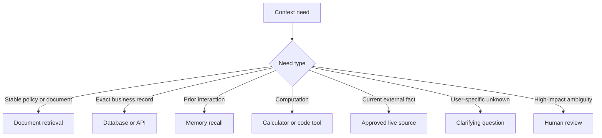
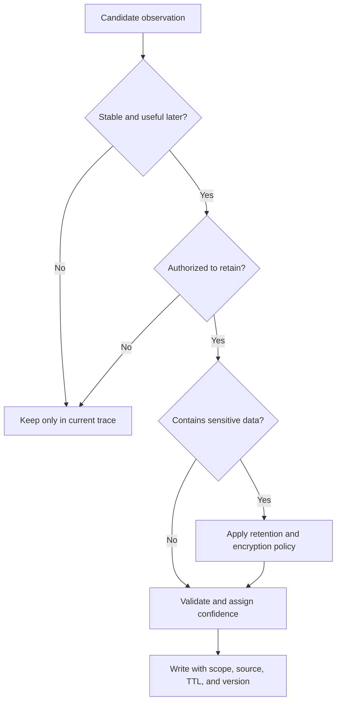
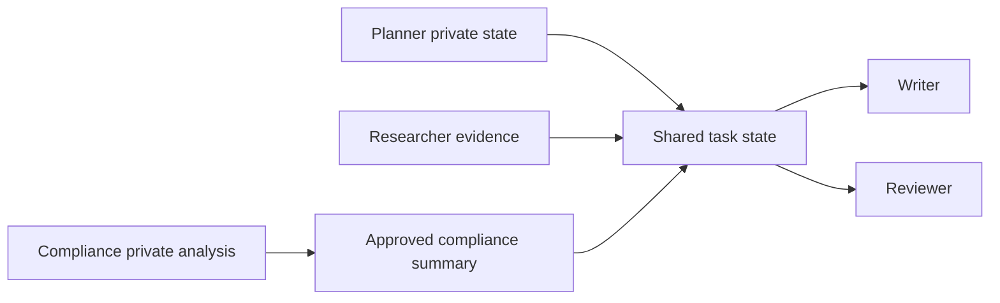

# Chapter 45 - Context Operations: Retrieval, Memory, Compression, and Routing

> **Source basis:** The board presents embeddings, RAG, memory, shared state, tool routing, latency budgets, and failure recovery as core building blocks [Board, pp. 6-7, 15-17, 30-39, 49]. This chapter reframes those building blocks as **context operations**: reusable transformations that acquire, rank, compress, route, retain, and retire information. The detailed operational model is **Supplementary**.

---

## Learning objectives

By the end of this chapter, you should be able to:

1. Design a context pipeline as a sequence of explicit operations.
2. Choose between retrieval, memory recall, database lookup, tool execution, and clarification.
3. Build query decomposition and context routing policies.
4. Apply deduplication, reranking, contradiction detection, and evidence grouping.
5. Design short-term, episodic, semantic, and procedural memory operations.
6. Use extractive, abstractive, and structured compression safely.
7. Implement context caching, invalidation, and freshness controls.
8. Evaluate context operations using step-level and outcome metrics.
9. Design multi-agent context sharing with isolation boundaries.
10. Implement a configurable context pipeline with CLI arguments.

---

## 1. Context is processed, not merely collected

A production system should not concatenate every available item. It should execute a context pipeline.


Each box is a separable engineering concern. This matters because a failed answer can be traced to the operation that failed.

---

## 2. A taxonomy of context operations

| Operation family | Purpose | Examples |
|---|---|---|
| Acquisition | Obtain candidate information | Vector search, SQL query, API call, memory recall |
| Validation | Establish whether it may be used | Authentication, tenant filter, effective-date check |
| Normalization | Convert sources into a common shape | Chunk records, typed observations, timestamps |
| Selection | Choose likely useful items | Filters, rankers, thresholds, top-k |
| Transformation | Change representation | Summarization, extraction, redaction, translation |
| Organization | Make relationships explicit | Group by entity, claim, task, source, or timeline |
| Compression | Reduce cost while preserving value | Extractive spans, state summaries, hierarchical memory |
| Routing | Decide where context should go | Planner only, reviewer only, shared state, private memory |
| Persistence | Store for later use | Checkpoints, episodic records, semantic memory |
| Eviction | Remove or invalidate | TTL, supersession, user deletion, low-confidence purge |
| Evaluation | Measure usefulness and risk | Recall, precision, faithfulness, leakage, latency |

---

## 3. Context need detection

Before retrieval, the system should determine what information is missing.

For a request such as:

> Can I return this product?

The context needs may include:

- authenticated customer identity;
- order and purchase date;
- item category;
- return policy effective for that region and date;
- warranty status;
- shipping constraints;
- compliance exceptions;
- prior return authorization;
- approval policy if an exception is requested.

A context-needs contract can be represented as:

```json
{
  "facts_required": [
    "order.purchase_date",
    "order.item_category",
    "policy.return_window",
    "policy.region"
  ],
  "optional_facts": [
    "warranty.status",
    "customer.tier"
  ],
  "action_constraints": [
    "refund_write_requires_approval"
  ],
  "unknown_handling": "ask_or_escalate"
}
```

This prevents indiscriminate retrieval.

---

## 4. Context routing

Not every information need should go to a vector database.



### 4.1 Retrieval is not a universal tool

Use document retrieval for unstructured or semi-structured knowledge. Use direct APIs for authoritative current records. Use memory only for retained information within the allowed scope. Use a clarification when no trusted source can supply the fact.

### 4.2 Hybrid routing

A compound request may need several routes in parallel.

```text
return eligibility
  - order lookup: transactional API
  - policy: hybrid document search
  - warranty: product service
  - shipping restrictions: policy database
  - customer preference: memory
```

---

## 5. Query transformation operations

The original user query is often not the best retrieval query.

### 5.1 Normalization

Standardize spelling, identifiers, dates, and known aliases.

### 5.2 Expansion

Add related terminology when vocabulary differs across sources.

```text
"login failure" -> authentication, sign-in, password reset, account access
```

### 5.3 Decomposition

Split multi-part questions into independently answerable subqueries.

### 5.4 Hypothetical document generation

Generate a likely answer-shaped representation and retrieve against it. This can improve recall but must not be treated as evidence.

### 5.5 Multi-query retrieval

Issue several semantically diverse queries, merge results, and rerank.

### 5.6 Entity-aware queries

Attach structured filters for tenant, product, region, version, date, and access scope.

---

## 6. Evidence normalization

Every source should become a common evidence record.

```python
class EvidenceRecord:
    evidence_id: str
    content: str
    source_uri: str
    source_type: str
    entity_ids: list[str]
    authority: float
    relevance: float
    freshness: float
    directness: float
    access_scope: list[str]
    effective_from: str | None
    effective_to: str | None
    content_hash: str
```

Normalization enables cross-source ranking and conflict analysis.

---

## 7. Ranking, fusion, and reranking

### 7.1 Candidate retrieval

Use broad retrieval to achieve recall.

### 7.2 Fusion

Combine rankings from lexical, semantic, metadata, graph, and structured retrieval.

Reciprocal rank fusion is a common approach:

```text
RRF score = sum(1 / (k + rank_i))
```

### 7.3 Reranking

Apply a more expensive model or deterministic business logic to the smaller candidate set.

A production rank score may include:

```text
final_score =
  semantic_relevance
  × authority
  × freshness
  × access_validity
  × entity_match
  × effective_date_match
  - duplication_penalty
  - contradiction_penalty
  - injection_risk_penalty
```

### 7.4 Diversity

The top ten nearly identical chunks may be less useful than five independent pieces of evidence. Use source independence and maximum marginal relevance to balance relevance and diversity.

---

## 8. Deduplication and evidence independence

Duplicate text can appear because of:

- document copies;
- syndication;
- version history;
- overlapping chunks;
- quoted material;
- replicated databases;
- repeated messages.

Deduplicate using:

- exact hashes;
- normalized hashes;
- source lineage;
- semantic similarity;
- shared incident or account identifiers.

Do not count copies of one source as independent corroboration.

---

## 9. Contradiction detection

Contradictions should be represented, not erased.

```json
{
  "claim": "returns are permitted for 30 days",
  "supporting": ["policy-v10"],
  "contradicting": ["policy-v12"],
  "resolution": "policy-v12_supersedes_v10",
  "confidence": 0.98
}
```

Types of contradiction include:

- superseded versions;
- different regional scope;
- different time periods;
- factual disagreement;
- inconsistent user-provided data;
- tool observations that changed during execution.

---

## 10. Memory operations

Memory is a controlled context source, not a transcript dump.

### 10.1 Working memory

Current task state, recent observations, and pending actions.

### 10.2 Episodic memory

Records of prior interactions or completed workflows.

### 10.3 Semantic memory

Extracted stable facts, concepts, preferences, and relationships.

### 10.4 Procedural memory

Reusable instructions, skills, or validated action patterns.

### 10.5 Memory write policy

A memory system should decide:



### 10.6 Memory retrieval policy

Retrieve memory only when it is:

- relevant to the current task;
- owned by the current user or allowed group;
- not expired or superseded;
- sufficiently reliable;
- appropriate for the action risk.

---

## 11. Compression operations

### 11.1 Extractive selection

Select exact sentences, table rows, or spans. Preferred for evidence-sensitive tasks.

### 11.2 Abstractive summarization

Compress several items into a derived summary. Record source references and summary version.

### 11.3 State distillation

Convert a long trajectory into:

```json
{
  "goal": "prepare sprint blocker report",
  "completed": ["tickets_loaded", "messages_loaded"],
  "confirmed_blockers": 3,
  "unresolved_conflicts": 1,
  "next_action": "resolve_owner_for_TKT-42",
  "remaining_budget": {"tool_calls": 2, "seconds": 12}
}
```

### 11.4 Hierarchical summaries

Maintain summaries at session, episode, project, and organization levels. Retrieve the narrowest useful scope.

### 11.5 Loss-aware compression

Before replacing original context, ask:

- What facts could be lost?
- Which values must remain exact?
- Which uncertainties must remain visible?
- Can the system retrieve the original source later?
- Has the summary been checked against the source?

---

## 12. Context caching and invalidation

Caching can reduce latency and cost but creates freshness risk.

Cache keys may include:

```text
tenant + user_scope + query + filters + index_version + policy_version + embedding_model
```

Invalidate when:

- source content changes;
- permissions change;
- a policy becomes effective or expires;
- the embedding model changes;
- metadata filters change;
- the user deletes memory;
- an incident marks a source untrusted.

Never share a context cache across tenants without a formally verified isolation design.

---

## 13. Context sharing in multi-agent systems

A shared context bus is convenient but risky.



Use three scopes:

1. **private:** visible only to one agent;
2. **team:** shared within the current workflow;
3. **durable:** retained across runs under explicit policy.

Agents should publish typed artifacts rather than entire hidden transcripts.

---

## 14. Context-operation reliability controls

Each operation should define:

- timeout;
- retry policy;
- fallback;
- partial-result behavior;
- idempotency;
- error classification;
- observability fields;
- data-handling policy.

Example:

```json
{
  "operation": "retrieve_policy",
  "timeout_ms": 800,
  "max_attempts": 2,
  "fallback": "cached_current_policy",
  "fail_closed_for_actions": true,
  "allow_partial_for_summary": true
}
```

---

## 15. Evaluation of context operations

Evaluate both the operation and its downstream effect.

### 15.1 Retrieval metrics

- recall@k;
- precision@k;
- mean reciprocal rank;
- nDCG;
- authorization precision;
- freshness accuracy.

### 15.2 Compression metrics

- factual preservation;
- omission rate;
- contradiction preservation;
- entity and number accuracy;
- token reduction.

### 15.3 Memory metrics

- write precision;
- recall relevance;
- stale-memory rate;
- correction propagation;
- cross-user leakage rate;
- retention compliance.

### 15.4 End-to-end metrics

- task success;
- grounding;
- citation correctness;
- tool accuracy;
- escalation quality;
- latency;
- cost per verified success.

---

## 16. Scenario: enterprise HR assistant

The board's HR architecture routes requests to policy, calendar, and payroll agents.

A context-operations design might use:

```text
request: "Why did my pay change and can you book an HR meeting?"

1. Decompose:
   - explain payroll change
   - schedule meeting
2. Validate identity and scopes.
3. Payroll operation:
   - fetch employee-specific pay event
   - retrieve approved explanation codes
4. Calendar operation:
   - fetch available slots
5. Compress:
   - publish a redacted payroll explanation artifact
   - publish a calendar options artifact
6. Merge under policy:
   - do not expose unrelated payroll details
   - require user confirmation before booking
7. Produce response and action preview.
```

The payroll specialist should not publish raw salary records into team-wide shared context. It should publish the minimum approved explanation.

---

## 17. Common mistakes

- routing every question to vector search;
- writing every interaction to long-term memory;
- summarizing before establishing source authority;
- treating cache hits as automatically current;
- mixing tenant filters with relevance ranking instead of enforcing them first;
- allowing reviewers to see sensitive private-agent context unnecessarily;
- evaluating final answers without measuring context operations;
- reusing embeddings after a model migration without revalidation;
- allowing a model to decide whether access control applies;
- keeping old context because the context window is large.

---

## 18. Hands-on lab

Use:

```text
examples/45-context-operations/context_pipeline_cli.py
```

The program accepts a scenario, simulates several acquisition sources, applies authorization and freshness filters, ranks evidence, detects conflicts, compresses state, and writes a context-operation trace.

Example:

```bash
python context_pipeline_cli.py \
  --scenario context_scenario.json \
  --top-k 8 \
  --max-input-tokens 3000 \
  --memory-scope session \
  --compression structured \
  --output context_report.json
```

---

## 19. Design checklist

- [ ] context needs are explicit before acquisition;
- [ ] each need routes to the right source type;
- [ ] access checks happen before ranking;
- [ ] evidence has provenance and effective dates;
- [ ] deduplication preserves source independence;
- [ ] contradictions are retained and resolved explicitly;
- [ ] memory writes are selective and governed;
- [ ] cache keys include security and version dimensions;
- [ ] summaries preserve source links;
- [ ] multi-agent context has private, team, and durable scopes;
- [ ] every operation emits trace events;
- [ ] step metrics connect to end-to-end outcomes.

---

## 20. Summary

Context operations turn raw information into a controlled inference-time asset. Retrieval, memory, tools, databases, compression, caching, routing, and sharing should be explicit operations with contracts, budgets, policies, and metrics.

A reliable context pipeline does not maximize the amount of information supplied. It maximizes the amount of **authorized, current, relevant, independent, and usable information per unit of latency and context budget**.

---

## References and further reading

- Mei et al., *A Survey of Context Engineering for Large Language Models*, arXiv:2507.13334, 2025.
- Hu et al., *Evaluating Memory in LLM Agents via Incremental Multi-Turn Interactions*, arXiv:2507.05257, revised 2026.
- Zhang et al., *Rethinking Memory in LLM based Agents: Representations, Operations, and Emerging Topics*, arXiv:2505.00675, 2025.
- LlamaIndex documentation, context augmentation, agents, workflows, and storage, accessed 2026.
