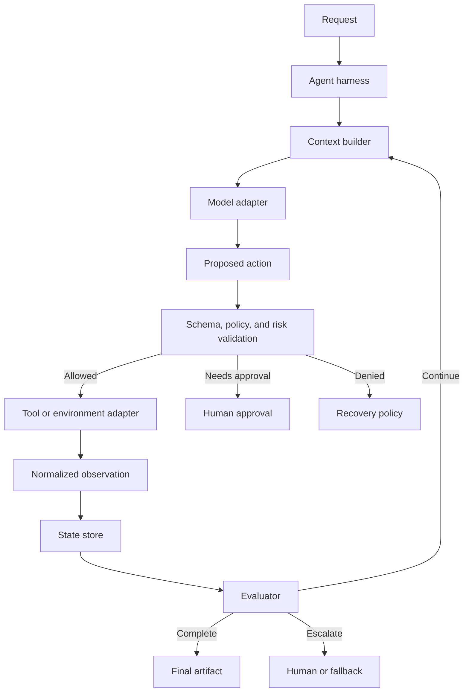
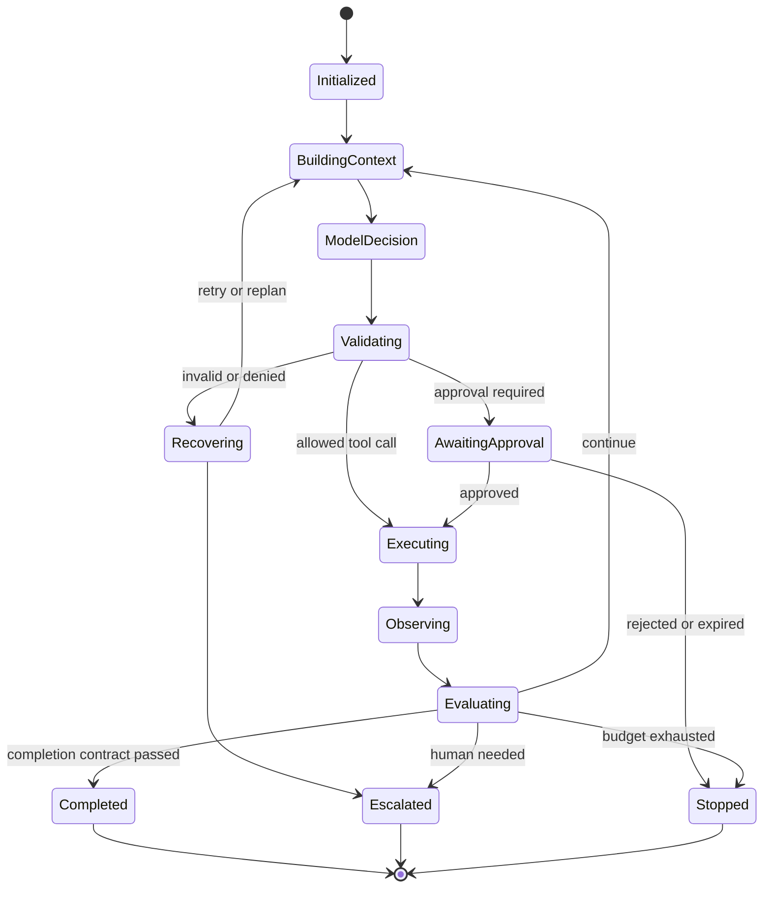
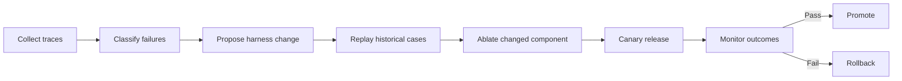

# Chapter 46 - Agent Harness Engineering

> **Source basis:** The board describes orchestration, tool routing, state, retries, guardrails, monitoring, approval, failure recovery, and framework control as separate production concerns [Board, pp. 15-18, 22-33, 35-40, 47]. This chapter combines them into **agent harness engineering**: the design of the runtime around a model that controls how it observes, reasons, acts, verifies, records state, and stops. The terminology and current research discussion are **Supplementary**.

---

## Learning objectives

By the end of this chapter, you should be able to:

1. Define an agent harness and distinguish it from a model, prompt, framework, and workflow.
2. Identify the interfaces and mechanisms that make a harness reliable.
3. Design a typed action-observation protocol.
4. Separate model policy from runtime policy.
5. Implement budgets, retries, verification, and stop conditions in code.
6. Design pluggable tools, memory, evaluators, and model adapters.
7. Build a harness that is testable without a live model.
8. Instrument traces and attribute outcomes to harness components.
9. Compare code-defined, graph-defined, and natural-language harnesses.
10. Evolve a harness safely using replay, ablation, and release gates.

---

## 1. What is an agent harness?

An agent harness is the runtime control system that surrounds a model and turns model outputs into a bounded, observable, and recoverable process.

A model can suggest:

- a plan;
- a tool call;
- a revised answer;
- a delegation;
- a completion decision.

The harness decides:

- what context the model receives;
- which tools are exposed;
- whether arguments are valid and authorized;
- whether a tool is actually executed;
- how observations are normalized;
- what state is persisted;
- whether to retry, replan, escalate, or stop;
- how budgets and timeouts are enforced;
- what is logged and evaluated.



A useful formula is:

> **Agent behavior = model capability × context quality × harness design × environment constraints.**

A stronger model inside a weak harness may perform worse than a smaller model inside a carefully engineered harness.

---

## 2. Harness, framework, workflow, and application

| Term | Meaning |
|---|---|
| Model | Produces predictions, text, actions, or evaluations |
| Prompt | Serialized instructions and context for one model call |
| Workflow | Ordered or conditional task structure |
| Framework | Library providing abstractions for agents, tools, graphs, teams, or tracing |
| Harness | Runtime policy and mechanisms controlling the complete agent execution |
| Application | User-facing system containing UX, auth, storage, APIs, and business logic |

LangGraph, CrewAI, AutoGen, LangChain, OpenAI Agents SDK, Google ADK, and other frameworks can help implement a harness. They are not the harness by themselves. Your configuration, adapters, policies, budgets, tests, and operational controls determine the actual harness.

---

## 3. The harness contract

A harness should expose a stable contract independent of the model provider.

```python
from typing import Protocol


class ModelAdapter(Protocol):
    async def decide(self, context: "DecisionContext") -> "ModelDecision": ...


class ToolAdapter(Protocol):
    async def execute(self, call: "ValidatedToolCall") -> "ToolObservation": ...


class Evaluator(Protocol):
    async def evaluate(self, state: "RunState") -> "Evaluation": ...


class StateStore(Protocol):
    async def load(self, run_id: str) -> "RunState": ...
    async def save(self, state: "RunState") -> None: ...
```

The harness can then swap:

- model providers;
- tool transports;
- persistence backends;
- evaluation methods;
- orchestration libraries;
- observability exporters.

---

## 4. The action-observation protocol

Model text should not be passed directly to an executor. Use typed decisions.

```json
{
  "decision_type": "tool_call",
  "tool_name": "get_order",
  "arguments": {"order_id": "O-123"},
  "reason_summary": "Order date is required to determine eligibility.",
  "expected_observation": "purchase date and item status",
  "confidence": 0.91
}
```

A normalized observation might be:

```json
{
  "tool_name": "get_order",
  "status": "success",
  "data": {
    "order_id": "O-123",
    "purchase_date": "2026-07-20",
    "item_status": "delivered"
  },
  "source": "orders-api",
  "duration_ms": 142,
  "attempt": 1,
  "side_effect": false
}
```

This separation enables validation, tracing, replay, and provider portability.

---

## 5. Model policy versus runtime policy

The model may be instructed to avoid unsafe actions, but the harness must enforce the boundary.

### 5.1 Model policy

Soft guidance such as:

- ask a clarifying question when required fields are missing;
- prefer read-only tools;
- explain uncertainty;
- use evidence before answering.

### 5.2 Runtime policy

Hard controls such as:

- deny access without scope;
- block cross-tenant reads;
- cap tool calls at ten;
- require approval for writes;
- reject invalid JSON;
- enforce timeouts;
- prevent duplicate side effects;
- abort on policy violation.

> **Rule**
>
> If violating a requirement could cause security, financial, legal, privacy, or operational harm, enforce it outside the model.

---

## 6. Harness interfaces

Research on code-as-harness and natural-language agent harnesses distinguishes the **interface** from the **mechanisms**. The interface is how the model observes and acts. The mechanisms are the control functions that make execution reliable.

### 6.1 Observation interface

Defines what the model can see:

- task goal;
- current state summary;
- tool schemas;
- retrieved evidence;
- prior observations;
- remaining budgets;
- evaluator feedback.

### 6.2 Action interface

Defines what the model may emit:

- answer;
- tool call;
- plan update;
- delegation;
- clarification;
- approval request;
- completion;
- escalation.

### 6.3 Environment interface

Defines how actions map to real systems:

- REST API;
- database transaction;
- browser or computer operation;
- code sandbox;
- message queue;
- MCP server;
- A2A agent;
- human review queue.

A narrow, typed interface reduces ambiguity and attack surface.

---

## 7. Core harness mechanisms

### 7.1 Context builder

Assembles authority, task, evidence, state, memory, tools, and output contracts.

### 7.2 Tool registry

Stores capability metadata:

```json
{
  "name": "update_shipping_address",
  "risk": "medium",
  "side_effect": true,
  "required_scopes": ["orders:write"],
  "requires_approval": true,
  "idempotent": true,
  "timeout_ms": 2000
}
```

### 7.3 Policy engine

Returns decisions such as:

- allow;
- deny;
- transform;
- require approval;
- redact;
- route to a safer tool;
- escalate.

### 7.4 State manager

Persists typed state with versioning and concurrency control.

### 7.5 Evaluator

Checks progress, evidence, policy, completion, and quality.

### 7.6 Recovery controller

Chooses between:

- retry;
- fallback;
- replan;
- ask user;
- escalate;
- safe stop.

### 7.7 Budget manager

Tracks:

- turns;
- tool calls;
- model calls;
- elapsed time;
- tokens;
- cost;
- retries;
- delegation depth;
- reflection rounds.

### 7.8 Trace recorder

Records model decisions, validated actions, observations, state transitions, evaluator outcomes, and policy decisions.

---

## 8. A reference harness state machine



Explicit state transitions make long-running execution resumable and auditable.

---

## 9. Code-defined, graph-defined, and natural-language harnesses

### 9.1 Code-defined harness

Control flow is implemented directly in Python or another language.

Strengths:

- precise enforcement;
- strong typing;
- easy integration with existing services;
- deterministic tests.

Weaknesses:

- policy may be scattered across code;
- changes require engineering deployment;
- harder for non-engineers to inspect.

### 9.2 Graph-defined harness

Nodes, edges, guards, and state define control flow.

Strengths:

- explicit topology;
- natural checkpointing and loops;
- visual inspection;
- clear branch coverage.

Weaknesses:

- graph complexity can become difficult to manage;
- business logic may leak into orchestration nodes.

### 9.3 Natural-language harness

Recent research explores representing high-level harness policy as portable natural-language artifacts executed by a shared runtime. This can improve inspectability and transfer, but critical controls still require a trusted runtime.

Strengths:

- readable policy;
- easier comparison and iteration;
- possible portability across runtimes.

Weaknesses:

- ambiguous interpretation;
- weaker guarantees;
- harder static analysis;
- risk of self-modification without governance.

### 9.4 Hybrid harness

A practical architecture uses:

- code for permissions, budgets, schemas, state, and side effects;
- graphs for explicit workflow structure;
- natural language for flexible task policy and model guidance.

---

## 10. Harness testing without a live model

A good harness can be tested with a scripted model adapter.

```python
class ScriptedModel:
    def __init__(self, decisions):
        self.decisions = iter(decisions)

    async def decide(self, context):
        return next(self.decisions)
```

This supports deterministic tests for:

- invalid tool arguments;
- permission denial;
- transient tool failure;
- duplicated action;
- approval timeout;
- no-progress loop;
- budget exhaustion;
- state resume;
- evaluator rejection;
- safe completion.

The model is one dependency. Harness correctness should not require nondeterministic model output in every test.

---

## 11. Verification in the harness

Verification may occur at several levels.

### 11.1 Schema verification

Does output conform to the required type?

### 11.2 Policy verification

Is the action allowed for this user, tenant, and workflow state?

### 11.3 Evidence verification

Does the answer cite and faithfully represent evidence?

### 11.4 Environment verification

Did the action produce the expected state change?

### 11.5 Completion verification

Are all acceptance criteria satisfied?

### 11.6 Formal verification

Emerging research investigates formal representations for agent workflows, temporal constraints, and tool-use safety. These techniques may be appropriate when a workflow has high-impact invariants such as:

- payroll cannot change without approved authorization;
- a transaction cannot be committed twice;
- private data cannot flow to an untrusted tool;
- every workflow must terminate or escalate;
- a required review cannot be bypassed.

---

## 12. Harness observability and attribution

A trace should make it possible to answer:

- Did the model propose a bad action?
- Did the context builder omit a required fact?
- Did the policy engine incorrectly allow or deny?
- Did the tool fail?
- Did state persistence lose information?
- Did the evaluator accept an incomplete result?
- Did the retry controller repeat an unproductive action?

Record component versions:

```json
{
  "model": "model-family/version",
  "prompt_version": "prompt-12",
  "harness_version": "harness-8",
  "tool_registry_version": "tools-17",
  "policy_version": "policy-31",
  "evaluator_version": "eval-9",
  "context_builder_version": "context-14"
}
```

Without version attribution, model upgrades and harness changes become confounded.

---

## 13. Harness evolution

The harness itself becomes a product.

A safe evolution cycle is:



### 13.1 Replay

Run candidate harness versions against recorded inputs, observations, or simulated environments.

### 13.2 Ablation

Change one mechanism at a time where possible:

- planner prompt;
- retry policy;
- tool discovery;
- context compression;
- evaluator;
- termination threshold.

### 13.3 Counterfactual analysis

Ask whether a different harness decision would have prevented the failure.

### 13.4 Release gates

Require no regression in:

- task success;
- safety;
- side-effect correctness;
- loop rate;
- latency;
- cost;
- escalation quality.

---

## 14. Scenario: support refund exception

A user asks for a refund outside the standard window.

The model may propose:

```json
{
  "decision_type": "tool_call",
  "tool_name": "issue_refund",
  "arguments": {"order_id": "O-902", "amount": 180.0}
}
```

The harness should:

1. validate the schema;
2. load current policy and order state;
3. verify user and tenant scopes;
4. classify the action as high impact;
5. check whether an exception reason exists;
6. create an approval packet bound to the exact arguments;
7. pause the workflow;
8. execute only after valid approval;
9. use an idempotency key;
10. perform a confirmation read;
11. record the outcome and receipt;
12. prevent another identical refund.

The harness, not the model, guarantees the control sequence.

---

## 15. Common harness anti-patterns

- a giant `while True` loop with no typed state;
- exposing every tool to every request;
- trusting model-generated authorization decisions;
- retrying all failures identically;
- storing only chat transcripts instead of state transitions;
- mixing business logic, policy, and model prompts in one function;
- no idempotency for write tools;
- evaluating only the final text;
- changing prompts, models, and harness logic simultaneously;
- assuming framework tracing is sufficient operational observability;
- allowing the model to increase its own budgets;
- letting natural-language policy override hard code constraints.

---

## 16. Hands-on lab

Use:

```text
examples/46-harness-engineering/harness_runtime_cli.py
```

The program contains a scripted model adapter, typed decisions, a tool registry, policy checks, retries, approval handling, state persistence, and trace output.

Example:

```bash
python harness_runtime_cli.py \
  --scenario harness_scenario.json \
  --max-turns 8 \
  --max-tool-calls 4 \
  --max-retries 2 \
  --approval-mode simulate-approve \
  --output harness_report.json
```

Try these modes:

```bash
--approval-mode simulate-reject
--inject-tool-failure
--resume-from checkpoint.json
--policy-profile strict
```

---

## 17. Production checklist

- [ ] model, tools, state, policy, and evaluator use explicit interfaces;
- [ ] actions and observations are typed;
- [ ] authorization is enforced before execution;
- [ ] side effects require idempotency and confirmation;
- [ ] budgets are immutable from the model's perspective;
- [ ] retries depend on failure classification;
- [ ] stop and escalation conditions are explicit;
- [ ] checkpoints support pause and resume;
- [ ] critical paths have deterministic tests;
- [ ] live-model tests are separated from harness tests;
- [ ] component versions appear in traces;
- [ ] replay and rollback procedures exist;
- [ ] sensitive data is excluded or redacted from telemetry;
- [ ] harness changes pass safety and outcome gates.

---

## 18. Summary

The harness is the engineered runtime that converts model proposals into controlled execution. It owns context construction, action validation, tool dispatch, state, verification, recovery, budgets, termination, human approval, and observability.

As models become more capable, harness quality becomes more important rather than less important. Greater capability expands the range of possible actions; the harness determines which actions are available, valid, safe, useful, and complete.

---

## References and further reading

- Merrill et al., *Natural-Language Agent Harnesses*, arXiv:2603.25723, 2026.
- *Code as Agent Harness*, arXiv:2605.18747, 2026.
- *Agentic Harness Engineering: Observability-Driven Harness Evolution*, arXiv:2604.25850, 2026.
- *Rethinking the Evaluation of Harness Evolution for Agents*, arXiv:2607.12227, 2026.
- OpenAI Agents SDK documentation: agents, tools, sessions, guardrails, handoffs, and tracing, accessed 2026.
- Microsoft Agent Framework documentation, accessed 2026.
