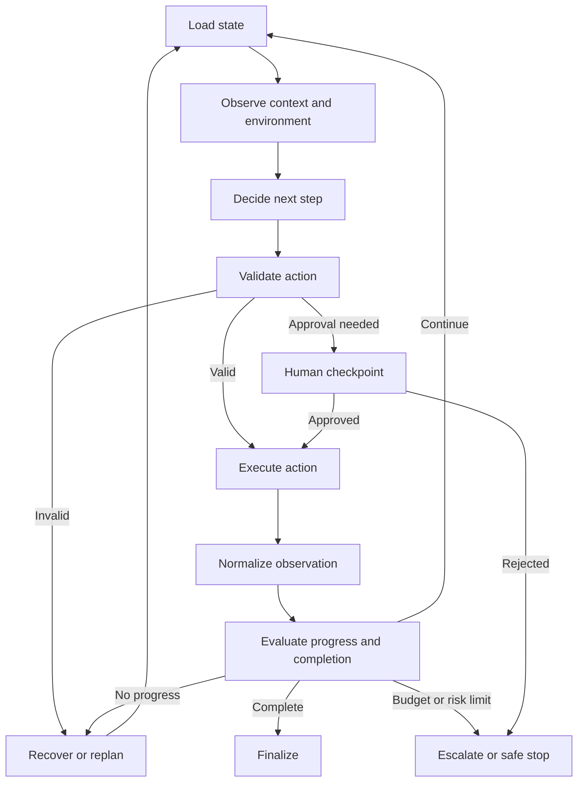
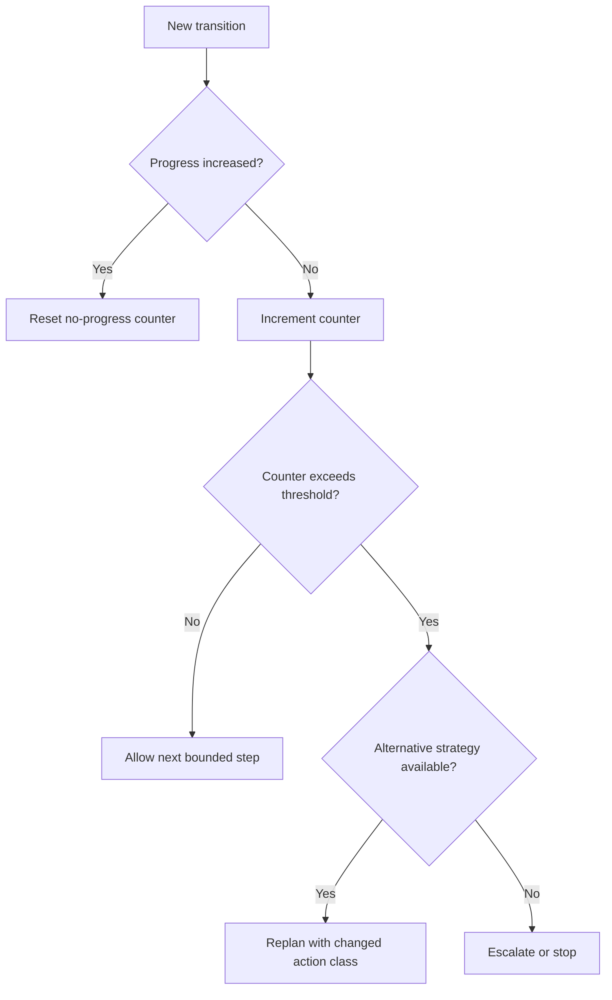
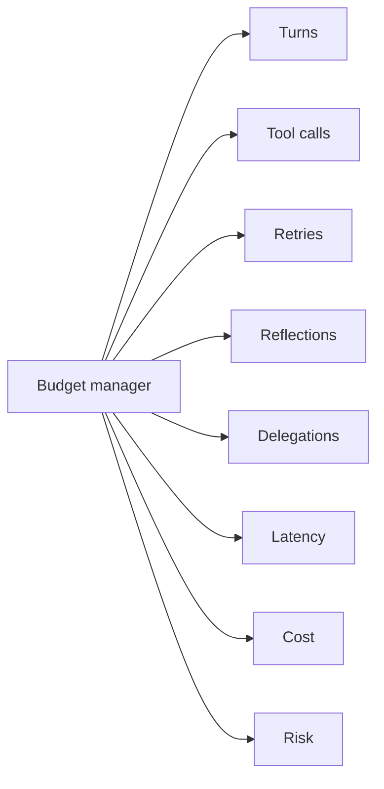

# Chapter 47 - Agent Loop Engineering

> **Source basis:** The board repeatedly uses loops for planning, tool execution, reflection, retry, review, failure recovery, and human escalation [Board, pp. 17, 21-22, 25-26, 34-36, 39, 47-50]. This chapter treats the loop itself as an engineering object: a controlled state machine with progress measures, verification, budgets, and termination. The detailed discipline is **Supplementary**.

---

## Learning objectives

By the end of this chapter, you should be able to:

1. Explain why an agent loop is different from an ordinary retry loop.
2. Identify the phases of a robust observe-decide-act-evaluate loop.
3. Define progress, completion, and no-progress conditions.
4. Choose when to reflect, verify, replan, retry, or escalate.
5. Allocate turn, tool, time, token, cost, and risk budgets.
6. Prevent infinite loops, livelock, repeated actions, and retry storms.
7. Use candidate generation and verification selectively.
8. Build loop controllers that are resumable and observable.
9. Evaluate trajectories rather than only final answers.
10. Implement a bounded scenario-driven loop controller.

---

## 1. The loop is the agent's control core

A single model call transforms input into output. An agent loop repeatedly transforms state.

```text
state_t
  -> observe
  -> decide
  -> validate
  -> act
  -> observe result
  -> evaluate progress
  -> state_t+1
```

The loop enables an agent to:

- gather missing information;
- call tools;
- react to failures;
- revise a plan;
- verify intermediate results;
- ask for human input;
- continue across long-running tasks.

It also creates the dominant reliability risks:

- uncontrolled cost;
- duplicated actions;
- infinite delegation;
- repeated failure;
- compounding errors;
- loss of state;
- premature completion;
- over-reflection;
- inability to explain the trajectory.

Loop engineering is therefore the discipline of making iterative agent behavior bounded, measurable, and productive.

---

## 2. A canonical loop



The important point is that **evaluation occurs after every meaningful transition**, not only at the end.

---

## 3. Loop state

A loop should not infer its history only from chat messages. Use typed state.

```json
{
  "run_id": "run-204",
  "goal": "produce a cited competitor comparison",
  "phase": "evidence_collection",
  "plan": ["find pricing", "find features", "verify dates", "write report"],
  "completed_steps": ["find pricing"],
  "pending_steps": ["find features", "verify dates", "write report"],
  "observations": [],
  "attempts_by_action": {},
  "repeated_action_count": 0,
  "progress_score": 0.25,
  "confidence": 0.61,
  "budgets": {
    "turns_remaining": 7,
    "tool_calls_remaining": 10,
    "seconds_remaining": 40,
    "cost_remaining_usd": 0.80
  },
  "status": "running"
}
```

A typed state supports:

- checkpointing;
- deterministic guards;
- progress measurement;
- replay;
- trace visualization;
- multi-agent coordination;
- safe resume after interruption.

---

## 4. Progress engineering

A loop must know whether it is moving toward completion.

### 4.1 Progress indicators

Depending on the task, progress may mean:

- required fields filled;
- subgoals completed;
- evidence coverage increased;
- uncertainty reduced;
- failing tests decreased;
- missing entities resolved;
- policy checks passed;
- unresolved contradictions decreased;
- human approval obtained.

### 4.2 Progress function

A simple weighted function is:

```text
progress =
  0.35 × completion_criteria_coverage
  + 0.25 × evidence_coverage
  + 0.20 × validation_pass_rate
  + 0.10 × uncertainty_reduction
  + 0.10 × state_consistency
```

The exact formula is domain-specific. The important requirement is that progress is observable and cannot be increased merely by producing more text.

### 4.3 No-progress detection

Declare no progress when one or more conditions hold:

- the progress score does not improve for N steps;
- the same action and arguments repeat;
- the same error category repeats;
- the plan changes but completed work does not;
- evidence coverage stays unchanged;
- the reviewer returns the same critique;
- delegated work cycles back to the same owner.



---

## 5. Completion engineering

A model saying "done" is not a completion condition.

A completion contract should include:

- required artifacts exist;
- schemas validate;
- mandatory evidence is present;
- policy checks pass;
- no unresolved critical errors remain;
- side effects are confirmed;
- citations support claims;
- output meets task-specific quality thresholds.

Example:

```json
{
  "required_fields": ["priority", "owner", "reason", "escalation_required"],
  "must_have_evidence": true,
  "minimum_confidence": 0.75,
  "critical_policy_violations_allowed": 0,
  "confirmation_read_required_for_write": true
}
```

The evaluator, not the generator, should decide whether the contract passes.

---

## 6. Decision points inside the loop

At each step, the controller may choose among:

- answer now;
- ask a question;
- retrieve evidence;
- call a tool;
- delegate;
- verify;
- reflect;
- revise the plan;
- request approval;
- escalate;
- stop safely.

The control policy should prefer the least costly action that can reduce uncertainty or satisfy a missing criterion.

---

## 7. Retry, replan, reflect, and verify are different

| Operation | Purpose | Appropriate trigger |
|---|---|---|
| Retry | Repeat substantially the same action | Transient failure, timeout, rate limit |
| Fallback | Use an alternate implementation | Primary tool unavailable |
| Replan | Change the sequence or action strategy | Original plan is blocked or incomplete |
| Reflect | Diagnose why the current result is weak | Quality or progress failure |
| Verify | Test a claim, artifact, or state transition | High uncertainty or high impact |
| Escalate | Transfer responsibility | Policy, risk, ambiguity, or budget limit |

A common anti-pattern is calling every second attempt "reflection" while repeating the same prompt.

### 7.1 Productive reflection

Reflection should produce a structured diagnosis:

```json
{
  "failure_type": "insufficient_evidence",
  "failed_criterion": "pricing_current_within_30_days",
  "cause": "only archived source retrieved",
  "proposed_change": "route to current pricing API",
  "expected_progress": "freshness criterion satisfied"
}
```

If the proposed change does not alter inputs, tools, constraints, or strategy, it is probably cosmetic reflection.

---

## 8. Knowing when to verify

Verification adds latency and cost. Verify selectively.

High-value triggers include:

- irreversible or high-impact action;
- low-confidence critical claim;
- conflicting evidence;
- generated code before execution;
- model-created SQL or shell commands;
- financial calculations;
- safety or compliance decision;
- final answer after a long trajectory;
- abnormal or out-of-distribution state.

```text
verification priority = impact × uncertainty × detectability gap
```

Research on inference-time scaling shows that additional rollouts and verification can improve performance, but gains vary by task and simply spending more tokens does not guarantee better results. Loop engineering therefore needs a **verification policy**, not a blanket "think longer" rule.

---

## 9. Candidate generation and selection

For difficult tasks, the loop may generate several candidates and select among them.

Patterns include:

- best-of-N;
- self-consistency;
- debate or critique;
- planner alternatives;
- tool-route alternatives;
- diverse retrieval queries;
- code candidates tested in a sandbox.

A candidate loop should define:

- diversity mechanism;
- maximum candidates;
- verifier or reward function;
- tie-breaking policy;
- cost ceiling;
- when not to branch.

Branching is wasteful for routine deterministic tasks.

---

## 10. Loop budgets

A loop should have several independent budgets.

### 10.1 Turn budget

Maximum model-decision cycles.

### 10.2 Tool budget

Maximum tool calls, optionally by risk class.

### 10.3 Retry budget

Maximum retries globally and per failure class.

### 10.4 Reflection budget

Maximum self-review rounds.

### 10.5 Delegation budget

Maximum hops, depth, and active workers.

### 10.6 Time budget

Deadline and per-step timeout.

### 10.7 Token and cost budgets

Maximum input, output, and total spend.

### 10.8 Risk budget

Maximum number or severity of actions before human review.



The model may observe remaining budgets but must not be able to increase them.

---

## 11. Loop safety

### 11.1 Idempotency

Repeated writes must not produce repeated side effects.

### 11.2 Action fingerprinting

Create a stable hash from tool, normalized arguments, target, and workflow intent. Block unproductive repeats.

### 11.3 Leases and ownership

In distributed or multi-agent loops, assign task ownership with expiration to prevent duplicate workers.

### 11.4 Interrupt, reset, and abort

- **Interrupt:** pause and preserve state.
- **Reset:** return to a known safe checkpoint.
- **Abort:** terminate and prevent further actions.

### 11.5 Fail closed for dangerous actions

When policy, identity, or approval systems are unavailable, sensitive writes should not continue.

---

## 12. Loop scheduling

### 12.1 Serial loops

One step at a time. Easier to reason about but potentially slow.

### 12.2 Parallel branches

Run independent checks concurrently.

```text
order lookup ─┐
policy lookup ├─> merge -> validate -> decide
warranty check┘
```

### 12.3 Event-driven loops

The loop sleeps until an external event occurs:

- tool callback;
- human approval;
- scheduled time;
- data-change notification;
- job completion.

### 12.4 Long-running loops

Require durable checkpoints, leases, versioned schemas, and resumable context.

---

## 13. Loop observability

Trace every transition with:

- run and step identifiers;
- state before and after;
- decision type;
- action fingerprint;
- model and prompt version;
- tool and policy versions;
- duration and cost;
- progress score;
- evaluator decision;
- remaining budgets;
- termination reason.

A trajectory view should show where time and failures accumulate.

```json
{
  "step": 5,
  "decision": "replan",
  "failure_type": "stale_evidence",
  "progress_before": 0.54,
  "progress_after": 0.67,
  "turns_remaining": 3,
  "tool_calls_remaining": 4
}
```

---

## 14. Trajectory evaluation

Final-answer evaluation can hide a wasteful or unsafe path.

Evaluate:

- plan quality;
- action relevance;
- tool selection;
- argument correctness;
- repeated-action rate;
- invalid-action rate;
- progress per step;
- recovery success;
- unnecessary reflection;
- delegation efficiency;
- approval correctness;
- termination correctness;
- cost per successful trajectory.

A correct answer reached through unauthorized data access is not a successful trajectory.

---

## 15. Scenario: competitive research loop

The board's flow is:

```text
query -> planner -> search agent -> analyst -> reviewer -> report
```

A loop-engineered version includes:

1. planner creates claim and evidence requirements;
2. search agent collects candidate sources;
3. evidence validator scores authority, freshness, and independence;
4. analyst creates claims linked to evidence;
5. reviewer checks unsupported or conflicting claims;
6. targeted replan retrieves only missing evidence;
7. completion evaluator checks citation and coverage contracts;
8. report is released or escalated.

No-progress conditions include:

- the same unsupported claim after two review rounds;
- no new independent source after a replan;
- repeated search queries with equivalent results;
- budget exhaustion before minimum coverage.

---

## 16. Failure patterns

### Infinite loop

No termination guard.

### Livelock

The agent changes plans repeatedly without completing work.

### Retry storm

Multiple workers retry the same failing dependency.

### Reflection spiral

Every weak result triggers another critique without changed evidence or action.

### Premature completion

The model declares success before the completion contract passes.

### Budget tunneling

Sub-agents or tools consume resources outside the main budget ledger.

### Hidden side-effect loop

A repeated action causes multiple external changes because idempotency is absent.

### State regression

A stale checkpoint overwrites newer progress.

---

## 17. Hands-on lab

Use:

```text
examples/47-loop-engineering/loop_controller_cli.py
```

The program executes a scripted scenario with progress scores, action fingerprints, retry classification, verification, budgets, checkpoints, and termination reasons.

Example:

```bash
python loop_controller_cli.py \
  --scenario loop_scenario.json \
  --max-turns 10 \
  --max-tool-calls 6 \
  --max-no-progress 2 \
  --verification-policy risk-aware \
  --checkpoint checkpoint.json \
  --output loop_report.json
```

Test failure modes:

```bash
--mode repeated-action
--mode transient-tool-failure
--mode unresolved-conflict
--mode approval-timeout
```

---

## 18. Design checklist

- [ ] the loop has typed state;
- [ ] every transition is explicit;
- [ ] progress is measurable;
- [ ] completion is externally evaluated;
- [ ] retries are limited and failure-aware;
- [ ] reflection must propose a materially different next step;
- [ ] action fingerprints detect repetition;
- [ ] side effects are idempotent;
- [ ] budgets cover turns, tools, time, tokens, cost, and risk;
- [ ] human checkpoints are resumable;
- [ ] loops can be interrupted, reset, and aborted;
- [ ] trajectory metrics are available;
- [ ] the termination reason is recorded;
- [ ] distributed workers share a global budget and ownership model.

---

## 19. Summary

Agent loops are not merely repeated model calls. They are controlled state transitions that must show measurable progress toward a verifiable completion contract. Reliable loops distinguish retry, replan, reflection, verification, and escalation; enforce multiple budgets; prevent repeated side effects; and record the full trajectory.

The best loop is not the longest or most reflective loop. It is the smallest bounded loop that can reliably complete the task, prove completion, and stop.

---

## References and further reading

- *Scaling Test-time Compute for LLM Agents*, arXiv:2506.12928, 2025.
- Wan et al., *Inference-Time Scaling of Verification: Self-Evolving Deep Research Agents via Test-Time Rubric-Guided Verification*, arXiv:2601.15808, 2026.
- Sun et al., *Learning from Failure: Inference-Time Self-Improvement for Computer-Use Agents*, arXiv:2606.31270, 2026.
- *SkillGen: Verified Inference-Time Agent Skill Synthesis*, arXiv:2605.10999, 2026.
- Hu et al., *Evaluating Memory in LLM Agents via Incremental Multi-Turn Interactions*, arXiv:2507.05257, revised 2026.
