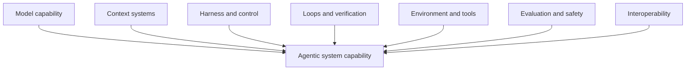
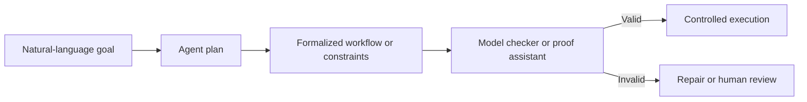
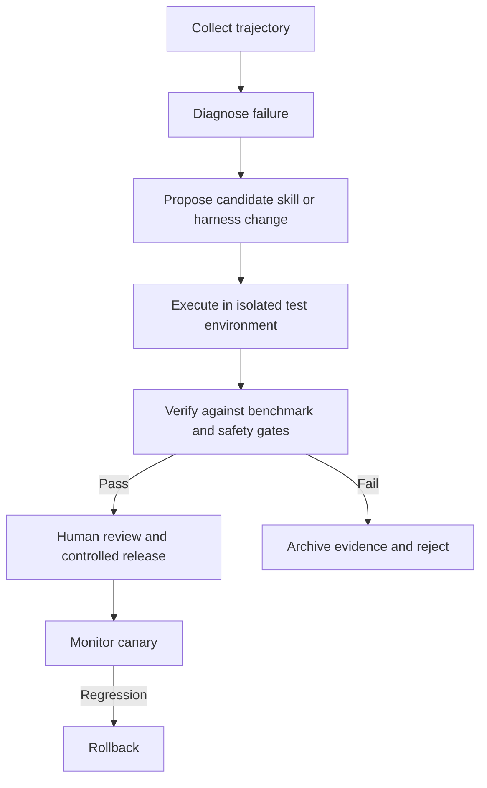
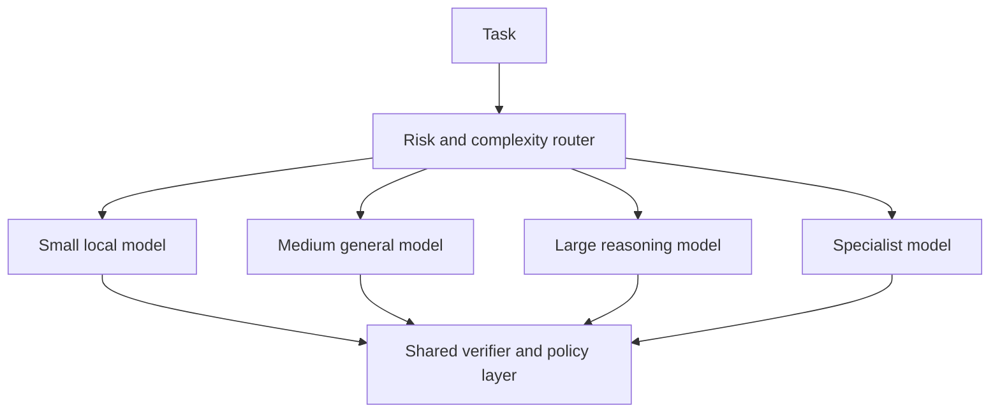

# Chapter 48 - Future Development and Research Frontiers in Agentic AI

> **Scope:** This chapter is **Supplementary**. It is based on current primary research and official technical documentation available through August 2026. Research directions are uncertain by definition; the chapter distinguishes demonstrated results, emerging trends, and informed projections. It does not treat speculative capabilities as established facts.

---

## Learning objectives

By the end of this chapter, you should be able to:

1. Identify the major research frontiers shaping agentic AI.
2. Distinguish model progress from context, harness, loop, and environment progress.
3. Explain why verification, formal methods, and test-time control are becoming central.
4. Describe emerging work in agent memory, self-improvement, skill acquisition, and lifelong learning.
5. Understand research on multi-agent evaluation, safety, and interpretability.
6. Explain the role of world models and embodied agents.
7. Assess interoperability and protocol evolution.
8. Build a practical research portfolio without overcommitting to hype.
9. Define evidence gates for adopting immature techniques.
10. Create a 12- to 24-month capability roadmap for an enterprise agent platform.

---

## 1. The next phase is systems research

The first wave of generative AI focused heavily on model scale and prompting. The next wave is increasingly about complete systems:

- context engineering;
- harness engineering;
- loop and test-time compute engineering;
- verification;
- memory and continual adaptation;
- interoperable tools and agents;
- secure action execution;
- multimodal and embodied interaction;
- evaluation of long trajectories;
- system-level interpretability.



An important planning implication follows:

> Future capability gains may come from improving the system around a model as often as from replacing the model itself.

---

## 2. Context engineering becomes a first-class discipline

The 2025 context-engineering survey formalized a broad taxonomy spanning retrieval, generation, processing, management, memory, tool-integrated reasoning, and multi-agent implementations. Current research is moving beyond static RAG toward context that is:

- dynamically selected;
- authority-aware;
- compressed and re-expanded;
- personalized under privacy constraints;
- revised from interaction outcomes;
- routed among specialized agents;
- evaluated for contribution to task success.

### Likely development areas

1. **Context compilers:** systems that transform task contracts into optimized context layouts.
2. **Learned context routers:** policies that choose retrieval, memory, tools, or clarification.
3. **Context contribution attribution:** measuring which context items caused useful or harmful decisions.
4. **Long-context efficiency:** better inference architectures, caching, and hierarchical processing.
5. **Context security:** formal separation of instructions, evidence, memory, and untrusted content.
6. **Context evolution:** systems that update reusable context based on verified outcomes.

### Adoption guidance

Near-term enterprise value is strongest in context observability, authorization-aware retrieval, memory governance, and structured compression. Fully autonomous context evolution remains a research area and should require offline evaluation and human approval.

---

## 3. Harness engineering becomes an optimization target

Recent 2026 research treats the agent harness as a scientific object rather than hidden controller code. Papers on natural-language harnesses, code-as-harness, observability-driven harness evolution, and harness evaluation argue that performance depends heavily on how the surrounding runtime structures reasoning, tools, memory, feedback, and termination.

### Likely development areas

- portable harness specifications;
- automated harness synthesis;
- trace-driven harness repair;
- harness component ablation;
- policy-as-code combined with natural-language control;
- standardized harness benchmarks;
- harness marketplaces or reusable capability packs;
- formally constrained self-modifying harnesses.

### Key risk

A system that changes its own harness can alter its effective permissions, stopping behavior, or evaluation criteria. Self-modification should be treated as a code change with tests, review, provenance, and rollback.

---

## 4. Verification and inference-time scaling

Research through 2025 and 2026 increasingly explores improving results during execution rather than only through model training. Techniques include:

- multiple candidate rollouts;
- rubric-guided verification;
- adaptive tool-based checking;
- self-critique and revision;
- listwise candidate selection;
- failure diagnosis;
- inference-time skill synthesis;
- formal validation of plans and actions.

DeepVerifier reports gains from rubric-guided iterative verification on difficult deep-research benchmarks. Other work finds that more test-time compute can help but has diminishing or task-dependent returns. This supports a selective strategy:

```text
high impact or high uncertainty
  -> spend more verification compute
routine and low risk
  -> use the direct bounded path
```

### Likely development areas

1. verifier models specialized by domain;
2. proof-carrying tool calls;
3. adaptive verification budgets;
4. external verifiers for code, math, SQL, policy, and business invariants;
5. verification ensembles;
6. formal and probabilistic verification combined in one control plane.

---

## 5. Formal methods for agents

Agent workflows are often specified in natural language and implemented through probabilistic decisions. Research such as Lean4Agent and work bridging LLM planning with temporal logic explores formal representations for workflow invariants and trajectory verification.

Potential enterprise invariants include:

- no payroll write without valid approval;
- no data transfer from a restricted source to an untrusted tool;
- no order refund above a threshold without dual control;
- every long-running workflow eventually completes, escalates, or stops;
- an approved action cannot execute with changed arguments;
- a state transition cannot skip required review.

### Likely architecture



Formal methods will not replace empirical evaluation. They can provide guarantees for narrowly defined invariants while model behavior remains probabilistic elsewhere.

---

## 6. Verifiably safe tool use

Tool use turns language generation into real action. Research on verifiably safe tool use examines information-flow control, temporal constraints, and tool-call sequences rather than checking each call in isolation.

### Research questions

- Can a sequence of individually allowed calls create a forbidden outcome?
- Can sensitive data flow indirectly through intermediate tools?
- Can temporal rules guarantee approval before execution?
- Can action plans be checked before any side effect occurs?
- Can agent permissions be represented as machine-checkable capabilities?

### Likely development areas

- capability-based tool authorization;
- taint tracking for sensitive data;
- sequence-level policy checking;
- typed effect systems for tools;
- sandboxed action previews;
- transaction and compensation verification;
- zero-trust agent architectures.

---

## 7. Memory, personalization, and lifelong learning

Agent memory research is rapidly expanding but terminology and evaluation remain fragmented. Current work distinguishes several representations and operations and calls for better multi-turn, incremental benchmarks.

### Emerging directions

1. **Selective memory formation:** deciding what is worth retaining.
2. **Memory consolidation:** turning episodes into stable semantic or procedural memory.
3. **Correction and forgetting:** propagating user corrections and complying with deletion.
4. **Dual-scale memory:** combining fast episodic storage with slower learned adaptation.
5. **Skill libraries:** retaining verified procedures rather than raw conversations.
6. **Lifelong learning:** adapting from interactions without catastrophic forgetting.
7. **Personalization under privacy:** useful user models with strict scope and consent.

### Critical unresolved issues

- memory poisoning;
- stale preferences;
- false autobiographical records;
- cross-user leakage;
- retention compliance;
- self-reinforcing errors;
- evaluation over months rather than sessions.

The near-term safe pattern is governed external memory with explicit writes and deletions. Autonomous parameter updates from production interactions require substantially stronger controls.

---

## 8. Self-improving and self-evolving agents

Research roadmaps describe agents that improve through interaction, failure analysis, self-play, synthetic tasks, skill acquisition, and verifier feedback.

Demonstrated directions include:

- failure-driven inference-time patches for computer-use agents;
- skill synthesis followed by empirical verification;
- rubric-guided iterative improvement;
- skill libraries combined with reinforcement learning;
- continual learning frameworks with learner-verifier separation.

### A safe improvement loop



A system should not be considered self-improving merely because it retries or rewrites a prompt. Improvement requires a persistent change that produces measured gains on held-out tasks without unacceptable regressions.

---

## 9. World models, computer use, and embodied agents

Embodied-agent research integrates multimodal perception, physical and mental world models, memory, planning, and action. Computer-use agents are a near-term digital form of embodiment: they observe interfaces, predict state changes, and execute actions.

### Research frontiers

- predictive models of environment dynamics;
- multimodal state estimation;
- long-horizon action planning;
- causal and counterfactual simulation;
- retrieval-augmented world models;
- learned user-intent models;
- safe control under partial observability;
- simulation-to-real transfer;
- multi-agent embodied collaboration.

### Enterprise relevance

Near-term applications include:

- laboratory and manufacturing assistance;
- digital operations and desktop automation;
- warehouse and service robotics;
- multimodal safety inspection;
- field-service copilots;
- wearable contextual assistants.

These systems require stronger environment verification and fail-safe controls because errors can affect real systems or physical spaces.

---

## 10. Multi-agent systems move from topology to coordination science

Multi-agent research is shifting from demonstrating that agents can talk to evaluating whether they collaborate effectively.

MultiAgentBench evaluates collaboration and competition across interactive scenarios. TAMAS examines adversarial risk unique to multi-agent dynamics. Research agendas also call for mechanistic and system-level interpretability of multi-agent behavior.

### Open questions

- When does specialization improve outcomes enough to justify coordination cost?
- How should credit and blame be assigned across agents?
- How can correlated hallucinations be detected?
- How should shared memory and private reasoning be separated?
- What communication protocol minimizes information loss?
- How can coalitions, collusion, or cascading compromise be detected?
- Which topologies work under latency and cost constraints?

### Likely development areas

- typed inter-agent messages;
- learned routing and team formation;
- dynamic agent creation with budget controls;
- coordination benchmarks;
- multi-agent security monitoring;
- team-level verification and interpretability;
- protocol-level interoperability through A2A.

---

## 11. System-level interpretability

Model interpretability alone is insufficient for agentic systems. An agent's behavior emerges over time from context, model decisions, tool outputs, state, memory, policy, and other agents.

Research on interpreting agentic systems argues for methods that analyze temporal dynamics and compounding decisions. Agentic interpretability research also explores interactive systems that help humans form better models of an AI system. Other 2026 work uses agents to automate mechanistic interpretability workflows.

### Likely layers of explanation

1. **model-level:** what internal representations influenced an output;
2. **decision-level:** why a tool or route was selected;
3. **trajectory-level:** how earlier observations changed later actions;
4. **policy-level:** which constraint allowed or blocked behavior;
5. **organization-level:** how multiple agents influenced the final outcome;
6. **counterfactual:** what would have changed the decision.

Production systems should prioritize faithful system-level traces now, while deeper mechanistic techniques mature.

---

## 12. Evaluation becomes continuous and self-updating

Static benchmarks become stale as models, tools, policies, and attacks evolve. AgenticEval proposes continuously evolving safety benchmarks generated from policy documents. Broader surveys describe evaluation across behavior, capability, reliability, and safety.

### Likely development areas

- automatically mined regression cases from incidents;
- evolving adversarial suites;
- trajectory-based judges;
- environment simulators;
- causal evaluation of harness components;
- continuous slice discovery;
- evaluator calibration and drift monitoring;
- benchmark governance and provenance.

An evaluation system that generates its own tests must still be protected from benchmark corruption and reward hacking.

---

## 13. Interoperability and open protocols

MCP standardizes how applications connect to tools, resources, and prompts. A2A standardizes communication among independent agentic systems. Both ecosystems are evolving rapidly.

Future development is likely to include:

- richer capability discovery;
- identity assertion and delegated authorization;
- protocol-native observability;
- portable approvals and consent;
- signed agent cards and tool manifests;
- compatibility testing;
- cross-protocol policy enforcement;
- portable artifacts and task state;
- marketplaces with stronger provenance and trust scoring.

Protocol adoption reduces custom integration work but expands the supply-chain attack surface. Enterprise platforms will need registries, allowlists, version gates, and continuous trust assessment.

---

## 14. Smaller models, local agents, and heterogeneous systems

Agent systems increasingly combine different models:

- small local classifiers for routing;
- medium models for routine tasks;
- large reasoning models for difficult cases;
- specialist vision or code models;
- deterministic verifiers;
- local models for privacy-sensitive tasks.

Research on inference-time scaling for local computer-use agents shows that strategies effective for frontier models may not transfer directly under resource constraints. The future architecture is therefore likely to be heterogeneous rather than one universal model.



---

## 15. Research portfolio for engineering teams

A balanced portfolio separates horizons.

### Horizon 1: production now

- typed state and tools;
- authorization-aware RAG;
- context budgeting;
- deterministic guardrails;
- human approval;
- evaluation datasets;
- trajectory tracing;
- idempotent actions;
- model and tool routing.

### Horizon 2: controlled pilots

- dynamic context routing;
- learned reranking;
- verifier-guided revision;
- portable MCP and A2A integrations;
- multi-agent specialist teams;
- governed long-term memory;
- computer-use agents in sandboxed environments;
- DSPy or automated prompt optimization.

### Horizon 3: research watch

- autonomous harness evolution;
- continual parameter learning from production;
- formal verification of broad workflows;
- self-generated skill libraries with autonomous promotion;
- mechanistic interpretability for multi-agent systems;
- embodied agents in unstructured physical settings;
- self-harnessing controllers.

---

## 16. Evidence gates for adopting research

Before adopting a new technique, ask:

1. Has it been reproduced beyond the original benchmark?
2. Does it improve held-out tasks rather than only the development set?
3. What is the latency and cost impact?
4. Does it create new security or privacy risks?
5. Can it be disabled or rolled back?
6. Can the behavior be observed and evaluated?
7. Does it work with your model and environment?
8. Is the gain from the technique or from additional compute?
9. Does it preserve performance on critical slices?
10. Who is accountable for approving the change?

### Research maturity labels

| Label | Meaning |
|---|---|
| Demonstrated | Multiple credible evaluations and practical implementations |
| Emerging | Promising evidence but limited replication or narrow environments |
| Exploratory | Early paper, prototype, or conceptual agenda |
| Speculative | Plausible direction without sufficient empirical support |

---

## 17. A 12- to 24-month platform roadmap

### Quarter 1-2

- create canonical state, action, observation, and evaluation contracts;
- standardize tracing and version attribution;
- build context observability;
- establish safety and outcome regression suites;
- inventory tool permissions and side effects.

### Quarter 3-4

- add model and tool routing;
- introduce governed memory;
- deploy verifier-guided paths for high-risk tasks;
- pilot MCP servers and A2A specialists behind gateways;
- run harness ablation experiments.

### Year 2

- evaluate formal workflow constraints for selected high-impact processes;
- introduce skill libraries with human-reviewed promotion;
- test safe computer-use agents in isolated workspaces;
- automate incident-to-regression conversion;
- investigate context and harness optimization with controlled canaries;
- establish a research governance board for self-modifying systems.

---

## 18. Hands-on lab

Use:

```text
examples/48-future-directions/research_portfolio_cli.py
```

The program scores research initiatives by evidence strength, business value, reversibility, risk, platform readiness, and time horizon.

Example:

```bash
python research_portfolio_cli.py \
  --scenario research_scenario.json \
  --risk-tolerance medium \
  --horizon-months 18 \
  --budget 100 \
  --output roadmap.json
```

The output groups initiatives into production, pilot, research-watch, and reject categories and records the evidence gates required for promotion.

---

## 19. Knowledge checks

1. Why are context, harness, and loop improvements distinct from model improvements?
2. What is inference-time scaling, and why can more computation fail to help?
3. Which agent invariants are candidates for formal verification?
4. What makes a persistent change count as genuine self-improvement?
5. Why is memory governance central to lifelong agents?
6. What new risks arise in multi-agent systems?
7. How do world models support embodied agents?
8. Why does system-level interpretability differ from model interpretability?
9. What are the enterprise benefits and risks of MCP and A2A?
10. How should a team separate production, pilot, and research-watch investments?

---

## 20. Summary

The future of agentic AI is unlikely to be determined by a single model or framework. Progress is occurring across context systems, harnesses, verification loops, formal methods, memory, self-improvement, world models, multi-agent coordination, interpretability, evaluation, and open protocols.

The most defensible engineering strategy is to build a stable platform of typed contracts, observability, safety, evaluation, and rollback. That platform allows teams to adopt new research selectively without tying business reliability to unverified claims.

---

## Selected primary research references

- Mei et al., *A Survey of Context Engineering for Large Language Models*, arXiv:2507.13334, 2025.
- Liu et al., *A Comprehensive Survey on Long Context Language Modeling*, arXiv:2503.17407, 2025.
- Merrill et al., *Natural-Language Agent Harnesses*, arXiv:2603.25723, 2026.
- *Code as Agent Harness*, arXiv:2605.18747, 2026.
- *Agentic Harness Engineering: Observability-Driven Harness Evolution*, arXiv:2604.25850, 2026.
- Wan et al., *Inference-Time Scaling of Verification*, arXiv:2601.15808, 2026.
- *Scaling Test-time Compute for LLM Agents*, arXiv:2506.12928, 2025.
- Sun et al., *Learning from Failure: Inference-Time Self-Improvement for Computer-Use Agents*, arXiv:2606.31270, 2026.
- *SkillGen: Verified Inference-Time Agent Skill Synthesis*, arXiv:2605.10999, 2026.
- Hu et al., *Evaluating Memory in LLM Agents via Incremental Multi-Turn Interactions*, arXiv:2507.05257, revised 2026.
- Zheng et al., *Lifelong Learning of Large Language Model based Agents: A Roadmap*, arXiv:2501.07278, revised 2026.
- Fung et al., *Embodied AI Agents: Modeling the World*, arXiv:2506.22355, 2025.
- Zhu et al., *MultiAgentBench*, arXiv:2503.01935, 2025.
- Kavathekar et al., *TAMAS: Benchmarking Adversarial Risks in Multi-Agent LLM Systems*, arXiv:2511.05269, 2025.
- *Lean4Agent: Formal Modeling and Verification for Agent Workflow and Trajectory*, arXiv:2606.06523, 2026.
- *Towards Verifiably Safe Tool Use for LLM Agents*, arXiv:2601.08012, 2026.
- *Interpreting Agentic Systems: Beyond Model Explanations to System-Level Interpretability*, arXiv:2601.17168, 2026.
- Khan et al., *Can Language Model Agents be Helpful Circuit Explainers in Mechanistic Interpretability?*, arXiv:2606.24026, 2026.
